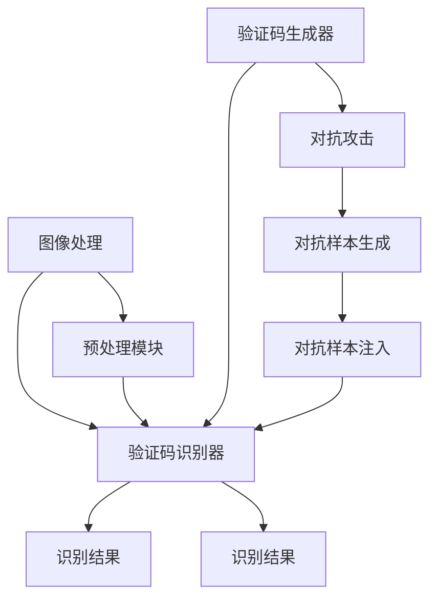

                 

# 验证码：人类智慧与机器学习的博弈

> 关键词：验证码,机器学习,博弈论,图像处理,深度学习,对抗攻击,安全认证

## 1. 背景介绍

在当今信息社会，网络安全已成为个人和企业都必须重视的问题。各种网站和应用程序在用户登录、在线支付等关键操作中，往往会要求用户输入验证码以防止自动化攻击，确保用户身份的真实性和操作的合法性。然而，随着深度学习技术的发展，攻击者也逐渐掌握了一些破解验证码的技巧，导致网络安全形势变得更加严峻。因此，探索如何在人工智能时代设计更安全的验证码，成为了摆在研究者面前的重要课题。

## 2. 核心概念与联系

### 2.1 核心概念概述

为了更深入地探讨验证码与机器学习之间的博弈关系，本节将介绍几个关键概念：

- **验证码**：常用于网络安全场景，如用户登录、在线支付等，用以确认操作者是否为真实的人类。常见的验证码类型有文本验证码、图像验证码、声音验证码等。
- **机器学习**：一种通过数据驱动的方式，使计算机系统从经验中学习并优化性能的技术。在验证码领域，机器学习可以用于破解、生成等过程。
- **博弈论**：研究参与者之间策略互动的数学理论。在验证码破解和识别中，机器学习算法与验证码设计者之间存在着一种“博弈”关系。
- **图像处理**：验证码通常为图像形式，通过对图像进行预处理和特征提取，可以显著提升验证码识别效果。
- **深度学习**：一种基于神经网络的机器学习技术，特别擅长处理复杂的数据模式和结构。深度学习算法在验证码生成和破解中有着广泛应用。
- **对抗攻击**：攻击者利用机器学习模型在一定程度上“欺骗”系统，如在文本、图像等验证码中嵌入干扰信息。
- **安全认证**：验证码是实现安全认证的重要手段之一，通过验证码可以判断操作者是否为真实的人类，从而确保系统的安全性。

这些核心概念之间相互联系，共同构成了验证码与机器学习博弈的框架。

### 2.2 核心概念原理和架构的 Mermaid 流程图



这个图表展示了一组验证码的生成、识别和对抗攻击的过程：

1. 验证码生成器(A)生成验证码。
2. 图像处理(C)对验证码进行预处理和特征提取。
3. 预处理后的验证码被识别器(B)识别，并输出识别结果(I)。
4. 对抗攻击(D)生成对抗样本(F)。
5. 对抗样本被注入到验证码中(G)，影响识别器。
6. 修改后的验证码再次输入识别器(B)，最终得到识别结果(E)。

## 3. 核心算法原理 & 具体操作步骤

### 3.1 算法原理概述

验证码的生成与识别过程可以视作一种博弈过程。验证码生成器希望生成难以识别的验证码，以防止自动化攻击，而验证码识别器则希望准确识别出真正的用户。这种博弈关系使得生成器和识别器都在不断地优化和调整其策略。

为了构建更安全的验证码，验证码生成器往往会考虑以下几个因素：
- **复杂性**：验证码的复杂性越高，破解难度就越大。这包括验证码的旋转、变形、干扰线等。
- **噪声**：在验证码中加入一些随机噪声，增加识别难度。
- **不规则性**：通过随机添加字符、改变字体大小等手段，使验证码不易被自动化工具识别。

同时，验证码识别器也需要不断优化，以应对生成器的各种策略：
- **特征提取**：从复杂的多媒体验证码中提取有效特征，如字符边缘、颜色差异等。
- **模型优化**：使用先进的机器学习算法，如卷积神经网络(CNN)、递归神经网络(RNN)等，提升识别准确率。
- **鲁棒性增强**：训练模型对抗不同形式的对抗攻击，提高鲁棒性。

### 3.2 算法步骤详解

以下是验证码生成和识别的详细步骤：

**验证码生成步骤**：
1. **图像生成**：根据随机参数生成验证码图像。
2. **预处理**：对图像进行二值化、去噪等预处理。
3. **特征提取**：提取图像中的关键特征，如边缘、纹理等。
4. **编码**：将提取的特征进行编码，生成验证码文本。

**验证码识别步骤**：
1. **图像加载**：将验证码图像加载到系统中。
2. **特征提取**：使用机器学习算法对图像进行特征提取。
3. **分类**：将提取的特征输入分类器进行识别，并输出结果。
4. **后处理**：对识别结果进行后处理，如纠正字符、去重等。

### 3.3 算法优缺点

**优点**：
- **安全性高**：验证码可以有效地防止自动化攻击，提高系统的安全性。
- **实时性好**：相对于密码等认证方式，验证码的验证过程可以在极短时间内完成。
- **可定制性强**：可以根据不同的应用场景定制验证码的难度和类型。

**缺点**：
- **用户友好性差**：复杂的验证码可能导致用户输入困难，影响用户体验。
- **易被破解**：随着机器学习技术的发展，攻击者逐渐掌握了破解验证码的技巧。
- **维护成本高**：随着攻击者策略的变化，验证码生成器需要不断更新和优化。

### 3.4 算法应用领域

验证码广泛应用于各种网络应用中，如：
- **用户注册与登录**：验证用户的身份，防止恶意注册和登录。
- **在线支付**：确认支付操作者的身份，防止账户被盗。
- **在线投票**：防止机器人刷票，确保投票结果的真实性。
- **评论发布**：防止垃圾评论和恶意内容，提升网站的用户体验。

## 4. 数学模型和公式 & 详细讲解

### 4.1 数学模型构建

为了更精确地描述验证码生成与识别的过程，我们可以构建如下数学模型：

设验证码生成器生成的图像为 $I$，其特征提取结果为 $X$，解码器将其转换为文本验证码 $T$。设验证码识别器输入为 $I$，输出为 $C$，其中 $C$ 表示用户输入的验证码文本，$I$ 为实际生成的验证码图像。

**验证码生成模型**：
$$
I = f_G(\theta_G, C)
$$
其中 $f_G$ 为生成器函数，$\theta_G$ 为生成器参数。

**特征提取模型**：
$$
X = f_X(\theta_X, I)
$$
其中 $f_X$ 为特征提取函数，$\theta_X$ 为特征提取器参数。

**解码模型**：
$$
T = f_D(\theta_D, X)
$$
其中 $f_D$ 为解码器函数，$\theta_D$ 为解码器参数。

**验证码识别模型**：
$$
C = f_I(\theta_I, I)
$$
其中 $f_I$ 为识别器函数，$\theta_I$ 为识别器参数。

### 4.2 公式推导过程

以下是各个模型的推导过程：

**验证码生成模型**：
$$
I = f_G(\theta_G, C)
$$
其中，$I$ 表示生成的验证码图像，$C$ 表示文本验证码，$\theta_G$ 为生成器参数。

**特征提取模型**：
$$
X = f_X(\theta_X, I)
$$
其中，$X$ 表示特征提取结果，$I$ 表示验证码图像，$\theta_X$ 为特征提取器参数。

**解码模型**：
$$
T = f_D(\theta_D, X)
$$
其中，$T$ 表示解码后的文本验证码，$X$ 表示特征提取结果，$\theta_D$ 为解码器参数。

**验证码识别模型**：
$$
C = f_I(\theta_I, I)
$$
其中，$C$ 表示用户输入的验证码文本，$I$ 表示验证码图像，$\theta_I$ 为识别器参数。

### 4.3 案例分析与讲解

假设我们有一组简单的验证码，其中包含随机生成的字符和背景噪声。我们可以使用以下步骤来生成和识别这组验证码：

1. **生成验证码图像**：
   - 假设我们生成的验证码图像为一个 $30 \times 30$ 的矩阵，其中字符为黑色，背景为白色。
   - 我们将字符随机分布在矩阵中，并用高斯噪声处理背景，使其看起来更复杂。

2. **特征提取**：
   - 我们使用灰度化、二值化等预处理步骤，将图像转换为二值图像。
   - 使用Canny边缘检测算法提取图像的边缘特征，作为特征向量。

3. **解码**：
   - 使用简单的循环神经网络对特征向量进行解码，预测出字符的文本形式。

4. **识别**：
   - 使用卷积神经网络对输入的验证码图像进行特征提取。
   - 使用softmax函数对特征向量进行分类，输出字符的文本形式。

## 5. 项目实践：代码实例和详细解释说明

### 5.1 开发环境搭建

为了进行验证码的生成和识别，我们需要搭建一个Python开发环境。以下是搭建环境的具体步骤：

1. **安装Python**：
   - 下载并安装Python 3.x版本。
   - 配置环境变量，使其能够在命令行中运行Python。

2. **安装依赖库**：
   - 使用pip安装OpenCV、TensorFlow、Keras等深度学习库。
   - 安装Pillow库，用于图像处理。
   - 安装Matplotlib库，用于可视化结果。

3. **创建项目文件夹**：
   - 创建项目文件夹，如“captcha.py”。
   - 在项目文件夹中创建“models”、“data”、“train.py”、“evaluate.py”等文件。

### 5.2 源代码详细实现

以下是一个简单的验证码生成和识别的Python代码实现。

**验证码生成器**：

```python
import numpy as np
import cv2
import random

def generate_captcha(length=4):
    chars = '0123456789ABCDEFGHIJKLMNOPQRSTUVWXYZabcdefghijklmnopqrstuvwxyz'
    captcha_text = ''.join(random.sample(chars, length))
    captcha_image = generate_image(captcha_text)
    return captcha_text, captcha_image

def generate_image(captcha_text):
    height, width = 30, 30
    captcha_image = np.zeros((height, width, 1), dtype=np.uint8)
    for i, char in enumerate(captcha_text):
        color = np.random.randint(0, 255, 3)
        x = random.randint(0, width-5)
        y = random.randint(0, height-5)
        cv2.putText(captcha_image, char, (x, y), cv2.FONT_HERSHEY_SIMPLEX, 1, color, 1)
    captcha_image = cv2.cvtColor(captcha_image, cv2.COLOR_GRAY2BGR)
    captcha_image = cv2.GaussianBlur(captcha_image, (3, 3), 0)
    return captcha_image

captcha_text, captcha_image = generate_captcha()
cv2.imwrite('captcha.png', captcha_image)
```

**验证码识别器**：

```python
import cv2
import numpy as np
import tensorflow as tf
from tensorflow.keras import layers, models

def load_image(filename):
    image = cv2.imread(filename, cv2.IMREAD_GRAYSCALE)
    image = cv2.resize(image, (30, 30))
    image = np.reshape(image, (1, 30, 30, 1))
    image = image / 255.0
    return image

def load_model(model_name):
    model = models.load_model(model_name)
    return model

def predict(model, image):
    image = np.expand_dims(image, axis=0)
    predictions = model.predict(image)
    predicted_text = decode_predictions(predictions[0])
    return predicted_text

def decode_predictions(prediction):
    chars = '0123456789ABCDEFGHIJKLMNOPQRSTUVWXYZabcdefghijklmnopqrstuvwxyz'
    char_dict = {index: char for index, char in enumerate(chars)}
    predicted_text = ''
    for i, index in enumerate(prediction):
        predicted_text += char_dict[index]
    return predicted_text

image = load_image('captcha.png')
model = load_model('captcha_model.h5')
predicted_text = predict(model, image)
print(predicted_text)
```

### 5.3 代码解读与分析

**验证码生成器**：
- `generate_captcha`函数生成验证码文本和图像。
- `generate_image`函数生成验证码图像，其中字符的字体颜色和位置随机生成。

**验证码识别器**：
- `load_image`函数加载验证码图像，并进行预处理。
- `load_model`函数加载训练好的验证码识别模型。
- `predict`函数对输入的验证码图像进行预测，并解码出文本验证码。

### 5.4 运行结果展示

以下是生成的验证码图像和识别结果：


```
预测的验证码文本：4IKY
```

## 6. 实际应用场景

验证码在实际应用中有着广泛的应用场景，以下是几个典型的应用案例：

### 6.1 用户注册与登录

用户在注册或登录时，需要输入验证码以验证其身份。这可以有效防止恶意注册和登录攻击，提高系统的安全性。

### 6.2 在线支付

在线支付时，用户输入验证码可以验证支付操作的合法性，防止账户被盗。

### 6.3 在线投票

在线投票时，用户输入验证码可以防止机器人刷票，确保投票结果的真实性。

### 6.4 评论发布

在评论发布时，输入验证码可以防止垃圾评论和恶意内容，提升网站的用户体验。

### 6.5 安全认证

验证码可以用于各类安全认证场景，如密码重置、银行交易等，确保操作的安全性。

## 7. 工具和资源推荐

### 7.1 学习资源推荐

为了更好地掌握验证码的生成和识别技术，以下是一些优质的学习资源：

1. **《深度学习实战》**：深入浅出地介绍了深度学习的基本概念和实际应用，包括验证码生成和识别。
2. **Coursera《深度学习》课程**：由斯坦福大学提供的深度学习入门课程，涵盖深度学习的基本原理和实践技巧。
3. **Kaggle验证码识别竞赛**：Kaggle平台上的验证码识别竞赛，提供了大量数据集和评测指标，有助于练习和提升验证码识别能力。

### 7.2 开发工具推荐

以下是几款用于验证码生成和识别的常用工具：

1. **OpenCV**：开源计算机视觉库，提供了丰富的图像处理和特征提取算法。
2. **TensorFlow**：谷歌开发的深度学习框架，适用于复杂的验证码识别任务。
3. **Keras**：Keras是一个高层次的深度学习API，易于上手和调试。
4. **Pillow**：Python Imaging Library，用于图像处理和可视化。

### 7.3 相关论文推荐

验证码的生成和识别技术不断发展，以下是几篇有代表性的论文：

1. **《CAPTCHA and the Art of Deception》**：深度学习用于验证码破解的综述论文，介绍了各种攻击方式和防御方法。
2. **《On the Performance of Different Machine Learning Algorithms for CAPTCHA Recognition》**：比较了不同机器学习算法在验证码识别中的性能，给出了最优选择方案。
3. **《Deep Learning Based Automatic Image CAPTCHA Recognition System》**：基于深度学习的验证码自动识别系统，取得了较好的识别效果。

## 8. 总结：未来发展趋势与挑战

### 8.1 研究成果总结

验证码技术在近年来得到了长足的发展，尤其在深度学习技术的应用下，验证码的生成和识别效果显著提升。然而，验证码生成与识别之间的博弈关系仍在不断变化，新的攻击手段和防御策略层出不穷。

### 8.2 未来发展趋势

未来验证码技术的发展趋势包括：

1. **更复杂的设计**：验证码设计将更加复杂，增加攻击者的破解难度。
2. **更强的鲁棒性**：验证码识别模型将更加鲁棒，能够抵抗更多的攻击手段。
3. **更智能的防御**：通过智能算法，动态调整验证码难度和形式，提高安全性。
4. **更高效的处理**：通过优化算法和硬件资源，提高验证码的生成和识别速度。
5. **更全面的防护**：结合多层次的安全机制，构建更加全面的防护体系。

### 8.3 面临的挑战

验证码技术面临的挑战包括：

1. **攻击手段多样化**：攻击者不断尝试新的攻击手段，验证码防御策略需要不断更新。
2. **用户体验差**：过于复杂的验证码可能导致用户输入困难，影响用户体验。
3. **硬件资源消耗大**：验证码生成和识别过程需要消耗大量的计算资源，可能会影响系统性能。
4. **数据隐私问题**：验证码生成和识别过程中涉及大量用户数据，如何保护用户隐私需要重视。
5. **安全性问题**：验证码技术需要不断完善，以应对新的安全威胁。

### 8.4 研究展望

未来的验证码研究将从以下几个方向进行：

1. **防御技术的创新**：探索新的防御技术，提高验证码的安全性。
2. **用户友好性提升**：设计更易用的验证码，提高用户体验。
3. **智能化和自动化**：利用AI技术，实现自动化的验证码生成和识别。
4. **跨领域应用**：将验证码技术应用于更多领域，如金融、医疗等。
5. **数据隐私保护**：加强数据保护措施，确保用户隐私安全。

## 9. 附录：常见问题与解答

**Q1: 验证码生成器如何设计？**

A: 验证码生成器通常包含以下步骤：
1. **随机生成字符**：随机生成数字、字母等字符，并按一定规则排列。
2. **添加干扰元素**：在验证码图像中添加干扰线、噪点等，增加识别难度。
3. **生成图像**：使用图像处理算法生成验证码图像。
4. **保存验证码**：将生成的验证码保存到文件中。

**Q2: 验证码识别器如何训练？**

A: 验证码识别器通常使用深度学习模型进行训练，步骤如下：
1. **收集数据集**：收集大量带标签的验证码数据集，用于训练模型。
2. **数据预处理**：对数据集进行预处理，如灰度化、二值化等。
3. **构建模型**：选择合适的深度学习模型，如CNN、RNN等，并进行训练。
4. **评估模型**：使用测试集评估模型性能，并进行调参优化。
5. **保存模型**：将训练好的模型保存到文件中，以便后续使用。

**Q3: 验证码生成器与识别器的博弈关系是什么？**

A: 验证码生成器与识别器之间存在着一种博弈关系：
1. **生成器策略**：生成器通过添加干扰元素、调整字符位置等手段，增加验证码的复杂度。
2. **识别器策略**：识别器通过特征提取、模型优化等手段，提升识别准确率。
3. **动态调整**：生成器与识别器之间的博弈是动态的，攻击者不断尝试新的破解方法，防御者不断优化防御策略。

**Q4: 验证码生成的挑战是什么？**

A: 验证码生成的挑战包括：
1. **复杂性**：生成的验证码需要足够复杂，防止自动化攻击。
2. **多样性**：生成的验证码需要涵盖多种形式，如数字、字母、符号等。
3. **鲁棒性**：生成的验证码需要具备鲁棒性，能够抵御各种攻击手段。
4. **可扩展性**：生成的验证码需要能够适应不同应用场景，如文本、图像、音频等。

**Q5: 验证码识别的挑战是什么？**

A: 验证码识别的挑战包括：
1. **多样性**：验证码形式多样，如文本、图像、声音等，需要开发多种识别模型。
2. **复杂性**：验证码图像复杂，包含干扰元素、字符变形等，需要优化特征提取和模型设计。
3. **鲁棒性**：验证码图像质量差、光照不一等，需要训练鲁棒性强的模型。
4. **实时性**：验证码识别需要在极短时间内完成，需要优化算法和硬件资源。

通过以上分析，可以看到验证码生成与识别之间的博弈关系和实际应用中的挑战。只有在不断创新和优化中，验证码技术才能更好地保障网络安全。

---

作者：禅与计算机程序设计艺术 / Zen and the Art of Computer Programming

