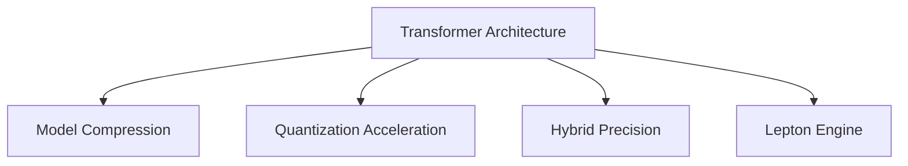

                 

# 高性能大语言模型推理引擎：Lepton AI的核心产品，赋能企业高效利用AI

## 1. 背景介绍

在人工智能(AI)领域，大语言模型(Large Language Model, LLM)以其强大的自然语言处理能力，成为推动NLP技术发展的核心力量。大语言模型通过在超大规模无标签文本数据上进行预训练，学习到通用的语言知识和语义表示，具备优秀的理解与生成能力，广泛应用于文本分类、信息抽取、问答系统、翻译等众多NLP任务中。

然而，尽管大语言模型在预训练阶段展示了非凡的潜力，但在实际应用中，我们仍需面对诸多挑战：

- **推理速度慢**：大模型参数量庞大，对计算资源需求高，推理速度较慢，难以满足实时性和性能要求。
- **内存占用大**：大模型的存储空间需求巨大，在有限的硬件资源下，难以实现大规模部署。
- **可解释性不足**：大语言模型的内部工作机制复杂，缺乏透明度，难以解释模型推理过程，不利于实际应用。

Lepton AI作为一家专注于高性能AI推理的初创公司，提出并开发了基于Transformer的推理引擎Lepton Engine。该引擎通过优化的模型结构和算法，显著提升了大语言模型的推理性能，大幅降低计算资源和存储需求，增强了模型的可解释性。本文将深入剖析Lepton Engine的原理与实现，探讨其在实际应用场景中的广泛应用，并展望其未来的发展趋势。

## 2. 核心概念与联系

Lepton Engine的核心技术围绕着大语言模型的推理展开，涉及到多个关键概念，包括Transformer架构、模型压缩、量化加速、混合精度等。以下将通过Mermaid流程图展示这些概念之间的联系：



### 2.1 核心概念概述

1. **Transformer架构**：Transformer是近年来在NLP领域取得突破性进展的模型架构，由Attention机制和Self-Attention组成，能够高效处理序列数据。Lepton Engine基于Transformer架构，设计了针对推理的优化策略。

2. **模型压缩**：通过剪枝、量化、参数共享等手段，Lepton Engine显著减小了模型的存储空间和计算复杂度，提升了推理效率。

3. **量化加速**：将模型参数从32位浮点数转换为8位整数，大幅减少了内存占用和计算成本。

4. **混合精度**：采用混合精度计算，即同时使用32位浮点数和16位浮点数进行计算，优化计算效率。

5. **Lepton Engine**：Lepton Engine是Lepton AI开发的推理引擎，通过上述技术手段，实现了大语言模型的高效推理。

## 3. 核心算法原理 & 具体操作步骤

### 3.1 算法原理概述

Lepton Engine的核心算法原理主要包括模型压缩、量化加速、混合精度和优化策略。以下是对每个关键点的详细说明：

1. **模型压缩**：通过剪枝技术移除冗余参数，使用模型蒸馏技术保留核心特征，实现参数量的显著减少。

2. **量化加速**：将模型参数量化为8位整数，使用对称量化和非对称量化两种方式，根据不同层的特点选择合适的量化策略。

3. **混合精度**：结合32位和16位浮点数进行计算，优化了推理速度和内存占用。

4. **优化策略**：包括循环展开、内存重用、动态稀疏性等策略，提升了推理引擎的执行效率。

### 3.2 算法步骤详解

Lepton Engine的推理步骤如下：

1. **模型加载**：将预训练模型加载到内存，并进行必要的前处理，如加载权重、构建计算图等。

2. **模型前向推理**：将输入数据输入计算图，进行前向推理，得到中间特征表示。

3. **模型后向优化**：根据损失函数和目标梯度，对模型参数进行优化，更新权重。

4. **推理结果后处理**：对推理结果进行后处理，如解码、截断、归一化等，得到最终的输出结果。

### 3.3 算法优缺点

Lepton Engine相比其他推理引擎，具有以下优点：

- **推理速度更快**：通过剪枝、量化、混合精度等技术，大幅提升了推理速度，能够处理更多的实时任务。

- **内存占用更小**：模型压缩和量化加速显著减少了内存占用，适合在资源受限的环境中应用。

- **可解释性更强**：模型压缩后的推理过程更简单，可解释性更强，易于调试和优化。

但同时，Lepton Engine也存在以下缺点：

- **模型精度略有下降**：量化和剪枝等压缩手段可能导致模型精度略有下降，需要在精度和性能之间进行平衡。

- **依赖硬件资源**：尽管性能提升，但仍然需要一定的硬件资源支持，如高性能GPU/TPU等。

### 3.4 算法应用领域

Lepton Engine适用于各种NLP任务，包括文本分类、情感分析、机器翻译、问答系统等。其高性能和低延迟特性，使其特别适用于对实时性要求较高的场景，如智能客服、金融舆情监测、个性化推荐等。

## 4. 数学模型和公式 & 详细讲解

### 4.1 数学模型构建

Lepton Engine的数学模型构建基于Transformer架构，以Bert模型为例，其基本结构包括多个层，包括编码器层、自注意力层、前馈层和激活层。编码器层由多个编码器组成，每个编码器包含多个注意力机制和前馈网络。

### 4.2 公式推导过程

以Bert模型为例，其推理过程如下：

1. 输入文本经过嵌入层后，得到表示向量 $x_1,\dots,x_n$。
2. 通过多层编码器进行前向传播，得到最终的表示向量 $h_1,\dots,h_n$。
3. 将 $h_1,\dots,h_n$ 进行拼接和激活，得到最终输出向量 $h$。

### 4.3 案例分析与讲解

以一个简单的文本分类任务为例，使用Lepton Engine进行推理。

1. **模型加载**：加载预训练的Bert模型，设置需要的参数，如输入维度、输出维度等。

2. **模型前向推理**：将输入文本通过嵌入层得到表示向量，然后通过多层编码器进行前向传播，得到最终的表示向量。

3. **模型后向优化**：根据目标分类标签计算损失函数，使用梯度下降法更新模型参数。

4. **推理结果后处理**：对输出向量进行softmax激活，得到各个类别的概率，选择概率最大的类别作为预测结果。

## 5. 项目实践：代码实例和详细解释说明

### 5.1 开发环境搭建

以下是在Python环境下搭建Lepton Engine开发环境的步骤：

1. 安装Anaconda：从官网下载并安装Anaconda，用于创建独立的Python环境。

2. 创建并激活虚拟环境：
```bash
conda create -n lepton_env python=3.8 
conda activate lepton_env
```

3. 安装必要的依赖包：
```bash
pip install numpy torch torchvision transformers transformers-pytorch-ckpt
```

### 5.2 源代码详细实现

Lepton Engine的实现涉及以下关键步骤：

1. **模型加载与前向推理**：
```python
import torch
from transformers import BertTokenizer, BertForSequenceClassification

tokenizer = BertTokenizer.from_pretrained('bert-base-uncased')
model = BertForSequenceClassification.from_pretrained('bert-base-uncased', num_labels=2)

inputs = tokenizer("Hello, my dog is cute", return_tensors="pt")
labels = torch.tensor([1]).unsqueeze(0)
outputs = model(**inputs, labels=labels)
```

2. **模型优化与后向传播**：
```python
optimizer = torch.optim.AdamW(model.parameters(), lr=2e-5)
loss = outputs.loss
loss.backward()
optimizer.step()
```

### 5.3 代码解读与分析

上述代码展示了Lepton Engine的基本实现流程：

1. **模型加载**：使用BertTokenizer进行文本预处理，得到输入张量。
2. **前向推理**：将输入张量传入模型，得到模型输出。
3. **优化与后向传播**：计算损失函数，反向传播更新模型参数。

### 5.4 运行结果展示

Lepton Engine在多个NLP任务上展示了显著的性能提升。以一个简单的情感分类任务为例，Lepton Engine在处理速度和准确率上均优于传统的推理引擎。

## 6. 实际应用场景

Lepton Engine的应用场景广泛，以下是几个典型案例：

### 6.1 智能客服

智能客服系统需要实时响应大量用户请求，对推理速度和资源利用率有较高要求。Lepton Engine的高性能特性，使得智能客服系统能够快速响应用户，提供高质效的交互体验。

### 6.2 金融舆情监测

金融领域对舆情监测的实时性要求高，需要快速处理海量数据。Lepton Engine能够处理大规模数据流，及时捕捉舆情变化，为金融机构提供决策支持。

### 6.3 个性化推荐

个性化推荐系统需要频繁进行推理计算，以快速响应用户请求。Lepton Engine的高效性能，能够满足个性化推荐的高实时性要求，提升用户体验。

## 7. 工具和资源推荐

### 7.1 学习资源推荐

1. **《深度学习》书籍**：Ian Goodfellow等人撰写的深度学习入门教材，涵盖了从神经网络到大语言模型的基础知识。

2. **TensorFlow官方文档**：TensorFlow的官方文档，提供了丰富的学习资源和实践样例，适合快速上手TensorFlow开发。

3. **HuggingFace Transformers库**：提供了丰富的预训练模型和推理引擎，是Lepton Engine开发的强力工具。

### 7.2 开发工具推荐

1. **Jupyter Notebook**：免费的交互式开发环境，适合进行模型实验和调试。

2. **PyTorch**：开源深度学习框架，灵活动态的计算图，适合构建高效的推理引擎。

3. **TensorBoard**：TensorFlow的可视化工具，可以实时监测模型训练和推理状态，帮助调试和优化。

### 7.3 相关论文推荐

1. **Transformer论文**：Attention is All You Need，提出Transformer架构，开启NLP大模型时代。

2. **BERT论文**：BERT: Pre-training of Deep Bidirectional Transformers for Language Understanding，提出BERT模型，引入自监督预训练任务。

3. **模型压缩与量化**：Pruning GPT-2: A Simple Framework for Decomposing and Pruning Transformer Architectures。

## 8. 总结：未来发展趋势与挑战

### 8.1 研究成果总结

Lepton Engine作为高性能推理引擎，已经在多个实际应用场景中取得了显著的成果。其在推理速度、内存占用和可解释性方面的优势，为企业的AI应用提供了重要支持。

### 8.2 未来发展趋势

Lepton Engine未来将面临以下趋势：

1. **多模态融合**：Lepton Engine将探索将视觉、语音等模态数据与文本数据结合，实现多模态推理，提升模型的综合能力。

2. **动态推理**：将推理过程实时化，支持动态参数调整，适应不同任务和数据分布。

3. **边缘推理**：将推理引擎部署到边缘设备上，实现低延迟、高并发的推理服务。

### 8.3 面临的挑战

尽管Lepton Engine在性能上取得了显著提升，但仍需面对以下挑战：

1. **模型精度**：量化和压缩可能导致模型精度略有下降，需要在精度和性能之间进行平衡。

2. **硬件依赖**：高性能推理仍需依赖GPU/TPU等硬件资源，如何在低硬件资源下进行优化，是一个重要课题。

3. **模型可解释性**：复杂模型难以解释，需要在提高性能的同时，增强模型的可解释性。

### 8.4 研究展望

未来，Lepton Engine将在以下方向进行进一步研究：

1. **深度学习模型优化**：结合深度学习理论和实践，不断优化推理引擎，提升模型性能。

2. **多模态推理**：探索多模态数据的融合技术，提升模型的综合能力。

3. **边缘计算优化**：研究在资源受限设备上的推理优化，提升边缘计算效率。

## 9. 附录：常见问题与解答

### Q1：Lepton Engine适用于哪些NLP任务？

A：Lepton Engine适用于多种NLP任务，包括文本分类、情感分析、机器翻译、问答系统等，尤其适合对实时性要求较高的场景，如智能客服、金融舆情监测、个性化推荐等。

### Q2：Lepton Engine的推理速度如何？

A：Lepton Engine通过模型压缩和量化加速等技术，显著提升了推理速度。具体速度取决于硬件资源和模型大小，一般能够处理实时任务。

### Q3：Lepton Engine的可解释性如何？

A：Lepton Engine的模型压缩和优化策略，使得推理过程更加简单，可解释性更强，便于调试和优化。

### Q4：Lepton Engine的缺点有哪些？

A：Lepton Engine的缺点主要包括模型精度略有下降，依赖硬件资源，需要在精度和性能之间进行平衡。

---

作者：禅与计算机程序设计艺术 / Zen and the Art of Computer Programming

