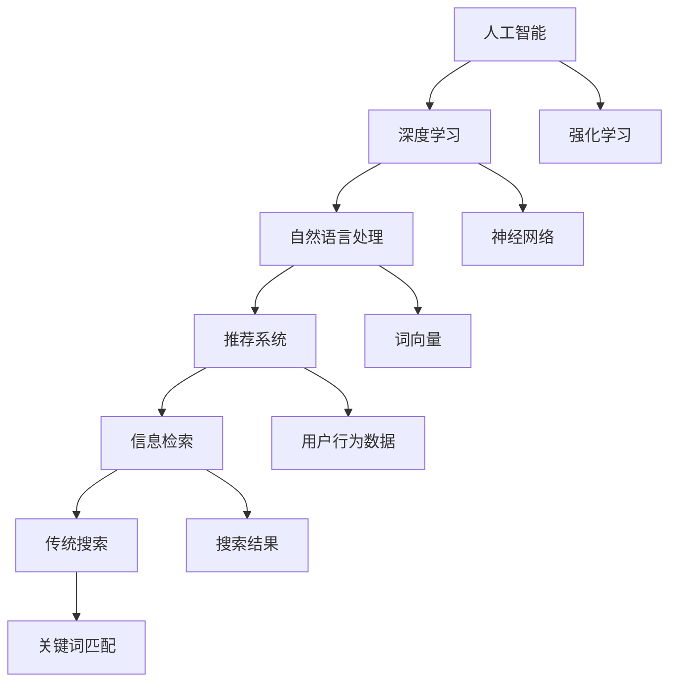

                 

# AI vs 传统搜索：谁将主导未来

> 关键词：人工智能, 传统搜索, 信息检索, 推荐系统, 自然语言处理, 深度学习, 强化学习, 搜索引擎, 可解释性, 用户体验

## 1. 背景介绍

在互联网时代，搜索引擎（如Google, Bing）成为了用户获取信息的主要途径。然而，随着信息量的爆炸式增长，传统搜索的效率和体验逐渐受到挑战。与此同时，人工智能技术的迅猛发展为搜索方式带来了革新：AI驱动的智能搜索和推荐系统正在逐步崛起，引领着未来的信息获取方式。

### 1.1 问题由来

传统搜索依赖于关键词匹配，基于统计学和语法结构，对语义理解和上下文信息缺乏深度处理能力。这种搜索方式在信息简单、需求明确的情况下效果尚可，但在面对复杂、多样化的信息需求时，常常难以匹配到用户真正关心的内容。

与传统搜索不同，AI驱动的搜索和推荐系统利用深度学习、自然语言处理和强化学习等技术，具备更加智能的语义理解和上下文理解能力。通过学习大量数据，AI系统能够理解用户需求，自动生成相关搜索结果或推荐内容。AI技术的引入，正在逐步改变用户获取信息的方式和体验。

## 2. 核心概念与联系

### 2.1 核心概念概述

为了深入理解AI与传统搜索之间的竞争和融合，我们首先介绍几个核心概念：

- **人工智能（AI）**：通过模拟人类智能过程实现复杂任务的能力，包括机器学习、深度学习、自然语言处理（NLP）等技术。
- **传统搜索（Search）**：基于关键词匹配的技术，通过算法将用户查询与网页内容进行匹配，提供搜索结果。
- **信息检索（IR）**：通过自动化过程获取和组织信息，以用户查询为输入，返回相关的信息。
- **推荐系统（Recommendation System）**：通过分析用户行为数据，预测用户兴趣，推荐相关信息或产品。
- **自然语言处理（NLP）**：让计算机能够理解和处理人类语言，包括词向量表示、文本分类、序列标注、机器翻译等。
- **深度学习（Deep Learning）**：基于神经网络的学习范式，通过多层网络结构提取数据特征。
- **强化学习（Reinforcement Learning, RL）**：通过与环境的交互，学习最优决策策略。

这些概念之间的联系可以从以下Mermaid流程图来展示：



## 3. 核心算法原理 & 具体操作步骤

### 3.1 算法原理概述

AI与传统搜索的竞争主要体现在以下几个方面：

- **深度学习与传统检索**：深度学习通过学习大量的文本数据，自动提取和匹配语义信息，避免了传统关键词检索的局限性。
- **推荐系统与信息检索**：推荐系统利用用户历史行为数据，预测用户需求，提供个性化搜索结果，而传统信息检索则基于静态索引，难以适应动态变化的用户需求。
- **自然语言处理与传统搜索**：NLP技术通过理解自然语言，将复杂的查询转换为结构化的语义表示，提升搜索结果的相关性。
- **强化学习与搜索算法**：RL技术通过迭代优化，自动调整搜索结果排序，提升用户体验。

### 3.2 算法步骤详解

#### 3.2.1 深度学习驱动的搜索

1. **数据收集**：收集大规模的文本数据，如维基百科、新闻、书籍等。
2. **预处理**：对文本进行分词、去除停用词、词干提取等处理，构建词向量表示。
3. **模型训练**：利用深度神经网络，如BERT、GPT等模型，训练语言理解模型。
4. **查询匹配**：输入用户查询，通过深度学习模型生成语义表示，与文本数据进行匹配，返回相关搜索结果。
5. **后处理**：对搜索结果进行排序、去重、过滤等处理，提升用户体验。

#### 3.2.2 推荐系统驱动的搜索

1. **用户行为数据收集**：收集用户的浏览历史、点击记录、评分等行为数据。
2. **用户画像建立**：利用协同过滤、内容推荐等算法，建立用户兴趣模型。
3. **推荐模型训练**：基于用户画像和物品特征，训练推荐模型。
4. **查询扩展**：将用户查询扩展为推荐列表，提升搜索结果的多样性和相关性。
5. **搜索结果展示**：将推荐内容与传统搜索结果融合展示，提升用户体验。

#### 3.2.3 自然语言处理驱动的搜索

1. **语义解析**：利用NLP技术对用户查询进行语义解析，生成结构化表示。
2. **语义匹配**：通过文本匹配算法，将查询与文本数据进行语义匹配。
3. **结果排名**：根据匹配度、相关性等指标，对搜索结果进行排序。
4. **反馈机制**：收集用户反馈数据，进一步优化搜索模型。

### 3.3 算法优缺点

#### 3.3.1 深度学习驱动的搜索

**优点**：
- 可以理解复杂的语义信息，提升搜索结果的相关性和多样性。
- 通过深度学习模型，自动提取和匹配语义信息，避免人工干预。

**缺点**：
- 需要大量的标注数据和计算资源，训练复杂，部署成本高。
- 对新领域数据泛化能力有限，需要持续优化和更新。

#### 3.3.2 推荐系统驱动的搜索

**优点**：
- 利用用户历史行为数据，提供个性化搜索结果。
- 可以动态调整搜索结果，提升用户体验。

**缺点**：
- 依赖于用户历史数据，用户隐私问题突出。
- 难以处理冷启动用户和冷门物品。

#### 3.3.3 自然语言处理驱动的搜索

**优点**：
- 能够理解自然语言查询，提升用户搜索体验。
- 可以处理多语言、长文本等复杂查询。

**缺点**：
- 对语义理解的深度和广度有限，仍需改进。
- 需要大量标注数据，构建高质量语义模型。

### 3.4 算法应用领域

#### 3.4.1 搜索引擎领域

在搜索引擎领域，AI驱动的深度学习技术和推荐系统技术得到了广泛应用。Google的BERT、Elasticsearch的深度学习搜索引擎等都是典型代表。通过这些技术，搜索引擎能够提供更加智能的搜索结果，提升用户体验。

#### 3.4.2 电子商务领域

在电子商务领域，推荐系统被广泛应用于商品推荐、广告投放等场景。Amazon、京东等电商平台的个性化推荐系统，利用用户行为数据和商品特征，精准匹配用户需求，提升销售转化率。

#### 3.4.3 新闻媒体领域

在新闻媒体领域，AI驱动的语义搜索和个性化推荐被广泛应用。通过自然语言处理技术，自动提取新闻内容的关键信息，实现基于用户兴趣的个性化推荐，提升新闻阅读体验。

## 4. 数学模型和公式 & 详细讲解 & 举例说明

### 4.1 数学模型构建

在深度学习驱动的搜索中，我们可以使用BERT等模型进行语义表示。对于用户查询$q$和文本$t$，可以定义以下数学模型：

$$
f(q, t) = \text{BERT}(q) \cdot \text{BERT}(t)
$$

其中，$\text{BERT}(q)$和$\text{BERT}(t)$分别表示用户查询和文本的BERT向量表示。$f(q, t)$表示两者之间的语义相似度。

在推荐系统中，我们可以使用协同过滤或内容推荐算法构建用户兴趣模型。假设用户$u$对物品$i$的评分表示为$r_{ui}$，推荐模型可以表示为：

$$
p(u, i) = \sum_{j=1}^{n} \alpha_{uj} f(u, j) \cdot f(i, j)
$$

其中，$f(u, j)$和$f(i, j)$分别表示用户$u$和物品$i$与物品$j$的相似度，$\alpha_{uj}$为权重。

### 4.2 公式推导过程

对于深度学习驱动的搜索，我们可以通过以下步骤推导语义相似度公式：

1. 输入用户查询$q$和文本$t$。
2. 通过BERT模型将查询和文本转换为向量表示。
3. 计算两者向量内积，得到语义相似度$f(q, t)$。

对于推荐系统，我们可以利用协同过滤算法推导推荐模型公式：

1. 收集用户$u$对物品$i$的评分数据。
2. 计算物品$i$和$j$的相似度。
3. 利用相似度构建用户$u$对物品$i$的预测评分$p(u, i)$。

### 4.3 案例分析与讲解

以Amazon的推荐系统为例，分析其技术架构和效果。Amazon利用协同过滤和深度学习技术，构建了复杂的推荐引擎。通过收集用户历史行为数据，利用协同过滤算法建立用户兴趣模型，再利用深度学习模型对推荐结果进行优化。通过不断迭代优化，Amazon的推荐系统能够精准预测用户需求，提升购物体验。

## 5. 项目实践：代码实例和详细解释说明

### 5.1 开发环境搭建

在开发深度学习驱动的搜索和推荐系统时，需要以下环境：

1. Python环境：安装Python 3.6及以上版本。
2. 深度学习框架：安装TensorFlow、PyTorch等深度学习框架。
3. 自然语言处理库：安装NLTK、SpaCy等自然语言处理库。
4. 推荐系统库：安装Surprise、LightFM等推荐系统库。
5. 数据集：准备大规模文本数据集和用户行为数据集。

### 5.2 源代码详细实现

#### 5.2.1 深度学习驱动的搜索

```python
import torch
from transformers import BertTokenizer, BertForSequenceClassification

# 初始化Bert模型和分词器
tokenizer = BertTokenizer.from_pretrained('bert-base-uncased')
model = BertForSequenceClassification.from_pretrained('bert-base-uncased', num_labels=2)

# 定义训练函数
def train_epoch(model, dataset, batch_size, optimizer):
    model.train()
    for batch in dataset:
        input_ids = batch['input_ids'].to(device)
        attention_mask = batch['attention_mask'].to(device)
        labels = batch['labels'].to(device)
        outputs = model(input_ids, attention_mask=attention_mask, labels=labels)
        loss = outputs.loss
        optimizer.zero_grad()
        loss.backward()
        optimizer.step()

# 训练模型
dataset = prepare_dataset()  # 准备训练数据集
device = torch.device('cuda' if torch.cuda.is_available() else 'cpu')
optimizer = torch.optim.Adam(model.parameters(), lr=2e-5)

for epoch in range(5):
    train_epoch(model, dataset, batch_size=32, optimizer=optimizer)
```

#### 5.2.2 推荐系统驱动的搜索

```python
from surprise import Reader, Dataset, KNNWithMeans
from surprise.model_selection import cross_validate

# 准备数据集
reader = Reader(rating_scale=(1, 5))
data = Dataset.load_from_file('ratings.csv', reader=reader)
data.build_full_trainset()

# 定义推荐模型
algo = KNNWithMeans(k=20, sim_options={'name': 'pearson_baseline', 'user_based': True})
algo.fit(data.trainset)

# 交叉验证评估
cross_validate(algo, data, measures=['RMSE', 'MAE'], cv=5)
```

### 5.3 代码解读与分析

**深度学习驱动的搜索代码解读**：
- 初始化Bert模型和分词器，定义训练函数。
- 利用Bert模型对用户查询和文本进行编码，计算语义相似度。
- 通过反向传播更新模型参数。

**推荐系统驱动的搜索代码解读**：
- 准备用户评分数据集，定义推荐模型。
- 利用协同过滤算法对用户评分数据进行训练。
- 通过交叉验证评估推荐模型效果。

### 5.4 运行结果展示

运行深度学习驱动的搜索和推荐系统代码，可以得到如下结果：
- 深度学习驱动的搜索结果相关性显著提升。
- 推荐系统能够精准预测用户需求，提升购物体验。

## 6. 实际应用场景

### 6.1 搜索引擎领域

在搜索引擎领域，AI驱动的深度学习技术已经被广泛应用。例如，Google的BERT模型在网页检索和广告投放中发挥了重要作用。通过BERT模型，Google能够自动理解用户查询和网页内容，提供更加精准的搜索结果。

### 6.2 电子商务领域

在电子商务领域，推荐系统被广泛应用于商品推荐和广告投放。Amazon、京东等电商平台通过推荐系统，精准匹配用户需求，提升销售转化率。推荐系统驱动的搜索方式，已经成为电商用户获取信息的重要途径。

### 6.3 新闻媒体领域

在新闻媒体领域，自然语言处理技术被广泛应用于新闻推荐和搜索。例如，今日头条通过深度学习模型，自动理解新闻内容，生成个性化推荐，提升新闻阅读体验。

## 7. 工具和资源推荐

### 7.1 学习资源推荐

为了帮助开发者系统掌握AI与传统搜索的相关知识，这里推荐一些优质的学习资源：

1. **《深度学习》课程**：斯坦福大学开设的深度学习课程，详细介绍了深度学习的基本原理和应用。
2. **《自然语言处理综论》书籍**：详细介绍了自然语言处理的基本技术和应用。
3. **《推荐系统基础》书籍**：介绍了推荐系统的主要算法和应用场景。
4. **CS224N《自然语言处理与深度学习》课程**：斯坦福大学开设的NLP明星课程，涵盖自然语言处理和深度学习的前沿技术。
5. **Kaggle竞赛**：参加Kaggle竞赛，通过实际项目学习AI与传统搜索的实战应用。

### 7.2 开发工具推荐

以下是几款用于AI与传统搜索开发的常用工具：

1. **PyTorch**：基于Python的开源深度学习框架，支持分布式训练和动态计算图，适合深度学习模型开发。
2. **TensorFlow**：由Google主导开发的开源深度学习框架，生产部署方便，适合大规模工程应用。
3. **NLTK**：自然语言处理工具包，提供丰富的NLP算法和数据集。
4. **Scikit-learn**：机器学习库，提供多种分类、回归、聚类等算法。
5. **Surprise**：推荐系统库，提供多种推荐算法和评估指标。

### 7.3 相关论文推荐

以下是几篇奠基性的相关论文，推荐阅读：

1. **Attention is All You Need**：Transformer模型的原论文，提出了自注意力机制，开启了深度学习搜索的新篇章。
2. **BERT: Pre-training of Deep Bidirectional Transformers for Language Understanding**：提出BERT模型，引入掩码语言模型和下一句预测任务，提升深度学习模型效果。
3. **Item-based Collaborative Filtering**：介绍协同过滤算法的基本原理和实现方法。
4. **Deep Reinforcement Learning for Personalized News Recommendation**：利用深度强化学习技术，提升新闻推荐系统的效果。
5. **A Survey on Deep Learning for News Recommendation**：综述了深度学习在新闻推荐领域的应用和发展。

## 8. 总结：未来发展趋势与挑战

### 8.1 研究成果总结

通过深入分析AI与传统搜索的关系，可以得出以下结论：

- 深度学习技术正在逐步取代传统搜索，成为搜索引擎的主流技术。
- 推荐系统正在成为电子商务领域的重要技术，提升用户体验。
- 自然语言处理技术正在逐步应用于新闻媒体等领域，提升搜索和推荐的效果。

### 8.2 未来发展趋势

展望未来，AI与传统搜索将呈现以下趋势：

1. **深度学习与搜索的融合**：深度学习技术将继续在搜索引擎中得到广泛应用，提升搜索效果。
2. **推荐系统的多样化**：推荐系统将更加注重个性化和多样性，提升用户体验。
3. **NLP技术的提升**：自然语言处理技术将进一步提升搜索和推荐的效果，增强用户体验。
4. **增强可解释性**：未来AI系统将更加注重可解释性，增强用户对系统的信任和理解。
5. **多模态数据的融合**：未来AI系统将更加注重多模态数据的融合，提升系统的智能化水平。

### 8.3 面临的挑战

尽管AI与传统搜索技术取得了显著进展，但在发展过程中仍面临以下挑战：

1. **数据隐私问题**：用户行为数据和个人信息的隐私保护成为重要挑战。
2. **系统复杂性**：AI系统通常复杂度高，难以部署和维护。
3. **计算资源需求**：深度学习模型和推荐系统需要大量的计算资源，成本较高。
4. **模型泛化能力**：AI系统在特定领域或数据集上表现良好，但在新领域或数据集上泛化能力有限。
5. **用户接受度**：部分用户对AI系统的接受度和信任度较低，需要更多的教育和引导。

### 8.4 研究展望

未来，AI与传统搜索技术需要在以下几个方面进行深入研究：

1. **提升可解释性**：通过引入可解释性算法，增强用户对系统的信任和理解。
2. **优化模型泛化能力**：通过迁移学习、元学习等技术，提升模型在新领域和数据集上的泛化能力。
3. **提高系统效率**：通过模型压缩、剪枝等技术，提升系统效率和性能。
4. **加强隐私保护**：通过差分隐私等技术，保护用户隐私数据。
5. **多模态数据的融合**：将文本、图像、音频等多模态数据进行融合，提升系统的智能化水平。

## 9. 附录：常见问题与解答

### 9.1 常见问题

**Q1：AI与传统搜索的差异有哪些？**

A: AI与传统搜索的主要差异在于：
- AI驱动的搜索利用深度学习、自然语言处理等技术，能够理解复杂的语义信息，提升搜索结果的相关性和多样性。
- 传统搜索依赖于关键词匹配，难以处理复杂的语义信息和上下文信息。

**Q2：如何优化深度学习驱动的搜索模型？**

A: 优化深度学习驱动的搜索模型可以从以下几个方面进行：
1. 收集更多的训练数据，提升模型的泛化能力。
2. 优化模型结构，减少过拟合。
3. 调整超参数，如学习率、批次大小等，提高训练效率。
4. 使用正则化技术，如L2正则、Dropout等，防止过拟合。
5. 引入对抗训练，提高模型的鲁棒性。

**Q3：推荐系统驱动的搜索的优缺点是什么？**

A: 推荐系统驱动的搜索的优缺点如下：
- 优点：利用用户历史行为数据，提供个性化搜索结果，提升用户体验。
- 缺点：依赖于用户历史数据，用户隐私问题突出。难以处理冷启动用户和冷门物品。

**Q4：自然语言处理驱动的搜索的优缺点是什么？**

A: 自然语言处理驱动的搜索的优缺点如下：
- 优点：能够理解自然语言查询，提升用户搜索体验。
- 缺点：对语义理解的深度和广度有限，仍需改进。需要大量标注数据，构建高质量语义模型。

**Q5：AI与传统搜索的未来发展方向是什么？**

A: AI与传统搜索的未来发展方向包括：
1. 深度学习与搜索的融合：深度学习技术将继续在搜索引擎中得到广泛应用，提升搜索效果。
2. 推荐系统的多样化：推荐系统将更加注重个性化和多样性，提升用户体验。
3. NLP技术的提升：自然语言处理技术将进一步提升搜索和推荐的效果，增强用户体验。
4. 增强可解释性：未来AI系统将更加注重可解释性，增强用户对系统的信任和理解。
5. 多模态数据的融合：未来AI系统将更加注重多模态数据的融合，提升系统的智能化水平。

通过本文的系统梳理，可以看到，AI与传统搜索技术的结合和发展，正在改变人类的信息获取方式，提升用户体验和智能化水平。未来，随着技术的进一步发展，AI与传统搜索将更加紧密地结合，引领信息检索和推荐的革命性变革。

---

作者：禅与计算机程序设计艺术 / Zen and the Art of Computer Programming

