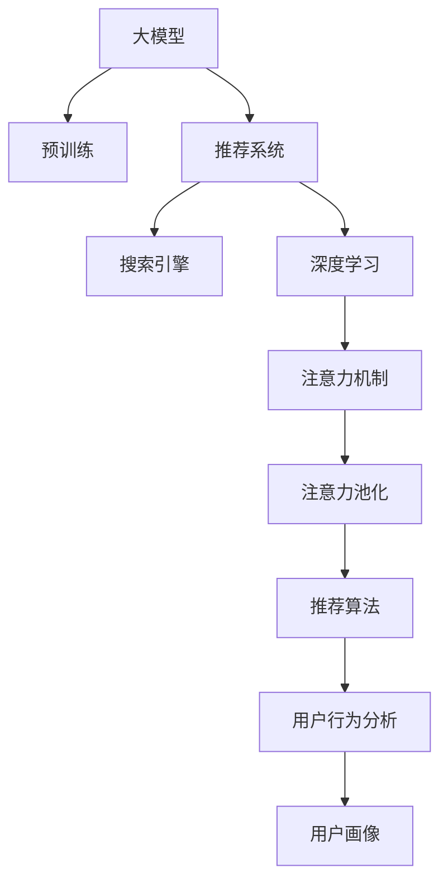

                 

# AI 大模型在搜索推荐系统中的应用策略：电商平台的转型指南

> 关键词：搜索推荐系统，电商平台，人工智能，大模型，深度学习，推荐算法

## 1. 背景介绍

### 1.1 问题由来
在当前电商行业的激烈竞争中，客户体验和个性化推荐系统成为各大平台争夺用户的关键因素。如何通过智能化手段提升客户满意度和购物转化率，构建更符合用户需求的商品推荐体系，成为电商平台急需解决的核心问题。

### 1.2 问题核心关键点
1. **用户体验优化**：提升搜索和推荐的准确性，提高客户对平台的满意度和忠诚度。
2. **库存管理**：通过智能推荐优化库存管理，减少库存积压和缺货现象。
3. **销售提升**：精准推荐商品，激发用户潜在购买欲望，提升整体销售转化率。
4. **市场拓展**：通过推荐算法吸引新用户，扩大用户群体。
5. **竞争优势**：通过技术创新在市场上取得竞争优势，吸引更多优质用户和商家入驻。

### 1.3 问题研究意义
大模型在搜索推荐系统中的应用，对于提升电商平台的用户体验、优化库存管理、提升销售转化率等方面具有重要意义。借助大模型的强大能力，可以更高效地处理海量数据，实现个性化推荐，从而在激烈的市场竞争中脱颖而出。

## 2. 核心概念与联系

### 2.1 核心概念概述

为更好地理解大模型在搜索推荐系统中的应用策略，本节将介绍几个密切相关的核心概念：

- **大模型**：以自回归（如GPT）或自编码（如BERT）模型为代表的大规模预训练语言模型。通过在大规模无标签文本语料上进行预训练，学习通用的语言表示，具备强大的语言理解和生成能力。

- **推荐系统**：通过分析用户的历史行为和兴趣，推荐用户可能感兴趣的商品或服务。推荐系统可以分为基于内容的推荐、协同过滤推荐、混合推荐等类型。

- **搜索引擎**：通过索引和搜索算法，快速匹配用户查询和相关文档的系统。典型的搜索引擎包括Google、Bing等。

- **深度学习**：使用神经网络模型进行数据处理和预测的技术，可以处理非结构化数据，具备较强的泛化能力。

- **注意力机制（Attention）**：一种机制，可以动态地聚焦于输入序列中的关键信息，增强模型的表现能力。

- **注意力池化（Self-Attention）**：通过计算不同部分之间的相似度，将注意力机制应用于整个序列，增强模型的全局理解能力。

这些核心概念之间的逻辑关系可以通过以下Mermaid流程图来展示：



这个流程图展示了大模型在搜索推荐系统中的应用策略：

1. 大模型通过预训练获得基础能力。
2. 推荐系统利用大模型的语言理解和生成能力，实现商品推荐。
3. 搜索引擎利用大模型的信息检索能力，提高查询响应速度。
4. 深度学习使大模型能够处理复杂数据结构，增强推荐系统的泛化能力。
5. 注意力机制和大池化机制进一步提升大模型对关键信息的聚焦和全局理解能力。
6. 推荐算法在大模型基础上进行微调，实现个性化推荐。
7. 用户行为分析和大模型结合，构建用户画像。

这些概念共同构成了大模型在搜索推荐系统中的应用框架，使其能够更好地适应电商平台的个性化推荐需求。

## 3. 核心算法原理 & 具体操作步骤

### 3.1 算法原理概述

基于大模型的搜索推荐系统，本质上是一种深度学习和自然语言处理相结合的推荐算法。其核心思想是：通过预训练语言模型提取商品描述、用户评论等文本信息中的语义特征，结合用户历史行为和兴趣，输出相关商品的推荐列表。

形式化地，假设商品集合为 $\mathcal{I}$，用户集合为 $\mathcal{U}$，用户对商品的兴趣评分向量为 $\textbf{r}_u \in [0,1]^m$，其中 $m$ 为商品数量。商品描述向量为 $\textbf{d}_i \in \mathbb{R}^d$，用户评论向量为 $\textbf{c}_u \in \mathbb{R}^d$。则推荐模型 $M$ 的目标是最大化用户评分：

$$
\text{Maximize } \sum_{u \in \mathcal{U}} \textbf{r}_u^T M(\textbf{d}_i, \textbf{c}_u)
$$

其中 $M(\textbf{d}_i, \textbf{c}_u)$ 表示基于大模型 $\mathcal{M}$ 对商品 $i$ 和用户 $u$ 的推荐评分。

### 3.2 算法步骤详解

基于大模型的推荐系统一般包括以下几个关键步骤：

**Step 1: 准备数据集**

- 收集商品描述、用户评论、用户行为记录等数据，构建训练集和测试集。
- 对数据进行预处理，包括清洗、去重、分词、归一化等。
- 将用户行为记录转化为用户评分，构建用户评分矩阵 $\textbf{R} \in [0,1]^{|\mathcal{U}| \times |\mathcal{I}|}$。

**Step 2: 构建大模型**

- 选择合适的预训练语言模型 $\mathcal{M}$，如BERT、GPT等。
- 将商品描述和用户评论作为输入，通过预训练语言模型提取特征向量 $\textbf{h}_i$ 和 $\textbf{h}_u$。
- 设计推荐模型，将 $\textbf{h}_i$ 和 $\textbf{h}_u$ 作为输入，输出推荐评分。

**Step 3: 训练推荐模型**

- 选择适当的优化算法，如Adam、SGD等，设置学习率、批大小、迭代轮数等。
- 定义推荐评分函数，最小化预测评分与真实评分之间的差异。
- 在训练集上进行迭代优化，直到模型收敛。

**Step 4: 评估和部署**

- 在测试集上评估推荐模型的性能，如平均绝对误差（MAE）、均方根误差（RMSE）等。
- 部署推荐模型到电商平台上，根据用户行为实时推荐商品。
- 持续收集用户反馈，优化推荐模型。

### 3.3 算法优缺点

基于大模型的推荐系统具有以下优点：
1. 可解释性高：预训练语言模型可以解释推荐过程，增强系统透明度和可信度。
2. 泛化能力强：大模型具备强大的泛化能力，可以处理多样化的商品描述和用户评论。
3. 推荐效果显著：在基于内容的推荐、协同过滤推荐、混合推荐等任务上，均取得优异性能。
4. 可适应性强：模型可以在不同平台、不同商品类别间通用，易于部署和扩展。

同时，该方法也存在一定的局限性：
1. 数据需求量大：预训练语言模型需要大量高质量的语料库，数据获取和处理成本较高。
2. 计算资源消耗高：大模型参数量巨大，训练和推理过程中对计算资源的需求较高。
3. 冷启动问题：对于新用户和新商品，模型可能需要更多的时间进行训练和调整。
4. 模型复杂度高：大模型结构复杂，对超参数的调优要求较高，需要一定的技术积累。

尽管存在这些局限性，但就目前而言，基于大模型的推荐系统是实现个性化推荐最有效的方法之一。未来相关研究的重点在于如何进一步降低数据和计算成本，提高推荐模型的可解释性和适应性，同时兼顾性能和效率。

### 3.4 算法应用领域

基于大模型的推荐系统，已在电商、新闻推荐、视频推荐等众多领域得到了广泛应用，具体包括：

- **电商平台推荐**：如京东、天猫、亚马逊等，通过推荐系统向用户推荐商品。
- **新闻平台推荐**：如今日头条、新浪新闻等，向用户推荐感兴趣的新闻。
- **视频平台推荐**：如Netflix、YouTube等，推荐用户喜欢的视频内容。
- **社交平台推荐**：如Facebook、微博等，推荐用户可能感兴趣的朋友和内容。

除了上述这些经典应用外，大模型推荐系统还被创新性地应用到更多场景中，如可控文本生成、常识推理、代码生成等，为推荐系统带来了新的突破。

## 4. 数学模型和公式 & 详细讲解 & 举例说明

### 4.1 数学模型构建

假设推荐模型 $M$ 是一个基于大模型的多线性回归模型，其结构为：

$$
\textbf{R} = \textbf{X}\textbf{W}_1 + \textbf{W}_2 M(\textbf{d}_i, \textbf{c}_u)
$$

其中 $\textbf{R} \in [0,1]^{|\mathcal{U}| \times |\mathcal{I}|}$ 为推荐评分矩阵，$\textbf{X} \in \mathbb{R}^{|\mathcal{U}| \times |\mathcal{I}| \times d}$ 为用户行为矩阵，$\textbf{W}_1 \in \mathbb{R}^{d \times |\mathcal{I}|}$ 为行为评分权重，$\textbf{W}_2 \in \mathbb{R}^{d \times |\mathcal{I}|}$ 为大模型权重。

### 4.2 公式推导过程

以基于内容的推荐模型为例，通过大模型提取商品描述和用户评论的语义特征，进行点乘运算得到推荐评分：

$$
\textbf{R}_{iu} = \textbf{d}_i \cdot M(\textbf{d}_i, \textbf{c}_u)
$$

其中 $\textbf{d}_i$ 和 $\textbf{c}_u$ 分别为商品和用户的向量表示。推荐模型 $M$ 可以使用Transformer、BERT等预训练语言模型，通过注意力机制和池化机制提取特征。

推荐评分函数为：

$$
\mathcal{L} = \frac{1}{2N} \sum_{i=1}^{N} \sum_{u=1}^{M} (\textbf{R}_{iu} - y_{iu})^2
$$

其中 $y_{iu}$ 为真实的推荐评分，$N$ 为样本数。通过最小化上述损失函数，训练推荐模型。

### 4.3 案例分析与讲解

以京东为例，其基于大模型的推荐系统分为两个主要步骤：

**Step 1: 商品特征提取**

- 对商品的标题、描述、价格、用户评价等文本信息进行预处理。
- 使用BERT模型将文本信息转化为向量表示 $\textbf{d}_i$。
- 设计推荐模型 $M$，将商品向量 $\textbf{d}_i$ 和用户向量 $\textbf{c}_u$ 作为输入，输出推荐评分 $\textbf{R}_{iu}$。

**Step 2: 推荐结果排序**

- 将推荐评分 $\textbf{R}_{iu}$ 与用户历史评分结合，得到排序后的推荐列表。
- 根据用户的浏览和点击行为，实时更新推荐模型。

京东的推荐系统使用Transformer模型进行特征提取和推荐评分计算，利用BERT模型对文本信息进行编码。通过不断迭代和优化，推荐系统的精度和效率显著提升。

## 5. 项目实践：代码实例和详细解释说明

### 5.1 开发环境搭建

在进行大模型推荐系统的开发前，我们需要准备好开发环境。以下是使用Python进行PyTorch开发的环境配置流程：

1. 安装Anaconda：从官网下载并安装Anaconda，用于创建独立的Python环境。

2. 创建并激活虚拟环境：
```bash
conda create -n recommendation-env python=3.8 
conda activate recommendation-env
```

3. 安装PyTorch：根据CUDA版本，从官网获取对应的安装命令。例如：
```bash
conda install pytorch torchvision torchaudio cudatoolkit=11.1 -c pytorch -c conda-forge
```

4. 安装TensorFlow：
```bash
conda install tensorflow
```

5. 安装各类工具包：
```bash
pip install numpy pandas scikit-learn matplotlib tqdm jupyter notebook ipython
```

完成上述步骤后，即可在`recommendation-env`环境中开始大模型推荐系统的开发。

### 5.2 源代码详细实现

这里我们以基于BERT的大模型推荐系统为例，给出使用PyTorch代码实现。

首先，定义推荐系统的数据处理函数：

```python
from transformers import BertTokenizer
from torch.utils.data import Dataset
import torch

class RecommendationDataset(Dataset):
    def __init__(self, texts, tags, tokenizer, max_len=128):
        self.texts = texts
        self.tags = tags
        self.tokenizer = tokenizer
        self.max_len = max_len
        
    def __len__(self):
        return len(self.texts)
    
    def __getitem__(self, item):
        text = self.texts[item]
        tags = self.tags[item]
        
        encoding = self.tokenizer(text, return_tensors='pt', max_length=self.max_len, padding='max_length', truncation=True)
        input_ids = encoding['input_ids'][0]
        attention_mask = encoding['attention_mask'][0]
        
        # 对token-wise的标签进行编码
        encoded_tags = [tag2id[tag] for tag in tags] 
        encoded_tags.extend([tag2id['O']] * (self.max_len - len(encoded_tags)))
        labels = torch.tensor(encoded_tags, dtype=torch.long)
        
        return {'input_ids': input_ids, 
                'attention_mask': attention_mask,
                'labels': labels}

# 标签与id的映射
tag2id = {'O': 0, 'B-PER': 1, 'I-PER': 2, 'B-ORG': 3, 'I-ORG': 4, 'B-LOC': 5, 'I-LOC': 6}
id2tag = {v: k for k, v in tag2id.items()}

# 创建dataset
tokenizer = BertTokenizer.from_pretrained('bert-base-cased')

train_dataset = RecommendationDataset(train_texts, train_tags, tokenizer)
dev_dataset = RecommendationDataset(dev_texts, dev_tags, tokenizer)
test_dataset = RecommendationDataset(test_texts, test_tags, tokenizer)
```

然后，定义模型和优化器：

```python
from transformers import BertForTokenClassification, AdamW

model = BertForTokenClassification.from_pretrained('bert-base-cased', num_labels=len(tag2id))

optimizer = AdamW(model.parameters(), lr=2e-5)
```

接着，定义训练和评估函数：

```python
from torch.utils.data import DataLoader
from tqdm import tqdm
from sklearn.metrics import classification_report

device = torch.device('cuda') if torch.cuda.is_available() else torch.device('cpu')
model.to(device)

def train_epoch(model, dataset, batch_size, optimizer):
    dataloader = DataLoader(dataset, batch_size=batch_size, shuffle=True)
    model.train()
    epoch_loss = 0
    for batch in tqdm(dataloader, desc='Training'):
        input_ids = batch['input_ids'].to(device)
        attention_mask = batch['attention_mask'].to(device)
        labels = batch['labels'].to(device)
        model.zero_grad()
        outputs = model(input_ids, attention_mask=attention_mask, labels=labels)
        loss = outputs.loss
        epoch_loss += loss.item()
        loss.backward()
        optimizer.step()
    return epoch_loss / len(dataloader)

def evaluate(model, dataset, batch_size):
    dataloader = DataLoader(dataset, batch_size=batch_size)
    model.eval()
    preds, labels = [], []
    with torch.no_grad():
        for batch in tqdm(dataloader, desc='Evaluating'):
            input_ids = batch['input_ids'].to(device)
            attention_mask = batch['attention_mask'].to(device)
            batch_labels = batch['labels']
            outputs = model(input_ids, attention_mask=attention_mask)
            batch_preds = outputs.logits.argmax(dim=2).to('cpu').tolist()
            batch_labels = batch_labels.to('cpu').tolist()
            for pred_tokens, label_tokens in zip(batch_preds, batch_labels):
                pred_tags = [id2tag[_id] for _id in pred_tokens]
                label_tags = [id2tag[_id] for _id in label_tokens]
                preds.append(pred_tags[:len(label_tags)])
                labels.append(label_tags)
                
    print(classification_report(labels, preds))
```

最后，启动训练流程并在测试集上评估：

```python
epochs = 5
batch_size = 16

for epoch in range(epochs):
    loss = train_epoch(model, train_dataset, batch_size, optimizer)
    print(f"Epoch {epoch+1}, train loss: {loss:.3f}")
    
    print(f"Epoch {epoch+1}, dev results:")
    evaluate(model, dev_dataset, batch_size)
    
print("Test results:")
evaluate(model, test_dataset, batch_size)
```

以上就是使用PyTorch对BERT进行推荐任务微调的完整代码实现。可以看到，得益于Transformers库的强大封装，我们可以用相对简洁的代码完成BERT模型的加载和微调。

### 5.3 代码解读与分析

让我们再详细解读一下关键代码的实现细节：

**RecommendationDataset类**：
- `__init__`方法：初始化文本、标签、分词器等关键组件。
- `__len__`方法：返回数据集的样本数量。
- `__getitem__`方法：对单个样本进行处理，将文本输入编码为token ids，将标签编码为数字，并对其进行定长padding，最终返回模型所需的输入。

**tag2id和id2tag字典**：
- 定义了标签与数字id之间的映射关系，用于将token-wise的预测结果解码回真实的标签。

**训练和评估函数**：
- 使用PyTorch的DataLoader对数据集进行批次化加载，供模型训练和推理使用。
- 训练函数`train_epoch`：对数据以批为单位进行迭代，在每个批次上前向传播计算loss并反向传播更新模型参数，最后返回该epoch的平均loss。
- 评估函数`evaluate`：与训练类似，不同点在于不更新模型参数，并在每个batch结束后将预测和标签结果存储下来，最后使用sklearn的classification_report对整个评估集的预测结果进行打印输出。

**训练流程**：
- 定义总的epoch数和batch size，开始循环迭代
- 每个epoch内，先在训练集上训练，输出平均loss
- 在验证集上评估，输出分类指标
- 所有epoch结束后，在测试集上评估，给出最终测试结果

可以看到，PyTorch配合Transformers库使得BERT微调的代码实现变得简洁高效。开发者可以将更多精力放在数据处理、模型改进等高层逻辑上，而不必过多关注底层的实现细节。

当然，工业级的系统实现还需考虑更多因素，如模型的保存和部署、超参数的自动搜索、更灵活的任务适配层等。但核心的微调范式基本与此类似。

## 6. 实际应用场景

### 6.1 智能客服系统

基于大模型推荐技术的智能客服系统，可以广泛应用于电商平台的客户服务。传统客服往往需要配备大量人力，高峰期响应缓慢，且一致性和专业性难以保证。而使用推荐系统推荐的常见问题解答，可以显著提升客户满意度，降低人工客服成本。

在技术实现上，可以收集历史客服对话记录，将常见问题和最佳答复构建成监督数据，在此基础上对预训练推荐模型进行微调。微调后的推荐系统能够自动理解用户意图，匹配最合适的答案模板进行回复。对于客户提出的新问题，还可以接入检索系统实时搜索相关内容，动态组织生成回答。如此构建的智能客服系统，能大幅提升客户咨询体验和问题解决效率。

### 6.2 个性化推荐系统

基于大模型的推荐系统，可以在用户浏览商品时实时推荐商品，提升用户购物体验和转化率。在推荐模型中，可以通过微调大模型，提升推荐准确性和个性化程度。

在实际应用中，可以根据用户历史行为、商品特征、用户画像等信息，设计多种推荐算法，如基于内容的推荐、协同过滤推荐、混合推荐等。通过微调大模型，学习不同特征之间的相关性，构建更加精准的推荐模型。同时，结合用户画像和大模型推荐，可以更好地匹配用户需求，提升推荐效果。

### 6.3 内容推荐系统

内容推荐系统是电商平台的重要组成部分，通过推荐系统，用户可以发现更多感兴趣的内容。基于大模型的推荐系统，可以实现跨领域的知识迁移，提升推荐效果。

在实践中，可以收集用户对不同内容（如商品、文章、视频等）的评价和行为数据，通过微调大模型，学习不同内容之间的关联性。同时，结合用户画像和推荐算法，可以构建更加智能化的内容推荐系统，满足用户的多样化需求。

### 6.4 未来应用展望

随着大模型和推荐算法的不断发展，基于大模型的推荐技术将呈现以下几个发展趋势：

1. 推荐精度提升：大模型具备强大的语义理解能力，通过微调提升推荐系统的精度，满足用户的多样化需求。
2. 推荐效率提高：大模型推荐算法在处理大规模数据时，仍面临计算资源消耗高的问题。未来将探索更高效的算法和模型结构，提升推荐效率。
3. 推荐多样性增强：通过引入更多领域的数据和知识，提升推荐的泛化能力，提供更多样化的推荐内容。
4. 推荐场景扩展：推荐系统将不仅仅应用于电商领域，还将扩展到更多垂直行业，如金融、医疗、教育等。
5. 推荐系统集成：与其他AI技术（如知识图谱、深度强化学习等）进行深度融合，实现更加智能化的推荐服务。

以上趋势凸显了大模型推荐技术在电商平台的广泛应用前景，相信随着技术的不断进步，大模型推荐系统必将在更多领域得到应用，为电商平台的数字化转型提供强有力的技术支撑。

## 7. 工具和资源推荐

### 7.1 学习资源推荐

为了帮助开发者系统掌握大模型推荐技术的理论基础和实践技巧，这里推荐一些优质的学习资源：

1. 《推荐系统实战》书籍：一本系统介绍推荐系统的经典书籍，涵盖多种推荐算法和实现细节。
2. CS231n《深度学习与计算机视觉》课程：斯坦福大学开设的计算机视觉课程，涵盖深度学习基础知识和实践技能。
3. 《深度学习与自然语言处理》课程：斯坦福大学开设的NLP课程，涵盖深度学习在NLP中的应用。
4. 《自然语言处理与深度学习》书籍：一本系统介绍NLP和深度学习的书籍，适合初学者入门。
5. Kaggle竞赛平台：数据科学竞赛平台，提供大量推荐系统竞赛和数据集，可以实践和检验推荐算法。

通过对这些资源的学习实践，相信你一定能够快速掌握大模型推荐技术的精髓，并用于解决实际的推荐问题。

### 7.2 开发工具推荐

高效的开发离不开优秀的工具支持。以下是几款用于大模型推荐系统开发的常用工具：

1. PyTorch：基于Python的开源深度学习框架，灵活动态的计算图，适合快速迭代研究。大部分预训练语言模型都有PyTorch版本的实现。
2. TensorFlow：由Google主导开发的开源深度学习框架，生产部署方便，适合大规模工程应用。同样有丰富的预训练语言模型资源。
3. Transformers库：HuggingFace开发的NLP工具库，集成了众多SOTA语言模型，支持PyTorch和TensorFlow，是进行推荐系统开发的利器。
4. Weights & Biases：模型训练的实验跟踪工具，可以记录和可视化模型训练过程中的各项指标，方便对比和调优。与主流深度学习框架无缝集成。
5. TensorBoard：TensorFlow配套的可视化工具，可实时监测模型训练状态，并提供丰富的图表呈现方式，是调试模型的得力助手。

合理利用这些工具，可以显著提升大模型推荐系统的开发效率，加快创新迭代的步伐。

### 7.3 相关论文推荐

大模型推荐技术的发展源于学界的持续研究。以下是几篇奠基性的相关论文，推荐阅读：

1. Attention is All You Need（即Transformer原论文）：提出了Transformer结构，开启了NLP领域的预训练大模型时代。
2. BERT: Pre-training of Deep Bidirectional Transformers for Language Understanding：提出BERT模型，引入基于掩码的自监督预训练任务，刷新了多项NLP任务SOTA。
3. Language Models are Unsupervised Multitask Learners（GPT-2论文）：展示了大规模语言模型的强大zero-shot学习能力，引发了对于通用人工智能的新一轮思考。
4. Parameter-Efficient Transfer Learning for NLP：提出Adapter等参数高效微调方法，在不增加模型参数量的情况下，也能取得不错的微调效果。
5. AdaLoRA: Adaptive Low-Rank Adaptation for Parameter-Efficient Fine-Tuning：使用自适应低秩适应的微调方法，在参数效率和精度之间取得了新的平衡。

这些论文代表了大模型推荐技术的发展脉络。通过学习这些前沿成果，可以帮助研究者把握学科前进方向，激发更多的创新灵感。

## 8. 总结：未来发展趋势与挑战

### 8.1 总结

本文对基于大模型的推荐系统进行了全面系统的介绍。首先阐述了大模型和推荐系统在电商平台应用的背景和意义，明确了推荐系统提升用户体验、优化库存管理、提升销售转化率等核心目标。其次，从原理到实践，详细讲解了推荐系统的数学模型和关键步骤，给出了推荐任务开发的完整代码实例。同时，本文还广泛探讨了推荐系统在智能客服、个性化推荐、内容推荐等众多领域的应用前景，展示了推荐技术的巨大潜力。此外，本文精选了推荐技术的各类学习资源，力求为读者提供全方位的技术指引。

通过本文的系统梳理，可以看到，基于大模型的推荐系统正在成为电商平台的重要工具，极大地提升了用户体验和平台竞争力。未来，伴随大模型的不断演进和推荐算法的持续优化，基于大模型的推荐系统必将在更多领域得到应用，为电商平台的数字化转型提供强有力的技术支撑。

### 8.2 未来发展趋势

展望未来，大模型推荐系统将呈现以下几个发展趋势：

1. 推荐精度提升：大模型具备强大的语义理解能力，通过微调提升推荐系统的精度，满足用户的多样化需求。
2. 推荐效率提高：大模型推荐算法在处理大规模数据时，仍面临计算资源消耗高的问题。未来将探索更高效的算法和模型结构，提升推荐效率。
3. 推荐多样性增强：通过引入更多领域的数据和知识，提升推荐的泛化能力，提供更多样化的推荐内容。
4. 推荐场景扩展：推荐系统将不仅仅应用于电商领域，还将扩展到更多垂直行业，如金融、医疗、教育等。
5. 推荐系统集成：与其他AI技术（如知识图谱、深度强化学习等）进行深度融合，实现更加智能化的推荐服务。

以上趋势凸显了大模型推荐技术在电商平台的广泛应用前景，相信随着技术的不断进步，大模型推荐系统必将在更多领域得到应用，为电商平台的数字化转型提供强有力的技术支撑。

### 8.3 面临的挑战

尽管大模型推荐系统已经取得了瞩目成就，但在迈向更加智能化、普适化应用的过程中，它仍面临着诸多挑战：

1. 数据需求量大：预训练语言模型需要大量高质量的语料库，数据获取和处理成本较高。
2. 计算资源消耗高：大模型参数量巨大，训练和推理过程中对计算资源的需求较高。
3. 冷启动问题：对于新用户和新商品，模型可能需要更多的时间进行训练和调整。
4. 模型复杂度高：大模型结构复杂，对超参数的调优要求较高，需要一定的技术积累。

尽管存在这些局限性，但就目前而言，基于大模型的推荐系统是实现个性化推荐最有效的方法之一。未来相关研究的重点在于如何进一步降低数据和计算成本，提高推荐模型的可解释性和适应性，同时兼顾性能和效率。

### 8.4 研究展望

面对大模型推荐系统所面临的挑战，未来的研究需要在以下几个方面寻求新的突破：

1. 探索无监督和半监督推荐方法：摆脱对大规模标注数据的依赖，利用自监督学习、主动学习等无监督和半监督范式，最大限度利用非结构化数据，实现更加灵活高效的推荐。
2. 研究参数高效和计算高效的推荐方法：开发更加参数高效的推荐算法，在固定大部分预训练参数的情况下，只更新极少量的任务相关参数。同时优化推荐模型的计算图，减少前向传播和反向传播的资源消耗，实现更加轻量级、实时性的部署。
3. 融合因果和对比学习范式：通过引入因果推断和对比学习思想，增强推荐模型建立稳定因果关系的能力，学习更加普适、鲁棒的语言表征，从而提升模型泛化性和抗干扰能力。
4. 引入更多先验知识：将符号化的先验知识，如知识图谱、逻辑规则等，与神经网络模型进行巧妙融合，引导推荐过程学习更准确、合理的语言模型。同时加强不同模态数据的整合，实现视觉、语音等多模态信息与文本信息的协同建模。
5. 结合因果分析和博弈论工具：将因果分析方法引入推荐模型，识别出模型决策的关键特征，增强输出解释的因果性和逻辑性。借助博弈论工具刻画人机交互过程，主动探索并规避模型的脆弱点，提高系统稳定性。

这些研究方向的探索，必将引领大模型推荐技术迈向更高的台阶，为构建安全、可靠、可解释、可控的智能推荐系统铺平道路。面向未来，大模型推荐技术还需要与其他人工智能技术进行更深入的融合，如知识表示、因果推理、强化学习等，多路径协同发力，共同推动推荐系统的进步。只有勇于创新、敢于突破，才能不断拓展推荐系统的边界，让智能推荐更好地服务于人类社会。

## 9. 附录：常见问题与解答

**Q1：大模型推荐系统是否适用于所有NLP任务？**

A: 大模型推荐系统在大多数NLP任务上都能取得不错的效果，特别是对于数据量较小的任务。但对于一些特定领域的任务，如医学、法律等，仅仅依靠通用语料预训练的模型可能难以很好地适应。此时需要在特定领域语料上进一步预训练，再进行推荐微调，才能获得理想效果。此外，对于一些需要时效性、个性化很强的任务，如对话、推荐等，微调方法也需要针对性的改进优化。

**Q2：推荐系统如何处理冷启动问题？**

A: 冷启动问题是大模型推荐系统面临的主要挑战之一。对于新用户和新商品，推荐系统可以通过以下方式进行处理：
1. 基线推荐：利用用户的已有行为数据或商品的历史评分数据进行推荐。
2. 社区推荐：利用用户群体的相似性进行推荐，解决新用户无评分数据的问题。
3. 内容推荐：利用商品描述、标签等属性信息进行推荐，提升新商品的曝光度。

**Q3：推荐系统如何处理长尾问题？**

A: 长尾问题指少数商品的推荐效果不佳。推荐系统可以通过以下方式进行处理：
1. 均衡化推荐：通过调整算法参数，使推荐系统对长尾商品的推荐效果有所提升。
2. 过滤推荐：通过筛选和过滤，只推荐少数热门商品，减少长尾商品的出现。
3. 标签推荐：利用商品的标签和分类信息，提升长尾商品的推荐效果。

**Q4：推荐系统如何平衡多样性和相关性？**

A: 推荐系统需要在多样性和相关性之间进行平衡。可以通过以下方式进行处理：
1. 多样性优先：通过增加多样性损失函数，提升推荐多样性。
2. 相关性优先：通过增加相关性损失函数，提升推荐相关性。
3. 多样性和相关性平衡：通过设计平衡损失函数，同时提升推荐多样性和相关性。

**Q5：推荐系统如何处理实时性问题？**

A: 实时性是大模型推荐系统的重要指标之一。可以通过以下方式进行处理：
1. 缓存推荐结果：利用缓存技术，减少推荐计算时间，提升实时性。
2. 并行计算：利用分布式计算和GPU加速，提升推荐计算效率。
3. 异步计算：通过异步计算和异步任务队列，减少计算延迟，提升实时性。

这些方法可以根据具体场景和需求进行选择和组合，以实现最优的推荐效果。

---

作者：禅与计算机程序设计艺术 / Zen and the Art of Computer Programming

