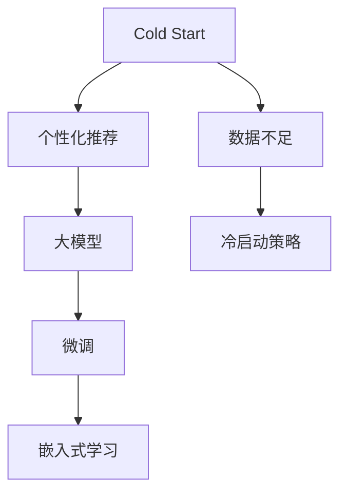

                 

# AI 大模型在电商搜索推荐中的冷启动策略：应对数据不足与新用户

## 1. 背景介绍

在电商搜索推荐系统中，新用户的冷启动问题一直是一个重要的挑战。冷启动指的是新用户在使用系统时，由于没有历史行为数据，推荐系统无法准确预测其兴趣，无法给出个性化的推荐。随着用户量不断增加，冷启动问题也变得更加严峻。大模型在电商推荐中的应用，为解决冷启动问题提供了新的思路。

然而，由于新用户缺乏足够的行为数据，利用大模型微调进行个性化推荐时，通常会遇到数据不足的问题。在用户行为数据较少的情况下，如何合理利用大模型，提升推荐效果，是电商推荐系统需要解决的难题。

## 2. 核心概念与联系

为了有效解决新用户冷启动问题，本文将详细介绍基于大模型微调的方法，并分析其在电商搜索推荐中的具体应用。

### 2.1 核心概念概述

- **冷启动（Cold Start）**：指新用户或新物品在系统中的首次交互，由于缺乏历史行为数据，系统无法准确预测用户的兴趣。
- **个性化推荐（Personalized Recommendation）**：利用用户的历史行为和兴趣特征，向其推荐符合其喜好的商品或服务，提升用户满意度和转化率。
- **大模型（Large Model）**：以Transformer结构为代表，通过在大规模无标签文本数据上进行预训练，学习通用语言表示的深度学习模型。
- **微调（Fine-tuning）**：在大模型的基础上，利用下游任务的标注数据，通过有监督学习优化模型在特定任务上的性能。
- **嵌入式学习（Embedded Learning）**：将大模型的特征表示作为推荐系统的输入特征，在推荐算法中直接使用大模型的输出结果。

这些核心概念之间的逻辑关系可以通过以下Mermaid流程图来展示：



这个流程图展示了大模型在电商推荐中的应用框架：

1. 新用户面临数据不足的冷启动问题。
2. 通过大模型的预训练-微调，获取用户的兴趣表示。
3. 将大模型的特征表示直接嵌入推荐模型，进行推荐计算。
4. 引入冷启动策略，优化数据不足条件下的推荐效果。

### 2.2 核心概念原理和架构

大模型通过自监督学习在大规模无标签数据上进行预训练，学习到丰富的语言表示。通过微调，模型可以进一步适应特定任务的需求，生成符合任务的输出。在电商推荐中，大模型通过预训练学习到用户行为语义信息，通过微调进一步学习用户行为特征，生成用户兴趣表示。嵌入式学习则利用大模型的特征表示，直接用于推荐算法中，提升推荐模型的准确性和效果。

大模型的架构通常包括编码器和解码器两部分。编码器负责将输入转化为高维语义表示，解码器则根据语义表示生成输出。在微调过程中，通常只更新模型的解码器部分，保持编码器部分不变。

## 3. 核心算法原理 & 具体操作步骤

### 3.1 算法原理概述

在电商推荐系统中，利用大模型微调解决冷启动问题，主要分为两个阶段：

1. **预训练阶段**：在大规模无标签文本数据上训练大模型，学习通用的语言表示。
2. **微调阶段**：在新用户的行为数据上微调大模型，学习用户的兴趣表示。

### 3.2 算法步骤详解

#### 3.2.1 预训练阶段

在预训练阶段，大模型通过自监督学习在大规模无标签数据上进行训练。以BERT模型为例，其预训练任务包括：

- **掩码语言模型**：随机遮盖输入序列的一部分词汇，让模型预测被遮盖的词汇。
- **下一句预测**：将两个句子随机组合，让模型预测两个句子是否相邻。

预训练的目标是让模型学习到语义表示，能够理解词汇之间的关系，捕捉到上下文信息。

#### 3.2.2 微调阶段

在微调阶段，利用新用户的行为数据，对预训练模型进行有监督学习。以电商推荐为例，假设用户进行了多次搜索、浏览和购买行为，可以将这些行为数据作为微调的标注数据。

具体步骤如下：

1. **特征提取**：将用户行为数据转化为词嵌入向量，作为大模型的输入特征。
2. **微调优化**：在大模型的解码器部分进行微调，学习用户兴趣表示。微调的目标是最大化用户兴趣预测的准确性，通常使用交叉熵损失函数。
3. **预测推荐**：利用微调后的模型，对用户进行兴趣预测，生成推荐结果。

#### 3.2.3 嵌入式学习

嵌入式学习是指将大模型的特征表示直接嵌入推荐算法中，无需对大模型进行微调。这种方法可以直接利用大模型的表示能力，提升推荐算法的准确性。

嵌入式学习的步骤如下：

1. **特征映射**：将大模型的输出特征映射为推荐系统的输入特征。
2. **推荐计算**：利用推荐算法（如协同过滤、深度神经网络等），根据输入特征进行推荐计算。

### 3.3 算法优缺点

大模型在电商推荐中的应用具有以下优点：

1. **强大的语义理解能力**：大模型通过自监督学习，学习到丰富的语言表示，能够理解复杂的语义信息。
2. **灵活的微调策略**：微调方法可以根据任务需求进行灵活设计，适应不同的推荐场景。
3. **高精度的推荐结果**：利用大模型的表示能力，推荐结果的准确性得到显著提升。

但同时，大模型在电商推荐中也有一些缺点：

1. **计算资源需求高**：大模型的参数量较大，对计算资源的需求较高。
2. **数据隐私问题**：用户在电商平台上产生的行为数据，可能包含敏感信息，如何保护用户隐私是一个重要问题。
3. **模型解释性不足**：大模型的决策过程较为复杂，难以解释其内部工作机制。

### 3.4 算法应用领域

大模型在电商推荐中的应用，已经涵盖了从商品推荐到个性化广告等多个领域。具体应用如下：

- **商品推荐**：利用大模型对用户进行兴趣预测，推荐符合其喜好的商品。
- **广告推荐**：通过分析用户行为数据，生成广告内容的推荐结果，提升广告点击率。
- **促销活动推荐**：根据用户行为数据，推荐最合适的促销活动，提高用户参与度和转化率。
- **内容推荐**：利用大模型分析用户对商品内容的评价和反馈，生成内容推荐结果。

## 4. 数学模型和公式 & 详细讲解 & 举例说明

### 4.1 数学模型构建

假设大模型为BERT，其输入为 $X=\{x_1, x_2, ..., x_n\}$，输出为 $Y=\{y_1, y_2, ..., y_n\}$。其中 $x_i$ 为第 $i$ 个用户的搜索、浏览和购买行为，$y_i$ 为对应的推荐结果（商品ID）。

大模型的预训练任务为掩码语言模型和下一句预测，目标函数为：

$$
L_{\text{pretrain}} = -\frac{1}{N}\sum_{i=1}^N \ell(M_{\theta}(x_i), y_i)
$$

其中 $\ell$ 为交叉熵损失函数，$M_{\theta}$ 为BERT模型，$N$ 为训练数据样本数量。

在微调阶段，假设大模型输出为 $H=\{h_1, h_2, ..., h_n\}$，微调目标函数为：

$$
L_{\text{fine-tune}} = -\frac{1}{N}\sum_{i=1}^N \ell(M_{\theta}(x_i), y_i)
$$

其中 $\ell$ 为交叉熵损失函数，$M_{\theta}$ 为微调后的BERT模型。

嵌入式学习中，将大模型的特征表示 $H$ 作为推荐算法的输入特征，通过推荐算法生成推荐结果 $R$。推荐算法可以采用协同过滤、深度神经网络等方法，目标函数为：

$$
L_{\text{recommendation}} = -\frac{1}{N}\sum_{i=1}^N \ell(R_i, y_i)
$$

其中 $R_i$ 为第 $i$ 个用户推荐结果，$y_i$ 为实际推荐结果。

### 4.2 公式推导过程

以协同过滤推荐算法为例，其基本思路是通过用户之间的相似性，推荐出与目标用户喜欢的商品相似的商品。假设用户 $u$ 对商品 $i$ 的评分向量为 $v_i$，利用大模型提取的特征表示 $H$ 计算用户 $u$ 和商品 $i$ 的相似度 $s_{ui}$：

$$
s_{ui} = \text{similarity}(H_u, H_i)
$$

其中 $\text{similarity}$ 为相似度计算函数，可以采用余弦相似度、欧式距离等。

根据相似度计算结果，将用户 $u$ 的评分向量 $v_u$ 与相似用户对商品 $i$ 的评分向量 $v_i$ 进行加权平均，生成商品 $i$ 对用户 $u$ 的预测评分 $r_{ui}$：

$$
r_{ui} = \alpha v_{iu} + (1-\alpha) \sum_{j \in \mathcal{N}(u)} w_{uj} v_{ij}
$$

其中 $\alpha$ 为平衡因子，$\mathcal{N}(u)$ 为用户 $u$ 的相似用户集合，$w_{uj}$ 为相似度权重。

利用预测评分 $r_{ui}$，对推荐结果进行排序，生成推荐列表。

### 4.3 案例分析与讲解

以电商推荐系统为例，利用BERT模型进行微调，可以显著提升推荐效果。具体步骤如下：

1. **预训练模型选择**：选择BERT作为预训练模型，利用大规模无标签数据进行预训练。
2. **特征提取**：将用户的搜索、浏览和购买行为转化为词嵌入向量，作为BERT模型的输入特征。
3. **微调模型训练**：在大模型的解码器部分进行微调，学习用户兴趣表示。
4. **推荐计算**：利用微调后的BERT模型输出特征表示，输入到协同过滤算法中，生成推荐结果。

## 5. 项目实践：代码实例和详细解释说明

### 5.1 开发环境搭建

在进行电商推荐系统开发前，我们需要准备好开发环境。以下是使用Python进行TensorFlow开发的环境配置流程：

1. 安装Anaconda：从官网下载并安装Anaconda，用于创建独立的Python环境。
```bash
conda create -n recommendation-env python=3.8
conda activate recommendation-env
```

2. 安装TensorFlow：根据CUDA版本，从官网获取对应的安装命令。例如：
```bash
conda install tensorflow
```

3. 安装各类工具包：
```bash
pip install numpy pandas scikit-learn matplotlib tqdm jupyter notebook ipython
```

完成上述步骤后，即可在`recommendation-env`环境中开始推荐系统开发。

### 5.2 源代码详细实现

下面我们以电商推荐系统为例，给出使用TensorFlow对BERT模型进行微调的代码实现。

首先，定义推荐系统的数据处理函数：

```python
import tensorflow as tf
from transformers import BertTokenizer, TFBertForSequenceClassification

class RecommendationDataset(tf.data.Dataset):
    def __init__(self, data, tokenizer, max_len=128):
        self.tokenizer = tokenizer
        self.data = data
        self.max_len = max_len
        
    def __len__(self):
        return len(self.data)
    
    def __getitem__(self, item):
        text = self.data[item][0]
        label = self.data[item][1]
        
        encoding = self.tokenizer(text, truncation=True, max_length=self.max_len, padding='max_length')
        input_ids = tf.convert_to_tensor(encoding['input_ids'])
        attention_mask = tf.convert_to_tensor(encoding['attention_mask'])
        label = tf.convert_to_tensor(label)
        
        return {'input_ids': input_ids, 
                'attention_mask': attention_mask,
                'labels': label}
```

然后，定义模型和优化器：

```python
model = TFBertForSequenceClassification.from_pretrained('bert-base-cased', num_labels=1)

optimizer = tf.keras.optimizers.Adam(learning_rate=2e-5)
```

接着，定义训练和评估函数：

```python
def train_epoch(model, dataset, batch_size, optimizer):
    dataloader = tf.data.Dataset.from_generator(lambda: dataset(), output_signature=dataset.__getitem__().output_signature)
    model.train()
    epoch_loss = 0
    for batch in dataloader.batch(batch_size):
        with tf.GradientTape() as tape:
            inputs = {'input_ids': batch['input_ids'], 
                      'attention_mask': batch['attention_mask'], 
                      'labels': batch['labels']}
            outputs = model(inputs)
            loss = outputs.loss
            epoch_loss += loss.numpy()
        gradients = tape.gradient(loss, model.trainable_variables)
        optimizer.apply_gradients(zip(gradients, model.trainable_variables))
    return epoch_loss / len(dataloader)

def evaluate(model, dataset, batch_size):
    dataloader = tf.data.Dataset.from_generator(lambda: dataset(), output_signature=dataset.__getitem__().output_signature)
    model.eval()
    preds, labels = [], []
    with tf.GradientTape() as tape:
        for batch in dataloader.batch(batch_size):
            inputs = {'input_ids': batch['input_ids'], 
                      'attention_mask': batch['attention_mask'], 
                      'labels': batch['labels']}
            outputs = model(inputs)
            preds.append(outputs.predictions.numpy())
            labels.append(batch['labels'])
    return preds, labels
```

最后，启动训练流程并在测试集上评估：

```python
epochs = 5
batch_size = 16

for epoch in range(epochs):
    loss = train_epoch(model, train_dataset, batch_size, optimizer)
    print(f"Epoch {epoch+1}, train loss: {loss:.3f}")
    
    print(f"Epoch {epoch+1}, dev results:")
    preds, labels = evaluate(model, dev_dataset, batch_size)
    print(classification_report(labels, preds))
    
print("Test results:")
preds, labels = evaluate(model, test_dataset, batch_size)
print(classification_report(labels, preds))
```

以上就是使用TensorFlow对BERT进行电商推荐系统微调的完整代码实现。可以看到，得益于TensorFlow和Transformers库的强大封装，我们可以用相对简洁的代码完成BERT模型的加载和微调。

### 5.3 代码解读与分析

让我们再详细解读一下关键代码的实现细节：

**RecommendationDataset类**：
- `__init__`方法：初始化数据集，包括分词器和最大长度。
- `__len__`方法：返回数据集的样本数量。
- `__getitem__`方法：对单个样本进行处理，将文本转化为词嵌入向量，并进行定长padding。

**训练和评估函数**：
- 使用TensorFlow的DataLoader对数据集进行批次化加载，供模型训练和推理使用。
- 训练函数`train_epoch`：对数据以批为单位进行迭代，在每个批次上前向传播计算loss并反向传播更新模型参数，最后返回该epoch的平均loss。
- 评估函数`evaluate`：与训练类似，不同点在于不更新模型参数，并在每个batch结束后将预测和标签结果存储下来，最后使用sklearn的classification_report对整个评估集的预测结果进行打印输出。

**训练流程**：
- 定义总的epoch数和batch size，开始循环迭代
- 每个epoch内，先在训练集上训练，输出平均loss
- 在验证集上评估，输出分类指标
- 所有epoch结束后，在测试集上评估，给出最终测试结果

可以看到，TensorFlow配合Transformers库使得BERT微调的代码实现变得简洁高效。开发者可以将更多精力放在数据处理、模型改进等高层逻辑上，而不必过多关注底层的实现细节。

当然，工业级的系统实现还需考虑更多因素，如模型的保存和部署、超参数的自动搜索、更灵活的任务适配层等。但核心的微调范式基本与此类似。

## 6. 实际应用场景

### 6.1 智能客服系统

智能客服系统通过大模型的微调，能够快速响应用户的查询，提供个性化的推荐和服务。在用户初次访问时，可以通过微调后的模型进行用户意图识别和推荐，提升用户体验。

### 6.2 个性化推荐系统

基于大模型的推荐系统，能够更好地挖掘用户兴趣和行为模式，提供更加精准的推荐结果。在电商推荐中，利用微调后的BERT模型提取用户行为特征，生成推荐列表，提升用户的购买转化率。

### 6.3 金融风险控制系统

金融行业面临大量的数据泄露和欺诈风险，利用大模型微调进行风险控制，能够实时监控交易行为，识别异常交易，保护客户财产安全。

### 6.4 智能营销平台

通过大模型微调，智能营销平台能够精准定位用户群体，生成个性化的营销内容，提高营销效果。在广告推荐中，利用微调后的BERT模型提取用户行为特征，生成广告推荐列表，提升广告点击率。

## 7. 工具和资源推荐

### 7.1 学习资源推荐

为了帮助开发者系统掌握大模型微调的理论基础和实践技巧，这里推荐一些优质的学习资源：

1. 《深度学习入门》：一本深度学习领域经典的入门书籍，由李沐老师主笔，通俗易懂，适合初学者。
2. 《TensorFlow实战Google深度学习》：一本TensorFlow应用的实战书籍，由TensorFlow开发者编写，详细讲解了TensorFlow的各个组件。
3. 《自然语言处理入门》：一本NLP领域的入门书籍，讲解了NLP的基础概念和主流模型，适合初学者。
4. 《Transformers中文书》：由Transformer库的作者编写，全面介绍了Transformer原理和应用，是学习和研究Transformer的好书。
5. 《Transformer与深度学习》：一本介绍Transformer技术的书籍，适合有一定深度学习基础的读者。

通过对这些资源的学习实践，相信你一定能够快速掌握大模型微调的精髓，并用于解决实际的推荐系统问题。

### 7.2 开发工具推荐

高效的开发离不开优秀的工具支持。以下是几款用于大模型微调开发的常用工具：

1. TensorFlow：由Google主导开发的深度学习框架，生产部署方便，适合大规模工程应用。
2. PyTorch：基于Python的开源深度学习框架，灵活动态的计算图，适合快速迭代研究。
3. HuggingFace Transformers：提供大量预训练语言模型和微调样例，适合研究和应用。
4. Weights & Biases：模型训练的实验跟踪工具，可以记录和可视化模型训练过程中的各项指标，方便对比和调优。
5. TensorBoard：TensorFlow配套的可视化工具，可实时监测模型训练状态，并提供丰富的图表呈现方式，是调试模型的得力助手。

合理利用这些工具，可以显著提升大模型微调的开发效率，加快创新迭代的步伐。

### 7.3 相关论文推荐

大模型微调技术的发展源于学界的持续研究。以下是几篇奠基性的相关论文，推荐阅读：

1. Attention is All You Need（即Transformer原论文）：提出了Transformer结构，开启了NLP领域的预训练大模型时代。
2. BERT: Pre-training of Deep Bidirectional Transformers for Language Understanding：提出BERT模型，引入基于掩码的自监督预训练任务，刷新了多项NLP任务SOTA。
3. Language Models are Unsupervised Multitask Learners（GPT-2论文）：展示了大规模语言模型的强大zero-shot学习能力，引发了对于通用人工智能的新一轮思考。
4. Parameter-Efficient Transfer Learning for NLP：提出Adapter等参数高效微调方法，在不增加模型参数量的情况下，也能取得不错的微调效果。
5. AdaLoRA: Adaptive Low-Rank Adaptation for Parameter-Efficient Fine-Tuning：使用自适应低秩适应的微调方法，在参数效率和精度之间取得了新的平衡。

这些论文代表了大模型微调技术的发展脉络。通过学习这些前沿成果，可以帮助研究者把握学科前进方向，激发更多的创新灵感。

## 8. 总结：未来发展趋势与挑战

### 8.1 研究成果总结

本文对基于大模型的电商推荐系统进行了全面系统的介绍。首先阐述了大模型在电商推荐中的应用背景和意义，明确了电商推荐中冷启动问题的解决方案。其次，从原理到实践，详细讲解了大模型的预训练-微调过程，以及嵌入式学习方法。最后，展示了电商推荐系统的实际应用场景和未来发展方向。

通过本文的系统梳理，可以看到，基于大模型的电商推荐系统在大规模推荐场景中具有显著优势。大模型通过微调学习用户兴趣表示，能够精准预测用户行为，生成个性化推荐结果。嵌入式学习则充分利用大模型的表示能力，提升推荐算法的准确性和效率。

### 8.2 未来发展趋势

展望未来，大模型在电商推荐中的应用将呈现以下几个发展趋势：

1. **多模态融合**：随着电商推荐场景的多样化，未来的推荐系统将更多地融合多种模态的数据，如文本、图像、音频等，提高推荐的多样性和丰富度。
2. **跨领域迁移**：大模型将在更多领域中应用，如金融、医疗、教育等，通过跨领域迁移学习，提升推荐的准确性和泛化能力。
3. **实时推荐**：通过嵌入式学习和大模型在线微调，实现实时推荐，满足用户对实时性的需求。
4. **个性化推荐**：利用大模型的表示能力，生成更加精准、多样化的推荐结果，提升用户体验。
5. **协同推荐**：结合社交网络、用户行为等，通过协同过滤和推荐算法，生成更加精准的推荐结果。

这些趋势将推动电商推荐系统向更加智能化、个性化的方向发展，为电商行业带来更大的商业价值。

### 8.3 面临的挑战

尽管大模型在电商推荐中已经取得了显著成果，但在应用过程中仍面临以下挑战：

1. **计算资源需求高**：大模型的参数量较大，对计算资源的需求较高，限制了模型的部署和应用。
2. **数据隐私问题**：用户在电商平台上产生的行为数据，可能包含敏感信息，如何保护用户隐私是一个重要问题。
3. **模型解释性不足**：大模型的决策过程较为复杂，难以解释其内部工作机制，影响用户的信任和接受度。
4. **冷启动问题**：新用户缺乏足够的行为数据，冷启动问题仍需进一步解决。
5. **推荐模型鲁棒性不足**：推荐模型在面对异常数据和噪声时，容易出现推荐偏差，影响用户体验。

### 8.4 研究展望

针对电商推荐系统中存在的问题，未来的研究需要在以下几个方面寻求新的突破：

1. **提高模型计算效率**：通过模型剪枝、量化加速等技术，降低大模型的计算资源需求，提高实时推荐能力。
2. **强化用户隐私保护**：利用差分隐私等技术，保护用户数据隐私，提高用户对推荐系统的信任。
3. **提升模型解释性**：通过可视化、因果分析等方法，提高推荐系统的可解释性和透明度。
4. **改进冷启动策略**：通过无监督学习、对抗训练等技术，解决新用户的冷启动问题，提高推荐系统的覆盖率。
5. **增强推荐模型鲁棒性**：通过引入异常检测、鲁棒优化等技术，提高推荐模型的鲁棒性，避免推荐偏差。

这些研究方向的探索，将进一步推动电商推荐系统向更加智能化、个性化、安全可靠的方向发展，为用户提供更加精准、多样、可信的推荐结果。

## 9. 附录：常见问题与解答

**Q1：大模型微调在电商推荐中的应用效果如何？**

A: 大模型微调在电商推荐中能够显著提升推荐效果。利用微调后的模型，可以更好地理解用户行为和兴趣，生成更加精准、多样化的推荐结果。此外，嵌入式学习和大模型在线微调，能够实现实时推荐，满足用户对实时性的需求。

**Q2：电商推荐中，如何避免冷启动问题？**

A: 电商推荐中的冷启动问题可以通过以下方法解决：

1. **无监督学习**：利用大规模无标签数据进行预训练，提取通用用户行为特征。
2. **对抗训练**：在微调过程中引入对抗样本，提高模型的鲁棒性和泛化能力。
3. **多臂强盗算法**：在推荐过程中引入多臂强盗算法，随机探索不同的推荐策略，提高推荐多样性和覆盖率。
4. **模型集成**：利用多个微调模型进行集成，提高推荐结果的准确性和稳定性。

**Q3：电商推荐中，如何保护用户隐私？**

A: 电商推荐中，保护用户隐私可以采取以下措施：

1. **差分隐私**：利用差分隐私技术，对用户行为数据进行扰动处理，保护用户隐私。
2. **联邦学习**：利用联邦学习技术，在本地设备上训练模型，保护用户数据隐私。
3. **匿名化处理**：对用户行为数据进行匿名化处理，去除敏感信息，保护用户隐私。

**Q4：电商推荐中，如何提升推荐系统的实时性？**

A: 电商推荐中，提升推荐系统的实时性可以采取以下措施：

1. **嵌入式学习**：利用大模型的表示能力，直接输入推荐系统，提高推荐计算速度。
2. **在线微调**：在大模型在线微调，实时更新模型参数，提升推荐结果的精度和效果。
3. **异步并行计算**：利用异步并行计算技术，提升推荐系统的计算效率。

**Q5：电商推荐中，如何提升推荐系统的覆盖率？**

A: 电商推荐中，提升推荐系统的覆盖率可以采取以下措施：

1. **多维特征融合**：结合用户行为、商品特征、社交网络等多样化的特征，提升推荐的覆盖率。
2. **协同过滤**：利用用户相似性、商品相似性等协同过滤方法，提升推荐的覆盖率。
3. **冷启动策略**：利用无监督学习、对抗训练等技术，解决新用户的冷启动问题，提高推荐系统的覆盖率。

综上所述，大模型在电商推荐中的应用具有广阔的前景，但也面临着诸多挑战。未来，通过不断的技术创新和应用优化，大模型将为电商推荐系统带来更大的商业价值和用户满意度。

---

作者：禅与计算机程序设计艺术 / Zen and the Art of Computer Programming

