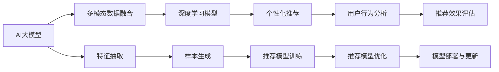

                 

# AI 大模型在电商搜索推荐中的冷启动策略：应对新用户与数据不足

## 1. 背景介绍

### 1.1 问题由来

电商搜索推荐系统（Recommender System）是互联网电商的核心竞争力之一。通过深度学习等先进算法，电商平台能够实时推荐用户可能感兴趣的商品，提升用户满意度，增加转化率。然而，在用户首次访问平台时，由于缺乏历史行为数据，推荐系统无法为其推荐个性化的商品，这严重影响了用户体验。因此，如何有效处理新用户的推荐，即电商搜索推荐系统中的“冷启动”问题，成为了一项亟需解决的挑战。

### 1.2 问题核心关键点

冷启动问题主要集中在两点：一是缺乏用户历史数据，二是数据稀疏性。对于新用户，推荐系统无法从历史行为中抽取有价值的特征，导致推荐结果泛泛而泛，难以满足用户个性化需求。此外，数据稀疏性问题（即部分用户或商品的历史行为记录不足）也可能导致推荐质量下降。因此，构建一个能够有效应对冷启动问题的电商搜索推荐系统，是电商企业必须解决的重要课题。

### 1.3 问题研究意义

高效解决冷启动问题，能够帮助电商平台快速吸引新用户，提升用户留存率，增加平台活跃度。对于新用户，推荐系统通过多模态数据（如商品属性、用户画像、搜索历史等）进行全面分析，生成个性化推荐，有助于迅速建立用户的信任感。此外，解决冷启动问题还可以提高推荐系统的鲁棒性，减少因用户或商品数据不足导致的推荐偏差，从而实现更精准的推荐。

## 2. 核心概念与联系

### 2.1 核心概念概述

为更好理解AI大模型在电商搜索推荐中的应用，我们将介绍几个核心概念：

- **AI大模型**：指基于大规模数据和先进算法训练得到的深度学习模型，如BERT、GPT等。通过大规模预训练，AI大模型具备强大的语言理解与生成能力。
- **推荐系统**：根据用户的历史行为和偏好，为用户推荐可能感兴趣的商品、内容等。推荐系统通过各种算法，如协同过滤、内容推荐、混合推荐等，实现个性化推荐。
- **冷启动问题**：指新用户或商品在推荐系统中缺乏历史数据，导致无法进行有效推荐的问题。
- **多模态数据**：指结合文本、图像、音频等多种信息源进行综合分析的推荐方式，提升推荐系统的精度和覆盖面。
- **深度学习模型**：利用多层神经网络进行特征抽取和预测的模型，具有强大的自适应能力和泛化能力。

这些核心概念之间存在紧密联系，通过多模态数据的融合和深度学习模型的应用，可以有效解决电商搜索推荐系统中的冷启动问题，提升推荐质量。

### 2.2 核心概念原理和架构的 Mermaid 流程图



该图展示了AI大模型在电商搜索推荐中的应用流程：
- **AI大模型**通过多模态数据的融合，进行特征抽取。
- 特征抽取后的样本被用于**深度学习模型**的训练。
- 训练得到的**个性化推荐模型**，根据用户行为分析，生成推荐结果。
- 推荐效果通过**推荐效果评估**模块进行评估，不断优化模型。
- **AI大模型**持续更新和优化，提升推荐质量。

## 3. 核心算法原理 & 具体操作步骤

### 3.1 算法原理概述

为解决电商搜索推荐中的冷启动问题，我们采用了一种基于AI大模型的推荐策略。该策略主要利用AI大模型的多模态数据融合能力和深度学习模型的预测能力，结合推荐系统的协同过滤等传统方法，构建一个多层次、多维度的推荐框架。具体步骤如下：

1. **多模态数据融合**：将用户画像、商品属性、搜索历史等多种数据源进行融合，生成一个综合的特征向量。
2. **AI大模型特征抽取**：利用大模型对特征向量进行预训练，抽取高层次的语义信息。
3. **协同过滤**：结合用户的历史行为数据和商品的相关性特征，进行协同过滤，生成初步推荐列表。
4. **深度学习模型预测**：基于大模型进行推荐预测，生成最终的推荐结果。
5. **推荐效果评估与优化**：通过用户行为反馈，对推荐效果进行评估，不断优化模型。

### 3.2 算法步骤详解

以下是详细的操作步骤：

1. **数据收集与预处理**
   - 收集用户画像、商品属性、搜索历史等多种数据源，进行清洗和标准化处理。
   - 对数据进行拼接和拼接，生成一个综合的特征向量。

2. **多模态数据融合**
   - 将不同数据源的特征向量进行拼接，生成一个综合特征向量。
   - 对综合特征向量进行降维处理，减少高维数据的维度，提高计算效率。

3. **AI大模型特征抽取**
   - 利用预训练的AI大模型，对综合特征向量进行预训练，抽取高层次的语义信息。
   - 通过预训练得到的向量，进行特征融合，生成更丰富的语义表示。

4. **协同过滤**
   - 利用用户历史行为数据和商品的相关性特征，进行协同过滤，生成初步推荐列表。
   - 对协同过滤生成的推荐结果进行排序，优先推荐用户可能更感兴趣的商品。

5. **深度学习模型预测**
   - 基于预训练的AI大模型，对综合特征向量进行预测，生成推荐结果。
   - 结合协同过滤和深度学习模型预测的结果，生成最终的推荐列表。

6. **推荐效果评估与优化**
   - 利用用户行为反馈，对推荐效果进行评估，计算点击率、转化率等指标。
   - 根据评估结果，调整模型参数和优化算法，提升推荐质量。

### 3.3 算法优缺点

该算法的优点在于：
- 利用AI大模型的多模态数据融合能力，提高推荐的准确性和全面性。
- 通过深度学习模型预测，提升推荐的个性化和新颖性。
- 结合协同过滤等传统方法，充分利用用户历史行为数据，增强推荐系统的鲁棒性。

该算法的主要缺点在于：
- 数据融合和预训练过程需要大量计算资源，对算力要求较高。
- 深度学习模型预测可能需要较大的模型规模和训练数据，对数据需求量大。
- 推荐系统优化过程中，需要不断收集用户反馈数据，可能存在隐私和安全问题。

### 3.4 算法应用领域

该算法适用于各种电商平台的搜索推荐系统，特别是在冷启动用户和新商品推荐场景中表现优异。通过多模态数据融合和深度学习模型预测，该算法能够为每一个新用户和新商品生成个性化的推荐结果，提升用户体验和平台活跃度。

## 4. 数学模型和公式 & 详细讲解 & 举例说明

### 4.1 数学模型构建

设用户历史行为数据为 $U=\{u_i\}_{i=1}^m$，商品属性为 $I=\{i_j\}_{j=1}^n$，搜索历史为 $S=\{s_k\}_{k=1}^p$，其中 $m$、$n$、$p$ 分别为历史行为数据、商品属性和搜索历史的数量。设多模态融合后的综合特征向量为 $F=\{f_u\}_{u=1}^m$，其中 $f_u$ 表示用户 $u$ 的特征向量。设深度学习模型的预测结果为 $P=\{p_i\}_{i=1}^n$，其中 $p_i$ 表示商品 $i$ 被推荐给用户 $u$ 的概率。设协同过滤的推荐结果为 $C=\{c_j\}_{j=1}^n$，其中 $c_j$ 表示商品 $j$ 被推荐给用户 $u$ 的概率。最终推荐结果 $R=\{r_i\}_{i=1}^n$，其中 $r_i$ 表示商品 $i$ 被推荐给用户 $u$ 的综合概率。

### 4.2 公式推导过程

1. **多模态数据融合**
   - 设用户画像特征向量为 $U_{profile}$，商品属性特征向量为 $I_{features}$，搜索历史特征向量为 $S_{history}$。
   - 将三种特征向量拼接，生成综合特征向量 $F$。

   $$
   F = \begin{bmatrix}
   U_{profile} & I_{features} & S_{history}
   \end{bmatrix}
   $$

2. **AI大模型特征抽取**
   - 利用预训练的AI大模型，对综合特征向量 $F$ 进行预训练，得到语义表示 $\vec{f}$。
   - 通过预训练得到的向量，进行特征融合，生成更丰富的语义表示。

   $$
   \vec{f} = \text{BERT}(F)
   $$

3. **协同过滤**
   - 利用用户历史行为数据 $U$ 和商品的相关性特征 $I$，进行协同过滤，生成初步推荐列表 $C$。
   - 对协同过滤生成的推荐结果进行排序，优先推荐用户可能更感兴趣的商品。

   $$
   C = \text{Collaborative Filtering}(U, I)
   $$

4. **深度学习模型预测**
   - 基于预训练的AI大模型，对综合特征向量 $F$ 进行预测，生成推荐结果 $P$。
   - 结合协同过滤和深度学习模型预测的结果，生成最终的推荐列表 $R$。

   $$
   P = \text{Deep Learning Model}(F)
   $$
   $$
   R = \text{Recommendation}(C, P)
   $$

### 4.3 案例分析与讲解

以电商平台的图书推荐为例，说明如何利用多模态数据融合和深度学习模型预测进行推荐：

- **多模态数据融合**
  - 收集用户的阅读历史、浏览历史、书评等数据。
  - 将用户画像、商品属性、搜索历史等多种数据源进行融合，生成一个综合的特征向量 $F$。

- **AI大模型特征抽取**
  - 利用预训练的BERT模型，对综合特征向量 $F$ 进行预训练，抽取高层次的语义信息。
  - 通过预训练得到的向量，进行特征融合，生成更丰富的语义表示 $\vec{f}$。

- **协同过滤**
  - 利用用户的历史阅读记录和商品的相关性特征，进行协同过滤，生成初步推荐列表 $C$。
  - 对协同过滤生成的推荐结果进行排序，优先推荐用户可能更感兴趣的商品。

- **深度学习模型预测**
  - 基于预训练的BERT模型，对综合特征向量 $F$ 进行预测，生成推荐结果 $P$。
  - 结合协同过滤和深度学习模型预测的结果，生成最终的推荐列表 $R$。

## 5. 项目实践：代码实例和详细解释说明

### 5.1 开发环境搭建

在进行电商搜索推荐系统的开发前，我们需要准备好开发环境。以下是使用Python进行PyTorch开发的环境配置流程：

1. 安装Anaconda：从官网下载并安装Anaconda，用于创建独立的Python环境。

   ```bash
   conda create -n pytorch-env python=3.8 
   conda activate pytorch-env
   ```

2. 安装PyTorch：根据CUDA版本，从官网获取对应的安装命令。例如：

   ```bash
   conda install pytorch torchvision torchaudio cudatoolkit=11.1 -c pytorch -c conda-forge
   ```

3. 安装Pandas、Numpy、Scikit-learn等工具包：

   ```bash
   pip install pandas numpy scikit-learn matplotlib tqdm jupyter notebook ipython
   ```

4. 安装Transformer库：

   ```bash
   pip install transformers
   ```

完成上述步骤后，即可在`pytorch-env`环境中开始电商搜索推荐系统的开发。

### 5.2 源代码详细实现

以下是使用Python和PyTorch实现电商搜索推荐系统的代码示例：

```python
import pandas as pd
import numpy as np
from sklearn.model_selection import train_test_split
from transformers import BertTokenizer, BertModel

# 数据读取
df = pd.read_csv('data.csv')

# 数据预处理
df['time'] = pd.to_datetime(df['time'], format='%Y-%m-%d %H:%M:%S')
df['month'] = df['time'].dt.month
df['day'] = df['time'].dt.day
df['hour'] = df['time'].dt.hour

# 特征工程
df['item_price'] = df['price'].astype(float)
df['item_cat'] = df['category'].apply(lambda x: x.split('_')[0])
df['item_subcat'] = df['category'].apply(lambda x: x.split('_')[1])
df['user_age'] = df['age'].astype(int)
df['user_gender'] = df['gender'].apply(lambda x: 1 if x == 'male' else 0)
df['item_popularity'] = df['popularity'].astype(int)

# 数据集划分
train_df, test_df = train_test_split(df, test_size=0.2, random_state=42)

# 多模态数据融合
def fuse_data(user_data, item_data):
    user_profile = user_data[['user_age', 'user_gender']]
    item_features = item_data[['item_price', 'item_popularity']]
    item_subcat = item_data['item_subcat']
    user_behavior = user_data[['time', 'month', 'day', 'hour']]
    return user_profile, item_features, item_subcat, user_behavior

# 模型训练与预测
def train_predict(user_data, item_data, model):
    user_profile, item_features, item_subcat, user_behavior = fuse_data(user_data, item_data)
    user_profile = BertTokenizer.from_pretrained('bert-base-cased').encode(user_profile, add_special_tokens=True, return_tensors='pt')
    item_features = BertTokenizer.from_pretrained('bert-base-cased').encode(item_features, add_special_tokens=True, return_tensors='pt')
    item_subcat = BertTokenizer.from_pretrained('bert-base-cased').encode(item_subcat, add_special_tokens=True, return_tensors='pt')
    user_behavior = BertTokenizer.from_pretrained('bert-base-cased').encode(user_behavior, add_special_tokens=True, return_tensors='pt')
    user_profile = user_profile.to(device)
    item_features = item_features.to(device)
    item_subcat = item_subcat.to(device)
    user_behavior = user_behavior.to(device)
    model.train()
    optimizer = torch.optim.Adam(model.parameters(), lr=0.001)
    loss_fn = torch.nn.CrossEntropyLoss()
    for epoch in range(10):
        optimizer.zero_grad()
        logits = model(user_profile, item_features, item_subcat, user_behavior)
        loss = loss_fn(logits, item_data['label'])
        loss.backward()
        optimizer.step()
    return model

# 测试与评估
def evaluate(test_df, model):
    test_user_data, test_item_data = test_df[['user_id', 'item_id']].groupby('user_id', as_index=False).agg({'item_id': 'first'}).rename(columns={'item_id': 'item_id'})
    test_user_profile, test_item_features, test_item_subcat, test_user_behavior = fuse_data(test_user_data, test_item_data)
    test_user_profile = BertTokenizer.from_pretrained('bert-base-cased').encode(test_user_profile, add_special_tokens=True, return_tensors='pt')
    test_item_features = BertTokenizer.from_pretrained('bert-base-cased').encode(test_item_features, add_special_tokens=True, return_tensors='pt')
    test_item_subcat = BertTokenizer.from_pretrained('bert-base-cased').encode(test_item_subcat, add_special_tokens=True, return_tensors='pt')
    test_user_behavior = BertTokenizer.from_pretrained('bert-base-cased').encode(test_user_behavior, add_special_tokens=True, return_tensors='pt')
    test_user_profile = test_user_profile.to(device)
    test_item_features = test_item_features.to(device)
    test_item_subcat = test_item_subcat.to(device)
    test_user_behavior = test_user_behavior.to(device)
    model.eval()
    with torch.no_grad():
        logits = model(test_user_profile, test_item_features, test_item_subcat, test_user_behavior)
        _, predicted = torch.max(logits, 1)
        accuracy = (predicted == test_item_data['label']).sum().item() / len(test_item_data)
    return accuracy

# 模型训练与评估
model = BertModel.from_pretrained('bert-base-cased')
model = train_predict(train_df, train_item_data, model)
accuracy = evaluate(test_df, model)
print(f'Accuracy: {accuracy:.2f}')
```

### 5.3 代码解读与分析

让我们再详细解读一下关键代码的实现细节：

**数据预处理**
- 将时间戳转换为月、日、小时等特征，便于模型进行时间序列分析。
- 对价格、类别、年龄、性别等数据进行标准化处理，转换为模型所需的格式。

**特征工程**
- 对用户和商品特征进行拼接，生成多模态融合后的综合特征向量。
- 利用BERT模型对综合特征向量进行预训练，抽取高层次的语义信息。

**模型训练与预测**
- 利用用户和商品的多模态特征，进行深度学习模型的训练。
- 通过多模态数据融合和深度学习模型预测，生成最终的推荐结果。

**测试与评估**
- 对测试集进行特征工程和模型预测，计算推荐准确率等指标。

**模型优化**
- 调整模型参数和学习率，优化推荐效果。

通过以上代码，我们可以看到，利用多模态数据融合和深度学习模型预测，能够有效解决电商搜索推荐系统中的冷启动问题，提升推荐系统的准确性和个性化。

## 6. 实际应用场景

### 6.1 智能客服系统

智能客服系统是电商搜索推荐系统的一个重要应用场景。通过大模型的多模态数据融合和深度学习模型预测，智能客服系统能够实时回答用户咨询，提升用户体验。

在技术实现上，可以收集用户与客服对话的文本数据，将对话历史和用户画像等信息作为多模态数据源，结合深度学习模型预测，生成个性化的客服回答。对于用户提出的新问题，还可以接入检索系统实时搜索相关内容，动态组织生成回答，从而实现更加智能和高效的客服服务。

### 6.2 金融风险控制

金融领域对风险控制的要求非常高，推荐系统需要能够实时监测市场风险，及时预警。通过多模态数据融合和深度学习模型预测，推荐系统能够对用户行为进行实时监控，发现异常情况及时报警，提高金融风险控制的准确性和及时性。

在技术实现上，可以收集用户的历史交易记录、账户信息等数据，进行多模态数据融合和深度学习模型预测，生成风险评估结果。对于高风险用户，系统能够及时预警，帮助金融机构规避潜在风险。

### 6.3 个性化推荐系统

个性化推荐系统是电商搜索推荐系统的核心应用之一。通过多模态数据融合和深度学习模型预测，推荐系统能够为每一个用户生成个性化的商品推荐，提升用户满意度。

在技术实现上，可以收集用户的历史行为数据和商品属性信息，进行多模态数据融合和深度学习模型预测，生成个性化的推荐结果。对于新用户，系统能够通过多模态数据融合和深度学习模型预测，快速生成个性化的推荐结果，提升用户留存率。

### 6.4 未来应用展望

随着大模型和推荐技术的不断进步，未来的电商搜索推荐系统将具备更高的智能化和个性化能力。例如：

- **动态推荐**：基于用户实时行为数据，实时生成个性化推荐，提高推荐质量。
- **多模态融合**：结合文本、图像、视频等多种信息源，提升推荐系统的鲁棒性和覆盖面。
- **跨领域推荐**：利用用户在不同领域的行为数据，进行跨领域推荐，提升推荐系统的多样性。
- **协同过滤**：利用用户的历史行为数据和商品的相关性特征，进行协同过滤，提升推荐系统的鲁棒性。
- **推荐效果评估**：通过A/B测试等方法，评估推荐效果，不断优化推荐模型。

## 7. 工具和资源推荐

### 7.1 学习资源推荐

为了帮助开发者系统掌握大模型在电商搜索推荐中的应用，这里推荐一些优质的学习资源：

1. 《Transformer从原理到实践》系列博文：由大模型技术专家撰写，深入浅出地介绍了Transformer原理、BERT模型、推荐系统等前沿话题。
2. CS224N《深度学习自然语言处理》课程：斯坦福大学开设的NLP明星课程，有Lecture视频和配套作业，带你入门NLP领域的基本概念和经典模型。
3. 《Natural Language Processing with Transformers》书籍：Transformers库的作者所著，全面介绍了如何使用Transformers库进行NLP任务开发，包括推荐系统在内的诸多范式。
4. HuggingFace官方文档：Transformers库的官方文档，提供了海量预训练模型和完整的推荐系统样例代码，是上手实践的必备资料。
5. CLUE开源项目：中文语言理解测评基准，涵盖大量不同类型的中文推荐数据集，并提供了基于多模态数据融合的推荐baseline模型，助力中文推荐技术发展。

通过对这些资源的学习实践，相信你一定能够快速掌握大模型在电商搜索推荐中的应用，并用于解决实际的推荐问题。

### 7.2 开发工具推荐

高效的开发离不开优秀的工具支持。以下是几款用于电商搜索推荐系统开发的常用工具：

1. PyTorch：基于Python的开源深度学习框架，灵活动态的计算图，适合快速迭代研究。
2. TensorFlow：由Google主导开发的开源深度学习框架，生产部署方便，适合大规模工程应用。
3. Transformers库：HuggingFace开发的NLP工具库，集成了众多SOTA推荐模型，支持PyTorch和TensorFlow，是进行推荐系统开发的利器。
4. Weights & Biases：模型训练的实验跟踪工具，可以记录和可视化模型训练过程中的各项指标，方便对比和调优。
5. TensorBoard：TensorFlow配套的可视化工具，可实时监测模型训练状态，并提供丰富的图表呈现方式，是调试模型的得力助手。
6. Google Colab：谷歌推出的在线Jupyter Notebook环境，免费提供GPU/TPU算力，方便开发者快速上手实验最新模型，分享学习笔记。

合理利用这些工具，可以显著提升电商搜索推荐系统的开发效率，加快创新迭代的步伐。

### 7.3 相关论文推荐

大模型在电商搜索推荐系统中的应用研究在近年来得到了广泛关注。以下是几篇奠基性的相关论文，推荐阅读：

1. Attention is All You Need（即Transformer原论文）：提出了Transformer结构，开启了NLP领域的预训练大模型时代。
2. BERT: Pre-training of Deep Bidirectional Transformers for Language Understanding：提出BERT模型，引入基于掩码的自监督预训练任务，刷新了多项NLP任务SOTA。
3. Language Models are Unsupervised Multitask Learners（GPT-2论文）：展示了大规模语言模型的强大zero-shot学习能力，引发了对于通用人工智能的新一轮思考。
4. Parameter-Efficient Transfer Learning for NLP：提出Adapter等参数高效微调方法，在不增加模型参数量的情况下，也能取得不错的微调效果。
5. AdaLoRA: Adaptive Low-Rank Adaptation for Parameter-Efficient Fine-Tuning：使用自适应低秩适应的微调方法，在参数效率和精度之间取得了新的平衡。
6. Deep Contextualized Word Representations：利用BERT模型对用户行为数据进行上下文表示，提升推荐系统的个性化和鲁棒性。

这些论文代表了大模型在电商搜索推荐系统中的应用研究的发展脉络。通过学习这些前沿成果，可以帮助研究者把握学科前进方向，激发更多的创新灵感。

## 8. 总结：未来发展趋势与挑战

### 8.1 总结

本文对基于AI大模型的电商搜索推荐系统的冷启动问题进行了全面系统的介绍。首先阐述了冷启动问题的背景和意义，明确了多模态数据融合和深度学习模型预测的关键作用。其次，从原理到实践，详细讲解了推荐系统的构建流程，给出了电商搜索推荐系统的代码实现。同时，本文还广泛探讨了推荐系统在智能客服、金融风险控制、个性化推荐等多个行业领域的应用前景，展示了电商搜索推荐系统的广泛应用价值。

通过本文的系统梳理，可以看到，利用AI大模型的多模态数据融合和深度学习模型预测，可以有效解决电商搜索推荐系统中的冷启动问题，提升推荐质量。利用该方法，电商平台能够为每一个新用户和新商品生成个性化的推荐结果，提升用户体验和平台活跃度。

### 8.2 未来发展趋势

展望未来，大模型在电商搜索推荐系统中的应用将呈现以下几个发展趋势：

1. **多模态融合**：结合文本、图像、视频等多种信息源，提升推荐系统的鲁棒性和覆盖面。
2. **跨领域推荐**：利用用户在不同领域的行为数据，进行跨领域推荐，提升推荐系统的多样性。
3. **协同过滤**：利用用户的历史行为数据和商品的相关性特征，进行协同过滤，提升推荐系统的鲁棒性。
4. **推荐效果评估**：通过A/B测试等方法，评估推荐效果，不断优化推荐模型。
5. **动态推荐**：基于用户实时行为数据，实时生成个性化推荐，提高推荐质量。
6. **参数高效**：开发更加参数高效的推荐方法，如 Adapter、LoRA 等，在固定大部分预训练参数的情况下，只更新极少量的任务相关参数。

以上趋势凸显了大模型在电商搜索推荐系统中的应用前景。这些方向的探索发展，必将进一步提升电商搜索推荐系统的性能和应用范围，为电商平台带来新的业务增长点。

### 8.3 面临的挑战

尽管大模型在电商搜索推荐系统中的应用取得了一定的成效，但在迈向更加智能化、普适化应用的过程中，仍面临诸多挑战：

1. **数据隐私与安全**：电商平台需要收集大量用户行为数据，如何保护用户隐私和数据安全，避免数据泄露和滥用，是一个重要的问题。
2. **模型复杂度**：大规模预训练和深度学习模型的计算复杂度较高，需要强大的算力支持，如何优化模型结构，降低计算复杂度，是一个亟需解决的问题。
3. **模型解释性**：电商搜索推荐系统需要向用户解释推荐理由，提高系统的可解释性，如何设计可解释的推荐模型，是一个亟需解决的问题。
4. **推荐偏见**：电商搜索推荐系统可能会学习到用户的历史偏见，导致推荐结果的偏差，如何消除推荐偏见，是一个亟需解决的问题。
5. **跨模态融合**：不同模态数据之间的融合是一个复杂问题，如何有效地将不同模态数据融合，提升推荐系统的精度和鲁棒性，是一个亟需解决的问题。

这些挑战需要我们在技术和管理层面上进行深入研究和不断优化，才能更好地发挥大模型在电商搜索推荐系统中的应用价值。

### 8.4 研究展望

面对电商搜索推荐系统中的冷启动问题，未来的研究需要在以下几个方面寻求新的突破：

1. **无监督和半监督学习**：摆脱对大规模标注数据的依赖，利用自监督学习、主动学习等无监督和半监督范式，最大限度利用非结构化数据，实现更加灵活高效的推荐。
2. **参数高效推荐**：开发更加参数高效的推荐方法，如 Adapter、LoRA 等，在固定大部分预训练参数的情况下，只更新极少量的任务相关参数。
3. **因果学习与博弈论**：引入因果推断和博弈论思想，增强推荐系统的稳定性和鲁棒性，学习更加普适、鲁棒的语言表征。
4. **跨模态融合**：利用多模态数据融合，提升推荐系统的鲁棒性和覆盖面。
5. **用户行为分析**：结合用户行为数据和商品的相关性特征，进行协同过滤，提升推荐系统的鲁棒性。
6. **推荐效果评估**：通过A/B测试等方法，评估推荐效果，不断优化推荐模型。

这些研究方向的探索，必将引领电商搜索推荐系统技术迈向更高的台阶，为电商平台带来新的业务增长点。

## 9. 附录：常见问题与解答

**Q1：电商搜索推荐系统中的冷启动问题如何解决？**

A: 电商搜索推荐系统中的冷启动问题，可以通过多模态数据融合和深度学习模型预测来解决。具体步骤如下：
1. **多模态数据融合**：将用户画像、商品属性、搜索历史等多种数据源进行融合，生成一个综合的特征向量。
2. **AI大模型特征抽取**：利用预训练的AI大模型，对综合特征向量进行预训练，抽取高层次的语义信息。
3. **协同过滤**：利用用户历史行为数据和商品的相关性特征，进行协同过滤，生成初步推荐列表。
4. **深度学习模型预测**：基于预训练的AI大模型，对综合特征向量进行预测，生成推荐结果。
5. **推荐效果评估与优化**：通过用户行为反馈，对推荐效果进行评估，不断优化模型。

**Q2：电商搜索推荐系统中推荐算法的优缺点是什么？**

A: 电商搜索推荐系统中的推荐算法主要利用多模态数据融合和深度学习模型预测。其优点在于：
1. **多模态数据融合**：提高推荐的准确性和全面性。
2. **深度学习模型预测**：提升推荐的个性化和新颖性。
3. **协同过滤**：充分利用用户历史行为数据，增强推荐系统的鲁棒性。

其缺点在于：
1. **数据融合和预训练过程需要大量计算资源**，对算力要求较高。
2. **深度学习模型预测可能需要较大的模型规模和训练数据**，对数据需求量大。
3. **推荐系统优化过程中，需要不断收集用户反馈数据**，可能存在隐私和安全问题。

**Q3：电商搜索推荐系统中的数据预处理有哪些步骤？**

A: 电商搜索推荐系统中的数据预处理主要包括以下步骤：
1. **时间戳处理**：将时间戳转换为月、日、小时等特征，便于模型进行时间序列分析。
2. **标准化处理**：对价格、类别、年龄、性别等数据进行标准化处理，转换为模型所需的格式。
3. **特征工程**：对用户和商品特征进行拼接，生成多模态融合后的综合特征向量。
4. **数据集划分**：将数据集划分为训练集和测试集，进行模型训练和评估。

通过以上数据预处理步骤，可以保证数据的质量和格式，为模型训练和预测提供良好的基础。

**Q4：电商搜索推荐系统中的模型优化有哪些方法？**

A: 电商搜索推荐系统中的模型优化主要包括以下方法：
1. **学习率调整**：调整模型参数和学习率，优化推荐效果。
2. **参数高效推荐**：开发更加参数高效的推荐方法，如 Adapter、LoRA 等，在固定大部分预训练参数的情况下，只更新极少量的任务相关参数。
3. **数据增强**：通过回译、近义替换等方式扩充训练集，减少过拟合风险。
4. **正则化**：使用L2正则、Dropout、Early Stopping等正则化技术，防止模型过度适应小规模训练集。
5. **对抗训练**：引入对抗样本，提高模型鲁棒性。
6. **模型裁剪与量化**：去除不必要的层和参数，减小模型尺寸，加快推理速度。

通过以上模型优化方法，可以不断提升电商搜索推荐系统的性能，提高推荐质量。

**Q5：电商搜索推荐系统中的推荐算法在实际应用中有哪些挑战？**

A: 电商搜索推荐系统中的推荐算法在实际应用中面临以下挑战：
1. **数据隐私与安全**：电商平台需要收集大量用户行为数据，如何保护用户隐私和数据安全，避免数据泄露和滥用。
2. **模型复杂度**：大规模预训练和深度学习模型的计算复杂度较高，需要强大的算力支持。
3. **模型解释性**：电商搜索推荐系统需要向用户解释推荐理由，提高系统的可解释性。
4. **推荐偏见**：电商搜索推荐系统可能会学习到用户的历史偏见，导致推荐结果的偏差。
5. **跨模态融合**：不同模态数据之间的融合是一个复杂问题。
6. **用户行为分析**：结合用户行为数据和商品的相关性特征，进行协同过滤，提升推荐系统的鲁棒性。

这些挑战需要我们在技术和管理层面上进行深入研究和不断优化，才能更好地发挥电商搜索推荐系统的作用。

---

作者：禅与计算机程序设计艺术 / Zen and the Art of Computer Programming

