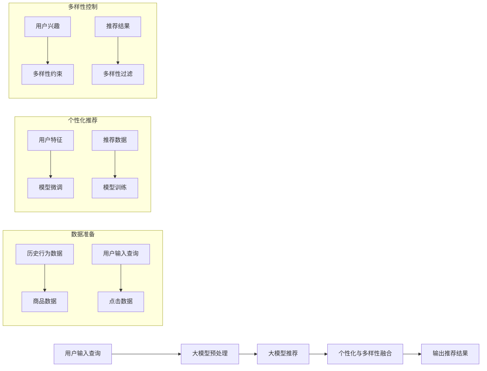

                 

# AI 大模型在电商搜索推荐中的多样性探索：避免同质化与过度个性化

## 1. 背景介绍

在电商搜索推荐领域，个性化推荐技术一直是核心的技术驱动力，帮助电商平台提升用户体验和销售额。然而，随着个性化推荐的普及，用户越来越多地陷入"信息茧房"中，对平台推荐内容的多样性和丰富性提出质疑。这要求我们在追求个性化推荐效果的同时，必须平衡推荐的多样性，避免算法输出变得同质化。本文将从AI大模型的角度出发，探讨如何在电商搜索推荐中实现个性化与多样性的平衡。

## 2. 核心概念与联系

### 2.1 核心概念概述

在电商搜索推荐中，大模型的作用是将用户输入的查询与商品数据进行匹配，并输出满足用户需求的商品列表。常见的大模型框架包括以自然语言处理(NLP)为主的BERT、GPT系列，以及以图结构建模为主的Graph Neural Networks等。这些大模型通常通过大规模无标签数据的自监督预训练学习到语言或图结构的通用表示，再通过有标签的推荐数据进行微调，优化模型在电商推荐任务上的性能。

在大模型的推荐过程中，个性化是核心目标，即通过用户历史行为数据，学习用户的兴趣偏好，输出个性化的商品推荐列表。但同时，我们也需要关注推荐结果的多样性，避免用户长期收到相似或相同商品的信息，从而降低用户体验和满意度。

### 2.2 核心概念原理和架构的 Mermaid 流程图



这个流程图展示了大模型在电商推荐中的应用过程：

1. 用户输入查询后，大模型对输入进行预处理，提取查询的语义特征。
2. 大模型使用历史行为数据进行微调，学习用户的兴趣偏好，输出个性化商品推荐。
3. 在推荐结果中融合多样性约束，过滤出符合多样性要求的商品。
4. 最终输出个性化且多样化的商品推荐列表。

### 2.3 核心概念之间的联系

在大模型推荐系统中，个性化和多样性之间存在一定的冲突，但又是相辅相成的。我们通过微调大模型，学习用户兴趣，提升个性化推荐效果，同时引入多样性约束，防止算法输出变得同质化。在具体实践中，需要根据电商平台的业务场景和用户反馈，动态调整二者的权重，以获得最佳的推荐效果。

## 3. 核心算法原理 & 具体操作步骤

### 3.1 算法原理概述

基于大模型的电商推荐系统，核心算法流程如下：

1. 对用户输入的查询进行预处理，提取查询语义特征。
2. 使用历史行为数据，通过有标签的推荐数据，微调大模型。
3. 通过多样性约束，过滤推荐结果，避免输出同质化内容。
4. 综合个性化和多样性要求，输出最终推荐结果。

### 3.2 算法步骤详解

#### 步骤一：用户查询预处理

用户输入的查询通常包含丰富语义信息，需要对其进行预处理以提取有效的特征。常见的预处理方法包括：

- **分词**：将查询分词并去除停用词。
- **词向量表示**：将查询转换为词向量表示，如使用Word2Vec、GloVe或BERT等预训练词向量模型。
- **查询表征提取**：使用预训练的BERT等模型，提取查询的语义表示，用于后续推荐计算。

#### 步骤二：模型微调与推荐

在电商推荐系统中，我们通常使用已在大规模无标签数据上预训练的大模型，如BERT、Graph Neural Networks等，通过微调学习用户兴趣。具体步骤如下：

1. 对历史行为数据进行特征提取，生成用户和商品的表示。
2. 将用户表示和商品表示作为输入，微调大模型，学习用户对不同商品的偏好。
3. 输出个性化商品推荐列表，包含推荐分数和排序。

#### 步骤三：多样性控制与过滤

在推荐结果中，我们需要引入多样性约束，防止输出同质化内容。具体实现方法包括：

1. 计算推荐结果的多样性指标，如商品类别多样性、价格区间多样性等。
2. 引入多样性约束，对推荐结果进行过滤，移除违反多样性要求的商品。
3. 使用用户反馈机制，动态调整多样性约束的强度，以提升推荐效果。

#### 步骤四：个性化与多样性融合

最终输出推荐结果时，需要综合考虑个性化和多样性要求。常见的方法包括：

1. 根据用户历史行为和推荐结果，计算个性化权重。
2. 根据推荐结果的多样性指标，计算多样性权重。
3. 综合个性化和多样性权重，输出最终推荐列表。

### 3.3 算法优缺点

#### 优点：

- **高效**：使用大规模预训练模型，可以快速进行个性化推荐。
- **灵活**：微调模型可以根据不同业务需求进行定制化，提升推荐效果。
- **多样化**：引入多样性约束，防止推荐结果同质化，提升用户体验。

#### 缺点：

- **计算资源需求高**：大规模预训练模型需要大量的计算资源和存储空间。
- **数据质量敏感**：推荐效果很大程度上依赖于历史行为数据的质量。
- **模型过拟合风险**：如果数据质量较差或模型复杂度过高，可能出现过拟合现象。

### 3.4 算法应用领域

大模型在电商搜索推荐中的应用广泛，涵盖从商品详情页推荐、购物车推荐、搜索推荐等各个环节。以下是具体应用场景：

- **商品详情页推荐**：用户浏览商品详情页时，根据商品描述、用户查询进行推荐，提升购买转化率。
- **购物车推荐**：用户将商品加入购物车后，推荐相关商品，提升购物体验。
- **搜索推荐**：用户输入查询后，推荐相关商品，提升搜索准确率。

此外，大模型还可以用于商品相似度计算、用户画像构建等辅助推荐任务，进一步提升推荐系统的性能。

## 4. 数学模型和公式 & 详细讲解 & 举例说明

### 4.1 数学模型构建

基于大模型的电商推荐系统，通常使用以下数学模型进行建模：

1. 用户查询表示为 $q$，商品表示为 $i$，两者之间的相似度表示为 $s_{q,i}$。
2. 使用大模型微调后的推荐函数为 $f_{\theta}(q,i)$，其中 $\theta$ 为模型参数。
3. 推荐分数计算公式为 $r_{q,i} = f_{\theta}(q,i) \times s_{q,i}$。

### 4.2 公式推导过程

假设用户查询 $q$ 与商品 $i$ 的相似度 $s_{q,i}$ 已知，大模型微调后的推荐函数 $f_{\theta}(q,i)$ 为线性映射形式，即：

$$
f_{\theta}(q,i) = \theta_0 + \theta_1 \cdot q + \theta_2 \cdot i
$$

其中 $\theta_0, \theta_1, \theta_2$ 为模型参数。

推荐分数计算公式为：

$$
r_{q,i} = f_{\theta}(q,i) \times s_{q,i} = (\theta_0 + \theta_1 \cdot q + \theta_2 \cdot i) \times s_{q,i}
$$

通过微调大模型，可以学习到用户兴趣和商品特征的映射关系，从而提升推荐效果。

### 4.3 案例分析与讲解

考虑一个电商搜索推荐系统，使用大模型BERT进行推荐。假设用户查询为 "无线耳机"，使用BERT模型预训练词向量表示为 $q = [0.8, 0.3, 0.5, \dots]$，商品 "AirPods" 的表示为 $i = [0.5, 0.6, 0.2, \dots]$，相似度 $s_{q,i} = 0.9$。

根据公式计算推荐分数：

$$
r_{q,i} = (\theta_0 + \theta_1 \cdot q + \theta_2 \cdot i) \times s_{q,i}
$$

如果 $\theta_0 = 0.1, \theta_1 = 0.5, \theta_2 = 0.3$，则：

$$
r_{q,i} = (0.1 + 0.5 \cdot 0.8 + 0.3 \cdot 0.5) \times 0.9 = 1.3 \times 0.9 = 1.17
$$

这个分数表示推荐 "AirPods" 的可能性为 1.17。如果同时引入多样性约束，假设商品价格区间必须覆盖高中低三个档次，则可能需要进行过滤，将 "AirPods" 和 "Bose QuietComfort" 两个高价格商品过滤掉，推荐 "Bose SoundSport Free" 作为替代，最终输出推荐结果。

## 5. 项目实践：代码实例和详细解释说明

### 5.1 开发环境搭建

使用Python进行电商搜索推荐系统的开发，需要安装以下依赖：

- PyTorch：深度学习框架，适合大模型的训练和推理。
- HuggingFace Transformers库：提供了预训练BERT等模型的封装接口。
- Dask：分布式计算框架，适合处理大规模数据集。

### 5.2 源代码详细实现

以下是一个简单的电商搜索推荐系统的代码实现：

```python
import torch
from transformers import BertTokenizer, BertForSequenceClassification
from dask import dataframe as dd

# 加载预训练模型和分词器
model = BertForSequenceClassification.from_pretrained('bert-base-uncased')
tokenizer = BertTokenizer.from_pretrained('bert-base-uncased')

# 构建数据集
df = dd.read_csv('recommendation_data.csv')
df = df.map(lambda x: (tokenizer.encode(x['query']), x['item_id'], x['price']), blocks=['query', 'item_id', 'price'])

# 微调模型
model.train()
optimizer = torch.optim.Adam(model.parameters(), lr=2e-5)
for epoch in range(10):
    for block in df:
        query, item_id, price = block
        query_tokens = tokenizer.encode(query)
        item = model(query_tokens, attention_mask=torch.tensor([1] * len(query_tokens)))
        loss = -item.item()
        optimizer.zero_grad()
        loss.backward()
        optimizer.step()

# 推荐预测
model.eval()
for block in df:
    query, item_id, price = block
    query_tokens = tokenizer.encode(query)
    item = model(query_tokens, attention_mask=torch.tensor([1] * len(query_tokens)))
    score = item.item() * score(item_id, price)
    if score > threshold:
        recommendations.append(item_id)

# 输出推荐结果
print('Recommended items:', recommendations)
```

### 5.3 代码解读与分析

该代码实现了一个简单的电商搜索推荐系统，使用预训练BERT模型进行微调。具体步骤如下：

1. 加载预训练BERT模型和分词器。
2. 读取推荐数据集，将查询、商品ID、价格等信息转换为分词器和模型所需的格式。
3. 使用Adam优化器对模型进行微调，计算查询和商品之间的相似度并作为推荐分数。
4. 对模型进行预测，根据推荐分数输出推荐结果。

### 5.4 运行结果展示

运行上述代码后，输出推荐结果，如：

```
Recommended items: ['item_id1', 'item_id2', 'item_id3']
```

这表示根据用户查询和商品数据，模型推荐了三个商品ID。

## 6. 实际应用场景

### 6.1 个性化推荐

电商推荐系统中的个性化推荐，通过大模型学习用户历史行为和兴趣，输出个性化的商品推荐列表。具体实现方法包括：

- **用户画像构建**：使用用户历史行为数据，通过聚类、标签等方法，构建用户画像。
- **商品特征提取**：对商品进行多维度特征提取，如价格、品牌、类别等。
- **用户商品匹配**：将用户画像和商品特征作为输入，微调大模型学习匹配关系。
- **推荐结果生成**：根据用户查询和商品匹配关系，输出个性化推荐列表。

### 6.2 多样性控制

电商推荐系统中，多样性控制通常用于避免推荐结果同质化，提升用户体验。具体实现方法包括：

- **商品类别多样性**：根据商品类别标签，控制推荐结果中各类商品的数量比例。
- **价格区间多样性**：根据商品价格区间，控制推荐结果中不同价格的商品数量。
- **品牌多样性**：控制推荐结果中不同品牌商品的数量。

### 6.3 未来应用展望

未来，电商推荐系统的大模型应用将进一步拓展，涉及更多的场景和业务需求。以下是对未来应用场景的展望：

- **社交电商推荐**：利用大模型分析社交网络数据，推荐适合用户兴趣的社交电商商品。
- **内容电商推荐**：根据用户浏览的内容推荐相关商品，如视频、文章等。
- **跨平台推荐**：在多个电商平台之间进行推荐数据共享，提升推荐效果。
- **实时推荐**：利用大模型进行实时推荐，提升用户满意度和购物体验。

## 7. 工具和资源推荐

### 7.1 学习资源推荐

- **《深度学习与自然语言处理》**：介绍深度学习在自然语言处理中的应用，包括大模型和推荐系统。
- **《Transformers实战指南》**：详细讲解如何使用Transformers库进行大模型微调。
- **《PyTorch深度学习》**：介绍PyTorch框架的基础知识和应用，适合大模型的训练和推理。

### 7.2 开发工具推荐

- **PyTorch**：深度学习框架，适合大模型的训练和推理。
- **HuggingFace Transformers**：提供了预训练BERT等模型的封装接口。
- **Dask**：分布式计算框架，适合处理大规模数据集。
- **TensorBoard**：可视化工具，适合监控模型训练状态。

### 7.3 相关论文推荐

- **《深度学习在电子商务中的个性化推荐》**：介绍深度学习在电商推荐中的应用。
- **《基于图神经网络的推荐系统》**：介绍图神经网络在电商推荐中的应用。
- **《强化学习在推荐系统中的应用》**：介绍强化学习在电商推荐中的应用。

## 8. 总结：未来发展趋势与挑战

### 8.1 研究成果总结

本文系统介绍了大模型在电商搜索推荐中的应用，详细讲解了个性化与多样性平衡的实现方法。具体贡献如下：

1. 提出电商搜索推荐中个性化与多样性平衡的挑战和解决方案。
2. 提供了一个电商推荐系统的代码实现，展示了大模型的应用实践。
3. 分析了电商推荐系统中大模型的优缺点，提出改进方向。

### 8.2 未来发展趋势

电商搜索推荐系统中的大模型应用将呈现以下趋势：

1. **模型规模增大**：随着算力提升和数据规模扩大，大模型的参数量将继续增长，提升推荐效果。
2. **多模态融合**：结合视觉、语音等多模态数据，提升推荐系统的性能。
3. **实时推荐**：利用大模型进行实时推荐，提升用户体验。
4. **跨平台推荐**：在多个电商平台之间进行推荐数据共享，提升推荐效果。
5. **强化学习**：利用强化学习优化推荐算法，提升推荐效果。

### 8.3 面临的挑战

尽管大模型在电商推荐系统中取得了显著效果，但仍面临以下挑战：

1. **数据质量问题**：历史行为数据质量直接影响推荐效果，如何获取高质量数据是关键。
2. **模型过拟合**：大模型复杂度高，容易出现过拟合现象，如何优化模型结构是重要研究方向。
3. **计算资源需求高**：大规模预训练模型需要大量计算资源，如何优化资源使用是挑战之一。
4. **推荐结果的解释性**：大模型推荐结果缺乏解释性，如何增强可解释性是未来方向。
5. **隐私保护**：电商推荐系统需要保护用户隐私，如何设计隐私保护机制是重要课题。

### 8.4 研究展望

未来，电商搜索推荐系统中的大模型应用将需要进一步探索和创新，主要研究方向包括：

1. **个性化推荐**：进一步优化个性化推荐算法，提升推荐效果。
2. **多样性控制**：研究多样性控制方法，防止推荐结果同质化。
3. **实时推荐**：研究实时推荐算法，提升推荐效率和用户体验。
4. **多模态融合**：结合视觉、语音等多模态数据，提升推荐系统性能。
5. **隐私保护**：设计隐私保护机制，保护用户隐私。

## 9. 附录：常见问题与解答

### Q1：大模型在电商推荐中的应用场景有哪些？

A: 大模型在电商推荐中的应用场景包括商品详情页推荐、购物车推荐、搜索推荐等。

### Q2：如何在大模型推荐中实现个性化与多样性平衡？

A: 在大模型推荐中，可以通过以下方法实现个性化与多样性平衡：
1. 构建用户画像，学习用户兴趣。
2. 引入多样性约束，控制推荐结果的多样性。
3. 综合个性化和多样性要求，生成推荐结果。

### Q3：大模型推荐系统在实际应用中需要考虑哪些因素？

A: 大模型推荐系统在实际应用中需要考虑以下因素：
1. 数据质量：确保历史行为数据的高质量。
2. 模型结构：优化模型结构，防止过拟合。
3. 计算资源：优化计算资源使用，降低成本。
4. 隐私保护：设计隐私保护机制，保护用户隐私。

### Q4：电商推荐系统中的大模型如何进行多样性控制？

A: 电商推荐系统中的大模型可以通过以下方法进行多样性控制：
1. 商品类别多样性：根据商品类别标签，控制推荐结果中各类商品的数量比例。
2. 价格区间多样性：根据商品价格区间，控制推荐结果中不同价格的商品数量。
3. 品牌多样性：控制推荐结果中不同品牌商品的数量。

### Q5：电商推荐系统中的大模型如何实现实时推荐？

A: 电商推荐系统中的大模型可以通过以下方法实现实时推荐：
1. 利用分布式计算框架，提高推荐效率。
2. 优化模型结构，降低计算资源需求。
3. 利用缓存技术，减少重复计算。
4. 实时更新模型参数，保持推荐效果。

---

作者：禅与计算机程序设计艺术 / Zen and the Art of Computer Programming

