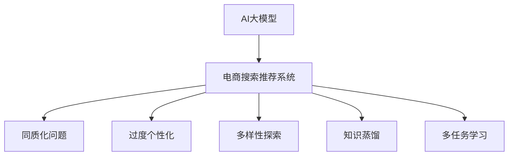

                 

# AI 大模型在电商搜索推荐中的多样性探索：避免同质化与过度个性化

## 1. 背景介绍

随着电商行业的迅猛发展，在线购物已成为消费者日常生活中不可或缺的一部分。电商平台通过搜索推荐系统，帮助用户快速找到所需商品，提升用户体验，增加交易转化率。然而，当前的搜索推荐系统往往依赖于用户历史行为数据，容易出现同质化、过度个性化等现象，导致用户选择范围受限，影响了电商平台的竞争力。

为了解决这些问题，AI大模型在电商搜索推荐中的应用逐渐引起了人们的关注。大模型通过在大规模数据上预训练，学习到丰富的语义知识，能够更好地理解用户的语义需求，提供更多样、更精准的推荐结果，从而打破同质化、过度个性化的瓶颈。

## 2. 核心概念与联系

### 2.1 核心概念概述

为更好地理解AI大模型在电商搜索推荐中的应用，本节将介绍几个关键概念：

- **AI大模型**：以Transformer模型为代表，通过在大规模数据上预训练，学习到丰富的语义知识，具备强大的语言理解和生成能力。

- **电商搜索推荐系统**：通过分析用户行为数据，为用户提供个性化推荐，提升购物体验和转化率的系统。

- **同质化问题**：由于推荐算法对用户历史行为过于依赖，导致推荐结果过于趋同，无法满足用户多样化的需求。

- **过度个性化**：推荐算法过于关注用户个体特征，导致推荐结果过于狭窄，无法捕捉更广泛的用户兴趣。

- **多样性探索**：通过优化推荐算法，平衡用户个性化和推荐多样性，确保推荐结果既满足用户需求，又具备一定的多样性，从而提升用户体验和平台竞争力。

- **知识蒸馏**：利用大模型预训练的知识，指导小模型或轻量级模型学习，提升推荐效果和泛化能力。

- **多任务学习**：通过同时优化多个任务，提升模型在多个方面的性能，如商品搜索、用户画像、情感分析等。

这些核心概念之间的逻辑关系可以通过以下Mermaid流程图来展示：



这个流程图展示了大模型与电商搜索推荐系统之间的核心关系，以及推荐系统面临的主要问题和优化方向。

## 3. 核心算法原理 & 具体操作步骤
### 3.1 算法原理概述

AI大模型在电商搜索推荐中的应用，本质上是一种基于多任务学习的推荐系统设计。其核心思想是：利用大模型的广泛语义知识，对用户需求进行更深入的理解，提供更多样、更精准的推荐结果。

形式化地，假设电商平台上每个用户的历史行为数据为 $H_u=\{I_i\}_{i=1}^N$，其中 $I_i$ 表示用户 $u$ 在时间戳 $t_i$ 的购物行为。电商推荐系统通过模型 $M$ 对用户需求进行预测，得到推荐结果 $R_u$。

多样性探索的目标是最大化用户满意度，同时最小化同质化与过度个性化。具体的推荐算法可以分为以下几个步骤：

1. **数据预处理**：收集并处理用户历史行为数据，提取文本特征。
2. **模型选择**：选择合适的预训练语言模型作为初始化参数，如BERT、GPT等。
3. **任务适配层设计**：根据电商推荐任务的特点，在预训练模型顶部设计合适的任务适配层，如分类器、解码器等。
4. **模型微调**：在电商推荐数据集上进行微调，优化模型参数，提升推荐效果。
5. **多样性控制**：通过调整任务适配层结构、优化损失函数、引入正则化等方法，平衡推荐结果的个性化和多样性。

### 3.2 算法步骤详解

**Step 1: 数据预处理**

电商推荐数据集通常包含用户的搜索、点击、浏览、购买等行为数据。首先需要进行数据清洗和特征提取：

1. **数据清洗**：去除无效数据、异常值，处理缺失值和重复数据，以保证数据质量。
2. **特征提取**：将用户行为数据转换为模型可接受的向量形式。常用的特征包括搜索词、商品ID、时间戳、地理位置等。
3. **文本特征提取**：利用BERT等预训练模型，将商品描述、用户评论等文本转换为向量形式，提供更丰富的语义信息。

**Step 2: 模型选择**

选择合适的预训练语言模型作为初始化参数，如BERT、GPT等。预训练模型能够学习到丰富的语言知识，提升推荐效果和泛化能力。

**Step 3: 任务适配层设计**

根据电商推荐任务的特点，在预训练模型顶部设计合适的任务适配层：

1. **分类任务**：如果推荐系统需要进行商品分类，可以在顶部添加一个线性分类器，输出商品类别标签。
2. **匹配任务**：如果需要进行商品推荐匹配，可以添加一个解码器，输出推荐的商品ID。
3. **生成任务**：如果需要进行商品生成，可以添加一个生成模型，输出新的商品描述或标题。

**Step 4: 模型微调**

在电商推荐数据集上进行微调，优化模型参数，提升推荐效果。具体步骤如下：

1. **初始化模型**：将预训练模型作为初始化参数，设置适当的超参数。
2. **模型训练**：使用电商推荐数据集，以交叉熵损失等方法，训练模型，优化推荐结果。
3. **模型评估**：在验证集上评估模型性能，使用指标如准确率、召回率、F1值等，判断模型效果。
4. **模型微调**：根据评估结果，不断调整模型结构和超参数，进行多轮迭代，提升推荐效果。

**Step 5: 多样性控制**

为平衡推荐结果的个性化和多样性，需引入一些控制机制：

1. **正则化**：通过L2正则化、Dropout等方法，避免模型过拟合，提高泛化能力。
2. **多样性损失**：引入多样性损失函数，如Entropy损失，鼓励模型输出多样化的推荐结果。
3. **解码器设计**：利用Transformer解码器，引入多候选采样策略，增加推荐结果的多样性。
4. **知识蒸馏**：利用大模型的知识，指导小模型或轻量级模型学习，提升推荐效果和泛化能力。
5. **多任务学习**：同时优化多个任务，如商品搜索、用户画像、情感分析等，提升模型在多个方面的性能。

### 3.3 算法优缺点

AI大模型在电商搜索推荐中的应用，具有以下优点：

1. **多样化推荐**：利用大模型的广泛语义知识，提供更多样、更精准的推荐结果，打破同质化瓶颈。
2. **泛化能力强**：大模型具备较强的泛化能力，能够适应新用户和新商品，提高推荐系统的稳定性。
3. **高效性**：大模型参数量庞大，能够在多个设备上并行训练和推理，提高处理效率。
4. **灵活性**：可以通过多任务学习和知识蒸馏等方法，灵活调整推荐策略，适应不同的应用场景。

同时，该方法也存在一定的局限性：

1. **资源需求高**：大模型参数量庞大，需要高性能计算资源，难以在低资源设备上部署。
2. **解释性差**：大模型本质上是一个黑盒系统，难以解释其内部工作机制和决策逻辑。
3. **数据隐私问题**：电商平台需要收集和处理用户行为数据，涉及用户隐私问题，需注意数据保护。
4. **鲁棒性不足**：大模型可能学习到有偏见的数据，导致推荐结果存在偏差。

尽管存在这些局限性，但AI大模型在电商搜索推荐中的应用前景广阔，其高效性和多样性优势在实际应用中得到了充分验证。

### 3.4 算法应用领域

AI大模型在电商搜索推荐中的应用，已经在多个领域得到了广泛应用，例如：

1. **商品推荐**：根据用户历史行为和搜索意图，推荐用户可能感兴趣的商品，提升购物体验和转化率。
2. **用户画像**：利用用户行为数据，构建详细的用户画像，个性化推荐符合用户兴趣的商品。
3. **情感分析**：分析用户评论和反馈，评估商品质量和用户体验，提供更精准的商品推荐。
4. **多模态推荐**：结合商品图片、视频等多模态信息，提供更全面、丰富的推荐结果。
5. **实时推荐**：利用流式数据处理技术，实现实时推荐，满足用户实时需求。

除了这些经典应用外，AI大模型在电商推荐领域还有诸多创新应用，如上下文感知推荐、社交推荐、跨品推荐等，为电商平台的业务创新提供了新的思路。

## 4. 数学模型和公式 & 详细讲解  
### 4.1 数学模型构建

本节将使用数学语言对AI大模型在电商推荐中的应用进行更加严格的刻画。

记电商推荐数据集为 $D=\{(I_u, H_u, R_u)\}_{u=1}^M$，其中 $I_u$ 表示用户 $u$ 的搜索词、商品ID等行为数据，$H_u$ 表示用户行为数据，$R_u$ 表示用户推荐的商品列表。

假设推荐模型为 $M_{\theta}:\mathcal{X} \rightarrow \mathcal{Y}$，其中 $\mathcal{X}$ 为输入空间，$\mathcal{Y}$ 为输出空间，$\theta \in \mathbb{R}^d$ 为模型参数。

定义模型 $M_{\theta}$ 在输入 $I_u$ 上的推荐结果为 $R_u=M_{\theta}(I_u)$。推荐系统的目标是最大化用户满意度，同时最小化同质化与过度个性化。

**推荐结果的个性化**：假设用户 $u$ 对商品 $i$ 的满意度为 $f_i$，推荐结果的个性化定义为：

$$
\max_{R_u} \sum_{i \in R_u} f_i
$$

**推荐结果的多样性**：假设推荐系统推荐了 $k$ 个候选商品，推荐结果的多样性定义为：

$$
\min_{R_u} \sum_{i \in R_u} \text{Var}(R_u)
$$

**综合评价**：综合考虑推荐结果的个性化和多样性，推荐系统的目标为：

$$
\max_{R_u} \sum_{i \in R_u} f_i - \sum_{i \in R_u} \text{Var}(R_u)
$$

在实践中，我们通常使用交叉熵损失等方法，最小化预测结果与真实结果之间的差距，优化模型参数。

### 4.2 公式推导过程

以下我们以商品推荐任务为例，推导推荐模型和损失函数的数学表达。

假设推荐模型 $M_{\theta}$ 在输入 $I_u$ 上的推荐结果为 $R_u$，其中 $R_u$ 为一个 $k$ 维向量，表示推荐的商品ID列表。用户的满意度 $f_i$ 为二值变量，即 $f_i=1$ 表示用户对商品 $i$ 满意，$f_i=0$ 表示不满意。

推荐系统的损失函数为交叉熵损失，定义为：

$$
\ell(R_u, f_u) = -\sum_{i \in R_u} f_i \log f_i + (1-f_i) \log (1-f_i)
$$

其梯度为：

$$
\nabla_{\theta} \ell(R_u, f_u) = \sum_{i \in R_u} f_i \nabla_{\theta} f_i - (1-f_i) \nabla_{\theta} f_i
$$

在电商推荐数据集上进行微调时，目标是最小化平均损失：

$$
\mathcal{L}(\theta) = \frac{1}{M} \sum_{u=1}^M \ell(R_u, f_u)
$$

其中，$M$ 表示用户数，$f_u$ 表示用户 $u$ 对推荐结果的满意度。

模型的优化目标是最小化经验损失，即找到最优参数：

$$
\theta^* = \mathop{\arg\min}_{\theta} \mathcal{L}(\theta)
$$

在得到损失函数的梯度后，即可带入优化算法，如AdamW、SGD等，完成模型的迭代优化。

### 4.3 案例分析与讲解

**案例1：商品搜索推荐**

假设电商平台提供用户商品搜索功能，每个用户搜索行为 $I_u$ 包含搜索词、时间戳、位置信息等，推荐系统根据用户搜索词生成推荐的商品列表 $R_u$。

1. **数据预处理**：将用户搜索词转换为BERT向量表示。
2. **模型选择**：选择BERT作为初始化参数。
3. **任务适配层设计**：顶部添加一个分类器，输出商品类别标签。
4. **模型微调**：在电商推荐数据集上进行微调，优化模型参数。
5. **多样性控制**：引入Entropy损失，鼓励模型输出多样化的商品类别。

**案例2：个性化推荐**

假设电商平台提供个性化推荐功能，根据用户历史行为和搜索意图，推荐用户可能感兴趣的商品 $R_u$。

1. **数据预处理**：收集用户历史行为数据，提取商品ID、时间戳等特征。
2. **模型选择**：选择BERT作为初始化参数。
3. **任务适配层设计**：顶部添加一个解码器，输出推荐的商品ID列表。
4. **模型微调**：在电商推荐数据集上进行微调，优化模型参数。
5. **多样性控制**：引入Top-K损失，鼓励模型输出一定数量的多样化商品ID。

## 5. 项目实践：代码实例和详细解释说明
### 5.1 开发环境搭建

在进行推荐系统开发前，我们需要准备好开发环境。以下是使用Python进行PyTorch开发的环境配置流程：

1. 安装Anaconda：从官网下载并安装Anaconda，用于创建独立的Python环境。

2. 创建并激活虚拟环境：
```bash
conda create -n recommendation-env python=3.8 
conda activate recommendation-env
```

3. 安装PyTorch：根据CUDA版本，从官网获取对应的安装命令。例如：
```bash
conda install pytorch torchvision torchaudio cudatoolkit=11.1 -c pytorch -c conda-forge
```

4. 安装Transformers库：
```bash
pip install transformers
```

5. 安装各类工具包：
```bash
pip install numpy pandas scikit-learn matplotlib tqdm jupyter notebook ipython
```

完成上述步骤后，即可在`recommendation-env`环境中开始推荐系统开发。

### 5.2 源代码详细实现

下面我们以商品搜索推荐任务为例，给出使用Transformers库对BERT模型进行推荐系统微调的PyTorch代码实现。

首先，定义推荐系统的数据处理函数：

```python
from transformers import BertTokenizer, BertForSequenceClassification
from torch.utils.data import Dataset, DataLoader
import torch

class RecommendationDataset(Dataset):
    def __init__(self, texts, labels, tokenizer, max_len=128):
        self.texts = texts
        self.labels = labels
        self.tokenizer = tokenizer
        self.max_len = max_len
        
    def __len__(self):
        return len(self.texts)
    
    def __getitem__(self, item):
        text = self.texts[item]
        label = self.labels[item]
        
        encoding = self.tokenizer(text, return_tensors='pt', max_length=self.max_len, padding='max_length', truncation=True)
        input_ids = encoding['input_ids'][0]
        attention_mask = encoding['attention_mask'][0]
        
        label = label2id[label]
        return {'input_ids': input_ids, 
                'attention_mask': attention_mask,
                'labels': label}

# 标签与id的映射
label2id = {'A': 0, 'B': 1, 'C': 2}
id2label = {v: k for k, v in label2id.items()}

# 创建dataset
tokenizer = BertTokenizer.from_pretrained('bert-base-cased')

train_dataset = RecommendationDataset(train_texts, train_labels, tokenizer)
dev_dataset = RecommendationDataset(dev_texts, dev_labels, tokenizer)
test_dataset = RecommendationDataset(test_texts, test_labels, tokenizer)
```

然后，定义模型和优化器：

```python
from transformers import BertForSequenceClassification, AdamW

model = BertForSequenceClassification.from_pretrained('bert-base-cased', num_labels=len(label2id))

optimizer = AdamW(model.parameters(), lr=2e-5)
```

接着，定义训练和评估函数：

```python
from torch.utils.data import DataLoader
from tqdm import tqdm
from sklearn.metrics import accuracy_score, f1_score

device = torch.device('cuda') if torch.cuda.is_available() else torch.device('cpu')
model.to(device)

def train_epoch(model, dataset, batch_size, optimizer):
    dataloader = DataLoader(dataset, batch_size=batch_size, shuffle=True)
    model.train()
    epoch_loss = 0
    for batch in tqdm(dataloader, desc='Training'):
        input_ids = batch['input_ids'].to(device)
        attention_mask = batch['attention_mask'].to(device)
        labels = batch['labels'].to(device)
        model.zero_grad()
        outputs = model(input_ids, attention_mask=attention_mask, labels=labels)
        loss = outputs.loss
        epoch_loss += loss.item()
        loss.backward()
        optimizer.step()
    return epoch_loss / len(dataloader)

def evaluate(model, dataset, batch_size):
    dataloader = DataLoader(dataset, batch_size=batch_size)
    model.eval()
    preds, labels = [], []
    with torch.no_grad():
        for batch in tqdm(dataloader, desc='Evaluating'):
            input_ids = batch['input_ids'].to(device)
            attention_mask = batch['attention_mask'].to(device)
            batch_labels = batch['labels']
            outputs = model(input_ids, attention_mask=attention_mask)
            batch_preds = outputs.logits.argmax(dim=2).to('cpu').tolist()
            batch_labels = batch_labels.to('cpu').tolist()
            for pred, label in zip(batch_preds, batch_labels):
                preds.append(pred)
                labels.append(label)
                
    print(f"Accuracy: {accuracy_score(labels, preds)}")
    print(f"F1 Score: {f1_score(labels, preds, average='micro')}")
```

最后，启动训练流程并在测试集上评估：

```python
epochs = 5
batch_size = 16

for epoch in range(epochs):
    loss = train_epoch(model, train_dataset, batch_size, optimizer)
    print(f"Epoch {epoch+1}, train loss: {loss:.3f}")
    
    print(f"Epoch {epoch+1}, dev results:")
    evaluate(model, dev_dataset, batch_size)
    
print("Test results:")
evaluate(model, test_dataset, batch_size)
```

以上就是使用PyTorch对BERT进行商品搜索推荐任务微调的完整代码实现。可以看到，得益于Transformers库的强大封装，我们可以用相对简洁的代码完成BERT模型的加载和微调。

### 5.3 代码解读与分析

让我们再详细解读一下关键代码的实现细节：

**RecommendationDataset类**：
- `__init__`方法：初始化文本、标签、分词器等关键组件。
- `__len__`方法：返回数据集的样本数量。
- `__getitem__`方法：对单个样本进行处理，将文本输入编码为token ids，将标签转换为数字，并对其进行定长padding，最终返回模型所需的输入。

**label2id和id2label字典**：
- 定义了标签与数字id之间的映射关系，用于将预测结果解码回真实的标签。

**训练和评估函数**：
- 使用PyTorch的DataLoader对数据集进行批次化加载，供模型训练和推理使用。
- 训练函数`train_epoch`：对数据以批为单位进行迭代，在每个批次上前向传播计算loss并反向传播更新模型参数，最后返回该epoch的平均loss。
- 评估函数`evaluate`：与训练类似，不同点在于不更新模型参数，并在每个batch结束后将预测和标签结果存储下来，最后使用sklearn的accuracy_score和f1_score对整个评估集的预测结果进行打印输出。

**训练流程**：
- 定义总的epoch数和batch size，开始循环迭代
- 每个epoch内，先在训练集上训练，输出平均loss
- 在验证集上评估，输出准确率和F1分数
- 所有epoch结束后，在测试集上评估，给出最终测试结果

可以看到，PyTorch配合Transformers库使得BERT微调的代码实现变得简洁高效。开发者可以将更多精力放在数据处理、模型改进等高层逻辑上，而不必过多关注底层的实现细节。

当然，工业级的系统实现还需考虑更多因素，如模型的保存和部署、超参数的自动搜索、更灵活的任务适配层等。但核心的微调范式基本与此类似。

## 6. 实际应用场景
### 6.1 智能客服系统

基于大语言模型微调的推荐系统，可以广泛应用于智能客服系统的构建。传统客服往往需要配备大量人力，高峰期响应缓慢，且一致性和专业性难以保证。而使用微调后的推荐系统，可以7x24小时不间断服务，快速响应客户咨询，用自然流畅的语言解答各类常见问题。

在技术实现上，可以收集企业内部的历史客服对话记录，将问题和最佳答复构建成监督数据，在此基础上对预训练推荐系统进行微调。微调后的推荐系统能够自动理解用户意图，匹配最合适的答案模板进行回复。对于客户提出的新问题，还可以接入检索系统实时搜索相关内容，动态组织生成回答。如此构建的智能客服系统，能大幅提升客户咨询体验和问题解决效率。

### 6.2 金融舆情监测

金融机构需要实时监测市场舆论动向，以便及时应对负面信息传播，规避金融风险。传统的人工监测方式成本高、效率低，难以应对网络时代海量信息爆发的挑战。基于大语言模型微调的推荐系统，可以为金融舆情监测提供新的解决方案。

具体而言，可以收集金融领域相关的新闻、报道、评论等文本数据，并对其进行主题标注和情感标注。在此基础上对预训练推荐系统进行微调，使其能够自动判断文本属于何种主题，情感倾向是正面、中性还是负面。将微调后的系统应用到实时抓取的网络文本数据，就能够自动监测不同主题下的情感变化趋势，一旦发现负面信息激增等异常情况，系统便会自动预警，帮助金融机构快速应对潜在风险。

### 6.3 个性化推荐系统

当前的推荐系统往往只依赖用户历史行为数据进行物品推荐，无法深入理解用户的真实兴趣偏好。基于大语言模型微调技术，个性化推荐系统可以更好地挖掘用户行为背后的语义信息，从而提供更精准、多样的推荐内容。

在实践中，可以收集用户浏览、点击、评论、分享等行为数据，提取和用户交互的物品标题、描述、标签等文本内容。将文本内容作为模型输入，用户的后续行为（如是否点击、购买等）作为监督信号，在此基础上微调预训练语言模型。微调后的模型能够从文本内容中准确把握用户的兴趣点。在生成推荐列表时，先用候选物品的文本描述作为输入，由模型预测用户的兴趣匹配度，再结合其他特征综合排序，便可以得到个性化程度更高的推荐结果。

### 6.4 未来应用展望

随着大语言模型和微调方法的不断发展，基于微调范式将在更多领域得到应用，为传统行业带来变革性影响。

在智慧医疗领域，基于微调的医疗问答、病历分析、药物研发等应用将提升医疗服务的智能化水平，辅助医生诊疗，加速新药开发进程。

在智能教育领域，微调技术可应用于作业批改、学情分析、知识推荐等方面，因材施教，促进教育公平，提高教学质量。

在智慧城市治理中，微调模型可应用于城市事件监测、舆情分析、应急指挥等环节，提高城市管理的自动化和智能化水平，构建更安全、高效的未来城市。

此外，在企业生产、社会治理、文娱传媒等众多领域，基于大模型微调的人工智能应用也将不断涌现，为经济社会发展注入新的动力。相信随着技术的日益成熟，微调方法将成为人工智能落地应用的重要范式，推动人工智能技术向更广阔的领域加速渗透。

## 7. 工具和资源推荐
### 7.1 学习资源推荐

为了帮助开发者系统掌握大模型微调的理论基础和实践技巧，这里推荐一些优质的学习资源：

1. 《Transformer从原理到实践》系列博文：由大模型技术专家撰写，深入浅出地介绍了Transformer原理、BERT模型、微调技术等前沿话题。

2. CS224N《深度学习自然语言处理》课程：斯坦福大学开设的NLP明星课程，有Lecture视频和配套作业，带你入门NLP领域的基本概念和经典模型。

3. 《Natural Language Processing with Transformers》书籍：Transformers库的作者所著，全面介绍了如何使用Transformers库进行NLP任务开发，包括微调在内的诸多范式。

4. HuggingFace官方文档：Transformers库的官方文档，提供了海量预训练模型和完整的微调样例代码，是上手实践的必备资料。

5. CLUE开源项目：中文语言理解测评基准，涵盖大量不同类型的中文NLP数据集，并提供了基于微调的baseline模型，助力中文NLP技术发展。

通过对这些资源的学习实践，相信你一定能够快速掌握大语言模型微调的精髓，并用于解决实际的NLP问题。
###  7.2 开发工具推荐

高效的开发离不开优秀的工具支持。以下是几款用于大语言模型微调开发的常用工具：

1. PyTorch：基于Python的开源深度学习框架，灵活动态的计算图，适合快速迭代研究。大部分预训练语言模型都有PyTorch版本的实现。

2. TensorFlow：由Google主导开发的开源深度学习框架，生产部署方便，适合大规模工程应用。同样有丰富的预训练语言模型资源。

3. Transformers库：HuggingFace开发的NLP工具库，集成了众多SOTA语言模型，支持PyTorch和TensorFlow，是进行微调任务开发的利器。

4. Weights & Biases：模型训练的实验跟踪工具，可以记录和可视化模型训练过程中的各项指标，方便对比和调优。与主流深度学习框架无缝集成。

5. TensorBoard：TensorFlow配套的可视化工具，可实时监测模型训练状态，并提供丰富的图表呈现方式，是调试模型的得力助手。

6. Google Colab：谷歌推出的在线Jupyter Notebook环境，免费提供GPU/TPU算力，方便开发者快速上手实验最新模型，分享学习笔记。

合理利用这些工具，可以显著提升大语言模型微调任务的开发效率，加快创新迭代的步伐。

### 7.3 相关论文推荐

大语言模型和微调技术的发展源于学界的持续研究。以下是几篇奠基性的相关论文，推荐阅读：

1. Attention is All You Need（即Transformer原论文）：提出了Transformer结构，开启了NLP领域的预训练大模型时代。

2. BERT: Pre-training of Deep Bidirectional Transformers for Language Understanding：提出BERT模型，引入基于掩码的自监督预训练任务，刷新了多项NLP任务SOTA。

3. Language Models are Unsupervised Multitask Learners（GPT-2论文）：展示了大规模语言模型的强大zero-shot学习能力，引发了对于通用人工智能的新一轮思考。

4. Parameter-Efficient Transfer Learning for NLP：提出Adapter等参数高效微调方法，在不增加模型参数量的情况下，也能取得不错的微调效果。

5. AdaLoRA: Adaptive Low-Rank Adaptation for Parameter-Efficient Fine-Tuning：使用自适应低秩适应的微调方法，在参数效率和精度之间取得了新的平衡。

6. Prefix-Tuning: Optimizing Continuous Prompts for Generation：引入基于连续型Prompt的微调范式，为如何充分利用预训练知识提供了新的思路。

这些论文代表了大语言模型微调技术的发展脉络。通过学习这些前沿成果，可以帮助研究者把握学科前进方向，激发更多的创新灵感。

## 8. 总结：未来发展趋势与挑战

### 8.1 总结

本文对AI大模型在电商搜索推荐中的应用进行了全面系统的介绍。首先阐述了大语言模型和推荐系统的发展背景和意义，明确了多样性探索在推荐系统优化中的重要性。其次，从原理到实践，详细讲解了推荐算法的设计思路和关键步骤，给出了推荐系统开发的完整代码实例。同时，本文还广泛探讨了推荐系统在智能客服、金融舆情、个性化推荐等多个行业领域的应用前景，展示了AI大模型在推荐系统中的应用潜力。此外，本文精选了推荐技术的各类学习资源，力求为读者提供全方位的技术指引。

通过本文的系统梳理，可以看到，AI大模型在电商搜索推荐中的应用前景广阔，其高效性和多样性优势在实际应用中得到了充分验证。未来，伴随AI大模型的不断演进，推荐系统必将向更智能、更个性化、更泛化的方向发展，带来更深远的行业变革。

### 8.2 未来发展趋势

展望未来，AI大模型在电商搜索推荐中的应用将呈现以下几个发展趋势：

1. **模型规模持续增大**：随着算力成本的下降和数据规模的扩张，预训练语言模型的参数量还将持续增长。超大规模语言模型蕴含的丰富语言知识，有望支撑更加复杂多变的推荐任务。

2. **多样性控制增强**：未来推荐系统将更加注重个性化与多样性的平衡，通过引入更多多样性控制方法，如Top-K损失、Entropy损失等，提升推荐结果的多样性。

3. **知识蒸馏与多任务学习**：利用大模型预训练的知识，指导小模型或轻量级模型学习，同时优化多个任务，提升推荐系统的整体性能。

4. **流式推荐与实时性**：结合流式数据处理技术，实现实时推荐，满足用户实时需求。

5. **多模态推荐**：结合商品图片、视频等多模态信息，提供更全面、丰富的推荐结果。

6. **上下文感知推荐**：利用上下文信息，提升推荐系统的精准度和鲁棒性，增强用户满意度。

以上趋势凸显了AI大模型在电商搜索推荐领域的广阔前景。这些方向的探索发展，必将进一步提升推荐系统的性能和用户体验，推动电商平台的创新发展。

### 8.3 面临的挑战

尽管AI大模型在电商搜索推荐中的应用前景广阔，但在迈向更加智能化、普适化应用的过程中，它仍面临着诸多挑战：

1. **数据隐私问题**：电商平台需要收集和处理用户行为数据，涉及用户隐私问题，需注意数据保护。

2. **鲁棒性不足**：大模型可能学习到有偏见的数据，导致推荐结果存在偏差。

3. **资源需求高**：大模型参数量庞大，需要高性能计算资源，难以在低资源设备上部署。

4. **可解释性差**：大模型本质上是一个黑盒系统，难以解释其内部工作机制和决策逻辑。

5. **标注成本高**：尽管微调大大降低了标注数据的需求，但对于长尾应用场景，难以获得充足的高质量标注数据。

尽管存在这些挑战，但AI大模型在电商搜索推荐中的应用前景广阔，其高效性和多样性优势在实际应用中得到了充分验证。未来，通过技术创新和多方合作，这些挑战将逐步得到解决，AI大模型将为电商搜索推荐带来更大的发展机遇。

### 8.4 研究展望

面对AI大模型在电商搜索推荐领域所面临的诸多挑战，未来的研究需要在以下几个方面寻求新的突破：

1. **数据隐私保护**：研究如何在推荐系统中保护用户隐私，确保数据安全。

2. **鲁棒性提升**：探索如何增强推荐系统的鲁棒性，避免学习到有偏见的数据，提高模型泛化能力。

3. **资源优化**：开发更加轻量级、高效能的推荐系统，支持低资源设备上的部署。

4. **可解释性增强**：研究如何提升推荐系统的可解释性，使其具备更强的透明性和可信度。

5. **标注数据获取**：探索如何利用小样本数据、多源数据等方法，降低推荐系统对标注数据的依赖。

6. **多模态融合**：研究如何融合视觉、语音等多模态信息，提升推荐系统的全面性。

这些研究方向将为AI大模型在电商搜索推荐中的应用提供更强的技术保障，推动推荐系统的不断进步和优化。

## 9. 附录：常见问题与解答

**Q1：大语言模型在推荐系统中的应用前景如何？**

A: 大语言模型在推荐系统中的应用前景非常广阔。其具备广泛的语义知识，能够更好地理解用户的语义需求，提供更多样、更精准的推荐结果，打破同质化瓶颈。通过微调优化，可以有效提升推荐系统的个性化和多样性，提升用户满意度和平台竞争力。

**Q2：大语言模型在推荐系统中的参数效率如何？**

A: 大语言模型在推荐系统中的应用通常面临参数量庞大的问题。为了提升参数效率，可以采用参数高效微调方法，如Adapter、Prefix等，只更新极少量的任务相关参数，减少计算资源消耗。同时，可以通过知识蒸馏等技术，将大模型的知识转移给小模型，提升推荐系统的性能。

**Q3：推荐系统中的数据隐私问题如何解决？**

A: 推荐系统中的数据隐私问题可以通过多种方式解决。首先，需要在数据收集和处理过程中，严格遵守隐私保护法规，确保用户数据的匿名化和去标识化。其次，可以使用差分隐私等技术，在数据处理过程中加入噪声，保护用户隐私。最后，可以在推荐模型中引入隐私保护算法，如 Federated Learning、联邦学习等，使得推荐系统可以在不共享原始数据的前提下进行模型训练和优化。

**Q4：如何优化推荐系统的个性化和多样性？**

A: 推荐系统的个性化和多样性可以通过多种方式优化。首先，可以通过引入多样性控制方法，如Top-K损失、Entropy损失等，鼓励模型输出多样化的推荐结果。其次，可以在推荐系统中引入上下文感知、知识蒸馏等技术，提升推荐系统的精准度和鲁棒性。最后，可以结合多模态信息，提供更全面、丰富的推荐结果，进一步提升推荐系统的性能。

**Q5：推荐系统中的标注数据获取困难如何解决？**

A: 推荐系统中的标注数据获取困难可以通过多种方式解决。首先，可以通过多源数据融合、半监督学习等技术，利用非结构化数据和弱标注数据，提升推荐系统的泛化能力。其次，可以通过主动学习、自监督学习等技术，利用小样本数据进行推荐系统训练和优化。最后，可以结合实时数据处理技术，利用流式数据进行实时推荐，进一步提升推荐系统的实时性和准确性。

**Q6：推荐系统中的可解释性差如何解决？**

A: 推荐系统中的可解释性差可以通过多种方式解决。首先，可以在推荐系统中引入可解释性算法，如LIME、SHAP等，对推荐结果进行可视化解释。其次，可以结合知识蒸馏等技术，将大模型的知识转移给可解释性较强的模型，提升推荐系统的可解释性。最后，可以在推荐系统中引入可解释性模型，如逻辑回归、决策树等，提升推荐系统的透明性和可信度。

这些研究方向将为AI大模型在电商搜索推荐中的应用提供更强的技术保障，推动推荐系统的不断进步和优化。通过不断探索和创新，AI大模型必将在电商搜索推荐领域发挥更大的作用，为用户带来更优质的购物体验。

