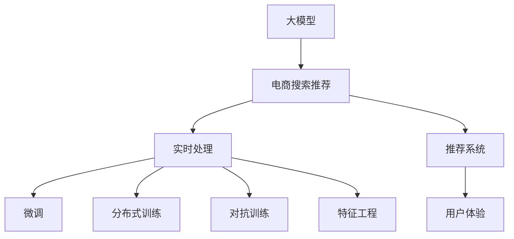

                 

# AI 大模型在电商搜索推荐中的实时处理技术：应对大规模复杂数据的挑战

## 1. 背景介绍

### 1.1 问题由来

随着电子商务的迅猛发展，电商搜索推荐系统成为了商家与用户之间连接的重要桥梁。通过精准的搜索推荐，电商平台可以显著提升用户体验，增加交易转化率，带来巨大的商业价值。

然而，电商搜索推荐系统的复杂性随着数据规模和业务需求的变化而不断增加。用户行为数据多样化、搜索意图表征丰富、商品属性动态变化等因素，使得推荐系统的模型构建和实时处理面临巨大挑战。

## 2. 核心概念与联系

### 2.1 核心概念概述

为了更好地理解AI大模型在电商搜索推荐中的应用，本节将介绍几个密切相关的核心概念：

- **大模型（Large Model）**：指由大规模参数构成的深度神经网络，通常用于处理复杂的非结构化数据，如自然语言处理、计算机视觉等领域。
- **电商搜索推荐（E-commerce Search Recommendation）**：利用用户行为数据和商品属性信息，通过机器学习算法生成推荐列表，提升用户购物体验和转化率。
- **实时处理（Real-time Processing）**：指在数据到达后能够快速响应的处理方式，通常用于在线应用或系统。
- **微调（Fine-tuning）**：在预训练模型的基础上，通过有监督数据调整模型参数，适应特定任务的策略。
- **分布式训练（Distributed Training）**：通过多台计算机同时训练模型，加速模型训练过程，处理大规模数据。
- **对抗训练（Adversarial Training）**：在模型训练过程中，引入对抗样本进行训练，增强模型鲁棒性。
- **特征工程（Feature Engineering）**：通过提取、选择和处理原始数据特征，提升模型的性能和泛化能力。
- **推荐系统（Recommendation System）**：利用算法为用户推荐合适的商品或服务，广泛应用于电商、视频、音乐等领域。

这些核心概念之间的逻辑关系可以通过以下Mermaid流程图来展示：



这个流程图展示了大模型在电商搜索推荐中的应用路径：

1. 大模型通过电商数据进行预训练。
2. 电商搜索推荐系统利用预训练模型进行微调和优化。
3. 实时处理技术确保系统快速响应。
4. 分布式训练和对抗训练提升模型性能。
5. 特征工程增强模型效果。
6. 推荐系统实现搜索推荐功能。
7. 提升用户体验和交易转化率。

## 3. 核心算法原理 & 具体操作步骤

### 3.1 算法原理概述

在电商搜索推荐系统中，AI大模型的主要任务是根据用户行为数据和商品属性信息，生成个性化的推荐列表。其核心算法包括：

- 用户行为建模：通过分析用户历史行为数据，构建用户兴趣和行为特征。
- 商品属性抽取：从商品描述中抽取关键属性，进行索引和匹配。
- 推荐模型训练：利用用户行为和商品属性数据，训练推荐模型，生成推荐列表。
- 实时处理：根据用户实时查询，快速计算推荐结果。

AI大模型在电商搜索推荐中的应用，主要依托于以下技术原理：

- 预训练技术：在大规模无标签数据上进行预训练，学习通用的语言和视觉表示。
- 微调技术：在电商数据上进行微调，适应特定任务和用户需求。
- 实时处理技术：通过分布式训练和算法优化，实现快速计算和响应。

### 3.2 算法步骤详解

1. **数据准备**
   - 收集电商平台的用户行为数据，包括浏览历史、购买记录、评分反馈等。
   - 收集商品的描述、标签、分类信息等属性数据。
   - 对数据进行清洗、归一化、标注等预处理。

2. **模型预训练**
   - 选择合适的预训练模型，如BERT、GPT等，在大规模无标签电商数据上进行预训练。
   - 利用语言模型或视觉模型进行预训练，学习通用的表示和特征。
   - 通过预训练，模型能够在电商数据上获得更好的初始化参数。

3. **模型微调**
   - 将预训练模型迁移到电商搜索推荐任务上，利用电商数据进行微调。
   - 设计合适的任务适配层，如全连接层、注意力机制等。
   - 选择适当的损失函数，如交叉熵、均方误差等，进行有监督训练。

4. **实时处理**
   - 设计高效的分布式算法，将电商搜索推荐任务分布到多台计算机上。
   - 利用并行计算和GPU加速技术，提升模型计算效率。
   - 采用缓存技术和索引技术，优化实时查询响应。

5. **效果评估**
   - 利用离线数据集评估模型效果，如精度、召回率、ROC-AUC等指标。
   - 根据实际业务需求，调整模型参数和优化算法。
   - 进行A/B测试，验证模型的实际效果和用户体验。

### 3.3 算法优缺点

AI大模型在电商搜索推荐中的实时处理技术具有以下优点：

- **高效性**：利用预训练和微调技术，快速构建高效的推荐模型。
- **可扩展性**：通过分布式训练，处理大规模电商数据。
- **鲁棒性**：通过对抗训练，提升模型对抗对抗样本和噪声的鲁棒性。
- **个性化**：通过特征工程和推荐算法，提供个性化推荐服务。

同时，该方法也存在以下局限性：

- **计算资源要求高**：大规模电商数据和实时处理需要强大的计算资源。
- **数据隐私问题**：电商数据涉及用户隐私，数据收集和使用需要符合相关法律法规。
- **模型复杂度高**：大模型和复杂算法需要更多的存储空间和训练时间。
- **实时性要求高**：电商系统对推荐结果的实时性要求极高，需要高效的实时处理算法。

尽管存在这些局限性，但AI大模型在电商搜索推荐中的应用仍然带来了显著的性能提升和用户体验改善。未来，需要进一步优化模型训练和实时处理的效率，降低计算资源消耗，同时保护用户隐私，提升模型可解释性，以应对更多的实际挑战。

### 3.4 算法应用领域

AI大模型在电商搜索推荐中的应用领域主要包括以下几个方面：

- **个性化推荐**：根据用户历史行为和商品属性，生成个性化推荐列表。
- **实时搜索**：快速响应用户搜索查询，提供实时搜索结果。
- **动态定价**：利用用户行为数据，实时调整商品价格，优化销售策略。
- **市场分析**：通过数据分析，洞察电商市场趋势和用户需求，指导商业决策。
- **欺诈检测**：识别恶意行为和异常交易，保障电商平台的健康运营。

## 4. 数学模型和公式 & 详细讲解

### 4.1 数学模型构建

在电商搜索推荐系统中，AI大模型通常包括如下几个模块：

- 用户行为表示模型：通过用户行为数据，构建用户兴趣向量 $u$。
- 商品属性表示模型：通过商品属性数据，构建商品特征向量 $v$。
- 推荐模型：利用用户兴趣向量和商品特征向量，计算推荐分数 $r(u,v)$。
- 推荐策略：根据推荐分数，生成推荐列表。

以下是一个简化的推荐模型：

$$
r(u,v) = \text{softmax}(W_u v + b_u)
$$

其中，$W_u$ 和 $b_u$ 是用户表示模型的权重和偏置，$v$ 是商品特征向量，$\text{softmax}$ 函数将分数转换为概率分布。

### 4.2 公式推导过程

对于电商搜索推荐任务，我们需要优化以下目标函数：

$$
\min_{\theta} \sum_{i=1}^N \ell(r_i, y_i)
$$

其中，$\ell$ 是损失函数，$y_i$ 是真实标签，$r_i$ 是预测分数。

在电商推荐系统中，常用的损失函数包括：

- 交叉熵损失：
$$
\ell(r_i, y_i) = -y_i \log r_i - (1-y_i) \log (1-r_i)
$$

- 均方误差损失：
$$
\ell(r_i, y_i) = \frac{1}{2} (r_i - y_i)^2
$$

优化目标函数时，通常采用梯度下降等优化算法，更新模型参数 $\theta$。

### 4.3 案例分析与讲解

假设我们有一个简单的电商推荐系统，使用基于物品的协同过滤算法。对于用户 $u$ 和商品 $v$，推荐分数为：

$$
r(u,v) = \frac{u \cdot v}{\sqrt{||u|| \cdot ||v|| + \epsilon}}
$$

其中，$\cdot$ 表示向量点积，$\epsilon$ 是一个小的正数，避免分母为零。

在电商推荐系统中，我们通常会采用以下步骤进行推荐：

1. 收集用户行为数据 $D_u = \{(x_t, i_t)\}_{t=1}^T$，其中 $x_t$ 表示用户行为，$i_t$ 表示行为对应的商品ID。
2. 将用户行为数据转换成向量 $u = \text{Vec}(D_u)$。
3. 对于每个商品 $v$，计算其特征向量 $v = \text{Vec}(v)$。
4. 计算用户和商品的相似度 $s = u \cdot v / (\sqrt{||u|| \cdot ||v|| + \epsilon})$。
5. 将相似度作为推荐分数，按分数排序生成推荐列表。

## 5. 项目实践：代码实例和详细解释说明

### 5.1 开发环境搭建

在进行电商搜索推荐系统的开发前，需要准备以下开发环境：

1. **Python环境**：使用Python 3.x版本，安装必要的库，如NumPy、Pandas、Scikit-learn等。
2. **分布式计算框架**：使用Apache Spark或Dask，方便分布式计算和数据处理。
3. **深度学习框架**：选择TensorFlow或PyTorch，进行大模型的训练和推理。
4. **数据存储**：使用Hadoop或Hive，方便数据存储和处理。
5. **实时处理引擎**：使用Kafka或Apache Flink，处理实时数据流。

### 5.2 源代码详细实现

下面是一个使用TensorFlow进行电商搜索推荐系统微调的示例代码：

```python
import tensorflow as tf
import numpy as np

# 定义用户行为表示模型
class UserEmbedding(tf.keras.Model):
    def __init__(self, embedding_dim):
        super(UserEmbedding, self).__init__()
        self.embedding = tf.keras.layers.Embedding(input_dim=num_users, output_dim=embedding_dim)
        
    def call(self, x):
        return self.embedding(x)

# 定义商品属性表示模型
class ItemEmbedding(tf.keras.Model):
    def __init__(self, embedding_dim):
        super(ItemEmbedding, self).__init__()
        self.embedding = tf.keras.layers.Embedding(input_dim=num_items, output_dim=embedding_dim)
        
    def call(self, x):
        return self.embedding(x)

# 定义推荐模型
class RecommendationModel(tf.keras.Model):
    def __init__(self, embedding_dim):
        super(RecommendationModel, self).__init__()
        self.user_embedding = UserEmbedding(embedding_dim)
        self.item_embedding = ItemEmbedding(embedding_dim)
        self.dot_product = tf.keras.layers.Dot(axes=1, normalize=True)
        
    def call(self, user, item):
        user_embedding = self.user_embedding(user)
        item_embedding = self.item_embedding(item)
        similarity = self.dot_product([user_embedding, item_embedding])
        return similarity

# 定义损失函数
def cross_entropy_loss(y_true, y_pred):
    return tf.reduce_mean(tf.nn.sigmoid_cross_entropy_with_logits(labels=y_true, logits=y_pred))

# 定义优化器
optimizer = tf.keras.optimizers.Adam(learning_rate=0.001)

# 准备数据
user_data = np.random.randint(0, num_users, size=(num_users, num_behaviors))
item_data = np.random.randint(0, num_items, size=(num_users, num_behaviors))
label_data = np.random.randint(0, 2, size=(num_users, num_behaviors))

# 训练模型
model = RecommendationModel(embedding_dim)
loss_fn = cross_entropy_loss

for epoch in range(num_epochs):
    with tf.GradientTape() as tape:
        y_pred = model(user_data, item_data)
        loss = loss_fn(label_data, y_pred)
    grads = tape.gradient(loss, model.trainable_variables)
    optimizer.apply_gradients(zip(grads, model.trainable_variables))
```

### 5.3 代码解读与分析

在以上代码中，我们定义了三个模块：用户行为表示模型、商品属性表示模型和推荐模型。其中，用户行为表示模型和商品属性表示模型分别通过Embedding层将用户行为和商品属性转换为向量表示。推荐模型则通过Dot Product层计算用户和商品的相似度，生成推荐分数。

我们选择了交叉熵损失函数，并使用Adam优化器进行模型训练。在训练过程中，我们通过反向传播计算梯度，并使用优化器更新模型参数。

### 5.4 运行结果展示

训练完成后，我们可以通过测试数据集对模型进行评估，计算推荐准确率和召回率等指标，以验证模型的效果。

## 6. 实际应用场景

### 6.1 智能推荐系统

智能推荐系统是电商搜索推荐系统的核心应用之一。通过AI大模型，电商平台可以根据用户历史行为和商品属性，生成个性化的推荐列表，提升用户购物体验和交易转化率。

例如，一个电商平台可以根据用户浏览历史、评分记录和商品标签，生成个性化推荐，帮助用户快速找到合适的商品。智能推荐系统可以实时响应用户查询，动态调整推荐列表，满足用户不断变化的需求。

### 6.2 实时搜索系统

实时搜索系统能够快速响应用户的搜索查询，提供实时的搜索结果。通过AI大模型，电商平台可以构建高效的搜索算法，提升搜索精度和响应速度。

例如，当用户输入“手机”时，电商平台可以通过AI大模型实时查询，从海量的商品中快速筛选出相关商品，并按相关性排序，提供给用户。实时搜索系统可以处理高并发请求，确保搜索体验的流畅性和稳定性。

### 6.3 动态定价系统

动态定价系统可以根据用户行为数据，实时调整商品价格，优化销售策略。通过AI大模型，电商平台可以预测用户对价格的敏感度，生成最优定价策略。

例如，一个电商平台可以根据用户的历史购买记录和行为数据，预测不同价格下的用户转化率，生成最优定价方案。动态定价系统可以实时调整价格，优化销售策略，提升销售额。

### 6.4 未来应用展望

未来，AI大模型在电商搜索推荐中的应用将进一步拓展，带来更多创新和突破：

- **跨模态推荐**：结合图像、音频等多模态数据，提升推荐系统的性能和效果。
- **实时广告投放**：根据用户行为数据，实时生成个性化广告，提升广告点击率和转化率。
- **用户情感分析**：通过NLP技术，分析用户评论和反馈，优化商品和服务。
- **市场趋势预测**：利用历史数据和用户行为，预测电商市场的趋势和用户需求，指导商业决策。
- **智能客服**：结合自然语言处理和机器学习技术，构建智能客服系统，提升客户服务体验。

## 7. 工具和资源推荐

### 7.1 学习资源推荐

为了帮助开发者掌握电商搜索推荐系统的核心技术，这里推荐一些优质的学习资源：

1. **《深度学习实战：自然语言处理与推荐系统》**：该书详细介绍了深度学习在自然语言处理和推荐系统中的应用，包括电商推荐系统的实现。
2. **《Python机器学习》**：该书介绍了机器学习在电商推荐系统中的应用，涵盖数据预处理、模型训练、模型评估等各个环节。
3. **TensorFlow官方文档**：TensorFlow提供了丰富的教程和示例代码，帮助开发者学习电商推荐系统的实现。
4. **HuggingFace Transformers库**：提供了多种预训练语言模型，方便电商推荐系统的开发。
5. **Apache Spark官方文档**：提供了Spark分布式计算的详细教程，帮助开发者处理大规模电商数据。

### 7.2 开发工具推荐

以下是几款用于电商搜索推荐系统开发的常用工具：

1. **TensorFlow**：基于Python的开源深度学习框架，支持分布式计算和模型训练。
2. **PyTorch**：基于Python的开源深度学习框架，支持动态图和静态图，灵活性高。
3. **Apache Spark**：分布式计算框架，适合处理大规模电商数据。
4. **Apache Flink**：实时计算框架，支持流式数据处理。
5. **Kafka**：分布式消息队列，支持数据流的可靠传输和处理。

### 7.3 相关论文推荐

电商搜索推荐系统领域的研究发展迅速，以下是几篇具有代表性的论文，推荐阅读：

1. **《Large-scale Recommendation Systems for E-commerce》**：介绍了基于协同过滤、深度学习和大模型的电商推荐系统。
2. **《E-commerce Search Results Retrieval Using Deep Neural Networks》**：介绍了基于深度神经网络的电商搜索推荐系统。
3. **《Real-time Recommendation for E-commerce Systems》**：介绍了实时推荐系统的架构和实现。
4. **《A Survey of Recommendation Systems in E-commerce》**：介绍了电商推荐系统的各类算法和应用。

## 8. 总结：未来发展趋势与挑战

### 8.1 总结

本文对AI大模型在电商搜索推荐中的应用进行了全面系统的介绍。首先阐述了电商搜索推荐系统的复杂性和挑战，明确了AI大模型在其中发挥的重要作用。其次，从原理到实践，详细讲解了电商搜索推荐系统的数学模型和算法流程，给出了具体的代码实现和分析。同时，本文还探讨了电商搜索推荐系统的实际应用场景，展示了AI大模型的巨大潜力和应用前景。最后，推荐了相关学习资源和开发工具，为开发者提供了全面的技术支持。

通过本文的系统梳理，可以看到，AI大模型在电商搜索推荐中的应用是大数据和人工智能技术的有机结合，带来了显著的性能提升和业务价值。未来，需要进一步优化模型的计算效率和可解释性，降低计算资源消耗，保护用户隐私，以应对更多的实际挑战。

### 8.2 未来发展趋势

展望未来，AI大模型在电商搜索推荐中的应用将呈现以下几个发展趋势：

1. **多模态融合**：结合图像、音频、文本等多种数据源，提升推荐系统的性能和效果。
2. **实时处理优化**：利用分布式计算和算法优化，提升推荐系统的实时响应能力。
3. **个性化推荐**：通过深度学习和大模型，提供更加个性化的推荐服务，提升用户体验。
4. **智能客服**：结合自然语言处理和机器学习技术，构建智能客服系统，提升客户服务体验。
5. **跨领域应用**：AI大模型在电商搜索推荐中的应用将拓展到更多领域，如金融、医疗等，提升各类服务的智能化水平。

### 8.3 面临的挑战

尽管AI大模型在电商搜索推荐中的应用带来了显著的性能提升和业务价值，但在迈向更加智能化、普适化应用的过程中，仍面临诸多挑战：

1. **数据隐私问题**：电商数据涉及用户隐私，数据收集和使用需要符合相关法律法规。
2. **模型复杂度**：大模型和复杂算法需要更多的存储空间和训练时间，计算资源消耗高。
3. **实时性要求高**：电商系统对推荐结果的实时性要求极高，需要高效的实时处理算法。
4. **可解释性不足**：AI大模型的决策过程缺乏可解释性，难以进行调试和优化。
5. **对抗样本风险**：电商推荐系统可能面临对抗样本攻击，需要增强模型的鲁棒性。

尽管存在这些挑战，但未来通过技术创新和工程优化，AI大模型在电商搜索推荐中的应用将进一步拓展，带来更多创新和突破。

### 8.4 研究展望

未来，需要在以下几个方面进行深入研究，以进一步提升AI大模型在电商搜索推荐中的应用：

1. **隐私保护技术**：研究如何保护用户隐私，同时获取高质量的电商数据。
2. **分布式计算优化**：研究如何优化分布式计算和存储，降低计算资源消耗。
3. **模型压缩与加速**：研究如何压缩和加速模型，提升实时处理能力。
4. **对抗样本防御**：研究如何增强模型的鲁棒性，抵御对抗样本攻击。
5. **可解释性增强**：研究如何增强模型的可解释性，提升系统的透明度和可信度。

只有持续优化算法和技术，提升模型的性能和可解释性，才能真正实现AI大模型在电商搜索推荐系统中的广泛应用。相信未来在技术创新和工程实践中，AI大模型将带来更多的突破，推动电商行业的数字化转型和升级。

## 9. 附录：常见问题与解答

### 9.1 常见问题

**Q1: 如何选择合适的预训练模型？**

A: 选择合适的预训练模型需要考虑以下几个因素：
1. 模型参数量：参数量大的模型通常具有更强的泛化能力，但计算资源消耗也更高。
2. 任务类型：不同任务可能需要不同类型的模型，如语言模型、视觉模型等。
3. 模型性能：在选择模型时需要评估其在新任务上的性能，确保能够满足业务需求。

**Q2: 如何处理数据不平衡问题？**

A: 数据不平衡是电商推荐系统面临的一个常见问题。处理数据不平衡的方法包括：
1. 过采样和欠采样：对少数类样本进行过采样，对多数类样本进行欠采样。
2. 类别权重调整：调整不同类别的权重，使得模型更加关注少数类样本。
3. 生成合成样本：使用生成模型生成合成样本，补充少数类数据。

**Q3: 如何提高模型鲁棒性？**

A: 提高模型鲁棒性需要考虑以下几个方面：
1. 对抗训练：在模型训练过程中加入对抗样本，增强模型的鲁棒性。
2. 数据增强：通过对数据进行增强，提升模型的泛化能力。
3. 模型正则化：使用L2正则、Dropout等技术，防止过拟合。

**Q4: 如何优化模型计算效率？**

A: 优化模型计算效率需要考虑以下几个方面：
1. 模型压缩：使用知识蒸馏、剪枝等技术，压缩模型参数。
2. 模型并行：使用分布式计算和并行计算，加速模型训练和推理。
3. 硬件优化：使用GPU、TPU等高性能硬件，提升计算效率。

**Q5: 如何保护用户隐私？**

A: 保护用户隐私需要考虑以下几个方面：
1. 数据匿名化：对用户数据进行匿名化处理，防止用户身份泄露。
2. 数据加密：对数据进行加密存储和传输，防止数据泄露。
3. 合规性：遵守相关法律法规，如GDPR等，确保数据使用的合法性。

### 9.2 问题解答

**Q1: 如何选择合适的预训练模型？**

A: 选择合适的预训练模型需要考虑以下几个因素：
1. 模型参数量：参数量大的模型通常具有更强的泛化能力，但计算资源消耗也更高。
2. 任务类型：不同任务可能需要不同类型的模型，如语言模型、视觉模型等。
3. 模型性能：在选择模型时需要评估其在新任务上的性能，确保能够满足业务需求。

**Q2: 如何处理数据不平衡问题？**

A: 数据不平衡是电商推荐系统面临的一个常见问题。处理数据不平衡的方法包括：
1. 过采样和欠采样：对少数类样本进行过采样，对多数类样本进行欠采样。
2. 类别权重调整：调整不同类别的权重，使得模型更加关注少数类样本。
3. 生成合成样本：使用生成模型生成合成样本，补充少数类数据。

**Q3: 如何提高模型鲁棒性？**

A: 提高模型鲁棒性需要考虑以下几个方面：
1. 对抗训练：在模型训练过程中加入对抗样本，增强模型的鲁棒性。
2. 数据增强：通过对数据进行增强，提升模型的泛化能力。
3. 模型正则化：使用L2正则、Dropout等技术，防止过拟合。

**Q4: 如何优化模型计算效率？**

A: 优化模型计算效率需要考虑以下几个方面：
1. 模型压缩：使用知识蒸馏、剪枝等技术，压缩模型参数。
2. 模型并行：使用分布式计算和并行计算，加速模型训练和推理。
3. 硬件优化：使用GPU、TPU等高性能硬件，提升计算效率。

**Q5: 如何保护用户隐私？**

A: 保护用户隐私需要考虑以下几个方面：
1. 数据匿名化：对用户数据进行匿名化处理，防止用户身份泄露。
2. 数据加密：对数据进行加密存储和传输，防止数据泄露。
3. 合规性：遵守相关法律法规，如GDPR等，确保数据使用的合法性。

---

作者：禅与计算机程序设计艺术 / Zen and the Art of Computer Programming

