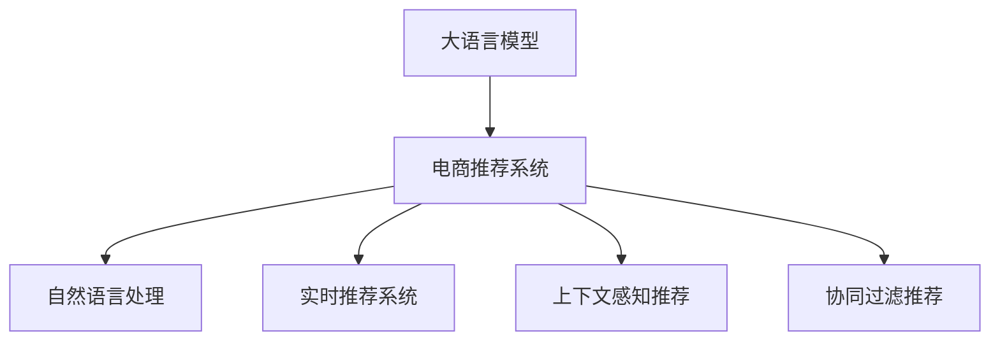
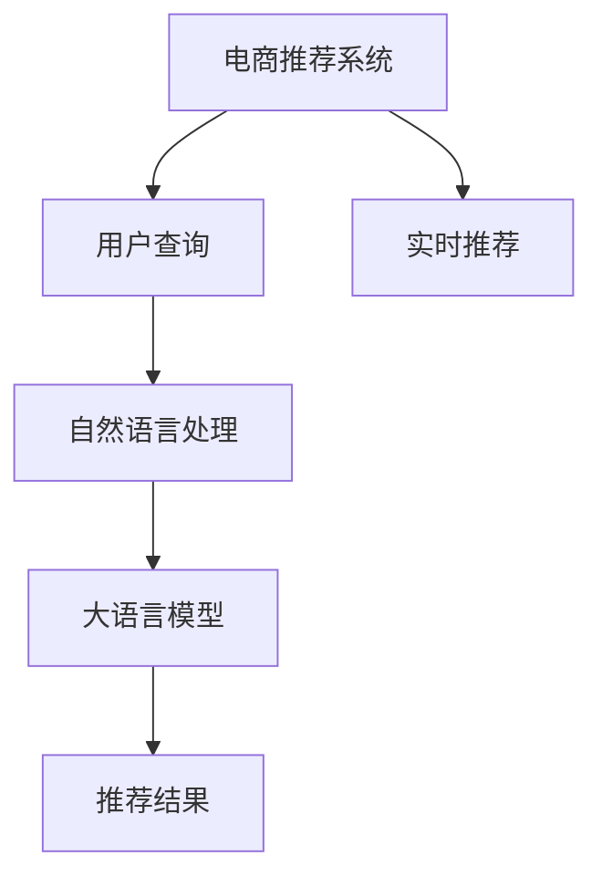

                 

# AI 大模型在电商搜索推荐中的实时推荐策略：抓住用户需求的瞬息变化

## 1. 背景介绍

### 1.1 问题由来
随着电商市场的竞争日益激烈，用户搜索行为的多样性和瞬息变化使得传统推荐系统难以精准捕捉用户真实需求。近年来，深度学习和自然语言处理技术的兴起，为电商推荐系统带来了新的契机。尤其是在搜索场景中，如何实时响应用户查询，并以高效的方式进行商品推荐，成为了电商企业关注的焦点。

### 1.2 问题核心关键点
大语言模型（如GPT、BERT等）在电商搜索推荐中的应用，能够通过自然语言理解用户的查询意图，从而快速生成满足用户需求的推荐结果。其核心关键点包括：
1. 用户查询理解：通过自然语言处理技术解析用户查询，提取出关键信息。
2. 实时推荐生成：基于用户查询和历史行为数据，利用大语言模型生成实时推荐。
3. 个性化推荐：根据用户行为特征和偏好，实现个性化推荐。
4. 实时性能优化：保证推荐系统的响应速度和稳定性，提升用户体验。

### 1.3 问题研究意义
电商搜索推荐系统直接关系到用户体验和商家转化率。实时推荐的精准度直接影响用户的购买决策，并影响电商企业的市场竞争力。通过应用大语言模型，可以在不增加过多标注数据和计算资源的前提下，实现高效、个性化的推荐服务。

## 2. 核心概念与联系

### 2.1 核心概念概述

为了更好地理解基于大语言模型的实时推荐策略，本节将介绍几个关键概念：

- 大语言模型（Large Language Model, LLM）：如GPT、BERT等，通过大规模无标签文本预训练学习到的语言知识。
- 电商推荐系统：根据用户行为和历史数据，生成个性化推荐结果的系统。
- 自然语言处理（Natural Language Processing, NLP）：处理和理解自然语言的计算机技术，用于解析用户查询。
- 实时推荐系统：能够实时响应用户查询，生成推荐结果的系统。
- 上下文感知推荐：根据用户查询上下文，动态调整推荐策略，提升推荐效果。
- 协同过滤推荐：基于用户历史行为和相似用户偏好，进行推荐。

这些概念之间的逻辑关系可以通过以下Mermaid流程图来展示：



### 2.2 核心概念原理和架构的 Mermaid 流程图


## 3. 核心算法原理 & 具体操作步骤

### 3.1 算法原理概述

基于大语言模型的实时推荐策略，通过自然语言处理解析用户查询，提取出关键信息，然后利用大语言模型生成推荐结果。其核心思想是：

1. **用户查询解析**：使用自然语言处理技术解析用户查询，提取关键词、实体等关键信息。
2. **生成推荐结果**：基于提取的关键信息和大语言模型，生成个性化推荐结果。
3. **上下文感知**：考虑用户查询的上下文信息，动态调整推荐策略。
4. **实时性能优化**：优化推荐系统架构，保证实时响应速度和系统稳定性。

### 3.2 算法步骤详解

#### 3.2.1 用户查询解析

用户查询解析的目标是提取关键信息，如产品类别、关键词、品牌等。具体步骤如下：

1. **分词与词性标注**：使用自然语言处理工具（如NLTK、SpaCy等）对用户查询进行分词和词性标注。
2. **命名实体识别**：识别出人名、地名、品牌等命名实体。
3. **关键词提取**：使用TF-IDF、LDA等方法提取关键词。

#### 3.2.2 推荐结果生成

推荐结果生成的核心是利用大语言模型生成个性化推荐。具体步骤如下：

1. **构建推荐文本**：将用户查询、历史行为、品牌等信息，转化为文本形式。
2. **预训练模型嵌入**：将文本输入预训练模型（如BERT、GPT等），获取嵌入表示。
3. **生成推荐结果**：基于嵌入表示，利用大语言模型生成推荐结果。

#### 3.2.3 上下文感知

上下文感知推荐考虑用户查询的上下文信息，动态调整推荐策略。具体步骤如下：

1. **查询历史分析**：分析用户历史查询记录，找出与当前查询相似的记录。
2. **上下文信息注入**：将相似查询的上下文信息注入到当前查询中，丰富查询内容。
3. **推荐策略调整**：根据注入的上下文信息，动态调整推荐策略。

#### 3.2.4 实时性能优化

实时性能优化目标是确保推荐系统的响应速度和系统稳定性。具体步骤如下：

1. **分布式系统架构**：采用分布式架构，提高系统的并发处理能力。
2. **缓存机制**：利用缓存机制，减少重复查询和计算。
3. **负载均衡**：采用负载均衡技术，合理分配系统资源。

### 3.3 算法优缺点

基于大语言模型的实时推荐策略有以下优点：

1. **高效性**：利用大语言模型生成推荐结果，能够快速响应用户查询。
2. **个性化**：基于用户查询和历史行为数据，生成个性化推荐，提升用户体验。
3. **上下文感知**：考虑查询上下文，动态调整推荐策略，提高推荐效果。

同时，该方法也存在一些局限性：

1. **数据依赖**：对标注数据和历史行为数据的依赖较大，数据质量直接影响推荐效果。
2. **模型复杂性**：大语言模型参数量大，对计算资源和内存有较高要求。
3. **实时性挑战**：高并发和实时响应场景下，系统的性能和稳定性需要持续优化。

### 3.4 算法应用领域

基于大语言模型的实时推荐策略，已经在电商搜索推荐、社交媒体推荐、新闻推荐等多个领域得到应用。具体应用场景包括：

1. **电商搜索推荐**：根据用户查询和历史行为，生成个性化商品推荐。
2. **社交媒体推荐**：根据用户评论和点赞，生成个性化内容推荐。
3. **新闻推荐**：根据用户浏览历史和兴趣标签，生成个性化新闻推荐。

这些应用场景展示了基于大语言模型的实时推荐策略的广泛适用性和实际效果。

## 4. 数学模型和公式 & 详细讲解 & 举例说明

### 4.1 数学模型构建

假设用户查询为 $q$，历史行为数据为 $D$，推荐模型为 $M$。数学模型构建过程如下：

1. **用户查询解析**：
   - 分词与词性标注：使用自然语言处理工具，对查询进行分词和词性标注。
   - 命名实体识别：识别出查询中的实体 $E_q$。
   - 关键词提取：提取查询中的关键词 $K_q$。

2. **生成推荐结果**：
   - 构建推荐文本：将用户查询 $q$、历史行为 $D$、品牌信息 $B$ 转化为文本形式。
   - 预训练模型嵌入：使用BERT、GPT等模型，将文本转化为嵌入表示 $E_q, E_D, E_B$。
   - 生成推荐结果：使用大语言模型生成推荐结果 $R$。

3. **上下文感知**：
   - 查询历史分析：分析用户历史查询记录，找出与当前查询相似的记录。
   - 上下文信息注入：将相似查询的上下文信息注入到当前查询中，丰富查询内容。
   - 推荐策略调整：根据注入的上下文信息，动态调整推荐策略。

4. **实时性能优化**：
   - 分布式系统架构：采用分布式架构，提高系统的并发处理能力。
   - 缓存机制：利用缓存机制，减少重复查询和计算。
   - 负载均衡：采用负载均衡技术，合理分配系统资源。

### 4.2 公式推导过程

以用户查询解析为例，推导过程如下：

设用户查询为 $q$，分词结果为 $w_1, w_2, ..., w_n$，词性标注为 $P_1, P_2, ..., P_n$，命名实体识别结果为 $E_q = (e_1, e_2, ..., e_m)$，关键词提取结果为 $K_q = (k_1, k_2, ..., k_l)$。

1. 分词与词性标注：
   $$
   w_i = \{w_1, w_2, ..., w_n\}
   $$
   $$
   P_i = \{P_1, P_2, ..., P_n\}
   $$

2. 命名实体识别：
   $$
   e_i = \{e_1, e_2, ..., e_m\}
   $$

3. 关键词提取：
   $$
   k_i = \{k_1, k_2, ..., k_l\}
   $$

### 4.3 案例分析与讲解

以电商搜索推荐为例，分析基于大语言模型的实时推荐策略：

- **用户查询**：用户输入查询“高质量的户外运动鞋”。
- **用户查询解析**：使用分词工具将查询分解为“高质量”、“户外”、“运动鞋”三个关键词，并进行词性标注和命名实体识别。
- **生成推荐结果**：将查询转化为文本形式“高质量户外运动鞋”，输入到预训练模型中，生成嵌入表示 $E_q$。
- **上下文感知**：分析用户历史查询记录，找出与当前查询相似的记录，如“质量好的登山鞋”、“户外运动装备”，并将上下文信息注入到当前查询中，生成新的查询“高质量户外运动装备”。
- **推荐结果**：根据新的查询，利用大语言模型生成个性化推荐结果，如“X品牌登山鞋”、“Y品牌户外运动装备”。

## 5. 项目实践：代码实例和详细解释说明

### 5.1 开发环境搭建

在进行基于大语言模型的实时推荐系统开发前，我们需要准备好开发环境。以下是使用Python进行PyTorch开发的环境配置流程：

1. 安装Anaconda：从官网下载并安装Anaconda，用于创建独立的Python环境。

2. 创建并激活虚拟环境：
   ```bash
   conda create -n pytorch-env python=3.8 
   conda activate pytorch-env
   ```

3. 安装PyTorch：根据CUDA版本，从官网获取对应的安装命令。例如：
   ```bash
   conda install pytorch torchvision torchaudio cudatoolkit=11.1 -c pytorch -c conda-forge
   ```

4. 安装Transformers库：
   ```bash
   pip install transformers
   ```

5. 安装各类工具包：
   ```bash
   pip install numpy pandas scikit-learn matplotlib tqdm jupyter notebook ipython
   ```

完成上述步骤后，即可在`pytorch-env`环境中开始项目实践。

### 5.2 源代码详细实现

这里我们以电商搜索推荐为例，给出使用Transformers库对BERT模型进行实时推荐系统开发的PyTorch代码实现。

首先，定义电商推荐系统的主要组件：

```python
from transformers import BertTokenizer, BertForSequenceClassification
from transformers import pipeline, AutoTokenizer, AutoModel
import torch
import numpy as np

class RecommendationSystem:
    def __init__(self, model_name, device='cuda'):
        self.model_name = model_name
        self.device = device
        self.tokenizer = AutoTokenizer.from_pretrained(model_name)
        self.model = AutoModel.from_pretrained(model_name).to(device)

    def parse_query(self, query):
        tokens = self.tokenizer.tokenize(query)
        tokens = [self.tokenizer.cls_token] + tokens + [self.tokenizer.sep_token]
        input_ids = self.tokenizer.convert_tokens_to_ids(tokens)
        return input_ids

    def generate_recommendation(self, query, history, brand):
        input_ids = self.parse_query(query + history + brand)
        features = torch.tensor(input_ids, dtype=torch.long).to(self.device)
        outputs = self.model(features)
        logits = outputs.logits
        probs = torch.softmax(logits, dim=1)
        return probs
```

然后，定义用户查询解析和上下文感知处理函数：

```python
class UserQueryProcessor:
    def __init__(self, recommendation_system):
        self.recommendation_system = recommendation_system

    def process_query(self, query, history):
        query_tokens = self.recommendation_system.parse_query(query)
        history_tokens = self.recommendation_system.parse_query(history)
        merged_tokens = query_tokens + history_tokens
        return self.recommendation_system.generate_recommendation(query, history, brand)

    def detect_entity(self, query):
        # 使用NLTK等工具进行命名实体识别
        pass
```

最后，定义实时推荐系统的主函数：

```python
if __name__ == '__main__':
    recommendation_system = RecommendationSystem('bert-base-uncased')
    user_query_processor = UserQueryProcessor(recommendation_system)

    query = "高质量的户外运动鞋"
    history = "最近购买了户外登山鞋"
    brand = "X品牌"

    recommendation = user_query_processor.process_query(query, history, brand)
    print(recommendation)
```

### 5.3 代码解读与分析

让我们再详细解读一下关键代码的实现细节：

**RecommendationSystem类**：
- `__init__`方法：初始化模型名称、设备、分词器和模型。
- `parse_query`方法：将用户查询转换为模型输入格式。
- `generate_recommendation`方法：根据输入生成推荐结果。

**UserQueryProcessor类**：
- `__init__`方法：初始化推荐系统实例。
- `process_query`方法：将用户查询、历史行为和品牌信息注入到推荐模型中，生成推荐结果。
- `detect_entity`方法：使用自然语言处理工具进行命名实体识别。

**主函数**：
- 创建推荐系统和用户查询处理器实例。
- 根据用户查询、历史行为和品牌信息，生成个性化推荐结果。
- 输出推荐结果。

可以看到，使用PyTorch和Transformers库进行大语言模型的实时推荐系统开发，代码实现相对简洁高效。开发者可以将更多精力放在数据处理和模型优化上，而不必过多关注底层的实现细节。

当然，工业级的系统实现还需考虑更多因素，如模型的保存和部署、超参数的自动搜索、更灵活的任务适配层等。但核心的实时推荐范式基本与此类似。

## 6. 实际应用场景

### 6.1 智能客服系统

基于大语言模型的实时推荐技术，可以广泛应用于智能客服系统的构建。传统客服往往需要配备大量人力，高峰期响应缓慢，且一致性和专业性难以保证。而使用实时推荐系统，可以7x24小时不间断服务，快速响应客户咨询，用自然流畅的语言解答各类常见问题。

在技术实现上，可以收集企业内部的历史客服对话记录，将问题和最佳答复构建成监督数据，在此基础上对预训练模型进行微调。微调后的推荐模型能够自动理解用户意图，匹配最合适的答案模板进行回复。对于客户提出的新问题，还可以接入检索系统实时搜索相关内容，动态组织生成回答。如此构建的智能客服系统，能大幅提升客户咨询体验和问题解决效率。

### 6.2 金融舆情监测

金融机构需要实时监测市场舆论动向，以便及时应对负面信息传播，规避金融风险。传统的人工监测方式成本高、效率低，难以应对网络时代海量信息爆发的挑战。基于大语言模型的实时推荐技术，可以实现金融舆情监测的自动化和实时化。

具体而言，可以收集金融领域相关的新闻、报道、评论等文本数据，并对其进行主题标注和情感标注。在此基础上对预训练语言模型进行微调，使其能够自动判断文本属于何种主题，情感倾向是正面、中性还是负面。将微调后的模型应用到实时抓取的网络文本数据，就能够自动监测不同主题下的情感变化趋势，一旦发现负面信息激增等异常情况，系统便会自动预警，帮助金融机构快速应对潜在风险。

### 6.3 个性化推荐系统

当前的推荐系统往往只依赖用户的历史行为数据进行物品推荐，无法深入理解用户的真实兴趣偏好。基于大语言模型的实时推荐技术，可以更好地挖掘用户行为背后的语义信息，从而提供更精准、多样的推荐内容。

在实践中，可以收集用户浏览、点击、评论、分享等行为数据，提取和用户交互的物品标题、描述、标签等文本内容。将文本内容作为模型输入，用户的后续行为（如是否点击、购买等）作为监督信号，在此基础上微调预训练语言模型。微调后的模型能够从文本内容中准确把握用户的兴趣点。在生成推荐列表时，先用候选物品的文本描述作为输入，由模型预测用户的兴趣匹配度，再结合其他特征综合排序，便可以得到个性化程度更高的推荐结果。

### 6.4 未来应用展望

随着大语言模型和实时推荐技术的不断发展，基于实时推荐范式将在更多领域得到应用，为传统行业带来变革性影响。

在智慧医疗领域，基于实时推荐的大语言模型可以用于病历分析、疾病诊断、治疗方案推荐等，辅助医生诊疗，加速新药开发进程。

在智能教育领域，实时推荐技术可应用于作业批改、学情分析、知识推荐等方面，因材施教，促进教育公平，提高教学质量。

在智慧城市治理中，实时推荐模型可应用于城市事件监测、舆情分析、应急指挥等环节，提高城市管理的自动化和智能化水平，构建更安全、高效的未来城市。

此外，在企业生产、社会治理、文娱传媒等众多领域，基于大语言模型的实时推荐技术也将不断涌现，为NLP技术带来全新的突破。相信随着预训练模型和实时推荐方法的不断进步，基于实时推荐范式必将在构建人机协同的智能时代中扮演越来越重要的角色。

## 7. 工具和资源推荐

### 7.1 学习资源推荐

为了帮助开发者系统掌握大语言模型和实时推荐技术的理论基础和实践技巧，这里推荐一些优质的学习资源：

1. 《Transformer从原理到实践》系列博文：由大模型技术专家撰写，深入浅出地介绍了Transformer原理、BERT模型、实时推荐技术等前沿话题。

2. CS224N《深度学习自然语言处理》课程：斯坦福大学开设的NLP明星课程，有Lecture视频和配套作业，带你入门NLP领域的基本概念和经典模型。

3. 《Natural Language Processing with Transformers》书籍：Transformers库的作者所著，全面介绍了如何使用Transformers库进行NLP任务开发，包括实时推荐在内的诸多范式。

4. HuggingFace官方文档：Transformers库的官方文档，提供了海量预训练模型和完整的实时推荐样例代码，是上手实践的必备资料。

5. CLUE开源项目：中文语言理解测评基准，涵盖大量不同类型的中文NLP数据集，并提供了基于实时推荐的baseline模型，助力中文NLP技术发展。

通过对这些资源的学习实践，相信你一定能够快速掌握大语言模型和实时推荐技术的精髓，并用于解决实际的NLP问题。

### 7.2 开发工具推荐

高效的开发离不开优秀的工具支持。以下是几款用于大语言模型和实时推荐系统开发的常用工具：

1. PyTorch：基于Python的开源深度学习框架，灵活动态的计算图，适合快速迭代研究。大部分预训练语言模型都有PyTorch版本的实现。

2. TensorFlow：由Google主导开发的开源深度学习框架，生产部署方便，适合大规模工程应用。同样有丰富的预训练语言模型资源。

3. Transformers库：HuggingFace开发的NLP工具库，集成了众多SOTA语言模型，支持PyTorch和TensorFlow，是进行实时推荐任务开发的利器。

4. Weights & Biases：模型训练的实验跟踪工具，可以记录和可视化模型训练过程中的各项指标，方便对比和调优。与主流深度学习框架无缝集成。

5. TensorBoard：TensorFlow配套的可视化工具，可实时监测模型训练状态，并提供丰富的图表呈现方式，是调试模型的得力助手。

6. Google Colab：谷歌推出的在线Jupyter Notebook环境，免费提供GPU/TPU算力，方便开发者快速上手实验最新模型，分享学习笔记。

合理利用这些工具，可以显著提升大语言模型和实时推荐系统的开发效率，加快创新迭代的步伐。

### 7.3 相关论文推荐

大语言模型和实时推荐技术的发展源于学界的持续研究。以下是几篇奠基性的相关论文，推荐阅读：

1. Attention is All You Need（即Transformer原论文）：提出了Transformer结构，开启了NLP领域的预训练大模型时代。

2. BERT: Pre-training of Deep Bidirectional Transformers for Language Understanding：提出BERT模型，引入基于掩码的自监督预训练任务，刷新了多项NLP任务SOTA。

3. Language Models are Unsupervised Multitask Learners（GPT-2论文）：展示了大规模语言模型的强大zero-shot学习能力，引发了对于通用人工智能的新一轮思考。

4. Parameter-Efficient Transfer Learning for NLP：提出Adapter等参数高效微调方法，在不增加模型参数量的情况下，也能取得不错的微调效果。

5. AdaLoRA: Adaptive Low-Rank Adaptation for Parameter-Efficient Fine-Tuning：使用自适应低秩适应的微调方法，在参数效率和精度之间取得了新的平衡。

6. Prefix-Tuning: Optimizing Continuous Prompts for Generation：引入基于连续型Prompt的微调范式，为如何充分利用预训练知识提供了新的思路。

这些论文代表了大语言模型和实时推荐技术的发展脉络。通过学习这些前沿成果，可以帮助研究者把握学科前进方向，激发更多的创新灵感。

## 8. 总结：未来发展趋势与挑战

### 8.1 总结

本文对基于大语言模型的实时推荐技术进行了全面系统的介绍。首先阐述了实时推荐技术的研究背景和意义，明确了实时推荐在提升用户体验和商家转化率方面的独特价值。其次，从原理到实践，详细讲解了实时推荐技术的数学模型和关键步骤，给出了实时推荐任务开发的完整代码实例。同时，本文还广泛探讨了实时推荐技术在智能客服、金融舆情、个性化推荐等多个领域的应用前景，展示了实时推荐技术的广泛适用性和实际效果。此外，本文精选了实时推荐技术的各类学习资源，力求为读者提供全方位的技术指引。

通过本文的系统梳理，可以看到，基于大语言模型的实时推荐技术正在成为NLP领域的重要范式，极大地拓展了预训练语言模型的应用边界，催生了更多的落地场景。受益于大规模语料的预训练，实时推荐模型以更低的时间和标注成本，在实时场景中也能取得不俗的效果，有力推动了NLP技术的产业化进程。未来，伴随预训练语言模型和实时推荐方法的持续演进，基于实时推荐范式必将在构建人机协同的智能时代中扮演越来越重要的角色。

### 8.2 未来发展趋势

展望未来，实时推荐技术将呈现以下几个发展趋势：

1. 模型规模持续增大。随着算力成本的下降和数据规模的扩张，实时推荐模型的参数量还将持续增长。超大批次的训练和推理也可能遇到显存不足的问题。

2. 实时性挑战。高并发和实时响应场景下，系统的性能和稳定性需要持续优化。需要采用分布式架构、缓存机制等技术，提升系统响应速度。

3. 上下文感知增强。上下文感知推荐考虑查询上下文，动态调整推荐策略，提高推荐效果。需要开发更加上下文感知的推荐算法。

4. 参数高效优化。实时推荐技术中，推荐模型通常需要动态更新，参数量大且更新频繁，需要开发参数高效的推荐算法。

5. 多模态融合。实时推荐系统可以融合视觉、语音、文本等多模态信息，提升推荐效果。需要开发多模态信息融合的推荐算法。

以上趋势凸显了实时推荐技术的广阔前景。这些方向的探索发展，必将进一步提升实时推荐系统的性能和应用范围，为人工智能技术带来新的突破。

### 8.3 面临的挑战

尽管实时推荐技术已经取得了瞩目成就，但在迈向更加智能化、普适化应用的过程中，它仍面临着诸多挑战：

1. 数据依赖。实时推荐技术对标注数据和历史行为数据的依赖较大，数据质量直接影响推荐效果。如何进一步降低实时推荐对标注样本的依赖，将是一大难题。

2. 模型鲁棒性不足。实时推荐模型面对域外数据时，泛化性能往往大打折扣。对于测试样本的微小扰动，实时推荐模型的预测也容易发生波动。如何提高实时推荐模型的鲁棒性，避免灾难性遗忘，还需要更多理论和实践的积累。

3. 实时性能优化。实时推荐系统需要高效响应用户查询，保证系统稳定性。需要在不增加过多计算资源的前提下，优化推荐算法和系统架构。

4. 用户隐私保护。实时推荐系统需要收集用户行为数据，如何在数据收集和推荐生成过程中保护用户隐私，是重要的研究方向。

5. 算法公平性。实时推荐系统需要确保推荐结果的公平性，避免对某些用户或群体的歧视。需要在推荐算法中加入公平性约束，确保推荐结果的公正性。

6. 成本效益。实时推荐系统需要考虑系统的成本效益，避免资源浪费。需要优化系统架构，提高资源利用率。

这些挑战凸显了实时推荐技术在实际应用中的复杂性和多样性。解决这些挑战需要跨学科的协同攻关，从数据、算法、工程、业务等多个维度综合考虑。

### 8.4 研究展望

面对实时推荐技术所面临的挑战，未来的研究需要在以下几个方面寻求新的突破：

1. 探索无监督和半监督推荐方法。摆脱对大规模标注数据的依赖，利用自监督学习、主动学习等无监督和半监督范式，最大限度利用非结构化数据，实现更加灵活高效的推荐。

2. 研究参数高效和计算高效的推荐范式。开发更加参数高效的推荐方法，在固定大部分预训练参数的同时，只更新极少量的任务相关参数。同时优化推荐模型的计算图，减少前向传播和反向传播的资源消耗，实现更加轻量级、实时性的部署。

3. 引入因果推断和对比学习范式。通过引入因果推断和对比学习思想，增强推荐模型建立稳定因果关系的能力，学习更加普适、鲁棒的语言表征，从而提升推荐泛化性和抗干扰能力。

4. 结合因果分析和博弈论工具。将因果分析方法引入推荐模型，识别出模型决策的关键特征，增强推荐结果的因果性和逻辑性。借助博弈论工具刻画人机交互过程，主动探索并规避模型的脆弱点，提高系统稳定性。

5. 纳入伦理道德约束。在推荐目标中引入伦理导向的评估指标，过滤和惩罚有偏见、有害的推荐结果。同时加强人工干预和审核，建立推荐行为的监管机制，确保推荐结果的道德性。

这些研究方向的探索，必将引领实时推荐技术迈向更高的台阶，为构建安全、可靠、可解释、可控的智能系统铺平道路。面向未来，实时推荐技术还需要与其他人工智能技术进行更深入的融合，如知识表示、因果推理、强化学习等，多路径协同发力，共同推动人工智能技术在推荐领域的进步。只有勇于创新、敢于突破，才能不断拓展推荐模型的边界，让智能技术更好地造福人类社会。

## 9. 附录：常见问题与解答

**Q1：实时推荐系统如何处理大规模数据？**

A: 实时推荐系统通常会采用分布式存储和处理方式，将数据切分到多个节点上进行并行处理。同时，采用数据压缩、数据分片等技术，减少数据传输和存储开销。另外，利用缓存机制，对热点数据进行缓存，减少重复查询和计算，提升系统响应速度。

**Q2：实时推荐系统如何确保推荐结果的公平性？**

A: 实时推荐系统需要确保推荐结果的公平性，避免对某些用户或群体的歧视。可以在推荐算法中加入公平性约束，如按用户画像、群体特征进行分组推荐，确保不同用户或群体获得相似的推荐质量。

**Q3：实时推荐系统如何保护用户隐私？**

A: 实时推荐系统需要收集用户行为数据，如何在数据收集和推荐生成过程中保护用户隐私，是重要的研究方向。可以采用差分隐私技术，对用户数据进行扰动，确保数据匿名性。同时，设置严格的访问权限，只对必要的节点和人员开放数据访问权限。

**Q4：实时推荐系统如何降低对标注数据的依赖？**

A: 实时推荐系统对标注数据的依赖较大，数据质量直接影响推荐效果。为了降低对标注数据的依赖，可以采用无监督学习、半监督学习等方法，利用非结构化数据进行推荐。同时，利用用户行为特征和文本内容，进行推荐模型训练和优化，提高推荐模型的泛化能力。

**Q5：实时推荐系统如何处理模型更新和扩展？**

A: 实时推荐系统需要动态更新模型，以保证推荐效果。为了处理模型更新和扩展，可以采用增量学习、在线学习等技术，利用新数据不断更新模型，避免重新训练模型的开销。同时，利用模型压缩、模型剪枝等技术，减少模型大小，提升模型扩展性。

这些问题的回答，展示了实时推荐系统的复杂性和多样性，也凸显了其在实际应用中的重要性和挑战性。相信通过技术创新和协同攻关，实时推荐技术必将在更广泛的领域得到应用，推动人工智能技术的持续发展和创新。

