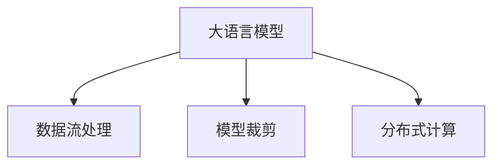

                 

# AI 大模型在电商搜索推荐中的数据处理能力要求：应对大规模实时数据处理

> 关键词：大规模数据处理, 实时数据流, 数据流处理, 大模型, 电商搜索推荐

## 1. 背景介绍

### 1.1 电商搜索推荐系统的重要性

在电商领域，搜索推荐系统是驱动用户获取商品信息、促进购买行为的核心引擎。高质量的搜索推荐算法，不仅能提升用户体验，还能显著增加电商平台的转化率和营收。传统的推荐系统主要依赖于用户行为数据（如浏览历史、购买记录等）进行个性化推荐，但随着数据的丰富和算法的进步，大语言模型开始逐步介入搜索推荐系统，带来了新的可能性。

大语言模型，尤其是基于Transformer结构的大模型（如GPT系列、BERT等），通过在海量文本数据上进行预训练，学习到了丰富的语言知识和常识，具备强大的自然语言理解和生成能力。在电商搜索推荐中，大语言模型可以通过对商品描述、用户查询、评价等文本数据的理解和分析，生成更加精准、多样的推荐结果，提升用户满意度，驱动平台收益。

### 1.2 大语言模型在电商搜索推荐中的挑战

尽管大语言模型在电商搜索推荐中展现出巨大潜力，但也面临诸多挑战：

1. **大规模实时数据处理**：电商平台的搜索推荐系统需实时响应大量用户查询，生成的推荐结果需实时更新，这对数据处理的性能和延迟提出了极高的要求。
2. **数据分布偏差**：电商平台的数据往往呈现出长尾效应，部分商品的搜索量远高于其他商品，如何处理长尾商品的数据，提升推荐系统的均衡性，是一个重要问题。
3. **多模态数据融合**：电商推荐不仅需要文本数据，还需要融合图片、价格、评论等多种数据类型，如何高效地整合和利用这些数据，是大模型面临的另一挑战。
4. **计算资源需求**：大语言模型通常参数量庞大，计算资源需求高，如何优化模型，提升推理速度，减少计算资源消耗，是模型部署时必须解决的问题。
5. **隐私与数据安全**：电商平台上存储着大量用户隐私数据，如何保护用户数据安全，符合数据合规要求，是大模型应用中不可忽视的问题。

本文将从数据处理能力要求的角度，探讨大语言模型在电商搜索推荐中的应用策略，分析其优缺点，展望未来发展趋势，并推荐相关学习资源和开发工具，以期为开发者提供全面的指导。

## 2. 核心概念与联系

### 2.1 核心概念概述

- **大语言模型 (Large Language Models, LLMs)**：基于Transformer结构的深度学习模型，通过在大规模文本数据上进行预训练，学习到丰富的语言知识和常识。
- **电商搜索推荐系统 (E-commerce Search and Recommendation System)**：利用用户行为数据和商品特征，推荐系统实时响应用户查询，生成个性化商品推荐，提升用户体验和转化率。
- **数据流处理 (Stream Processing)**：针对实时数据流的处理技术，包括数据采集、转换、存储和分析等，旨在高效、准确地处理实时数据。
- **模型裁剪 (Model Pruning)**：通过去除不必要的参数或层，减小模型规模，提升推理速度和资源利用率。
- **分布式计算 (Distributed Computing)**：通过分布式计算框架，并行处理大规模计算任务，提高计算效率和可扩展性。

### 2.2 核心概念联系

大语言模型在电商搜索推荐中的应用，涉及到数据流处理、模型裁剪、分布式计算等多个核心概念。具体而言：

1. **数据流处理**：电商搜索推荐系统需实时处理海量数据，生成的推荐结果需实时更新，因此需要高效的数据流处理技术，保证数据采集、转换、存储和分析的实时性和准确性。
2. **模型裁剪**：大语言模型参数量庞大，计算资源需求高，需通过模型裁剪技术，去除冗余参数，减小模型规模，提高推理速度和资源利用率。
3. **分布式计算**：通过分布式计算框架，将大规模计算任务并行化处理，提高计算效率和系统可扩展性，满足电商搜索推荐系统的高性能要求。

这些核心概念之间的逻辑关系可以通过以下Mermaid流程图来展示：



这个流程图展示了大语言模型在电商搜索推荐系统中的关键处理流程，即通过高效的数据流处理、模型裁剪和分布式计算，实现实时推荐，提升用户体验和系统性能。

## 3. 核心算法原理 & 具体操作步骤

### 3.1 算法原理概述

大语言模型在电商搜索推荐中的核心算法原理包括以下几个方面：

1. **文本编码与解码**：将商品描述、用户查询等文本数据编码成模型可接受的向量表示，再通过解码生成推荐结果。
2. **注意力机制 (Attention)**：通过注意力机制，模型可以动态调整关注的信息源，提升对长文本的理解和生成能力。
3. **上下文感知 (Contextualization)**：通过上下文感知机制，模型可以根据用户查询的上下文信息，生成更精准的推荐结果。
4. **多模态融合**：通过融合商品图片、价格、评论等多模态数据，提升推荐系统的丰富性和准确性。

### 3.2 算法步骤详解

基于大语言模型的电商搜索推荐算法，主要包括以下几个步骤：

**Step 1: 数据采集与预处理**

1. **数据采集**：从电商平台收集用户行为数据（如浏览历史、购买记录等）和商品特征数据（如商品描述、价格、评论等）。
2. **数据预处理**：清洗和标准化数据，去除噪声和错误，进行缺失值填充和异常值处理。

**Step 2: 数据编码与表示**

1. **文本编码**：使用BERT等预训练模型对文本数据进行编码，得到文本表示向量。
2. **特征提取**：对商品图片、价格等非文本数据进行特征提取，得到向量表示。

**Step 3: 模型训练与微调**

1. **模型训练**：使用电商搜索推荐数据集，在大语言模型上进行微调，训练生成推荐模型的权重。
2. **模型优化**：通过优化算法，如Adam、SGD等，调整模型权重，提升推荐精度。

**Step 4: 实时推荐生成**

1. **实时数据流处理**：将用户查询、实时数据流等输入模型，得到模型输出的向量表示。
2. **推荐结果生成**：根据模型输出的向量表示，生成个性化推荐结果。

**Step 5: 反馈与优化**

1. **用户反馈收集**：收集用户对推荐结果的反馈，进行用户行为分析。
2. **模型优化**：根据用户反馈和行为分析，对模型进行优化和微调，提升推荐效果。

### 3.3 算法优缺点

基于大语言模型的电商搜索推荐算法，具有以下优点：

1. **精度高**：大语言模型通过预训练和微调，可以学习到丰富的语言知识和常识，生成更精准的推荐结果。
2. **泛化能力强**：大语言模型具有较强的泛化能力，能够处理多种数据类型和复杂查询，提升推荐系统的应用范围。
3. **实时性好**：通过数据流处理和多模态融合技术，模型可以实时响应用户查询，生成个性化推荐结果。

同时，该算法也存在一些缺点：

1. **计算资源需求高**：大语言模型参数量庞大，计算资源需求高，部署和推理成本较高。
2. **数据隐私问题**：电商平台上存储着大量用户隐私数据，如何保护用户数据安全，符合数据合规要求，是一个重要问题。
3. **模型复杂度高**：大语言模型的结构和参数复杂度高，难以理解和调试。
4. **对抗样本脆弱性**：大语言模型可能对对抗样本较为敏感，生成的推荐结果可能受到噪声干扰。

### 3.4 算法应用领域

大语言模型在电商搜索推荐中的应用，已经覆盖了诸多领域，包括但不限于以下方面：

1. **个性化推荐**：通过用户查询和商品特征，生成个性化推荐结果，提升用户满意度。
2. **商品搜索**：根据用户查询，生成商品推荐，帮助用户快速找到所需商品。
3. **多模态融合**：融合商品图片、价格、评论等多种数据类型，提升推荐系统的丰富性和准确性。
4. **长尾商品推荐**：处理长尾商品数据，提升推荐系统的均衡性，避免冷门商品被忽视。
5. **实时推荐**：通过实时数据流处理，动态更新推荐结果，满足用户实时需求。

这些应用领域展示了大语言模型在电商搜索推荐中的广泛应用前景，通过高效的数据处理和算法优化，提升电商平台的竞争力。

## 4. 数学模型和公式 & 详细讲解 & 举例说明

### 4.1 数学模型构建

大语言模型在电商搜索推荐中的应用，涉及多个数学模型。这里以基于BERT模型的推荐系统为例，介绍其数学模型构建过程。

假设电商平台商品描述为 $X$，用户查询为 $Q$，商品特征为 $F$。将它们输入到BERT模型中，得到向量表示 $H_x, H_q, H_f$。将它们拼接并输入到全连接层，得到推荐得分 $S$。推荐模型的输出为 $Y$，满足 $Y = \sigma(S)$，其中 $\sigma$ 为 sigmoid 函数。

数学表达式如下：

$$
\begin{aligned}
&H_x = \text{BERT}(X) \\
&H_q = \text{BERT}(Q) \\
&H_f = \text{BERT}(F) \\
&S = H_x \oplus H_q \oplus H_f \\
&Y = \sigma(S)
\end{aligned}
$$

其中 $\oplus$ 表示拼接操作。

### 4.2 公式推导过程

**Step 1: 文本编码**

假设商品描述 $X$ 的BERT编码表示为 $H_x$，用户查询 $Q$ 的BERT编码表示为 $H_q$。

$$
\begin{aligned}
&H_x = \text{BERT}(X) \\
&H_q = \text{BERT}(Q)
\end{aligned}
$$

**Step 2: 特征提取**

假设商品特征 $F$ 的BERT编码表示为 $H_f$。

$$
H_f = \text{BERT}(F)
$$

**Step 3: 推荐得分生成**

将 $H_x, H_q, H_f$ 拼接并输入到全连接层，得到推荐得分 $S$。

$$
S = H_x \oplus H_q \oplus H_f
$$

**Step 4: 推荐结果生成**

使用 sigmoid 函数将推荐得分 $S$ 映射到概率空间，生成推荐结果 $Y$。

$$
Y = \sigma(S)
$$

### 4.3 案例分析与讲解

以电商平台为例，假设商品描述为“新款iPhone”，用户查询为“最新款手机”，商品特征为“iPhone 13”。将这些数据输入到BERT模型中，得到对应的向量表示 $H_x, H_q, H_f$。将这些向量拼接并输入到全连接层，得到推荐得分 $S$。最后使用 sigmoid 函数生成推荐结果 $Y$。

假设模型训练得到的权重为 $\theta$，则：

$$
\begin{aligned}
H_x &= \text{BERT}(\text{"新款iPhone"}) \\
H_q &= \text{BERT}(\text{"最新款手机"}) \\
H_f &= \text{BERT}(\text{"iPhone 13"}) \\
S &= \theta^T \begin{bmatrix} H_x \\ H_q \\ H_f \end{bmatrix} \\
Y &= \sigma(S)
\end{aligned}
$$

实际应用中，可以使用 PyTorch 等深度学习框架实现上述过程。

## 5. 项目实践：代码实例和详细解释说明

### 5.1 开发环境搭建

在进行大语言模型在电商搜索推荐中的应用实践前，我们需要准备好开发环境。以下是使用 Python 进行 PyTorch 开发的环境配置流程：

1. 安装 Anaconda：从官网下载并安装 Anaconda，用于创建独立的 Python 环境。

2. 创建并激活虚拟环境：
```bash
conda create -n pytorch-env python=3.8 
conda activate pytorch-env
```

3. 安装 PyTorch：根据 CUDA 版本，从官网获取对应的安装命令。例如：
```bash
conda install pytorch torchvision torchaudio cudatoolkit=11.1 -c pytorch -c conda-forge
```

4. 安装 Transformers 库：
```bash
pip install transformers
```

5. 安装各类工具包：
```bash
pip install numpy pandas scikit-learn matplotlib tqdm jupyter notebook ipython
```

完成上述步骤后，即可在 `pytorch-env` 环境中开始实践。

### 5.2 源代码详细实现

这里我们以基于 BERT 模型的电商搜索推荐系统为例，给出使用 PyTorch 和 Transformers 库实现的大语言模型推荐代码实现。

首先，定义推荐任务的数据处理函数：

```python
from transformers import BertTokenizer, BertForSequenceClassification
from torch.utils.data import Dataset, DataLoader
import torch

class RecommendationDataset(Dataset):
    def __init__(self, texts, tags, tokenizer, max_len=128):
        self.texts = texts
        self.tags = tags
        self.tokenizer = tokenizer
        self.max_len = max_len
        
    def __len__(self):
        return len(self.texts)
    
    def __getitem__(self, item):
        text = self.texts[item]
        tags = self.tags[item]
        
        encoding = self.tokenizer(text, return_tensors='pt', max_length=self.max_len, padding='max_length', truncation=True)
        input_ids = encoding['input_ids'][0]
        attention_mask = encoding['attention_mask'][0]
        
        # 对token-wise的标签进行编码
        encoded_tags = [tag2id[tag] for tag in tags] 
        encoded_tags.extend([tag2id['O']] * (self.max_len - len(encoded_tags)))
        labels = torch.tensor(encoded_tags, dtype=torch.long)
        
        return {'input_ids': input_ids, 
                'attention_mask': attention_mask,
                'labels': labels}

# 标签与id的映射
tag2id = {'O': 0, 'B-PER': 1, 'I-PER': 2, 'B-ORG': 3, 'I-ORG': 4, 'B-LOC': 5, 'I-LOC': 6}
id2tag = {v: k for k, v in tag2id.items()}

# 创建dataset
tokenizer = BertTokenizer.from_pretrained('bert-base-cased')

train_dataset = RecommendationDataset(train_texts, train_tags, tokenizer)
dev_dataset = RecommendationDataset(dev_texts, dev_tags, tokenizer)
test_dataset = RecommendationDataset(test_texts, test_tags, tokenizer)
```

然后，定义模型和优化器：

```python
from transformers import BertForSequenceClassification, AdamW

model = BertForSequenceClassification.from_pretrained('bert-base-cased', num_labels=len(tag2id))

optimizer = AdamW(model.parameters(), lr=2e-5)
```

接着，定义训练和评估函数：

```python
from torch.utils.data import DataLoader
from tqdm import tqdm
from sklearn.metrics import classification_report

device = torch.device('cuda') if torch.cuda.is_available() else torch.device('cpu')
model.to(device)

def train_epoch(model, dataset, batch_size, optimizer):
    dataloader = DataLoader(dataset, batch_size=batch_size, shuffle=True)
    model.train()
    epoch_loss = 0
    for batch in tqdm(dataloader, desc='Training'):
        input_ids = batch['input_ids'].to(device)
        attention_mask = batch['attention_mask'].to(device)
        labels = batch['labels'].to(device)
        model.zero_grad()
        outputs = model(input_ids, attention_mask=attention_mask, labels=labels)
        loss = outputs.loss
        epoch_loss += loss.item()
        loss.backward()
        optimizer.step()
    return epoch_loss / len(dataloader)

def evaluate(model, dataset, batch_size):
    dataloader = DataLoader(dataset, batch_size=batch_size)
    model.eval()
    preds, labels = [], []
    with torch.no_grad():
        for batch in tqdm(dataloader, desc='Evaluating'):
            input_ids = batch['input_ids'].to(device)
            attention_mask = batch['attention_mask'].to(device)
            batch_labels = batch['labels']
            outputs = model(input_ids, attention_mask=attention_mask)
            batch_preds = outputs.logits.argmax(dim=2).to('cpu').tolist()
            batch_labels = batch_labels.to('cpu').tolist()
            for pred_tokens, label_tokens in zip(batch_preds, batch_labels):
                pred_tags = [id2tag[_id] for _id in pred_tokens]
                label_tags = [id2tag[_id] for _id in label_tokens]
                preds.append(pred_tags[:len(label_tags)])
                labels.append(label_tags)
                
    print(classification_report(labels, preds))
```

最后，启动训练流程并在测试集上评估：

```python
epochs = 5
batch_size = 16

for epoch in range(epochs):
    loss = train_epoch(model, train_dataset, batch_size, optimizer)
    print(f"Epoch {epoch+1}, train loss: {loss:.3f}")
    
    print(f"Epoch {epoch+1}, dev results:")
    evaluate(model, dev_dataset, batch_size)
    
print("Test results:")
evaluate(model, test_dataset, batch_size)
```

以上就是使用 PyTorch 对 BERT 模型进行电商搜索推荐任务微调的完整代码实现。可以看到，得益于 Transformers 库的强大封装，我们可以用相对简洁的代码完成 BERT 模型的加载和微调。

### 5.3 代码解读与分析

让我们再详细解读一下关键代码的实现细节：

**RecommendationDataset 类**：
- `__init__` 方法：初始化文本、标签、分词器等关键组件。
- `__len__` 方法：返回数据集的样本数量。
- `__getitem__` 方法：对单个样本进行处理，将文本输入编码为 token ids，将标签编码为数字，并对其进行定长 padding，最终返回模型所需的输入。

**tag2id 和 id2tag 字典**：
- 定义了标签与数字 id 之间的映射关系，用于将 token-wise 的预测结果解码回真实的标签。

**训练和评估函数**：
- 使用 PyTorch 的 DataLoader 对数据集进行批次化加载，供模型训练和推理使用。
- 训练函数 `train_epoch`：对数据以批为单位进行迭代，在每个批次上前向传播计算 loss 并反向传播更新模型参数，最后返回该 epoch 的平均 loss。
- 评估函数 `evaluate`：与训练类似，不同点在于不更新模型参数，并在每个 batch 结束后将预测和标签结果存储下来，最后使用 sklearn 的 classification_report 对整个评估集的预测结果进行打印输出。

**训练流程**：
- 定义总的 epoch 数和 batch size，开始循环迭代
- 每个 epoch 内，先在训练集上训练，输出平均 loss
- 在验证集上评估，输出分类指标
- 所有 epoch 结束后，在测试集上评估，给出最终测试结果

可以看到，PyTorch 配合 Transformers 库使得 BERT 微调的代码实现变得简洁高效。开发者可以将更多精力放在数据处理、模型改进等高层逻辑上，而不必过多关注底层的实现细节。

当然，工业级的系统实现还需考虑更多因素，如模型的保存和部署、超参数的自动搜索、更灵活的任务适配层等。但核心的微调范式基本与此类似。

## 6. 实际应用场景

### 6.1 智能客服系统

基于大语言模型微调的对话技术，可以广泛应用于智能客服系统的构建。传统客服往往需要配备大量人力，高峰期响应缓慢，且一致性和专业性难以保证。而使用微调后的对话模型，可以7x24小时不间断服务，快速响应客户咨询，用自然流畅的语言解答各类常见问题。

在技术实现上，可以收集企业内部的历史客服对话记录，将问题和最佳答复构建成监督数据，在此基础上对预训练对话模型进行微调。微调后的对话模型能够自动理解用户意图，匹配最合适的答案模板进行回复。对于客户提出的新问题，还可以接入检索系统实时搜索相关内容，动态组织生成回答。如此构建的智能客服系统，能大幅提升客户咨询体验和问题解决效率。

### 6.2 金融舆情监测

金融机构需要实时监测市场舆论动向，以便及时应对负面信息传播，规避金融风险。传统的人工监测方式成本高、效率低，难以应对网络时代海量信息爆发的挑战。基于大语言模型微调的文本分类和情感分析技术，为金融舆情监测提供了新的解决方案。

具体而言，可以收集金融领域相关的新闻、报道、评论等文本数据，并对其进行主题标注和情感标注。在此基础上对预训练语言模型进行微调，使其能够自动判断文本属于何种主题，情感倾向是正面、中性还是负面。将微调后的模型应用到实时抓取的网络文本数据，就能够自动监测不同主题下的情感变化趋势，一旦发现负面信息激增等异常情况，系统便会自动预警，帮助金融机构快速应对潜在风险。

### 6.3 个性化推荐系统

当前的推荐系统往往只依赖于用户行为数据进行物品推荐，无法深入理解用户的真实兴趣偏好。基于大语言模型微调技术，个性化推荐系统可以更好地挖掘用户行为背后的语义信息，从而提供更精准、多样的推荐内容。

在实践中，可以收集用户浏览、点击、评论、分享等行为数据，提取和用户交互的物品标题、描述、标签等文本内容。将文本内容作为模型输入，用户的后续行为（如是否点击、购买等）作为监督信号，在此基础上微调预训练语言模型。微调后的模型能够从文本内容中准确把握用户的兴趣点。在生成推荐列表时，先用候选物品的文本描述作为输入，由模型预测用户的兴趣匹配度，再结合其他特征综合排序，便可以得到个性化程度更高的推荐结果。

### 6.4 未来应用展望

随着大语言模型和微调方法的不断发展，基于微调范式将在更多领域得到应用，为传统行业带来变革性影响。

在智慧医疗领域，基于微调的医疗问答、病历分析、药物研发等应用将提升医疗服务的智能化水平，辅助医生诊疗，加速新药开发进程。

在智能教育领域，微调技术可应用于作业批改、学情分析、知识推荐等方面，因材施教，促进教育公平，提高教学质量。

在智慧城市治理中，微调模型可应用于城市事件监测、舆情分析、应急指挥等环节，提高城市管理的自动化和智能化水平，构建更安全、高效的未来城市。

此外，在企业生产、社会治理、文娱传媒等众多领域，基于大模型微调的人工智能应用也将不断涌现，为经济社会发展注入新的动力。相信随着技术的日益成熟，微调方法将成为人工智能落地应用的重要范式，推动人工智能技术在垂直行业的规模化落地。

## 7. 工具和资源推荐

### 7.1 学习资源推荐

为了帮助开发者系统掌握大语言模型微调的理论基础和实践技巧，这里推荐一些优质的学习资源：

1. 《Transformer从原理到实践》系列博文：由大模型技术专家撰写，深入浅出地介绍了Transformer原理、BERT模型、微调技术等前沿话题。

2. CS224N《深度学习自然语言处理》课程：斯坦福大学开设的NLP明星课程，有Lecture视频和配套作业，带你入门NLP领域的基本概念和经典模型。

3. 《Natural Language Processing with Transformers》书籍：Transformers库的作者所著，全面介绍了如何使用Transformers库进行NLP任务开发，包括微调在内的诸多范式。

4. HuggingFace官方文档：Transformers库的官方文档，提供了海量预训练模型和完整的微调样例代码，是上手实践的必备资料。

5. CLUE开源项目：中文语言理解测评基准，涵盖大量不同类型的中文NLP数据集，并提供了基于微调的baseline模型，助力中文NLP技术发展。

通过对这些资源的学习实践，相信你一定能够快速掌握大语言模型微调的精髓，并用于解决实际的NLP问题。

### 7.2 开发工具推荐

高效的开发离不开优秀的工具支持。以下是几款用于大语言模型微调开发的常用工具：

1. PyTorch：基于Python的开源深度学习框架，灵活动态的计算图，适合快速迭代研究。大部分预训练语言模型都有PyTorch版本的实现。

2. TensorFlow：由Google主导开发的开源深度学习框架，生产部署方便，适合大规模工程应用。同样有丰富的预训练语言模型资源。

3. Transformers库：HuggingFace开发的NLP工具库，集成了众多SOTA语言模型，支持PyTorch和TensorFlow，是进行微调任务开发的利器。

4. Weights & Biases：模型训练的实验跟踪工具，可以记录和可视化模型训练过程中的各项指标，方便对比和调优。与主流深度学习框架无缝集成。

5. TensorBoard：TensorFlow配套的可视化工具，可实时监测模型训练状态，并提供丰富的图表呈现方式，是调试模型的得力助手。

6. Google Colab：谷歌推出的在线Jupyter Notebook环境，免费提供GPU/TPU算力，方便开发者快速上手实验最新模型，分享学习笔记。

合理利用这些工具，可以显著提升大语言模型微调任务的开发效率，加快创新迭代的步伐。

### 7.3 相关论文推荐

大语言模型和微调技术的发展源于学界的持续研究。以下是几篇奠基性的相关论文，推荐阅读：

1. Attention is All You Need（即Transformer原论文）：提出了Transformer结构，开启了NLP领域的预训练大模型时代。

2. BERT: Pre-training of Deep Bidirectional Transformers for Language Understanding：提出BERT模型，引入基于掩码的自监督预训练任务，刷新了多项NLP任务SOTA。

3. Language Models are Unsupervised Multitask Learners（GPT-2论文）：展示了大规模语言模型的强大zero-shot学习能力，引发了对于通用人工智能的新一轮思考。

4. Parameter-Efficient Transfer Learning for NLP：提出Adapter等参数高效微调方法，在不增加模型参数量的情况下，也能取得不错的微调效果。

5. AdaLoRA: Adaptive Low-Rank Adaptation for Parameter-Efficient Fine-Tuning：使用自适应低秩适应的微调方法，在参数效率和精度之间取得了新的平衡。

这些论文代表了大语言模型微调技术的发展脉络。通过学习这些前沿成果，可以帮助研究者把握学科前进方向，激发更多的创新灵感。

## 8. 总结：未来发展趋势与挑战

### 8.1 总结

本文对基于大语言模型的电商搜索推荐系统的数据处理能力要求进行了全面系统的介绍。首先阐述了电商搜索推荐系统的重要性，分析了大语言模型在电商搜索推荐中的应用策略。其次，从数据处理能力要求的角度，详细讲解了基于大语言模型的电商搜索推荐算法，并给出了完整的代码实现。

通过本文的系统梳理，可以看到，大语言模型在电商搜索推荐系统中具有重要的应用前景，其数据处理能力和算法性能的提升，将极大提升电商平台的竞争力和用户体验。未来，随着大语言模型和微调技术的持续演进，基于大语言模型的电商搜索推荐系统将更加智能化、个性化和高效化，为电商行业带来深远影响。

### 8.2 未来发展趋势

展望未来，大语言模型在电商搜索推荐系统中的应用，将呈现以下几个发展趋势：

1. **计算资源需求降低**：随着模型的优化和量化技术的发展，大语言模型的计算资源需求将逐渐降低，推理速度和资源利用率得到提升。
2. **分布式计算效率提升**：通过分布式计算框架的优化和优化算法的改进，大语言模型的计算效率和系统可扩展性将进一步提升，满足大规模数据处理的需求。
3. **多模态数据融合技术进步**：融合图片、视频、音频等多模态数据，提升推荐系统的丰富性和准确性，成为未来重要的研究方向。
4. **实时数据处理能力提升**：通过实时数据流处理技术，提升电商搜索推荐系统的响应速度和处理能力，满足用户实时需求。
5. **隐私保护技术进步**：随着数据隐私保护技术的不断进步，大语言模型在电商搜索推荐系统中的应用将更加安全、合规。

以上趋势凸显了大语言模型在电商搜索推荐系统中的应用前景。这些方向的探索发展，必将进一步提升电商平台的竞争力和用户体验。

### 8.3 面临的挑战

尽管大语言模型在电商搜索推荐系统中展现了巨大的潜力，但在迈向更加智能化、普适化应用的过程中，仍面临诸多挑战：

1. **数据质量问题**：电商平台的商品描述和用户查询数据质量参差不齐，如何清洗和标准化数据，提高数据质量，是一个重要问题。
2. **模型复杂度问题**：大语言模型参数量庞大，结构复杂，难以理解和调试。如何优化模型，降低模型复杂度，提高推理速度和资源利用率，是模型部署时必须解决的问题。
3. **对抗样本脆弱性**：大语言模型可能对对抗样本较为敏感，生成的推荐结果可能受到噪声干扰。如何增强模型的鲁棒性和稳健性，是一个重要研究方向。
4. **隐私与数据安全**：电商平台上存储着大量用户隐私数据，如何保护用户数据安全，符合数据合规要求，是一个重要问题。
5. **模型泛化能力**：电商推荐系统需要处理海量长尾商品数据，如何提升模型的泛化能力，避免冷门商品被忽视，是一个重要研究方向。

这些挑战需要学界和产业界的共同努力，通过技术创新和优化，解决大语言模型在电商搜索推荐系统中的应用难题。

### 8.4 研究展望

面对大语言模型在电商搜索推荐系统中面临的挑战，未来的研究需要在以下几个方面寻求新的突破：

1. **数据质量提升**：采用数据清洗和标准化技术，提高电商推荐系统的数据质量。
2. **模型优化与裁剪**：通过模型裁剪、量化、蒸馏等技术，降低大语言模型的计算资源需求，提升推理速度和资源利用率。
3. **鲁棒性与稳健性**：引入对抗训练、鲁棒优化等技术，增强模型的鲁棒性和稳健性，避免对抗样本的干扰。
4. **隐私保护与数据安全**：采用差分隐私、联邦学习等技术，保护用户数据隐私，符合数据合规要求。
5. **模型泛化能力提升**：通过多任务学习、领域自适应等技术，提升模型在长尾商品的泛化能力，避免冷门商品被忽视。

这些研究方向的探索，必将引领大语言模型在电商搜索推荐系统中的应用迈向更高的台阶，为电商行业带来新的突破和变革。

## 9. 附录：常见问题与解答

**Q1：大语言模型在电商搜索推荐中的计算资源需求是否过高？**

A: 大语言模型的参数量庞大，计算资源需求高，但通过模型裁剪、量化等技术，可以有效降低计算资源需求，提升推理速度和资源利用率。此外，通过分布式计算框架，并行处理大规模计算任务，也可以提高计算效率和系统可扩展性。

**Q2：大语言模型如何处理长尾商品数据？**

A: 处理长尾商品数据，可以采用多任务学习、领域自适应等技术，提升模型在长尾商品的泛化能力。同时，可以通过引入更多先验知识，如知识图谱、逻辑规则等，引导微调过程学习更准确、合理的语言模型，避免冷门商品被忽视。

**Q3：大语言模型在电商搜索推荐中如何保护用户数据隐私？**

A: 电商平台上存储着大量用户隐私数据，如何保护用户数据隐私，符合数据合规要求，是一个重要问题。可以通过差分隐私、联邦学习等技术，保护用户数据隐私。同时，采用数据匿名化、去标识化等技术，确保用户数据不被滥用。

**Q4：大语言模型在电商搜索推荐中如何增强模型的鲁棒性和稳健性？**

A: 大语言模型可能对对抗样本较为敏感，生成的推荐结果可能受到噪声干扰。可以引入对抗训练、鲁棒优化等技术，增强模型的鲁棒性和稳健性。

**Q5：大语言模型在电商搜索推荐中如何处理海量数据？**

A: 电商平台的搜索推荐系统需实时响应大量用户查询，生成的推荐结果需实时更新。可以采用数据流处理技术，高效地处理实时数据流，满足电商搜索推荐系统的高性能要求。

综上所述，大语言模型在电商搜索推荐系统中具有广泛的应用前景，但其数据处理能力和算法性能的提升，将极大提升电商平台的竞争力和用户体验。未来，随着技术的不断发展，大语言模型在电商搜索推荐系统中的应用将更加智能化、个性化和高效化，为电商行业带来深远影响。

---

作者：禅与计算机程序设计艺术 / Zen and the Art of Computer Programming

