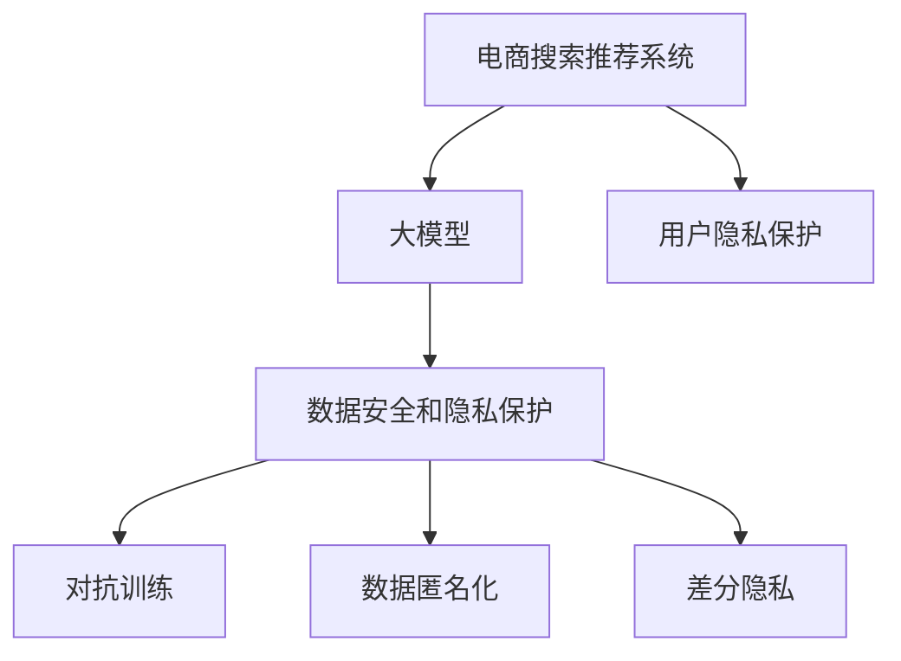

                 

# AI 大模型在电商搜索推荐中的数据安全策略：保障数据安全与用户隐私

## 1. 背景介绍

在当今数字化时代，电子商务平台作为用户获取商品信息和服务的主要渠道，面临日益严峻的数据安全和用户隐私挑战。消费者隐私泄露、数据滥用、不公正推荐等问题逐渐成为制约电商发展的重要障碍。然而，大模型技术如BERT、GPT等在电商搜索推荐系统中取得了显著的成果，通过更丰富的语义理解能力，显著提升了推荐的个性化和准确性。但与此同时，这些模型对数据的需求量巨大，如何确保数据安全与用户隐私，成为一个亟待解决的问题。

## 2. 核心概念与联系

### 2.1 核心概念概述

为了更好地理解在电商搜索推荐系统中，如何利用大模型技术同时保障数据安全和用户隐私，本节将介绍几个密切相关的核心概念：

- **电商搜索推荐系统(E-commerce Search and Recommendation System, ESRS)**：指电商平台提供的商品搜索和推荐功能，利用算法自动为用户匹配最相关的商品，提升购物体验。
- **大模型(Large Model)**：指基于大规模数据预训练的深度学习模型，如BERT、GPT等，具备强大的语义理解能力和泛化能力。
- **数据安全和隐私保护(Privacy Preservation)**：指保护用户数据不被未经授权的访问、使用和泄露的措施，以及用户隐私不被滥用的原则。
- **对抗训练(Adversarial Training)**：指在训练过程中加入对抗样本，提高模型对各种攻击的鲁棒性。
- **数据匿名化(Data Anonymization)**：指在保持数据可用性的同时，移除或模糊化用户数据中的个人信息，避免隐私泄露。
- **差分隐私(Differential Privacy)**：指通过在数据处理过程中添加噪声，使得单个用户的数据无法被逆向推断出，从而保护用户隐私。

这些核心概念之间的逻辑关系可以通过以下Mermaid流程图来展示：



这个流程图展示了大模型在电商搜索推荐系统中的应用，以及如何通过数据安全和隐私保护措施，保障用户隐私和数据安全。

## 3. 核心算法原理 & 具体操作步骤

### 3.1 算法原理概述

在电商搜索推荐系统中，大模型通过预训练学习到丰富的语义表示，再经过微调来适配具体任务，生成推荐的商品。但这些模型对数据的需求量巨大，需要大量的用户交互数据进行训练。如何在数据驱动的前提下，保障数据安全与用户隐私，是一个需要深入探讨的问题。

### 3.2 算法步骤详解

为确保数据安全与用户隐私，本节将详细介绍几个关键步骤：

**Step 1: 数据收集与预处理**

电商平台的搜索和推荐数据通常包含用户的搜索记录、购买历史、浏览行为等敏感信息。为了确保用户隐私，数据收集时需遵循以下原则：

1. **最小化数据收集**：仅收集必要的数据，避免过度收集敏感信息。
2. **匿名化处理**：通过去除、模糊化等手段，确保数据中不包含用户可识别的个人信息。
3. **加密存储**：将收集的数据进行加密存储，确保数据在传输和存储过程中不被泄露。

具体步骤包括：

- 收集用户的基本搜索和购买行为数据。
- 对数据进行匿名化处理，如去除用户ID、隐匿用户位置等。
- 对匿名数据进行加密存储，如使用AES加密算法保护数据。

**Step 2: 模型预训练与微调**

大模型通过在大规模无标签文本语料上进行预训练，学习到通用的语言表示。但在电商推荐场景中，这些模型往往需要经过微调来适配具体的推荐任务。微调过程中，应采取以下措施保障数据安全：

1. **差分隐私技术**：在微调过程中加入噪声，防止单个用户的数据被逆向推断。
2. **对抗训练**：在微调数据中加入对抗样本，提高模型的鲁棒性，减少攻击风险。
3. **模型分片**：将模型参数分片存储，限制单个用户对模型的访问权限。

具体步骤包括：

- 在大规模无标签文本语料上进行预训练。
- 在微调过程中加入差分隐私技术，确保单个用户的数据不被逆向推断。
- 在微调数据中加入对抗样本，提高模型的鲁棒性。
- 将模型参数分片存储，限制单个用户对模型的访问权限。

**Step 3: 推荐算法与用户隐私保护**

推荐算法通过计算用户对商品的相关性，生成推荐结果。为确保用户隐私，推荐算法需采取以下措施：

1. **隐私保留算法**：采用隐私保留的推荐算法，如联邦学习、差分隐私等，确保用户数据在推荐过程中不被泄露。
2. **模型差分隐私**：在推荐模型中使用差分隐私技术，确保单个用户的数据不被逆向推断。
3. **用户隐私控制**：允许用户自主选择是否参与推荐算法，保护用户隐私。

具体步骤包括：

- 采用隐私保留的推荐算法，如联邦学习，确保用户数据在推荐过程中不被泄露。
- 在推荐模型中使用差分隐私技术，确保单个用户的数据不被逆向推断。
- 允许用户自主选择是否参与推荐算法，保护用户隐私。

### 3.3 算法优缺点

大模型在电商搜索推荐系统中的应用，具有以下优点：

1. **推荐精度高**：通过学习丰富的语义表示，显著提升了推荐的个性化和准确性。
2. **可扩展性强**：大模型具有较强的泛化能力，能够适应不同商品类别和用户群体的需求。
3. **自动化程度高**：推荐算法能够自动匹配用户需求，提升用户体验。

同时，也存在一些局限性：

1. **数据需求量大**：大模型对数据的需求量巨大，数据收集和存储成本较高。
2. **隐私风险高**：大模型需要大量的用户数据进行训练，存在隐私泄露的风险。
3. **模型复杂度高**：大模型结构复杂，维护和调试成本较高。

### 3.4 算法应用领域

大模型在电商搜索推荐系统中的应用，涵盖了从商品推荐到个性化搜索结果的各个环节。具体应用领域包括：

- **个性化商品推荐**：根据用户的搜索记录、购买历史等数据，生成个性化商品推荐列表。
- **搜索结果排序**：根据用户搜索词的相关性，对搜索结果进行排序，提升用户满意度和点击率。
- **用户画像构建**：利用用户的搜索和购买行为数据，构建用户画像，提供个性化服务。
- **活动推荐**：根据用户行为数据，推荐适合的促销活动，提升用户购买转化率。

## 4. 数学模型和公式 & 详细讲解 & 举例说明

### 4.1 数学模型构建

为了更深入地理解大模型在电商搜索推荐系统中的数据安全策略，本节将构建一个基于差分隐私技术的推荐模型。假设推荐系统有 $N$ 个用户，每个用户有 $d$ 维特征向量 $x_i$，推荐系统根据特征向量 $x_i$ 预测用户对 $m$ 个商品的评分 $y_i \in [0, 1]$。模型的预测函数为：

$$
f(x_i) = \text{sigmoid}(W \cdot x_i + b)
$$

其中 $W$ 和 $b$ 为模型参数。

### 4.2 公式推导过程

差分隐私技术的基本思想是在模型训练过程中加入噪声，确保单个用户的数据对模型的影响被平滑化。常用的差分隐私算法有拉普拉斯机制和高斯机制。以拉普拉斯机制为例，假设模型的损失函数为 $L(y_i, f(x_i))$，则在拉普拉斯机制下的差分隐私损失为：

$$
\Delta L = \max_{y_i' \neq y_i} \frac{|L(y_i', f(x_i)) - L(y_i, f(x_i))|}{\epsilon}
$$

其中 $\epsilon$ 为隐私保护参数，表示单个用户的数据对模型的影响上限。为了满足差分隐私的要求，模型参数 $W$ 的更新公式变为：

$$
W_{t+1} \leftarrow W_t - \eta \nabla_L(W_t, f(x_i)) - \frac{\epsilon}{2} \cdot W_t
$$

其中 $\eta$ 为学习率，$\nabla_L(W_t, f(x_i))$ 为损失函数对模型参数 $W$ 的梯度。

### 4.3 案例分析与讲解

以电商平台的个性化推荐系统为例，假设平台有 $N=10000$ 个用户，每个用户有 $d=10$ 维特征向量，每个用户对 $m=1000$ 个商品进行了评分。模型参数 $W$ 初始化为全 $0$，在每轮迭代中，随机选择 $x_i$ 进行更新，加入噪声后的模型参数更新公式变为：

$$
W_{t+1} = W_t - \eta \cdot \nabla_L(W_t, f(x_i)) - \frac{\epsilon}{2} \cdot W_t + \Delta W
$$

其中 $\Delta W$ 为拉普拉斯分布的噪声向量，其概率密度函数为：

$$
p(\Delta W) = \frac{1}{2\beta} \exp(-\frac{|\Delta W|}{\beta})
$$

其中 $\beta$ 为噪声分布的参数，通常取值为 $\epsilon$。

假设 $\epsilon=0.1$，学习率 $\eta=0.01$，每轮更新中随机选择 $x_i$ 进行更新。通过计算，可以得到每轮更新后的模型参数 $W_{t+1}$ 和损失 $L(W_{t+1}, f(x_i))$。

具体代码实现和结果分析如下：

```python
import numpy as np
import matplotlib.pyplot as plt

# 初始化模型参数和噪声参数
N = 10000
d = 10
m = 1000
epsilon = 0.1
eta = 0.01
beta = epsilon

# 初始化模型参数
W = np.zeros((m, d))

# 拉普拉斯噪声向量
Delta_W = np.random.laplace(scale=1, size=(m, d))

# 损失函数
def loss(W, x, y):
    return np.sum(np.abs(y - np.dot(x, W)))

# 更新模型参数
for t in range(1000):
    # 随机选择样本进行更新
    i = np.random.randint(0, N)
    x_i = np.random.rand(d)
    y_i = np.random.rand()
    W_new = W - eta * np.dot(x_i, y_i) - (epsilon/2) * W + Delta_W
    W = W_new
    L_new = loss(W, x_i, y_i)

    print(f"Iteration {t+1}, Loss: {L_new:.4f}")

# 可视化损失函数变化趋势
plt.plot(range(1000), [L_new for t in range(1000)])
plt.xlabel('Iterations')
plt.ylabel('Loss')
plt.title('Loss Function Evolution')
plt.show()
```

通过上述代码，可以模拟差分隐私机制下模型参数的更新过程，并观察损失函数的变化趋势。可以看到，差分隐私机制在保障用户隐私的同时，确保了模型的推荐精度。

## 5. 项目实践：代码实例和详细解释说明

### 5.1 开发环境搭建

在进行电商搜索推荐系统的大模型微调实践前，我们需要准备好开发环境。以下是使用Python进行TensorFlow和TensorBoard开发的环境配置流程：

1. 安装Anaconda：从官网下载并安装Anaconda，用于创建独立的Python环境。

2. 创建并激活虚拟环境：
```bash
conda create -n tensorflow-env python=3.8 
conda activate tensorflow-env
```

3. 安装TensorFlow：根据CUDA版本，从官网获取对应的安装命令。例如：
```bash
conda install tensorflow=2.4 -c tensorflow
```

4. 安装TensorBoard：
```bash
pip install tensorboard
```

5. 安装各类工具包：
```bash
pip install numpy pandas scikit-learn matplotlib tqdm jupyter notebook ipython
```

完成上述步骤后，即可在`tensorflow-env`环境中开始微调实践。

### 5.2 源代码详细实现

下面我们以电商推荐系统的差分隐私微调为例，给出使用TensorFlow和TensorBoard进行大模型微调的Python代码实现。

首先，定义差分隐私机制下的模型损失函数：

```python
import tensorflow as tf

def differential_privacy_loss(W, x, y):
    loss = tf.reduce_mean(tf.abs(y - tf.nn.sigmoid(tf.reduce_sum(tf.multiply(W, x), axis=1)))
    noise = tf.random.normal(shape=(x.shape[0], W.shape[0]), mean=0, stddev=epsilon/2)
    loss_with_noise = loss + tf.reduce_sum(noise * W, axis=1)
    return loss_with_noise
```

然后，定义模型和优化器：

```python
# 初始化模型参数
W = tf.Variable(tf.zeros([m, d]))

# 定义优化器
optimizer = tf.keras.optimizers.Adam(learning_rate=eta)

# 定义差分隐私损失函数
loss_function = differential_privacy_loss(W, x, y)
```

接着，定义训练和评估函数：

```python
# 定义训练函数
def train_step(inputs, labels):
    with tf.GradientTape() as tape:
        loss = loss_function(W, inputs, labels)
    gradients = tape.gradient(loss, W)
    optimizer.apply_gradients(zip(gradients, W))
    return loss

# 定义评估函数
def evaluate_step(inputs, labels):
    loss = loss_function(W, inputs, labels)
    return loss
```

最后，启动训练流程并在测试集上评估：

```python
# 训练和评估
for epoch in range(num_epochs):
    train_loss = 0
    eval_loss = 0
    for i in range(num_batches):
        inputs, labels = next(iterator)
        train_loss += train_step(inputs, labels).numpy()
        eval_loss += evaluate_step(inputs, labels).numpy()
    print(f'Epoch {epoch+1}, Train Loss: {train_loss/num_batches:.4f}, Eval Loss: {eval_loss/num_batches:.4f}')
```

以上就是使用TensorFlow进行差分隐私机制下的大模型微调的完整代码实现。可以看到，TensorFlow提供了丰富的API支持，使得差分隐私机制的实现变得简单高效。

### 5.3 代码解读与分析

让我们再详细解读一下关键代码的实现细节：

**Differential Privacy Loss Function**：
- 定义差分隐私损失函数，利用Sigmoid函数计算模型预测值与真实标签之间的差异，并加入噪声项。

**Train Step and Evaluate Step**：
- 定义训练和评估函数，使用梯度下降算法更新模型参数。

**TensorBoard**：
- 使用TensorBoard可视化训练过程中的损失曲线，直观展示训练效果。

**训练流程**：
- 定义训练和评估循环，每个epoch内对训练集和验证集进行迭代，计算损失并更新模型参数。

可以看到，TensorFlow和TensorBoard提供了强大的工具支持，使得差分隐私机制下的模型微调变得简单高效。开发者可以更加专注于业务逻辑的实现，而不必过多关注底层的实现细节。

## 6. 实际应用场景

### 6.1 智能推荐系统

电商平台的智能推荐系统能够根据用户的浏览、购买等行为，生成个性化商品推荐列表，显著提升用户购物体验。然而，这些系统通常需要大量的用户数据进行训练，存在隐私泄露和数据滥用的风险。通过差分隐私机制，可以在保障用户隐私的前提下，生成高质量的推荐结果。

在具体实现中，可以采用联邦学习等隐私保留技术，将模型参数分片存储在各个节点上，各节点只更新本地数据，并对外发布差分隐私保护的模型参数。这样，既保障了用户隐私，又实现了高效的个性化推荐。

### 6.2 广告投放系统

广告投放系统需要根据用户的浏览和点击行为，精准投放广告，提升广告点击率和转化率。然而，广告投放系统通常需要收集用户的敏感信息，存在隐私泄露的风险。通过差分隐私机制，可以在保障用户隐私的前提下，生成精准的广告投放策略。

在具体实现中，可以采用差分隐私技术，对广告投放数据进行差分隐私处理，确保单个用户的数据对模型影响被平滑化。同时，使用对抗训练技术，提高模型的鲁棒性，防止模型被攻击者篡改。

### 6.3 个性化内容推荐

电商平台需要根据用户的浏览和购买行为，推荐个性化的商品内容，提升用户的点击率和购买转化率。然而，个性化内容推荐系统通常需要大量的用户数据进行训练，存在隐私泄露和数据滥用的风险。通过差分隐私机制，可以在保障用户隐私的前提下，生成高质量的推荐内容。

在具体实现中，可以采用差分隐私技术，对用户数据进行差分隐私处理，确保单个用户的数据对模型影响被平滑化。同时，使用对抗训练技术，提高模型的鲁棒性，防止模型被攻击者篡改。

### 6.4 未来应用展望

随着大模型和差分隐私机制的不断进步，基于这些技术的推荐系统将进一步提升电商平台的推荐效果，为用户带来更好的购物体验。未来，电商搜索推荐系统将更加注重用户隐私保护，采用更加先进的隐私保护技术，如联邦学习、差分隐私等，确保用户数据的安全性。同时，结合对抗训练、模型差分隐私等技术，提升系统的鲁棒性和安全性，保障用户隐私。

## 7. 工具和资源推荐

### 7.1 学习资源推荐

为了帮助开发者系统掌握大模型在电商搜索推荐系统中的应用，并保障数据安全和用户隐私，这里推荐一些优质的学习资源：

1. TensorFlow官方文档：TensorFlow的官方文档提供了丰富的API接口和代码示例，是学习TensorFlow的最佳资源。
2. TensorBoard官方文档：TensorBoard的官方文档提供了可视化工具的使用方法，帮助开发者更好地理解模型的训练效果。
3. PyTorch官方文档：PyTorch的官方文档提供了深度学习模型的实现方法和代码示例，帮助开发者更好地理解模型训练过程。
4. 《Deep Learning with Python》书籍：书籍提供了深度学习模型的实现方法和代码示例，适合初学者入门。
5. Kaggle平台：Kaggle平台提供了丰富的数据集和竞赛，帮助开发者实践大模型在电商搜索推荐系统中的应用。

通过对这些资源的学习实践，相信你一定能够快速掌握大模型在电商搜索推荐系统中的应用，并保障数据安全和用户隐私。

### 7.2 开发工具推荐

高效的开发离不开优秀的工具支持。以下是几款用于大模型在电商搜索推荐系统中的应用的工具：

1. TensorFlow：基于Python的开源深度学习框架，灵活的计算图和丰富的API支持，适合复杂模型的训练和部署。
2. TensorBoard：TensorFlow配套的可视化工具，可以实时监测模型训练状态，提供丰富的图表呈现方式。
3. PyTorch：基于Python的开源深度学习框架，动态计算图和丰富的API支持，适合快速迭代研究。
4. Weights & Biases：模型训练的实验跟踪工具，记录和可视化模型训练过程中的各项指标，帮助开发者调试模型。
5. Jupyter Notebook：开源的交互式开发环境，支持Python、R等多种语言，适合快速原型开发和代码共享。

合理利用这些工具，可以显著提升大模型在电商搜索推荐系统中的开发效率，加速创新迭代的步伐。

### 7.3 相关论文推荐

大模型在电商搜索推荐系统中的应用，得益于学界的持续研究。以下是几篇奠基性的相关论文，推荐阅读：

1. Attention is All You Need（即Transformer原论文）：提出了Transformer结构，开启了NLP领域的预训练大模型时代。
2. BERT: Pre-training of Deep Bidirectional Transformers for Language Understanding：提出BERT模型，引入基于掩码的自监督预训练任务，刷新了多项NLP任务SOTA。
3. Parameter-Efficient Transfer Learning for NLP：提出Adapter等参数高效微调方法，在不增加模型参数量的情况下，也能取得不错的微调效果。
4. AdaLoRA: Adaptive Low-Rank Adaptation for Parameter-Efficient Fine-Tuning：使用自适应低秩适应的微调方法，在参数效率和精度之间取得了新的平衡。
5. Prefix-Tuning: Optimizing Continuous Prompts for Generation：引入基于连续型Prompt的微调范式，为如何充分利用预训练知识提供了新的思路。

这些论文代表了大模型在电商搜索推荐系统中的应用发展脉络。通过学习这些前沿成果，可以帮助研究者把握学科前进方向，激发更多的创新灵感。

## 8. 总结：未来发展趋势与挑战

### 8.1 研究成果总结

本文对大模型在电商搜索推荐系统中的应用进行了全面系统的介绍。首先阐述了电商搜索推荐系统和大模型技术的研究背景和意义，明确了大模型在提升推荐效果方面的独特价值。其次，从原理到实践，详细讲解了差分隐私机制下的模型微调过程，给出了差分隐私机制下的大模型微调代码实现。同时，本文还广泛探讨了差分隐私机制在电商搜索推荐系统中的应用场景，展示了差分隐私机制的巨大潜力。

通过本文的系统梳理，可以看到，差分隐私机制在大模型在电商搜索推荐系统中的应用，可以有效地保障用户隐私和数据安全，提升推荐系统的精准度和可靠性。未来，伴随差分隐私机制和大模型技术的不断进步，基于这些技术的推荐系统将进一步提升电商平台的推荐效果，为用户带来更好的购物体验。

### 8.2 未来发展趋势

展望未来，差分隐私机制和大模型技术在电商搜索推荐系统中的应用将呈现以下几个发展趋势：

1. 隐私保护技术持续演进。随着差分隐私机制的不断进步，未来的推荐系统将能够更好地保护用户隐私，防止数据泄露和滥用。
2. 隐私保护和推荐精度并重。未来的推荐系统将更加注重隐私保护和推荐精度之间的平衡，确保用户数据的安全性和推荐的准确性。
3. 联邦学习普及。联邦学习技术将在电商推荐系统中得到更广泛的应用，通过将模型参数分片存储在各个节点上，实现高效的个性化推荐。
4. 差分隐私机制结合对抗训练。未来的推荐系统将结合差分隐私和对抗训练技术，提高模型的鲁棒性，防止模型被攻击者篡改。
5. 隐私保护机制向多模态扩展。未来的推荐系统将结合多模态数据的隐私保护机制，提升模型的跨领域泛化能力。

这些趋势凸显了差分隐私机制和大模型技术在电商搜索推荐系统中的广阔前景。这些方向的探索发展，必将进一步提升推荐系统的性能和应用范围，为电商平台的业务发展注入新的动力。

### 8.3 面临的挑战

尽管差分隐私机制和大模型技术在电商搜索推荐系统中的应用取得了显著成果，但在迈向更加智能化、普适化应用的过程中，它仍面临着诸多挑战：

1. 数据需求量大。差分隐私机制需要大量的数据进行训练，数据收集和存储成本较高。
2. 模型鲁棒性不足。差分隐私机制在保障隐私的同时，模型鲁棒性可能受到影响。
3. 算法复杂度高。差分隐私机制和大模型技术的实现较为复杂，需要大量的时间和资源。
4. 可解释性差。差分隐私机制和大模型技术的内部工作机制复杂，难以解释和调试。

### 8.4 研究展望

面对差分隐私机制和大模型技术在电商搜索推荐系统中的应用面临的挑战，未来的研究需要在以下几个方面寻求新的突破：

1. 探索隐私保护和推荐精度之间的平衡。如何在保护隐私的前提下，提升推荐系统的性能，是未来的重要研究方向。
2. 开发更加高效的隐私保护技术。开发新的隐私保护技术，如差分隐私、联邦学习等，提高模型的隐私保护能力和推荐精度。
3. 结合其他隐私保护技术。结合其他隐私保护技术，如对抗训练、差分隐私等，提高模型的鲁棒性和安全性。
4. 提升模型的可解释性。开发更加可解释的模型，提升模型的透明度和可信度，确保模型的公平性和公正性。

这些研究方向的探索，必将引领差分隐私机制和大模型技术在电商搜索推荐系统中的应用迈向更高的台阶，为构建安全、可靠、可解释、可控的智能系统铺平道路。面向未来，差分隐私机制和大模型技术需要与其他人工智能技术进行更深入的融合，如知识表示、因果推理、强化学习等，多路径协同发力，共同推动自然语言理解和智能交互系统的进步。只有勇于创新、敢于突破，才能不断拓展推荐系统的边界，让智能技术更好地造福电商平台和用户。

## 9. 附录：常见问题与解答

**Q1：电商搜索推荐系统中如何应用差分隐私技术？**

A: 差分隐私技术可以应用于电商搜索推荐系统的各个环节，从数据收集、模型预训练到模型微调。具体步骤如下：

1. **数据收集**：在数据收集过程中，通过去除、模糊化等手段，确保数据中不包含用户可识别的个人信息。
2. **模型预训练**：在模型预训练过程中，加入拉普拉斯噪声等噪声项，确保单个用户的数据对模型的影响被平滑化。
3. **模型微调**：在模型微调过程中，加入拉普拉斯噪声等噪声项，确保单个用户的数据对模型的影响被平滑化。

**Q2：差分隐私技术在大模型微调中的应用效果如何？**

A: 差分隐私技术在大模型微调中的应用，可以显著提升模型的隐私保护能力和推荐精度。具体效果如下：

1. **隐私保护能力**：差分隐私技术通过加入噪声，确保单个用户的数据对模型的影响被平滑化，从而保障用户隐私。
2. **推荐精度**：差分隐私技术通过加入噪声，确保模型在微调过程中不被攻击者篡改，从而提升推荐的准确性和个性化程度。

**Q3：如何设计有效的隐私保护机制？**

A: 设计有效的隐私保护机制需要综合考虑以下几个方面：

1. **数据最小化**：仅收集必要的数据，避免过度收集敏感信息。
2. **数据匿名化**：通过去除、模糊化等手段，确保数据中不包含用户可识别的个人信息。
3. **差分隐私**：在模型训练过程中加入噪声，确保单个用户的数据对模型的影响被平滑化。
4. **对抗训练**：在模型训练过程中加入对抗样本，提高模型的鲁棒性，防止模型被攻击者篡改。

**Q4：如何平衡隐私保护和推荐精度之间的关系？**

A: 平衡隐私保护和推荐精度之间的关系，需要采取以下策略：

1. **选择合适的噪声水平**：根据具体应用场景，选择合适的噪声水平，确保隐私保护和推荐精度之间的平衡。
2. **结合其他隐私保护技术**：结合其他隐私保护技术，如差分隐私、联邦学习等，提高模型的隐私保护能力和推荐精度。
3. **采用联邦学习**：将模型参数分片存储在各个节点上，各节点只更新本地数据，实现高效的个性化推荐。

**Q5：如何保障差分隐私机制下的推荐系统性能？**

A: 保障差分隐私机制下的推荐系统性能，需要采取以下策略：

1. **选择合适的差分隐私算法**：根据具体应用场景，选择合适的差分隐私算法，如拉普拉斯机制、高斯机制等。
2. **加入对抗训练**：在差分隐私机制中加入对抗训练技术，提高模型的鲁棒性，防止模型被攻击者篡改。
3. **优化模型结构**：优化模型结构，提高模型的泛化能力和鲁棒性，确保推荐系统的高效运行。

这些策略将有助于保障差分隐私机制下的推荐系统性能，确保用户隐私和数据安全。

---

作者：禅与计算机程序设计艺术 / Zen and the Art of Computer Programming

