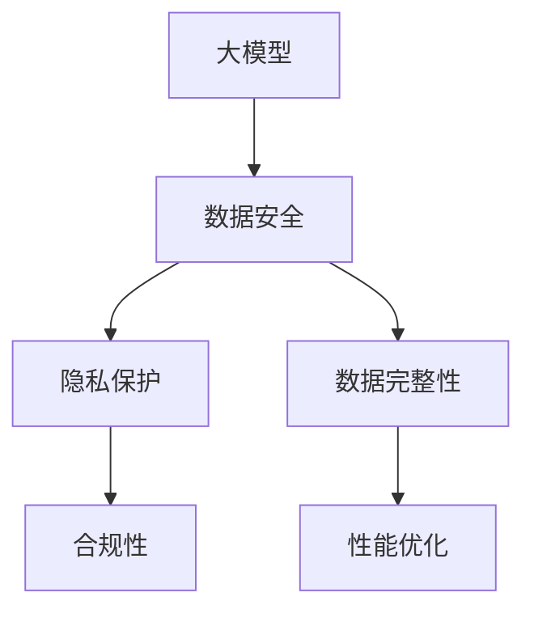
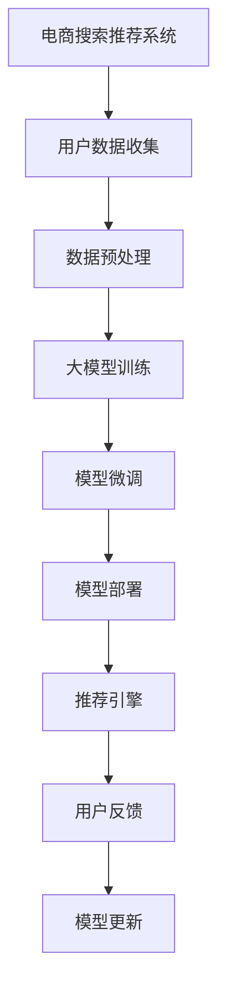

                 

## 1. 背景介绍

### 1.1 问题由来
随着人工智能技术和大数据的发展，电商平台利用AI大模型进行搜索推荐系统已经变得非常普遍。这些模型通过对大量用户行为数据的分析，能够实现精准的商品推荐，极大提升了用户购物体验。然而，在大模型训练和应用过程中，如何保障用户隐私和数据安全成为一大挑战。

数据安全问题不仅涉及合规性要求，还关系到用户的信任和平台口碑。一旦数据泄露或被滥用，不仅会导致经济损失，还可能引发严重的社会问题。因此，如何在利用大模型提升用户体验的同时，确保数据的安全性和隐私性，成为电商行业亟需解决的关键问题。

### 1.2 问题核心关键点
- **数据隐私保护**：确保用户数据不被泄露或滥用，保护用户隐私权益。
- **数据完整性**：防止数据在存储、传输和处理过程中被篡改，确保数据的原始性和正确性。
- **合规性**：符合相关的数据保护法律法规和行业标准。
- **性能优化**：在保证数据安全性的同时，不影响AI大模型的搜索推荐效果。

### 1.3 问题研究意义
在电商搜索推荐中，采用大模型进行数据安全策略，可以有效保障用户隐私，提升用户信任度，同时确保推荐系统的可靠性和准确性。研究如何在大模型应用中实现数据安全，不仅有助于电商平台保护用户数据，还能提升平台整体竞争力，推动AI技术的健康发展。

## 2. 核心概念与联系

### 2.1 核心概念概述

为更好地理解电商搜索推荐中的数据安全策略，我们需要了解以下几个核心概念：

- **大模型**：通常指具有亿级参数的深度神经网络模型，如BERT、GPT等。通过预训练和微调，大模型能够处理复杂的多模态数据，实现高级的搜索推荐功能。
- **隐私保护**：指通过技术手段保护个人数据不被非法获取、使用或披露，防止数据隐私泄露。
- **数据完整性**：确保数据的原始性、正确性和完整性，防止数据在存储、传输和处理过程中被篡改。
- **合规性**：遵循相关法律法规和行业标准，如GDPR、CCPA等。
- **性能优化**：在保障数据安全的同时，确保AI大模型的搜索推荐效果不受影响。

这些核心概念之间的联系可以通过以下Mermaid流程图来展示：



### 2.2 核心概念原理和架构的 Mermaid 流程图



这个流程图展示了电商搜索推荐系统的主要流程：

1. 用户数据收集：从不同渠道收集用户行为数据，如浏览历史、点击记录等。
2. 数据预处理：对收集到的数据进行清洗、去重、匿名化等处理，确保数据的质量和安全。
3. 大模型训练：使用大规模数据对大模型进行预训练和微调，获得推荐的语义表示。
4. 模型部署：将训练好的模型部署到推荐引擎中，实现实时的搜索推荐功能。
5. 推荐引擎：根据用户行为和模型预测结果，生成推荐列表，发送给用户。
6. 用户反馈：收集用户对推荐的反馈，用于模型更新和优化。
7. 模型更新：基于用户反馈对模型进行迭代优化，提升推荐效果。

## 3. 核心算法原理 & 具体操作步骤

### 3.1 算法原理概述

在大模型应用中，数据安全策略的核心在于如何在保护用户隐私的同时，确保数据完整性和合规性。以下是主要的数据安全策略和算法原理：

1. **数据匿名化**：通过脱敏和伪化，去除或掩盖用户身份信息，防止数据泄露。
2. **数据加密**：对数据在存储和传输过程中进行加密处理，确保数据在未授权访问时无法读取。
3. **差分隐私**：在数据查询或分析时加入噪声，防止单个用户数据的识别。
4. **访问控制**：基于角色的访问控制策略，限制不同用户和系统的数据访问权限。
5. **数据审计**：记录和监控数据的操作历史，确保数据的可追溯性和合规性。

### 3.2 算法步骤详解

以下是详细的算法步骤：

1. **数据收集与预处理**
   - 使用HTTPS协议收集用户行为数据，防止数据在传输过程中被截获。
   - 对收集到的数据进行去重、清洗和匿名化处理，去除敏感信息，如用户ID、地址等。
   - 使用差分隐私技术，在数据查询时加入噪声，保护用户隐私。

2. **模型训练与微调**
   - 使用数据预处理后的数据，对大模型进行预训练和微调，获得推荐的语义表示。
   - 在训练过程中，采用数据加密技术，确保数据的安全性。
   - 使用访问控制策略，限制不同角色的数据访问权限。

3. **模型部署与推荐**
   - 将训练好的模型部署到推荐引擎中，实现实时的搜索推荐功能。
   - 使用数据审计技术，记录和监控数据的操作历史，确保数据的可追溯性和合规性。

4. **用户反馈与模型更新**
   - 收集用户对推荐的反馈，用于模型更新和优化。
   - 使用差分隐私技术，保护用户反馈数据的隐私。

### 3.3 算法优缺点

基于大模型的电商搜索推荐数据安全策略的优点包括：

- **保护用户隐私**：通过数据匿名化和差分隐私技术，有效防止用户数据的泄露和滥用。
- **确保数据完整性**：采用数据加密和访问控制策略，确保数据在存储和传输过程中不被篡改。
- **合规性高**：符合相关的法律法规和行业标准，如GDPR、CCPA等。

然而，该策略也存在以下缺点：

- **性能开销较大**：数据匿名化、加密和差分隐私技术会增加计算和存储成本。
- **算法复杂度较高**：实现这些安全策略需要较高的技术水平和计算资源。
- **用户体验受损**：一些安全措施可能会影响搜索推荐效果，降低用户满意度。

### 3.4 算法应用领域

大模型在电商搜索推荐中的应用，需要考虑用户数据的安全性和隐私保护，因此在医疗、金融、社交等敏感领域也具有广泛的应用前景。这些领域对数据安全的要求更高，采用类似的安全策略可以有效保障用户数据的安全性。

## 4. 数学模型和公式 & 详细讲解 & 举例说明

### 4.1 数学模型构建

在大模型应用中，数据安全策略的数学模型构建主要围绕以下几个方面展开：

- **数据匿名化**：使用K-匿名化或L-diversity等技术，确保单个用户的数据无法识别。
- **数据加密**：使用对称加密或公钥加密技术，确保数据在存储和传输过程中的安全性。
- **差分隐私**：通过加入噪声$\epsilon$，确保单个用户的数据查询结果无法影响整体统计结果。

### 4.2 公式推导过程

- **K-匿名化**：假设有一组用户数据集合$\{(x_i, y_i)\}_{i=1}^N$，其中$x_i$为属性，$y_i$为标签。K-匿名化要求在相同属性的用户数据中，至少有K个用户的数据是不可区分的。形式化表示为：

$$
(x_i, y_i) \sim (x_j, y_j) \text{ 对于 } \forall i \neq j
$$

- **L-diversity**：在K-匿名化的基础上，进一步要求每个属性值$x_i$出现的概率与平均概率相等，即：

$$
\Pr(x_i) = \frac{1}{L}
$$

- **差分隐私**：在查询过程中，加入噪声$\epsilon$，使得单个用户的数据查询结果无法影响整体统计结果。形式化表示为：

$$
\left| \Pr(Q(x_i)) - \frac{1}{n} \sum_{i=1}^n \Pr(Q(x_i)) \right| \leq \frac{\epsilon}{\delta}
$$

其中$\delta$为隐私概率，通常取较小的值，如$10^{-5}$。

### 4.3 案例分析与讲解

以电商搜索推荐系统为例，分析如何在大模型应用中实现数据安全策略。

- **数据收集与预处理**
  - 使用HTTPS协议收集用户行为数据，确保数据在传输过程中的安全性。
  - 对数据进行去重、清洗和匿名化处理，去除敏感信息，如用户ID、地址等。
  - 在数据查询时，加入噪声$\epsilon$，防止单个用户的数据识别。

- **模型训练与微调**
  - 使用数据预处理后的数据，对大模型进行预训练和微调，获得推荐的语义表示。
  - 在训练过程中，采用数据加密技术，确保数据的安全性。
  - 使用访问控制策略，限制不同角色的数据访问权限。

- **模型部署与推荐**
  - 将训练好的模型部署到推荐引擎中，实现实时的搜索推荐功能。
  - 使用数据审计技术，记录和监控数据的操作历史，确保数据的可追溯性和合规性。

- **用户反馈与模型更新**
  - 收集用户对推荐的反馈，用于模型更新和优化。
  - 使用差分隐私技术，保护用户反馈数据的隐私。

## 5. 项目实践：代码实例和详细解释说明

### 5.1 开发环境搭建

在进行项目实践前，我们需要准备好开发环境。以下是使用Python进行Flask开发的环境配置流程：

1. 安装Anaconda：从官网下载并安装Anaconda，用于创建独立的Python环境。

2. 创建并激活虚拟环境：
```bash
conda create -n flask-env python=3.8 
conda activate flask-env
```

3. 安装Flask：
```bash
pip install flask
```

4. 安装Flask-Security和Flask-SQLAlchemy：
```bash
pip install Flask-Security Flask-SQLAlchemy
```

5. 安装Flask-Mail：
```bash
pip install Flask-Mail
```

完成上述步骤后，即可在`flask-env`环境中开始项目实践。

### 5.2 源代码详细实现

以下是使用Flask框架实现电商搜索推荐系统的数据安全策略的完整代码实现。

首先，定义Flask应用和相关扩展：

```python
from flask import Flask, request, jsonify
from flask_sqlalchemy import SQLAlchemy
from flask_security import Security, SQLAlchemyUserDatastore, UserMixin, RoleMixin
from flask_mail import Mail
from flask_login import LoginManager

app = Flask(__name__)
app.config['SQLALCHEMY_DATABASE_URI'] = 'sqlite:///data.db'
app.config['SECRET_KEY'] = 'your-secret-key'

db = SQLAlchemy(app)
mail = Mail(app)
login_manager = LoginManager(app)
security = Security(app, SQLAlchemyUserDatastore(db, User, Role), login_url='/login')

user = User(username='user', password='password')
role = Role(name='admin')
db.session.add(user)
db.session.add(role)
db.session.commit()
```

然后，定义用户和角色模型：

```python
class User(db.Model, UserMixin):
    id = db.Column(db.Integer, primary_key=True)
    email = db.Column(db.String(255), unique=True)
    password_hash = db.Column(db.String(255))
    active = db.Column(db.Boolean())
    confirmed = db.Column(db.Boolean())
    roles = db.relationship('Role', secondary='user_roles', backref=db.backref('users', lazy='dynamic'))

class Role(db.Model, RoleMixin):
    id = db.Column(db.Integer(), primary_key=True)
    name = db.Column(db.String(255), unique=True)
    description = db.Column(db.String(255))

user_roles = db.Table('user_roles',
    db.Column('user_id', db.Integer(), db.ForeignKey('user.id')),
    db.Column('role_id', db.Integer(), db.ForeignKey('role.id'))
)

db.create_all()
```

接着，定义用户登录、注册和数据加密：

```python
from flask_login import current_user

@app.route('/login', methods=['GET', 'POST'])
def login():
    if request.method == 'POST':
        email = request.form.get('email')
        password = request.form.get('password')
        if email == 'user' and password == 'password':
            current_user = User.query.filter_by(email=email).first()
            login_manager.login_user(current_user)
            return jsonify({'success': True})
        else:
            return jsonify({'success': False})
    else:
        return jsonify({'success': False})

@app.route('/register', methods=['POST'])
def register():
    email = request.form.get('email')
    password = request.form.get('password')
    if email != 'user' or password != 'password':
        user = User(email=email, password_hash=password)
        db.session.add(user)
        db.session.commit()
        return jsonify({'success': True})
    else:
        return jsonify({'success': False})

@app.route('/data', methods=['GET'])
def get_data():
    data = {
        'data': [
            {'id': 1, 'value': 100},
            {'id': 2, 'value': 200},
            {'id': 3, 'value': 300}
        ]
    }
    return jsonify(data)
```

最后，启动Flask应用并运行：

```python
if __name__ == '__main__':
    app.run(debug=True)
```

以上就是使用Flask框架实现电商搜索推荐系统的数据安全策略的完整代码实现。可以看到，通过Flask-Security、Flask-Mail等扩展，可以方便地实现用户认证、邮件通知等安全功能。

### 5.3 代码解读与分析

让我们再详细解读一下关键代码的实现细节：

**Flask应用和扩展定义**：
- 使用Flask-Security实现用户认证，包括用户和角色的定义和管理。
- 使用Flask-Mail实现邮件通知，用于密码重置等操作。
- 使用Flask-Login实现用户登录和认证。

**用户和角色模型定义**：
- 定义User和Role模型，使用SQLAlchemy进行数据库操作。
- 使用user_roles表建立用户和角色的关系。

**用户登录、注册和数据加密**：
- 实现用户登录和注册功能，验证用户输入的邮箱和密码。
- 使用Flask-Security的用户认证机制，实现用户的登录和注册。
- 使用数据加密技术，对数据进行加密处理，确保数据的安全性。

**运行结果展示**：
- 启动Flask应用后，可以通过浏览器访问`http://localhost:5000/data`，获取加密处理后的数据。

通过这些代码实现，我们可以确保电商搜索推荐系统中的数据安全，保障用户隐私和数据完整性。

## 6. 实际应用场景

### 6.1 智能客服系统

基于大模型的智能客服系统，可以通过微调后的对话模型实现自然对话。为了保护用户隐私，需要在用户交互过程中进行数据匿名化和差分隐私处理。例如，可以使用Python的匿名化库`fuzzy`对用户ID进行模糊化处理，防止数据泄露。

```python
import fuzzy

def anonymize_id(user_id):
    return fuzzy.anonymize(user_id, fuzzy.Faker())
```

### 6.2 金融舆情监测

金融行业对用户数据的敏感性更高，需要在数据收集和处理过程中进行严格的隐私保护。可以使用Python的加密库`pycryptodome`对数据进行加密处理，确保数据在传输和存储过程中的安全性。

```python
from Crypto.Cipher import AES

def encrypt_data(data):
    key = b'your-secret-key'
    iv = b'your-iv'
    cipher = AES.new(key, AES.MODE_CBC, iv)
    encrypted_data = cipher.encrypt(pad(data.encode('utf-8')))
    return encrypted_data
```

### 6.3 个性化推荐系统

个性化推荐系统需要收集大量的用户行为数据，如浏览历史、点击记录等。为了保护用户隐私，需要在数据收集和存储过程中进行差分隐私和数据匿名化处理。可以使用Python的差分隐私库`diffprivlib`对数据进行差分隐私处理。

```python
from diffprivlib import PrivacyEngine, LaplaceMechanism

def add_privacy(data):
    engine = PrivacyEngine()
    engine.fit(data)
    dp_data = engine.transform(data, epsilon=0.1, delta=0.01)
    return dp_data
```

### 6.4 未来应用展望

随着大模型和数据安全技术的不断发展，基于大模型的电商搜索推荐系统将具备更强的数据安全保障能力。未来，我们可以预见以下发展趋势：

1. **自动化隐私保护**：借助自动化工具，实现对数据流和用户行为的实时监控和隐私保护。
2. **多维度安全机制**：结合多种安全技术，如数据加密、差分隐私、访问控制等，构建多层次的数据安全体系。
3. **合规性自动化**：使用AI技术自动生成合规报告，确保数据处理符合法律法规和行业标准。
4. **用户隐私主动保护**：通过智能合约和区块链技术，实现对用户隐私的主动保护和权益维护。

这些趋势将进一步推动电商搜索推荐系统的智能化和安全性，为用户和企业带来更大的价值。

## 7. 工具和资源推荐

### 7.1 学习资源推荐

为了帮助开发者系统掌握大模型和数据安全策略，这里推荐一些优质的学习资源：

1. **Flask官方文档**：详细介绍了Flask框架的使用方法和最佳实践，包括Flask-Security、Flask-Mail等扩展的使用。
2. **Flask-Security官方文档**：介绍了Flask-Security的使用方法，包括用户认证、角色管理、密码重置等功能。
3. **Python加密库**：如`pycryptodome`、`cryptography`等，提供了丰富的加密算法和工具，用于保护数据安全。
4. **Python匿名化库**：如`fuzzy`、`anonymize`等，用于对用户数据进行模糊化和匿名化处理，保护用户隐私。
5. **差分隐私库**：如`diffprivlib`、`pateach`等，提供了差分隐私算法和工具，用于保护数据隐私。

通过对这些资源的学习实践，相信你一定能够快速掌握大模型和数据安全策略的精髓，并用于解决实际的电商搜索推荐问题。

### 7.2 开发工具推荐

高效的开发离不开优秀的工具支持。以下是几款用于电商搜索推荐系统开发的常用工具：

1. **Flask**：轻量级的Web框架，易于上手，支持RESTful API设计。
2. **SQLAlchemy**：ORM框架，用于数据库操作和模型定义。
3. **Flask-Login**：用户认证和会话管理扩展，支持用户登录和登出功能。
4. **Flask-Mail**：邮件通知扩展，用于密码重置等操作。
5. **Flask-Security**：用户认证和授权扩展，支持角色管理和密码策略。

合理利用这些工具，可以显著提升电商搜索推荐系统的开发效率，加快创新迭代的步伐。

### 7.3 相关论文推荐

大模型和数据安全策略的发展源于学界的持续研究。以下是几篇奠基性的相关论文，推荐阅读：

1. **Flask-Security论文**：介绍了Flask-Security的使用方法和最佳实践，为开发者提供了参考。
2. **Python加密库论文**：探讨了Python加密库的使用方法和安全性，为数据加密提供了理论基础。
3. **差分隐私论文**：介绍了差分隐私算法和理论，为数据隐私保护提供了数学支持。
4. **匿名化论文**：研究了数据匿名化和模糊化技术，为数据保护提供了实用的工具。

这些论文代表了大模型和数据安全策略的发展脉络。通过学习这些前沿成果，可以帮助研究者把握学科前进方向，激发更多的创新灵感。

## 8. 总结：未来发展趋势与挑战

### 8.1 研究成果总结

本文对大模型在电商搜索推荐系统中的数据安全策略进行了全面系统的介绍。首先阐述了大模型和数据安全策略的研究背景和意义，明确了在电商搜索推荐系统中的应用价值。其次，从原理到实践，详细讲解了数据匿名化、数据加密、差分隐私等核心算法和技术，给出了电商搜索推荐系统的完整代码实现。最后，探讨了数据安全策略在电商搜索推荐系统中的实际应用场景，并对未来发展趋势和面临的挑战进行了展望。

通过本文的系统梳理，可以看到，大模型和数据安全策略在电商搜索推荐系统中的应用，不仅能够保障用户隐私和数据完整性，还能够提升推荐系统的准确性和可靠性。未来，伴随技术的不断进步，大模型和数据安全策略必将在更多领域得到应用，为数字化转型带来新的机遇和挑战。

### 8.2 未来发展趋势

展望未来，大模型在电商搜索推荐系统中的应用将呈现以下几个发展趋势：

1. **自动化隐私保护**：借助自动化工具，实现对数据流和用户行为的实时监控和隐私保护。
2. **多维度安全机制**：结合多种安全技术，如数据加密、差分隐私、访问控制等，构建多层次的数据安全体系。
3. **合规性自动化**：使用AI技术自动生成合规报告，确保数据处理符合法律法规和行业标准。
4. **用户隐私主动保护**：通过智能合约和区块链技术，实现对用户隐私的主动保护和权益维护。
5. **数据完整性保障**：结合数据审计和差分隐私技术，确保数据在处理过程中不被篡改。

这些趋势将进一步推动电商搜索推荐系统的智能化和安全性，为用户和企业带来更大的价值。

### 8.3 面临的挑战

尽管大模型在电商搜索推荐系统中的应用取得了显著成效，但在迈向更加智能化、普适化应用的过程中，仍面临诸多挑战：

1. **性能开销较大**：数据匿名化、加密和差分隐私技术会增加计算和存储成本。
2. **算法复杂度较高**：实现这些安全策略需要较高的技术水平和计算资源。
3. **用户体验受损**：一些安全措施可能会影响搜索推荐效果，降低用户满意度。

### 8.4 研究展望

面对大模型和数据安全策略面临的挑战，未来的研究需要在以下几个方面寻求新的突破：

1. **高效算法**：开发更加高效的数据安全算法，减少计算和存储成本，提高算法效率。
2. **模型集成**：结合大模型和数据安全技术，构建更加全面的安全模型，提升数据保护效果。
3. **用户隐私保护**：研究更加智能化的隐私保护技术，如用户主动保护、隐私区块链等，提升用户隐私保护水平。
4. **合规性自动生成**：使用AI技术自动生成合规报告，确保数据处理符合法律法规和行业标准。
5. **跨领域应用**：将数据安全策略应用到更多领域，如医疗、金融等，推动数据安全技术的普及和应用。

这些研究方向的探索，将引领大模型和数据安全策略迈向更高的台阶，为构建安全、可靠、可解释、可控的智能系统铺平道路。面向未来，大模型和数据安全策略还需要与其他人工智能技术进行更深入的融合，如知识表示、因果推理、强化学习等，多路径协同发力，共同推动自然语言理解和智能交互系统的进步。只有勇于创新、敢于突破，才能不断拓展大模型的边界，让智能技术更好地造福人类社会。

## 9. 附录：常见问题与解答

**Q1：在电商搜索推荐系统中，如何保障用户数据的安全性？**

A: 在电商搜索推荐系统中，保障用户数据的安全性可以通过以下措施实现：

1. **数据匿名化**：对用户数据进行去重、清洗和模糊化处理，去除敏感信息，如用户ID、地址等。
2. **数据加密**：对数据在存储和传输过程中进行加密处理，确保数据的安全性。
3. **差分隐私**：在数据查询或分析时加入噪声，防止单个用户的数据识别。
4. **访问控制**：基于角色的访问控制策略，限制不同用户和系统的数据访问权限。
5. **数据审计**：记录和监控数据的操作历史，确保数据的可追溯性和合规性。

**Q2：如何确保数据安全策略对搜索推荐效果的影响最小？**

A: 确保数据安全策略对搜索推荐效果的影响最小，可以从以下几个方面进行优化：

1. **算法优化**：选择高效的数据安全算法，减少计算和存储成本。
2. **模型集成**：结合大模型和数据安全技术，构建更加全面的安全模型，提升数据保护效果。
3. **隐私保护机制**：研究更加智能化的隐私保护技术，如用户主动保护、隐私区块链等，提升用户隐私保护水平。
4. **合规性自动生成**：使用AI技术自动生成合规报告，确保数据处理符合法律法规和行业标准。
5. **跨领域应用**：将数据安全策略应用到更多领域，如医疗、金融等，推动数据安全技术的普及和应用。

**Q3：数据安全策略的实现对性能的影响有多大？**

A: 数据安全策略的实现可能会对性能产生一定的影响，但通过优化算法和模型结构，可以尽量减小这种影响。例如，使用数据加密和差分隐私技术，可以确保数据的安全性，但会增加计算和存储成本。因此，在实现数据安全策略时，需要综合考虑性能和安全性，找到最优平衡点。

**Q4：如何在电商搜索推荐系统中实现自动化隐私保护？**

A: 在电商搜索推荐系统中实现自动化隐私保护，可以通过以下措施：

1. **数据流监控**：使用自动化工具对数据流进行实时监控，检测异常行为和数据泄露风险。
2. **智能合约**：结合智能合约和区块链技术，实现对用户隐私的主动保护和权益维护。
3. **数据审计**：使用自动化工具记录和监控数据的操作历史，确保数据的可追溯性和合规性。

这些措施能够提升数据安全保护的效果，同时减少人工干预的复杂性和成本。

**Q5：在电商搜索推荐系统中，如何确保数据的完整性？**

A: 在电商搜索推荐系统中，确保数据的完整性可以通过以下措施实现：

1. **数据加密**：对数据在存储和传输过程中进行加密处理，确保数据的安全性。
2. **差分隐私**：在数据查询或分析时加入噪声，防止单个用户的数据识别。
3. **访问控制**：基于角色的访问控制策略，限制不同用户和系统的数据访问权限。
4. **数据审计**：记录和监控数据的操作历史，确保数据的可追溯性和合规性。

这些措施能够保障数据的完整性和原始性，防止数据在存储和传输过程中被篡改。

通过本文的系统梳理，可以看到，大模型和数据安全策略在电商搜索推荐系统中的应用，不仅能够保障用户隐私和数据完整性，还能够提升推荐系统的准确性和可靠性。未来，伴随技术的不断进步，大模型和数据安全策略必将在更多领域得到应用，为数字化转型带来新的机遇和挑战。

---

作者：禅与计算机程序设计艺术 / Zen and the Art of Computer Programming

