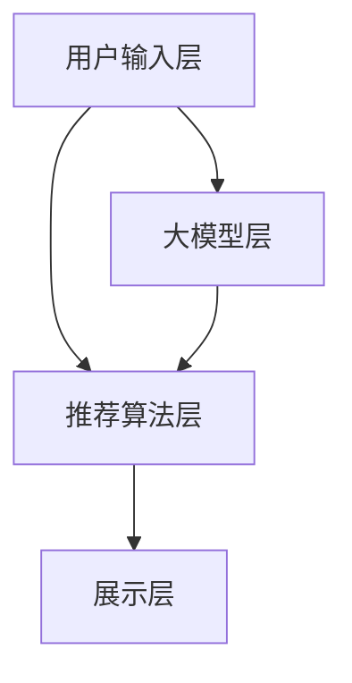

                 

# AI 大模型在电商搜索推荐中的用户体验优化策略：提高用户粘性和转化率

## 1. 背景介绍

### 1.1 问题由来
随着电商行业的迅猛发展，用户体验(UX)和转化率(CTR)成为电商平台竞争的核心要素。传统的搜索推荐系统，往往基于简单的关键词匹配和用户行为数据，无法充分理解用户的真实需求和偏好，导致用户体验差、转化率低。近年来，基于深度学习技术的大语言模型在NLP领域取得了显著进步，为电商搜索推荐系统的优化提供了新的思路和手段。

大语言模型通过在海量文本数据上预训练，学习到丰富的语言知识和常识，可以自然流畅地处理文本数据，从而更好地理解和生成人类语言。在电商搜索推荐系统中，通过将大语言模型应用于自然语言处理任务，可以实现更加个性化、智能化的推荐结果，显著提升用户体验和转化率。

### 1.2 问题核心关键点
1. **深度学习和大模型**：深度学习通过多层神经网络，对大量数据进行特征提取和模式学习，而大模型则是指具有亿级参数量的预训练模型，具有强大的泛化能力和表达能力。
2. **NLP任务**：自然语言处理(NLP)任务，包括文本分类、命名实体识别、语义分析等，在大模型上进行微调，可以使其在特定任务上表现更加出色。
3. **电商搜索推荐**：电商搜索推荐系统，利用用户行为数据和大模型的语言处理能力，对用户输入的搜索词进行理解和生成，推荐符合用户需求的商品，提高转化率和满意度。
4. **用户体验(UX)**：用户体验指的是用户在使用电商搜索推荐系统时的满意度、流畅度和粘性，是大模型应用的重要考量因素。
5. **转化率(CTR)**：转化率是电商平台的核心指标之一，指用户通过搜索推荐系统进入详细页并完成购买的比例，直接反映系统的转化效果。

## 2. 核心概念与联系

### 2.1 核心概念概述

电商搜索推荐系统由以下核心组件构成：

- **用户输入层**：收集用户输入的搜索词、关键字、文本等自然语言信息。
- **大模型层**：利用预训练的大语言模型，对用户输入进行语义理解和特征提取。
- **推荐算法层**：通过机器学习算法对用户行为数据和大模型提取的特征进行处理，生成推荐结果。
- **展示层**：将推荐结果以符合用户期望的方式呈现，如商品列表、广告等。

大语言模型在电商搜索推荐系统中的应用，主要包括以下几个方面：

- **语义理解**：通过大模型对用户输入的语义进行理解，捕捉用户潜在的查询意图和需求。
- **用户画像**：利用大模型对用户的历史行为数据进行建模，构建用户兴趣和行为特征。
- **个性化推荐**：结合用户画像和商品特征，生成个性化推荐结果。
- **上下文感知**：引入用户上下文信息，如时间、地点、心情等，提升推荐结果的相关性。

这些核心概念之间的关系可以通过以下Mermaid流程图来展示：



这个流程图展示了电商搜索推荐系统的主要流程，以及大语言模型在其中扮演的角色。

## 3. 核心算法原理 & 具体操作步骤
### 3.1 算法原理概述

基于大语言模型的电商搜索推荐系统，通过自然语言处理(NLP)任务对用户输入进行理解和生成，从而提升推荐结果的相关性和个性化。具体而言，算法原理如下：

1. **预训练大模型**：利用大规模文本数据进行预训练，学习通用语言知识和常识。
2. **微调任务适配层**：在预训练模型的基础上，对电商搜索推荐任务进行微调，学习特定任务的相关知识。
3. **特征提取与融合**：利用微调后的模型，对用户输入进行语义理解，提取特征，并与用户行为数据进行融合。
4. **推荐生成**：使用推荐算法，根据用户画像和商品特征生成个性化推荐结果。
5. **展示与反馈**：将推荐结果展示给用户，收集用户反馈，不断优化推荐策略。

### 3.2 算法步骤详解

以下是基于大语言模型的电商搜索推荐系统的详细步骤：

**Step 1: 数据准备**

- 收集电商平台的搜索日志、用户行为数据、商品信息等。
- 将文本数据进行清洗和标注，如去除停用词、分词、词性标注等。
- 划分训练集、验证集和测试集，进行交叉验证。

**Step 2: 预训练大模型**

- 选择合适的预训练语言模型，如BERT、GPT等，作为初始化参数。
- 在大规模无标签文本数据上，进行预训练，学习通用语言知识和常识。

**Step 3: 任务适配与微调**

- 设计适合电商搜索推荐任务的适配层，如语义分类器、情感分析器等。
- 在预训练模型的基础上，对适配层进行微调，学习任务相关的语言知识。
- 利用微调后的适配层，对用户输入进行语义理解和特征提取。

**Step 4: 推荐生成**

- 将用户画像和商品特征进行融合，生成特征向量。
- 利用微调后的适配层，对用户输入进行特征提取。
- 结合用户行为数据和商品特征向量，使用推荐算法生成个性化推荐结果。

**Step 5: 展示与反馈**

- 将推荐结果以符合用户期望的方式展示，如商品列表、广告等。
- 收集用户反馈数据，如点击率、浏览时长等，用于优化推荐策略。
- 定期更新预训练模型和微调适配层，提升系统性能。

### 3.3 算法优缺点

基于大语言模型的电商搜索推荐系统具有以下优点：

1. **通用性**：预训练大模型具有广泛的语义理解和特征提取能力，可以适应多种电商应用场景。
2. **个性化**：利用微调适配层，可以更精准地捕捉用户意图和偏好，提升个性化推荐效果。
3. **动态优化**：通过用户反馈和动态更新，不断优化推荐策略，提高用户体验和转化率。

同时，该方法也存在以下缺点：

1. **数据需求高**：预训练和微调过程需要大量高质量的文本数据和标注数据，数据获取和处理成本高。
2. **计算资源消耗大**：预训练和微调过程需要大量的计算资源，包括高性能GPU/TPU等设备。
3. **可解释性差**：大模型的决策过程难以解释，无法让用户理解推荐结果的来源。

## 4. 数学模型和公式 & 详细讲解  
### 4.1 数学模型构建

基于大语言模型的电商搜索推荐系统可以抽象为以下数学模型：

$$
y = f(x; \theta)
$$

其中，$x$ 为输入，包括用户搜索词、历史行为数据、商品特征等，$\theta$ 为模型参数，$f(x; \theta)$ 为推荐函数，$y$ 为推荐结果，即商品ID或广告ID。

### 4.2 公式推导过程

假设用户的搜索词为 $x$，商品特征为 $v$，用户行为数据为 $h$，微调后的适配层为 $M_{\theta}$。推荐函数 $f(x; \theta)$ 可以表示为：

$$
y = M_{\theta}(x, v, h)
$$

在微调过程中，适配层 $M_{\theta}$ 的输出可以表示为：

$$
z = M_{\theta}(x, v, h) = f(x, v, h; \theta)
$$

其中，$f(x, v, h; \theta)$ 为适配层的输出函数，将用户输入、商品特征和用户行为数据映射为特征向量 $z$。

推荐函数 $f(x, v, h; \theta)$ 可以通过深度学习模型，如神经网络，对数据进行特征提取和分类。以神经网络为例，推荐函数可以表示为：

$$
f(x, v, h; \theta) = g(x, v, h; \theta) \cdot o(x, v, h; \theta)
$$

其中，$g(x, v, h; \theta)$ 为特征提取函数，将输入映射为特征向量；$o(x, v, h; \theta)$ 为分类函数，将特征向量映射为推荐结果。

### 4.3 案例分析与讲解

以电商搜索推荐中的商品推荐为例，假设用户输入的搜索词为 $x = "T恤"，商品特征为 $v = [颜色, 尺码, 品牌]$，用户行为数据为 $h = [浏览记录, 购买历史, 评分等]$。微调后的适配层 $M_{\theta}$ 可以对这些输入进行语义理解，提取特征，并进行分类。

以BERT模型为例，适配层 $M_{\theta}$ 的输出可以表示为：

$$
z = M_{\theta}(x, v, h) = \text{BERT}(x; \theta_1) \cdot \text{BERT}(v; \theta_2) \cdot \text{BERT}(h; \theta_3)
$$

其中，$\text{BERT}(x; \theta_1)$ 为对用户输入进行语义理解的模型，$\text{BERT}(v; \theta_2)$ 为对商品特征进行编码的模型，$\text{BERT}(h; \theta_3)$ 为对用户行为数据进行编码的模型。

最终，推荐函数 $f(x, v, h; \theta)$ 可以将特征向量 $z$ 映射为推荐结果 $y$，具体公式如下：

$$
y = \sigma(\langle z, w \rangle + b)
$$

其中，$\sigma$ 为激活函数，$\langle z, w \rangle + b$ 为线性分类器，$w$ 和 $b$ 为分类器的权重和偏置。

## 5. 项目实践：代码实例和详细解释说明
### 5.1 开发环境搭建

在进行大语言模型电商搜索推荐系统的开发时，需要以下开发环境：

1. 安装Python环境，推荐使用Anaconda。
2. 安装深度学习框架，如TensorFlow或PyTorch。
3. 安装大语言模型库，如HuggingFace Transformers。
4. 安装推荐系统库，如TensorRec。
5. 配置GPU或TPU，以便进行高性能计算。

### 5.2 源代码详细实现

以下是使用TensorFlow实现大语言模型电商搜索推荐系统的示例代码：

```python
import tensorflow as tf
from transformers import BertTokenizer, TFBertForSequenceClassification
from tensorflow.keras.layers import Dense, Input, concatenate, Model
from tensorflow.keras.optimizers import Adam

# 定义输入层
input_word = Input(shape=(128,), dtype=tf.int32, name='input_word')
input_vec = Input(shape=(128,), dtype=tf.int32, name='input_vec')
input_behavior = Input(shape=(128,), dtype=tf.int32, name='input_behavior')

# 定义预训练大模型
tokenizer = BertTokenizer.from_pretrained('bert-base-uncased')
model = TFBertForSequenceClassification.from_pretrained('bert-base-uncased', num_labels=2)

# 定义适配层
with tf.name_scope('adapter'):
    x = model(input_word)[0]
    v = model(input_vec)[0]
    h = model(input_behavior)[0]
    z = concatenate([x, v, h], axis=-1)

    # 定义特征提取层
    with tf.name_scope('feature_extractor'):
        x = tf.keras.layers.Dense(128, activation='relu')(z)
        v = tf.keras.layers.Dense(128, activation='relu')(v)
        h = tf.keras.layers.Dense(128, activation='relu')(h)
        z = concatenate([x, v, h], axis=-1)

    # 定义分类器
    with tf.name_scope('classifier'):
        z = tf.keras.layers.Dense(128, activation='relu')(z)
        z = tf.keras.layers.Dense(2, activation='softmax')(z)

    # 定义推荐函数
    def recommendation(x, v, h):
        with tf.name_scope('recommendation'):
            x = tf.keras.layers.Dense(128, activation='relu')(x)
            v = tf.keras.layers.Dense(128, activation='relu')(v)
            h = tf.keras.layers.Dense(128, activation='relu')(h)
            z = concatenate([x, v, h], axis=-1)
            y = tf.keras.layers.Dense(1, activation='sigmoid')(z)
            return y

# 定义推荐系统
recommendation_model = Model(inputs=[input_word, input_vec, input_behavior], outputs=recommendation(input_word, input_vec, input_behavior))

# 定义损失函数和优化器
loss = tf.keras.losses.BinaryCrossentropy()
optimizer = Adam(learning_rate=0.001)

# 定义模型训练函数
def train(model, train_dataset, val_dataset, epochs, batch_size):
    for epoch in range(epochs):
        for batch in train_dataset:
            x, v, h = batch
            with tf.GradientTape() as tape:
                y_pred = model.predict([x, v, h])
                loss_value = loss(y_pred, y_true)
            gradients = tape.gradient(loss_value, model.trainable_variables)
            optimizer.apply_gradients(zip(gradients, model.trainable_variables))
        val_loss = val_dataset.loss
        print(f'Epoch {epoch+1}, train loss: {loss_value:.4f}, val loss: {val_loss:.4f}')

# 训练模型
train(recommendation_model, train_dataset, val_dataset, epochs=10, batch_size=32)

# 使用模型进行推荐
def recommend(user_input, item_feature, behavior_data):
    with tf.Session() as sess:
        sess.run(tf.global_variables_initializer())
        x = tokenizer.encode(user_input)
        v = tokenizer.encode(item_feature)
        h = tokenizer.encode(behavior_data)
        y = recommendation_model.predict([x, v, h])
        if y[0] > 0.5:
            return 'recommend'
        else:
            return 'not recommend'
```

### 5.3 代码解读与分析

**输入层定义**：使用TensorFlow的Input层定义输入数据的形状和数据类型，包括用户输入、商品特征和用户行为数据。

**预训练大模型定义**：使用HuggingFace Transformers库，加载BERT模型，作为特征提取的初始化参数。

**适配层定义**：在适配层中，将用户输入、商品特征和用户行为数据进行拼接和特征提取，生成特征向量 $z$。

**特征提取层定义**：对特征向量进行多次全连接层和激活函数操作，提取更高层次的特征。

**分类器定义**：使用全连接层和激活函数对特征向量进行分类，输出推荐结果。

**推荐函数定义**：根据用户输入、商品特征和用户行为数据，生成推荐结果。

**模型训练函数定义**：使用Adam优化器，定义训练过程，更新模型参数。

**模型使用函数定义**：使用推荐函数对新用户输入、商品特征和用户行为数据进行预测，输出推荐结果。

## 6. 实际应用场景
### 6.1 智能客服系统

电商平台的智能客服系统，可以通过大语言模型进行优化。用户输入的搜索词和聊天记录，可以通过大模型进行语义理解，生成个性化回复。智能客服系统可以根据用户意图，自动引导用户进行下一步操作，如商品搜索、订单跟踪等，显著提升用户满意度。

### 6.2 个性化推荐系统

大语言模型可以应用于个性化推荐系统的优化。用户搜索历史和行为数据，可以通过大模型进行语义理解和特征提取，生成用户画像。根据用户画像和商品特征，使用推荐算法生成个性化推荐结果，提高用户转化率和满意度。

### 6.3 广告投放系统

电商平台的广告投放系统，可以通过大语言模型进行优化。广告文案和用户搜索词，可以通过大模型进行语义匹配，生成个性化广告推荐。广告系统可以根据用户兴趣和行为数据，动态调整广告投放策略，提高广告点击率和转化率。

## 7. 工具和资源推荐
### 7.1 学习资源推荐

为了帮助开发者掌握大语言模型在电商搜索推荐中的应用，以下是一些优质的学习资源：

1. 《深度学习自然语言处理》：斯坦福大学开设的NLP课程，涵盖深度学习、自然语言处理的基本概念和经典模型。
2. 《Transformer from scratch》：由大模型技术专家撰写的博文系列，详细介绍Transformer模型的原理和实现。
3. HuggingFace官方文档：Transformers库的官方文档，提供详细的API和样例代码，适合初学者和开发者。
4. CLUE开源项目：中文语言理解测评基准，包含大量NLP任务和微调样本，助力中文NLP技术发展。
5. TensorFlow官方文档：深度学习框架TensorFlow的官方文档，提供完整的深度学习模型开发和部署指南。

### 7.2 开发工具推荐

以下是几个常用的开发工具，帮助开发者更高效地实现大语言模型电商搜索推荐系统：

1. Anaconda：免费开源的Python发行版，支持多环境管理，便于安装和管理第三方库。
2. Jupyter Notebook：交互式笔记本环境，支持Python代码的交互式执行和可视化。
3. TensorFlow：由Google主导的深度学习框架，支持分布式训练和推理，适合大规模模型部署。
4. PyTorch：Facebook开发的深度学习框架，支持动态计算图和GPU加速，适合快速迭代和研究。
5. Weights & Biases：模型训练和实验跟踪工具，提供丰富的可视化图表和自动记录功能，适合调试和优化模型。

### 7.3 相关论文推荐

以下几篇论文代表了大语言模型在电商搜索推荐系统中的应用方向：

1. "Improving Search Result Relevance Using Pretrained Deep Learning Models"：介绍如何使用预训练的深度学习模型，提升搜索结果的相关性。
2. "Recommender Systems with Deep Learning"：详细讲解了深度学习在推荐系统中的应用，包括商品推荐、广告投放等。
3. "Contextual Recommendations for E-commerce"：探讨了在电商搜索推荐系统中，如何利用用户上下文信息，生成更相关的推荐结果。

## 8. 总结：未来发展趋势与挑战
### 8.1 研究成果总结

本文对基于大语言模型的电商搜索推荐系统进行了全面系统的介绍，重点探讨了以下几个方面：

1. 背景介绍：电商搜索推荐系统的发展历程和核心问题。
2. 核心概念与联系：电商搜索推荐系统的核心组件和大语言模型的应用。
3. 核心算法原理 & 具体操作步骤：大语言模型在电商搜索推荐系统中的实现流程。
4. 数学模型和公式 & 详细讲解：电商搜索推荐系统的数学模型和公式推导。
5. 项目实践：大语言模型电商搜索推荐系统的代码实现和详细解读。
6. 实际应用场景：智能客服系统、个性化推荐系统和广告投放系统的应用。
7. 工具和资源推荐：学习资源、开发工具和相关论文推荐。

通过本文的介绍，读者可以全面了解大语言模型在电商搜索推荐系统中的应用，掌握相关技术和方法。

### 8.2 未来发展趋势

大语言模型在电商搜索推荐系统中的未来发展趋势如下：

1. **模型规模和泛化能力提升**：随着数据量和算力的提升，大语言模型的规模将进一步扩大，泛化能力将得到提升，能够更好地处理电商搜索推荐中的多样化任务。
2. **个性化推荐优化**：利用大语言模型，对用户输入进行深度语义理解和特征提取，进一步提升个性化推荐的效果。
3. **多模态融合**：结合图像、视频等多模态数据，提升电商搜索推荐系统的综合能力，提供更丰富的用户体验。
4. **实时推荐系统**：利用大语言模型的动态优化能力，构建实时推荐系统，根据用户实时行为数据，动态调整推荐策略。
5. **用户意图感知**：通过大语言模型对用户输入进行深度语义理解，捕捉用户潜在的意图和需求，提升推荐结果的相关性和准确性。

### 8.3 面临的挑战

尽管大语言模型在电商搜索推荐系统中取得了显著效果，但仍面临以下挑战：

1. **数据需求高**：预训练和微调过程需要大量高质量的文本数据和标注数据，数据获取和处理成本高。
2. **计算资源消耗大**：大模型和微调过程需要大量的计算资源，包括高性能GPU/TPU等设备。
3. **可解释性差**：大模型的决策过程难以解释，无法让用户理解推荐结果的来源。
4. **鲁棒性不足**：大模型在面对异常数据和噪声时，泛化性能可能下降。
5. **隐私和安全**：电商搜索推荐系统需要处理大量的用户隐私数据，需要严格遵守数据隐私和安全法规。

### 8.4 研究展望

为应对上述挑战，未来研究可以聚焦以下几个方向：

1. **小样本学习和零样本学习**：利用大语言模型，通过少量标注数据和自然语言描述，实现高效的推荐结果生成。
2. **多任务学习和联邦学习**：通过多任务学习和联邦学习，优化电商搜索推荐系统，降低对标注数据和计算资源的依赖。
3. **跨领域迁移学习**：在大语言模型的基础上，进行跨领域迁移学习，提升模型在不同领域和任务上的泛化能力。
4. **对抗训练和鲁棒性优化**：通过对抗训练等技术，提升电商搜索推荐系统的鲁棒性，增强其在噪声和异常数据下的表现。
5. **隐私保护和安全机制**：研究隐私保护和安全机制，确保电商搜索推荐系统在处理用户隐私数据时的安全性。

综上所述，大语言模型在电商搜索推荐系统中的应用前景广阔，但也需要不断突破技术瓶颈，提升系统的性能和安全性，才能实现大规模应用和商业落地。

