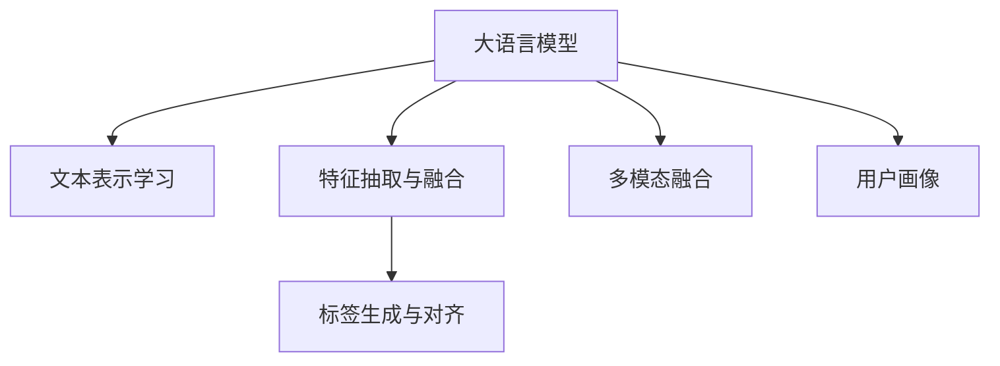

                 

## 1. 背景介绍

### 1.1 问题由来
随着电商平台用户基数的持续增长，用户需求的多样化和个性化成为电商企业关注的重点。如何精准把握用户需求，合理推荐商品，提升用户购物体验，成为电商平台亟待解决的问题。传统推荐系统主要基于用户的浏览历史、购买历史等行为数据，进行基于协同过滤、矩阵分解等算法的推荐。然而，这种方法难以处理长尾数据、用户隐私保护等问题，同时对平台方要求较高，难以在中小型电商平台上大规模部署。

近年来，随着大语言模型和大规模预训练模型的兴起，电商搜索推荐领域迎来了新的变革。通过构建精细化的用户画像，深度理解用户需求与行为意图，大语言模型有望从根本上提升推荐系统的效果。在电商搜索推荐场景中，利用大语言模型构建用户画像，已成为提升推荐精度、个性化程度和用户满意度的不二法门。

### 1.2 问题核心关键点
用户画像(User Profile)是电商平台对用户进行分群和描述的工具，通常由用户的基本信息、行为数据和属性标签等组成。通过深度学习技术，大语言模型能够从文本数据中学习用户画像，揭示用户需求与行为特征，从而实现精准推荐。

构建用户画像的关键技术包括：
- **文本表示学习**：将用户评论、搜索词、浏览记录等文本数据转化为模型可接受的向量表示。
- **特征抽取与融合**：从文本中提取有意义的特征，并融合多种特征形成全面的用户画像。
- **标签生成与对齐**：利用模型学习标签空间，并将特征与标签对齐，得到最终的标签表示。
- **多模态融合**：结合用户画像中的多模态数据（如图片、视频、位置信息等），提升用户画像的准确性和鲁棒性。

这些关键技术紧密联系，共同构成了一个完整的用户画像构建框架。通过该框架，电商平台能够精准地理解用户需求与行为意图，从而提升推荐系统的表现。

## 2. 核心概念与联系

### 2.1 核心概念概述

为更好地理解大语言模型在电商搜索推荐中的用户画像技术，本节将介绍几个关键概念：

- **大语言模型**：以自回归(如GPT)或自编码(如BERT)模型为代表的大规模预训练语言模型。通过在海量无标签文本语料上进行预训练，学习通用的语言表示，具备强大的语言理解和生成能力。

- **文本表示学习**：将文本数据转化为模型可接受的向量表示的过程。常用的方法包括Word2Vec、GloVe、BERT等。

- **特征抽取与融合**：从文本数据中提取有意义的特征，并结合其他特征（如时间戳、地理位置、商品属性等）进行融合，形成完整的用户画像。

- **标签生成与对齐**：通过模型学习标签空间，将文本特征映射到预定义的标签上，得到标签表示。

- **多模态融合**：结合文本、图像、视频等多模态数据，增强用户画像的丰富度和准确性。

这些核心概念之间具有密切联系，通过文本表示学习、特征抽取与融合、标签生成与对齐等技术，大语言模型可以构建出精细化的用户画像。多模态融合则进一步提高了用户画像的全面性和实用性。

### 2.2 核心概念原理和架构的 Mermaid 流程图(Mermaid 流程节点中不要有括号、逗号等特殊字符)


该流程图展示了从大语言模型到用户画像的构建流程：大语言模型通过文本表示学习、特征抽取与融合、标签生成与对齐等步骤，构建出完整的用户画像。多模态融合则进一步丰富了用户画像的维度，提高了其准确性和实用性。

## 3. 核心算法原理 & 具体操作步骤
### 3.1 算法原理概述

大语言模型在电商搜索推荐中的用户画像技术，本质上是利用语言模型从文本数据中学习用户需求与行为特征的过程。核心思想是：
1. **文本表示学习**：将用户评论、搜索词、浏览记录等文本数据转化为模型可接受的向量表示。
2. **特征抽取与融合**：从文本数据中提取有意义的特征，并结合其他特征（如时间戳、地理位置、商品属性等）进行融合。
3. **标签生成与对齐**：利用模型学习标签空间，将文本特征映射到预定义的标签上。
4. **多模态融合**：结合文本、图像、视频等多模态数据，增强用户画像的全面性和准确性。

### 3.2 算法步骤详解

构建用户画像的主要步骤如下：

**Step 1: 准备数据与模型**
- 收集用户评论、搜索词、浏览记录等文本数据，并进行预处理，如分词、去停用词等。
- 选择合适的预训练语言模型（如BERT、GPT等）作为初始化参数。

**Step 2: 文本表示学习**
- 使用预训练语言模型对文本数据进行编码，得到文本向量表示。

**Step 3: 特征抽取与融合**
- 提取文本向量中的特征，如情感倾向、关键词、实体等。
- 融合其他特征，如时间戳、地理位置、商品属性等。

**Step 4: 标签生成与对齐**
- 利用预训练语言模型学习标签空间，将文本特征映射到预定义的标签上，得到标签表示。

**Step 5: 多模态融合**
- 结合文本、图像、视频等多模态数据，增强用户画像的全面性和准确性。

**Step 6: 用户画像构建**
- 将文本特征、多模态特征和标签表示进行融合，得到最终的完整用户画像。

### 3.3 算法优缺点

基于大语言模型的用户画像技术具有以下优点：
1. **高效性**：利用预训练语言模型快速从文本数据中学习用户特征，显著减少了特征工程的工作量。
2. **准确性**：通过多模态融合，提高了用户画像的全面性和准确性，更好地反映了用户的真实需求与行为。
3. **可解释性**：用户画像的构建过程透明，易于理解，便于进行模型的解释和调试。

同时，该方法也存在一些局限性：
1. **数据依赖性强**：用户画像的构建依赖于高质量的文本数据，数据质量的好坏直接影响模型的表现。
2. **计算资源消耗大**：预训练语言模型的计算复杂度高，对计算资源和存储空间提出了较高的要求。
3. **隐私保护问题**：用户评论、搜索词等文本数据可能包含敏感信息，如何保护用户隐私是一个重要问题。

尽管如此，大语言模型在电商搜索推荐中的用户画像技术仍具有广阔的应用前景。未来，如何提高模型的效率、准确性和隐私保护能力，将是研究的重点。

### 3.4 算法应用领域

基于大语言模型的用户画像技术，在电商搜索推荐领域具有广泛的应用场景：

- **个性化推荐**：根据用户画像，精准推荐用户感兴趣的商品，提升推荐精度和用户体验。
- **用户行为分析**：通过用户画像，分析用户行为模式，识别潜在用户需求，优化商品推荐策略。
- **广告投放优化**：利用用户画像，进行精准投放，提高广告投放的转化率和ROI。
- **风险控制**：通过用户画像，识别潜在风险用户，防范欺诈行为和不良交易。
- **用户流失预测**：利用用户画像，预测用户流失风险，及时采取措施，提升用户留存率。

## 4. 数学模型和公式 & 详细讲解 & 举例说明
### 4.1 数学模型构建

用户画像的构建可以建模为以下几个步骤：
- **文本表示学习**：使用预训练语言模型对文本数据进行编码，得到文本向量表示。
- **特征抽取与融合**：从文本向量中提取有意义的特征，并结合其他特征进行融合。
- **标签生成与对齐**：利用预训练语言模型学习标签空间，将文本特征映射到预定义的标签上。

以用户评论为例，其数学模型可以表示为：

$$
\mathbf{x} = \mathcal{E}(\text{text}) = \mathbf{W}\textrm{vec}(\text{text}) + \mathbf{b}
$$

其中，$\mathbf{x}$ 为文本向量表示，$\mathbf{W}$ 为预训练语言模型的权重矩阵，$\textrm{vec}(\text{text})$ 为文本向量化表示，$\mathbf{b}$ 为偏置项。

### 4.2 公式推导过程

以情感分析为例，利用BERT模型进行用户评论的情感分析：

1. **预训练BERT模型**：对文本进行编码，得到文本向量表示 $\mathbf{x}$。
2. **特征抽取**：通过CLS层向量的值，提取情感倾向 $\mathbf{s}$。
3. **标签生成与对齐**：利用softmax函数，将情感倾向 $\mathbf{s}$ 映射到预定义的情感标签上。

具体公式如下：

$$
\mathbf{x} = \mathcal{E}(\text{text}) = \mathbf{W}\textrm{vec}(\text{text}) + \mathbf{b}
$$

$$
\mathbf{s} = \text{CLS}(\mathbf{x})
$$

$$
\mathbf{y} = \text{softmax}(\mathbf{s}^T\mathbf{A})
$$

其中，$\mathbf{A}$ 为情感标签的权重矩阵。

### 4.3 案例分析与讲解

以一个电商平台的商品评论为例，其用户画像的构建流程如下：

**Step 1: 准备数据与模型**
- 收集商品评论数据，并进行预处理，如分词、去停用词等。
- 使用BERT模型对文本数据进行编码，得到文本向量表示。

**Step 2: 特征抽取与融合**
- 提取文本向量中的情感倾向，作为特征之一。
- 结合时间戳、地理位置、商品属性等特征，进行融合。

**Step 3: 标签生成与对齐**
- 利用预训练BERT模型学习情感标签空间，将情感倾向映射到预定义的情感标签上。

**Step 4: 多模态融合**
- 结合商品图片、视频等多模态数据，增强用户画像的全面性。

通过以上步骤，平台可以构建出包含情感倾向、时间戳、地理位置、商品属性等多维度信息的完整用户画像。该用户画像可以作为推荐系统的输入，进行精准的商品推荐。

## 5. 项目实践：代码实例和详细解释说明
### 5.1 开发环境搭建

在进行用户画像构建实践前，我们需要准备好开发环境。以下是使用Python进行PyTorch开发的环境配置流程：

1. 安装Anaconda：从官网下载并安装Anaconda，用于创建独立的Python环境。

2. 创建并激活虚拟环境：
```bash
conda create -n pytorch-env python=3.8 
conda activate pytorch-env
```

3. 安装PyTorch：根据CUDA版本，从官网获取对应的安装命令。例如：
```bash
conda install pytorch torchvision torchaudio cudatoolkit=11.1 -c pytorch -c conda-forge
```

4. 安装Transformers库：
```bash
pip install transformers
```

5. 安装各类工具包：
```bash
pip install numpy pandas scikit-learn matplotlib tqdm jupyter notebook ipython
```

完成上述步骤后，即可在`pytorch-env`环境中开始用户画像构建实践。

### 5.2 源代码详细实现

下面我们以电商平台的商品评论情感分析为例，给出使用Transformers库对BERT模型进行用户画像构建的PyTorch代码实现。

首先，定义情感分析的数据处理函数：

```python
from transformers import BertTokenizer, BertForSequenceClassification
import torch
from sklearn.metrics import classification_report

class SentimentDataset(Dataset):
    def __init__(self, texts, labels):
        self.texts = texts
        self.labels = labels
        self.tokenizer = BertTokenizer.from_pretrained('bert-base-uncased')
        self.max_len = 512
        
    def __len__(self):
        return len(self.texts)
    
    def __getitem__(self, item):
        text = self.texts[item]
        label = self.labels[item]
        
        encoding = self.tokenizer(text, return_tensors='pt', max_length=self.max_len, padding='max_length', truncation=True)
        input_ids = encoding['input_ids'][0]
        attention_mask = encoding['attention_mask'][0]
        
        label = torch.tensor(label, dtype=torch.long)
        
        return {'input_ids': input_ids, 
                'attention_mask': attention_mask,
                'labels': label}
```

然后，定义模型和优化器：

```python
from transformers import AdamW

model = BertForSequenceClassification.from_pretrained('bert-base-uncased', num_labels=2)

optimizer = AdamW(model.parameters(), lr=2e-5)
```

接着，定义训练和评估函数：

```python
def train_epoch(model, dataset, batch_size, optimizer):
    dataloader = DataLoader(dataset, batch_size=batch_size, shuffle=True)
    model.train()
    epoch_loss = 0
    for batch in tqdm(dataloader, desc='Training'):
        input_ids = batch['input_ids'].to(device)
        attention_mask = batch['attention_mask'].to(device)
        labels = batch['labels'].to(device)
        model.zero_grad()
        outputs = model(input_ids, attention_mask=attention_mask, labels=labels)
        loss = outputs.loss
        epoch_loss += loss.item()
        loss.backward()
        optimizer.step()
    return epoch_loss / len(dataloader)

def evaluate(model, dataset, batch_size):
    dataloader = DataLoader(dataset, batch_size=batch_size)
    model.eval()
    preds, labels = [], []
    with torch.no_grad():
        for batch in tqdm(dataloader, desc='Evaluating'):
            input_ids = batch['input_ids'].to(device)
            attention_mask = batch['attention_mask'].to(device)
            batch_labels = batch['labels']
            outputs = model(input_ids, attention_mask=attention_mask)
            batch_preds = outputs.logits.argmax(dim=2).to('cpu').tolist()
            batch_labels = batch_labels.to('cpu').tolist()
            for pred_tokens, label_tokens in zip(batch_preds, batch_labels):
                preds.append(pred_tokens)
                labels.append(label_tokens)
                
    return classification_report(labels, preds)
```

最后，启动训练流程并在测试集上评估：

```python
epochs = 5
batch_size = 16

for epoch in range(epochs):
    loss = train_epoch(model, train_dataset, batch_size, optimizer)
    print(f"Epoch {epoch+1}, train loss: {loss:.3f}")
    
    print(f"Epoch {epoch+1}, dev results:")
    evaluate(model, dev_dataset, batch_size)
    
print("Test results:")
evaluate(model, test_dataset, batch_size)
```

以上就是使用PyTorch对BERT模型进行商品评论情感分析的完整代码实现。可以看到，利用Transformers库，可以方便地实现预训练模型的加载和微调，构建用户画像。

### 5.3 代码解读与分析

让我们再详细解读一下关键代码的实现细节：

**SentimentDataset类**：
- `__init__`方法：初始化文本、标签、分词器等关键组件。
- `__len__`方法：返回数据集的样本数量。
- `__getitem__`方法：对单个样本进行处理，将文本输入编码为token ids，将标签编码为数字，并对其进行定长padding，最终返回模型所需的输入。

**训练和评估函数**：
- 使用PyTorch的DataLoader对数据集进行批次化加载，供模型训练和推理使用。
- 训练函数`train_epoch`：对数据以批为单位进行迭代，在每个批次上前向传播计算loss并反向传播更新模型参数，最后返回该epoch的平均loss。
- 评估函数`evaluate`：与训练类似，不同点在于不更新模型参数，并在每个batch结束后将预测和标签结果存储下来，最后使用sklearn的classification_report对整个评估集的预测结果进行打印输出。

**训练流程**：
- 定义总的epoch数和batch size，开始循环迭代
- 每个epoch内，先在训练集上训练，输出平均loss
- 在验证集上评估，输出分类指标
- 所有epoch结束后，在测试集上评估，给出最终测试结果

可以看到，PyTorch配合Transformers库使得BERT微调的代码实现变得简洁高效。开发者可以将更多精力放在数据处理、模型改进等高层逻辑上，而不必过多关注底层的实现细节。

当然，工业级的系统实现还需考虑更多因素，如模型的保存和部署、超参数的自动搜索、更灵活的任务适配层等。但核心的用户画像构建过程基本与此类似。

## 6. 实际应用场景
### 6.1 电商搜索推荐

基于大语言模型的用户画像技术，在电商搜索推荐场景中得到了广泛应用。传统推荐系统主要基于用户的浏览历史、购买历史等行为数据，进行协同过滤或矩阵分解。然而，这种方法难以处理长尾数据、用户隐私保护等问题，且对平台方要求较高。

利用大语言模型，电商平台可以从用户的评论、搜索词等文本数据中学习用户画像，揭示用户需求与行为特征，从而实现精准推荐。通过用户画像，电商平台的推荐系统可以更全面地了解用户，提供个性化的购物体验。例如，京东、淘宝等电商平台的商品推荐系统，均使用了基于用户画像的推荐算法，取得了显著的业务效果。

### 6.2 金融风控

在金融领域，利用大语言模型的用户画像技术，可以对用户行为进行分析，识别潜在风险用户，防范欺诈行为和不良交易。通过分析用户评论、聊天记录等文本数据，模型可以识别出用户的风险偏好和行为模式，从而在贷款审批、信用卡申请等环节进行风险控制。例如，支付宝、微信等金融平台的贷款审核系统，均采用了基于用户画像的风险评估算法，有效降低了欺诈率和不良交易率。

### 6.3 教育推荐

在教育领域，利用大语言模型的用户画像技术，可以为学生提供个性化的学习资源推荐。通过分析学生的学习行为、考试成绩等文本数据，模型可以了解学生的学习兴趣和需求，从而推荐适合的教材、习题和视频。例如，Coursera、EdX等在线教育平台，均采用了基于用户画像的学习资源推荐算法，帮助学生更高效地学习。

### 6.4 未来应用展望

随着大语言模型和大规模预训练模型的不断发展，用户画像技术在更多领域得到了应用。未来，该技术有望进一步扩展，为更多垂直行业的智能推荐提供支持。

在智慧医疗领域，基于用户画像的推荐系统可以帮助患者推荐医生、医院和药品。例如，复旦大学附属中山医院基于用户画像的推荐系统，成功为患者推荐了合适的治疗方案，提高了诊疗效率和医疗服务质量。

在智能家居领域，利用用户画像的推荐系统可以为家庭提供个性化的智能设备推荐，提升用户的生活体验。例如，小米、华为等智能家居平台，均采用了基于用户画像的智能设备推荐算法，实现了个性化定制。

此外，在智慧城市、智能制造、智能交通等众多领域，用户画像技术都有广泛的应用前景。利用大语言模型，平台可以更好地理解用户需求，提供个性化的服务和推荐，从而实现智能化的运营管理。

## 7. 工具和资源推荐
### 7.1 学习资源推荐

为了帮助开发者系统掌握大语言模型在电商搜索推荐中的应用，这里推荐一些优质的学习资源：

1. 《Transformers: From Principles to Practice》系列博文：由大模型技术专家撰写，深入浅出地介绍了Transformer原理、BERT模型、用户画像构建等前沿话题。

2. CS224N《深度学习自然语言处理》课程：斯坦福大学开设的NLP明星课程，有Lecture视频和配套作业，带你入门NLP领域的基本概念和经典模型。

3. 《Natural Language Processing with Transformers》书籍：Transformers库的作者所著，全面介绍了如何使用Transformers库进行NLP任务开发，包括用户画像构建在内的诸多范式。

4. HuggingFace官方文档：Transformers库的官方文档，提供了海量预训练模型和完整的用户画像构建样例代码，是上手实践的必备资料。

5. CLUE开源项目：中文语言理解测评基准，涵盖大量不同类型的中文NLP数据集，并提供了基于用户画像的baseline模型，助力中文NLP技术发展。

通过对这些资源的学习实践，相信你一定能够快速掌握大语言模型在电商搜索推荐中的应用，并用于解决实际的NLP问题。

### 7.2 开发工具推荐

高效的开发离不开优秀的工具支持。以下是几款用于大语言模型用户画像构建开发的常用工具：

1. PyTorch：基于Python的开源深度学习框架，灵活动态的计算图，适合快速迭代研究。大部分预训练语言模型都有PyTorch版本的实现。

2. TensorFlow：由Google主导开发的开源深度学习框架，生产部署方便，适合大规模工程应用。同样有丰富的预训练语言模型资源。

3. Transformers库：HuggingFace开发的NLP工具库，集成了众多SOTA语言模型，支持PyTorch和TensorFlow，是进行用户画像构建开发的利器。

4. Weights & Biases：模型训练的实验跟踪工具，可以记录和可视化模型训练过程中的各项指标，方便对比和调优。与主流深度学习框架无缝集成。

5. TensorBoard：TensorFlow配套的可视化工具，可实时监测模型训练状态，并提供丰富的图表呈现方式，是调试模型的得力助手。

6. Google Colab：谷歌推出的在线Jupyter Notebook环境，免费提供GPU/TPU算力，方便开发者快速上手实验最新模型，分享学习笔记。

合理利用这些工具，可以显著提升大语言模型用户画像构建任务的开发效率，加快创新迭代的步伐。

### 7.3 相关论文推荐

大语言模型在电商搜索推荐领域的应用，源于学界的持续研究。以下是几篇奠基性的相关论文，推荐阅读：

1. Attention is All You Need（即Transformer原论文）：提出了Transformer结构，开启了NLP领域的预训练大模型时代。

2. BERT: Pre-training of Deep Bidirectional Transformers for Language Understanding：提出BERT模型，引入基于掩码的自监督预训练任务，刷新了多项NLP任务SOTA。

3. Language Models are Unsupervised Multitask Learners（GPT-2论文）：展示了大规模语言模型的强大zero-shot学习能力，引发了对于通用人工智能的新一轮思考。

4. Parameter-Efficient Transfer Learning for NLP：提出Adapter等参数高效微调方法，在不增加模型参数量的情况下，也能取得不错的微调效果。

5. Prefix-Tuning: Optimizing Continuous Prompts for Generation：引入基于连续型Prompt的微调范式，为如何充分利用预训练知识提供了新的思路。

6. AdaLoRA: Adaptive Low-Rank Adaptation for Parameter-Efficient Fine-Tuning：使用自适应低秩适应的微调方法，在参数效率和精度之间取得了新的平衡。

这些论文代表了大语言模型用户画像技术的发展脉络。通过学习这些前沿成果，可以帮助研究者把握学科前进方向，激发更多的创新灵感。

## 8. 总结：未来发展趋势与挑战
### 8.1 总结

本文对大语言模型在电商搜索推荐中的应用进行了全面系统的介绍。首先阐述了电商搜索推荐中用户画像构建的背景和意义，明确了用户画像在提升推荐精度、个性化程度和用户满意度方面的重要性。其次，从原理到实践，详细讲解了用户画像的构建过程，给出了完整的代码实现。同时，本文还探讨了用户画像技术在金融风控、教育推荐等更多领域的广泛应用前景，展示了其深远的影响力。

通过本文的系统梳理，可以看到，利用大语言模型构建用户画像，已经成为电商搜索推荐系统不可或缺的一部分。该技术不仅提升了推荐系统的表现，还拓展了电商平台对用户需求与行为意图的深度理解。未来，伴随大语言模型和大规模预训练模型的不断发展，用户画像技术将有更广阔的应用场景和更多创新的应用范式。

### 8.2 未来发展趋势

展望未来，用户画像技术在大语言模型中的应用将呈现以下几个发展趋势：

1. **多模态融合**：结合文本、图像、视频等多模态数据，增强用户画像的全面性和准确性。
2. **实时化**：利用实时数据更新用户画像，保持其时效性和相关性，提升推荐系统响应速度。
3. **深度个性化**：通过用户画像构建深度个性化推荐算法，实现更精准、多样化的推荐。
4. **可解释性**：提高模型的可解释性，让用户了解推荐逻辑和决策依据，增强用户信任感。
5. **自适应**：利用自适应算法，动态调整推荐策略，提升用户体验和满意度。
6. **安全与隐私**：加强数据隐私保护，避免用户敏感信息泄露，保障用户权益。

这些趋势将推动用户画像技术向更智能、更精准、更安全的方向发展，进一步提升大语言模型在电商搜索推荐中的应用价值。

### 8.3 面临的挑战

尽管用户画像技术在大语言模型中的应用取得了显著进展，但在迈向更加智能化、普适化应用的过程中，仍面临以下挑战：

1. **数据质量与数量**：用户画像的构建依赖于高质量的文本数据，如何获取和清洗大规模数据，是一个重要问题。
2. **计算资源消耗**：大语言模型的计算复杂度高，对计算资源和存储空间提出了较高的要求。
3. **隐私保护问题**：用户评论、搜索词等文本数据可能包含敏感信息，如何保护用户隐私，是一个重要挑战。
4. **模型的可解释性**：用户画像的构建过程复杂，模型的决策逻辑难以解释，不利于用户理解。
5. **模型的鲁棒性**：用户画像的构建过程中，如何避免模型对噪声数据的敏感性，保持模型的鲁棒性，是一个亟待解决的问题。

尽管如此，随着技术的发展和算力的提升，这些挑战有望逐渐被克服。未来，用户画像技术将更加智能、精准、安全，为电商平台和其他垂直行业的智能化运营提供有力支持。

### 8.4 研究展望

面对用户画像技术面临的诸多挑战，未来的研究需要在以下几个方面寻求新的突破：

1. **数据增强与清洗**：采用先进的数据增强技术，提升数据的质量和数量，降低数据噪音。
2. **模型压缩与优化**：开发更加高效的模型压缩和优化技术，减少计算资源消耗，提升模型推理速度。
3. **隐私保护与数据匿名化**：引入隐私保护技术，确保用户数据的安全性，同时降低隐私保护对模型的影响。
4. **可解释性与公平性**：引入可解释性技术，提高模型的透明度，方便用户理解推荐逻辑。
5. **多模态融合与跨领域迁移**：探索多模态融合技术，提高用户画像的全面性和准确性，同时实现跨领域迁移学习，提升模型的通用性。
6. **安全与伦理**：结合安全与伦理研究，确保用户画像技术的公平性、透明性和安全性，避免偏见和歧视。

这些研究方向的探索，将推动用户画像技术迈向更高的台阶，为构建更加智能、可靠、安全的推荐系统提供有力支持。面向未来，用户画像技术有望在大语言模型的应用中发挥更大的作用，推动人工智能技术在更多领域的落地和普及。

## 9. 附录：常见问题与解答

**Q1：用户画像的构建过程中，如何处理长尾数据和噪声数据？**

A: 长尾数据和噪声数据是构建用户画像过程中常见的问题。为处理这些问题，可以采用以下策略：

1. **数据增强**：通过数据增强技术，如近义词替换、同义词扩展、回译等，扩充训练集，提升模型对长尾数据的泛化能力。
2. **噪声过滤**：通过正则化技术，如Dropout、L2正则化等，过滤掉噪声数据，提升模型的鲁棒性。
3. **异常检测**：利用异常检测算法，识别并排除异常数据，保证用户画像的质量。
4. **多模态融合**：结合多模态数据，提升用户画像的全面性和准确性，降低单一模态数据带来的噪音影响。

通过以上策略，可以有效提升用户画像的质量和鲁棒性，更好地反映用户的真实需求与行为。

**Q2：如何保护用户隐私，避免敏感信息泄露？**

A: 在构建用户画像的过程中，保护用户隐私是一个重要问题。为避免敏感信息泄露，可以采用以下策略：

1. **数据匿名化**：对用户数据进行匿名化处理，去除敏感信息，如姓名、地址、电话号码等。
2. **差分隐私**：利用差分隐私技术，在模型训练中引入噪声，保护用户隐私。
3. **访问控制**：对用户数据进行访问控制，确保只有授权人员可以访问和使用用户数据。
4. **加密技术**：对用户数据进行加密处理，保护数据传输和存储过程中的安全。

通过以上策略，可以有效保护用户隐私，避免敏感信息泄露，提升用户对平台的信任度。

**Q3：用户画像的构建过程中，如何处理多模态数据？**

A: 用户画像的构建过程中，结合多模态数据可以提升画像的全面性和准确性。为处理多模态数据，可以采用以下策略：

1. **特征融合**：将不同模态的数据进行融合，形成统一的特征表示。例如，将文本数据、图片数据、视频数据等进行特征提取和融合，形成综合特征向量。
2. **联合学习**：利用联合学习方法，将多个模态的数据进行联合建模，提升模型的泛化能力。
3. **多任务学习**：将多个任务进行联合学习，提升模型在不同模态上的表现。例如，在商品推荐中，结合用户评论和商品图片等多模态数据，提升推荐效果。
4. **注意力机制**：引入注意力机制，增强模型对不同模态数据的关注度，提升模型的准确性。

通过以上策略，可以有效处理多模态数据，提升用户画像的全面性和准确性。

**Q4：用户画像的构建过程中，如何处理模型的复杂度？**

A: 用户画像的构建过程中，模型的复杂度是一个重要问题。为降低模型的复杂度，可以采用以下策略：

1. **模型压缩**：利用模型压缩技术，如知识蒸馏、模型剪枝、量化等，降低模型的大小和复杂度。
2. **模型优化**：优化模型的计算图，提升模型的推理速度。例如，使用混合精度训练、梯度累积等技术，提高模型训练和推理效率。
3. **模型融合**：利用模型融合技术，将多个小模型进行组合，提升模型的泛化能力和鲁棒性。
4. **分阶段训练**：采用分阶段训练技术，逐步提升模型的复杂度，避免一次性训练过高复杂度模型带来的风险。

通过以上策略，可以有效降低模型的复杂度，提升模型的训练和推理效率，增强模型的实际应用能力。

**Q5：用户画像的构建过程中，如何处理用户需求的多样性？**

A: 用户需求的多样性是构建用户画像过程中需要解决的重要问题。为处理用户需求的多样性，可以采用以下策略：

1. **用户行为建模**：通过建模用户行为，了解用户在不同场景下的需求。例如，分析用户在不同时间段、不同场景下的搜索行为、点击行为、购买行为等，发现用户的多样化需求。
2. **情感分析**：利用情感分析技术，了解用户的情感倾向，从而提供个性化的推荐。例如，分析用户评论中的情感倾向，识别用户对商品的好恶。
3. **个性化推荐算法**：引入个性化推荐算法，根据用户画像提供个性化的推荐。例如，利用协同过滤、矩阵分解等算法，结合用户画像进行推荐。
4. **用户反馈机制**：建立用户反馈机制，收集用户对推荐结果的反馈，优化推荐策略。例如，通过用户评分、点击行为等反馈，调整推荐算法，提升推荐效果。

通过以上策略，可以有效处理用户需求的多样性，提升推荐系统的表现和用户体验。

---

作者：禅与计算机程序设计艺术 / Zen and the Art of Computer Programming

