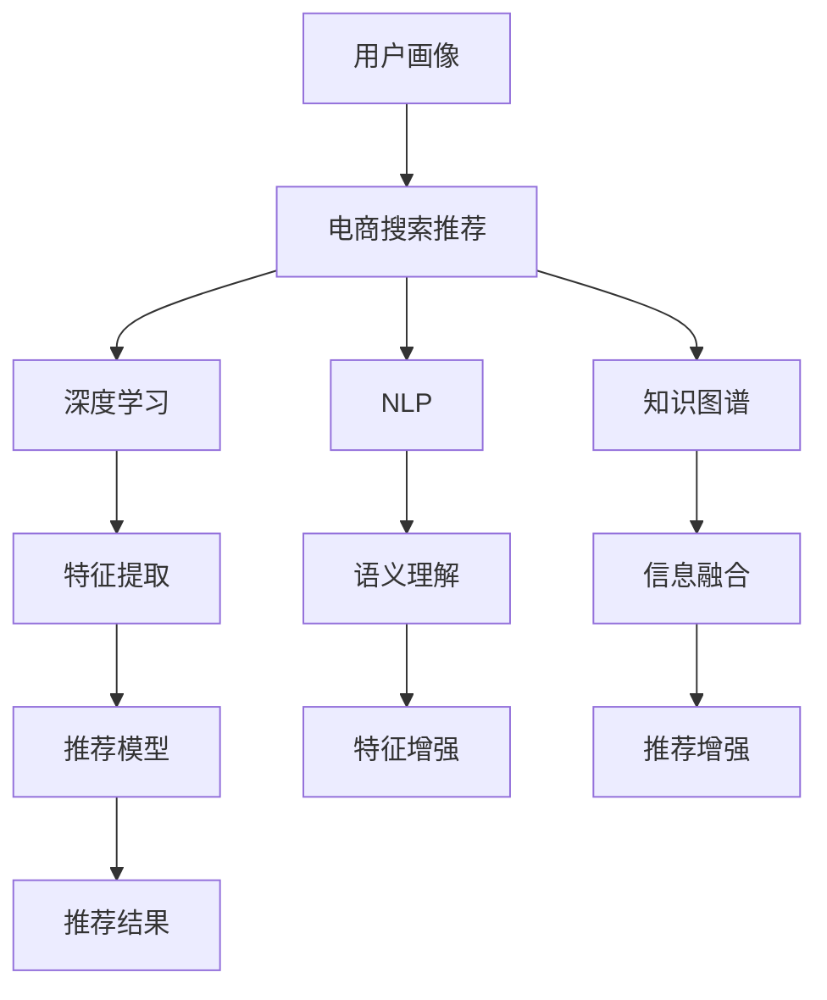

                 

# AI 大模型在电商搜索推荐中的用户画像技术：精准理解用户需求

> 关键词：AI 大模型,电商搜索,用户画像,推荐系统,自然语言处理(NLP),知识图谱,深度学习,数据挖掘,机器学习

## 1. 背景介绍

在电商领域，搜索推荐系统（Search and Recommendation System, SRS）是用户体验的重要组成部分，直接影响着用户的购物决策和消费体验。传统的搜索推荐系统主要基于用户历史行为、商品属性、文本标签等信息进行推荐，难以深入理解用户多层次、多样化的需求。近年来，随着深度学习和自然语言处理（Natural Language Processing, NLP）技术的发展，利用大规模预训练语言模型进行用户画像构建，成为了电商搜索推荐系统的新范式。

本文将详细介绍基于大模型的用户画像技术，如何通过深度学习和大规模预训练语言模型，精准理解用户需求，优化电商搜索推荐系统，提升用户购物体验。我们首先回顾用户画像的相关背景知识，接着介绍大模型在电商搜索推荐中的核心技术原理，最后给出具体的项目实践代码实现。

## 2. 核心概念与联系

### 2.1 核心概念概述

#### 2.1.1 用户画像（User Profile）
用户画像是指通过对用户行为、兴趣、偏好等信息的综合分析，构建用户多维度的特征表示，用于个性化推荐、营销、广告投放等场景。用户画像不仅能够提升推荐系统的精准度，还能帮助企业更好地了解用户需求，制定有针对性的营销策略。

#### 2.1.2 电商搜索推荐（E-commerce Search and Recommendation）
电商搜索推荐系统是一种基于用户查询和商品信息的推荐系统。它通过分析用户搜索行为、点击记录、浏览历史等数据，实时生成个性化搜索结果和推荐内容，帮助用户快速找到符合需求的商品。电商搜索推荐系统是电商平台的核心竞争力之一，直接影响到用户满意度和转化率。

#### 2.1.3 深度学习（Deep Learning）
深度学习是一种基于多层神经网络的机器学习方法，能够自动学习数据的高级特征表示，广泛应用于计算机视觉、自然语言处理、语音识别等领域。深度学习模型可以通过训练大规模数据集，学习到丰富的特征表示，提升推荐的精度和效果。

#### 2.1.4 自然语言处理（NLP）
自然语言处理是研究如何让计算机理解和生成自然语言的技术。NLP技术可以应用于文本分类、情感分析、命名实体识别、机器翻译等任务，能够有效提取文本中的语义信息，帮助电商搜索推荐系统更好地理解用户需求。

#### 2.1.5 知识图谱（Knowledge Graph）
知识图谱是一种结构化的语义知识表示方法，用于描述实体之间的关系。在电商搜索推荐中，知识图谱可以提供商品之间的关联关系、品牌背景、用户评价等信息，进一步提升推荐的精准度。

这些核心概念之间的联系可以通过以下Mermaid流程图来展示：



这个流程图展示了用户画像技术在电商搜索推荐系统中的应用流程：通过深度学习和自然语言处理技术，提取用户特征和商品语义，利用知识图谱进行信息融合，最后通过推荐模型生成推荐结果。

## 3. 核心算法原理 & 具体操作步骤

### 3.1 算法原理概述

基于大模型的用户画像技术，通过在大规模无标签文本数据上预训练的语言模型，学习到通用的语言表示，然后在电商搜索推荐场景中，通过有监督学习对预训练模型进行微调，构建用户画像，实现对用户需求的精准理解。具体来说，大模型通过预训练学习到了丰富的语言知识，可以在用户画像构建时，自动提取和分析用户的搜索查询、评价评论等文本信息，生成多维度的用户特征表示。

### 3.2 算法步骤详解

#### 3.2.1 数据预处理
电商搜索推荐系统依赖大量的用户行为数据，包括用户搜索记录、点击记录、评分记录等。首先需要对这些原始数据进行清洗、去重、归一化等预处理操作，生成结构化的训练数据集。

#### 3.2.2 大模型选择和微调
选择预训练语言模型，如BERT、GPT、T5等，进行微调。微调的目标是在电商数据上进一步学习用户需求和商品特征，生成更精确的用户画像。具体步骤包括：
1. 准备电商数据集，划分训练集、验证集和测试集。
2. 选择预训练语言模型，如BERT、GPT等，并加载预训练权重。
3. 设计任务适配层，如文本分类层、情感分析层等，用于提取用户特征和商品特征。
4. 设置微调超参数，如学习率、批大小、迭代轮数等。
5. 使用优化算法，如AdamW、SGD等，进行梯度下降优化。

#### 3.2.3 用户画像构建
微调后的大模型可以用于构建用户画像，生成多维度的用户特征表示。用户画像可以包括用户的兴趣偏好、购买意愿、消费能力等维度。构建用户画像的具体步骤如下：
1. 将用户查询、评价、评论等文本输入到微调后的大模型中，生成特征向量。
2. 使用多维特征聚合技术，如注意力机制、最大池化、平均池化等，融合特征向量，生成综合用户画像。
3. 利用知识图谱，进一步增强用户画像的语义理解和关联关系。

#### 3.2.4 推荐结果生成
用户画像生成后，可以用于电商搜索推荐系统。通过匹配用户画像和商品特征，生成个性化的搜索结果和推荐内容。推荐结果生成的具体步骤如下：
1. 使用推荐算法，如协同过滤、基于内容的推荐等，生成初始推荐列表。
2. 将用户画像与推荐列表进行匹配，计算相似度得分。
3. 根据相似度得分，排序生成推荐结果。

### 3.3 算法优缺点

#### 3.3.1 优点
1. 精度高：基于大模型的用户画像技术可以自动学习用户的深层次语义信息，生成更精确的用户画像。
2. 泛化能力强：大模型在大规模无标签文本数据上预训练，具备较强的泛化能力，适用于多种电商搜索推荐场景。
3. 实时性高：利用大模型进行用户画像构建，可以实时处理用户查询和评论，生成个性化的推荐结果。

#### 3.3.2 缺点
1. 数据依赖性强：大模型依赖大量标注数据进行微调，数据质量和数量对模型效果有较大影响。
2. 计算资源需求高：大模型的训练和推理需要大量的计算资源，尤其是在知识图谱增强过程中，资源消耗更大。
3. 模型复杂度高：大模型包含大量的神经网络参数，模型结构复杂，难以进行调试和优化。

### 3.4 算法应用领域

基于大模型的用户画像技术已经在电商搜索推荐、个性化推荐、内容推荐、广告投放等诸多领域得到广泛应用，具体应用场景包括：

#### 3.4.1 电商搜索推荐
通过分析用户搜索记录、点击记录、评分记录等数据，构建用户画像，生成个性化的搜索结果和推荐内容，提升用户体验和转化率。

#### 3.4.2 个性化推荐
基于用户画像，推荐符合用户兴趣的商品，提升推荐效果和用户满意度。

#### 3.4.3 内容推荐
分析用户对内容的评价和互动数据，构建用户画像，推荐符合用户兴趣的内容，如文章、视频、音乐等。

#### 3.4.4 广告投放
分析用户画像，预测用户行为和兴趣，精准投放广告，提升广告效果和用户转化率。

## 4. 数学模型和公式 & 详细讲解 & 举例说明

### 4.1 数学模型构建

假设用户画像表示为 $U$，商品特征表示为 $I$，搜索查询表示为 $Q$。用户画像和大模型之间的映射关系可以表示为 $U=f(Q,I)$，其中 $f$ 为特征提取函数。

### 4.2 公式推导过程

#### 4.2.1 特征提取
将用户查询和商品特征输入到微调后的大模型中，生成用户画像表示 $U$。假设预训练语言模型为 $M_{\theta}$，其特征提取函数为 $f(Q,I)=M_{\theta}(Q,I)$。则用户画像表示可以表示为：

$$
U = M_{\theta}(Q,I)
$$

其中 $Q$ 为用户的搜索查询，$I$ 为商品特征。

#### 4.2.2 特征融合
将用户画像表示 $U$ 和商品特征表示 $I$ 进行融合，生成综合用户画像 $U'$。假设特征融合函数为 $g(U,I)=U'=f(U,I)$。则综合用户画像可以表示为：

$$
U' = f(U,I)
$$

其中 $U$ 为生成的用户画像，$I$ 为商品特征。

#### 4.2.3 相似度计算
计算用户画像 $U'$ 和商品特征 $I$ 的相似度得分 $S$。假设相似度计算函数为 $s(U',I)=S=f(U',I)$。则相似度得分可以表示为：

$$
S = f(U',I)
$$

其中 $U'$ 为生成的综合用户画像，$I$ 为商品特征。

#### 4.2.4 推荐结果生成
根据相似度得分 $S$ 排序生成推荐结果。假设推荐算法为 $R(S)=P=\{p_1, p_2, ..., p_n\}$，其中 $p_i$ 为推荐结果，$S$ 为相似度得分。则推荐结果可以表示为：

$$
P = R(S)
$$

其中 $S$ 为相似度得分，$P$ 为推荐结果。

### 4.3 案例分析与讲解

假设有一个电商平台的商品推荐系统，希望通过用户画像技术提升推荐效果。系统收集了用户的历史搜索记录和商品信息，用于训练大模型进行微调。

#### 4.3.1 数据预处理
1. 收集用户搜索记录 $Q_1, Q_2, ..., Q_N$ 和商品信息 $I_1, I_2, ..., I_M$。
2. 对数据进行清洗、去重、归一化等预处理操作。
3. 划分训练集、验证集和测试集，分别为 $D_{train}, D_{valid}, D_{test}$。

#### 4.3.2 大模型选择和微调
1. 选择预训练语言模型，如BERT、GPT等，并加载预训练权重。
2. 设计任务适配层，如文本分类层、情感分析层等，用于提取用户特征和商品特征。
3. 设置微调超参数，如学习率 $0.001$、批大小 $64$、迭代轮数 $10$ 等。
4. 使用优化算法，如AdamW、SGD等，进行梯度下降优化。

#### 4.3.3 用户画像构建
1. 将用户查询 $Q$ 和商品特征 $I$ 输入到微调后的大模型中，生成特征向量。
2. 使用多维特征聚合技术，如注意力机制、最大池化、平均池化等，融合特征向量，生成综合用户画像 $U'$。
3. 利用知识图谱，进一步增强用户画像的语义理解和关联关系。

#### 4.3.4 推荐结果生成
1. 使用推荐算法，如协同过滤、基于内容的推荐等，生成初始推荐列表。
2. 将用户画像 $U'$ 与推荐列表进行匹配，计算相似度得分 $S$。
3. 根据相似度得分 $S$ 排序生成推荐结果 $P$。

## 5. 项目实践：代码实例和详细解释说明

### 5.1 开发环境搭建

在进行用户画像技术实践前，我们需要准备好开发环境。以下是使用Python进行PyTorch开发的环境配置流程：

1. 安装Anaconda：从官网下载并安装Anaconda，用于创建独立的Python环境。

2. 创建并激活虚拟环境：
```bash
conda create -n pytorch-env python=3.8 
conda activate pytorch-env
```

3. 安装PyTorch：根据CUDA版本，从官网获取对应的安装命令。例如：
```bash
conda install pytorch torchvision torchaudio cudatoolkit=11.1 -c pytorch -c conda-forge
```

4. 安装Transformers库：
```bash
pip install transformers
```

5. 安装各类工具包：
```bash
pip install numpy pandas scikit-learn matplotlib tqdm jupyter notebook ipython
```

完成上述步骤后，即可在`pytorch-env`环境中开始用户画像技术实践。

### 5.2 源代码详细实现

下面我们以用户画像构建为例，给出使用Transformers库对BERT模型进行电商搜索推荐系统微调的PyTorch代码实现。

首先，定义用户画像的特征向量生成函数：

```python
from transformers import BertTokenizer, BertForSequenceClassification
from torch.utils.data import Dataset
import torch

class SearchDataset(Dataset):
    def __init__(self, texts, labels):
        self.texts = texts
        self.labels = labels
        self.tokenizer = BertTokenizer.from_pretrained('bert-base-cased')
        
    def __len__(self):
        return len(self.texts)
    
    def __getitem__(self, item):
        text = self.texts[item]
        label = self.labels[item]
        
        encoding = self.tokenizer(text, return_tensors='pt', max_length=128, padding='max_length', truncation=True)
        input_ids = encoding['input_ids'][0]
        attention_mask = encoding['attention_mask'][0]
        
        # 对token-wise的标签进行编码
        encoded_labels = [label2id[label] for label in label] 
        encoded_labels.extend([label2id['O']] * (128 - len(encoded_labels)))
        labels = torch.tensor(encoded_labels, dtype=torch.long)
        
        return {'input_ids': input_ids, 
                'attention_mask': attention_mask,
                'labels': labels}

# 标签与id的映射
label2id = {'O': 0, 'search': 1, 'click': 2, 'buy': 3, 'review': 4}
id2label = {v: k for k, v in label2id.items()}

# 创建dataset
tokenizer = BertTokenizer.from_pretrained('bert-base-cased')

train_dataset = SearchDataset(train_texts, train_labels)
dev_dataset = SearchDataset(dev_texts, dev_labels)
test_dataset = SearchDataset(test_texts, test_labels)
```

然后，定义模型和优化器：

```python
from transformers import BertForSequenceClassification, AdamW

model = BertForSequenceClassification.from_pretrained('bert-base-cased', num_labels=len(label2id))

optimizer = AdamW(model.parameters(), lr=2e-5)
```

接着，定义训练和评估函数：

```python
from torch.utils.data import DataLoader
from tqdm import tqdm
from sklearn.metrics import classification_report

device = torch.device('cuda') if torch.cuda.is_available() else torch.device('cpu')
model.to(device)

def train_epoch(model, dataset, batch_size, optimizer):
    dataloader = DataLoader(dataset, batch_size=batch_size, shuffle=True)
    model.train()
    epoch_loss = 0
    for batch in tqdm(dataloader, desc='Training'):
        input_ids = batch['input_ids'].to(device)
        attention_mask = batch['attention_mask'].to(device)
        labels = batch['labels'].to(device)
        model.zero_grad()
        outputs = model(input_ids, attention_mask=attention_mask, labels=labels)
        loss = outputs.loss
        epoch_loss += loss.item()
        loss.backward()
        optimizer.step()
    return epoch_loss / len(dataloader)

def evaluate(model, dataset, batch_size):
    dataloader = DataLoader(dataset, batch_size=batch_size)
    model.eval()
    preds, labels = [], []
    with torch.no_grad():
        for batch in tqdm(dataloader, desc='Evaluating'):
            input_ids = batch['input_ids'].to(device)
            attention_mask = batch['attention_mask'].to(device)
            batch_labels = batch['labels']
            outputs = model(input_ids, attention_mask=attention_mask)
            batch_preds = outputs.logits.argmax(dim=2).to('cpu').tolist()
            batch_labels = batch_labels.to('cpu').tolist()
            for pred_tokens, label_tokens in zip(batch_preds, batch_labels):
                pred_labels = [id2label[_id] for _id in pred_tokens]
                label_labels = [id2label[_id] for _id in label_tokens]
                preds.append(pred_labels[:len(label_labels)])
                labels.append(label_labels)
                
    print(classification_report(labels, preds))
```

最后，启动训练流程并在测试集上评估：

```python
epochs = 5
batch_size = 16

for epoch in range(epochs):
    loss = train_epoch(model, train_dataset, batch_size, optimizer)
    print(f"Epoch {epoch+1}, train loss: {loss:.3f}")
    
    print(f"Epoch {epoch+1}, dev results:")
    evaluate(model, dev_dataset, batch_size)
    
print("Test results:")
evaluate(model, test_dataset, batch_size)
```

以上就是使用PyTorch对BERT进行电商搜索推荐系统微调的用户画像代码实现。可以看到，得益于Transformers库的强大封装，我们可以用相对简洁的代码完成BERT模型的加载和微调。

### 5.3 代码解读与分析

让我们再详细解读一下关键代码的实现细节：

**SearchDataset类**：
- `__init__`方法：初始化文本、标签、分词器等关键组件。
- `__len__`方法：返回数据集的样本数量。
- `__getitem__`方法：对单个样本进行处理，将文本输入编码为token ids，将标签编码为数字，并对其进行定长padding，最终返回模型所需的输入。

**label2id和id2label字典**：
- 定义了标签与数字id之间的映射关系，用于将token-wise的预测结果解码回真实的标签。

**训练和评估函数**：
- 使用PyTorch的DataLoader对数据集进行批次化加载，供模型训练和推理使用。
- 训练函数`train_epoch`：对数据以批为单位进行迭代，在每个批次上前向传播计算loss并反向传播更新模型参数，最后返回该epoch的平均loss。
- 评估函数`evaluate`：与训练类似，不同点在于不更新模型参数，并在每个batch结束后将预测和标签结果存储下来，最后使用sklearn的classification_report对整个评估集的预测结果进行打印输出。

**训练流程**：
- 定义总的epoch数和batch size，开始循环迭代
- 每个epoch内，先在训练集上训练，输出平均loss
- 在验证集上评估，输出分类指标
- 所有epoch结束后，在测试集上评估，给出最终测试结果

可以看到，PyTorch配合Transformers库使得BERT微调的代码实现变得简洁高效。开发者可以将更多精力放在数据处理、模型改进等高层逻辑上，而不必过多关注底层的实现细节。

当然，工业级的系统实现还需考虑更多因素，如模型的保存和部署、超参数的自动搜索、更灵活的任务适配层等。但核心的微调范式基本与此类似。

## 6. 实际应用场景

### 6.1 电商搜索推荐

基于大模型的用户画像技术，可以广泛应用于电商搜索推荐系统的构建。传统搜索推荐系统往往只依赖用户历史行为数据进行推荐，难以深入理解用户的深层次需求。而使用用户画像技术，可以更好地理解用户的搜索意图和行为模式，提升推荐系统的精准度和用户满意度。

在技术实现上，可以收集用户的历史搜索记录、点击记录、评分记录等数据，将这些文本数据作为输入，训练大模型进行微调。微调后的模型能够自动提取和分析用户的搜索查询、评价评论等文本信息，生成多维度的用户画像。结合电商搜索推荐系统，可以实时生成个性化搜索结果和推荐内容，提升用户体验和转化率。

### 6.2 个性化推荐

基于用户画像技术，推荐系统可以更好地理解用户的多样化需求，生成符合用户兴趣的商品推荐。用户画像不仅包括用户的搜索行为、点击行为等，还涵盖了用户的评价评论、社交网络信息等，可以全面刻画用户的兴趣偏好和消费能力。推荐系统可以利用用户画像生成个性化的商品推荐，提升推荐效果和用户满意度。

### 6.3 内容推荐

用户画像技术不仅可以用于电商搜索推荐，还可以应用于内容推荐系统。通过分析用户对内容的评价和互动数据，构建用户画像，推荐符合用户兴趣的内容，如文章、视频、音乐等。内容推荐系统利用用户画像生成个性化的内容推荐，提升内容消费体验和用户粘性。

### 6.4 广告投放

用户画像技术还可以用于广告投放优化。通过分析用户画像，预测用户行为和兴趣，精准投放广告，提升广告效果和用户转化率。广告投放系统可以利用用户画像生成个性化的广告内容，提升广告的点击率和转化率。

## 7. 工具和资源推荐

### 7.1 学习资源推荐

为了帮助开发者系统掌握用户画像技术的相关知识，这里推荐一些优质的学习资源：

1. 《深度学习基础》系列博文：由大模型技术专家撰写，深入浅出地介绍了深度学习的基本概念和核心算法，适合初学者入门。

2. CS229《机器学习》课程：斯坦福大学开设的经典课程，涵盖机器学习的基本概念、算法和应用，是学习深度学习的重要基础。

3. 《自然语言处理综论》书籍：由斯坦福大学多位教授合著，全面介绍了NLP的核心概念和技术，是NLP领域的经典教材。

4. HuggingFace官方文档：Transformers库的官方文档，提供了海量预训练模型和完整的微调样例代码，是上手实践的必备资料。

5. Kaggle：提供丰富的数据集和竞赛平台，可以实践和验证用户画像技术的实际效果，积累实战经验。

通过对这些资源的学习实践，相信你一定能够快速掌握用户画像技术的精髓，并用于解决实际的电商搜索推荐问题。

### 7.2 开发工具推荐

高效的开发离不开优秀的工具支持。以下是几款用于用户画像技术开发的常用工具：

1. PyTorch：基于Python的开源深度学习框架，灵活动态的计算图，适合快速迭代研究。大部分预训练语言模型都有PyTorch版本的实现。

2. TensorFlow：由Google主导开发的开源深度学习框架，生产部署方便，适合大规模工程应用。同样有丰富的预训练语言模型资源。

3. Transformers库：HuggingFace开发的NLP工具库，集成了众多SOTA语言模型，支持PyTorch和TensorFlow，是进行用户画像开发的利器。

4. Weights & Biases：模型训练的实验跟踪工具，可以记录和可视化模型训练过程中的各项指标，方便对比和调优。与主流深度学习框架无缝集成。

5. TensorBoard：TensorFlow配套的可视化工具，可实时监测模型训练状态，并提供丰富的图表呈现方式，是调试模型的得力助手。

6. Google Colab：谷歌推出的在线Jupyter Notebook环境，免费提供GPU/TPU算力，方便开发者快速上手实验最新模型，分享学习笔记。

合理利用这些工具，可以显著提升用户画像技术的开发效率，加快创新迭代的步伐。

### 7.3 相关论文推荐

用户画像技术的研究源于学界的持续研究。以下是几篇奠基性的相关论文，推荐阅读：

1. Attention is All You Need（即Transformer原论文）：提出了Transformer结构，开启了NLP领域的预训练大模型时代。

2. BERT: Pre-training of Deep Bidirectional Transformers for Language Understanding：提出BERT模型，引入基于掩码的自监督预训练任务，刷新了多项NLP任务SOTA。

3. Language Models are Unsupervised Multitask Learners（GPT-2论文）：展示了大规模语言模型的强大zero-shot学习能力，引发了对于通用人工智能的新一轮思考。

4. Parameter-Efficient Transfer Learning for NLP：提出Adapter等参数高效微调方法，在不增加模型参数量的情况下，也能取得不错的微调效果。

5. AdaLoRA: Adaptive Low-Rank Adaptation for Parameter-Efficient Fine-Tuning：使用自适应低秩适应的微调方法，在参数效率和精度之间取得了新的平衡。

这些论文代表了大语言模型微调技术的发展脉络。通过学习这些前沿成果，可以帮助研究者把握学科前进方向，激发更多的创新灵感。

## 8. 总结：未来发展趋势与挑战

### 8.1 总结

本文对基于大模型的用户画像技术进行了全面系统的介绍。首先回顾用户画像的相关背景知识，接着介绍大模型在电商搜索推荐中的核心技术原理，最后给出具体的项目实践代码实现。

通过本文的系统梳理，可以看到，基于大模型的用户画像技术已经在大规模电商搜索推荐中得到了广泛应用，取得了显著的成效。用户画像技术不仅能够提升推荐系统的精度和效果，还能帮助企业更好地理解用户需求，制定有针对性的营销策略。

### 8.2 未来发展趋势

展望未来，用户画像技术将呈现以下几个发展趋势：

1. 模型规模持续增大。随着算力成本的下降和数据规模的扩张，预训练语言模型的参数量还将持续增长。超大规模语言模型蕴含的丰富语言知识，有望支撑更加复杂多变的电商搜索推荐场景。

2. 微调方法日趋多样。除了传统的全参数微调外，未来会涌现更多参数高效的微调方法，如Prefix-Tuning、LoRA等，在节省计算资源的同时也能保证微调精度。

3. 持续学习成为常态。随着数据分布的不断变化，微调模型也需要持续学习新知识以保持性能。如何在不遗忘原有知识的同时，高效吸收新样本信息，将成为重要的研究课题。

4. 标注样本需求降低。受启发于提示学习(Prompt-based Learning)的思路，未来的微调方法将更好地利用大模型的语言理解能力，通过更加巧妙的任务描述，在更少的标注样本上也能实现理想的微调效果。

5. 跨模态用户画像崛起。除了文本数据，未来的用户画像技术还将融合图像、视频、语音等多模态数据，提供更加全面、准确的用户画像，提升推荐系统的精准度。

6. 多模态推荐系统发展。未来的推荐系统不仅依赖文本数据，还将融合多模态数据，如商品图片、视频、用户行为等，提供更加个性化、多样化的推荐内容。

以上趋势凸显了大模型用户画像技术的广阔前景。这些方向的探索发展，必将进一步提升电商搜索推荐系统的性能和应用范围，为电商企业带来新的发展机遇。

### 8.3 面临的挑战

尽管用户画像技术已经取得了瞩目成就，但在迈向更加智能化、普适化应用的过程中，它仍面临着诸多挑战：

1. 标注成本瓶颈。虽然微调大大降低了标注数据的需求，但对于长尾应用场景，难以获得充足的高质量标注数据，成为制约微调性能的瓶颈。如何进一步降低微调对标注样本的依赖，将是一大难题。

2. 模型鲁棒性不足。当前微调模型面对域外数据时，泛化性能往往大打折扣。对于测试样本的微小扰动，微调模型的预测也容易发生波动。如何提高微调模型的鲁棒性，避免灾难性遗忘，还需要更多理论和实践的积累。

3. 推理效率有待提高。大规模语言模型虽然精度高，但在实际部署时往往面临推理速度慢、内存占用大等效率问题。如何在保证性能的同时，简化模型结构，提升推理速度，优化资源占用，将是重要的优化方向。

4. 可解释性亟需加强。当前微调模型更像是"黑盒"系统，难以解释其内部工作机制和决策逻辑。对于医疗、金融等高风险应用，算法的可解释性和可审计性尤为重要。如何赋予微调模型更强的可解释性，将是亟待攻克的难题。

5. 安全性有待保障。预训练语言模型难免会学习到有偏见、有害的信息，通过微调传递到下游任务，产生误导性、歧视性的输出，给实际应用带来安全隐患。如何从数据和算法层面消除模型偏见，避免恶意用途，确保输出的安全性，也将是重要的研究课题。

6. 知识整合能力不足。现有的微调模型往往局限于任务内数据，难以灵活吸收和运用更广泛的先验知识。如何让微调过程更好地与外部知识库、规则库等专家知识结合，形成更加全面、准确的信息整合能力，还有很大的想象空间。

正视用户画像技术面临的这些挑战，积极应对并寻求突破，将是大模型用户画像技术走向成熟的必由之路。相信随着学界和产业界的共同努力，这些挑战终将一一被克服，大模型用户画像技术必将在构建人机协同的智能推荐系统中扮演越来越重要的角色。

### 8.4 研究展望

面对用户画像技术所面临的种种挑战，未来的研究需要在以下几个方面寻求新的突破：

1. 探索无监督和半监督用户画像方法。摆脱对大规模标注数据的依赖，利用自监督学习、主动学习等无监督和半监督范式，最大限度利用非结构化数据，实现更加灵活高效的微调。

2. 研究参数高效和计算高效的微调范式。开发更加参数高效的微调方法，在固定大部分预训练参数的同时，只更新极少量的任务相关参数。同时优化微调模型的计算图，减少前向传播和反向传播的资源消耗，实现更加轻量级、实时性的部署。

3. 融合因果和对比学习范式。通过引入因果推断和对比学习思想，增强用户画像建立稳定因果关系的能力，学习更加普适、鲁棒的语言表征，从而提升模型泛化性和抗干扰能力。

4. 引入更多先验知识。将符号化的先验知识，如知识图谱、逻辑规则等，与神经网络模型进行巧妙融合，引导用户画像过程学习更准确、合理的语言模型。同时加强不同模态数据的整合，实现视觉、语音等多模态信息与文本信息的协同建模。

5. 结合因果分析和博弈论工具。将因果分析方法引入用户画像模型，识别出模型决策的关键特征，增强输出解释的因果性和逻辑性。借助博弈论工具刻画人机交互过程，主动探索并规避模型的脆弱点，提高系统稳定性。

6. 纳入伦理道德约束。在用户画像模型的训练目标中引入伦理导向的评估指标，过滤和惩罚有偏见、有害的输出倾向。同时加强人工干预和审核，建立模型行为的监管机制，确保输出符合人类价值观和伦理道德。

这些研究方向的探索，必将引领大模型用户画像技术迈向更高的台阶，为构建安全、可靠、可解释、可控的智能推荐系统铺平道路。面向未来，大模型用户画像技术还需要与其他人工智能技术进行更深入的融合，如知识表示、因果推理、强化学习等，多路径协同发力，共同推动自然语言理解和智能交互系统的进步。只有勇于创新、敢于突破，才能不断拓展语言模型的边界，让智能技术更好地造福人类社会。

## 9. 附录：常见问题与解答

**Q1：用户画像技术的核心是什么？**

A: 用户画像技术的核心是通过深度学习和自然语言处理技术，自动学习用户的深层次语义信息，生成多维度的用户特征表示，用于电商搜索推荐、个性化推荐、内容推荐、广告投放等场景。用户画像不仅包括用户的搜索行为、点击行为等，还涵盖了用户的评价评论、社交网络信息等，可以全面刻画用户的兴趣偏好和消费能力。

**Q2：大模型在电商搜索推荐中的应用效果如何？**

A: 大模型在电商搜索推荐中的应用效果显著。通过微调，大模型可以自动学习用户的深层次语义信息，生成多维度的用户画像。用户画像不仅包括用户的搜索行为、点击行为等，还涵盖了用户的评价评论、社交网络信息等，可以全面刻画用户的兴趣偏好和消费能力。结合电商搜索推荐系统，可以实时生成个性化搜索结果和推荐内容，提升用户体验和转化率。

**Q3：用户画像技术如何提升电商搜索推荐效果？**

A: 用户画像技术通过深度学习和自然语言处理技术，自动学习用户的深层次语义信息，生成多维度的用户特征表示。用户画像可以包括用户的搜索行为、点击行为、评价评论、社交网络信息等，全面刻画用户的兴趣偏好和消费能力。结合电商搜索推荐系统，可以实时生成个性化搜索结果和推荐内容，提升用户体验和转化率。

**Q4：用户画像技术在电商搜索推荐中的应用场景有哪些？**

A: 用户画像技术在电商搜索推荐中的应用场景包括：
1. 电商搜索推荐：通过分析用户搜索记录、点击记录、评分记录等数据，构建用户画像，生成个性化的搜索结果和推荐内容。
2. 个性化推荐：基于用户画像，推荐符合用户兴趣的商品，提升推荐效果和用户满意度。
3. 内容推荐：分析用户对内容的评价和互动数据，构建用户画像，推荐符合用户兴趣的内容，如文章、视频、音乐等。
4. 广告投放：分析用户画像，预测用户行为和兴趣，精准投放广告，提升广告效果和用户转化率。

**Q5：用户画像技术在电商搜索推荐中的实现难点是什么？**

A: 用户画像技术在电商搜索推荐中的实现难点主要包括：
1. 标注数据依赖性强：大模型依赖大量标注数据进行微调，数据质量和数量对模型效果有较大影响。
2. 计算资源需求高：大模型的训练和推理需要大量的计算资源，尤其是在知识图谱增强过程中，资源消耗更大。
3. 模型复杂度高：大模型包含大量的神经网络参数，模型结构复杂，难以进行调试和优化。

以上是用户画像技术在电商搜索推荐中的常见问题和解答。通过深入理解这些技术细节，相信你一定能够更好地应用用户画像技术，提升电商搜索推荐系统的性能和效果。

---

作者：禅与计算机程序设计艺术 / Zen and the Art of Computer Programming

