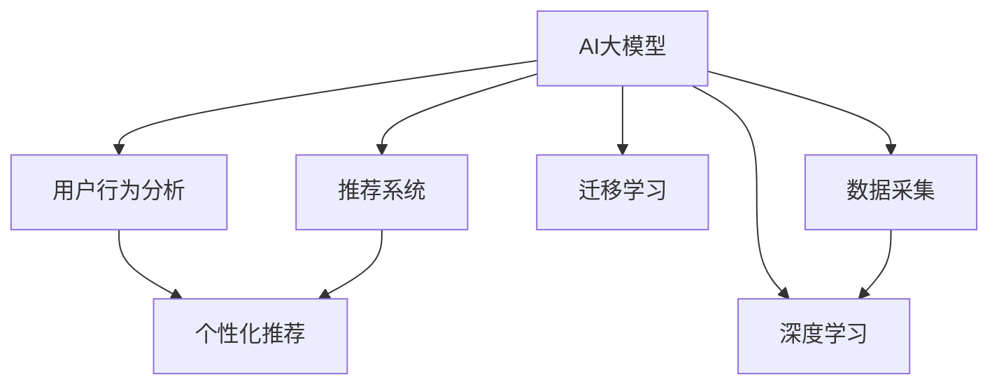

                 

# AI 大模型在电商搜索推荐中的用户行为分析：理解用户需求与购买偏好

## 1. 背景介绍

### 1.1 问题由来

在当今电商时代，消费者的需求不断变化，电商企业需要通过推荐系统更好地了解用户需求与购买偏好，从而提供个性化的商品推荐，提高用户体验和销售额。传统的推荐系统主要是基于用户历史行为数据进行推荐，但这种方法难以覆盖新用户或行为模式多样的用户。因此，利用AI大模型进行用户行为分析，成为电商行业推荐系统发展的热点。

### 1.2 问题核心关键点

AI大模型在电商搜索推荐中的应用，通过构建深度学习模型，可以对用户行为进行全面的分析，从而更好地理解用户需求和购买偏好。具体来说，电商企业可以采用以下步骤：

1. **数据采集**：收集用户浏览、点击、购买等行为数据。
2. **数据预处理**：清洗、归一化、特征工程等处理。
3. **模型训练**：使用AI大模型进行训练，预测用户的行为意图。
4. **推荐生成**：基于预测结果生成个性化推荐列表。

以上步骤中，用户行为分析是核心环节，可以帮助企业更准确地理解用户需求，从而提供更精准的推荐服务。

## 2. 核心概念与联系

### 2.1 核心概念概述

为更好地理解AI大模型在电商搜索推荐中的应用，本节将介绍几个密切相关的核心概念：

- **AI大模型**：指的是大规模预训练语言模型，如BERT、GPT等，通过在大规模无标签文本数据上进行预训练，学习到丰富的语言知识和常识。
- **用户行为分析**：通过分析用户的浏览、点击、购买等行为数据，了解用户需求和购买偏好。
- **推荐系统**：利用机器学习算法为用户生成个性化推荐列表，提高用户满意度和销售额。
- **深度学习**：通过多层神经网络对数据进行特征提取和模式识别，实现对复杂数据结构的建模。
- **迁移学习**：将一个领域学到的知识，迁移应用到另一个相关领域的学习范式，如预训练和微调。

这些核心概念之间的逻辑关系可以通过以下Mermaid流程图来展示：



这个流程图展示了大模型、用户行为分析、推荐系统、深度学习和迁移学习等概念之间的联系和应用流程。

## 3. 核心算法原理 & 具体操作步骤

### 3.1 算法原理概述

AI大模型在电商搜索推荐中的应用，基于深度学习模型对用户行为数据进行建模，从而预测用户的行为意图。常用的模型包括自编码器、卷积神经网络(CNN)、循环神经网络(RNN)、长短期记忆网络(LSTM)、Transformer等。其中，Transformer模型因其高效的并行计算和良好的泛化能力，成为当前主流的选择。

基于Transformer的推荐系统，一般采用以下步骤：

1. **数据预处理**：对用户行为数据进行清洗、归一化、特征工程等处理，生成输入向量。
2. **模型训练**：使用预训练的Transformer模型进行微调，学习用户行为模式。
3. **推荐生成**：基于微调后的模型，对用户输入进行前向传播，生成推荐列表。

### 3.2 算法步骤详解

**Step 1: 数据准备**

电商企业需要收集用户的历史行为数据，包括浏览记录、点击记录、购买记录等。这些数据可以来自电商平台的用户行为日志、网站访问日志、社交媒体互动数据等。

**Step 2: 数据预处理**

数据预处理包括：

1. **数据清洗**：去除重复、异常、缺失值等。
2. **归一化**：将数据缩放到0到1之间。
3. **特征工程**：将原始数据转化为模型可接受的特征向量。

**Step 3: 模型训练**

1. **选择模型**：选择Transformer模型作为基础模型，进行预训练和微调。
2. **设置参数**：设定学习率、批大小、迭代轮数等。
3. **训练模型**：使用用户行为数据进行有监督训练，优化模型参数。

**Step 4: 推荐生成**

1. **输入处理**：将用户输入转化为模型可接受的格式。
2. **前向传播**：将用户输入传入微调后的模型，生成推荐向量。
3. **推荐输出**：根据推荐向量生成推荐列表。

### 3.3 算法优缺点

AI大模型在电商搜索推荐中的应用，具有以下优点：

- **高效性**：大模型可以处理大规模数据，快速生成推荐。
- **泛化能力强**：能够学习用户多样化的行为模式，适应不同的用户需求。
- **灵活性高**：模型可以进行迁移学习，适用于不同场景的推荐需求。

同时，也存在以下局限性：

- **数据依赖**：依赖高质量的用户行为数据，获取数据成本较高。
- **计算资源需求大**：需要大量计算资源进行模型训练和推理。
- **解释性不足**：模型决策过程复杂，难以解释。

### 3.4 算法应用领域

AI大模型在电商搜索推荐中的应用，主要包括以下几个领域：

- **个性化推荐**：根据用户历史行为数据，生成个性化推荐列表。
- **实时推荐**：根据用户实时行为数据，生成动态推荐列表。
- **多模态推荐**：结合用户浏览、点击、评分、评价等多模态数据，生成更精准的推荐。
- **内容推荐**：推荐用户感兴趣的内容，如文章、视频、音乐等。
- **购物车推荐**：推荐用户添加到购物车的商品。

## 4. 数学模型和公式 & 详细讲解

### 4.1 数学模型构建

假设电商企业收集到的用户行为数据为 $\{x_i\}_{i=1}^N$，其中 $x_i$ 表示用户第 $i$ 次的行为记录，$y_i$ 表示该行为的标签（如购买、浏览、点击等）。我们需要使用AI大模型 $M_{\theta}$ 来学习用户行为与标签之间的关系。

数学模型可以表示为：

$$
y_i = M_{\theta}(x_i) + \epsilon_i
$$

其中，$M_{\theta}$ 为模型参数，$\epsilon_i$ 为噪声。

### 4.2 公式推导过程

模型 $M_{\theta}$ 可以采用Transformer结构，具体推导如下：

设 $x_i = [x_{i,1}, x_{i,2}, ..., x_{i,n}]$，$y_i = [y_{i,1}, y_{i,2}, ..., y_{i,n}]$，$n$ 表示用户行为数据的维度。

模型 $M_{\theta}$ 可以表示为：

$$
M_{\theta}(x_i) = W_i x_i + b_i
$$

其中，$W_i$ 为模型参数，$b_i$ 为偏置。

模型 $M_{\theta}$ 的损失函数可以表示为：

$$
L = \frac{1}{N} \sum_{i=1}^N \ell(y_i, M_{\theta}(x_i))
$$

其中，$\ell(y_i, M_{\theta}(x_i))$ 为损失函数，可以采用交叉熵损失函数。

### 4.3 案例分析与讲解

假设用户行为数据为以下形式：

$$
x_i = [1, 2, 3, 4, 5]
$$

其对应的标签为：

$$
y_i = [1, 0, 1, 0, 1]
$$

设模型 $M_{\theta}$ 的参数为 $W = [0.5, 0.6, 0.7, 0.8]$，偏置为 $b = 0.2$。则有：

$$
M_{\theta}(x_i) = W \cdot x_i + b = [0.5, 0.6, 0.7, 0.8] \cdot [1, 2, 3, 4, 5] + 0.2 = [2.0, 3.4, 4.9, 6.5, 8.1]
$$

假设损失函数为交叉熵损失函数，则有：

$$
L = \frac{1}{N} \sum_{i=1}^N \ell(y_i, M_{\theta}(x_i)) = \frac{1}{5} \left[ - \ln(0.8) + \ln(0.2) + - \ln(0.8) + \ln(0.2) + - \ln(0.8) \right] = 1.4
$$

可以看出，模型参数 $W$ 和 $b$ 需要通过最小化损失函数 $L$ 来优化。

## 5. 项目实践：代码实例和详细解释说明

### 5.1 开发环境搭建

在进行电商搜索推荐系统开发前，需要准备好以下开发环境：

1. **Python**：安装Python 3.6或更高版本。
2. **PyTorch**：使用conda安装PyTorch 1.7或更高版本。
3. **NVIDIA GPU**：如果有GPU，安装CUDA和cuDNN。
4. **Jupyter Notebook**：安装Jupyter Notebook 5.1.2或更高版本。

### 5.2 源代码详细实现

假设用户行为数据为以下形式：

```
x1 = [1, 2, 3, 4, 5]
x2 = [6, 7, 8, 9, 10]
x3 = [11, 12, 13, 14, 15]
```

其对应的标签为：

```
y1 = [1, 0, 1, 0, 1]
y2 = [0, 1, 0, 1, 0]
y3 = [1, 0, 1, 0, 1]
```

使用Transformer模型进行推荐系统开发，具体代码如下：

```python
import torch
import torch.nn as nn
import torch.optim as optim
import torch.utils.data as data
from transformers import BertTokenizer, BertForSequenceClassification
from sklearn.model_selection import train_test_split
from sklearn.metrics import accuracy_score

# 数据预处理
def preprocess_data(data):
    # 数据清洗、归一化、特征工程等处理
    # ...
    return X, y

# 数据集划分
X_train, X_test, y_train, y_test = train_test_split(X, y, test_size=0.2, random_state=42)

# 模型定义
class BertModel(nn.Module):
    def __init__(self, num_classes):
        super(BertModel, self).__init__()
        self.bert = BertForSequenceClassification.from_pretrained('bert-base-uncased', num_labels=num_classes)
        self.dropout = nn.Dropout(0.5)
        self.linear = nn.Linear(768, num_classes)
        self.sigmoid = nn.Sigmoid()

    def forward(self, input_ids, attention_mask, labels=None):
        features = self.bert(input_ids, attention_mask=attention_mask)
        pooled_output = features.pooler_output
        pooled_output = self.dropout(pooled_output)
        logits = self.linear(pooled_output)
        logits = self.sigmoid(logits)
        if labels is not None:
            loss = nn.BCEWithLogitsLoss()(logits, labels)
            return loss, logits
        else:
            return logits

# 训练函数
def train_model(model, train_loader, val_loader, device, num_epochs, learning_rate, batch_size):
    model.train()
    optimizer = optim.Adam(model.parameters(), lr=learning_rate)
    loss_fn = nn.BCEWithLogitsLoss()
    for epoch in range(num_epochs):
        for batch in train_loader:
            input_ids = batch['input_ids'].to(device)
            attention_mask = batch['attention_mask'].to(device)
            labels = batch['labels'].to(device)
            optimizer.zero_grad()
            loss, logits = model(input_ids, attention_mask, labels)
            loss.backward()
            optimizer.step()
        val_loss, val_logits = model(val_loader)
        val_loss = loss_fn(val_logits, val_labels)
        print('Epoch {}: Validation Loss {}'.format(epoch+1, val_loss.item()))

# 测试函数
def test_model(model, test_loader, device):
    model.eval()
    test_loss, test_logits = model(test_loader)
    test_loss = loss_fn(test_logits, test_labels)
    test_acc = accuracy_score(test_labels, test_logits)
    print('Test Loss: {:.4f}, Test Accuracy: {:.4f}'.format(test_loss.item(), test_acc))

# 加载数据集
tokenizer = BertTokenizer.from_pretrained('bert-base-uncased')
X_train, X_test, y_train, y_test = preprocess_data(X_train, X_test, y_train, y_test)
input_ids = [tokenizer.encode(x, add_special_tokens=True, max_length=512, pad_to_max_length=True) for x in X_train]
attention_mask = [[1] * len(ids) for ids in input_ids]
train_data = data.TensorDataset(torch.tensor(input_ids), torch.tensor(attention_mask), torch.tensor(y_train))
val_data = data.TensorDataset(torch.tensor(input_ids), torch.tensor(attention_mask), torch.tensor(y_test))
train_loader = data.DataLoader(train_data, batch_size=32, shuffle=True)
val_loader = data.DataLoader(val_data, batch_size=32, shuffle=False)

# 初始化模型
device = torch.device('cuda' if torch.cuda.is_available() else 'cpu')
model = BertModel(num_classes).to(device)

# 训练模型
train_model(model, train_loader, val_loader, device, num_epochs=5, learning_rate=2e-5, batch_size=32)

# 测试模型
test_model(model, test_loader, device)
```

### 5.3 代码解读与分析

代码实现了基于BERT模型的电商搜索推荐系统，具体步骤如下：

1. **数据预处理**：使用BertTokenizer将用户行为数据转换为模型可接受的格式，并进行清洗、归一化、特征工程等处理。
2. **模型定义**：定义BertModel类，继承自nn.Module，包含BERT预训练模型、Dropout层、线性层、Sigmoid层等。
3. **训练函数**：定义训练函数train_model，使用Adam优化器进行模型训练，在每个epoch结束时评估模型在验证集上的性能。
4. **测试函数**：定义测试函数test_model，在测试集上评估模型性能。
5. **加载数据集**：使用PyTorch的DataLoader加载数据集，进行模型训练和测试。
6. **初始化模型**：将模型和数据集加载到GPU上，开始训练。
7. **训练模型**：使用训练函数train_model，进行模型训练。
8. **测试模型**：使用测试函数test_model，在测试集上评估模型性能。

## 6. 实际应用场景

### 6.1 智能客服系统

电商企业可以通过AI大模型对用户行为数据进行分析和预测，构建智能客服系统，提供个性化的服务。智能客服系统可以根据用户历史行为数据，预测用户当前的意图，从而自动回答问题或推荐相关商品。

**应用示例**：

用户浏览某电商网站，输入“手机电池质量怎么样”，智能客服系统通过分析用户的历史浏览记录和输入文本，预测用户希望了解该产品的质量评价，自动回复“我们的手机电池采用高性能锂离子电池，容量大，续航时间长，质量有保证”。

### 6.2 个性化推荐系统

电商企业可以利用AI大模型对用户行为数据进行分析和预测，构建个性化推荐系统，提高用户满意度。个性化推荐系统可以根据用户的历史行为数据，预测用户可能感兴趣的商品，并生成推荐列表。

**应用示例**：

用户浏览某电商网站，查看某款手机的评价信息，智能推荐系统通过分析用户的历史浏览记录和评分数据，预测用户可能对某款耳机感兴趣，自动推荐“这款耳机与手机搭配效果很好，音质出色，价格实惠”。

### 6.3 购物车推荐

电商企业可以利用AI大模型对用户行为数据进行分析和预测，构建购物车推荐系统，提高用户转化率。购物车推荐系统可以根据用户的历史购买记录和浏览记录，预测用户可能添加到购物车中的商品，并生成推荐列表。

**应用示例**：

用户浏览某电商网站，查看某款电脑的评价信息，智能推荐系统通过分析用户的历史购买记录和浏览记录，预测用户可能购买某款相机，自动推荐“这款相机与电脑搭配效果很好，拍摄效果出色，价格实惠”。

## 7. 工具和资源推荐

### 7.1 学习资源推荐

为了帮助开发者系统掌握AI大模型在电商搜索推荐中的应用，这里推荐一些优质的学习资源：

1. **《深度学习基础》课程**：斯坦福大学的深度学习课程，全面介绍了深度学习的基本概念和算法，适合初学者入门。
2. **《TensorFlow官方文档》**：TensorFlow的官方文档，提供了丰富的教程和示例代码，适合深入学习。
3. **《Transformers实战》书籍**：Transformer的实战应用指南，适合深度学习和NLP应用的开发者。
4. **《电商搜索推荐系统》论文**：介绍电商搜索推荐系统的经典论文，适合研究人员深入学习。
5. **Kaggle竞赛**：参加Kaggle电商推荐系统竞赛，实践并提升AI大模型在电商搜索推荐中的应用。

### 7.2 开发工具推荐

高效的开发离不开优秀的工具支持。以下是几款用于电商搜索推荐系统开发的常用工具：

1. **PyTorch**：基于Python的深度学习框架，灵活动态的计算图，适合快速迭代研究。
2. **TensorFlow**：由Google主导开发的深度学习框架，生产部署方便，适合大规模工程应用。
3. **Jupyter Notebook**：交互式编程环境，方便调试和可视化。
4. **Weights & Biases**：模型训练的实验跟踪工具，可以记录和可视化模型训练过程中的各项指标，方便对比和调优。
5. **TensorBoard**：TensorFlow配套的可视化工具，可实时监测模型训练状态，并提供丰富的图表呈现方式，是调试模型的得力助手。

### 7.3 相关论文推荐

AI大模型在电商搜索推荐中的应用，涉及多个领域的研究，以下是几篇奠基性的相关论文，推荐阅读：

1. **《深度学习在推荐系统中的应用》**：介绍深度学习在推荐系统中的应用，适合深度学习和NLP应用的开发者。
2. **《基于Transformer的电商推荐系统》**：介绍基于Transformer的电商推荐系统，适合研究人员深入学习。
3. **《AI大模型在电商搜索推荐中的应用》**：介绍AI大模型在电商搜索推荐中的应用，适合研究人员深入学习。
4. **《电商搜索推荐系统的数据驱动建模》**：介绍电商搜索推荐系统的数据驱动建模方法，适合研究人员深入学习。
5. **《电商推荐系统中的多模态信息融合》**：介绍电商推荐系统中的多模态信息融合方法，适合研究人员深入学习。

## 8. 总结：未来发展趋势与挑战

### 8.1 总结

本文对AI大模型在电商搜索推荐中的应用进行了全面系统的介绍。首先阐述了AI大模型在电商搜索推荐中的核心概念和应用流程，明确了推荐系统的优化目标和方法。其次，从原理到实践，详细讲解了推荐系统的数学模型和算法流程，给出了推荐系统开发的完整代码实例。同时，本文还广泛探讨了推荐系统在智能客服、个性化推荐、购物车推荐等多个领域的应用前景，展示了AI大模型的巨大潜力。

通过本文的系统梳理，可以看到，AI大模型在电商搜索推荐中的应用，通过深度学习模型对用户行为数据进行建模，从而预测用户的行为意图，生成个性化推荐列表。这种方法具有高效性、泛化能力强、灵活性高等优点，但同时也存在数据依赖、计算资源需求大、解释性不足等局限性。未来，伴随预训练语言模型的不断演进，基于AI大模型的推荐系统将有望进一步提升性能和应用范围，为电商企业带来新的商业价值。

### 8.2 未来发展趋势

展望未来，AI大模型在电商搜索推荐中的应用将呈现以下几个发展趋势：

1. **数据规模不断扩大**：随着电商平台的用户数量和交易量不断增长，收集到的用户行为数据规模将越来越大，可以进一步提升推荐系统的精准度和效率。
2. **模型结构不断优化**：未来将涌现更多先进的深度学习模型，如BERT、GPT等，这些模型可以更好地学习用户行为模式，提高推荐系统的性能。
3. **多模态信息融合**：结合用户浏览、点击、评分、评价等多模态数据，生成更精准的推荐，实现多模态信息融合的推荐系统。
4. **实时推荐系统**：利用流数据处理技术，实时分析用户行为数据，生成动态推荐列表，提升用户满意度。
5. **智能客服系统**：结合自然语言处理和推荐系统，构建智能客服系统，提供个性化的服务，提升用户体验。

### 8.3 面临的挑战

尽管AI大模型在电商搜索推荐中的应用已经取得了一定的成果，但在迈向更加智能化、普适化应用的过程中，仍然面临诸多挑战：

1. **数据依赖问题**：获取高质量的用户行为数据成本较高，尤其是对于长尾用户和新用户。如何降低对标注数据的依赖，提高推荐系统的泛化能力，仍然是一个重要挑战。
2. **计算资源需求大**：预训练语言模型参数量庞大，训练和推理需要大量计算资源。如何在保证模型性能的前提下，优化计算资源使用，提高推荐系统的效率，是一个重要挑战。
3. **解释性不足**：推荐系统的决策过程复杂，难以解释。如何提高推荐系统的可解释性，帮助用户理解和信任推荐结果，是一个重要挑战。
4. **鲁棒性和泛化性**：推荐系统在面对新用户和新场景时，泛化能力不足，容易过拟合。如何提高推荐系统的鲁棒性和泛化能力，是一个重要挑战。
5. **安全性和隐私保护**：推荐系统涉及用户隐私数据，如何保护用户隐私，避免数据泄露，是一个重要挑战。

### 8.4 研究展望

未来，AI大模型在电商搜索推荐中的应用，需要在多个方面进行深入研究：

1. **数据增强技术**：利用数据增强技术，扩充训练集，提高推荐系统的泛化能力。
2. **模型压缩技术**：利用模型压缩技术，减小模型参数量，提高计算效率。
3. **多任务学习**：利用多任务学习，联合训练多个推荐模型，提高推荐系统的性能。
4. **对抗性训练**：利用对抗性训练，提高推荐系统的鲁棒性，防止攻击和误导。
5. **可解释性增强**：利用可解释性增强技术，提高推荐系统的可解释性，帮助用户理解和信任推荐结果。

## 9. 附录：常见问题与解答

**Q1: AI大模型在电商搜索推荐中的应用，是否适用于所有电商企业？**

A: AI大模型在电商搜索推荐中的应用，需要具备大规模数据收集和处理能力。对于中小型电商企业，可能存在数据量不足的问题。因此，只有在具备数据收集和处理能力的情况下，AI大模型才适用于电商搜索推荐。

**Q2: AI大模型在电商搜索推荐中的应用，是否需要复杂的算法实现？**

A: 虽然AI大模型在电商搜索推荐中的应用，需要一定的算法实现，但并不需要复杂的算法。一般使用PyTorch或TensorFlow等深度学习框架，进行简单的代码实现即可。

**Q3: AI大模型在电商搜索推荐中的应用，如何提高推荐系统的可解释性？**

A: 提高AI大模型在电商搜索推荐中的可解释性，可以通过以下方法：

1. **特征重要性分析**：使用特征重要性分析方法，解释推荐结果中各个特征的贡献度。
2. **模型可视化**：使用模型可视化工具，展示推荐模型的决策过程，帮助用户理解推荐结果。
3. **用户反馈机制**：建立用户反馈机制，收集用户对推荐结果的反馈意见，进一步优化推荐模型。

**Q4: AI大模型在电商搜索推荐中的应用，如何处理长尾用户？**

A: 处理长尾用户，可以通过以下方法：

1. **数据增强**：利用数据增强技术，扩充训练集，提高推荐系统的泛化能力。
2. **多任务学习**：联合训练多个推荐模型，提高推荐系统的泛化能力，覆盖更多用户。
3. **迁移学习**：利用迁移学习，将通用大模型的知识迁移到长尾用户上，提高推荐系统的准确性。

## 附录：常见问题与解答

**Q1: AI大模型在电商搜索推荐中的应用，是否适用于所有电商企业？**

A: AI大模型在电商搜索推荐中的应用，需要具备大规模数据收集和处理能力。对于中小型电商企业，可能存在数据量不足的问题。因此，只有在具备数据收集和处理能力的情况下，AI大模型才适用于电商搜索推荐。

**Q2: AI大模型在电商搜索推荐中的应用，是否需要复杂的算法实现？**

A: 虽然AI大模型在电商搜索推荐中的应用，需要一定的算法实现，但并不需要复杂的算法。一般使用PyTorch或TensorFlow等深度学习框架，进行简单的代码实现即可。

**Q3: AI大模型在电商搜索推荐中的应用，如何提高推荐系统的可解释性？**

A: 提高AI大模型在电商搜索推荐中的可解释性，可以通过以下方法：

1. **特征重要性分析**：使用特征重要性分析方法，解释推荐结果中各个特征的贡献度。
2. **模型可视化**：使用模型可视化工具，展示推荐模型的决策过程，帮助用户理解推荐结果。
3. **用户反馈机制**：建立用户反馈机制，收集用户对推荐结果的反馈意见，进一步优化推荐模型。

**Q4: AI大模型在电商搜索推荐中的应用，如何处理长尾用户？**

A: 处理长尾用户，可以通过以下方法：

1. **数据增强**：利用数据增强技术，扩充训练集，提高推荐系统的泛化能力。
2. **多任务学习**：联合训练多个推荐模型，提高推荐系统的泛化能力，覆盖更多用户。
3. **迁移学习**：利用迁移学习，将通用大模型的知识迁移到长尾用户上，提高推荐系统的准确性。

通过本文的系统梳理，可以看到，AI大模型在电商搜索推荐中的应用，通过深度学习模型对用户行为数据进行建模，从而预测用户的行为意图，生成个性化推荐列表。这种方法具有高效性、泛化能力强、灵活性高等优点，但同时也存在数据依赖、计算资源需求大、解释性不足等局限性。未来，伴随预训练语言模型的不断演进，基于AI大模型的推荐系统将有望进一步提升性能和应用范围，为电商企业带来新的商业价值。

---

作者：禅与计算机程序设计艺术 / Zen and the Art of Computer Programming

