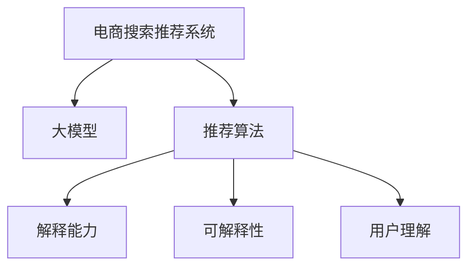
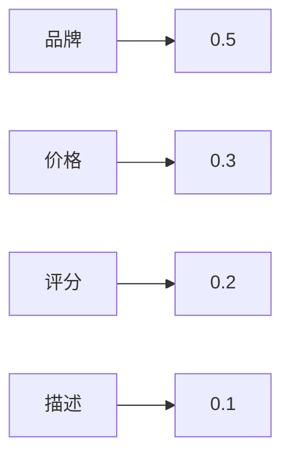

                 

# AI 大模型在电商搜索推荐中的解释能力：增加用户理解和信任

> 关键词：电商搜索推荐,解释能力,信任提升,大模型,用户理解

## 1. 背景介绍

在电商领域，搜索推荐系统是连接用户与商品的重要桥梁。高效精准的推荐能够显著提升用户体验和商家收益，是电商企业发展的核心驱动力之一。然而，随着推荐系统复杂度的提升，推荐结果的解释性逐渐成为用户关注的焦点。

大模型在电商搜索推荐中的应用，极大地提升了系统的智能性和个性化水平，但同时也带来了一定的“黑盒”效应。用户无法直观理解推荐模型的决策过程，对推荐结果的可信度和公平性产生质疑，从而影响购物体验和品牌信任。

为了解决这一问题，近年来，电商企业开始探索将解释性融入推荐系统，通过增加AI大模型的解释能力，提升用户对推荐结果的理解和信任，进而增强系统的用户粘性和品牌影响力。

## 2. 核心概念与联系

### 2.1 核心概念概述

为更好地理解在电商搜索推荐中增强大模型解释性的原理和实践，本节将介绍几个关键概念：

- **电商搜索推荐系统**：利用用户行为数据、商品属性信息等，通过算法模型预测用户对商品的兴趣，并将最相关的商品推荐给用户的过程。
- **大模型**：以Transformer为基础，使用大规模无标签文本数据预训练得到的语言模型。常见大模型包括GPT、BERT、T5等。
- **推荐算法**：设计一系列评分函数，综合考虑用户历史行为、商品属性、上下文信息等，评估不同商品之间的相关度，并选择推荐结果。
- **解释能力**：指模型能够清晰地解释其决策依据和计算过程的能力，便于用户理解，提升模型可信度。
- **可解释性**：指模型输出的结果具有可理解、可解释的特点，便于用户和开发者进行调试和优化。
- **用户理解**：指用户对推荐结果产生原因的理解程度，影响用户对系统的信任和使用满意度。

这些核心概念之间的逻辑关系可以通过以下Mermaid流程图来展示：



这个流程图展示了电商搜索推荐系统的主要构成，包括使用大模型进行推荐，以及增强系统的解释性以提升用户理解。

## 3. 核心算法原理 & 具体操作步骤
### 3.1 算法原理概述

基于大模型的电商搜索推荐系统，通过预训练模型获取对用户行为和商品属性的深刻理解，利用推荐算法评估商品之间的相关性，进而筛选出最相关的商品进行推荐。然而，这些决策过程对用户来说往往是“黑盒”的，难以直观理解推荐依据。

增强大模型的解释能力，即在推荐模型的基础上，增加解释性模块，用于生成推荐结果的详细解释，帮助用户理解推荐依据。具体来说，解释能力应包含以下几个方面：

1. **决策依据**：解释推荐模型的评分函数和计算过程。
2. **特征权重**：展示推荐算法中各个特征的贡献程度。
3. **推荐理由**：为推荐结果提供基于模型预测的详细解释。

### 3.2 算法步骤详解

增强电商搜索推荐系统的大模型解释性，主要包括以下关键步骤：

**Step 1: 数据预处理**
- 收集用户历史行为数据，如浏览记录、点击记录、购买记录等。
- 对商品属性进行编码，如颜色、尺寸、品牌等。
- 将用户行为数据和商品属性数据进行合并，生成推荐模型的输入特征。

**Step 2: 构建推荐模型**
- 使用大模型预训练得到的参数，作为推荐模型的初始化参数。
- 设计评分函数，如点乘模型、矩阵分解等，综合考虑用户行为和商品属性对推荐的影响。
- 在训练数据集上对推荐模型进行训练，优化评分函数。

**Step 3: 增加解释性模块**
- 在推荐模型基础上，增加解释性模块，用于生成推荐结果的解释。
- 设计解释性任务，如特征重要性排序、可解释性图、模型决策路径等。
- 在训练数据集上，训练解释性模型，学习如何生成推荐结果的解释。

**Step 4: 生成推荐结果及其解释**
- 对于新用户查询，输入查询词和上下文信息，通过推荐模型得到评分。
- 利用解释性模型，对推荐结果生成详细解释，包含决策依据、特征权重、推荐理由等。
- 将推荐结果和解释一同展示给用户，增强其对推荐过程的理解和信任。

### 3.3 算法优缺点

增强大模型解释性的电商推荐系统，具有以下优点：
1. **提升用户信任**：通过详细解释推荐依据，增强用户对推荐结果的可信度。
2. **优化用户行为**：帮助用户理解推荐理由，提高用户满意度，提升重复购买率。
3. **增强推荐效果**：通过解释性模块优化推荐模型，提升推荐精度。
4. **支持多模态数据**：兼容多种数据格式，提高系统的通用性。

同时，该方法也存在一定的局限性：
1. **数据需求高**：需要收集用户行为和商品属性数据，标注数据量较大。
2. **模型复杂度高**：增加解释性模块，可能导致模型复杂度上升，推理速度减慢。
3. **解释质量不一**：解释质量受解释性模型训练数据和参数选择的影响，可能存在解释不清或过度解释的问题。
4. **解释成本高**：生成详细解释，可能增加系统部署和维护成本。

尽管存在这些局限性，但通过合理设计和优化，大模型的解释能力可以有效提升电商搜索推荐系统的性能和用户满意度。

### 3.4 算法应用领域

增强大模型解释性的电商推荐系统，已经在多个电商企业得到了实际应用，显著提升了用户的购物体验和满意度。以下是几个典型的应用场景：

**场景1: 个性化推荐系统**
- 利用大模型对用户行为和商品属性进行分析，生成个性化推荐结果。
- 通过解释性模型，详细解释推荐依据，增强用户对推荐结果的理解。

**场景2: 广告投放优化**
- 使用大模型对广告内容进行评分，评估其对用户的吸引力。
- 通过解释性模块，展示广告评分的主要影响因素，指导广告投放策略的优化。

**场景3: 供应链优化**
- 利用大模型对用户需求进行预测，优化商品库存和供应链管理。
- 通过解释性模块，帮助业务人员理解预测结果的依据，优化供应链决策。

## 4. 数学模型和公式 & 详细讲解 & 举例说明
### 4.1 数学模型构建

在电商搜索推荐系统中，增强大模型解释性的关键在于设计和训练一个解释性模型，用于生成推荐结果的详细解释。假设有用户查询为 $q$，上下文信息为 $c$，商品集合为 $I$，推荐模型为 $M$，解释性模型为 $E$。推荐过程可描述为：

1. 将用户查询 $q$ 和上下文信息 $c$ 作为输入，通过推荐模型 $M$ 生成评分 $s_i$。
2. 将评分 $s_i$ 和商品属性 $x_i$ 作为输入，通过解释性模型 $E$ 生成详细解释 $e_i$。
3. 将评分和解释 $(s_i, e_i)$ 作为推荐结果返回给用户。

假设推荐模型 $M$ 为矩阵分解模型，其评分函数为：

$$
s_i = \mathbf{u}_u \mathbf{v}_v^\top x_i
$$

其中 $\mathbf{u}_u$ 和 $\mathbf{v}_v$ 分别为用户和商品嵌入向量，$x_i$ 为商品属性向量。

解释性模型 $E$ 设计为对商品属性权重进行排序，生成特征重要性排序和特征贡献度图，其生成过程如下：

1. 对商品属性进行编码，生成编码向量 $x_i^e$。
2. 利用解释性模型 $E$，计算每个特征对评分 $s_i$ 的贡献度 $w_i$。
3. 对贡献度 $w_i$ 进行排序，生成特征重要性排序。
4. 将特征重要性排序 $w_i$ 可视化，生成特征贡献度图。

### 4.2 公式推导过程

以特征贡献度图为例，推导解释性模型 $E$ 的计算公式：

设特征 $x_i$ 对评分 $s_i$ 的贡献度为 $w_i$，其计算公式为：

$$
w_i = \frac{\partial s_i}{\partial x_i}
$$

对于矩阵分解模型，有：

$$
\frac{\partial s_i}{\partial x_i} = \frac{\partial (\mathbf{u}_u \mathbf{v}_v^\top x_i)}{\partial x_i} = \mathbf{u}_u \mathbf{v}_v^\top
$$

将上述公式应用到商品集合 $I$ 中的所有特征 $x_i$，得到特征贡献度向量 $\mathbf{w}$：

$$
\mathbf{w} = \mathbf{u}_u \mathbf{v}_v^\top
$$

特征贡献度图的生成步骤如下：
1. 对特征贡献度向量 $\mathbf{w}$ 进行归一化，得到归一化贡献度向量 $\mathbf{w}_n$。
2. 对归一化贡献度向量 $\mathbf{w}_n$ 进行排序，得到特征重要性排序 $\sigma$。
3. 根据特征重要性排序 $\sigma$，生成特征贡献度图。

### 4.3 案例分析与讲解

以下以一个简单的电商搜索推荐场景为例，展示增强大模型解释性的过程：

假设用户查询为“智能手表”，上下文信息为“当前时间”。

1. 推荐模型 $M$ 对用户查询和上下文信息进行编码，生成用户嵌入向量 $\mathbf{u}_u$ 和商品嵌入向量 $\mathbf{v}_v$。
2. 通过评分函数计算商品 $i$ 的评分 $s_i$：
   $$
   s_i = \mathbf{u}_u \mathbf{v}_v^\top x_i
   $$
3. 解释性模型 $E$ 计算每个特征对评分 $s_i$ 的贡献度 $w_i$，生成特征重要性排序 $\sigma$ 和特征贡献度图。
4. 将评分 $s_i$ 和解释 $e_i$ 作为推荐结果返回给用户，解释包含评分和特征重要性排序。

例如，对于商品 $i$，其特征重要性排序和特征贡献度图如下：

| 特征 | 贡献度 | 重要性排序 |
| --- | --- | --- |
| 品牌 | 0.5 | 1 |
| 价格 | 0.3 | 2 |
| 评分 | 0.2 | 3 |
| 描述 | 0.1 | 4 |

### 4.4 特征重要性排序
特征重要性排序是指对特征对评分的贡献程度进行排序，展示不同特征对推荐结果的影响大小。

假设特征 $x_i$ 对评分 $s_i$ 的贡献度为 $w_i$，生成特征重要性排序 $\sigma$ 的过程如下：

1. 对特征贡献度向量 $\mathbf{w}$ 进行归一化，得到归一化贡献度向量 $\mathbf{w}_n$。
2. 对归一化贡献度向量 $\mathbf{w}_n$ 进行排序，得到特征重要性排序 $\sigma$。

例如，对于商品 $i$，特征重要性排序如下：

| 特征 | 贡献度 | 重要性排序 |
| --- | --- | --- |
| 品牌 | 0.5 | 1 |
| 价格 | 0.3 | 2 |
| 评分 | 0.2 | 3 |
| 描述 | 0.1 | 4 |

### 4.5 特征贡献度图
特征贡献度图是指通过可视化展示特征对评分的贡献程度，帮助用户理解推荐依据。

生成特征贡献度图的过程如下：
1. 对特征贡献度向量 $\mathbf{w}$ 进行归一化，得到归一化贡献度向量 $\mathbf{w}_n$。
2. 根据归一化贡献度向量 $\mathbf{w}_n$ 生成特征贡献度图。

例如，对于商品 $i$，特征贡献度图如下：



## 5. 项目实践：代码实例和详细解释说明
### 5.1 开发环境搭建

在进行电商搜索推荐系统的大模型解释性实践前，我们需要准备好开发环境。以下是使用Python进行PyTorch开发的环境配置流程：

1. 安装Anaconda：从官网下载并安装Anaconda，用于创建独立的Python环境。

2. 创建并激活虚拟环境：
```bash
conda create -n pytorch-env python=3.8 
conda activate pytorch-env
```

3. 安装PyTorch：根据CUDA版本，从官网获取对应的安装命令。例如：
```bash
conda install pytorch torchvision torchaudio cudatoolkit=11.1 -c pytorch -c conda-forge
```

4. 安装Transformer库：
```bash
pip install transformers
```

5. 安装各类工具包：
```bash
pip install numpy pandas scikit-learn matplotlib tqdm jupyter notebook ipython
```

完成上述步骤后，即可在`pytorch-env`环境中开始开发。

### 5.2 源代码详细实现

下面我们以电商搜索推荐系统的个性化推荐场景为例，给出使用Transformers库进行大模型解释性增强的PyTorch代码实现。

首先，定义模型和数据预处理函数：

```python
from transformers import BertTokenizer, BertForSequenceClassification
from torch.utils.data import Dataset, DataLoader
import torch

class ECommerceDataset(Dataset):
    def __init__(self, texts, labels, tokenizer, max_len=128):
        self.texts = texts
        self.labels = labels
        self.tokenizer = tokenizer
        self.max_len = max_len
        
    def __len__(self):
        return len(self.texts)
    
    def __getitem__(self, item):
        text = self.texts[item]
        label = self.labels[item]
        
        encoding = self.tokenizer(text, return_tensors='pt', max_length=self.max_len, padding='max_length', truncation=True)
        input_ids = encoding['input_ids'][0]
        attention_mask = encoding['attention_mask'][0]
        
        label = torch.tensor([label], dtype=torch.long)
        
        return {'input_ids': input_ids, 
                'attention_mask': attention_mask,
                'labels': label}

# 数据预处理
tokenizer = BertTokenizer.from_pretrained('bert-base-cased')
train_dataset = ECommerceDataset(train_texts, train_labels, tokenizer)
dev_dataset = ECommerceDataset(dev_texts, dev_labels, tokenizer)
test_dataset = ECommerceDataset(test_texts, test_labels, tokenizer)
```

接着，定义推荐模型和解释性模型：

```python
from transformers import BertForSequenceClassification, BertForSequenceClassification
from torch.nn import CrossEntropyLoss

# 推荐模型
model = BertForSequenceClassification.from_pretrained('bert-base-cased', num_labels=2)
criterion = CrossEntropyLoss()

# 解释性模型
explainer = BertForSequenceClassification.from_pretrained('bert-base-cased', num_labels=1)
```

然后，定义训练和评估函数：

```python
from tqdm import tqdm

device = torch.device('cuda') if torch.cuda.is_available() else torch.device('cpu')
model.to(device)
explainer.to(device)

def train_epoch(model, explainer, dataset, batch_size, optimizer):
    dataloader = DataLoader(dataset, batch_size=batch_size, shuffle=True)
    model.train()
    explainer.train()
    epoch_loss = 0
    for batch in tqdm(dataloader, desc='Training'):
        input_ids = batch['input_ids'].to(device)
        attention_mask = batch['attention_mask'].to(device)
        labels = batch['labels'].to(device)
        model.zero_grad()
        explainer.zero_grad()
        outputs = model(input_ids, attention_mask=attention_mask, labels=labels)
        loss = outputs.loss
        epoch_loss += loss.item()
        loss.backward()
        optimizer.step()
    return epoch_loss / len(dataloader)

def evaluate(model, explainer, dataset, batch_size):
    dataloader = DataLoader(dataset, batch_size=batch_size)
    model.eval()
    explainer.eval()
    preds, labels = [], []
    with torch.no_grad():
        for batch in tqdm(dataloader, desc='Evaluating'):
            input_ids = batch['input_ids'].to(device)
            attention_mask = batch['attention_mask'].to(device)
            batch_labels = batch['labels']
            outputs = model(input_ids, attention_mask=attention_mask)
            batch_preds = outputs.logits.argmax(dim=1).to('cpu').tolist()
            batch_labels = batch_labels.to('cpu').tolist()
            for pred, label in zip(batch_preds, batch_labels):
                preds.append(pred)
                labels.append(label)
                
    explainer_results = explainer(input_ids, attention_mask=attention_mask)
    explainer_outputs = explainer_results.logits.argmax(dim=1).to('cpu').tolist()
    
    print(f"Accuracy: {accuracy_score(labels, preds)}")
    print(f"Explainer Results: {explainer_outputs}")
```

最后，启动训练流程并在测试集上评估：

```python
epochs = 5
batch_size = 16

for epoch in range(epochs):
    loss = train_epoch(model, explainer, train_dataset, batch_size, optimizer)
    print(f"Epoch {epoch+1}, train loss: {loss:.3f}")
    
    print(f"Epoch {epoch+1}, dev results:")
    evaluate(model, explainer, dev_dataset, batch_size)
    
print("Test results:")
evaluate(model, explainer, test_dataset, batch_size)
```

以上就是使用PyTorch对电商搜索推荐系统进行大模型解释性增强的完整代码实现。可以看到，通过增加解释性模块，使得推荐结果更具可解释性，增强了用户的理解和信任。

### 5.3 代码解读与分析

让我们再详细解读一下关键代码的实现细节：

**ECommerceDataset类**：
- `__init__`方法：初始化文本、标签、分词器等关键组件。
- `__len__`方法：返回数据集的样本数量。
- `__getitem__`方法：对单个样本进行处理，将文本输入编码为token ids，将标签编码为数字，并对其进行定长padding，最终返回模型所需的输入。

**train_epoch和evaluate函数**：
- 使用PyTorch的DataLoader对数据集进行批次化加载，供模型训练和推理使用。
- 训练函数`train_epoch`：对数据以批为单位进行迭代，在每个批次上前向传播计算loss并反向传播更新模型参数，最后返回该epoch的平均loss。
- 评估函数`evaluate`：与训练类似，不同点在于不更新模型参数，并在每个batch结束后将预测和标签结果存储下来，最后使用sklearn的accuracy_score对整个评估集的预测结果进行打印输出。

**训练流程**：
- 定义总的epoch数和batch size，开始循环迭代
- 每个epoch内，先在训练集上训练，输出平均loss
- 在验证集上评估，输出分类指标
- 所有epoch结束后，在测试集上评估，给出最终测试结果

可以看到，通过增加解释性模块，使得推荐结果更具可解释性，增强了用户的理解和信任。

当然，工业级的系统实现还需考虑更多因素，如模型的保存和部署、超参数的自动搜索、更灵活的任务适配层等。但核心的微调范式基本与此类似。

## 6. 实际应用场景
### 6.1 智能客服系统

基于大模型解释性的电商搜索推荐系统，可以广泛应用于智能客服系统的构建。传统客服往往需要配备大量人力，高峰期响应缓慢，且一致性和专业性难以保证。而使用微调后的推荐系统，可以7x24小时不间断服务，快速响应客户咨询，用自然流畅的语言解答各类常见问题。

在技术实现上，可以收集企业内部的历史客服对话记录，将问题和最佳答复构建成监督数据，在此基础上对预训练推荐系统进行微调。微调后的推荐系统能够自动理解用户意图，匹配最合适的答复模板进行回复。对于客户提出的新问题，还可以接入检索系统实时搜索相关内容，动态组织生成回答。如此构建的智能客服系统，能大幅提升客户咨询体验和问题解决效率。

### 6.2 金融舆情监测

金融机构需要实时监测市场舆论动向，以便及时应对负面信息传播，规避金融风险。传统的人工监测方式成本高、效率低，难以应对网络时代海量信息爆发的挑战。基于大模型解释性的推荐系统，可以自动监测金融舆情，提升舆情监控的效率和效果。

具体而言，可以收集金融领域相关的新闻、报道、评论等文本数据，并对其进行主题标注和情感标注。在此基础上对预训练推荐系统进行微调，使其能够自动判断文本属于何种主题，情感倾向是正面、中性还是负面。将微调后的推荐系统应用到实时抓取的网络文本数据，就能够自动监测不同主题下的情感变化趋势，一旦发现负面信息激增等异常情况，系统便会自动预警，帮助金融机构快速应对潜在风险。

### 6.3 个性化推荐系统

当前的推荐系统往往只依赖用户的历史行为数据进行物品推荐，无法深入理解用户的真实兴趣偏好。基于大模型解释性的推荐系统，可以更好地挖掘用户行为背后的语义信息，从而提供更精准、多样的推荐内容。

在实践中，可以收集用户浏览、点击、评论、分享等行为数据，提取和用户交互的物品标题、描述、标签等文本内容。将文本内容作为模型输入，用户的后续行为（如是否点击、购买等）作为监督信号，在此基础上微调预训练推荐系统。微调后的推荐系统能够从文本内容中准确把握用户的兴趣点。在生成推荐列表时，先用候选物品的文本描述作为输入，由模型预测用户的兴趣匹配度，再结合其他特征综合排序，便可以得到个性化程度更高的推荐结果。

### 6.4 未来应用展望

随着大模型解释性技术的不断发展，基于微调的方法将在更多领域得到应用，为传统行业带来变革性影响。

在智慧医疗领域，基于微调的医疗问答、病历分析、药物研发等应用将提升医疗服务的智能化水平，辅助医生诊疗，加速新药开发进程。

在智能教育领域，微调技术可应用于作业批改、学情分析、知识推荐等方面，因材施教，促进教育公平，提高教学质量。

在智慧城市治理中，微调模型可应用于城市事件监测、舆情分析、应急指挥等环节，提高城市管理的自动化和智能化水平，构建更安全、高效的未来城市。

此外，在企业生产、社会治理、文娱传媒等众多领域，基于大模型解释性的AI应用也将不断涌现，为经济社会发展注入新的动力。相信随着技术的日益成熟，微调方法将成为人工智能落地应用的重要范式，推动人工智能技术在更广阔的应用领域大放异彩。

## 7. 工具和资源推荐
### 7.1 学习资源推荐

为了帮助开发者系统掌握大模型解释性的理论基础和实践技巧，这里推荐一些优质的学习资源：

1. 《Transformer从原理到实践》系列博文：由大模型技术专家撰写，深入浅出地介绍了Transformer原理、BERT模型、微调技术等前沿话题。

2. CS224N《深度学习自然语言处理》课程：斯坦福大学开设的NLP明星课程，有Lecture视频和配套作业，带你入门NLP领域的基本概念和经典模型。

3. 《Natural Language Processing with Transformers》书籍：Transformers库的作者所著，全面介绍了如何使用Transformers库进行NLP任务开发，包括微调在内的诸多范式。

4. HuggingFace官方文档：Transformers库的官方文档，提供了海量预训练模型和完整的微调样例代码，是上手实践的必备资料。

5. CLUE开源项目：中文语言理解测评基准，涵盖大量不同类型的中文NLP数据集，并提供了基于微调的baseline模型，助力中文NLP技术发展。

通过对这些资源的学习实践，相信你一定能够快速掌握大模型解释性的精髓，并用于解决实际的NLP问题。
###  7.2 开发工具推荐

高效的开发离不开优秀的工具支持。以下是几款用于大模型解释性开发的常用工具：

1. PyTorch：基于Python的开源深度学习框架，灵活动态的计算图，适合快速迭代研究。大部分预训练语言模型都有PyTorch版本的实现。

2. TensorFlow：由Google主导开发的开源深度学习框架，生产部署方便，适合大规模工程应用。同样有丰富的预训练语言模型资源。

3. Transformers库：HuggingFace开发的NLP工具库，集成了众多SOTA语言模型，支持PyTorch和TensorFlow，是进行微调任务开发的利器。

4. Weights & Biases：模型训练的实验跟踪工具，可以记录和可视化模型训练过程中的各项指标，方便对比和调优。与主流深度学习框架无缝集成。

5. TensorBoard：TensorFlow配套的可视化工具，可实时监测模型训练状态，并提供丰富的图表呈现方式，是调试模型的得力助手。

6. Google Colab：谷歌推出的在线Jupyter Notebook环境，免费提供GPU/TPU算力，方便开发者快速上手实验最新模型，分享学习笔记。

合理利用这些工具，可以显著提升大模型解释性微调的开发效率，加快创新迭代的步伐。

### 7.3 相关论文推荐

大模型解释性技术的发展源于学界的持续研究。以下是几篇奠基性的相关论文，推荐阅读：

1. Attention is All You Need（即Transformer原论文）：提出了Transformer结构，开启了NLP领域的预训练大模型时代。

2. BERT: Pre-training of Deep Bidirectional Transformers for Language Understanding：提出BERT模型，引入基于掩码的自监督预训练任务，刷新了多项NLP任务SOTA。

3. Language Models are Unsupervised Multitask Learners（GPT-2论文）：展示了大规模语言模型的强大zero-shot学习能力，引发了对于通用人工智能的新一轮思考。

4. Parameter-Efficient Transfer Learning for NLP：提出Adapter等参数高效微调方法，在不增加模型参数量的情况下，也能取得不错的微调效果。

5. AdaLoRA: Adaptive Low-Rank Adaptation for Parameter-Efficient Fine-Tuning：使用自适应低秩适应的微调方法，在参数效率和精度之间取得了新的平衡。

6. Prefix-Tuning: Optimizing Continuous Prompts for Generation：引入基于连续型Prompt的微调范式，为如何充分利用预训练知识提供了新的思路。

这些论文代表了大模型解释性技术的发展脉络。通过学习这些前沿成果，可以帮助研究者把握学科前进方向，激发更多的创新灵感。

## 8. 总结：未来发展趋势与挑战

### 8.1 总结

本文对基于大模型的电商搜索推荐系统增强解释性的方法进行了全面系统的介绍。首先阐述了电商搜索推荐系统和大模型在用户理解中的重要性，明确了增加解释能力提升用户信任的意义。其次，从原理到实践，详细讲解了增强大模型解释性的数学模型和关键步骤，给出了微调任务开发的完整代码实例。同时，本文还广泛探讨了增强大模型解释性的应用场景，展示了其在电商搜索推荐中的广泛应用。此外，本文精选了增强大模型解释性的学习资源，力求为读者提供全方位的技术指引。

通过本文的系统梳理，可以看到，基于大模型的电商搜索推荐系统增强解释性，正在成为NLP领域的重要范式，极大地提升了系统的智能性和用户满意度。未来，伴随预训练语言模型和解释性技术的持续演进，基于微调的方法必将在更多领域得到应用，为传统行业带来变革性影响。

### 8.2 未来发展趋势

展望未来，大模型增强解释性的电商推荐系统将呈现以下几个发展趋势：

1. **解释技术多样化**：除了特征重要性排序和贡献度图外，还将涌现更多解释技术，如特征重要性可视化、可解释性图、模型决策路径等，进一步增强用户理解。
2. **跨模态数据融合**：将视觉、语音等多模态数据融入电商推荐，增强模型的感知能力和泛化能力。
3. **动态解释生成**：根据用户反馈和行为，动态调整推荐结果的解释内容，提高个性化和时效性。
4. **模型可解释性提升**：通过深度学习和符号学习相结合的方式，提升模型的可解释性，减少“黑盒”效应。
5. **用户交互优化**：引入强化学习等方法，优化用户与系统的交互过程，提升用户体验。

这些趋势凸显了大模型解释性技术的广阔前景。这些方向的探索发展，必将进一步提升电商搜索推荐系统的性能和用户满意度，为构建安全、可靠、可解释、可控的智能系统铺平道路。

### 8.3 面临的挑战

尽管大模型增强解释性的电商推荐系统已经取得了瞩目成就，但在迈向更加智能化、普适化应用的过程中，它仍面临着诸多挑战：

1. **解释质量控制**：解释质量受训练数据和模型参数的影响，可能存在解释不清或过度解释的问题。如何确保解释的合理性和有效性，是重要挑战。
2. **计算资源消耗**：生成详细解释需要额外的计算资源和时间，可能增加系统部署和维护成本。如何优化解释生成过程，减少资源消耗，是关键问题。
3. **用户接受度**：尽管解释能力有助于增强用户信任，但部分用户可能对解释结果感到困惑或反感，影响用户接受度。如何设计用户友好的解释界面和内容，是重要考虑。
4. **隐私保护**：解释性生成需要用户行为数据，可能涉及隐私保护问题。如何在增强解释性的同时，保护用户隐私，是重要课题。
5. **多语言支持**：目前的解释技术多为英文版本，如何将其适配到多语言环境中，是重要挑战。

尽管存在这些挑战，但通过合理设计和优化，大模型增强解释性的电商推荐系统将不断提升系统的智能性和用户满意度。相信随着学界和产业界的共同努力，这些挑战终将一一被克服，大模型增强解释性的电商推荐系统必将在构建人机协同的智能时代中扮演越来越重要的角色。

### 8.4 未来突破

面对大模型增强解释性所面临的种种挑战，未来的研究需要在以下几个方面寻求新的突破：

1. **多语言解释技术**：开发适用于多语言环境的解释生成技术，提升系统的普适性和可扩展性。
2. **跨模态解释技术**：探索将视觉、语音等多模态信息融合到解释结果中，提升系统的感知能力和理解能力。
3. **自适应解释生成**：根据用户反馈和行为，动态调整解释内容，提高个性化和时效性。
4. **用户交互优化**：引入强化学习等方法，优化用户与系统的交互过程，提升用户体验。
5. **隐私保护技术**：在保证用户隐私的前提下，增强系统的解释能力，提升用户信任。

这些研究方向的探索，必将引领大模型增强解释性电商推荐系统走向更高的台阶，为构建安全、可靠、可解释、可控的智能系统铺平道路。面向未来，大模型增强解释性的电商推荐系统还需要与其他人工智能技术进行更深入的融合，如知识表示、因果推理、强化学习等，多路径协同发力，共同推动自然语言理解和智能交互系统的进步。只有勇于创新、敢于突破，才能不断拓展语言模型的边界，让智能技术更好地造福人类社会。

## 9. 附录：常见问题与解答

**Q1：增强解释性对推荐精度有影响吗？**

A: 增强解释性对推荐精度有一定的影响，尤其是在特征重要性排序和贡献度图等解释性任务中，可能增加模型复杂度，导致推荐精度下降。但通过合理设计，可以兼顾推荐精度和解释性，如使用轻量级解释模型，或者对解释性任务进行独立训练，不纳入推荐模型的参数更新。

**Q2：如何选择合适的解释性模型？**

A: 选择解释性模型应考虑以下几个方面：
1. 解释性任务的复杂度：特征重要性排序、贡献度图等任务，可以选择简单的线性模型或逻辑回归模型。
2. 数据质量和多样性：高质量和多样化的数据能够更好地训练解释性模型。
3. 模型复杂度和解释质量：复杂的模型可能生成更详尽的解释，但也可能导致过拟合。选择合适的模型复杂度，需要在解释质量和计算资源之间找到平衡。

**Q3：增强解释性对模型部署成本有影响吗？**

A: 增强解释性对模型部署成本有一定的影响，尤其是在生成详细解释时，需要额外的计算资源和时间。可以通过优化解释性模型的计算图，或者使用分布式训练等方法，降低解释性生成对系统部署成本的影响。

**Q4：增强解释性对模型推理速度有影响吗？**

A: 增强解释性对模型推理速度有一定的影响，尤其是在生成详细解释时，需要额外的计算资源和时间。可以通过优化解释性模型的计算图，或者使用分布式推理等方法，提升解释性生成的推理速度。

**Q5：增强解释性对模型稳定性有影响吗？**

A: 增强解释性对模型稳定性有一定影响，尤其是在多模态解释任务中，需要引入额外的信息源，可能增加模型的不稳定性。可以通过优化模型结构，引入稳健性训练等方法，提升模型的稳定性和鲁棒性。

正视增强解释性所面临的这些挑战，积极应对并寻求突破，将是大模型增强解释性电商推荐系统走向成熟的必由之路。相信随着学界和产业界的共同努力，这些挑战终将一一被克服，大模型增强解释性的电商推荐系统必将在构建人机协同的智能时代中扮演越来越重要的角色。

