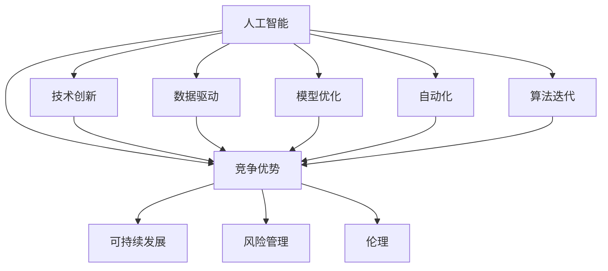

                 

# AI 时代的竞争：保持领先地位

> 关键词：人工智能, 竞争优势, 技术创新, 可持续发展, 数据驱动, 模型优化, 自动化, 算法迭代

## 1. 背景介绍

### 1.1 问题由来
随着人工智能(AI)技术的迅猛发展，各行各业正在经历一场前所未有的变革。AI不仅在提升效率、降低成本、增强用户体验方面展现出巨大潜力，更在全球范围内引发了新一轮的竞争热潮。无论是传统行业如制造业、金融业，还是新兴行业如电子商务、医疗健康，AI技术的应用都已逐步渗透到各个角落。

然而，这一变革并非一帆风顺。企业的AI应用面临数据质量差、技术壁垒高、成本门槛高等诸多挑战，如何在激烈的市场竞争中保持领先地位，成为摆在所有企业面前的难题。本文将系统介绍如何通过技术创新和数据驱动，构建竞争优势，保持领先地位。

### 1.2 问题核心关键点
为了应对AI时代的竞争，企业需要综合考虑以下关键点：
1. **数据质量管理**：确保数据收集、清洗、标注等环节的高效性和准确性。
2. **模型优化与迭代**：采用先进的算法和架构，不断优化模型性能。
3. **自动化与部署**：通过自动化工具和容器化技术，快速部署和维护AI模型。
4. **技术创新与合作**：持续进行技术研发和创新，加强与其他企业及机构的合作，共同推动技术进步。
5. **风险管理与伦理**：关注AI技术的伦理问题，确保应用过程中的人机协作和安全。

这些问题共同构成了企业在AI时代竞争的关键要素。以下文章将围绕这些关键点，展开深入探讨。

## 2. 核心概念与联系

### 2.1 核心概念概述

为了更好地理解如何在AI时代保持领先地位，首先需要明确几个核心概念及其联系：

1. **人工智能(AI)**：指通过计算机模拟人类智能的科学和技术，包括机器学习、深度学习、自然语言处理等子领域。
2. **竞争优势(Competitive Advantage)**：企业利用AI技术所形成的技术壁垒和市场优势，保持市场领先地位的能力。
3. **技术创新(Innovation)**：通过持续的技术研发和创新，不断推出新的AI应用和技术方案。
4. **数据驱动(Data-Driven)**：基于大量数据进行AI模型的训练和优化，提升模型预测能力和泛化能力。
5. **模型优化(Model Optimization)**：通过算法和架构的优化，提升模型性能，降低计算成本。
6. **自动化(Automation)**：利用工具和框架，实现AI模型的自动化训练、部署和维护。
7. **算法迭代(Algorithm Iteration)**：通过不断迭代算法，提升AI模型的准确性和鲁棒性。
8. **可持续发展(Sustainability)**：在追求技术优势的同时，考虑AI应用的长期影响和可持续发展。
9. **风险管理(Risk Management)**：评估和管理AI应用中的风险，包括伦理、隐私、安全等方面。
10. **伦理(Ethics)**：确保AI应用符合道德和法律规范，避免歧视、偏见和不公平。

这些概念之间的关系可以通过以下Mermaid流程图来展示：



这个流程图展示了AI技术如何通过多个环节，支撑企业在竞争中取得优势。

## 3. 核心算法原理 & 具体操作步骤
### 3.1 算法原理概述

构建AI竞争优势的核心在于算法和模型的高效优化与迭代。AI技术的优势源于其强大的数据处理能力和模型预测能力，但如何将这些优势转化为商业价值，则需要不断优化算法和模型，以提升性能和适应性。

### 3.2 算法步骤详解

构建AI竞争优势的主要步骤包括：

**Step 1: 数据收集与处理**
- 收集高质量的数据，确保数据的全面性和代表性。
- 进行数据清洗、标注和预处理，去除噪声和错误。
- 使用数据增强技术，丰富数据样本，提高模型泛化能力。

**Step 2: 模型选择与优化**
- 选择适合业务需求的模型，如深度神经网络、决策树、集成模型等。
- 进行模型调参，选择最优的超参数。
- 采用正则化技术，防止模型过拟合。
- 使用迁移学习、迁移学习等方法，提升模型迁移能力。

**Step 3: 自动化与部署**
- 使用自动化工具，如TensorFlow、PyTorch、Scikit-learn等，实现模型的训练和推理。
- 使用Docker、Kubernetes等容器化技术，实现模型的快速部署和维护。
- 建立持续集成和持续交付(CI/CD)流程，实现模型的自动化迭代。

**Step 4: 算法迭代与创新**
- 持续进行算法研究，跟踪最新的学术和工业界进展。
- 引入开源算法库，快速迭代和优化模型。
- 通过算法改进和架构创新，提升模型的性能和效率。

**Step 5: 风险管理与伦理**
- 进行AI应用的风险评估，包括隐私、安全、伦理等方面。
- 制定AI应用的伦理规范，确保应用符合道德和法律要求。
- 建立数据保护和隐私管理机制，确保数据安全。

### 3.3 算法优缺点

构建AI竞争优势的算法方法具有以下优点：
1. 通过算法和模型的优化，提升了模型性能和泛化能力。
2. 自动化和部署技术，加快了AI模型的迭代和部署速度。
3. 持续算法迭代，确保模型在竞争中保持领先地位。
4. 数据驱动和风险管理，提高了AI应用的可靠性和安全性。

但该方法也存在一些局限性：
1. 需要高质量的数据，数据获取和处理成本较高。
2. 模型优化和算法迭代需要较强的技术实力和资源投入。
3. 自动化部署和迭代需要较高的技术门槛。
4. 风险管理和伦理规范需要复杂的机制和过程。

尽管存在这些局限性，但总体而言，通过算法优化和自动化部署，企业可以在AI时代中保持持续的技术优势。

### 3.4 算法应用领域

基于AI竞争优势的算法方法，可以在多个领域得到应用，例如：

- **金融科技**：通过机器学习模型进行风险评估、信用评分、欺诈检测等，提升金融服务的智能化水平。
- **医疗健康**：利用深度学习模型进行疾病预测、药物发现、个性化治疗等，改善医疗服务质量。
- **制造业**：采用预测性维护、智能制造、质量控制等AI应用，提高生产效率和产品质量。
- **零售电商**：使用推荐系统、需求预测、客户分析等AI技术，提升销售转化率和客户满意度。
- **物流运输**：应用路线规划、运输调度、库存管理等AI技术，优化物流网络，提升运输效率。
- **智能城市**：采用交通管理、环境监测、公共安全等AI应用，构建智慧城市，提升城市治理能力。
- **智能制造**：通过预测性维护、质量控制、供应链优化等AI技术，提升制造效率和质量。

这些应用领域展示了AI技术在提升企业竞争力方面的巨大潜力。通过系统的算法优化和自动化部署，企业可以在不同领域获得显著的竞争优势。

## 4. 数学模型和公式 & 详细讲解  
### 4.1 数学模型构建

为更好地理解如何在AI时代构建竞争优势，本节将介绍几个关键数学模型：

**线性回归模型**：
$$
y = \theta_0 + \theta_1x_1 + \theta_2x_2 + ... + \theta_nx_n
$$
其中 $y$ 为输出变量，$x_1, x_2, ..., x_n$ 为输入变量，$\theta_0, \theta_1, \theta_2, ..., \theta_n$ 为模型参数。线性回归模型通过最小化损失函数，拟合输入和输出之间的关系。

**神经网络模型**：
$$
z_l = g(\sum_{i=1}^n w_{li}x_i + b_l)
$$
$$
\hat{y} = g(\sum_{i=1}^n w_{oy}z_i + b_o)
$$
其中 $z_l$ 为第 $l$ 层的输出，$w_{li}$ 和 $b_l$ 为第 $l$ 层的权重和偏置，$g$ 为激活函数。神经网络模型通过多层非线性变换，提升模型的预测能力。

**卷积神经网络模型**：
$$
f(x) = \sum_{i=1}^k w^{(i)} * h^{(i-1)}(x) + b^{(i)}
$$
其中 $x$ 为输入图像，$w^{(i)}$ 和 $b^{(i)}$ 为卷积核和偏置，$h^{(i-1)}(x)$ 为前一层输出。卷积神经网络通过卷积和池化操作，提取图像特征。

**循环神经网络模型**：
$$
h_t = g(\sum_{i=1}^n w_{ti}h_{t-1} + w_{xi}x_t + b_t)
$$
其中 $h_t$ 为当前时间步的隐藏状态，$w_{ti}$ 和 $w_{xi}$ 为时间相关的权重，$g$ 为激活函数。循环神经网络通过时间序列建模，处理序列数据。

### 4.2 公式推导过程

以线性回归模型为例，推导最小二乘法的损失函数及其梯度计算公式。

设训练集为 $D=\{(x_i,y_i)\}_{i=1}^N$，其中 $x_i \in \mathbb{R}^n, y_i \in \mathbb{R}$，目标函数为均方误差损失：
$$
\mathcal{L}(\theta) = \frac{1}{2N}\sum_{i=1}^N (y_i - \theta_0 - \theta_1x_{i1} - ... - \theta_nx_{in})^2
$$

对 $\theta_0, \theta_1, ..., \theta_n$ 求导，得：
$$
\frac{\partial \mathcal{L}(\theta)}{\partial \theta_j} = -\frac{1}{N}\sum_{i=1}^N (y_i - \hat{y}_i)(x_{i1}, x_{i2}, ..., x_{in})
$$

其中 $\hat{y}_i = \theta_0 + \theta_1x_{i1} + ... + \theta_nx_{in}$，求解最小二乘法最优参数：
$$
\theta^* = \mathop{\arg\min}_{\theta} \mathcal{L}(\theta)
$$

通过梯度下降算法，不断迭代更新参数，直至收敛。

### 4.3 案例分析与讲解

以金融风控模型为例，展示如何在实际应用中构建和优化模型。

假设目标是为银行信用卡申请进行风险评估，收集历史申请记录，其中包含用户的基本信息、收入、职业、信用历史等。将数据分为训练集和测试集，分别用于模型训练和评估。

**Step 1: 数据收集与处理**
- 从银行内部系统或公开数据源获取历史申请记录。
- 清洗数据，去除缺失值和异常值。
- 进行特征工程，提取和选择对风险评估有用的特征。

**Step 2: 模型选择与优化**
- 选择逻辑回归或决策树模型作为初始模型。
- 进行交叉验证，选择最优的特征和超参数。
- 采用正则化技术，如L2正则，防止模型过拟合。
- 引入迁移学习，利用其他银行的预训练模型提升模型效果。

**Step 3: 自动化与部署**
- 使用TensorFlow或Scikit-learn实现模型的训练和推理。
- 将模型封装为REST API，通过容器化技术部署到服务器或云平台。
- 建立持续集成和持续交付流程，自动化训练和部署。

**Step 4: 算法迭代与创新**
- 持续收集新的申请记录，更新和优化模型。
- 引入深度学习模型，如XGBoost或深度神经网络，提升模型性能。
- 进行算法创新，如引入对抗样本，提升模型的鲁棒性。

**Step 5: 风险管理与伦理**
- 进行风险评估，分析模型的预测结果和风险等级。
- 制定隐私保护措施，确保用户数据安全。
- 制定伦理规范，确保模型不产生歧视和不公平。

## 5. 项目实践：代码实例和详细解释说明
### 5.1 开发环境搭建

在进行AI模型开发前，需要准备相应的开发环境。以下是Python环境搭建的基本步骤：

1. 安装Anaconda：从官网下载并安装Anaconda，用于创建独立的Python环境。
```bash
conda create -n pytorch-env python=3.8
conda activate pytorch-env
```

2. 安装PyTorch：根据CUDA版本，从官网获取对应的安装命令。例如：
```bash
conda install pytorch torchvision torchaudio cudatoolkit=11.1 -c pytorch -c conda-forge
```

3. 安装TensorFlow：下载并安装TensorFlow，选择相应版本的CUDA支持。
```bash
pip install tensorflow tensorflow-gpu==2.5
```

4. 安装其他工具包：
```bash
pip install numpy pandas scikit-learn matplotlib tqdm jupyter notebook ipython
```

完成上述步骤后，即可在`pytorch-env`环境中进行AI模型开发。

### 5.2 源代码详细实现

下面以金融风控模型为例，展示使用PyTorch进行模型训练和优化的完整代码实现。

首先，定义模型类：
```python
import torch
import torch.nn as nn
import torch.optim as optim

class LinearModel(nn.Module):
    def __init__(self, input_dim, output_dim):
        super(LinearModel, self).__init__()
        self.linear = nn.Linear(input_dim, output_dim)
        self.sigmoid = nn.Sigmoid()

    def forward(self, x):
        return self.sigmoid(self.linear(x))
```

然后，定义数据加载函数：
```python
from torch.utils.data import TensorDataset, DataLoader

class DatasetLoader:
    def __init__(self, x, y):
        self.dataset = TensorDataset(x, y)
        self.batch_size = 32

    def __len__(self):
        return len(self.dataset)

    def __iter__(self):
        return DataLoader(self.dataset, batch_size=self.batch_size, shuffle=True, drop_last=False)
```

接着，定义模型训练函数：
```python
def train(model, data_loader, device, optimizer, loss_fn, num_epochs):
    model.train()
    for epoch in range(num_epochs):
        for batch in data_loader:
            x, y = batch[0].to(device), batch[1].to(device)
            optimizer.zero_grad()
            output = model(x)
            loss = loss_fn(output, y)
            loss.backward()
            optimizer.step()
```

最后，启动训练流程：
```python
# 准备数据
x_train, y_train = ...  # 训练数据
x_test, y_test = ...  # 测试数据

# 初始化模型和优化器
model = LinearModel(len(x_train[0]), 1)
optimizer = optim.SGD(model.parameters(), lr=0.01)

# 定义损失函数
loss_fn = nn.BCELoss()

# 定义设备
device = torch.device('cuda' if torch.cuda.is_available() else 'cpu')

# 训练模型
train_loader = DatasetLoader(x_train, y_train)
train(model, train_loader, device, optimizer, loss_fn, num_epochs=10)
```

以上就是使用PyTorch进行金融风控模型训练和优化的完整代码实现。

### 5.3 代码解读与分析

让我们再详细解读一下关键代码的实现细节：

**LinearModel类**：
- `__init__`方法：定义模型结构，包括一个线性层和一个Sigmoid激活函数。
- `forward`方法：实现前向传播，将输入通过线性层和Sigmoid激活函数，输出预测结果。

**DatasetLoader类**：
- `__init__`方法：初始化数据集和批大小。
- `__len__`方法：返回数据集长度。
- `__iter__`方法：实现数据迭代器，每次返回一个批次的数据。

**train函数**：
- 将模型设为训练模式，遍历所有epoch。
- 在每个epoch中，遍历所有批次。
- 前向传播计算损失函数。
- 反向传播更新模型参数。
- 使用SGD优化器更新参数。

可以看到，PyTorch提供了完整的工具和框架，使得AI模型的开发和训练变得简单高效。开发者可以将更多精力放在模型优化和数据处理等高层逻辑上，而不必过多关注底层的实现细节。

当然，工业级的系统实现还需考虑更多因素，如模型的保存和部署、超参数的自动搜索、更灵活的任务适配层等。但核心的AI模型构建和训练逻辑基本与此类似。

## 6. 实际应用场景
### 6.1 智能客服系统

智能客服系统利用AI技术，实现7x24小时不间断服务，快速响应客户咨询，提升客户体验和问题解决效率。系统通过收集企业内部的历史客服对话记录，训练和微调预训练模型，使其能够自动理解用户意图，匹配最合适的答案模板进行回复。对于客户提出的新问题，还可以接入检索系统实时搜索相关内容，动态组织生成回答。如此构建的智能客服系统，能够大幅提升客户咨询体验和问题解决效率。

### 6.2 金融舆情监测

金融机构需要实时监测市场舆论动向，以便及时应对负面信息传播，规避金融风险。基于AI技术的文本分类和情感分析，可以从大量金融新闻、评论、社交媒体等文本数据中提取关键信息，实时监测市场情绪，预警潜在风险。通过预训练模型和微调技术，系统能够准确判断文本属于何种情绪，预测市场走向，帮助金融机构做出及时应对。

### 6.3 个性化推荐系统

当前的推荐系统往往只依赖用户的历史行为数据进行物品推荐，无法深入理解用户的真实兴趣偏好。基于AI技术的推荐系统，可以分析用户浏览、点击、评论、分享等行为数据，提取和用户交互的物品标题、描述、标签等文本内容，进行模型训练和微调，学习用户的兴趣点和行为模式，实现个性化推荐。系统可以通过优化模型和算法，提升推荐准确性和多样化，满足用户的多样化需求。

### 6.4 未来应用展望

随着AI技术的不断进步，其在各个行业的应用将更加广泛和深入。未来，AI将在智能制造、智慧医疗、智能交通、智能城市等领域发挥更大作用，提升生产效率、改善医疗服务、优化交通管理、构建智慧城市。企业在构建AI竞争优势时，应关注以下几个方向：

1. **数据管理与治理**：确保数据的质量和安全性，建立数据治理机制，提升数据利用效率。
2. **模型优化与创新**：引入先进算法和架构，提升模型的预测能力和鲁棒性。
3. **自动化与部署**：通过自动化工具和容器化技术，实现模型的快速迭代和部署。
4. **持续学习和优化**：利用在线学习和自适应算法，不断优化模型，提升性能。
5. **伦理与隐私**：确保AI应用的伦理和隐私保护，避免歧视和不公平。
6. **风险管理与合规**：评估和管理AI应用的风险，确保应用的合规性。

只有综合考虑这些因素，企业才能在AI时代保持竞争优势，实现可持续发展。

## 7. 工具和资源推荐
### 7.1 学习资源推荐

为了帮助开发者系统掌握AI技术，以下是一些优质的学习资源：

1. **《深度学习》（Ian Goodfellow, Yoshua Bengio, Aaron Courville）**：系统介绍了深度学习的理论基础和实践方法。
2. **Coursera的《深度学习专项课程》**：由深度学习领域的专家主讲，涵盖了深度学习的基础知识和应用案例。
3. **Kaggle竞赛**：参与Kaggle竞赛，通过实际项目提升实战能力。
4. **GitHub开源项目**：通过阅读和贡献开源项目，学习最新的AI技术。
5. **AI社区与论坛**：如AI China、IEEE Xplore等，获取最新的AI技术和应用案例。

通过这些资源的学习和实践，相信你一定能够快速掌握AI技术，并将其应用到实际项目中。

### 7.2 开发工具推荐

高效的开发离不开优秀的工具支持。以下是几款用于AI开发的常用工具：

1. **PyTorch**：基于Python的开源深度学习框架，灵活动态的计算图，适合快速迭代研究。
2. **TensorFlow**：由Google主导开发的开源深度学习框架，生产部署方便，适合大规模工程应用。
3. **Jupyter Notebook**：交互式编程环境，方便调试和可视化。
4. **Git**：版本控制系统，确保代码的协作和版本控制。
5. **Docker**：容器化技术，实现模型的快速部署和迁移。
6. **Jenkins**：持续集成工具，自动化测试和部署。

合理利用这些工具，可以显著提升AI开发和部署的效率，加速创新迭代的步伐。

### 7.3 相关论文推荐

AI技术的发展离不开学界的持续研究。以下是几篇奠基性的相关论文，推荐阅读：

1. **《深度学习》（Ian Goodfellow, Yoshua Bengio, Aaron Courville）**：深度学习领域的经典教材。
2. **《ImageNet大规模视觉识别挑战赛》（Alex Krizhevsky, Ilya Sutskever, Geoffrey Hinton）**：介绍大规模视觉识别的技术方法。
3. **《AlphaGo》（David Silver, Jürgen Schmidhuber, Ian Osband）**：介绍AlphaGo的技术创新和应用。
4. **《自然语言处理综述》（Tom Mitchell）**：自然语言处理领域的经典综述。
5. **《强化学习综述》（Richard S. Sutton, Andrew G. Barto）**：强化学习领域的经典教材。

这些论文代表了大数据时代AI技术的发展脉络。通过学习这些前沿成果，可以帮助研究者把握学科前进方向，激发更多的创新灵感。

## 8. 总结：未来发展趋势与挑战
### 8.1 总结

本文对如何在AI时代构建竞争优势进行了全面系统的介绍。首先阐述了AI技术的优势和应用场景，明确了企业应关注的几个关键要素：数据管理与治理、模型优化与创新、自动化与部署、持续学习和优化、伦理与隐私、风险管理与合规。其次，从算法优化和自动化部署两个核心环节，详细讲解了构建AI竞争优势的具体步骤和操作流程。最后，本文展示了AI技术在多个领域的应用实例，展望了AI未来的发展方向和面临的挑战。

通过本文的系统梳理，可以看到，AI技术在提升企业竞争力方面具有巨大潜力。只有在数据管理、模型优化、自动化部署等多个环节进行全面优化，才能真正实现AI技术的商业价值。未来，企业需要不断跟踪最新技术进展，加强与学术界的合作，持续进行技术创新，才能在激烈的市场竞争中保持领先地位。

### 8.2 未来发展趋势

展望未来，AI技术将呈现以下几个发展趋势：

1. **数据管理的智能化**：利用大数据分析和人工智能技术，实现数据的自动化管理与治理，提升数据利用效率。
2. **模型优化的自动化**：开发更智能的自动化模型优化工具，实现模型自动调参和超参数优化。
3. **AI应用的普及化**：AI技术将渗透到各个行业，提升生产效率和服务质量。
4. **跨领域技术的融合**：AI技术与物联网、区块链、5G等新技术的融合，将催生更多创新应用。
5. **伦理与隐私保护的强化**：AI应用将更加注重伦理和隐私保护，确保技术的可接受性和可信度。
6. **可解释性与透明度的提升**：通过可解释性模型和可视化技术，提升AI应用的透明度和可信度。
7. **全球合作与共享**：AI技术将更多地应用于全球合作，促进技术共享和知识传播。

这些趋势展示了AI技术未来的广阔前景，企业需要关注并积极应对，才能在竞争中占据有利地位。

### 8.3 面临的挑战

尽管AI技术在多个领域展现出巨大潜力，但面对激烈的市场竞争和不断变化的技术环境，企业仍面临诸多挑战：

1. **技术壁垒高**：AI技术的开发和应用需要高水平的技术实力和资源投入，中小企业难以进入。
2. **数据获取难**：高质量的数据获取和处理成本较高，数据隐私和安全问题复杂。
3. **人才短缺**：AI技术需要专业人才进行开发和维护，但市场上高水平人才供给不足。
4. **模型鲁棒性不足**：AI模型在对抗样本、噪声数据等情况下，容易产生错误结果。
5. **伦理与隐私问题**：AI应用可能涉及用户隐私和伦理问题，引发法律和社会争议。
6. **系统复杂度高**：AI系统的开发和部署涉及多个环节，需要综合考虑技术、业务、安全等因素，复杂度高。

只有积极应对这些挑战，才能在AI技术的应用中实现可持续的发展。

### 8.4 研究展望

面对AI技术的不断进步和市场竞争的激烈，未来研究需要关注以下几个方向：

1. **数据生成与增强**：开发更多高质量的数据生成和增强技术，提升数据利用效率。
2. **模型压缩与优化**：研究更高效的模型压缩和优化方法，降低计算成本。
3. **自动化与可解释性**：开发自动化调参和模型解释工具，提升模型开发效率和可信度。
4. **跨领域技术融合**：探索AI技术与其他技术（如区块链、物联网等）的融合，推动更多创新应用。
5. **伦理与隐私保护**：研究AI应用的伦理和隐私保护问题，确保技术的可接受性和可信度。
6. **全球合作与共享**：加强国际合作，推动技术共享和知识传播，提升全球AI技术水平。

只有从数据、模型、算法、技术、伦理等多个方面进行全面研究和创新，才能在AI时代中保持领先地位，实现可持续发展。

## 9. 附录：常见问题与解答
### 9.1 常见问题与解答

**Q1: AI技术如何影响企业竞争优势？**

A: AI技术通过自动化、智能化和数据驱动等方式，提升企业的生产效率、服务质量和市场响应速度，从而在竞争中占据优势。AI技术可以优化决策过程，降低成本，提升用户体验，增强竞争力。

**Q2: 如何选择合适的AI算法和模型？**

A: 选择AI算法和模型时，需要考虑以下几个因素：
1. 业务需求：选择适合业务需求的算法和模型，如分类、回归、聚类等。
2. 数据特征：考虑数据类型和特征，选择适合的模型，如线性模型、神经网络、卷积神经网络等。
3. 性能要求：根据性能要求选择模型，如准确率、召回率、F1值等。
4. 计算资源：考虑计算资源和部署环境，选择适合的模型和算法。

**Q3: 如何处理数据隐私和伦理问题？**

A: 处理数据隐私和伦理问题需要从以下几个方面入手：
1. 数据匿名化：通过数据匿名化处理，保护用户隐私。
2. 合规性检查：确保AI应用符合相关法律法规，如GDPR、CCPA等。
3. 数据安全：建立数据安全机制，保护数据免受攻击和泄露。
4. 透明性和可解释性：确保AI应用的透明性和可解释性，增强用户信任。
5. 伦理审查：进行伦理审查，确保AI应用符合伦理规范。

**Q4: 如何持续优化AI模型？**

A: 持续优化AI模型需要从以下几个方面入手：
1. 数据更新：持续收集新数据，更新和优化模型。
2. 自动化调参：使用自动化调参工具，优化模型参数。
3. 模型更新：引入最新算法和架构，提升模型性能。
4. 模型压缩：通过模型压缩和优化，提高模型效率。
5. 持续学习：利用在线学习和自适应算法，不断优化模型。

**Q5: 如何降低AI技术的开发成本？**

A: 降低AI技术开发成本需要从以下几个方面入手：
1. 开源工具和框架：利用开源工具和框架，快速迭代和优化模型。
2. 云计算资源：利用云计算资源，降低计算和存储成本。
3. 模型共享与复用：共享和复用现有模型，降低开发成本。
4. 自动化开发工具：使用自动化开发工具，提升开发效率。

**Q6: 如何处理AI模型的鲁棒性问题？**

A: 处理AI模型鲁棒性问题需要从以下几个方面入手：
1. 数据增强：通过数据增强技术，提高模型对噪声和对抗样本的鲁棒性。
2. 模型正则化：使用正则化技术，防止模型过拟合和泛化能力不足。
3. 对抗训练：引入对抗样本，提升模型对抗攻击的能力。
4. 鲁棒性测试：进行鲁棒性测试，评估和改进模型。

**Q7: 如何确保AI应用的透明度和可信度？**

A: 确保AI应用的透明度和可信度需要从以下几个方面入手：
1. 模型解释性：选择可解释性高的模型，确保模型决策过程透明。
2. 可解释性工具：使用可解释性工具，分析模型输出。
3. 透明度报告：定期发布透明度报告，确保应用过程透明。
4. 用户反馈：收集用户反馈，持续改进模型和应用。

**Q8: 如何处理AI应用的伦理和隐私问题？**

A: 处理AI应用的伦理和隐私问题需要从以下几个方面入手：
1. 数据隐私保护：确保数据隐私保护，避免数据泄露和滥用。
2. 伦理审查：进行伦理审查，确保应用符合伦理规范。
3. 用户知情权：确保用户知情权，透明告知用户应用过程和目的。
4. 伦理教育：加强伦理教育，提高员工和用户的伦理意识。

**Q9: 如何处理AI应用的公平性和偏见问题？**

A: 处理AI应用的公平性和偏见问题需要从以下几个方面入手：
1. 数据公平性：确保数据公平性，避免数据偏见。
2. 算法公平性：使用公平性算法，减少模型偏见。
3. 测试和评估：进行公平性测试和评估，发现和改进偏见。
4. 用户反馈：收集用户反馈，持续改进模型和应用。

通过解答这些问题，希望你能对AI技术的应用和优化有更清晰的认识，在实际应用中能够更好地利用AI技术提升企业竞争力。

---

作者：禅与计算机程序设计艺术 / Zen and the Art of Computer Programming

