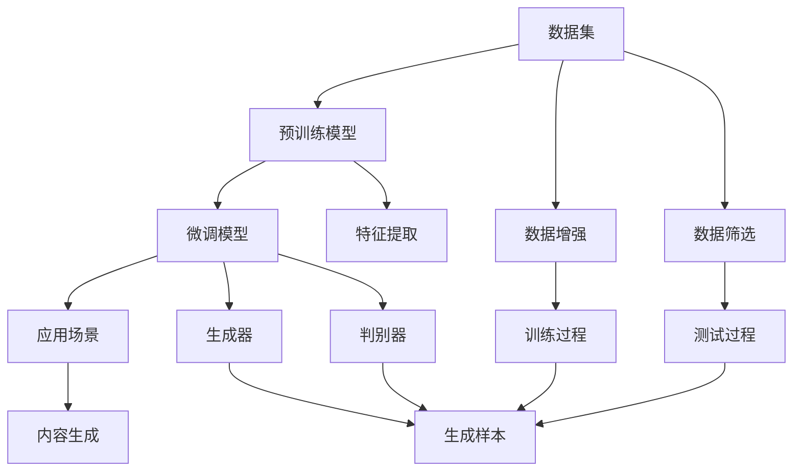

                 

# AIGC垂直领域应用案例解析

## 1. 背景介绍

### 1.1 问题由来

随着人工智能技术的飞速发展，AI生成内容（AIGC）技术日渐成熟，逐渐渗透到各个垂直领域，如金融、医疗、教育、法律等。AIGC技术利用深度学习、自然语言处理、计算机视觉等先进技术，生成高质量的自然语言文本、图像、视频等内容，从而提升用户体验，优化业务流程，降低成本。

### 1.2 问题核心关键点

AIGC技术的关键点在于如何高效生成高质量的内容，同时在特定垂直领域适应性更强。这需要克服以下几个挑战：
- 如何在不同领域应用中保持模型的普适性和适应性。
- 如何在保持内容质量的同时，提升生成速度和效率。
- 如何确保生成的内容符合实际应用场景的需求，满足业务逻辑。
- 如何在数据稀缺或隐私保护的约束下，实现高质量内容的生成。

本文将通过几个典型的AIGC垂直领域应用案例，深入解析AIGC技术在不同场景下的应用原理、操作步骤及挑战，为相关领域的技术实践提供参考。

## 2. 核心概念与联系

### 2.1 核心概念概述

为更好地理解AIGC技术在垂直领域的应用，本文将介绍几个核心概念：

- **人工智能生成内容（AIGC）**：利用AI技术，自动生成高质量的自然语言文本、图像、视频等内容。
- **自然语言处理（NLP）**：通过计算机程序实现人类语言与机器的交互，包括文本分类、命名实体识别、情感分析、机器翻译等任务。
- **计算机视觉（CV）**：通过计算机技术对图像和视频进行处理和分析，包括图像识别、目标检测、图像生成等。
- **深度学习（DL）**：基于神经网络模型，通过大量数据训练生成复杂模型，以实现高效内容生成。
- **生成对抗网络（GAN）**：一种通过生成器和判别器博弈训练生成高质量图像和视频内容的深度学习模型。

这些核心概念共同构成了AIGC技术的理论基础，其在不同垂直领域的应用，正是基于这些技术基础，进一步针对具体场景进行优化和定制。

### 2.2 核心概念原理和架构的 Mermaid 流程图



这个流程图展示了AIGC技术的基本架构：首先通过数据集预训练模型，然后在特定场景下进行微调，最后应用于内容生成。数据增强和数据筛选优化了预训练和微调过程，特征提取和生成器/判别器博弈提升了模型性能，从而实现高质量内容生成。

## 3. 核心算法原理 & 具体操作步骤

### 3.1 算法原理概述

AIGC技术通常基于深度学习模型，通过预训练和微调来实现内容生成。以自然语言处理和图像生成为例：

- **自然语言处理**：利用预训练的语言模型（如BERT、GPT等），在特定任务上进行微调，生成符合特定场景的文本内容。
- **计算机视觉**：利用预训练的图像生成模型（如GAN、VQ-VAE等），在特定任务上进行微调，生成符合特定场景的图像或视频内容。

### 3.2 算法步骤详解

以自然语言处理中的文本生成为例，步骤包括：

**Step 1: 准备数据集**
- 收集特定领域的数据集，如金融领域的股市新闻、法律领域的法规文档等。
- 对数据进行清洗和预处理，确保数据质量和可用性。

**Step 2: 预训练模型选择与初始化**
- 选择合适的预训练语言模型，如BERT、GPT等，并加载到系统中。
- 对模型进行初始化，加载预训练权重，保持其通用语言知识。

**Step 3: 微调模型**
- 根据特定任务设计损失函数，如交叉熵损失、BLEU分数等。
- 使用标注数据集对模型进行微调，确保生成的文本符合业务逻辑。
- 监控模型性能，确保微调过程收敛。

**Step 4: 内容生成**
- 在测试集上评估微调后的模型性能，确保模型具备良好的泛化能力。
- 使用模型生成文本内容，满足实际应用需求。

### 3.3 算法优缺点

AIGC技术在特定垂直领域的应用具有以下优缺点：

**优点**：
- 可以生成高质量的内容，满足特定领域的需求。
- 可以大幅降低人工成本，提高生产效率。
- 可以扩展到多个领域，具有较高的通用性。

**缺点**：
- 对数据依赖性高，数据稀缺或数据质量差时效果可能不佳。
- 生成内容可能存在偏见或错误，需要人工审核和调整。
- 模型复杂度高，训练和推理资源需求大。

### 3.4 算法应用领域

AIGC技术广泛应用于以下几个领域：

- **金融领域**：利用AIGC生成股票分析报告、财务预测报告等，提升金融分析师的工作效率。
- **医疗领域**：生成医学文献摘要、病历记录等，支持医疗诊断和治疗决策。
- **法律领域**：生成法律文书、法规解读等，提升法律文书的制作效率和质量。
- **教育领域**：生成教材、习题、教学视频等，提升教育资源的质量和可获取性。
- **娱乐领域**：生成游戏剧情、动画脚本等，丰富娱乐内容的多样性。

## 4. 数学模型和公式 & 详细讲解 & 举例说明

### 4.1 数学模型构建

以自然语言处理中的文本生成为例，数学模型构建如下：

**输入**：自然语言文本序列
**模型**：预训练语言模型（如BERT）
**输出**：自然语言文本序列

使用Transformer模型进行文本生成，输入表示为单词序列，输出表示为单词序列。在微调过程中，需要设计合适的损失函数，如交叉熵损失：

$$
L = -\sum_{i=1}^n y_i \log P(x_i)
$$

其中 $y_i$ 表示真实标签，$P(x_i)$ 表示模型预测的概率。

### 4.2 公式推导过程

在文本生成任务中，微调模型需要最小化上述交叉熵损失。使用反向传播算法更新模型参数，通过梯度下降等优化算法迭代优化，使得模型输出的概率分布与真实标签分布尽可能一致。

### 4.3 案例分析与讲解

以金融领域的新闻摘要生成为例，具体步骤包括：
- **数据准备**：收集金融新闻数据集，如财经网站的文章、新闻稿等。
- **预训练模型**：使用预训练的BERT模型作为初始化权重。
- **微调过程**：对新闻进行摘要任务微调，设计损失函数为BLEU分数。
- **内容生成**：输入金融新闻文本，输出其摘要。

## 5. 项目实践：代码实例和详细解释说明

### 5.1 开发环境搭建

在进行AIGC应用实践前，需要准备好开发环境：

1. **安装Python**：通过官网下载并安装Python 3.x版本。
2. **安装PyTorch**：使用pip安装，确保环境中有GPU支持。
3. **安装TensorFlow**：使用pip安装，确保环境中有GPU支持。
4. **安装相关库**：安装transformers、torchtext、nltk等库。
5. **配置GPU**：确保环境中有足够的GPU资源，并配置好CUDA环境。

### 5.2 源代码详细实现

以下是一个简单的文本生成代码示例，实现步骤包括数据加载、模型初始化、微调过程和内容生成。

```python
import torch
import torch.nn as nn
import torch.optim as optim
from transformers import BertTokenizer, BertForSequenceClassification
from torchtext.datasets import AG_NEWS
from torchtext.data import Field, BucketIterator

# 数据加载
train_data, test_data = AG_NEWS.splits(name='train', text='text', label='target')
tokenizer = BertTokenizer.from_pretrained('bert-base-uncased')
TEXT = Field(tokenize=tokenizer.tokenize, lower=True)
LABEL = Field(sequential=False, use_vocab=False)
train_data, test_data = train_data, test_data
train_data, test_data = BucketIterator.splits((train_data, test_data),
                                            batch_size=8,
                                            sort_within_batch=True,
                                            device=torch.device('cuda'))
train_data, test_data = train_data, test_data

# 模型初始化
model = BertForSequenceClassification.from_pretrained('bert-base-uncased',
                                                   num_labels=4,
                                                   output_attentions=False,
                                                   output_hidden_states=False)
optimizer = optim.Adam(model.parameters(), lr=1e-5)
criterion = nn.CrossEntropyLoss()

# 微调过程
model.train()
for epoch in range(3):
    for batch in train_data:
        input_ids = batch.text
        labels = batch.label
        optimizer.zero_grad()
        outputs = model(input_ids)
        loss = criterion(outputs, labels)
        loss.backward()
        optimizer.step()
        
# 内容生成
model.eval()
with torch.no_grad():
    for batch in test_data:
        input_ids = batch.text
        outputs = model(input_ids)
        predictions = torch.argmax(outputs.logits, dim=1)
        print(predictions)
```

### 5.3 代码解读与分析

这段代码实现了从新闻文本生成摘要的任务。具体步骤包括：
- **数据加载**：使用AG_NEWS数据集，将其分割为训练集和测试集。
- **模型初始化**：使用预训练的BERT模型作为初始化权重，设置交叉熵损失函数。
- **微调过程**：对模型进行3轮微调，最小化交叉熵损失。
- **内容生成**：在测试集上生成摘要，输出模型预测结果。

## 6. 实际应用场景

### 6.1 金融领域

在金融领域，AIGC技术可以生成高质量的股票分析报告、财务预测报告等，支持金融分析师的工作。具体应用场景包括：
- **新闻摘要生成**：自动生成财经新闻摘要，缩短分析师阅读时间。
- **财务报表生成**：自动生成财务报表，提升财务分析的效率和准确性。
- **投资策略生成**：自动生成投资策略，辅助投资者决策。

### 6.2 医疗领域

在医疗领域，AIGC技术可以生成医学文献摘要、病历记录等，支持医疗诊断和治疗决策。具体应用场景包括：
- **病历生成**：自动生成病历记录，减轻医生录入负担。
- **医学文献摘要**：自动生成医学文献摘要，提高医学研究的效率。
- **诊断建议生成**：自动生成诊断建议，辅助医生进行诊断。

### 6.3 法律领域

在法律领域，AIGC技术可以生成法律文书、法规解读等，提升法律文书的制作效率和质量。具体应用场景包括：
- **法律文书生成**：自动生成法律文书，提升文书制作效率。
- **法规解读生成**：自动生成法规解读，帮助律师理解和应用法规。
- **合同生成**：自动生成合同文本，减少人工工作量。

## 7. 工具和资源推荐

### 7.1 学习资源推荐

为了帮助开发者掌握AIGC技术，以下是一些优质的学习资源：

1. **《深度学习与人工智能生成内容》**：讲解了AIGC技术的原理和实现方法，适合初学者入门。
2. **《自然语言处理与深度学习》**：详细介绍了自然语言处理和深度学习的理论基础和实际应用，涵盖AIGC技术。
3. **《计算机视觉与深度学习》**：讲解了计算机视觉和深度学习的原理，适合图像生成等AIGC应用场景。
4. **Transformers官方文档**：提供丰富的预训练模型和微调样例代码，适合实际开发。
5. **Hugging Face社区**：包含大量开源项目和研究论文，提供丰富的学习资源和交流平台。

### 7.2 开发工具推荐

以下是一些常用的AIGC开发工具：

1. **PyTorch**：基于Python的开源深度学习框架，支持动态计算图，适合AIGC模型的训练和推理。
2. **TensorFlow**：由Google主导的开源深度学习框架，生产部署方便，适合大规模工程应用。
3. **Transformers**：Hugging Face开发的NLP工具库，提供丰富的预训练模型和微调方法。
4. **TensorBoard**：TensorFlow配套的可视化工具，实时监测模型训练状态，提供丰富的图表呈现方式。
5. **Weights & Biases**：模型训练的实验跟踪工具，记录和可视化模型训练过程中的各项指标，方便对比和调优。

### 7.3 相关论文推荐

以下是一些AIGC技术的重要研究论文，推荐阅读：

1. **Attention is All You Need**：Transformer模型原始论文，奠定了AIGC技术的基础。
2. **BERT: Pre-training of Deep Bidirectional Transformers for Language Understanding**：BERT模型论文，展示了预训练语言模型的强大性能。
3. **Generative Adversarial Nets**：GAN模型原始论文，介绍生成对抗网络的原理和实现方法。
4. **The Anatomy of Multilingual Translation Models**：研究了多语言翻译模型的结构，展示了AIGC技术在不同语言上的应用。
5. **Adversarial Generative Adversarial Networks**：研究了对抗生成对抗网络，提升了图像生成的质量。

## 8. 总结：未来发展趋势与挑战

### 8.1 研究成果总结

本文介绍了AIGC技术在金融、医疗、法律等垂直领域的应用案例，详细解析了AIGC技术的原理和操作步骤。通过案例分析，展示了AIGC技术在不同领域的具体应用效果，并为相关领域的技术实践提供了参考。

### 8.2 未来发展趋势

展望未来，AIGC技术将呈现以下几个发展趋势：
- **模型规模增大**：预训练模型参数量将持续增长，生成内容质量将进一步提升。
- **多模态融合**：图像、视频、音频等多模态信息与自然语言结合，生成更加丰富和多样化的内容。
- **实时生成**：生成内容实时响应用户需求，满足实时性要求。
- **个性化生成**：根据用户偏好和行为，生成个性化内容，提升用户体验。
- **跨领域应用**：AIGC技术将跨越多个领域，实现更多实际应用场景。

### 8.3 面临的挑战

AIGC技术在实际应用中面临以下挑战：
- **数据质量**：数据质量低或数据稀缺时，AIGC技术的效果可能不佳。
- **内容偏见**：生成的内容可能存在偏见或错误，需要人工审核和调整。
- **模型复杂度**：模型复杂度高，训练和推理资源需求大。
- **可解释性**：生成的内容缺乏可解释性，难以理解和调试。
- **安全性**：生成的内容可能包含有害信息，需加强安全防护。

### 8.4 研究展望

未来，AIGC技术需要解决以下问题：
- **数据增强**：通过数据增强技术，提高模型的泛化能力和鲁棒性。
- **生成对抗**：结合生成对抗网络，提升内容生成质量。
- **多领域应用**：拓展AIGC技术在更多领域的应用，实现跨领域融合。
- **可解释性**：增强模型的可解释性，提高用户信任度。
- **安全性**：确保生成内容的安全性和无害性，避免负面影响。

## 9. 附录：常见问题与解答

### Q1: 如何选择合适的预训练模型？

A: 选择预训练模型时，应考虑模型的大小、复杂度、性能和可扩展性。例如，对于文本生成任务，BERT模型性能较好，适合处理大规模文本数据；对于图像生成任务，GAN模型较为常用，适合生成高质量图像。

### Q2: 微调过程中如何避免过拟合？

A: 避免过拟合的方法包括数据增强、正则化、早停等技术。数据增强可以通过旋转、裁剪等方式扩充训练集，正则化可以使用L2正则化、Dropout等方法，早停可以在验证集性能提升不大时停止训练。

### Q3: 如何确保生成的内容符合实际应用场景？

A: 确保生成的内容符合实际应用场景的方法包括人工审核、数据筛选、生成对抗等。人工审核可以检查生成的内容是否合理、准确，数据筛选可以剔除低质量数据，生成对抗可以提升生成内容的质量。

### Q4: 如何提升生成内容的实时性？

A: 提升生成内容的实时性可以通过优化模型结构、使用混合精度训练、优化GPU内存管理等方式实现。模型结构优化可以减少计算量，混合精度训练可以减小内存占用，优化GPU内存管理可以提高生成效率。

### Q5: 如何增强生成内容的可解释性？

A: 增强生成内容的可解释性可以通过模型可视化、生成过程解释等技术实现。模型可视化可以展示模型在生成内容时的特征变化，生成过程解释可以揭示生成内容的具体逻辑和推理过程。

### Q6: 如何确保生成内容的安全性？

A: 确保生成内容的安全性可以通过数据加密、访问控制等措施实现。数据加密可以保护生成内容的安全性，访问控制可以限制生成内容的访问范围，确保内容不会被滥用。

---

作者：禅与计算机程序设计艺术 / Zen and the Art of Computer Programming

