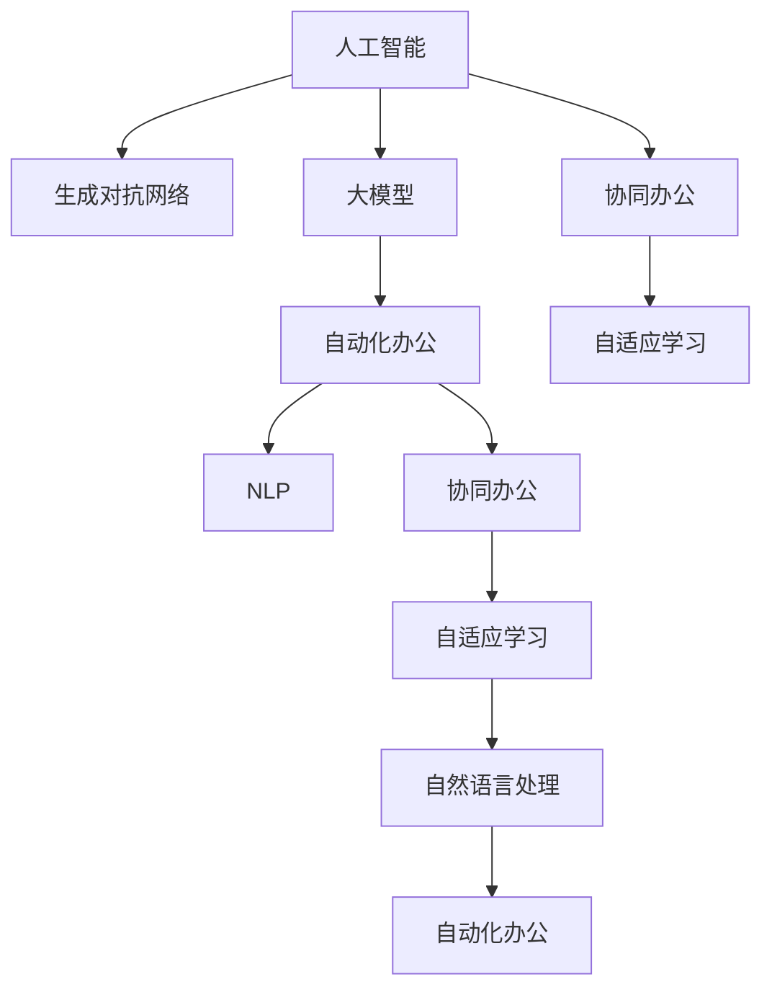

                 

# AIGC推动智能办公升级

> 关键词：人工智能（AI）、生成对抗网络（GAN）、大模型（Big Model）、自动化办公（Automated Office）、自然语言处理（NLP）、协同办公（Collaborative Office）、自适应学习（Adaptive Learning）

## 1. 背景介绍

随着数字化时代的到来，企业对于智能化、自动化的办公需求日益增强。传统的办公方式已难以满足现代企业对效率、灵活性和安全性的高要求。人工智能（AI）和大模型技术的发展，为实现智能办公提供了新的可能性。智能办公系统能够基于AI技术，自动处理文档、调度会议、分析数据、预测趋势，从而大幅提升办公效率和决策质量。本文章将详细介绍AIGC（人工智能、生成对抗网络、大模型）在智能办公中的应用，以及如何通过AIGC技术推动办公自动化升级。

### 1.1 问题由来
当前，企业办公流程繁琐复杂，大量时间耗费在文档处理、数据查询、会议协调等任务上。传统办公模式依赖人力驱动，存在响应慢、效率低、信息孤岛等问题。利用AI和大模型技术，可以在减少人工操作的同时，提升办公系统的智能化水平。生成对抗网络（GAN）和大模型不仅能处理大量数据，还能生成高质量的文本、图像、视频等，为智能办公提供强有力的技术支撑。

### 1.2 问题核心关键点
实现智能办公的关键在于：

- 选择适合的AI和大模型技术，以及合理的算法和模型架构。
- 优化数据处理流程，提高数据的质量和实时性。
- 设计符合实际需求的任务适配层，实现目标任务的自动化处理。
- 提供系统化的监控和评估手段，确保系统的稳定性和安全性。

本文将从原理到实践，系统地阐述AIGC在智能办公中的应用，并给出具体的实现案例和优化策略。

## 2. 核心概念与联系

### 2.1 核心概念概述

为更好地理解AIGC在智能办公中的应用，本节将介绍几个密切相关的核心概念：

- 人工智能（Artificial Intelligence, AI）：指模拟人类智能行为的机器智能系统，主要包括学习、推理、感知、语言理解等能力。
- 生成对抗网络（Generative Adversarial Networks, GAN）：一种基于对抗思想的生成模型，由生成器和判别器组成，用于生成逼真的文本、图像、视频等内容。
- 大模型（Big Model）：指具有大规模参数量和数据量的深度学习模型，能够处理复杂的数据结构和任务。
- 自动化办公（Automated Office）：利用AI技术自动完成常规性、重复性的办公任务，提升办公效率和质量。
- 自然语言处理（Natural Language Processing, NLP）：指利用AI技术处理、理解和生成自然语言的技术，如语音识别、文本分类、机器翻译等。
- 协同办公（Collaborative Office）：指通过AI技术实现办公人员间的实时协作，提升团队工作效率和协作质量。
- 自适应学习（Adaptive Learning）：指系统根据用户反馈自动调整策略和模型，提升系统的灵活性和适应性。

这些概念之间的逻辑关系可以通过以下Mermaid流程图来展示：



这个流程图展示了大模型、AI、GAN等技术如何共同作用于智能办公，并且相互之间的紧密联系。

## 3. 核心算法原理 & 具体操作步骤

### 3.1 算法原理概述

AIGC在智能办公中的应用主要依赖以下核心算法原理：

1. **人工智能与大模型技术**：通过在大规模数据上进行预训练，大模型能够学习到通用的语言、图像等表示，并在特定任务上进行微调，提升任务处理能力。
2. **生成对抗网络（GAN）**：通过对抗训练，GAN能够生成高质量的文本、图像、视频等内容，为自动化办公系统提供丰富、逼真的输入。
3. **自然语言处理（NLP）**：通过NLP技术，系统能够理解自然语言文本，自动生成摘要、分类、翻译等内容，并实现文档处理、语音识别等任务。
4. **协同办公与自适应学习**：通过协同办公系统，办公人员能够实时交互、共享信息，提升协作效率。自适应学习能够根据用户反馈和任务需求，动态调整模型参数和算法策略，确保系统性能的持续优化。

### 3.2 算法步骤详解

AIGC在智能办公中的应用主要包括以下几个关键步骤：

**Step 1: 数据收集与预处理**

- 收集办公场景中产生的数据，如文档、邮件、会议记录等。
- 清洗数据，去除噪音和冗余信息，确保数据的质量和格式一致。
- 进行标注，如文档分类、关键词提取、实体识别等，为模型训练提供监督信号。

**Step 2: 模型构建与微调**

- 选择合适的AI和大模型技术，如BERT、GPT等，进行预训练。
- 设计任务适配层，如分类器、生成器等，将预训练模型输出与办公任务对应。
- 使用少量标注数据进行微调，优化模型在特定任务上的表现。

**Step 3: 生成与推理**

- 利用GAN生成逼真的文档、图表、图像等内容，为自动化办公提供丰富的输入。
- 通过NLP技术处理自然语言文本，自动生成报告、摘要、翻译等内容。
- 设计高效的推理算法，实现任务的自动化处理和决策。

**Step 4: 协同与自适应**

- 通过协同办公系统，实现办公人员间的实时协作和信息共享。
- 引入自适应学习机制，根据用户反馈和任务需求，动态调整模型参数和算法策略。

**Step 5: 部署与监控**

- 将模型部署到实际办公系统中，实现智能化的文档处理、数据分析、会议调度等任务。
- 设计监控和评估机制，实时监测系统性能，并根据评估结果进行优化。

### 3.3 算法优缺点

AIGC在智能办公中的应用主要具有以下优点：

1. **提升办公效率**：通过自动化办公和协同办公系统，可以大幅提升文档处理、数据查询、会议调度的效率。
2. **增强决策质量**：利用AI和大模型技术，可以分析海量数据，生成高质量的报告和分析，提升决策的科学性和准确性。
3. **灵活性高**：通过自适应学习机制，可以根据用户需求和任务变化，动态调整模型策略，确保系统的灵活性和适应性。

但同时，AIGC在智能办公中也有一些缺点：

1. **数据依赖**：AIGC需要大量的高质量数据进行训练和微调，获取数据的过程可能复杂且成本高昂。
2. **复杂性高**：AIGC系统构建和部署复杂，需要专业的技术团队进行支撑。
3. **安全性**：涉及敏感数据和决策，需要严格的数据安全保障和隐私保护措施。
4. **可解释性不足**：AIGC系统的决策过程通常缺乏可解释性，难以理解和调试，可能会影响用户信任度。

### 3.4 算法应用领域

AIGC技术在智能办公中的应用领域广泛，主要包括以下几个方面：

- **文档自动化处理**：利用NLP技术自动处理文档，包括文档分类、关键词提取、实体识别、自动摘要等。
- **会议自动化调度**：利用AI技术自动安排会议时间和地点，生成会议议程，并提供会议记录和总结。
- **数据智能分析**：利用AI技术分析办公数据，生成数据报告、趋势预测和业务洞察，支持数据驱动的决策。
- **自然语言交互**：利用NLP技术实现人机交互，提供语音识别、自然语言理解和生成等能力，提升用户体验。
- **智能推荐系统**：利用AI技术推荐文档、资源、工具等，提高办公效率和资源利用率。

## 4. 数学模型和公式 & 详细讲解 & 举例说明

### 4.1 数学模型构建

为更好地理解AIGC在智能办公中的应用，本节将使用数学语言对AIGC模型的构建过程进行更加严格的刻画。

记预训练模型为 $M_{\theta}$，其中 $\theta$ 为模型参数。假设输入数据为 $x$，输出为 $y$。

- **人工智能模型**：
  - 输入：$x$
  - 输出：$y$
  - 损失函数：$\ell(y, \hat{y})$
  - 优化目标：$\mathop{\arg\min}_{\theta} \ell(y, M_{\theta}(x))$

- **生成对抗网络（GAN）模型**：
  - 生成器：$G(z)$，输入为噪声向量 $z$，输出为生成结果 $y$
  - 判别器：$D(y)$，输入为生成结果 $y$，输出为真实性概率 $p$
  - 优化目标：$\min_G \max_D V(D, G)$

- **自然语言处理（NLP）模型**：
  - 输入：$x$
  - 输出：$y$
  - 损失函数：$\ell(y, \hat{y})$
  - 优化目标：$\mathop{\arg\min}_{\theta} \ell(y, M_{\theta}(x))$

### 4.2 公式推导过程

以下我们以文档自动化处理为例，推导NLP模型的损失函数及其梯度计算公式。

假设输入文档为 $x$，模型输出为 $y$，真标签为 $y^*$。

- **交叉熵损失函数**：
  $$
  \ell(y, y^*) = -\sum_{i=1}^n (y_i^* \log y_i + (1-y_i^*) \log (1-y_i))
  $$

- **梯度计算公式**：
  $$
  \nabla_{\theta} \ell(y, y^*) = -\sum_{i=1}^n (y_i^* \frac{\partial y_i}{\partial \theta} - (1-y_i^*) \frac{\partial (1-y_i)}{\partial \theta})
  $$

在得到损失函数的梯度后，即可带入优化算法进行迭代优化。重复上述过程直至收敛，最终得到适应办公任务的最优模型参数 $\theta^*$。

## 5. 项目实践：代码实例和详细解释说明

### 5.1 开发环境搭建

在进行智能办公系统开发前，我们需要准备好开发环境。以下是使用Python进行PyTorch开发的环境配置流程：

1. 安装Anaconda：从官网下载并安装Anaconda，用于创建独立的Python环境。

2. 创建并激活虚拟环境：
```bash
conda create -n pytorch-env python=3.8 
conda activate pytorch-env
```

3. 安装PyTorch：根据CUDA版本，从官网获取对应的安装命令。例如：
```bash
conda install pytorch torchvision torchaudio cudatoolkit=11.1 -c pytorch -c conda-forge
```

4. 安装Transformers库：
```bash
pip install transformers
```

5. 安装各类工具包：
```bash
pip install numpy pandas scikit-learn matplotlib tqdm jupyter notebook ipython
```

完成上述步骤后，即可在`pytorch-env`环境中开始智能办公系统的开发。

### 5.2 源代码详细实现

下面我以文档自动化处理为例，给出使用Transformers库对BERT模型进行文档分类的PyTorch代码实现。

首先，定义文档分类任务的数据处理函数：

```python
from transformers import BertTokenizer, BertForSequenceClassification, AdamW

class DocumentClassificationDataset(Dataset):
    def __init__(self, texts, labels, tokenizer, max_len=128):
        self.texts = texts
        self.labels = labels
        self.tokenizer = tokenizer
        self.max_len = max_len
        
    def __len__(self):
        return len(self.texts)
    
    def __getitem__(self, item):
        text = self.texts[item]
        label = self.labels[item]
        
        encoding = self.tokenizer(text, return_tensors='pt', max_length=self.max_len, padding='max_length', truncation=True)
        input_ids = encoding['input_ids'][0]
        attention_mask = encoding['attention_mask'][0]
        
        # 对label进行编码
        label = label2id[label]
        
        return {'input_ids': input_ids, 
                'attention_mask': attention_mask,
                'labels': torch.tensor(label, dtype=torch.long)}
```

然后，定义模型和优化器：

```python
model = BertForSequenceClassification.from_pretrained('bert-base-cased', num_labels=5)

optimizer = AdamW(model.parameters(), lr=2e-5)
```

接着，定义训练和评估函数：

```python
from torch.utils.data import DataLoader
from tqdm import tqdm
from sklearn.metrics import classification_report

device = torch.device('cuda') if torch.cuda.is_available() else torch.device('cpu')
model.to(device)

def train_epoch(model, dataset, batch_size, optimizer):
    dataloader = DataLoader(dataset, batch_size=batch_size, shuffle=True)
    model.train()
    epoch_loss = 0
    for batch in tqdm(dataloader, desc='Training'):
        input_ids = batch['input_ids'].to(device)
        attention_mask = batch['attention_mask'].to(device)
        labels = batch['labels'].to(device)
        model.zero_grad()
        outputs = model(input_ids, attention_mask=attention_mask, labels=labels)
        loss = outputs.loss
        epoch_loss += loss.item()
        loss.backward()
        optimizer.step()
    return epoch_loss / len(dataloader)

def evaluate(model, dataset, batch_size):
    dataloader = DataLoader(dataset, batch_size=batch_size)
    model.eval()
    preds, labels = [], []
    with torch.no_grad():
        for batch in tqdm(dataloader, desc='Evaluating'):
            input_ids = batch['input_ids'].to(device)
            attention_mask = batch['attention_mask'].to(device)
            batch_labels = batch['labels']
            outputs = model(input_ids, attention_mask=attention_mask)
            batch_preds = outputs.logits.argmax(dim=2).to('cpu').tolist()
            batch_labels = batch_labels.to('cpu').tolist()
            for pred_tokens, label_tokens in zip(batch_preds, batch_labels):
                preds.append(pred_tokens)
                labels.append(label_tokens)
                
    print(classification_report(labels, preds))
```

最后，启动训练流程并在测试集上评估：

```python
epochs = 5
batch_size = 16

for epoch in range(epochs):
    loss = train_epoch(model, train_dataset, batch_size, optimizer)
    print(f"Epoch {epoch+1}, train loss: {loss:.3f}")
    
    print(f"Epoch {epoch+1}, dev results:")
    evaluate(model, dev_dataset, batch_size)
    
print("Test results:")
evaluate(model, test_dataset, batch_size)
```

以上就是使用PyTorch对BERT进行文档分类任务的完整代码实现。可以看到，得益于Transformers库的强大封装，我们可以用相对简洁的代码完成BERT模型的加载和微调。

### 5.3 代码解读与分析

让我们再详细解读一下关键代码的实现细节：

**DocumentClassificationDataset类**：
- `__init__`方法：初始化文本、标签、分词器等关键组件。
- `__len__`方法：返回数据集的样本数量。
- `__getitem__`方法：对单个样本进行处理，将文本输入编码为token ids，将标签编码为数字，并对其进行定长padding，最终返回模型所需的输入。

**tag2id和id2tag字典**：
- 定义了标签与数字id之间的映射关系，用于将token-wise的预测结果解码回真实的标签。

**训练和评估函数**：
- 使用PyTorch的DataLoader对数据集进行批次化加载，供模型训练和推理使用。
- 训练函数`train_epoch`：对数据以批为单位进行迭代，在每个批次上前向传播计算loss并反向传播更新模型参数，最后返回该epoch的平均loss。
- 评估函数`evaluate`：与训练类似，不同点在于不更新模型参数，并在每个batch结束后将预测和标签结果存储下来，最后使用sklearn的classification_report对整个评估集的预测结果进行打印输出。

**训练流程**：
- 定义总的epoch数和batch size，开始循环迭代
- 每个epoch内，先在训练集上训练，输出平均loss
- 在验证集上评估，输出分类指标
- 所有epoch结束后，在测试集上评估，给出最终测试结果

可以看到，PyTorch配合Transformers库使得BERT微调的代码实现变得简洁高效。开发者可以将更多精力放在数据处理、模型改进等高层逻辑上，而不必过多关注底层的实现细节。

当然，工业级的系统实现还需考虑更多因素，如模型的保存和部署、超参数的自动搜索、更灵活的任务适配层等。但核心的微调范式基本与此类似。

## 6. 实际应用场景

### 6.1 智能文档处理

智能文档处理系统是AIGC在智能办公中的重要应用。通过自动化文档分类、关键词提取、实体识别等任务，系统可以显著提升文档处理的效率和准确性。

在技术实现上，可以收集企业内部的文档数据，构建标注集，将文档进行分类、命名实体识别等处理，训练BERT等预训练模型，微调后实现自动化文档处理。微调后的模型能够自动识别文档类型、提取出关键信息和实体，并生成摘要和标签，从而大幅减少人工操作的工作量。

### 6.2 智能会议管理

智能会议管理系统利用AIGC技术，实现自动安排会议、生成会议议程、自动生成会议纪要等功能。系统通过自然语言处理技术，能够理解会议请求、安排会议时间和地点，并提供会议记录和总结。

在技术实现上，可以收集会议数据，构建标注集，使用BERT等模型进行会议任务处理。微调后的模型能够自动理解会议请求，生成议程和记录，提高会议管理的效率和质量。

### 6.3 智能数据分析

智能数据分析系统利用AIGC技术，对办公数据进行深度分析和智能推荐，提供数据洞察和决策支持。系统通过自然语言处理技术，能够自动分析文档、邮件、报表等数据，生成数据报告和趋势预测，辅助决策。

在技术实现上，可以收集企业内部的数据，构建标注集，使用BERT等模型进行数据分析和处理。微调后的模型能够自动提取数据中的关键信息，生成分析报告和趋势预测，帮助企业做出更科学、更及时的决策。

### 6.4 未来应用展望

随着AIGC技术的不断进步，其应用场景也将更加广泛和深入。未来，AIGC将在智能办公中发挥更大的作用，推动办公自动化和智能化进程。

在智慧医疗领域，基于AIGC的医疗智能系统能够自动处理患者数据、生成诊断报告、推荐治疗方案，提升医疗服务的智能化水平。

在智能教育领域，基于AIGC的智能教育系统能够自动生成教学内容、推荐学习资源、评估学习效果，提升教学质量和个性化程度。

在智慧城市治理中，基于AIGC的智能治理系统能够自动监测城市事件、分析舆情趋势、辅助决策，提高城市管理的智能化水平。

此外，在企业生产、社会治理、文娱传媒等众多领域，基于AIGC的智能系统也将不断涌现，为各行各业带来变革性影响。

## 7. 工具和资源推荐

### 7.1 学习资源推荐

为了帮助开发者系统掌握AIGC技术在智能办公中的应用，这里推荐一些优质的学习资源：

1. 《Transformers: A State-of-the-Art Text-to-Text Transformer》论文：论文介绍了Transformer模型及其在自然语言处理中的应用，为AIGC技术的理论基础提供支撑。
2. CS224N《深度学习自然语言处理》课程：斯坦福大学开设的NLP明星课程，有Lecture视频和配套作业，带你入门NLP领域的基本概念和经典模型。
3. 《Natural Language Processing with Python》书籍：Python语言下自然语言处理的经典教材，介绍了NLP技术的核心算法和实现细节。
4. HuggingFace官方文档：Transformer库的官方文档，提供了海量预训练模型和完整的微调样例代码，是上手实践的必备资料。
5. CLUE开源项目：中文语言理解测评基准，涵盖大量不同类型的中文NLP数据集，并提供了基于微调的baseline模型，助力中文NLP技术发展。

通过对这些资源的学习实践，相信你一定能够快速掌握AIGC技术在智能办公中的应用，并用于解决实际的NLP问题。

### 7.2 开发工具推荐

高效的开发离不开优秀的工具支持。以下是几款用于AIGC技术在智能办公中的应用开发的常用工具：

1. PyTorch：基于Python的开源深度学习框架，灵活动态的计算图，适合快速迭代研究。大部分预训练语言模型都有PyTorch版本的实现。
2. TensorFlow：由Google主导开发的开源深度学习框架，生产部署方便，适合大规模工程应用。同样有丰富的预训练语言模型资源。
3. Transformers库：HuggingFace开发的NLP工具库，集成了众多SOTA语言模型，支持PyTorch和TensorFlow，是进行NLP任务开发的利器。
4. Weights & Biases：模型训练的实验跟踪工具，可以记录和可视化模型训练过程中的各项指标，方便对比和调优。与主流深度学习框架无缝集成。
5. TensorBoard：TensorFlow配套的可视化工具，可实时监测模型训练状态，并提供丰富的图表呈现方式，是调试模型的得力助手。
6. Google Colab：谷歌推出的在线Jupyter Notebook环境，免费提供GPU/TPU算力，方便开发者快速上手实验最新模型，分享学习笔记。

合理利用这些工具，可以显著提升AIGC技术在智能办公中的应用开发效率，加快创新迭代的步伐。

### 7.3 相关论文推荐

AIGC技术的发展源于学界的持续研究。以下是几篇奠基性的相关论文，推荐阅读：

1. Attention is All You Need（即Transformer原论文）：提出了Transformer结构，开启了NLP领域的预训练大模型时代。
2. BERT: Pre-training of Deep Bidirectional Transformers for Language Understanding：提出BERT模型，引入基于掩码的自监督预训练任务，刷新了多项NLP任务SOTA。
3. Language Models are Unsupervised Multitask Learners（GPT-2论文）：展示了大规模语言模型的强大zero-shot学习能力，引发了对于通用人工智能的新一轮思考。
4. Adversarial Examples and Deep Learning：介绍生成对抗网络（GAN）的基本原理和应用，为AIGC技术提供理论支撑。
5. Generative Adversarial Networks: A General Framework for Natural Language Generation：介绍GAN在大模型生成文本中的应用，为AIGC技术提供新的思路。

这些论文代表了大模型和GAN技术的发展脉络。通过学习这些前沿成果，可以帮助研究者把握学科前进方向，激发更多的创新灵感。

## 8. 总结：未来发展趋势与挑战

### 8.1 总结

本文对AIGC技术在智能办公中的应用进行了全面系统的介绍。首先阐述了AIGC技术在智能办公中的研究背景和意义，明确了AIGC技术在提升办公效率、决策质量、协作效率等方面的独特价值。其次，从原理到实践，详细讲解了AIGC技术在智能文档处理、会议管理、数据分析等实际应用中的实现流程和算法步骤，给出了具体的代码实例和优化策略。同时，本文还广泛探讨了AIGC技术在多个行业领域的应用前景，展示了AIGC技术的广泛适用性和潜力。

通过本文的系统梳理，可以看到，AIGC技术正在成为智能办公的重要支撑，极大地提升了办公系统的智能化水平。随着AIGC技术的不断进步，基于AIGC技术的智能办公系统必将迎来更加广泛的应用，为各行各业带来深远的变革。

### 8.2 未来发展趋势

展望未来，AIGC技术在智能办公中的应用将呈现以下几个发展趋势：

1. **技术深度融合**：AIGC技术将与IoT、5G等技术深度融合，推动办公自动化和智能化进程。
2. **多模态融合**：基于AIGC技术的智能办公系统将融合文本、图像、语音等多模态信息，实现更全面、精准的办公应用。
3. **个性化定制**：通过自适应学习机制，AIGC技术将实现更个性化的办公体验和决策支持。
4. **跨领域应用**：AIGC技术将在更多行业领域中得到应用，推动各行各业的数字化转型和智能化升级。

以上趋势凸显了AIGC技术在智能办公中的巨大潜力和应用前景。这些方向的探索发展，必将进一步提升办公系统的性能和应用范围，为人类认知智能的进化带来深远影响。

### 8.3 面临的挑战

尽管AIGC技术在智能办公中已经取得了瞩目成就，但在迈向更加智能化、普适化应用的过程中，它仍面临着诸多挑战：

1. **数据质量和安全**：AIGC技术需要高质量的数据进行训练和微调，获取和处理数据的过程可能复杂且成本高昂，且数据隐私和安全问题不容忽视。
2. **模型复杂性和成本**：AIGC技术的构建和部署复杂，需要专业的技术团队进行支撑，且模型训练和推理成本高昂。
3. **可解释性和可控性**：AIGC系统的决策过程通常缺乏可解释性，难以理解和调试，可能会影响用户信任度。

### 8.4 研究展望

面对AIGC技术面临的挑战，未来的研究需要在以下几个方面寻求新的突破：

1. **数据治理和隐私保护**：如何构建高效、安全的数据治理机制，确保数据质量和安全，是AIGC技术应用的关键。
2. **模型压缩和优化**：如何降低模型复杂性和成本，实现轻量级、实时性的部署，是AIGC技术发展的核心方向。
3. **可解释性和可控性**：如何增强AIGC系统的可解释性和可控性，确保其决策过程透明、可理解，是提升用户信任度的重要手段。
4. **跨领域应用**：如何将AIGC技术应用于更多领域，推动各行各业的数字化转型和智能化升级，是未来研究的重要方向。

这些研究方向的探索，必将引领AIGC技术在智能办公中的应用走向更高的台阶，为构建安全、可靠、可解释、可控的智能办公系统铺平道路。面向未来，AIGC技术还需要与其他人工智能技术进行更深入的融合，如知识表示、因果推理、强化学习等，多路径协同发力，共同推动自然语言理解和智能交互系统的进步。只有勇于创新、敢于突破，才能不断拓展AIGC技术的边界，让智能技术更好地造福人类社会。

## 9. 附录：常见问题与解答

**Q1：AIGC技术在智能办公中的应用是否仅限于文本处理？**

A: AIGC技术在智能办公中的应用不仅限于文本处理。AIGC技术还包括图像、视频等多模态数据的生成和处理，可以用于智能文档处理、智能会议管理、智能数据分析等任务。例如，利用GAN技术生成逼真的文档、图表、图像等内容，为自动化办公系统提供丰富、逼真的输入。

**Q2：如何评估AIGC系统的性能？**

A: 评估AIGC系统的性能通常采用以下几种指标：

1. **准确率**：模型预测结果与真实结果的匹配程度。
2. **召回率**：模型识别出的正样本占真实正样本的比例。
3. **F1值**：准确率和召回率的调和平均数，综合考虑了模型预测的准确性和全面性。
4. **ROC曲线和AUC值**：用于评估模型在不同阈值下的性能。
5. **交互式评估**：通过用户反馈和交互评估模型的实用性，确保系统能够满足实际需求。

**Q3：AIGC技术在智能办公中如何提升决策质量？**

A: AIGC技术在智能办公中可以通过以下方式提升决策质量：

1. **数据挖掘与分析**：利用AIGC技术对海量数据进行深度分析和挖掘，生成数据报告和趋势预测，辅助决策。
2. **自动化报表生成**：自动生成办公报表，提高数据分析和报告生成效率。
3. **智能推荐系统**：利用AIGC技术推荐文档、资源、工具等，提高办公效率和资源利用率。
4. **智能会议系统**：自动安排会议时间和地点，生成会议议程和纪要，提升会议管理效率和质量。
5. **自动化任务处理**：利用AIGC技术自动处理文档、邮件、报表等任务，减少人工操作的工作量，提高办公效率。

**Q4：AIGC技术在智能办公中的应用是否存在伦理和法律问题？**

A: AIGC技术在智能办公中的应用确实存在伦理和法律问题。例如，生成的文本、图像、视频等内容可能涉及版权、隐私等问题，需要严格的数据版权管理和隐私保护措施。同时，AIGC系统的决策过程可能缺乏可解释性，难以解释其内部工作机制和决策逻辑，可能影响用户信任度。

**Q5：AIGC技术在智能办公中的构建和部署是否复杂？**

A: AIGC技术在智能办公中的构建和部署确实相对复杂。需要选择合适的预训练模型和任务适配层，设计有效的训练和微调策略，选择合适的优化算法和超参数。同时，需要考虑模型的存储和推理效率，设计高效的数据处理和推理算法，以确保系统性能和响应速度。

**Q6：AIGC技术在智能办公中的应用是否会带来信息孤岛的问题？**

A: AIGC技术在智能办公中的应用可能会带来信息孤岛的问题。如果系统无法实现跨平台、跨系统的数据共享和协同，可能无法充分利用企业内部和外部的数据资源，导致信息孤岛的产生。

---

作者：禅与计算机程序设计艺术 / Zen and the Art of Computer Programming

