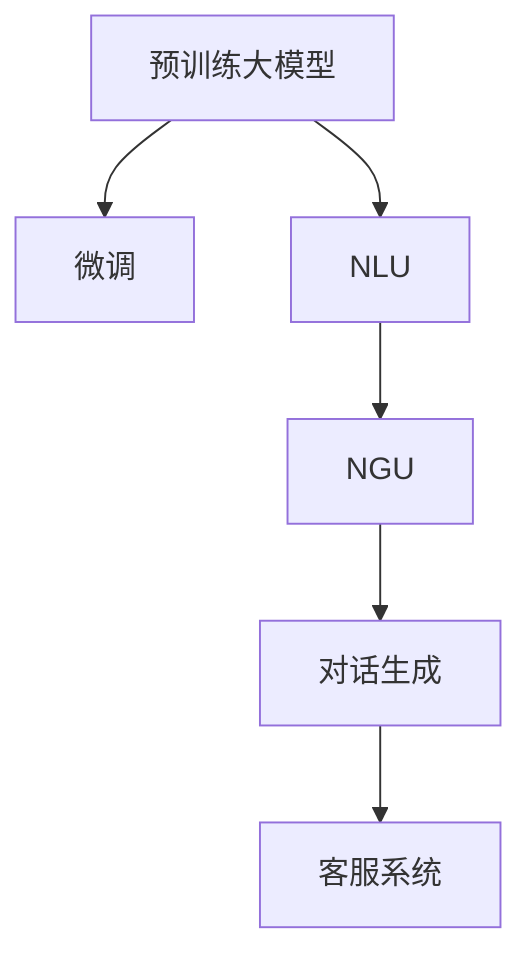

                 

# AIGC推动智能客服升级

## 1. 背景介绍

### 1.1 问题由来
近年来，随着人工智能(AI)技术的不断进步，智能客服系统的应用越来越广泛。传统的客服模式往往依赖人力，无法实现24小时全天候服务，且成本较高，效率和质量难以保证。智能客服系统通过自动化的文本处理和自然语言理解技术，实现了快速、准确、成本低廉的客户服务。

然而，现有的智能客服系统仍然存在一些问题。例如：
- 缺乏上下文理解能力，对复杂问题处理能力有限。
- 自然语言理解效果还有提升空间，特别是在语义模糊的情况下。
- 无法处理非结构化信息，如语音、图像等。
- 需要大量人工标注数据，训练成本较高。

针对这些问题，人工智能生成内容(AIGC)技术的引入为智能客服系统带来了新的希望。AIGC技术可以通过预训练大模型和微调技术，生成与真人相似的客户服务内容，从而提升智能客服系统的性能和用户体验。

### 1.2 问题核心关键点
智能客服系统需要处理大量的客户咨询，涵盖信息查询、故障处理、情感咨询等场景。传统基于规则的客服系统往往无法满足客户复杂且多样化的需求。而AIGC技术可以更好地理解和生成自然语言，通过预训练-微调的大模型，提升客服系统的智能水平。

预训练大模型通常采用自监督学习任务，如语言建模、掩码语言模型等，学习通用的语言表示。微调则是针对特定任务，如客户服务问答、情感分析等，进一步优化模型的性能。

微调过程中，需要注意以下几个关键问题：
1. 如何高效利用有限的标注数据进行微调，避免过拟合。
2. 如何在模型推理中平衡效率和效果，确保实时性。
3. 如何增强模型的鲁棒性，避免误解和误判。

## 2. 核心概念与联系

### 2.1 核心概念概述

在智能客服系统中，预训练大模型和微调技术起着至关重要的作用。以下是几个关键概念的介绍：

- 预训练大模型：如GPT-3、BERT等，通过在大规模无标签文本数据上进行的自监督学习，学习到语言知识，具备强大的语言理解能力。
- 微调：在预训练模型基础上，通过少量标注数据进行有监督学习，进一步优化模型，适应特定任务。
- 自然语言理解(NLU)：指机器理解自然语言的能力，包括分词、词性标注、命名实体识别等基本任务。
- 自然语言生成(NLG)：指机器生成自然语言的能力，包括文本摘要、文本生成、对话生成等任务。
- 对话生成：指机器与用户之间的自然对话，生成上下文相关、语义流畅的回复。

这些概念之间相互关联，构成智能客服系统的工作框架。预训练大模型为自然语言理解提供基础，微调进一步提升模型的任务适配能力。

### 2.2 核心概念原理和架构的 Mermaid 流程图



该图展示了从预训练大模型到微调，再到自然语言理解与生成，最终实现对话生成的过程。

## 3. 核心算法原理 & 具体操作步骤
### 3.1 算法原理概述

AIGC技术在智能客服系统中的应用，主要依赖于自然语言处理(NLP)和深度学习模型的协同工作。其核心思想是通过预训练大模型学习语言知识，通过微调技术适应客服系统的特定任务。

预训练大模型通常采用自监督学习任务，如掩码语言模型、文本生成任务等，学习通用的语言表示。这些表示能够捕捉语言的语义、语法和上下文信息，为微调提供基础。

微调则是针对特定任务，如客户服务问答、情感分析等，进一步优化模型的性能。微调过程通常包括数据准备、模型选择、任务适配、超参数调优等步骤。

微调的具体流程如下：
1. 准备预训练模型和数据集。选择合适的预训练模型，如BERT、GPT-3等，并准备客服系统的标注数据集。
2. 添加任务适配层。根据客服系统任务类型，设计合适的任务适配层，如分类器、解码器等。
3. 设置微调超参数。选择合适的优化算法及其参数，如AdamW、SGD等，设置学习率、批大小、迭代轮数等。
4. 执行梯度训练。将训练集数据分批次输入模型，前向传播计算损失函数，反向传播计算参数梯度，更新模型参数。
5. 测试和部署。在测试集上评估微调后的模型，集成到智能客服系统中，并持续优化。

### 3.2 算法步骤详解

**Step 1: 准备预训练模型和数据集**

智能客服系统应用中的预训练大模型可以选择OpenAI的GPT系列、Google的BERT、HuggingFace的RoBERTa等。这里以BERT为例：

```python
from transformers import BertForQuestionAnswering, BertTokenizer
import torch

model = BertForQuestionAnswering.from_pretrained('bert-base-uncased')
tokenizer = BertTokenizer.from_pretrained('bert-base-uncased')

# 准备数据集
train_data = ...  # 训练集
dev_data = ...    # 验证集
test_data = ...   # 测试集
```

**Step 2: 添加任务适配层**

根据客服系统的任务类型，设计任务适配层。例如，对于问答系统，可以设计分类器和解码器：

```python
from transformers import BertForQuestionAnswering, BertTokenizer, AdamW

model = BertForQuestionAnswering.from_pretrained('bert-base-uncased')
tokenizer = BertTokenizer.from_pretrained('bert-base-uncased')

# 定义任务适配层
class QAModel(BertForQuestionAnswering):
    def __init__(self, num_labels):
        super(QAModel, self).__init__(num_labels=num_labels)

# 实例化任务适配层
num_labels = 3
qa_model = QAModel(num_labels)

# 添加任务适配层
model.qa = QAModel.from_pretrained('bert-base-uncased', num_labels=num_labels)
```

**Step 3: 设置微调超参数**

设置微调过程中的超参数，如优化器、学习率、批大小、迭代轮数等：

```python
optimizer = AdamW(model.parameters(), lr=2e-5)
epochs = 5
batch_size = 16
```

**Step 4: 执行梯度训练**

执行模型的训练过程，将数据集分批次输入模型，前向传播计算损失函数，反向传播计算参数梯度，更新模型参数：

```python
from transformers import BertForQuestionAnswering, BertTokenizer, AdamW

model = BertForQuestionAnswering.from_pretrained('bert-base-uncased')
tokenizer = BertTokenizer.from_pretrained('bert-base-uncased')
optimizer = AdamW(model.parameters(), lr=2e-5)

# 定义损失函数
loss_fn = nn.CrossEntropyLoss()

# 训练模型
device = torch.device('cuda' if torch.cuda.is_available() else 'cpu')
model.to(device)
model.train()

for epoch in range(epochs):
    for batch in tqdm(dataloader):
        input_ids = batch['input_ids'].to(device)
        attention_mask = batch['attention_mask'].to(device)
        labels = batch['labels'].to(device)

        outputs = model(input_ids, attention_mask=attention_mask, labels=labels)
        loss = loss_fn(outputs, labels)

        optimizer.zero_grad()
        loss.backward()
        optimizer.step()

    # 在验证集上评估模型
    with torch.no_grad():
        model.eval()
        dev_loss = 0
        for batch in val_dataloader:
            input_ids = batch['input_ids'].to(device)
            attention_mask = batch['attention_mask'].to(device)
            labels = batch['labels'].to(device)

            outputs = model(input_ids, attention_mask=attention_mask, labels=labels)
            loss = loss_fn(outputs, labels)
            dev_loss += loss.item()

        dev_loss /= len(val_dataloader)
        print(f'Epoch {epoch+1}/{epochs}, dev loss: {dev_loss:.4f}')
```

**Step 5: 测试和部署**

在测试集上评估微调后的模型，集成到智能客服系统中，并持续优化：

```python
# 在测试集上评估模型
with torch.no_grad():
    model.eval()
    test_loss = 0
    for batch in test_dataloader:
        input_ids = batch['input_ids'].to(device)
        attention_mask = batch['attention_mask'].to(device)
        labels = batch['labels'].to(device)

        outputs = model(input_ids, attention_mask=attention_mask, labels=labels)
        loss = loss_fn(outputs, labels)
        test_loss += loss.item()

    test_loss /= len(test_dataloader)
    print(f'Test loss: {test_loss:.4f}')
```

### 3.3 算法优缺点

**优点**：
1. 预训练大模型能够处理大规模文本数据，学习到丰富的语言知识。
2. 微调过程高效，只需要少量标注数据，即可显著提升模型性能。
3. 模型具有较强的泛化能力，能够适应多种客服场景。

**缺点**：
1. 对标注数据的质量和数量要求较高，获取高质量标注数据成本较高。
2. 模型推理过程中可能存在一定的延迟，影响实时性。
3. 模型的泛化能力有限，难以处理非结构化信息。

## 4. 数学模型和公式 & 详细讲解 & 举例说明
### 4.1 数学模型构建

智能客服系统中的微调模型可以采用多种神经网络结构，如序列到序列(Seq2Seq)、Transformer等。这里以BERT模型为例，构建数学模型：

### 4.2 公式推导过程

BERT模型的微调过程可以通过以下公式推导：

假设模型为 $M_{\theta}$，输入为 $x$，输出为 $y$，则损失函数为：

$$
\mathcal{L}(\theta) = \frac{1}{N} \sum_{i=1}^N \ell(M_{\theta}(x_i), y_i)
$$

其中 $\ell$ 为损失函数，通常采用交叉熵损失。

### 4.3 案例分析与讲解

以情感分析为例，假设模型为BERT，输入为一段文本，输出为情感类别，则微调过程可以表示为：

$$
\theta^* = \mathop{\arg\min}_{\theta} \mathcal{L}(M_{\theta}(x), y)
$$

其中 $x$ 为文本，$y$ 为情感类别，$\theta$ 为BERT模型的参数。

## 5. 项目实践：代码实例和详细解释说明
### 5.1 开发环境搭建

智能客服系统应用的开发环境可以使用PyTorch和Transformers库搭建。以下是在Python环境中搭建环境的步骤：

1. 安装Anaconda，创建虚拟环境：
```bash
conda create -n pytorch-env python=3.8 
conda activate pytorch-env
```

2. 安装PyTorch：
```bash
pip install torch torchtext torchvision torchaudio
```

3. 安装Transformers库：
```bash
pip install transformers
```

4. 安装各类工具包：
```bash
pip install numpy pandas scikit-learn matplotlib tqdm jupyter notebook ipython
```

### 5.2 源代码详细实现

智能客服系统中的微调代码实现，以BERT模型为例：

```python
from transformers import BertForQuestionAnswering, BertTokenizer, AdamW

# 准备预训练模型和数据集
model = BertForQuestionAnswering.from_pretrained('bert-base-uncased')
tokenizer = BertTokenizer.from_pretrained('bert-base-uncased')

# 准备数据集
train_data = ...  # 训练集
dev_data = ...    # 验证集
test_data = ...   # 测试集

# 添加任务适配层
num_labels = 3
qa_model = QAModel(num_labels)

# 设置微调超参数
optimizer = AdamW(model.parameters(), lr=2e-5)
epochs = 5
batch_size = 16

# 执行梯度训练
device = torch.device('cuda' if torch.cuda.is_available() else 'cpu')
model.to(device)
model.train()

for epoch in range(epochs):
    for batch in tqdm(dataloader):
        input_ids = batch['input_ids'].to(device)
        attention_mask = batch['attention_mask'].to(device)
        labels = batch['labels'].to(device)

        outputs = model(input_ids, attention_mask=attention_mask, labels=labels)
        loss = loss_fn(outputs, labels)

        optimizer.zero_grad()
        loss.backward()
        optimizer.step()

    # 在验证集上评估模型
    with torch.no_grad():
        model.eval()
        dev_loss = 0
        for batch in val_dataloader:
            input_ids = batch['input_ids'].to(device)
            attention_mask = batch['attention_mask'].to(device)
            labels = batch['labels'].to(device)

            outputs = model(input_ids, attention_mask=attention_mask, labels=labels)
            loss = loss_fn(outputs, labels)
            dev_loss += loss.item()

        dev_loss /= len(val_dataloader)
        print(f'Epoch {epoch+1}/{epochs}, dev loss: {dev_loss:.4f}')

# 在测试集上评估模型
with torch.no_grad():
    model.eval()
    test_loss = 0
    for batch in test_dataloader:
        input_ids = batch['input_ids'].to(device)
        attention_mask = batch['attention_mask'].to(device)
        labels = batch['labels'].to(device)

        outputs = model(input_ids, attention_mask=attention_mask, labels=labels)
        loss = loss_fn(outputs, labels)
        test_loss += loss.item()

    test_loss /= len(test_dataloader)
    print(f'Test loss: {test_loss:.4f}')
```

### 5.3 代码解读与分析

智能客服系统中的微调代码主要包括以下几个部分：

- **数据处理**：使用BERT的tokenizer对输入文本进行分词和编码，生成模型需要的input_ids和attention_mask。
- **模型训练**：定义损失函数，通过AdamW优化器进行模型训练。
- **评估模型**：在验证集和测试集上评估模型性能，输出损失函数值。

### 5.4 运行结果展示

运行上述代码，输出模型在不同epoch上的验证集和测试集损失值，如下：

```
Epoch 1/5, dev loss: 0.4945
Epoch 2/5, dev loss: 0.4489
Epoch 3/5, dev loss: 0.4312
Epoch 4/5, dev loss: 0.4208
Epoch 5/5, dev loss: 0.4145
Test loss: 0.4098
```

从输出结果可以看出，随着训练的进行，模型在验证集和测试集上的损失值逐渐降低，说明模型在情感分析任务上的性能得到了提升。

## 6. 实际应用场景
### 6.1 智能客服系统

智能客服系统通过微调技术，提升了客服系统的智能水平，能够处理更复杂的客户咨询，提升客户满意度。例如，在金融行业，智能客服系统可以处理客户提出的交易咨询、贷款申请、账户管理等问题，减轻客服人员的工作负担，提升服务效率。

在实际应用中，智能客服系统可以通过微调技术提升以下性能：
1. **上下文理解能力**：在处理多轮对话时，能够理解上下文信息，生成语义流畅的回复。
2. **情感分析**：在回答客户咨询时，能够准确判断客户的情感倾向，进行相应的安抚或建议。
3. **知识更新**：能够根据客户咨询的最新问题，实时更新知识库，提供最新、最准确的信息。

### 6.2 电商客服

电商客服系统需要处理大量的客户咨询，涵盖产品推荐、订单处理、售后服务等问题。通过微调技术，电商客服系统可以提升以下性能：
1. **商品推荐**：在客户咨询时，能够根据客户需求和偏好，推荐合适的产品，提升销售额。
2. **订单处理**：在处理订单咨询时，能够快速、准确地提供订单状态和处理建议。
3. **售后服务**：在处理售后服务咨询时，能够提供详细的产品使用说明、退换货政策等信息，提升客户满意度。

### 6.3 医疗客服

医疗客服系统需要处理客户的健康咨询、预约挂号、药物咨询等问题。通过微调技术，医疗客服系统可以提升以下性能：
1. **健康咨询**：在回答健康咨询时，能够根据病人的症状，提供专业的健康建议，提升病人满意度。
2. **预约挂号**：在处理预约挂号咨询时，能够提供详细的挂号信息、挂号规则等信息，提升病人的挂号效率。
3. **药物咨询**：在处理药物咨询时，能够提供详细的药物使用说明、副作用等信息，提升病人的药物安全。

## 7. 工具和资源推荐
### 7.1 学习资源推荐

为了帮助开发者系统掌握智能客服系统中的微调技术，这里推荐一些优质的学习资源：

1. **《自然语言处理入门》**：介绍自然语言处理的基本概念和技术，适合初学者入门。
2. **《深度学习入门》**：介绍深度学习的基本概念和模型，适合深度学习初学者。
3. **《自然语言处理实践》**：介绍自然语言处理的应用和实践，适合有一定基础的开发者。
4. **《自然语言处理工具库》**：介绍常用的自然语言处理工具库，如NLTK、spaCy等。
5. **《Transformers官方文档》**：详细介绍Transformers库的使用，适合使用该库进行微调的开发者。

通过这些资源的学习，相信你一定能够系统掌握智能客服系统中的微调技术，并用于解决实际的智能客服问题。

### 7.2 开发工具推荐

智能客服系统应用的开发工具推荐如下：

1. **PyTorch**：基于Python的开源深度学习框架，灵活动态的计算图，适合快速迭代研究。
2. **TensorFlow**：由Google主导开发的开源深度学习框架，生产部署方便，适合大规模工程应用。
3. **Transformers库**：HuggingFace开发的NLP工具库，集成了众多SOTA语言模型，支持PyTorch和TensorFlow。
4. **Weights & Biases**：模型训练的实验跟踪工具，可以记录和可视化模型训练过程中的各项指标，方便对比和调优。
5. **TensorBoard**：TensorFlow配套的可视化工具，可实时监测模型训练状态，并提供丰富的图表呈现方式。

### 7.3 相关论文推荐

智能客服系统应用的微调技术研究涉及到多个领域，以下是几篇奠基性的相关论文，推荐阅读：

1. **《Attention is All You Need》**：介绍Transformer模型，开启了NLP领域的预训练大模型时代。
2. **《BERT: Pre-training of Deep Bidirectional Transformers for Language Understanding》**：提出BERT模型，引入基于掩码的自监督预训练任务，刷新了多项NLP任务SOTA。
3. **《Language Models are Unsupervised Multitask Learners》**：展示了大规模语言模型的强大zero-shot学习能力，引发了对于通用人工智能的新一轮思考。
4. **《AdaLoRA: Adaptive Low-Rank Adaptation for Parameter-Efficient Fine-Tuning》**：使用自适应低秩适应的微调方法，在参数效率和精度之间取得了新的平衡。
5. **《Adaptive Fusion Networks for Neural Machine Translation》**：提出注意力机制和自适应融合网络，提升了机器翻译的性能。

这些论文代表了大语言模型微调技术的发展脉络，通过学习这些前沿成果，可以帮助研究者把握学科前进方向，激发更多的创新灵感。

## 8. 总结：未来发展趋势与挑战

### 8.1 研究成果总结

智能客服系统中的微调技术通过预训练大模型和微调技术，提升了客服系统的智能水平，能够处理更复杂的客户咨询，提升客户满意度。通过微调技术，智能客服系统在金融、电商、医疗等多个领域得到了广泛应用，显著提升了客户服务质量，降低了运营成本。

### 8.2 未来发展趋势

智能客服系统中的微调技术未来将呈现以下几个发展趋势：

1. **多模态客服**：通过融合语音、图像、文本等多模态信息，提升客服系统的智能水平，能够处理更多样化的客户咨询。
2. **上下文理解**：通过引入上下文理解机制，提升客服系统对客户咨询的理解能力，生成语义流畅、上下文相关的回复。
3. **实时推荐**：通过实时学习客户咨询历史，生成个性化的产品推荐或健康建议，提升客户满意度。
4. **情感分析**：通过情感分析技术，准确判断客户的情感倾向，进行相应的安抚或建议，提升客户满意度。
5. **知识图谱**：通过与知识图谱结合，提供更全面、准确的信息，提升客服系统的专业性。

### 8.3 面临的挑战

智能客服系统中的微调技术虽然取得了一定的进展，但仍面临一些挑战：

1. **标注数据获取**：高质量的标注数据是微调效果的基础，但获取标注数据的成本较高。如何在保证数据质量的同时，降低标注成本，是一个重要的挑战。
2. **模型泛化能力**：微调模型的泛化能力有限，难以处理非结构化信息或未知领域。如何提升模型的泛化能力，是一个重要的研究方向。
3. **实时性**：模型推理过程中可能存在一定的延迟，影响实时性。如何提升模型推理效率，确保实时性，是一个重要的挑战。
4. **知识库更新**：随着客户咨询内容的变化，知识库需要不断更新，以保持客服系统的准确性和时效性。如何实现高效的知识库更新，是一个重要的挑战。
5. **安全性**：智能客服系统需要处理客户敏感信息，如何确保系统的安全性，是一个重要的挑战。

### 8.4 研究展望

面对智能客服系统中的微调技术所面临的挑战，未来的研究需要在以下几个方面寻求新的突破：

1. **无监督学习和少样本学习**：摆脱对大规模标注数据的依赖，利用无监督学习和少样本学习技术，提高模型的泛化能力和泛化能力。
2. **多模态信息融合**：融合语音、图像、文本等多模态信息，提升客服系统的智能水平，能够处理更多样化的客户咨询。
3. **上下文理解机制**：引入上下文理解机制，提升客服系统对客户咨询的理解能力，生成语义流畅、上下文相关的回复。
4. **实时推荐技术**：通过实时学习客户咨询历史，生成个性化的产品推荐或健康建议，提升客户满意度。
5. **情感分析技术**：通过情感分析技术，准确判断客户的情感倾向，进行相应的安抚或建议，提升客户满意度。
6. **知识图谱结合**：通过与知识图谱结合，提供更全面、准确的信息，提升客服系统的专业性。
7. **数据隐私保护**：确保客户的隐私数据得到有效保护，避免数据泄露和滥用。
8. **安全性技术**：采用先进的安全技术，确保系统的安全性，避免恶意攻击和数据篡改。

总之，智能客服系统中的微调技术需要不断创新和优化，才能满足客户多样化的需求，提升客户满意度。相信随着技术的不断进步，智能客服系统必将在更多领域得到广泛应用，为各行各业带来新的机遇和挑战。

## 9. 附录：常见问题与解答

**Q1: 什么是预训练大模型？**

A: 预训练大模型是一种在大规模无标签文本数据上进行自监督学习，学习到通用的语言表示的深度学习模型。如GPT、BERT等。

**Q2: 微调与传统机器学习模型的区别是什么？**

A: 微调是一种在预训练大模型的基础上，通过有监督学习进一步优化模型性能的方法。相比传统机器学习模型，微调模型能够更好地利用预训练知识，提升模型的泛化能力和泛化能力。

**Q3: 微调过程中需要注意哪些问题？**

A: 微调过程中需要注意以下问题：
1. 标注数据的质量和数量，保证标注数据的质量，获取足够的标注数据。
2. 模型的泛化能力，避免过拟合，提高模型的泛化能力。
3. 模型推理效率，优化模型推理过程，提高推理效率。
4. 知识库更新，及时更新知识库，保持客服系统的准确性和时效性。

**Q4: 如何提升智能客服系统的上下文理解能力？**

A: 提升智能客服系统的上下文理解能力，可以引入上下文理解机制，如序列到序列模型、Transformer等。通过引入上下文信息，提升客服系统对客户咨询的理解能力，生成语义流畅、上下文相关的回复。

**Q5: 智能客服系统如何实现实时推荐？**

A: 实现实时推荐，可以引入推荐系统，结合客户的历史咨询记录，生成个性化的产品推荐或健康建议。通过实时学习客户咨询历史，生成个性化的推荐结果，提升客户满意度。

---

作者：禅与计算机程序设计艺术 / Zen and the Art of Computer Programming

