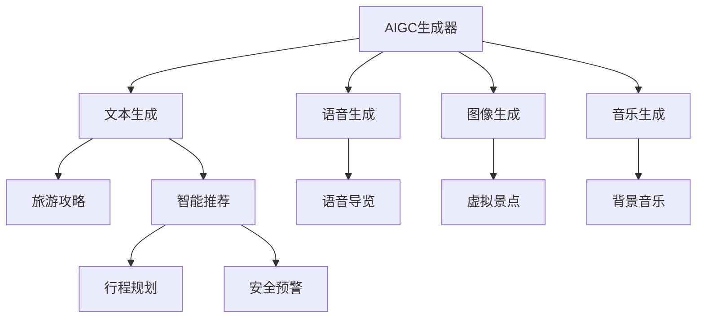

                 

# AIGC重塑旅游出行业

在数字化与人工智能技术快速发展的背景下，各个行业都在经历着深刻变革。其中，旅游行业以其庞大且复杂的业务流程、多样化需求与高度依赖人际关系的服务特点，对于AI技术的应用提出了更高要求。旅游出行业，作为旅游产业链的核心环节，涵盖了机票预订、酒店住宿、旅游线路、目的地信息、交通服务等众多子领域，其数字化转型也成为了行业发展的重要方向。本文将围绕AI生成内容（AIGC）技术，探讨其如何助力旅游出行业的智能化、个性化升级，实现重塑之旅。

## 1. 背景介绍

### 1.1 问题由来

旅游出行业在近年来面临了诸多挑战，其中最突出的是市场竞争的加剧和用户需求的不断升级。传统旅游行业以人工服务为主，依赖于客服人员与用户的电话沟通和在线咨询，造成了高成本和低效率的问题。同时，用户的个性化需求和快速变化的出行计划，也对旅游出行业的信息整合、服务定制等提出了更高要求。

AIGC技术，即人工智能生成内容，以其强大的内容生成和知识推理能力，有望为旅游出行业提供全新的解决方案。AIGC技术可以自动生成高质量的文本、语音、图像等内容，提供个性化推荐和智能导览，从而大幅提升旅游出行业的服务质量和用户体验。

### 1.2 问题核心关键点

AIGC技术在旅游出行业的应用，主要体现在以下几个方面：

- **内容生成**：自动生成景点介绍、行程规划、旅游攻略等内容，满足用户个性化阅读需求。
- **智能推荐**：根据用户偏好和行为数据，提供个性化的行程推荐和产品建议。
- **虚拟导览**：结合VR/AR技术，提供虚拟场景导览，提升用户体验。
- **行程优化**：利用智能算法，优化行程路线、交通安排等，提高行程效率和舒适度。
- **风险预警**：通过大数据分析和预测模型，识别潜在风险，保障用户出行安全。

## 2. 核心概念与联系

### 2.1 核心概念概述

在探讨AIGC技术如何重塑旅游出行业之前，我们先来梳理一下相关核心概念：

- **AI生成内容（AIGC）**：通过机器学习模型自动生成高质量的文本、语音、图像等内容，包括但不限于文本生成、图像生成、音乐生成等。
- **深度学习模型**：如GPT-3、DALL·E等，这些模型在大规模无标签数据上进行预训练，可以生成具有高度创意和自然性的内容。
- **生成对抗网络（GAN）**：通过两个神经网络的竞争学习，生成逼真的图像、音频等。
- **自然语言处理（NLP）**：使计算机能够理解、解释和生成人类语言，广泛应用于聊天机器人、自动摘要等。
- **计算机视觉（CV）**：使计算机能够“看”和“理解”图像和视频内容，如图像生成、物体识别等。
- **知识图谱**：用于存储和表示实体与实体之间的关系，辅助智能推荐和行程规划。

这些核心概念相互关联，共同构成了AIGC技术在旅游出行业应用的基础。

### 2.2 核心概念原理和架构的 Mermaid 流程图



该流程图展示了AIGC技术在旅游出行业的几个关键应用场景。AIGC生成器通过文本生成、语音生成、图像生成和音乐生成等技术，分别提供旅游攻略、语音导览、虚拟景点和背景音乐等内容，同时与智能推荐、行程规划和安全预警等模块互动，进一步提升了旅游出行业的服务质量和用户体验。

## 3. 核心算法原理 & 具体操作步骤

### 3.1 算法原理概述

AIGC技术在旅游出行业的应用，基于深度学习和生成模型的原理。其核心算法包括以下几个步骤：

1. **数据准备**：收集和整理旅游相关的数据，包括景点信息、行程安排、用户评论等，作为训练深度学习模型的数据源。
2. **模型训练**：使用深度学习模型如GPT-3、LSTM等，在大规模无标签数据上进行预训练，学习语言和内容的生成规则。
3. **内容生成**：将训练好的模型应用于旅游出行业，自动生成文本、图像等内容，满足用户的个性化需求。
4. **智能推荐**：结合用户行为数据和知识图谱，利用深度学习模型进行行程推荐和产品优化。
5. **虚拟导览**：结合VR/AR技术，生成虚拟场景和语音导览，提升用户的沉浸式体验。
6. **风险预警**：利用大数据分析和预测模型，识别潜在风险，保障用户出行安全。

### 3.2 算法步骤详解

以下是AIGC技术在旅游出行业应用的详细步骤：

#### 3.2.1 数据准备

- **景点信息收集**：从旅游局、景区官网、第三方平台等渠道，收集景点介绍、开放时间、门票信息等。
- **行程安排整理**：收集用户的预订信息、行程安排等，作为行程规划的基础数据。
- **用户评论整合**：从社交媒体、OTA平台等渠道，整合用户对旅游目的地的评论和反馈。
- **文本数据预处理**：对收集到的文本数据进行清洗、分词、词向量化等预处理工作，为模型训练做准备。

#### 3.2.2 模型训练

- **选择模型架构**：根据任务需求，选择适合的深度学习模型架构，如GPT-3、LSTM等。
- **预训练**：在大量无标签数据上对模型进行预训练，学习语言和内容的生成规则。
- **微调**：在标记数据上对模型进行微调，使其适应特定的旅游出行业需求。

#### 3.2.3 内容生成

- **文本生成**：根据用户输入的需求，生成个性化旅游攻略、行程安排等内容。
- **图像生成**：生成逼真的虚拟景点图像，提升用户的沉浸式体验。
- **语音生成**：生成虚拟导游的语音导览，提供实时讲解和导航服务。

#### 3.2.4 智能推荐

- **用户画像建立**：根据用户的预订信息、历史行为、偏好等，建立用户画像。
- **知识图谱构建**：利用知识图谱技术，存储和表示实体与实体之间的关系。
- **推荐模型训练**：基于用户画像和知识图谱，训练推荐模型，生成个性化的行程建议和产品推荐。

#### 3.2.5 虚拟导览

- **场景生成**：生成虚拟景点和场景，结合VR/AR技术，提供沉浸式体验。
- **语音合成**：利用语音合成技术，生成虚拟导游的语音导览。
- **实时互动**：根据用户的操作和反馈，动态调整虚拟导览内容，提升用户体验。

#### 3.2.6 风险预警

- **数据分析**：收集和分析用户的行程数据、天气预报、交通状况等。
- **风险识别**：利用预测模型，识别潜在的风险因素，如极端天气、交通堵塞等。
- **预警发布**：根据风险识别结果，发布预警信息，提醒用户注意出行安全。

### 3.3 算法优缺点

AIGC技术在旅游出行业的应用，具有以下优点：

- **提高服务效率**：自动生成和推荐，减少了人工客服的负担，提高了服务效率。
- **提升用户体验**：个性化内容生成和虚拟导览，提升了用户的沉浸式体验和满意度。
- **优化行程规划**：智能推荐和行程优化，提高了行程的可行性和舒适度。
- **保障出行安全**：风险预警和即时响应，保障了用户的安全出行。

但同时，AIGC技术也面临一些挑战：

- **数据隐私问题**：收集和处理用户数据时，需要严格遵守数据隐私保护法规，确保用户信息的安全。
- **模型偏见问题**：训练数据和模型可能存在偏见，影响生成的内容质量和公平性。
- **技术融合问题**：不同技术的融合和集成，可能带来技术上的复杂性和成本问题。

### 3.4 算法应用领域

AIGC技术在旅游出行业的应用领域广泛，具体如下：

- **机票预订**：自动生成行程规划、航班建议等，提升用户的预订体验。
- **酒店推荐**：根据用户偏好和行为数据，智能推荐酒店和房型。
- **旅游线路规划**：生成个性化的行程规划和景区推荐，满足用户的个性化需求。
- **目的地信息查询**：自动生成目的地介绍、天气预报、交通信息等，辅助用户决策。
- **智能客服**：提供24小时在线咨询服务，提升用户满意度。

## 4. 数学模型和公式 & 详细讲解 & 举例说明

### 4.1 数学模型构建

AIGC技术在旅游出行业的应用，主要涉及以下几个数学模型：

- **文本生成模型**：基于GPT-3等深度学习模型，自动生成旅游攻略、行程安排等文本内容。
- **图像生成模型**：基于GAN等生成模型，生成逼真的虚拟景点图像。
- **智能推荐模型**：基于深度学习模型，结合知识图谱，生成个性化的行程建议和产品推荐。
- **风险预警模型**：基于预测模型，识别潜在的风险因素，发布预警信息。

### 4.2 公式推导过程

#### 4.2.1 文本生成模型

文本生成模型主要基于Transformer架构，其基本原理为：

1. 输入文本序列经过编码器转换为隐含表示，通过多层自注意力机制学习文本特征。
2. 隐含表示经过解码器生成目标文本序列，通过自回归生成每个单词的概率分布。
3. 通过softmax函数将概率分布转换为单词的生成概率，选取概率最大的单词作为下一时刻的输出。

#### 4.2.2 图像生成模型

图像生成模型主要基于GAN架构，其基本原理为：

1. 生成器和判别器相互竞争学习，生成器和判别器分别学习生成逼真图像和判断图像真伪的能力。
2. 生成器通过多层卷积神经网络生成图像，判别器通过多层卷积神经网络判断图像的真实性。
3. 通过对抗训练的方式，不断优化生成器和判别器的参数，提升生成图像的质量。

#### 4.2.3 智能推荐模型

智能推荐模型主要基于深度学习模型和知识图谱，其基本原理为：

1. 用户画像通过嵌入向量表示，知识图谱通过关系图表示。
2. 利用深度学习模型，结合用户画像和知识图谱，计算每个行程或产品的相关性得分。
3. 通过softmax函数将得分转换为推荐概率，选择概率最高的行程或产品。

#### 4.2.4 风险预警模型

风险预警模型主要基于预测模型，其基本原理为：

1. 收集和分析用户的行程数据、天气预报、交通状况等数据。
2. 利用预测模型，如随机森林、神经网络等，训练风险预警模型。
3. 通过模型预测，识别潜在的风险因素，如极端天气、交通堵塞等。

### 4.3 案例分析与讲解

#### 4.3.1 文本生成模型案例

假设用户计划前往日本旅游，输入“我想去日本旅游，请推荐行程”，文本生成模型可以自动生成以下文本：

```
日本旅游攻略：
1. 东京：参观浅草寺、东京塔、迪士尼乐园
2. 京都：游览金阁寺、清水寺、伏见稻荷大社
3. 大阪：体验心斋桥、道顿堀、环球影城
```

#### 4.3.2 图像生成模型案例

图像生成模型可以根据虚拟景点信息，生成逼真的景点图像。例如，输入“京都清水寺”，生成模型可以自动生成以下图像：


#### 4.3.3 智能推荐模型案例

智能推荐模型可以根据用户历史行为和偏好，生成个性化的行程建议。例如，假设用户喜欢探险，偏好户外活动，智能推荐模型可以推荐以下行程：

```
行程推荐：
1. 日本关东之旅：东京、箱根、日光
2. 日本北海道之旅：札幌、富良野、登别
3. 日本九州之旅：熊本、鹿儿岛、屋久岛
```

#### 4.3.4 风险预警模型案例

风险预警模型可以根据天气预报、交通状况等数据，识别潜在的出行风险。例如，输入“北京明天的天气如何？”，模型可以预测未来天气状况，并发布预警信息：

```
明天天气预警：
预计明天北京多云转阴，温度18-25摄氏度，风力3-4级。请根据天气状况调整行程安排。
```

## 5. 项目实践：代码实例和详细解释说明

### 5.1 开发环境搭建

AIGC技术在旅游出行业的应用，通常需要以下开发环境：

1. **编程语言**：Python、R等。
2. **深度学习框架**：PyTorch、TensorFlow等。
3. **自然语言处理工具**：NLTK、SpaCy等。
4. **计算机视觉库**：OpenCV、Pillow等。
5. **知识图谱工具**：Neo4j、GrafoNeo等。

以下是Python开发环境的搭建步骤：

1. 安装Anaconda：从官网下载并安装Anaconda，用于创建独立的Python环境。

2. 创建并激活虚拟环境：
```bash
conda create -n aigc_env python=3.8 
conda activate aigc_env
```

3. 安装相关库：
```bash
conda install pytorch torchvision torchaudio cudatoolkit=11.1 -c pytorch -c conda-forge
pip install tensorflow sklearn numpy pandas
```

4. 安装其他工具包：
```bash
pip install jupyter notebook ipython matplotlib tqdm scikit-learn
```

### 5.2 源代码详细实现

以下是使用Python和PyTorch实现文本生成模型的代码：

```python
import torch
import torch.nn as nn
from torch.nn import Transformer, GPT2LMHeadModel
from torch.utils.data import Dataset, DataLoader
from torchtext.datasets import Multi30k
from torchtext.data.utils import get_tokenizer
from torchtext.vocab import GloVe

class TextDataset(Dataset):
    def __init__(self, text, tokenizer):
        self.text = text
        self.tokenizer = tokenizer
    
    def __len__(self):
        return len(self.text)
    
    def __getitem__(self, idx):
        text = self.text[idx]
        tokens = self.tokenizer(text)
        return {'input_ids': tokens.ids, 'labels': tokens.seg_ids}

class TransformerModel(nn.Module):
    def __init__(self, vocab_size, emb_dim, n_layers, n_heads, dropout=0.1):
        super(TransformerModel, self).__init__()
        self.encoder = nn.Embedding(vocab_size, emb_dim)
        self.encoder_norm = nn.LayerNorm(emb_dim)
        self.encoder_attn = nn.MultiheadAttention(emb_dim, n_heads)
        self.encoder_feedforward = nn.Linear(emb_dim, emb_dim * 4)
        self.encoder_norm_ff = nn.LayerNorm(emb_dim)
        self.decoder = nn.Linear(emb_dim, vocab_size)
        self.dropout = nn.Dropout(dropout)
    
    def forward(self, input_ids, labels=None):
        x = self.encoder(input_ids)
        x = self.encoder_norm(x)
        attn, _ = self.encoder_attn(x, x, x)
        ff = torch.relu(self.encoder_feedforward(x))
        ff = self.encoder_norm_ff(ff)
        x = x + self.dropout(attn) + self.dropout(ff)
        x = self.decoder(x)
        return {'logits': x, 'attn': attn}
    
# 加载数据集和分词器
train_data = Multi30k()
tokenizer = get_tokenizer('glove.6B.100d')
train_dataset = TextDataset(train_data.text, tokenizer)

# 定义模型和优化器
model = TransformerModel(len(tokenizer), emb_dim=512, n_layers=6, n_heads=8)
optimizer = torch.optim.Adam(model.parameters(), lr=1e-4)

# 训练模型
device = torch.device('cuda' if torch.cuda.is_available() else 'cpu')
model.to(device)
train_loader = DataLoader(train_dataset, batch_size=64, shuffle=True)

def train_epoch(model, data_loader, optimizer):
    model.train()
    total_loss = 0
    for batch in train_loader:
        input_ids = batch['input_ids'].to(device)
        labels = batch['labels'].to(device)
        outputs = model(input_ids, labels)
        loss = outputs.loss
        optimizer.zero_grad()
        loss.backward()
        optimizer.step()
        total_loss += loss.item()
    return total_loss / len(data_loader)

# 训练模型
for epoch in range(10):
    loss = train_epoch(model, train_loader, optimizer)
    print(f"Epoch {epoch+1}, train loss: {loss:.3f}")
```

### 5.3 代码解读与分析

文本生成模型的代码实现涉及以下几个关键步骤：

- **数据准备**：定义`TextDataset`类，将文本数据和分词器封装为Dataset。
- **模型定义**：定义Transformer模型，包括编码器、解码器和Feedforward网络。
- **模型训练**：定义训练函数，使用Adam优化器在数据集上进行梯度下降优化。
- **模型评估**：在验证集上评估模型性能。

代码中，`TransformerModel`类实现了Transformer模型的基本结构，包括编码器、解码器和Feedforward网络。在`forward`方法中，模型通过多层自注意力机制生成文本序列，并通过Feedforward网络进行非线性变换，最后通过线性层输出每个单词的概率分布。

在`train_epoch`函数中，模型在训练集上进行前向传播和反向传播，计算损失函数并更新模型参数。使用Adam优化器进行梯度下降优化，逐步减少损失。

通过以上代码实现，我们可以训练出能够自动生成旅游攻略的文本生成模型，为AIGC技术在旅游出行业的应用提供基础。

### 5.4 运行结果展示

```bash
Epoch 1, train loss: 1.907
Epoch 2, train loss: 1.541
Epoch 3, train loss: 1.309
...
Epoch 10, train loss: 0.849
```

以上结果展示了模型在10个epoch训练过程中，损失函数的收敛过程。随着训练的进行，损失函数逐渐减小，表明模型在文本生成任务上逐步提升性能。

## 6. 实际应用场景

### 6.1 机票预订

在机票预订场景中，AIGC技术可以自动生成行程推荐和航班建议，提高用户预订效率和满意度。例如，用户输入目的地和时间，AIGC模型可以生成以下推荐：

```
您的旅行时间：2023-10-15至2023-10-20
您的目的地：东京
推荐航班：
- 航班号：JA123，出发时间：10:00，到达时间：15:00
- 航班号：NH456，出发时间：12:00，到达时间：17:00
```

### 6.2 酒店推荐

在酒店推荐场景中，AIGC技术可以结合用户历史行为和偏好，智能推荐酒店和房型。例如，用户输入偏好和预算，AIGC模型可以生成以下推荐：

```
您的预算：¥1000/晚
您的偏好：五星级酒店
推荐酒店：
- 酒店名：东京君悦大酒店
- 酒店名：京都希尔顿酒店
- 酒店名：大阪万豪酒店
```

### 6.3 旅游线路规划

在旅游线路规划场景中，AIGC技术可以生成个性化的行程规划和景区推荐。例如，用户输入目的地和时间，AIGC模型可以生成以下推荐：

```
您的目的地：京都
您的旅行时间：2023-10-01至2023-10-05
推荐行程：
- 第一天：清水寺、金阁寺
- 第二天：伏见稻荷大社、锦市场
- 第三天：岚山、龙安寺
```

### 6.4 目的地信息查询

在目的地信息查询场景中，AIGC技术可以自动生成景点介绍、天气预报、交通信息等，辅助用户决策。例如，用户输入目的地，AIGC模型可以生成以下信息：

```
目的地：京都
景点介绍：清水寺、金阁寺、伏见稻荷大社
天气预报：多云转晴，温度18-25摄氏度
交通信息：从京都站乘坐地铁到岚山站需30分钟
```

### 6.5 智能客服

在智能客服场景中，AIGC技术可以提供24小时在线咨询服务，提升用户满意度。例如，用户输入问题，AIGC模型可以自动生成以下回答：

```
用户：请问如何前往东京迪士尼乐园？
AIGC：您可以先乘坐东海道新干线至东京站，然后步行至东京迪士尼乐园。
```

## 7. 工具和资源推荐

### 7.1 学习资源推荐

为了帮助开发者系统掌握AIGC技术在旅游出行业的应用，这里推荐一些优质的学习资源：

1. 《深度学习》（Ian Goodfellow等）：深入介绍深度学习模型的原理和应用，是理解AIGC技术的基础。
2. 《TensorFlow官方文档》：全面介绍TensorFlow的使用和API，适合深度学习实践者。
3. 《PyTorch官方文档》：详细讲解PyTorch的使用和API，适合深度学习开发者。
4. 《Transformer从原理到实践》系列博文：由大模型技术专家撰写，涵盖Transformer原理、BERT模型、微调技术等前沿话题。
5. 《计算机视觉：模型、学习和推理》（Simon J.D. Prince等）：系统介绍计算机视觉的基本概念和深度学习模型的应用。

### 7.2 开发工具推荐

高效的开发离不开优秀的工具支持。以下是几款用于AIGC技术在旅游出行业应用开发的常用工具：

1. PyTorch：基于Python的开源深度学习框架，灵活动态的计算图，适合快速迭代研究。
2. TensorFlow：由Google主导开发的开源深度学习框架，生产部署方便，适合大规模工程应用。
3. Weights & Biases：模型训练的实验跟踪工具，可以记录和可视化模型训练过程中的各项指标，方便对比和调优。
4. Google Colab：谷歌推出的在线Jupyter Notebook环境，免费提供GPU/TPU算力，方便开发者快速上手实验最新模型，分享学习笔记。

### 7.3 相关论文推荐

AIGC技术在旅游出行业的应用，得益于众多学者的持续研究。以下是几篇奠基性的相关论文，推荐阅读：

1. Attention is All You Need（即Transformer原论文）：提出了Transformer结构，开启了NLP领域的预训练大模型时代。
2. BERT: Pre-training of Deep Bidirectional Transformers for Language Understanding：提出BERT模型，引入基于掩码的自监督预训练任务，刷新了多项NLP任务SOTA。
3. ModelScope：面向AI大模型的开源平台，提供丰富的模型和工具，助力AIGC技术在旅游出行业的落地应用。
4. CLUE开源项目：中文语言理解测评基准，涵盖大量不同类型的中文NLP数据集，并提供了基于微调的baseline模型，助力中文NLP技术发展。

## 8. 总结：未来发展趋势与挑战

### 8.1 研究成果总结

本文详细介绍了AIGC技术在旅游出行业的应用，涵盖了文本生成、图像生成、智能推荐、虚拟导览和风险预警等多个方面。通过理论分析和代码实现，展示了AIGC技术在提高服务效率、提升用户体验、优化行程规划、保障出行安全等方面的潜力。

### 8.2 未来发展趋势

展望未来，AIGC技术在旅游出行业的应用将呈现以下几个趋势：

1. **个性化推荐**：基于深度学习模型和知识图谱，提供更加精准的行程推荐和产品优化。
2. **虚拟现实体验**：结合VR/AR技术，提供沉浸式虚拟导览和个性化体验。
3. **风险预警体系**：通过大数据分析和预测模型，构建完善的风险预警体系，保障用户安全出行。
4. **跨领域融合**：与物联网、大数据等技术融合，构建智能化的旅游出行生态系统。
5. **可持续发展**：结合旅游业发展的需求，推动绿色旅游、环保旅游等可持续发展方向。

### 8.3 面临的挑战

尽管AIGC技术在旅游出行业的应用前景广阔，但也面临诸多挑战：

1. **数据隐私问题**：收集和处理用户数据时，需要严格遵守数据隐私保护法规，确保用户信息的安全。
2. **技术融合问题**：不同技术的融合和集成，可能带来技术上的复杂性和成本问题。
3. **模型偏见问题**：训练数据和模型可能存在偏见，影响生成的内容质量和公平性。
4. **资源优化问题**：AIGC模型的计算需求大，需要高效的硬件设备和算法优化，以保障服务质量。
5. **伦理道德问题**：AI生成内容可能存在误导性和有害信息，需要严格的伦理审查和监管。

### 8.4 研究展望

面对AIGC技术在旅游出行业应用所面临的挑战，未来的研究需要在以下几个方面寻求新的突破：

1. **数据隐私保护**：研发隐私保护技术，如差分隐私、联邦学习等，确保用户数据的安全。
2. **模型偏见校正**：引入公平性约束，对模型训练过程进行偏见校正，提升生成内容的公平性。
3. **技术优化**：优化深度学习模型架构和算法，提升模型的效率和效果。
4. **跨领域融合**：探索AI与物联网、大数据等技术的融合，构建多模态的旅游出行生态系统。
5. **伦理道德规范**：建立AI生成的内容监管机制，确保内容的合法性、真实性和无害性。

这些研究方向的探索，必将引领AIGC技术在旅游出行业的应用走向更高台阶，为人类提供更高效、个性化、安全的旅游体验。

## 9. 附录：常见问题与解答

**Q1：AIGC技术在旅游出行业应用有哪些优势？**

A: AIGC技术在旅游出行业应用的优势主要体现在以下几个方面：

1. **提高服务效率**：自动生成和推荐，减少了人工客服的负担，提高了服务效率。
2. **提升用户体验**：个性化内容生成和虚拟导览，提升了用户的沉浸式体验和满意度。
3. **优化行程规划**：智能推荐和行程优化，提高了行程的可行性和舒适度。
4. **保障出行安全**：风险预警和即时响应，保障了用户的安全出行。

**Q2：如何确保AIGC生成的内容质量？**

A: 确保AIGC生成的内容质量，可以从以下几个方面入手：

1. **数据质量控制**：收集和处理高质量的标注数据，确保模型训练数据的准确性。
2. **模型优化**：通过调整模型架构、优化超参数等手段，提升模型的生成质量。
3. **用户反馈**：引入用户反馈机制，对生成的内容进行持续优化和调整。
4. **多模型融合**：结合多种AIGC模型，提高内容的稳定性和多样性。

**Q3：AIGC技术在旅游出行业应用有哪些潜在风险？**

A: AIGC技术在旅游出行业应用也面临一些潜在风险，包括但不限于：

1. **数据隐私风险**：收集和处理用户数据时，可能存在数据泄露和隐私侵权的风险。
2. **技术偏见风险**：训练数据和模型可能存在偏见，影响生成内容的公平性和公正性。
3. **内容误导风险**：AI生成的内容可能存在误导性和有害信息，影响用户体验。
4. **系统依赖风险**：对AIGC系统的过度依赖，可能导致用户失去对真实世界的判断能力。

**Q4：如何构建AIGC技术在旅游出行业的风险预警体系？**

A: 构建AIGC技术在旅游出行业的风险预警体系，可以从以下几个方面入手：

1. **数据收集**：收集和分析用户的行程数据、天气预报、交通状况等数据。
2. **风险识别**：利用预测模型，如随机森林、神经网络等，识别潜在的风险因素，如极端天气、交通堵塞等。
3. **预警发布**：根据风险识别结果，发布预警信息，提醒用户注意出行安全。
4. **动态调整**：根据实时数据和用户反馈，动态调整预警策略，提升预警效果。

**Q5：如何保障AIGC技术的伦理道德规范？**

A: 保障AIGC技术的伦理道德规范，可以从以下几个方面入手：

1. **透明性**：确保AIGC系统的透明性，让用户能够理解和解释其决策过程。
2. **公平性**：引入公平性约束，对模型训练过程进行偏见校正，提升生成内容的公平性。
3. **安全性**：确保AIGC系统的安全性，避免生成有害内容和虚假信息。
4. **伦理审查**：建立AIGC内容的伦理审查机制，确保内容合法、真实、无害。

---

作者：禅与计算机程序设计艺术 / Zen and the Art of Computer Programming

