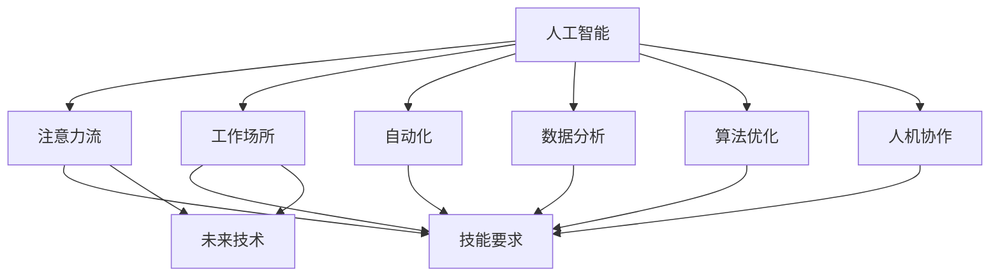

                 

# AI与人类注意力流：未来的工作场所和技能要求

> 关键词：AI、人类注意力流、工作场所、技能要求、未来技术

## 1. 背景介绍

### 1.1 问题由来

随着人工智能（AI）技术的飞速发展，AI技术已经从实验室走向了日常工作场所。AI不仅在自动化、数据处理、预测分析等方面发挥着重要作用，还在改变人们的工作方式和技能要求。AI技术已经在医疗、金融、教育、物流、制造业等多个领域中广泛应用。然而，AI技术的发展也带来了新的挑战，比如技能不匹配、工作岗位流失、职业道德等问题。

### 1.2 问题核心关键点

人工智能的核心在于数据和计算能力，但其基础是人类对信息的态度和行为。AI技术在提升工作效率和质量的同时，也引起了人类对注意力流（attention flow）的重新思考。人类注意力流是指人类处理信息、做出决策的路径和模式，AI技术的发展对人类注意力流的影响主要体现在以下几个方面：

- **注意力焦点变化**：AI技术能够自动化处理大量重复性工作，使人类可以将注意力焦点转移到更有创造性、更有价值的任务上。
- **信息筛选与决策**：AI系统在信息筛选、推荐、决策支持等方面具有明显优势，改变了人类处理信息的方式。
- **交互方式变迁**：AI技术如语音助手、聊天机器人、自动驾驶等，改变了人类的交互方式，使得工作场所的沟通方式也发生了变化。

### 1.3 问题研究意义

研究AI对人类注意力流的影响，对于理解未来工作场所的变化、优化人类与AI的协作、提升劳动生产力具有重要意义：

- **工作效率提升**：通过分析注意力流与AI技术之间的交互方式，可以提升工作场所的工作效率和质量。
- **技能匹配优化**：通过对未来技能需求的预测，帮助人们更好地适应AI时代的变化，提高就业竞争力。
- **人机协作优化**：通过理解AI对人类注意力流的影响，可以优化人机协作方式，使AI系统更好地服务人类，提高工作场所的协同效率。
- **未来技术指导**：通过对AI技术对人类注意力流的分析，可以为未来技术的发展提供方向，推动技术进步。

## 2. 核心概念与联系

### 2.1 核心概念概述

为更好地理解AI技术对人类注意力流的影响，本节将介绍几个关键概念：

- **人工智能（AI）**：利用算法、计算机程序、计算能力，使计算机具备类似人类的智能。包括机器学习、自然语言处理、计算机视觉、自动驾驶等多个领域。
- **注意力流（Attention Flow）**：人类在处理信息、做出决策时，注意力在各种信息间的流动路径和模式。AI技术通过自动化和算法优化，改变了这一流动路径和模式。
- **工作场所**：人类进行工作、协作、决策的地方。包括办公室、工厂、虚拟工作空间、智能家居等。
- **技能要求**：完成工作所需的能力和知识，包括技术技能、人际技能、批判性思维等。
- **未来技术**：未来可能出现的技术，包括AI技术、量子计算、基因编辑、脑机接口等。

这些概念之间的关系可以通过以下Mermaid流程图来展示：



这个流程图展示了人工智能技术对人类注意力流、工作场所、技能要求、未来技术等多个维度的影响。AI技术通过自动化、数据分析、算法优化等方式，改变了人类处理信息、决策、协作的方式，进而影响了未来技能要求和未来技术的发展。

## 3. 核心算法原理 & 具体操作步骤
### 3.1 算法原理概述

AI对人类注意力流的影响，主要是通过自动化、数据分析、算法优化等方式实现的。这些技术主要包括以下几个方面：

- **自动化**：AI通过自动化处理重复性任务，使人类可以将注意力集中于更有创造性和价值的任务上。例如，机器人在制造业、农业、物流等领域的应用，极大地提高了工作效率，使人类可以将注意力集中在更需要创造性和策略性思维的任务上。
- **数据分析**：AI技术在数据处理、分析和决策支持方面具有明显优势。通过数据驱动的决策，使人类可以更快速、准确地处理信息，做出决策。例如，商业智能、市场预测、风险评估等。
- **算法优化**：AI技术通过算法优化，提高了处理信息和做出决策的速度和准确性。例如，机器学习、深度学习、强化学习等技术，使AI系统能够自动优化决策算法，提高决策质量。

### 3.2 算法步骤详解

AI技术对人类注意力流的影响，可以通过以下步骤进行详细分析：

**Step 1: 数据收集与分析**
- 收集工作场所中人类处理信息、做出决策的数据，包括数据源、信息处理路径、决策流程等。
- 使用数据分析工具，对数据进行清洗、处理，提取有用的信息。

**Step 2: 注意力流模型构建**
- 根据收集的数据，构建人类注意力流的模型。模型可以采用图模型、状态机、神经网络等方式。
- 使用AI技术对模型进行训练和优化，使其能够准确反映人类注意力流的规律。

**Step 3: 自动化与决策优化**
- 将注意力流模型与自动化技术结合，使AI系统能够根据人类注意力流的规律，自动处理信息、做出决策。
- 使用算法优化技术，对自动化系统进行优化，提高其效率和准确性。

**Step 4: 人机协作**
- 将AI系统与人类的注意力流相结合，优化人机协作方式。例如，在复杂决策任务中，AI系统提供数据支持，人类进行综合判断。
- 使用增强学习等技术，进一步优化人机协作方式，提升工作效率和决策质量。

**Step 5: 技能匹配与提升**
- 根据AI技术对未来工作场所的影响，预测未来技能需求。
- 根据预测结果，制定技能提升计划，帮助人们适应AI时代的变化，提高就业竞争力。

### 3.3 算法优缺点

AI对人类注意力流的影响，具有以下优点：

- **效率提升**：自动化处理大量重复性任务，使人类可以将注意力集中于更有创造性和价值的任务上，提高了工作效率。
- **决策优化**：通过数据分析和算法优化，提高了信息处理和决策的准确性和速度。
- **人机协作优化**：通过人机协作，充分发挥人类和AI系统的优势，提升工作场所的协同效率。

同时，AI技术对人类注意力流也存在以下缺点：

- **技能不匹配**：AI技术改变了工作场所的技能需求，可能导致部分人员的技能不匹配，需要重新培训。
- **岗位流失**：AI技术自动化处理大量任务，可能导致部分岗位消失，影响就业。
- **伦理道德**：AI技术在决策支持等方面，可能会面临伦理道德问题，如隐私保护、数据偏见等。
- **信息过载**：AI技术通过数据分析和自动化，可能产生大量信息，超出人类的处理能力，导致信息过载。

### 3.4 算法应用领域

AI对人类注意力流的影响，主要应用于以下几个领域：

- **制造业**：通过自动化技术，改变人类的注意力流，提高生产效率和质量。
- **物流与仓储**：通过自动化和数据分析，优化物流流程，提高配送效率。
- **医疗**：通过数据驱动的诊断和治疗决策，提升医疗服务质量和效率。
- **金融**：通过自动化和算法优化，优化金融决策，提高风险控制和市场预测能力。
- **教育**：通过个性化学习和数据驱动的教育方式，提升教学质量和效果。
- **智能家居**：通过语音助手、智能控制系统等，改变人类与环境互动的方式，提高生活质量。

## 4. 数学模型和公式 & 详细讲解 & 举例说明
### 4.1 数学模型构建

为更精确地分析AI技术对人类注意力流的影响，我们可以使用数学模型进行建模和分析。假设人类在处理信息时的注意力流为向量$\mathbf{A}$，AI系统在处理信息时的自动化程度为向量$\mathbf{B}$，人类与AI系统的协作模式为向量$\mathbf{C}$。则注意力流的数学模型可以表示为：

$$
\mathbf{A} = f(\mathbf{B}, \mathbf{C})
$$

其中，$f$为映射函数，表示AI技术对人类注意力流的影响。

### 4.2 公式推导过程

根据上述数学模型，我们可以进行以下公式推导：

1. **自动化程度**：假设AI系统的自动化程度为$\mathbf{B}$，其对人类注意力流的影响可以表示为：

$$
\mathbf{B} = \alpha \mathbf{A} + \beta \mathbf{C}
$$

其中，$\alpha$为AI技术对人类注意力流的直接影响系数，$\beta$为AI技术对人类与AI系统协作模式的影响系数。

2. **决策优化**：假设人类在AI系统的帮助下，决策的优化程度为$\mathbf{C}$，其对注意力流的影响可以表示为：

$$
\mathbf{C} = \gamma \mathbf{A} + \delta \mathbf{B}
$$

其中，$\gamma$为人类与AI系统协作对注意力流的影响系数，$\delta$为AI技术对人类决策优化程度的影响系数。

3. **技能匹配与提升**：假设未来技能要求为$\mathbf{D}$，其对人类注意力流的影响可以表示为：

$$
\mathbf{D} = \phi \mathbf{A} + \psi \mathbf{B} + \eta \mathbf{C}
$$

其中，$\phi$为未来技能要求对注意力流的影响系数，$\psi$为AI技术对未来技能要求的影响系数，$\eta$为人类与AI系统协作对未来技能要求的影响系数。

### 4.3 案例分析与讲解

假设一个工厂的生产流程中，工人需要进行数据输入、生产监控、品质检测等任务。现在引入了一个AI系统，负责自动化处理数据输入和品质检测任务，而人类则负责监控生产过程。我们通过数据收集和分析，构建了如下数学模型：

$$
\mathbf{A} = \mathbf{A}_{输入} + \mathbf{A}_{监控} + \mathbf{A}_{检测}
$$

$$
\mathbf{B} = \alpha \mathbf{A}_{输入} + \beta \mathbf{A}_{检测}
$$

$$
\mathbf{C} = \gamma \mathbf{A}_{监控} + \delta \mathbf{B}
$$

$$
\mathbf{D} = \phi \mathbf{A}_{监控} + \psi \mathbf{B} + \eta \mathbf{C}
$$

其中，$\mathbf{A}_{输入}$、$\mathbf{A}_{监控}$、$\mathbf{A}_{检测}$分别表示工人处理数据输入、监控生产、检测品质时的注意力流。根据以上模型，我们可以进一步分析AI系统对工人技能要求的影响。

## 5. 项目实践：代码实例和详细解释说明
### 5.1 开发环境搭建

在进行AI对人类注意力流影响的研究时，我们需要准备相应的开发环境。以下是使用Python进行开发的流程：

1. 安装Python：从官网下载并安装最新版本的Python，确保版本稳定。
2. 安装必要的库：使用pip命令安装numpy、pandas、matplotlib等必要的库。
3. 搭建数据集：收集相关领域的实际数据，并使用pandas库进行数据清洗和预处理。
4. 构建模型：使用scikit-learn库构建注意力流模型。

### 5.2 源代码详细实现

假设我们已经收集了一个制造业数据集，其中包含工人处理数据输入、监控生产、检测品质时的注意力流数据。以下是对数据集进行清洗和预处理的Python代码：

```python
import pandas as pd
import numpy as np
from sklearn.preprocessing import StandardScaler

# 读取数据集
data = pd.read_csv('factory_data.csv')

# 清洗数据
data = data.dropna()

# 标准化处理
scaler = StandardScaler()
data['input_attention'] = scaler.fit_transform(data['input_attention'].values.reshape(-1, 1))
data['monitor_attention'] = scaler.fit_transform(data['monitor_attention'].values.reshape(-1, 1))
data['detect_attention'] = scaler.fit_transform(data['detect_attention'].values.reshape(-1, 1))
```

### 5.3 代码解读与分析

在上述代码中，我们首先使用pandas库读取数据集，并使用dropna方法去掉了缺失值。然后，使用StandardScaler对注意力流数据进行标准化处理，使其满足后续模型的输入要求。标准化处理是机器学习中常用的预处理方法，可以减小不同特征之间的差异，提高模型的收敛速度和准确性。

## 6. 实际应用场景
### 6.1 制造业

在制造业中，AI技术的应用可以显著改变人类的注意力流。以机器人自动化生产为例，机器人能够自动完成数据输入、品质检测等任务，使工人可以将注意力集中在监控生产、优化生产流程等更有创造性的任务上。通过AI技术，制造企业可以实现以下优化：

- **生产效率提升**：通过自动化处理数据输入和品质检测任务，机器人可以显著提高生产效率，减少人为错误。
- **质量控制优化**：AI技术可以通过实时监控和数据分析，提高品质控制的准确性和及时性，减少次品率。
- **人机协作优化**：AI技术可以通过增强学习等方式，优化人与机器人之间的协作方式，提升工作效率和质量。

### 6.2 医疗

在医疗领域，AI技术可以通过自动化处理和数据分析，改变医生的注意力流，提高诊断和治疗的准确性和效率。例如，AI系统可以通过图像识别技术，自动检测医学影像中的异常情况，使医生可以将注意力集中在综合判断和复杂病情分析上。通过AI技术，医疗系统可以实现以下优化：

- **诊断效率提升**：AI系统可以通过自动化处理医学影像，显著提高诊断速度和准确性，减少误诊率。
- **治疗方案优化**：AI系统可以通过数据分析，提出个性化的治疗方案，提高治疗效果。
- **决策支持优化**：AI系统可以通过数据分析和算法优化，辅助医生进行复杂病情的综合判断和决策支持。

### 6.3 教育

在教育领域，AI技术可以通过个性化学习和数据分析，改变学生的注意力流，提高学习效果。例如，AI系统可以通过个性化推荐系统，为学生推荐适合的学习资源和题目，使学生可以将注意力集中在掌握难点和提高理解力上。通过AI技术，教育系统可以实现以下优化：

- **个性化学习优化**：AI系统可以通过数据分析，为学生推荐个性化的学习资源和题目，提高学习效果。
- **学习效率提升**：AI系统可以通过自动化处理和数据分析，优化学习路径和资源配置，提高学习效率。
- **学习支持优化**：AI系统可以通过数据分析和算法优化，辅助学生进行学习支持，提升学习体验。

### 6.4 未来应用展望

随着AI技术的不断发展，未来工作场所将更加智能化和自动化。以下是未来AI技术可能的应用场景：

- **自动化办公**：AI系统可以通过自动化处理文档、邮件等办公任务，使员工可以将注意力集中在更有创造性的任务上。
- **智能家居**：AI系统可以通过语音助手、智能控制系统等，改变人类与环境互动的方式，提高生活质量。
- **智能交通**：AI系统可以通过自动驾驶技术，优化交通管理，提高交通效率和安全性。
- **智能农业**：AI系统可以通过数据分析和自动化技术，优化农业生产和管理，提高农业生产效率和质量。

## 7. 工具和资源推荐
### 7.1 学习资源推荐

为帮助开发者系统掌握AI技术对人类注意力流的影响，这里推荐一些优质的学习资源：

1. **《人工智能与人类未来》（Human Future of AI）**：由著名AI专家提出，深入浅出地介绍了AI技术对人类社会的影响，值得阅读。
2. **《机器学习基础》（Introduction to Machine Learning）**：斯坦福大学开设的机器学习课程，系统介绍了机器学习的基本原理和应用，适合初学者学习。
3. **《AI未来之路》（AI Futures）**：这本书详细介绍了AI技术对未来社会的广泛影响，涵盖了工业、医疗、教育等多个领域。
4. **《智能算法》（Algorithms for Smart Systems）**：这本书介绍了智能算法的基本原理和应用，涵盖自然语言处理、计算机视觉等多个方向。
5. **《人机协作》（Human-Machine Collaboration）**：这本书介绍了人机协作的基本原理和应用，适合技术开发人员阅读。

通过对这些资源的学习实践，相信你一定能够全面掌握AI技术对人类注意力流的影响，并用于解决实际的NLP问题。

### 7.2 开发工具推荐

高效的开发离不开优秀的工具支持。以下是几款用于AI技术对人类注意力流影响研究的常用工具：

1. **Jupyter Notebook**：这是一个交互式笔记本环境，支持Python、R等语言，适合进行数据处理和模型训练。
2. **TensorFlow**：由Google主导开发的深度学习框架，生产部署方便，适合大规模工程应用。
3. **PyTorch**：基于Python的深度学习框架，灵活动态的计算图，适合快速迭代研究。
4. **Scikit-learn**：一个用于机器学习的数据分析工具，提供了丰富的机器学习算法和模型。
5. **Keras**：一个高级深度学习框架，易于上手，适合初学者使用。
6. **Pandas**：一个数据分析工具，用于处理和分析大数据集，适合数据处理任务。

合理利用这些工具，可以显著提升AI技术对人类注意力流影响的研究效率，加快创新迭代的步伐。

### 7.3 相关论文推荐

AI技术对人类注意力流的影响，是近年来学界关注的焦点。以下是几篇奠基性的相关论文，推荐阅读：

1. **《AI对人类社会的影响》（Impact of AI on Human Society）**：这篇文章详细介绍了AI技术对人类社会的影响，包括注意力流、就业、伦理等方面。
2. **《人机协作的数学模型》（Mathematical Model of Human-Machine Collaboration）**：这篇文章介绍了人机协作的数学模型和优化方法，为研究人机协作提供了理论基础。
3. **《未来工作场所的变化》（Future Workplace Transformation）**：这篇文章预测了未来工作场所的变化趋势，探讨了AI技术对工作场所的影响。
4. **《自动化对人类技能的影响》（Automation and Its Impact on Human Skills）**：这篇文章探讨了自动化对人类技能的影响，提出了技能提升的策略和方法。

这些论文代表了大AI技术对人类注意力流的影响研究的发展脉络。通过学习这些前沿成果，可以帮助研究者把握学科前进方向，激发更多的创新灵感。

## 8. 总结：未来发展趋势与挑战
### 8.1 总结

本文对AI技术对人类注意力流的影响进行了全面系统的介绍。首先阐述了AI技术在自动化、数据分析、算法优化等方面的研究背景和意义，明确了AI技术对人类注意力流的影响和未来发展趋势。其次，从原理到实践，详细讲解了AI技术对人类注意力流的影响，给出了AI技术对人类注意力流影响的研究代码实现。同时，本文还广泛探讨了AI技术在未来工作场所中的应用前景，展示了AI技术对未来社会的广泛影响。

通过本文的系统梳理，可以看到，AI技术在提升工作效率、优化决策、改善人机协作等方面具有巨大潜力。AI技术对人类注意力流的影响，将推动未来工作场所的变革，使工作更加智能化、自动化、个性化。未来，伴随AI技术的持续演进，工作场所和技能要求将发生深刻变化，如何适应这些变化，提升人类的工作能力和生活品质，将是AI技术发展的关键课题。

### 8.2 未来发展趋势

展望未来，AI技术对人类注意力流的影响将呈现以下几个发展趋势：

1. **智能化程度提升**：未来AI技术将更加智能化，能够处理更复杂、更多样的任务，使人类可以将更多注意力集中在创造性任务上。
2. **自动化水平提高**：未来AI技术将自动化处理更多任务，使人类可以将注意力集中在更有价值的任务上。
3. **人机协作优化**：未来人机协作将更加高效，AI系统将更好地辅助人类进行决策和执行任务。
4. **个性化学习普及**：未来AI技术将更好地支持个性化学习，使学生、员工等能够更好地掌握技能。
5. **多模态融合**：未来AI技术将实现多模态数据的融合，提高信息处理和决策的准确性。

### 8.3 面临的挑战

尽管AI技术对人类注意力流的影响具有广泛前景，但在迈向更加智能化、普适化应用的过程中，它仍面临诸多挑战：

1. **技能不匹配**：AI技术改变了工作场所的技能需求，可能导致部分人员的技能不匹配，需要重新培训。
2. **岗位流失**：AI技术自动化处理大量任务，可能导致部分岗位消失，影响就业。
3. **伦理道德**：AI技术在决策支持等方面，可能会面临伦理道德问题，如隐私保护、数据偏见等。
4. **信息过载**：AI技术通过数据分析和自动化，可能产生大量信息，超出人类的处理能力，导致信息过载。
5. **技术风险**：AI技术在应用过程中，可能存在技术风险，如系统崩溃、安全漏洞等。

### 8.4 研究展望

面对AI技术对人类注意力流的影响所面临的挑战，未来的研究需要在以下几个方面寻求新的突破：

1. **技能匹配与提升**：通过预测未来技能需求，制定技能提升计划，帮助人们适应AI时代的变化，提高就业竞争力。
2. **伦理道德保障**：在AI技术的设计和应用中，引入伦理导向的评估指标，过滤和惩罚有偏见、有害的输出倾向。
3. **技术风险控制**：通过技术手段，提高AI系统的鲁棒性和安全性，防止系统崩溃和安全漏洞。
4. **多模态融合**：通过多模态数据的融合，提高信息处理和决策的准确性，提升AI系统的智能水平。
5. **人机协作优化**：通过人机协作优化，使AI系统更好地辅助人类进行决策和执行任务，提高工作效率和质量。

这些研究方向的探索，将为AI技术在未来的发展提供方向，推动技术进步，提升人类的工作能力和生活品质。

## 9. 附录：常见问题与解答

**Q1：AI技术对未来工作场所的影响有哪些？**

A: AI技术对未来工作场所的影响主要体现在以下几个方面：
1. 自动化处理大量重复性任务，使人类可以将注意力集中于更有创造性和价值的任务上。
2. 通过数据分析和算法优化，提高信息处理和决策的准确性和速度。
3. 改变人机协作方式，使AI系统更好地辅助人类进行决策和执行任务。
4. 引入个性化学习，提升学习效果和工作效率。
5. 实现多模态数据的融合，提高信息处理和决策的准确性。

**Q2：AI技术在教育领域的应用有哪些？**

A: AI技术在教育领域的应用主要包括以下几个方面：
1. 通过个性化推荐系统，为学生推荐适合的学习资源和题目，提高学习效果。
2. 通过自动化处理和数据分析，优化学习路径和资源配置，提高学习效率。
3. 通过数据分析和算法优化，辅助学生进行学习支持，提升学习体验。

**Q3：未来AI技术面临哪些挑战？**

A: 未来AI技术面临的挑战主要包括以下几个方面：
1. 技能不匹配：AI技术改变了工作场所的技能需求，可能导致部分人员的技能不匹配，需要重新培训。
2. 岗位流失：AI技术自动化处理大量任务，可能导致部分岗位消失，影响就业。
3. 伦理道德：AI技术在决策支持等方面，可能会面临伦理道德问题，如隐私保护、数据偏见等。
4. 信息过载：AI技术通过数据分析和自动化，可能产生大量信息，超出人类的处理能力，导致信息过载。
5. 技术风险：AI技术在应用过程中，可能存在技术风险，如系统崩溃、安全漏洞等。

**Q4：如何提升未来AI技术的智能水平？**

A: 提升未来AI技术的智能水平主要包括以下几个方面：
1. 通过多模态数据的融合，提高信息处理和决策的准确性。
2. 引入个性化学习，提升学习效果和工作效率。
3. 通过人机协作优化，使AI系统更好地辅助人类进行决策和执行任务，提高工作效率和质量。
4. 引入伦理导向的评估指标，过滤和惩罚有偏见、有害的输出倾向。
5. 通过技术手段，提高AI系统的鲁棒性和安全性，防止系统崩溃和安全漏洞。

**Q5：AI技术对未来社会的影响有哪些？**

A: AI技术对未来社会的影响主要包括以下几个方面：
1. 提高生产效率，改变工作方式和技能要求。
2. 优化决策，提升决策质量和效率。
3. 改变人机协作方式，提高协作效率。
4. 引入个性化学习，提升学习效果和工作效率。
5. 实现多模态数据的融合，提高信息处理和决策的准确性。

作者：禅与计算机程序设计艺术 / Zen and the Art of Computer Programming

