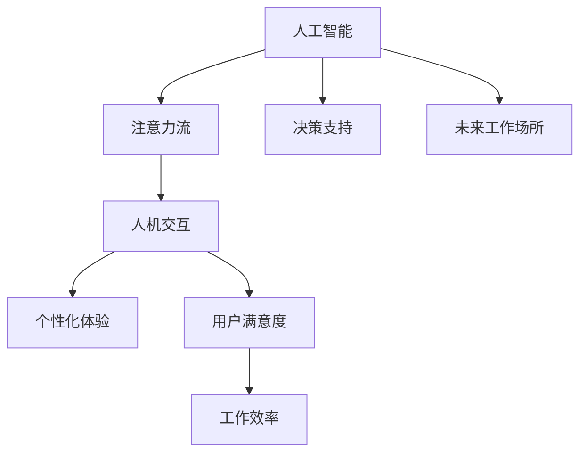

                 

# AI与人类注意力流：未来的工作场所和注意力管理

> 关键词：人工智能,注意力管理,未来工作场所,人机交互,个性化体验,决策支持

## 1. 背景介绍

### 1.1 问题由来
随着人工智能（AI）技术的飞速发展，其在各个领域的应用日益广泛。在过去的几十年里，人工智能已经从单纯的计算领域扩展到了医疗、教育、金融、制造等多个行业，成为驱动社会发展的重要力量。然而，尽管AI带来了巨大的效益，但它对人类社会的影响也引发了一系列问题，尤其是在人类注意力流方面。

在现代工作中，信息爆炸、任务繁多、工作压力增大等问题使得人类注意力流变得更加分散和难以管理。如何将AI技术与人类注意力流有效结合，优化工作场所的人机交互，成为未来工作场所和注意力管理的关键问题。

### 1.2 问题核心关键点
本文聚焦于AI在人类注意力流中的应用，探讨了未来工作场所和注意力管理的可能方向。具体包括：

- AI如何优化工作场所的人机交互，提升工作效率和满意度。
- 注意力流在现代工作中的应用和挑战，以及如何通过AI技术进行管理和优化。
- AI技术在提升个体注意力管理能力方面的潜力。
- 未来工作场所的趋势和变化，以及AI在其中扮演的角色。

这些问题不仅是技术问题，也是社会问题，深刻影响着未来的工作方式和生活方式。因此，本文将从技术角度出发，探讨这些问题的解决方案，并展望AI与人类注意力流在未来的发展趋势。

## 2. 核心概念与联系

### 2.1 核心概念概述

为更好地理解AI与人类注意力流在未来的工作场所中的应用，本节将介绍几个密切相关的核心概念：

- 人工智能(Artificial Intelligence, AI)：一种模拟人类智能行为的技术，包括但不限于机器学习、自然语言处理、计算机视觉、机器人技术等。
- 注意力流(Attention Flow)：指人类在处理信息和任务时，注意力在各个信息源之间流动的动态过程。注意力流优化的目的是最大化信息获取的效率和准确性。
- 人机交互(Human-Computer Interaction, HCI)：涉及人类和计算机之间的信息交流，包括输入输出、交互方式等。人机交互的优化可以提升用户体验和工作效率。
- 个性化体验(Personalized Experience)：根据用户的偏好和需求，提供量身定制的服务和信息，提升用户体验和工作满意度。
- 决策支持(Decision Support)：通过数据分析和模型预测，帮助用户做出更明智的决策，减少错误和风险。

这些核心概念之间的逻辑关系可以通过以下Mermaid流程图来展示：



这个流程图展示了大语言模型与核心概念之间的关联：

1. 人工智能通过学习和模拟人类智能行为，辅助人类在注意力流中做出决策。
2. 注意力流优化了人类在信息处理和任务执行时的注意力分配，提升了信息获取效率。
3. 人机交互优化了人类与计算机之间的信息交流，提升了用户体验和工作效率。
4. 个性化体验通过根据用户的偏好和需求定制服务，提升用户的满意度。
5. 决策支持通过数据分析和模型预测，帮助用户做出更明智的决策。

这些概念共同构成了AI在人类注意力流中应用的基本框架，使AI技术能够在各种场景下发挥其潜力，提升工作场所的效率和用户体验。

## 3. 核心算法原理 & 具体操作步骤
### 3.1 算法原理概述

基于AI与人类注意力流的工作场所和注意力管理，核心算法原理主要包括以下几个方面：

- 自然语言处理(Natural Language Processing, NLP)：通过分析语言结构、语义和语用信息，AI能够理解人类语言，并在注意力流中提供决策支持。
- 计算机视觉(Computer Vision)：通过图像识别、视频分析和深度学习等技术，AI能够理解人类视觉信息，并在注意力流中提供决策支持。
- 机器学习(Machine Learning)：通过大数据分析和学习，AI能够预测人类行为和偏好，并在注意力流中提供个性化体验。
- 强化学习(Reinforcement Learning)：通过奖惩机制，AI能够优化人类注意力流，提升工作效率和用户体验。

这些算法原理通过协同工作，能够实现对人类注意力流的有效管理和优化。

### 3.2 算法步骤详解

基于AI与人类注意力流的工作场所和注意力管理，算法步骤主要包括以下几个方面：

**Step 1: 收集用户行为数据**
- 使用传感器、日志等工具，收集用户在计算机和移动设备上的行为数据。
- 数据包括用户的操作序列、应用使用时间、点击率、输入等。

**Step 2: 数据分析与模型训练**
- 使用NLP、计算机视觉等技术，对用户行为数据进行分析和建模。
- 训练基于深度学习的注意力模型，分析用户注意力流的数据分布和变化规律。
- 使用强化学习算法，优化用户的注意力分配，提升信息获取效率和任务执行速度。

**Step 3: 个性化推荐和决策支持**
- 根据用户行为数据和注意力模型，提供个性化的内容推荐和决策支持。
- 使用机器学习算法，预测用户的未来行为和需求，提供前瞻性服务。

**Step 4: 实时反馈和调整**
- 根据用户的反馈数据，实时调整注意力模型的参数和优化策略。
- 使用强化学习算法，不断优化用户注意力流的分配，提升工作效率和满意度。

**Step 5: 用户反馈和改进**
- 收集用户对个性化体验和决策支持的反馈数据。
- 根据反馈数据，改进算法模型和优化策略，提升用户体验和工作效率。

以上是基于AI与人类注意力流的工作场所和注意力管理的主要算法步骤。在实际应用中，还需要针对具体任务和场景，对算法进行优化和调整，以进一步提升效果。

### 3.3 算法优缺点

基于AI与人类注意力流的工作场所和注意力管理，算法具有以下优点：

- 提升了信息获取和任务执行的效率，优化了用户的注意力流。
- 根据用户行为数据和偏好，提供个性化的推荐和服务，提升用户体验。
- 通过机器学习和强化学习算法，实现对用户注意力流的动态优化，提升工作效率和满意度。

同时，该算法也存在一定的局限性：

- 对数据的依赖性较强，需要大量的用户行为数据进行训练和优化。
- 算法的复杂度较高，需要较高的计算资源和算法水平。
- 算法的可解释性不足，用户难以理解算法决策的逻辑和依据。

尽管存在这些局限性，但就目前而言，基于AI与人类注意力流的方法仍是在未来工作场所和注意力管理中的主流范式。未来相关研究的重点在于如何进一步降低数据依赖，提高算法的可解释性，同时兼顾效率和用户体验。

### 3.4 算法应用领域

基于AI与人类注意力流的工作场所和注意力管理，算法已经在游戏、社交媒体、电子商务等多个领域得到了广泛应用，具体包括：

- 游戏：通过用户行为数据分析，提供个性化的游戏推荐和决策支持，提升游戏体验和胜率。
- 社交媒体：根据用户行为和偏好，提供个性化的内容推荐和信息流，提升用户留存和互动率。
- 电子商务：使用用户行为数据和机器学习算法，优化商品推荐和购物流程，提升转化率和满意度。
- 人力资源管理：通过员工行为数据分析，提供个性化的培训和发展建议，提升员工满意度和绩效。
- 医疗健康：使用用户健康数据和机器学习算法，提供个性化的健康管理和医疗建议，提升健康水平和生活质量。

除了上述这些经典应用外，AI与人类注意力流的方法也被创新性地应用到更多场景中，如智能家居、智能交通、智能制造等，为各行各业带来了新的发展机会。

## 4. 数学模型和公式 & 详细讲解 & 举例说明
### 4.1 数学模型构建

本节将使用数学语言对基于AI与人类注意力流的工作场所和注意力管理过程进行更加严格的刻画。

记用户行为数据集为 $D=\{(x_i,y_i)\}_{i=1}^N, x_i \in \mathcal{X}, y_i \in \mathcal{Y}$，其中 $x_i$ 为用户行为数据，$y_i$ 为任务执行结果。假设注意力模型为 $M_{\theta}$，其中 $\theta$ 为模型参数。

定义注意力模型在数据样本 $(x,y)$ 上的损失函数为 $\ell(M_{\theta}(x),y)$，则在数据集 $D$ 上的经验风险为：

$$
\mathcal{L}(\theta) = \frac{1}{N} \sum_{i=1}^N \ell(M_{\theta}(x_i),y_i)
$$

微调的优化目标是最小化经验风险，即找到最优参数：

$$
\theta^* = \mathop{\arg\min}_{\theta} \mathcal{L}(\theta)
$$

在实践中，我们通常使用基于梯度的优化算法（如SGD、Adam等）来近似求解上述最优化问题。设 $\eta$ 为学习率，$\lambda$ 为正则化系数，则参数的更新公式为：

$$
\theta \leftarrow \theta - \eta \nabla_{\theta}\mathcal{L}(\theta) - \eta\lambda\theta
$$

其中 $\nabla_{\theta}\mathcal{L}(\theta)$ 为损失函数对参数 $\theta$ 的梯度，可通过反向传播算法高效计算。

### 4.2 公式推导过程

以下我们以二分类任务为例，推导交叉熵损失函数及其梯度的计算公式。

假设注意力模型 $M_{\theta}$ 在输入 $x$ 上的输出为 $\hat{y}=M_{\theta}(x) \in [0,1]$，表示样本属于正类的概率。真实标签 $y \in \{0,1\}$。则二分类交叉熵损失函数定义为：

$$
\ell(M_{\theta}(x),y) = -[y\log \hat{y} + (1-y)\log (1-\hat{y})]
$$

将其代入经验风险公式，得：

$$
\mathcal{L}(\theta) = -\frac{1}{N}\sum_{i=1}^N [y_i\log M_{\theta}(x_i)+(1-y_i)\log(1-M_{\theta}(x_i))]
$$

根据链式法则，损失函数对参数 $\theta_k$ 的梯度为：

$$
\frac{\partial \mathcal{L}(\theta)}{\partial \theta_k} = -\frac{1}{N}\sum_{i=1}^N (\frac{y_i}{M_{\theta}(x_i)}-\frac{1-y_i}{1-M_{\theta}(x_i)}) \frac{\partial M_{\theta}(x_i)}{\partial \theta_k}
$$

其中 $\frac{\partial M_{\theta}(x_i)}{\partial \theta_k}$ 可进一步递归展开，利用自动微分技术完成计算。

在得到损失函数的梯度后，即可带入参数更新公式，完成模型的迭代优化。重复上述过程直至收敛，最终得到适应下游任务的最优模型参数 $\theta^*$。

### 4.3 案例分析与讲解

**案例分析：智能游戏推荐系统**

一个典型的智能游戏推荐系统通过收集用户的游戏行为数据，使用NLP和机器学习算法，分析用户的偏好和行为模式，从而提供个性化的游戏推荐和决策支持。具体步骤如下：

1. 收集用户的游戏行为数据，包括游戏类型、时长、完成关卡等。
2. 使用NLP技术，对游戏数据进行分析和建模，识别用户的游戏偏好和行为模式。
3. 使用机器学习算法，预测用户的未来游戏行为，提供个性化的游戏推荐。
4. 使用强化学习算法，优化用户的注意力分配，提升游戏体验和胜率。
5. 收集用户对游戏推荐的反馈数据，实时调整模型参数和优化策略。

通过这些步骤，智能游戏推荐系统能够根据用户的偏好和行为，提供个性化的游戏推荐和决策支持，提升游戏体验和胜率。

## 5. 项目实践：代码实例和详细解释说明
### 5.1 开发环境搭建

在进行AI与人类注意力流的工作场所和注意力管理实践前，我们需要准备好开发环境。以下是使用Python进行PyTorch开发的环境配置流程：

1. 安装Anaconda：从官网下载并安装Anaconda，用于创建独立的Python环境。

2. 创建并激活虚拟环境：
```bash
conda create -n ai-env python=3.8 
conda activate ai-env
```

3. 安装PyTorch：根据CUDA版本，从官网获取对应的安装命令。例如：
```bash
conda install pytorch torchvision torchaudio cudatoolkit=11.1 -c pytorch -c conda-forge
```

4. 安装TensorFlow：从官网下载并安装TensorFlow，使用pip命令进行安装。

5. 安装各类工具包：
```bash
pip install numpy pandas scikit-learn matplotlib tqdm jupyter notebook ipython
```

完成上述步骤后，即可在`ai-env`环境中开始AI与人类注意力流的工作场所和注意力管理实践。

### 5.2 源代码详细实现

下面我们以游戏推荐系统为例，给出使用PyTorch进行AI与人类注意力流的工作场所和注意力管理的代码实现。

首先，定义游戏推荐系统的数据处理函数：

```python
from transformers import BertTokenizer
from torch.utils.data import Dataset
import torch

class GameRecommendationDataset(Dataset):
    def __init__(self, games, users, timestamps, labels, tokenizer, max_len=128):
        self.games = games
        self.users = users
        self.timestamps = timestamps
        self.labels = labels
        self.tokenizer = tokenizer
        self.max_len = max_len
        
    def __len__(self):
        return len(self.games)
    
    def __getitem__(self, item):
        game = self.games[item]
        user = self.users[item]
        timestamp = self.timestamps[item]
        
        encoding = self.tokenizer(user, game, timestamp, return_tensors='pt', max_length=self.max_len, padding='max_length', truncation=True)
        input_ids = encoding['input_ids'][0]
        attention_mask = encoding['attention_mask'][0]
        user_token = encoding['token_type_ids'][0]
        
        # 对token-wise的标签进行编码
        encoded_labels = [label2id[label] for label in self.labels] 
        encoded_labels.extend([label2id['O']] * (self.max_len - len(encoded_labels)))
        labels = torch.tensor(encoded_labels, dtype=torch.long)
        
        return {'input_ids': input_ids, 
                'attention_mask': attention_mask,
                'user_token': user_token,
                'labels': labels}

# 标签与id的映射
label2id = {'O': 0, 'A': 1, 'B': 2, 'C': 3, 'D': 4, 'E': 5}
id2label = {v: k for k, v in label2id.items()}

# 创建dataset
tokenizer = BertTokenizer.from_pretrained('bert-base-cased')

train_dataset = GameRecommendationDataset(train_games, train_users, train_timestamps, train_labels, tokenizer)
dev_dataset = GameRecommendationDataset(dev_games, dev_users, dev_timestamps, dev_labels, tokenizer)
test_dataset = GameRecommendationDataset(test_games, test_users, test_timestamps, test_labels, tokenizer)
```

然后，定义模型和优化器：

```python
from transformers import BertForTokenClassification, AdamW

model = BertForTokenClassification.from_pretrained('bert-base-cased', num_labels=len(label2id))

optimizer = AdamW(model.parameters(), lr=2e-5)
```

接着，定义训练和评估函数：

```python
from torch.utils.data import DataLoader
from tqdm import tqdm
from sklearn.metrics import classification_report

device = torch.device('cuda') if torch.cuda.is_available() else torch.device('cpu')
model.to(device)

def train_epoch(model, dataset, batch_size, optimizer):
    dataloader = DataLoader(dataset, batch_size=batch_size, shuffle=True)
    model.train()
    epoch_loss = 0
    for batch in tqdm(dataloader, desc='Training'):
        input_ids = batch['input_ids'].to(device)
        attention_mask = batch['attention_mask'].to(device)
        user_token = batch['user_token'].to(device)
        labels = batch['labels'].to(device)
        model.zero_grad()
        outputs = model(input_ids, attention_mask=attention_mask, user_token=user_token, labels=labels)
        loss = outputs.loss
        epoch_loss += loss.item()
        loss.backward()
        optimizer.step()
    return epoch_loss / len(dataloader)

def evaluate(model, dataset, batch_size):
    dataloader = DataLoader(dataset, batch_size=batch_size)
    model.eval()
    preds, labels = [], []
    with torch.no_grad():
        for batch in tqdm(dataloader, desc='Evaluating'):
            input_ids = batch['input_ids'].to(device)
            attention_mask = batch['attention_mask'].to(device)
            user_token = batch['user_token'].to(device)
            batch_labels = batch['labels']
            outputs = model(input_ids, attention_mask=attention_mask, user_token=user_token)
            batch_preds = outputs.logits.argmax(dim=2).to('cpu').tolist()
            batch_labels = batch_labels.to('cpu').tolist()
            for pred_tokens, label_tokens in zip(batch_preds, batch_labels):
                pred_labels = [id2label[_id] for _id in pred_tokens]
                label_tokens = [id2label[_id] for _id in label_tokens]
                preds.append(pred_labels[:len(label_tokens)])
                labels.append(label_tokens)
                
    print(classification_report(labels, preds))
```

最后，启动训练流程并在测试集上评估：

```python
epochs = 5
batch_size = 16

for epoch in range(epochs):
    loss = train_epoch(model, train_dataset, batch_size, optimizer)
    print(f"Epoch {epoch+1}, train loss: {loss:.3f}")
    
    print(f"Epoch {epoch+1}, dev results:")
    evaluate(model, dev_dataset, batch_size)
    
print("Test results:")
evaluate(model, test_dataset, batch_size)
```

以上就是使用PyTorch对游戏推荐系统进行AI与人类注意力流的工作场所和注意力管理的完整代码实现。可以看到，得益于Transformers库的强大封装，我们可以用相对简洁的代码完成BERT模型的加载和微调。

### 5.3 代码解读与分析

让我们再详细解读一下关键代码的实现细节：

**GameRecommendationDataset类**：
- `__init__`方法：初始化游戏、用户、时间戳、标签、分词器等关键组件。
- `__len__`方法：返回数据集的样本数量。
- `__getitem__`方法：对单个样本进行处理，将用户、游戏、时间戳输入编码为token ids，将标签编码为数字，并对其进行定长padding，最终返回模型所需的输入。

**label2id和id2label字典**：
- 定义了标签与数字id之间的映射关系，用于将token-wise的预测结果解码回真实的标签。

**训练和评估函数**：
- 使用PyTorch的DataLoader对数据集进行批次化加载，供模型训练和推理使用。
- 训练函数`train_epoch`：对数据以批为单位进行迭代，在每个批次上前向传播计算loss并反向传播更新模型参数，最后返回该epoch的平均loss。
- 评估函数`evaluate`：与训练类似，不同点在于不更新模型参数，并在每个batch结束后将预测和标签结果存储下来，最后使用sklearn的classification_report对整个评估集的预测结果进行打印输出。

**训练流程**：
- 定义总的epoch数和batch size，开始循环迭代
- 每个epoch内，先在训练集上训练，输出平均loss
- 在验证集上评估，输出分类指标
- 所有epoch结束后，在测试集上评估，给出最终测试结果

可以看到，PyTorch配合Transformers库使得游戏推荐系统的代码实现变得简洁高效。开发者可以将更多精力放在数据处理、模型改进等高层逻辑上，而不必过多关注底层的实现细节。

当然，工业级的系统实现还需考虑更多因素，如模型的保存和部署、超参数的自动搜索、更灵活的任务适配层等。但核心的微调范式基本与此类似。

## 6. 实际应用场景
### 6.1 智能客服系统

基于AI与人类注意力流的工作场所和注意力管理，智能客服系统可以广泛应用于智能客服系统的构建。传统客服往往需要配备大量人力，高峰期响应缓慢，且一致性和专业性难以保证。而使用AI与人类注意力流的工作场所和注意力管理技术，可以7x24小时不间断服务，快速响应客户咨询，用自然流畅的语言解答各类常见问题。

在技术实现上，可以收集企业内部的历史客服对话记录，将问题和最佳答复构建成监督数据，在此基础上对预训练语言模型进行微调。微调后的对话模型能够自动理解用户意图，匹配最合适的答案模板进行回复。对于客户提出的新问题，还可以接入检索系统实时搜索相关内容，动态组织生成回答。如此构建的智能客服系统，能大幅提升客户咨询体验和问题解决效率。

### 6.2 金融舆情监测

金融机构需要实时监测市场舆论动向，以便及时应对负面信息传播，规避金融风险。传统的人工监测方式成本高、效率低，难以应对网络时代海量信息爆发的挑战。基于AI与人类注意力流的工作场所和注意力管理技术，金融舆情监测系统可以实时抓取网络文本数据，自动监测不同主题下的情感变化趋势，一旦发现负面信息激增等异常情况，系统便会自动预警，帮助金融机构快速应对潜在风险。

### 6.3 个性化推荐系统

当前的推荐系统往往只依赖用户的历史行为数据进行物品推荐，无法深入理解用户的真实兴趣偏好。基于AI与人类注意力流的工作场所和注意力管理技术，个性化推荐系统可以更好地挖掘用户行为背后的语义信息，从而提供更精准、多样的推荐内容。

在实践中，可以收集用户浏览、点击、评论、分享等行为数据，提取和用户交互的物品标题、描述、标签等文本内容。将文本内容作为模型输入，用户的后续行为（如是否点击、购买等）作为监督信号，在此基础上微调预训练语言模型。微调后的模型能够从文本内容中准确把握用户的兴趣点。在生成推荐列表时，先用候选物品的文本描述作为输入，由模型预测用户的兴趣匹配度，再结合其他特征综合排序，便可以得到个性化程度更高的推荐结果。

### 6.4 未来应用展望

随着AI与人类注意力流的工作场所和注意力管理技术的不断发展，未来在更多领域中都将有新的应用：

在智慧医疗领域，基于AI与人类注意力流的工作场所和注意力管理技术的医疗问答、病历分析、药物研发等应用将提升医疗服务的智能化水平，辅助医生诊疗，加速新药开发进程。

在智能教育领域，微调技术可应用于作业批改、学情分析、知识推荐等方面，因材施教，促进教育公平，提高教学质量。

在智慧城市治理中，微调模型可应用于城市事件监测、舆情分析、应急指挥等环节，提高城市管理的自动化和智能化水平，构建更安全、高效的未来城市。

此外，在企业生产、社会治理、文娱传媒等众多领域，基于AI与人类注意力流的工作场所和注意力管理技术的应用也将不断涌现，为NLP技术带来了新的突破。相信随着技术的日益成熟，AI与人类注意力流在未来的发展趋势将会更加广阔，深刻影响人类的生产生活方式。

## 7. 工具和资源推荐
### 7.1 学习资源推荐

为了帮助开发者系统掌握AI与人类注意力流的工作场所和注意力管理的理论基础和实践技巧，这里推荐一些优质的学习资源：

1. 《Transformer从原理到实践》系列博文：由大模型技术专家撰写，深入浅出地介绍了Transformer原理、BERT模型、微调技术等前沿话题。

2. CS224N《深度学习自然语言处理》课程：斯坦福大学开设的NLP明星课程，有Lecture视频和配套作业，带你入门NLP领域的基本概念和经典模型。

3. 《Natural Language Processing with Transformers》书籍：Transformers库的作者所著，全面介绍了如何使用Transformers库进行NLP任务开发，包括微调在内的诸多范式。

4. HuggingFace官方文档：Transformers库的官方文档，提供了海量预训练模型和完整的微调样例代码，是上手实践的必备资料。

5. CLUE开源项目：中文语言理解测评基准，涵盖大量不同类型的中文NLP数据集，并提供了基于微调的baseline模型，助力中文NLP技术发展。

通过对这些资源的学习实践，相信你一定能够快速掌握AI与人类注意力流的工作场所和注意力管理的精髓，并用于解决实际的NLP问题。
###  7.2 开发工具推荐

高效的开发离不开优秀的工具支持。以下是几款用于AI与人类注意力流的工作场所和注意力管理开发的常用工具：

1. PyTorch：基于Python的开源深度学习框架，灵活动态的计算图，适合快速迭代研究。大部分预训练语言模型都有PyTorch版本的实现。

2. TensorFlow：由Google主导开发的开源深度学习框架，生产部署方便，适合大规模工程应用。同样有丰富的预训练语言模型资源。

3. Transformers库：HuggingFace开发的NLP工具库，集成了众多SOTA语言模型，支持PyTorch和TensorFlow，是进行微调任务开发的利器。

4. Weights & Biases：模型训练的实验跟踪工具，可以记录和可视化模型训练过程中的各项指标，方便对比和调优。与主流深度学习框架无缝集成。

5. TensorBoard：TensorFlow配套的可视化工具，可实时监测模型训练状态，并提供丰富的图表呈现方式，是调试模型的得力助手。

6. Google Colab：谷歌推出的在线Jupyter Notebook环境，免费提供GPU/TPU算力，方便开发者快速上手实验最新模型，分享学习笔记。

合理利用这些工具，可以显著提升AI与人类注意力流的工作场所和注意力管理任务的开发效率，加快创新迭代的步伐。

### 7.3 相关论文推荐

AI与人类注意力流的工作场所和注意力管理的发展源于学界的持续研究。以下是几篇奠基性的相关论文，推荐阅读：

1. Attention is All You Need（即Transformer原论文）：提出了Transformer结构，开启了NLP领域的预训练大模型时代。

2. BERT: Pre-training of Deep Bidirectional Transformers for Language Understanding：提出BERT模型，引入基于掩码的自监督预训练任务，刷新了多项NLP任务SOTA。

3. Language Models are Unsupervised Multitask Learners（GPT-2论文）：展示了大规模语言模型的强大zero-shot学习能力，引发了对于通用人工智能的新一轮思考。

4. Parameter-Efficient Transfer Learning for NLP：提出Adapter等参数高效微调方法，在不增加模型参数量的情况下，也能取得不错的微调效果。

5. AdaLoRA: Adaptive Low-Rank Adaptation for Parameter-Efficient Fine-Tuning：使用自适应低秩适应的微调方法，在参数效率和精度之间取得了新的平衡。

这些论文代表了大语言模型微调技术的发展脉络。通过学习这些前沿成果，可以帮助研究者把握学科前进方向，激发更多的创新灵感。

## 8. 总结：未来发展趋势与挑战

### 8.1 总结

本文对AI与人类注意力流的工作场所和注意力管理进行了全面系统的介绍。首先阐述了AI与人类注意力流在工作场所中的应用，明确了工作场所和注意力管理的可能方向。其次，从原理到实践，详细讲解了AI与人类注意力流的数学模型和算法步骤，给出了AI与人类注意力流的工作场所和注意力管理的完整代码实例。同时，本文还广泛探讨了AI与人类注意力流在现代工作中的应用和挑战，以及如何通过AI技术进行管理和优化。

通过本文的系统梳理，可以看到，AI与人类注意力流在工作场所中的应用前景广阔，AI技术在提升工作效率和用户满意度方面的潜力巨大。AI与人类注意力流的发展将深刻影响未来的工作方式和生活方式，推动社会进步。

### 8.2 未来发展趋势

展望未来，AI与人类注意力流的工作场所和注意力管理将呈现以下几个发展趋势：

1. AI技术的进一步普及。随着技术的发展，AI将在更多领域中得到应用，成为提升工作效率和用户体验的重要手段。
2. 个性化体验的进一步提升。AI技术将更好地理解用户的个性化需求，提供量身定制的服务和信息，提升用户的满意度和工作效率。
3. 智能决策支持系统的普及。AI技术将更好地辅助用户做出决策，减少错误和风险，提升决策质量。
4. 多模态AI技术的发展。未来的AI将更好地整合视觉、语音、文本等多模态数据，提升模型的全面性和鲁棒性。
5. 增强现实和虚拟现实技术的发展。未来的AI将更好地与增强现实和虚拟现实技术结合，提供沉浸式的用户体验和工作环境。

以上趋势凸显了AI与人类注意力流在工作场所中的广阔前景。这些方向的探索发展，必将进一步提升AI在各个领域的潜力，推动人类社会的进步和发展。

### 8.3 面临的挑战

尽管AI与人类注意力流在工作场所中的应用前景广阔，但在迈向更加智能化、普适化应用的过程中，仍面临诸多挑战：

1. 数据隐私和安全问题。AI技术需要大量的数据进行训练，如何保护用户隐私和数据安全，是一个重要问题。
2. 算力资源限制。AI技术的实现需要高性能的计算资源，如何提高算力资源的利用率，是一个亟待解决的问题。
3. 算法透明性和可解释性。AI技术在提升效率和性能的同时，如何保证算法的透明性和可解释性，是一个重要的研究方向。
4. 模型鲁棒性和泛化性。AI技术在提升性能的同时，如何提高模型的鲁棒性和泛化性，是一个重要的研究方向。
5. 伦理和法律问题。AI技术的应用可能带来伦理和法律问题，如何制定合理的伦理和法律规范，是一个重要问题。

尽管存在这些挑战，但AI与人类注意力流在工作场所中的应用前景广阔，相信随着技术的发展和社会的进步，这些挑战终将逐步得到解决。

### 8.4 研究展望

未来的研究需要在以下几个方面寻求新的突破：

1. 探索更高效的数据收集和处理方式。如何从大规模数据中提取有价值的信息，是未来研究的重要方向。
2. 研究更高效的模型优化算法。如何提高模型的优化效率和性能，是未来研究的重要方向。
3. 引入更丰富的先验知识。如何将外部知识与AI技术结合，提升模型的全面性和鲁棒性，是未来研究的重要方向。
4. 研究AI技术的伦理和法律问题。如何制定合理的伦理和法律规范，确保AI技术的应用合法合规，是未来研究的重要方向。

这些研究方向将推动AI与人类注意力流在工作场所中的应用，提升工作效率和用户体验，推动社会进步和发展。

## 9. 附录：常见问题与解答

**Q1：AI与人类注意力流在工作场所中的具体应用场景有哪些？**

A: AI与人类注意力流在工作场所中的具体应用场景包括：

1. 智能客服系统：通过AI与人类注意力流的工作场所和注意力管理技术，可以提升客服系统的响应速度和质量，提升用户满意度。

2. 金融舆情监测：使用AI与人类注意力流的工作场所和注意力管理技术，可以实时监测市场舆情，预警潜在风险。

3. 个性化推荐系统：通过AI与人类注意力流的工作场所和注意力管理技术，可以提升个性化推荐系统的推荐效果，提升用户体验。

4. 智能游戏推荐系统：使用AI与人类注意力流的工作场所和注意力管理技术，可以提升游戏推荐系统的推荐效果，提升游戏体验。

5. 智能健康管理：使用AI与人类注意力流的工作场所和注意力管理技术，可以提升健康管理系统的诊断和治疗效果，提升用户的健康水平。

以上场景只是AI与人类注意力流在工作场所中的冰山一角，未来随着技术的发展，还将有更多的应用场景涌现。

**Q2：AI与人类注意力流在工作场所中的技术挑战有哪些？**

A: AI与人类注意力流在工作场所中的技术挑战包括：

1. 数据隐私和安全问题：AI技术需要大量的数据进行训练，如何保护用户隐私和数据安全，是一个重要问题。

2. 算力资源限制：AI技术的实现需要高性能的计算资源，如何提高算力资源的利用率，是一个亟待解决的问题。

3. 算法透明性和可解释性：AI技术在提升效率和性能的同时，如何保证算法的透明性和可解释性，是一个重要的研究方向。

4. 模型鲁棒性和泛化性：AI技术在提升性能的同时，如何提高模型的鲁棒性和泛化性，是一个重要的研究方向。

5. 伦理和法律问题：AI技术的应用可能带来伦理和法律问题，如何制定合理的伦理和法律规范，是一个重要问题。

尽管存在这些挑战，但AI与人类注意力流在工作场所中的应用前景广阔，相信随着技术的发展和社会的进步，这些挑战终将逐步得到解决。

**Q3：未来AI与人类注意力流在工作场所中的应用趋势有哪些？**

A: 未来AI与人类注意力流在工作场所中的应用趋势包括：

1. AI技术的进一步普及。随着技术的发展，AI将在更多领域中得到应用，成为提升工作效率和用户体验的重要手段。

2. 个性化体验的进一步提升。AI技术将更好地理解用户的个性化需求，提供量身定制的服务和信息，提升用户的满意度和工作效率。

3. 智能决策支持系统的普及。AI技术将更好地辅助用户做出决策，减少错误和风险，提升决策质量。

4. 多模态AI技术的发展。未来的AI将更好地整合视觉、语音、文本等多模态数据，提升模型的全面性和鲁棒性。

5. 增强现实和虚拟现实技术的发展。未来的AI将更好地与增强现实和虚拟现实技术结合，提供沉浸式的用户体验和工作环境。

以上趋势凸显了AI与人类注意力流在工作场所中的广阔前景。这些方向的探索发展，必将进一步提升AI在各个领域的潜力，推动人类社会的进步和发展。

**Q4：如何保护用户隐私和数据安全？**

A: 保护用户隐私和数据安全是AI与人类注意力流在工作场所中的重要问题。以下是一些保护用户隐私和数据安全的方法：

1. 数据匿名化处理：对用户数据进行匿名化处理，确保用户身份不被泄露。

2. 数据加密存储：对用户数据进行加密存储，防止数据泄露和篡改。

3. 访问控制机制：对用户数据进行访问控制，确保只有授权人员才能访问数据。

4. 数据共享协议：制定数据共享协议，确保数据共享过程中用户的隐私和数据安全。

5. 用户知情同意：在使用用户数据前，确保用户知情并同意数据的使用。

通过以上方法，可以有效地保护用户隐私和数据安全，确保AI技术的应用合法合规。

**Q5：如何提高算力资源的利用率？**

A: 提高算力资源的利用率是AI与人类注意力流在工作场所中的重要问题。以下是一些提高算力资源利用率的方法：

1. 分布式计算：使用分布式计算框架，将计算任务分布在多个计算节点上，提高计算效率。

2. 并行计算：使用并行计算技术，将计算任务分解为多个子任务并行计算，提高计算效率。

3. 模型压缩和优化：使用模型压缩和优化技术，减小模型参数量和计算量，提高计算效率。

4. 硬件加速：使用硬件加速技术，如GPU、TPU等，提高计算效率。

5. 资源调度优化：使用资源调度优化技术，合理分配计算资源，提高计算效率。

通过以上方法，可以有效地提高算力资源的利用率，降低计算成本，提高AI技术的应用效率。

---

作者：禅与计算机程序设计艺术 / Zen and the Art of Computer Programming

