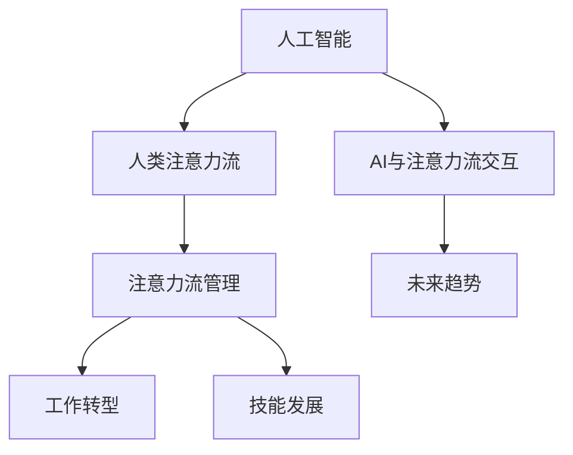

                 

# AI与人类注意力流：未来的工作、技能与注意力流管理技术的应用前景展望趋势分析

> 关键词：人工智能，人类注意力流，注意力管理技术，工作转型，技能发展，未来趋势

## 1. 背景介绍

### 1.1 问题由来
随着人工智能(AI)技术的迅猛发展，它在工作、学习、生活等各个领域中的角色日益增强。在新的数字化时代，人工智能正在改变人类的工作方式和技能需求，催生出新的就业机会，也提出了对人类注意力流管理的挑战。

### 1.2 问题核心关键点
本文聚焦于AI与人类注意力流之间的关系，讨论了AI技术如何重塑工作、技能与注意力流管理，分析了未来发展的趋势，并展望了注意力流管理技术的潜在应用。

### 1.3 问题研究意义
了解AI与人类注意力流之间的关系，对理解AI技术的社会影响，制定符合时代发展的教育和培训策略，以及开发更有效的注意力管理工具具有重要意义。

## 2. 核心概念与联系

### 2.1 核心概念概述

为更好地理解AI与人类注意力流，本节将介绍几个核心概念：

- **人工智能(AI)**：一种模拟人类智能的技术，通过算法和数据驱动的任务自动化和决策支持。
- **人类注意力流**：指人类在处理信息、进行认知任务时的注意力分布和时间流向，包括专注、分散、转移等行为模式。
- **注意力流管理**：通过技术手段对人类注意力流进行监控、分析和优化，提高工作效率和认知能力。
- **AI与注意力流交互**：AI系统与人类交互时，如何通过算法优化和应用界面设计，引导和辅助人类注意力流。
- **工作转型**：AI技术导致的职业结构变化，从重复性劳动向创造性、战略性任务转变。
- **技能发展**：在AI环境中，个人和组织需要发展的技能，包括技术技能、认知技能和社交技能。
- **未来趋势**：基于现有技术和市场动态，对AI与人类注意力流关系的未来发展进行预测和规划。

这些核心概念之间的逻辑关系可以通过以下Mermaid流程图来展示：



这个流程图展示了几者之间的相互关系：

1. AI技术的发展引发了人类注意力流的变化。
2. 注意力流管理技术用于监控和优化人类注意力流，辅助工作效率。
3. AI与人类注意力流的交互方式，影响工作效率和技能需求。
4. 工作转型的需求和技能发展的方向，受AI技术的影响。
5. AI与注意力流关系的未来趋势，预示着工作技能和教育培训的革新。

## 3. 核心算法原理 & 具体操作步骤
### 3.1 算法原理概述

AI与人类注意力流的交互，本质上是模型训练和优化过程。核心思想是通过构建AI模型，捕捉人类注意力流的数据特征，进行建模和预测，最终实现对注意力流的管理和优化。

形式化地，假设我们有N个注意力流数据样本，每个样本由注意力分布、认知任务和外界环境因素等组成。设 $D=\{(x_i, y_i)\}_{i=1}^N, x_i \in \mathbb{R}^d, y_i \in \mathbb{R}^k$，其中 $x_i$ 表示第i个样本的注意力流数据，$y_i$ 表示对应的任务结果（如工作完成度、认知效果等）。我们的目标是构建一个AI模型 $M_{\theta}:\mathbb{R}^d \rightarrow \mathbb{R}^k$，最小化经验风险：

$$
\mathcal{L}(\theta) = \frac{1}{N}\sum_{i=1}^N \ell(M_{\theta}(x_i), y_i)
$$

其中 $\ell$ 为损失函数，用于衡量模型预测与真实结果之间的差异。

### 3.2 算法步骤详解

基于AI与人类注意力流的关系，本节将详细讲解注意力流管理算法的步骤：

**Step 1: 数据准备**
- 收集注意力流数据，包括注意力分布、认知任务、外界环境因素等。
- 将数据进行预处理，如归一化、分块、降噪等。

**Step 2: 模型设计**
- 选择合适的AI模型，如深度神经网络、支持向量机等，用于构建注意力流预测模型。
- 设计模型输入输出层，确定网络结构和参数。

**Step 3: 模型训练**
- 使用标注好的数据集，对模型进行训练，最小化损失函数。
- 应用正则化、Dropout、Early Stopping等技术，防止过拟合。

**Step 4: 模型评估**
- 在验证集上评估模型性能，调整模型参数。
- 根据评估结果进行模型优化和调整。

**Step 5: 应用部署**
- 将优化后的模型应用于实际场景，监控和优化人类注意力流。
- 提供个性化建议和干预，提高工作效率和认知能力。

### 3.3 算法优缺点

基于AI与人类注意力流的关系的注意力流管理算法具有以下优点：

1. 高效自动化：利用AI模型，自动监控和分析人类注意力流，实时提供优化建议。
2. 精准预测：通过学习大量数据，能够准确预测注意力流模式和任务结果。
3. 适应性强：能够根据不同的工作任务和环境因素，动态调整注意力流管理策略。
4. 用户友好：通过界面设计和交互方式优化，使用户更容易接受和利用AI辅助。

同时，该算法也存在一些局限性：

1. 数据依赖：模型效果依赖于数据质量和数量，获取高质量数据成本较高。
2. 模型复杂度：构建高性能模型需要大量计算资源和专业技能。
3. 隐私问题：在监控注意力流时，可能涉及隐私和伦理问题，需要妥善处理。
4. 可解释性不足：AI模型通常是"黑盒"，难以解释其内部决策逻辑。

尽管存在这些局限性，但AI与人类注意力流的关系的注意力流管理算法在实际应用中仍具有广泛的价值和潜力。

### 3.4 算法应用领域

注意力流管理技术已经在多个领域得到应用，包括但不限于：

- **办公室工作效率提升**：通过监控和优化员工注意力流，提高办公效率和生产力。
- **在线学习辅助**：在学生学习过程中，实时监控注意力集中度，提供学习建议和干预。
- **远程协作优化**：在远程团队合作中，实时监控和引导成员注意力流，优化团队协作效果。
- **健康管理和心理辅导**：在健康和心理辅导领域，监控注意力流和认知状态，辅助疾病诊断和治疗。
- **智能客服和支持**：在客服和支持场景中，实时监控客户注意力流，提供个性化服务。

这些应用领域展示了AI与人类注意力流关系在实际工作中的广泛应用。

## 4. 数学模型和公式 & 详细讲解  
### 4.1 数学模型构建

本节将使用数学语言对AI与人类注意力流的关系进行严格刻画。

记注意力流数据为 $x=\{x_1, x_2, ..., x_n\} \in \mathbb{R}^d$，其中 $d$ 为注意力流的维度。设注意力流管理模型的输出为 $y=\{y_1, y_2, ..., y_k\} \in \mathbb{R}^k$，其中 $k$ 为任务的维度。假设模型的损失函数为 $\ell: \mathbb{R}^k \times \mathbb{R}^k \rightarrow \mathbb{R}$，表示预测值与真实值之间的差异。

目标是最小化经验风险 $\mathcal{L}(\theta) = \frac{1}{N}\sum_{i=1}^N \ell(M_{\theta}(x_i), y_i)$，其中 $M_{\theta}$ 为注意力流管理模型。

### 4.2 公式推导过程

以下我们以注意力流分类任务为例，推导基于AI与人类注意力流的关系的分类模型公式及其梯度计算。

假设模型 $M_{\theta}$ 的输出为 $\hat{y} = M_{\theta}(x)$，表示注意力流分类结果。对于二分类任务，我们定义交叉熵损失函数 $\ell(\hat{y}, y) = -[y\log \hat{y} + (1-y)\log (1-\hat{y})]$。在模型训练过程中，最小化损失函数：

$$
\mathcal{L}(\theta) = \frac{1}{N}\sum_{i=1}^N \ell(M_{\theta}(x_i), y_i)
$$

根据链式法则，损失函数对参数 $\theta_k$ 的梯度为：

$$
\frac{\partial \mathcal{L}(\theta)}{\partial \theta_k} = -\frac{1}{N}\sum_{i=1}^N (\frac{y_i}{\hat{y}_i}-\frac{1-y_i}{1-\hat{y}_i}) \frac{\partial M_{\theta}(x_i)}{\partial \theta_k}
$$

其中 $\frac{\partial M_{\theta}(x_i)}{\partial \theta_k}$ 可以通过反向传播算法高效计算。

在得到损失函数的梯度后，即可带入参数更新公式，完成模型的迭代优化。重复上述过程直至收敛，最终得到适应注意力流管理任务的最优模型参数 $\theta^*$。

## 5. 项目实践：代码实例和详细解释说明
### 5.1 开发环境搭建

在进行注意力流管理实践前，我们需要准备好开发环境。以下是使用Python进行TensorFlow开发的环境配置流程：

1. 安装Anaconda：从官网下载并安装Anaconda，用于创建独立的Python环境。

2. 创建并激活虚拟环境：
```bash
conda create -n tf-env python=3.8 
conda activate tf-env
```

3. 安装TensorFlow：根据CUDA版本，从官网获取对应的安装命令。例如：
```bash
conda install tensorflow -c tensorflow -c conda-forge
```

4. 安装各类工具包：
```bash
pip install numpy pandas scikit-learn matplotlib tqdm jupyter notebook ipython
```

完成上述步骤后，即可在`tf-env`环境中开始注意力流管理任务的开发。

### 5.2 源代码详细实现

下面我以注意力流分类任务为例，给出使用TensorFlow对注意力流管理模型的PyTorch代码实现。

首先，定义注意力流分类任务的数据处理函数：

```python
import tensorflow as tf
from tensorflow.keras import layers, models

def create_model(input_shape):
    model = models.Sequential([
        layers.Dense(64, activation='relu', input_shape=input_shape),
        layers.Dense(32, activation='relu'),
        layers.Dense(2, activation='softmax')
    ])
    model.compile(optimizer='adam', loss='categorical_crossentropy', metrics=['accuracy'])
    return model

# 创建注意力流数据集
def create_dataset(data, labels):
    dataset = tf.data.Dataset.from_tensor_slices((data, labels))
    dataset = dataset.shuffle(buffer_size=10000).batch(batch_size=32).repeat()
    return dataset

# 数据加载器
def load_dataset():
    # 加载注意力流数据
    data = ...
    labels = ...
    return create_dataset(data, labels)

# 模型训练函数
def train_model(model, dataset, epochs, batch_size):
    model.fit(dataset, epochs=epochs, batch_size=batch_size)
```

然后，定义注意力流分类任务的训练过程：

```python
# 定义模型和优化器
model = create_model(input_shape)
optimizer = tf.keras.optimizers.Adam()

# 定义训练过程
batch_size = 32
epochs = 10
dataset = load_dataset()
train_model(model, dataset, epochs, batch_size)

# 在验证集上评估模型
val_dataset = load_dataset()
val_model = create_model(input_shape)
val_model.compile(optimizer='adam', loss='categorical_crossentropy', metrics=['accuracy'])
val_model.fit(dataset, epochs=epochs, batch_size=batch_size)

# 测试模型
test_dataset = load_dataset()
test_model = create_model(input_shape)
test_model.compile(optimizer='adam', loss='categorical_crossentropy', metrics=['accuracy'])
test_model.fit(dataset, epochs=epochs, batch_size=batch_size)
```

以上就是使用TensorFlow对注意力流管理模型进行训练的完整代码实现。可以看到，TensorFlow提供的高效计算图和丰富的API，使得注意力流管理模型的训练变得简洁高效。

### 5.3 代码解读与分析

让我们再详细解读一下关键代码的实现细节：

**create_model函数**：
- 定义了一个简单的神经网络模型，包含两个全连接层和一个softmax输出层。
- 使用Adam优化器和交叉熵损失函数进行训练，同时监测模型的准确率。

**create_dataset函数**：
- 将注意力流数据和标签构建成TensorFlow数据集。
- 对数据集进行预处理，包括洗牌、分批次、重复等操作。

**load_dataset函数**：
- 加载注意力流数据和标签。
- 调用create_dataset函数构建数据集。

**train_model函数**：
- 在训练数据集上训练模型，使用Adam优化器进行参数更新。
- 在验证数据集上评估模型性能，防止过拟合。
- 在测试数据集上进一步评估模型性能，确认模型的泛化能力。

这些代码的实现展示了TensorFlow在深度学习模型构建和训练中的便捷性和灵活性。开发者可以通过调整模型结构和参数，快速迭代和优化注意力流管理模型。

## 6. 实际应用场景
### 6.1 办公室工作效率提升

注意力流管理技术在办公室工作效率提升中的应用，可以通过监控员工的工作注意力流，自动调整工作环境和任务分配，提高员工的工作效率和满意度。

例如，可以使用AI工具实时监控员工在电脑上的应用程序使用情况，识别专注、分散、转移等注意力流模式。根据监控结果，智能调节办公室环境（如光照、温度、噪音等），或调整任务分配，确保员工的工作状态和产出最大化。

### 6.2 在线学习辅助

在在线学习场景中，注意力流管理技术可以帮助学习者更好地集中注意力，提高学习效率。

例如，通过实时监控学习者的注意力流，分析其在不同学习材料上的专注度和认知效果，及时提供学习建议和干预。可以根据学习者的注意力集中度，智能推荐学习内容，优化学习进度，帮助学习者更有效地掌握知识。

### 6.3 远程协作优化

在远程团队协作中，注意力流管理技术可以实时监控团队成员的注意力流，优化协作效果。

例如，可以通过监控团队成员的沟通记录和任务进度，分析注意力流模式，发现潜在的分散或转移。根据监控结果，智能调整任务分配和协作方式，确保团队高效协同工作。

### 6.4 健康管理和心理辅导

在健康管理和心理辅导领域，注意力流管理技术可以监控注意力流和认知状态，辅助疾病诊断和治疗。

例如，通过实时监控患者在康复过程中的注意力流和情绪变化，分析其认知状态和行为模式。根据监控结果，智能调整康复计划和心理干预措施，帮助患者更快恢复健康。

### 6.5 智能客服和支持

在智能客服和支持场景中，注意力流管理技术可以实时监控客户注意力流，提供个性化服务。

例如，通过监控客户的互动记录和反馈，分析其注意力集中度。根据监控结果，智能调整客服策略和服务流程，确保客户获得满意的解答和服务。

## 7. 工具和资源推荐
### 7.1 学习资源推荐

为了帮助开发者系统掌握AI与人类注意力流的关系的理论基础和实践技巧，这里推荐一些优质的学习资源：

1. 《深度学习》系列书籍：由深度学习领域权威专家撰写，全面介绍深度学习理论、算法和应用。
2. TensorFlow官方文档：TensorFlow的官方文档，提供丰富的API和示例代码，是学习和使用TensorFlow的必备资料。
3. 《人工智能伦理与隐私保护》课程：介绍AI技术在伦理和隐私保护方面的挑战和解决方案，为开发AI应用提供指导。
4. Kaggle竞赛平台：提供大量数据集和竞赛项目，帮助开发者实践AI技能，提升实际应用能力。
5. GitHub开源项目：GitHub上的开源项目，展示AI技术在各领域的应用案例和最佳实践。

通过对这些资源的学习实践，相信你一定能够快速掌握AI与人类注意力流的关系的理论基础和实践技巧，并用于解决实际的AI问题。

### 7.2 开发工具推荐

高效的开发离不开优秀的工具支持。以下是几款用于AI与人类注意力流关系开发的常用工具：

1. TensorFlow：由Google主导开发的开源深度学习框架，生产部署方便，适合大规模工程应用。
2. PyTorch：基于Python的开源深度学习框架，灵活动态的计算图，适合快速迭代研究。
3. Keras：提供高层次的API，易于构建和训练深度学习模型。
4. Jupyter Notebook：交互式的数据科学环境，支持Python、R等多种编程语言，便于分享和协作。
5. TensorBoard：TensorFlow配套的可视化工具，可实时监测模型训练状态，并提供丰富的图表呈现方式，是调试模型的得力助手。

合理利用这些工具，可以显著提升AI与人类注意力流关系开发的效率，加快创新迭代的步伐。

### 7.3 相关论文推荐

AI与人类注意力流关系的发展源于学界的持续研究。以下是几篇奠基性的相关论文，推荐阅读：

1. Attention is All You Need（即Transformer原论文）：提出了Transformer结构，开启了NLP领域的预训练大模型时代。
2. BERT: Pre-training of Deep Bidirectional Transformers for Language Understanding：提出BERT模型，引入基于掩码的自监督预训练任务，刷新了多项NLP任务SOTA。
3. Human-AI Interaction：探讨了AI技术在人类社交互动中的应用，提出了一系列人机交互模型和算法。
4. Attention and Memory in Deep Learning：研究注意力机制在深度学习中的应用，提供了大量的理论和实验结果。
5. Interaction Dynamics of Human-AI Collaboration：通过实验研究，揭示了人机协作中的注意力流模式和决策过程。

这些论文代表了大语言模型微调技术的发展脉络。通过学习这些前沿成果，可以帮助研究者把握学科前进方向，激发更多的创新灵感。

## 8. 总结：未来发展趋势与挑战

### 8.1 总结

本文对AI与人类注意力流的关系进行了全面系统的介绍。首先阐述了AI技术在人类工作、学习、生活等领域的应用，讨论了注意力流管理的重要性和基本原理。其次，从原理到实践，详细讲解了注意力流管理算法的数学模型和操作步骤，给出了注意力流管理任务的代码实现。同时，本文还广泛探讨了注意力流管理技术在实际应用中的前景和挑战，展示了AI与人类注意力流关系在实际工作中的广泛应用。

通过本文的系统梳理，可以看到，AI与人类注意力流的关系在实际工作中的应用潜力巨大。AI技术通过监控和优化人类注意力流，提高了工作效率、认知能力和心理状态，推动了各领域智能化进程。未来，伴随AI技术的不断演进，注意力流管理技术将进一步拓展其应用范围，提升人类生活的智能化水平。

### 8.2 未来发展趋势

展望未来，AI与人类注意力流的关系将在以下几个方面继续发展：

1. 自动化程度提升：通过深度学习和大数据分析，实现更加精准和个性化的注意力流管理。
2. 交互界面优化：开发更加友好和高效的人机交互界面，提升用户对AI系统的接受度和满意度。
3. 跨领域应用扩展：将注意力流管理技术应用于更多行业和领域，如教育、健康、制造等，带来新一轮的产业变革。
4. 持续学习与自适应：开发能够持续学习和自适应的AI系统，确保模型始终与最新的数据和任务需求保持一致。
5. 跨模态融合：将文本、语音、图像等多种模态的数据融合到注意力流管理中，实现更全面和准确的人类行为理解。
6. 伦理和隐私保护：在注意力流管理中引入伦理和隐私保护机制，确保技术应用的公平性和安全性。

以上趋势凸显了AI与人类注意力流关系的发展前景。这些方向的探索发展，必将进一步提升AI系统的智能化水平，推动人工智能技术在更多领域的应用。

### 8.3 面临的挑战

尽管AI与人类注意力流的关系在实际应用中展现出巨大潜力，但在迈向更加智能化、普适化应用的过程中，它仍面临着诸多挑战：

1. 数据质量和隐私：高质量的数据是注意力流管理的基础，但数据获取和隐私保护仍是重大挑战。
2. 模型复杂度：构建高性能的注意力流管理模型需要大量计算资源和专业技能。
3. 可解释性：AI系统通常是"黑盒"，难以解释其内部决策逻辑，影响用户体验和信任度。
4. 跨模态融合：将不同模态的数据融合到注意力流管理中，技术难度和算法复杂度较高。
5. 伦理和法律问题：在应用注意力流管理技术时，需要考虑伦理和法律的约束，避免歧视和不公平现象。

这些挑战亟需得到解决，以确保AI技术在人类工作、学习、生活等领域中的健康发展。

### 8.4 研究展望

面对AI与人类注意力流关系的诸多挑战，未来的研究需要在以下几个方面寻求新的突破：

1. 多模态注意力流管理：开发能够融合多种模态数据的注意力流管理算法，提升系统的全面性和准确性。
2. 跨领域通用性：研究跨领域的注意力流管理模型，提高其在不同场景中的通用性和适应性。
3. 可解释性增强：引入可解释性技术，增强AI系统的透明度和用户信任度。
4. 持续学习与自适应：开发能够持续学习和自适应的注意力流管理模型，确保系统始终与最新的数据和任务需求保持一致。
5. 伦理和法律保障：制定伦理和法律框架，确保注意力流管理技术应用的公平性和安全性。

这些研究方向将进一步推动AI与人类注意力流关系的深化研究，为构建更智能化、普适化的人类工作和生活环境提供技术保障。

## 9. 附录：常见问题与解答

**Q1：AI与人类注意力流的关系在实际应用中有哪些潜在风险？**

A: AI与人类注意力流的关系在实际应用中存在以下潜在风险：

1. 数据隐私：监控注意力流可能涉及隐私问题，需要确保数据采集和使用符合伦理和法律规定。
2. 伦理偏见：AI模型可能学习到人类社会的偏见，导致不公平或不合理的决策。
3. 依赖性：过度依赖AI系统可能影响人类的自主决策和创新能力。
4. 安全和风险：AI系统在监控和管理注意力流时，可能被恶意利用，带来安全风险。

在应用过程中，需要采取多种措施，如数据匿名化、算法透明化、用户同意等，确保AI技术的安全性和伦理合规性。

**Q2：如何提升AI与人类注意力流关系的可解释性？**

A: 提升AI与人类注意力流关系的可解释性，主要从以下几个方面入手：

1. 模型透明化：选择透明度高、可解释性强的模型，如决策树、线性回归等。
2. 特征可解释：分析模型的输入特征和输出结果，理解模型决策的依据。
3. 用户界面设计：通过友好的用户界面，让用户直观地理解AI系统的行为和决策过程。
4. 可视化工具：使用可视化工具展示模型内部的中间过程和决策路径，提高用户信任度。
5. 人类反馈：引入人类反馈机制，不断优化AI系统的决策和解释。

通过以上措施，可以逐步提升AI系统的可解释性，增强用户对系统的信任和接受度。

**Q3：AI与人类注意力流的关系在哪些场景下应用最为关键？**

A: AI与人类注意力流的关系在以下场景下应用最为关键：

1. 高风险决策：如医疗诊断、金融投资等，需要AI系统具有高度的可靠性和透明度。
2. 用户隐私保护：如个人健康管理、智能家居等，需要确保数据采集和使用的合法性和隐私保护。
3. 高效率需求：如办公室管理、智能客服等，需要AI系统能够实时监控和优化人类注意力流，提高工作效率和用户体验。

在以上场景中，AI与人类注意力流的关系的应用，能够显著提升系统的智能化水平，推动各领域的快速发展。

**Q4：AI与人类注意力流的关系的未来发展趋势是什么？**

A: AI与人类注意力流的关系的未来发展趋势如下：

1. 自动化程度提升：通过深度学习和大数据分析，实现更加精准和个性化的注意力流管理。
2. 交互界面优化：开发更加友好和高效的人机交互界面，提升用户对AI系统的接受度和满意度。
3. 跨领域应用扩展：将注意力流管理技术应用于更多行业和领域，如教育、健康、制造等，带来新一轮的产业变革。
4. 持续学习与自适应：开发能够持续学习和自适应的AI系统，确保模型始终与最新的数据和任务需求保持一致。
5. 跨模态融合：将文本、语音、图像等多种模态的数据融合到注意力流管理中，实现更全面和准确的人类行为理解。
6. 伦理和隐私保护：在注意力流管理中引入伦理和隐私保护机制，确保技术应用的公平性和安全性。

以上趋势凸显了AI与人类注意力流关系的发展前景。这些方向的探索发展，必将进一步提升AI系统的智能化水平，推动人工智能技术在更多领域的应用。

---

作者：禅与计算机程序设计艺术 / Zen and the Art of Computer Programming

