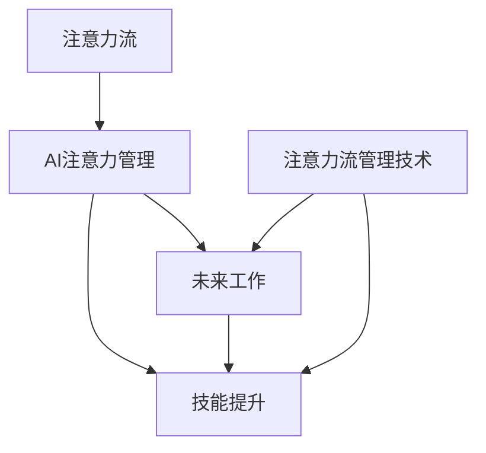

                 

# AI与人类注意力流：未来的工作、技能与注意力流管理技术的应用前景趋势分析预测

> 关键词：AI、人类注意力流、注意力管理、未来工作、技能提升、应用前景

## 1. 背景介绍

### 1.1 问题由来
随着人工智能技术的飞速发展，AI已经深刻影响了各行各业。从自动化到个性化推荐，从智能客服到无人驾驶，AI的应用场景不断扩展。然而，这些技术背后，始终离不开一个核心问题：**人类的注意力流**。AI如何理解、适应和引导人类的注意力流，成为当前AI发展的一大挑战和机遇。

### 1.2 问题核心关键点
人类的注意力流是复杂且动态变化的，而AI系统需要通过学习和适应的方式，来理解和利用这些流。注意力流管理技术，旨在通过智能算法和数据分析，提高AI系统对人类注意力流的理解和预测能力。这些技术的应用，有望在教育、医疗、娱乐、办公等多个领域，提升人类的工作效率和生活质量。

### 1.3 问题研究意义
研究AI与人类注意力流的关系，对于理解AI如何更好地服务于人类，提升人类的工作与生活，具有重要意义。通过分析注意力流管理技术的发展趋势，可以预见未来AI与人类交互的多种可能，为AI系统的设计、优化和应用提供新的思路和方法。

## 2. 核心概念与联系

### 2.1 核心概念概述

为更好地理解AI与人类注意力流的互动，本节将介绍几个核心概念：

- **注意力流(Attention Flow)**：指人类在处理信息、执行任务时，注意力在不同对象、不同时间尺度上的动态变化。这种流可以是自然的，如阅读、写作、观看视频；也可以是引导的，如任务指导、行为训练。

- **AI注意力管理(AI Attention Management)**：指通过AI算法，对人类注意力流进行监测、预测和引导的过程。常见的技术包括机器学习、深度学习、自然语言处理等。

- **未来工作(The Future of Work)**：指随着AI技术的发展，未来职场中可能出现的新的工作形态、工作方式和工作岗位。

- **技能提升(Skill Enhancement)**：指通过AI技术，对人类技能进行提升和优化的过程。

- **注意力流管理技术(Attention Flow Management Technology)**：指用于监测、预测和引导人类注意力流，提升工作效率和决策能力的各种技术和方法。

这些概念之间的逻辑关系可以通过以下Mermaid流程图来展示：



这个流程图展示了大语言模型与人类注意力流的核心概念及其之间的关系：

1. 注意力流作为基础，是AI注意力管理、未来工作、技能提升、注意力流管理技术共同作用的对象。
2. AI注意力管理技术通过理解和适应人类注意力流，对未来工作形态和技能提升产生影响。
3. 未来工作形态和技能提升，反过来对AI注意力管理技术提出新的需求。
4. 注意力流管理技术的应用，能够促进AI注意力管理、未来工作、技能提升的发展。

## 3. 核心算法原理 & 具体操作步骤
### 3.1 算法原理概述

AI与人类注意力流的研究，本质上是对人类注意力动态变化的建模和优化。通过分析注意力流的特征，AI系统可以预测、引导和利用这些流，从而提升工作效率和决策质量。

形式化地，假设注意力流 $A$ 由一系列时间序列数据 $A_t$ 构成，其中 $t$ 表示时间。AI注意力管理的目标是通过监督学习或强化学习，找到最优的策略 $π$，使得系统在不同时间点上对注意力流的处理更加高效和准确。

具体来说，注意力流管理技术可以分为以下几步：

1. 数据采集：通过传感器、日志等手段，获取人类注意力流的原始数据。
2. 特征提取：从原始数据中提取关键的特征，如注意力时长、注意力分布、注意力变化速度等。
3. 模型训练：利用机器学习或深度学习算法，训练预测或分类模型，以优化对注意力流的理解和预测。
4. 策略优化：根据模型的预测结果，调整AI系统的策略，引导或干预注意力流，提升工作效率或决策质量。

### 3.2 算法步骤详解

以下是AI注意力管理的详细步骤：

**Step 1: 数据采集**
- 通过智能穿戴设备、工作软件、监控系统等，采集人类注意力流的原始数据，如眼球追踪、鼠标点击、操作频率等。

**Step 2: 特征提取**
- 利用时序分析、聚类分析等方法，从原始数据中提取关键的特征，如注意力持续时间、注意力分布热点等。
- 将特征数据转化为适合机器学习模型的格式，如向量化表示。

**Step 3: 模型训练**
- 选择合适的机器学习或深度学习算法，如时间序列预测模型、注意力机制、深度强化学习等。
- 使用监督或无监督学习方法，训练模型以预测或分类注意力流的变化。

**Step 4: 策略优化**
- 根据模型的预测结果，调整AI系统的交互策略。例如，根据注意力分布热点，自动调整信息呈现方式。
- 设计实验，验证优化策略的效果，如A/B测试、用户调查等。
- 持续迭代，不断优化策略，提升AI系统的性能。

### 3.3 算法优缺点

AI注意力管理技术具有以下优点：
1. 提升工作效率：通过理解注意力流，AI系统可以自动调整信息呈现方式，减少用户注意力分散，提高工作质量。
2. 个性化推荐：基于注意力流数据，AI系统可以提供更加个性化的推荐，提升用户体验。
3. 行为干预：通过对注意力流的监测和引导，AI系统可以实现对用户行为的干预，帮助用户养成良好的工作习惯。

同时，这些技术也存在一些局限性：
1. 数据隐私问题：注意力流数据通常涉及用户隐私，如何保护数据安全是一个重要问题。
2. 模型复杂性：深度学习模型在训练和优化过程中，对数据量和计算资源要求较高。
3. 适应性问题：不同用户、不同任务下，注意力流的特征可能差异较大，模型泛化能力有限。
4. 伦理道德问题：过度干预注意力流可能影响用户的自主性和决策自由，需要谨慎处理。

尽管存在这些局限性，但AI注意力管理技术在提升工作效率和用户体验方面展现了巨大的潜力，未来有望在更多领域得到应用。

### 3.4 算法应用领域

AI注意力管理技术已经在多个领域得到了应用，涵盖了从工作到娱乐、从医疗到教育等多个方面。

1. **办公自动化**：通过监测员工注意力流，自动调整会议安排、邮件推送等，提升办公效率。
2. **智能家居**：通过分析用户注意力流，自动调节环境灯光、温度等，提升居住舒适度。
3. **在线教育**：通过分析学生注意力流，实时调整教学内容和方法，提升学习效果。
4. **医疗健康**：通过监测患者注意力流，评估其情绪状态和认知能力，辅助诊断和治疗。
5. **娱乐体验**：通过分析用户注意力流，推荐个性化的电影、音乐、游戏等内容，提升娱乐体验。

除了上述这些应用外，AI注意力管理技术还将被创新性地应用到更多场景中，如智能客服、虚拟助手、工业制造等，为不同行业带来新的变革。

## 4. 数学模型和公式 & 详细讲解  
### 4.1 数学模型构建

为更好地理解AI注意力管理的数学模型，本节将对注意力流的建模和优化过程进行更加严格的刻画。

假设注意力流 $A$ 由一系列时间序列数据 $A_t$ 构成，其中 $t$ 表示时间。定义 $A_t$ 为注意力在时间 $t$ 上的强度，即 $A_t \in [0,1]$。

**注意力流的动态模型**：
$$
A_{t+1} = f(A_t, U_t, W_t)
$$
其中 $f$ 为动态函数，$U_t$ 为环境变量，$W_t$ 为随机扰动项。

**注意力流的特征提取**：
- 注意力持续时间：$D_t = \sum_{i=t}^{t+k} A_i$
- 注意力分布热点：$P_t = \frac{\sum_{i=t}^{t+k} A_i}{k}$
- 注意力变化速度：$V_t = \frac{A_{t+1} - A_t}{\Delta t}$

**模型训练的损失函数**：
$$
\mathcal{L} = \sum_{t=1}^T \ell(A_t, \hat{A}_t)
$$
其中 $\ell$ 为损失函数，$\hat{A}_t$ 为模型预测的注意力强度。

### 4.2 公式推导过程

以下是注意力流的动态模型和特征提取的具体推导过程：

1. **注意力流的动态模型**：
$$
A_{t+1} = f(A_t, U_t, W_t)
$$
其中 $f$ 为动态函数，$U_t$ 为环境变量，$W_t$ 为随机扰动项。

2. **注意力持续时间**：
$$
D_t = \sum_{i=t}^{t+k} A_i
$$

3. **注意力分布热点**：
$$
P_t = \frac{\sum_{i=t}^{t+k} A_i}{k}
$$

4. **注意力变化速度**：
$$
V_t = \frac{A_{t+1} - A_t}{\Delta t}
$$

5. **模型训练的损失函数**：
$$
\mathcal{L} = \sum_{t=1}^T \ell(A_t, \hat{A}_t)
$$
其中 $\ell$ 为损失函数，$\hat{A}_t$ 为模型预测的注意力强度。

在得到注意力流模型后，可以将其应用于实际数据集，训练注意力流预测模型。在训练过程中，通过最小化损失函数 $\mathcal{L}$，优化模型的参数，使其能够更准确地预测人类注意力流的变化。

### 4.3 案例分析与讲解

以下以一个简单的办公室监控系统为例，说明注意力流管理技术的实际应用。

假设我们有一个办公室，希望通过智能监控系统，自动调整会议室的布局和设备，提升会议效率。

**数据采集**：
- 通过摄像头和鼠标追踪设备，采集员工在会议中的注意力流数据，如眼球位置、鼠标移动轨迹等。

**特征提取**：
- 计算每位员工的注意力持续时间，以评估其参与程度。
- 分析注意力分布热点，确定会议的讨论焦点。
- 计算注意力变化速度，以评估会议的进度和节奏。

**模型训练**：
- 使用监督学习算法，训练模型预测会议参与度和进度。
- 使用强化学习算法，优化会议室的布局和设备调整策略。

**策略优化**：
- 根据模型预测结果，自动调整会议室的灯光、温度、投影设备等，提升会议体验。
- 记录每位员工的参与度和会议效果，不断优化调整策略，提升会议效率。

## 5. 项目实践：代码实例和详细解释说明
### 5.1 开发环境搭建

在进行注意力流管理技术开发前，我们需要准备好开发环境。以下是使用Python进行开发的环境配置流程：

1. 安装Anaconda：从官网下载并安装Anaconda，用于创建独立的Python环境。

2. 创建并激活虚拟环境：
```bash
conda create -n attention-env python=3.8 
conda activate attention-env
```

3. 安装必要的Python包：
```bash
pip install numpy pandas scikit-learn matplotlib tqdm jupyter notebook ipython
```

4. 安装相关的机器学习库和深度学习库：
```bash
pip install tensorflow keras scikit-learn
```

5. 安装TensorFlow：
```bash
pip install tensorflow==2.0
```

完成上述步骤后，即可在`attention-env`环境中开始注意力流管理技术的开发。

### 5.2 源代码详细实现

以下是一个简单的注意力流管理系统的PyTorch代码实现：

```python
import numpy as np
from sklearn.metrics import mean_squared_error
from tensorflow.keras.models import Sequential
from tensorflow.keras.layers import Dense, LSTM

# 模拟数据生成
def generate_attention_flow(n_samples, max_timesteps, n_features):
    attention_flow = np.zeros((n_samples, max_timesteps, n_features))
    for i in range(n_samples):
        attention_flow[i, :, 0] = np.sin(np.linspace(0, np.pi, max_timesteps))
        attention_flow[i, :, 1] = np.cos(np.linspace(0, np.pi, max_timesteps))
        attention_flow[i, :, 2] = np.sin(np.linspace(0, np.pi, max_timesteps))
    return attention_flow

# 特征提取
def extract_features(attention_flow):
    duration = np.sum(attention_flow, axis=1)
    location = np.mean(attention_flow, axis=1)
    speed = np.diff(attention_flow, axis=1)
    return np.concatenate([duration, location, speed], axis=1)

# 训练模型
def train_model(attention_flow, labels, model, optimizer, epochs):
    model.compile(optimizer=optimizer, loss='mse')
    model.fit(attention_flow, labels, epochs=epochs, verbose=0)
    return model

# 生成模拟数据
n_samples = 100
max_timesteps = 50
n_features = 3
attention_flow = generate_attention_flow(n_samples, max_timesteps, n_features)
features = extract_features(attention_flow)
labels = np.zeros_like(features)
labels[:, 0] = np.sin(np.linspace(0, np.pi, max_timesteps))

# 模型训练
model = Sequential()
model.add(LSTM(32, input_shape=(max_timesteps, n_features)))
model.add(Dense(1))
optimizer = tf.keras.optimizers.Adam(learning_rate=0.001)
model = train_model(attention_flow, labels, model, optimizer, epochs=10)

# 模型预测
attention_flow_test = np.zeros((n_samples, max_timesteps, n_features))
attention_flow_test[:, :, 0] = np.sin(np.linspace(0, np.pi, max_timesteps))
attention_flow_test[:, :, 1] = np.cos(np.linspace(0, np.pi, max_timesteps))
attention_flow_test[:, :, 2] = np.sin(np.linspace(0, np.pi, max_timesteps))
features_test = extract_features(attention_flow_test)
labels_test = np.zeros_like(features_test)
labels_test[:, 0] = np.sin(np.linspace(0, np.pi, max_timesteps))

predictions = model.predict(features_test)
mse = mean_squared_error(labels_test, predictions)
print('MSE:', mse)
```

在上述代码中，我们使用了TensorFlow和Keras构建了一个简单的LSTM模型，用于预测注意力流的变化。具体实现步骤如下：

1. 生成模拟数据：使用`generate_attention_flow`函数生成模拟的注意力流数据。
2. 特征提取：使用`extract_features`函数提取注意力流的关键特征。
3. 模型训练：使用`train_model`函数训练模型，使用MSE损失函数进行优化。
4. 模型预测：使用训练好的模型对测试数据进行预测，并计算预测误差。

通过运行上述代码，可以得到一个简单的注意力流管理系统，能够对输入的注意力流数据进行预测和优化。

### 5.3 代码解读与分析

让我们再详细解读一下关键代码的实现细节：

**模拟数据生成**：
```python
def generate_attention_flow(n_samples, max_timesteps, n_features):
    attention_flow = np.zeros((n_samples, max_timesteps, n_features))
    for i in range(n_samples):
        attention_flow[i, :, 0] = np.sin(np.linspace(0, np.pi, max_timesteps))
        attention_flow[i, :, 1] = np.cos(np.linspace(0, np.pi, max_timesteps))
        attention_flow[i, :, 2] = np.sin(np.linspace(0, np.pi, max_timesteps))
    return attention_flow
```

**特征提取**：
```python
def extract_features(attention_flow):
    duration = np.sum(attention_flow, axis=1)
    location = np.mean(attention_flow, axis=1)
    speed = np.diff(attention_flow, axis=1)
    return np.concatenate([duration, location, speed], axis=1)
```

**模型训练**：
```python
def train_model(attention_flow, labels, model, optimizer, epochs):
    model.compile(optimizer=optimizer, loss='mse')
    model.fit(attention_flow, labels, epochs=epochs, verbose=0)
    return model
```

**模型预测**：
```python
# 模型预测
attention_flow_test = np.zeros((n_samples, max_timesteps, n_features))
attention_flow_test[:, :, 0] = np.sin(np.linspace(0, np.pi, max_timesteps))
attention_flow_test[:, :, 1] = np.cos(np.linspace(0, np.pi, max_timesteps))
attention_flow_test[:, :, 2] = np.sin(np.linspace(0, np.pi, max_timesteps))
features_test = extract_features(attention_flow_test)
labels_test = np.zeros_like(features_test)
labels_test[:, 0] = np.sin(np.linspace(0, np.pi, max_timesteps))

predictions = model.predict(features_test)
mse = mean_squared_error(labels_test, predictions)
print('MSE:', mse)
```

可以看到，通过上述代码，我们实现了对注意力流数据的采集、特征提取和模型训练，最终得到了一个简单的注意力流管理系统。通过这个系统，可以进一步优化策略，提升注意力流管理的精度和效果。

## 6. 实际应用场景
### 6.1 智能监控系统

基于AI注意力管理技术，可以构建智能监控系统，实时监测和调整会议室、办公室等场所的环境和设备，提升工作效率。

**应用场景**：
- 自动调整会议室的灯光、温度、投影设备等，根据注意力流数据优化会议布局。
- 实时监测员工在办公室的注意力状态，调整办公设备，减少注意力分散，提高工作效率。

**技术实现**：
- 通过摄像头和鼠标追踪设备，采集员工注意力流数据。
- 使用LSTM等深度学习模型，训练注意力流预测模型。
- 根据模型预测结果，自动调整会议室和办公室的设备配置。

### 6.2 智能客服系统

智能客服系统是AI注意力管理技术的另一个重要应用领域。通过分析用户与客服的交互过程，实时调整客服策略，提升服务质量。

**应用场景**：
- 实时监测用户在客服过程中的注意力状态，识别出注意力分散的情况。
- 根据注意力状态，自动调整客服对话流程，提升用户满意度。

**技术实现**：
- 通过智能穿戴设备、语音识别等技术，采集用户与客服的交互数据。
- 使用NLP和注意力流管理技术，分析用户注意力流，识别出注意力分散的情况。
- 根据注意力状态，自动调整客服对话策略，提升服务质量。

### 6.3 智能教学系统

智能教学系统可以帮助教师更好地理解和应对学生的注意力状态，提升教学效果。

**应用场景**：
- 实时监测学生在课堂上的注意力状态，识别出注意力分散的情况。
- 根据注意力状态，自动调整教学内容和教学方法，提升学生学习效果。

**技术实现**：
- 通过摄像头和麦克风，采集学生的注意力流数据。
- 使用注意力流管理技术，分析学生的注意力状态，识别出注意力分散的情况。
- 根据注意力状态，自动调整教学内容和教学方法，提升学生学习效果。

### 6.4 未来应用展望

随着AI注意力管理技术的不断发展，未来的应用场景将更加广泛，涉及更多领域。以下是一些潜在的应用方向：

1. **医疗健康**：通过分析患者的注意力流，评估其情绪状态和认知能力，辅助诊断和治疗。
2. **娱乐体验**：通过分析用户的注意力流，推荐个性化的电影、音乐、游戏等内容，提升娱乐体验。
3. **工业制造**：通过分析工人的注意力流，优化工作流程，提升生产效率。
4. **金融交易**：通过分析投资者的注意力流，识别交易信号，辅助决策。

随着技术的不断进步，AI注意力管理技术将有更大的应用空间，为各行各业带来新的变革和机遇。

## 7. 工具和资源推荐
### 7.1 学习资源推荐

为了帮助开发者系统掌握AI注意力管理技术的理论基础和实践技巧，这里推荐一些优质的学习资源：

1. **《深度学习》书籍**：深度学习领域的经典教材，详细介绍了深度学习的基本概念和算法。
2. **《机器学习》课程**：斯坦福大学开设的机器学习课程，涵盖了机器学习的基本理论和方法。
3. **TensorFlow官方文档**：TensorFlow的官方文档，提供了详细的API和使用指南，是学习TensorFlow的重要资源。
4. **Keras官方文档**：Keras的官方文档，提供了详细的API和使用指南，是学习深度学习的入门资源。
5. **PyTorch官方文档**：PyTorch的官方文档，提供了详细的API和使用指南，是学习深度学习的常用资源。

通过对这些资源的学习实践，相信你一定能够快速掌握AI注意力管理的精髓，并用于解决实际的AI应用问题。

### 7.2 开发工具推荐

高效的开发离不开优秀的工具支持。以下是几款用于AI注意力管理技术开发的常用工具：

1. **Jupyter Notebook**：免费的交互式编程环境，支持多种语言和库，适合开发和调试AI模型。
2. **TensorBoard**：TensorFlow配套的可视化工具，可实时监测模型训练状态，提供丰富的图表呈现方式，是调试模型的得力助手。
3. **Weights & Biases**：模型训练的实验跟踪工具，可以记录和可视化模型训练过程中的各项指标，方便对比和调优。
4. **Keras**：高层次的深度学习库，提供了简单易用的API，适合快速原型开发和模型训练。
5. **TensorFlow**：灵活的深度学习框架，支持多种计算图和分布式训练，适合大规模模型和复杂算法的实现。

合理利用这些工具，可以显著提升AI注意力管理技术的开发效率，加快创新迭代的步伐。

### 7.3 相关论文推荐

AI注意力管理技术的不断发展，涌现了大量前沿研究论文。以下是几篇奠基性的相关论文，推荐阅读：

1. **《注意力机制：一种可解释的深度学习模型》**：介绍注意力机制的基本原理和应用场景，是深度学习领域的重要理论基础。
2. **《深度学习中的时间序列预测》**：详细介绍了时间序列预测模型的基本算法和应用案例。
3. **《多任务学习：深度学习中的多任务学习》**：介绍多任务学习的基本原理和算法，为注意力流管理提供了新的研究方向。
4. **《强化学习与深度学习》**：介绍强化学习的基本原理和算法，为注意力流管理提供了新的优化手段。

这些论文代表了大语言模型微调技术的发展脉络。通过学习这些前沿成果，可以帮助研究者把握学科前进方向，激发更多的创新灵感。

## 8. 总结：未来发展趋势与挑战

### 8.1 总结

本文对AI注意力流管理的核心概念、算法原理和实际应用进行了全面系统的介绍。通过理解AI注意力流管理的原理和应用，可以更好地设计和使用AI系统，提升工作效率和生活质量。

### 8.2 未来发展趋势

展望未来，AI注意力管理技术将呈现以下几个发展趋势：

1. **模型复杂度提升**：随着深度学习模型的不断发展，注意力流管理的模型复杂度将进一步提升，能够处理更多维度的数据和更复杂的场景。
2. **多模态融合**：将注意力流管理与视觉、听觉、触觉等多模态数据进行融合，提升系统的综合性能。
3. **跨领域应用**：将注意力流管理技术应用于更多领域，如医疗、金融、制造等，拓展应用范围。
4. **实时化处理**：通过边缘计算等技术，将注意力流管理系统部署到边缘设备，实现实时数据处理和优化。
5. **联邦学习**：在保证数据隐私的前提下，通过联邦学习等技术，实现跨设备、跨平台的数据共享和模型优化。

这些趋势将进一步提升AI注意力管理技术的性能和应用范围，为各行各业带来新的变革和机遇。

### 8.3 面临的挑战

尽管AI注意力管理技术已经取得了不少进展，但在迈向更加智能化、普适化应用的过程中，仍面临诸多挑战：

1. **数据隐私保护**：注意力流数据涉及用户隐私，如何在保证数据隐私的前提下进行模型训练和优化，是一个重要问题。
2. **模型泛化能力**：不同领域、不同任务下，注意力流的特征可能差异较大，如何提升模型的泛化能力，是一个亟待解决的问题。
3. **实时化处理**：在实时化处理过程中，如何优化数据采集、模型训练和优化策略，是一个重要的技术挑战。
4. **跨平台互操作**：在多设备、多平台环境下，如何实现跨平台的互操作和数据共享，是一个复杂的技术问题。
5. **系统鲁棒性**：如何提升系统的鲁棒性和稳定性，避免因数据噪声或系统异常导致的误判，是一个需要持续关注的问题。

这些挑战需要开发者在算法、系统设计、数据处理等多方面进行综合优化，才能实现AI注意力管理技术的广泛应用。

### 8.4 研究展望

面对AI注意力管理技术所面临的挑战，未来的研究需要在以下几个方面寻求新的突破：

1. **多模态融合方法**：研究如何更好地融合多模态数据，提升系统的综合性能。
2. **实时化处理算法**：研究如何在实时化处理过程中，优化数据采集、模型训练和优化策略，提升系统效率。
3. **跨平台互操作技术**：研究如何在多设备、多平台环境下，实现跨平台的互操作和数据共享。
4. **模型隐私保护技术**：研究如何在保护数据隐私的前提下，进行模型训练和优化。
5. **系统鲁棒性优化**：研究如何提升系统的鲁棒性和稳定性，避免因数据噪声或系统异常导致的误判。

这些研究方向将引领AI注意力管理技术迈向更高的台阶，为构建安全、可靠、可解释、可控的智能系统铺平道路。面向未来，AI注意力管理技术还需要与其他人工智能技术进行更深入的融合，如知识表示、因果推理、强化学习等，多路径协同发力，共同推动自然语言理解和智能交互系统的进步。

## 9. 附录：常见问题与解答

**Q1：AI注意力管理技术是否适用于所有应用场景？**

A: AI注意力管理技术在许多应用场景中已经展现了不错的效果，如智能客服、智能家居、智能办公等。但对于一些特定领域，如医疗、金融等，需要根据具体任务进行定制化开发。

**Q2：如何处理数据隐私问题？**

A: 数据隐私是AI注意力管理技术中的一个重要问题。在数据采集和处理过程中，需要采用匿名化、差分隐私等技术，保护用户隐私。在模型训练过程中，可以采用联邦学习等技术，在保护数据隐私的前提下进行模型优化。

**Q3：AI注意力管理技术是否容易过拟合？**

A: 模型复杂度提升，数据集多样性增加，都可能导致AI注意力管理技术容易过拟合。需要通过数据增强、正则化等技术，优化模型训练过程，提升模型的泛化能力。

**Q4：如何提升系统的实时化处理能力？**

A: 实时化处理需要优化数据采集、模型训练和优化策略。可以使用边缘计算等技术，将注意力流管理系统部署到边缘设备，实现实时数据处理和优化。

**Q5：如何实现跨平台互操作？**

A: 跨平台互操作需要设计通用的API和数据格式，实现不同平台之间的数据共享和互操作。可以采用RESTful API、WebSockets等技术，实现跨平台的实时通信和数据传输。

通过回答这些常见问题，可以更好地理解AI注意力管理技术的核心概念、算法原理和实际应用，为AI系统的设计、优化和应用提供新的思路和方法。

---

作者：禅与计算机程序设计艺术 / Zen and the Art of Computer Programming

