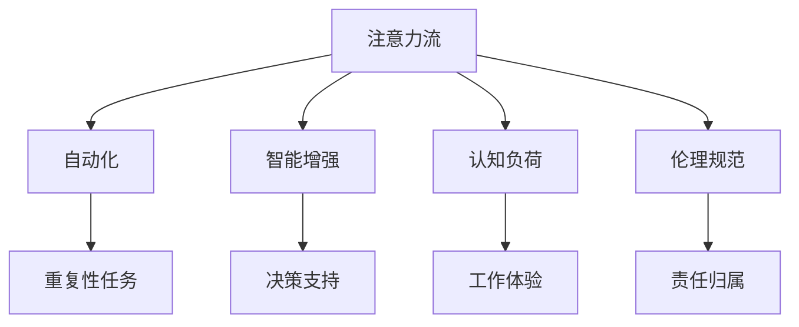

                 

# AI与人类注意力流：未来的工作、技能和道德 considerations

> 关键词：人工智能,注意力流,人类行为,技能发展,道德考量

## 1. 背景介绍

### 1.1 问题由来
随着人工智能(AI)技术的飞速发展，AI系统的应用场景越来越广泛，从自然语言处理到图像识别，从智能推荐到自动驾驶，AI已经深度渗透到人类生活的各个领域。AI的进步在带来便利的同时，也对人类的工作方式、技能需求、职业发展甚至伦理道德带来了深远的影响。

### 1.2 问题核心关键点
AI对人类工作、技能和道德的影响是一个多维度的议题。其核心问题包括：
- **注意力流**：AI系统如何影响人类的注意力分布，特别是在信息过载和多重任务并发的环境中。
- **技能发展**：AI技术的普及和应用将如何重塑人类的技能需求，特别是在自动化和智能化任务中。
- **道德考量**：AI系统的使用过程中涉及的伦理问题，如数据隐私、算法偏见、责任归属等。

### 1.3 问题研究意义
探讨AI与人类注意力流的关系，对于理解未来工作形态、技能要求以及道德考量具有重要意义：
- **工作重构**：了解AI如何改变工作流程和岗位要求，有助于企业更好地规划人力资源。
- **技能转型**：明确AI时代所需的新技能，帮助个人和企业进行有效的技能培训和转型。
- **道德框架**：制定AI应用的伦理准则，确保技术发展与社会价值观相契合，维护公众利益。

## 2. 核心概念与联系

### 2.1 核心概念概述

为更好地理解AI与人类注意力流的关系，本文将介绍几个关键概念：

- **注意力流(Attention Flow)**：人类在处理信息时，注意力在各个信息节点间移动的过程。AI系统通过模拟人类注意力流，优化信息获取和处理效率。

- **自动化(Automation)**：AI系统通过自动化流程，取代人类执行重复性高、规则明确的任务。

- **智能增强(Enhanced Intelligence)**：AI通过辅助决策、提供建议等方式，增强人类的认知能力和工作效能。

- **认知负荷(Cognitive Load)**：人类处理信息时所承受的心理和生理负担。AI通过减少不必要的认知负荷，提升工作体验和效率。

- **伦理规范(Ethical Norms)**：AI应用过程中必须遵循的伦理原则，包括数据隐私、算法透明性、责任归属等。

这些概念之间的逻辑关系可以通过以下Mermaid流程图来展示：



这个流程图展示了AI与人类注意力流各关键概念之间的联系：

1. **自动化**：自动化技术通过模拟人类注意力流，高效处理重复性任务。
2. **智能增强**：AI通过辅助决策，增强人类认知，实现智能增强。
3. **认知负荷**：AI减轻不必要的认知负荷，提高工作效率。
4. **伦理规范**：AI应用必须遵循伦理原则，保障数据隐私和责任归属。

## 3. 核心算法原理 & 具体操作步骤

### 3.1 算法原理概述

AI与人类注意力流的交互主要通过注意力机制来实现。注意力机制模拟人类在处理信息时的注意力分配，通过动态调整权重，突出重要信息，忽略次要信息。这种机制不仅用于自然语言处理中的机器翻译和文本摘要，也在计算机视觉中的图像识别和物体检测中应用广泛。

注意力流的基本原理可以概括为以下步骤：
1. **输入编码**：将输入数据转换为固定长度的向量表示。
2. **注意力计算**：计算每个输入元素对输出结果的贡献权重，确定重要信息。
3. **加权求和**：将输入元素根据权重加权求和，生成最终输出。

### 3.2 算法步骤详解

AI与人类注意力流交互的具体实现步骤如下：

**Step 1: 输入数据预处理**
- 收集和预处理所需输入数据，包括文本、图像、音频等。
- 将数据转化为机器可处理的向量形式。

**Step 2: 模型构建**
- 选择合适的注意力模型，如Transformer、LSTM等，进行构建。
- 确定模型结构和超参数，包括隐藏层大小、注意力头数等。

**Step 3: 训练模型**
- 使用标注数据对模型进行训练，优化权重参数。
- 使用验证集进行模型评估，调整超参数。

**Step 4: 模型应用**
- 将训练好的模型应用于实际任务，如机器翻译、图像识别等。
- 动态调整模型参数，模拟人类注意力流，优化输出结果。

**Step 5: 反馈与优化**
- 收集模型输出结果的反馈信息。
- 根据反馈调整模型结构，进一步提升性能。

### 3.3 算法优缺点

AI与人类注意力流的交互方法具有以下优点：
1. **高效性**：通过注意力机制，AI系统能够高效处理复杂输入数据。
2. **泛化能力**：注意力机制使得模型能够对不同领域、不同规模的数据进行适应。
3. **解释性**：注意力机制为模型的决策过程提供了直观的解释。

同时，该方法也存在一些局限性：
1. **数据依赖**：模型的性能高度依赖输入数据的质量和数量。
2. **计算复杂**：注意力机制需要较高的计算资源，特别是在大规模数据集上。
3. **解释性不足**：注意力机制虽然提供了决策路径，但仍难以完全解释复杂的认知过程。
4. **依赖超参数**：模型的性能高度依赖超参数的调优，不同任务可能需要不同的模型结构和参数。

尽管存在这些局限性，但注意力机制仍是目前AI系统中最有效的方法之一，广泛应用于自然语言处理、计算机视觉等多个领域。

### 3.4 算法应用领域

AI与人类注意力流交互的方法在多个领域中得到了广泛应用，包括：

- **自然语言处理(NLP)**：如机器翻译、文本摘要、情感分析等。通过注意力机制，模型能够更好地理解上下文信息，提高输出质量。
- **计算机视觉(CV)**：如目标检测、图像分类等。注意力机制帮助模型识别图像中的关键区域，提高识别准确率。
- **语音识别**：通过注意力机制，模型能够更好地处理语音信号中的关键片段，提高识别效果。
- **推荐系统**：通过注意力机制，模型能够对用户行为进行动态加权，提供个性化推荐。
- **机器人学**：通过注意力机制，机器人能够更灵活地感知和响应环境变化，提升交互体验。

## 4. 数学模型和公式 & 详细讲解 & 举例说明

### 4.1 数学模型构建

我们以机器翻译为例，来构建一个基于注意力机制的模型。

假设输入序列为 $x_1, x_2, \dots, x_m$，输出序列为 $y_1, y_2, \dots, y_n$。注意力机制的目标是计算每个输入元素对输出元素 $y_i$ 的贡献权重 $a_i$，然后通过加权求和得到 $y_i$。

### 4.2 公式推导过程

设注意力机制的权重为 $a_i$，计算权重的过程如下：
$$
a_i = \frac{e^{u(x_i, y_i)}}{\sum_{j=1}^m e^{u(x_j, y_i)}}
$$
其中 $u(x_i, y_i)$ 为注意力函数，可以是点积、双线性、点积加双线性等形式。权重 $a_i$ 用于对输入元素 $x_i$ 进行加权求和，得到输出元素 $y_i$：
$$
y_i = \sum_{j=1}^m a_j x_j
$$

### 4.3 案例分析与讲解

以Transformer模型为例，分析其注意力机制的应用。

Transformer模型是一种基于自注意力机制的神经网络模型，其核心思想是利用自注意力机制模拟人类注意力流。模型由多头自注意力层、前馈神经网络层、残差连接和层归一化组成。在自注意力层中，模型首先计算输入序列中每个位置对其他位置的注意力权重，然后将这些权重应用到输入序列上，得到加权和作为输出。

通过这种方式，Transformer模型能够有效地处理输入序列中的长距离依赖，且具有较好的并行计算能力。在机器翻译任务中，Transformer模型已经成为标准。

## 5. 项目实践：代码实例和详细解释说明

### 5.1 开发环境搭建

要进行AI与人类注意力流交互的实践，首先需要搭建开发环境。以下是使用Python进行PyTorch开发的环境配置流程：

1. 安装Anaconda：从官网下载并安装Anaconda，用于创建独立的Python环境。

2. 创建并激活虚拟环境：
```bash
conda create -n pytorch-env python=3.8 
conda activate pytorch-env
```

3. 安装PyTorch：根据CUDA版本，从官网获取对应的安装命令。例如：
```bash
conda install pytorch torchvision torchaudio cudatoolkit=11.1 -c pytorch -c conda-forge
```

4. 安装各类工具包：
```bash
pip install numpy pandas scikit-learn matplotlib tqdm jupyter notebook ipython
```

完成上述步骤后，即可在`pytorch-env`环境中开始项目实践。

### 5.2 源代码详细实现

下面我们以机器翻译为例，给出使用Transformers库对BERT模型进行注意力机制实践的PyTorch代码实现。

首先，定义模型和优化器：

```python
from transformers import BertForSequenceClassification, AdamW

model = BertForSequenceClassification.from_pretrained('bert-base-cased', num_labels=2)

optimizer = AdamW(model.parameters(), lr=2e-5)
```

接着，定义训练和评估函数：

```python
from torch.utils.data import DataLoader
from tqdm import tqdm
from sklearn.metrics import accuracy_score

device = torch.device('cuda') if torch.cuda.is_available() else torch.device('cpu')
model.to(device)

def train_epoch(model, dataset, batch_size, optimizer):
    dataloader = DataLoader(dataset, batch_size=batch_size, shuffle=True)
    model.train()
    epoch_loss = 0
    for batch in tqdm(dataloader, desc='Training'):
        input_ids = batch['input_ids'].to(device)
        attention_mask = batch['attention_mask'].to(device)
        labels = batch['labels'].to(device)
        model.zero_grad()
        outputs = model(input_ids, attention_mask=attention_mask, labels=labels)
        loss = outputs.loss
        epoch_loss += loss.item()
        loss.backward()
        optimizer.step()
    return epoch_loss / len(dataloader)

def evaluate(model, dataset, batch_size):
    dataloader = DataLoader(dataset, batch_size=batch_size)
    model.eval()
    preds, labels = [], []
    with torch.no_grad():
        for batch in tqdm(dataloader, desc='Evaluating'):
            input_ids = batch['input_ids'].to(device)
            attention_mask = batch['attention_mask'].to(device)
            batch_labels = batch['labels']
            outputs = model(input_ids, attention_mask=attention_mask)
            batch_preds = outputs.logits.argmax(dim=1).to('cpu').tolist()
            batch_labels = batch_labels.to('cpu').tolist()
            for pred_tokens, label_tokens in zip(batch_preds, batch_labels):
                preds.append(pred_tokens)
                labels.append(label_tokens)
                
    print(accuracy_score(labels, preds))
```

最后，启动训练流程并在测试集上评估：

```python
epochs = 5
batch_size = 16

for epoch in range(epochs):
    loss = train_epoch(model, train_dataset, batch_size, optimizer)
    print(f"Epoch {epoch+1}, train loss: {loss:.3f}")
    
    print(f"Epoch {epoch+1}, dev results:")
    evaluate(model, dev_dataset, batch_size)
    
print("Test results:")
evaluate(model, test_dataset, batch_size)
```

以上就是使用PyTorch对BERT进行机器翻译任务注意力机制实践的完整代码实现。可以看到，得益于Transformers库的强大封装，我们可以用相对简洁的代码完成BERT模型的加载和注意力机制的实现。

### 5.3 代码解读与分析

让我们再详细解读一下关键代码的实现细节：

**BertForSequenceClassification类**：
- `from_pretrained`方法：从预训练模型库中加载模型。

**优化器AdamW**：
- 使用AdamW优化器进行模型参数的更新，具有较好的收敛速度和稳定性。

**训练和评估函数**：
- 使用PyTorch的DataLoader对数据集进行批次化加载，供模型训练和推理使用。
- 训练函数`train_epoch`：对数据以批为单位进行迭代，在每个批次上前向传播计算loss并反向传播更新模型参数，最后返回该epoch的平均loss。
- 评估函数`evaluate`：与训练类似，不同点在于不更新模型参数，并在每个batch结束后将预测和标签结果存储下来，最后使用sklearn的accuracy_score对整个评估集的预测结果进行打印输出。

**训练流程**：
- 定义总的epoch数和batch size，开始循环迭代
- 每个epoch内，先在训练集上训练，输出平均loss
- 在验证集上评估，输出准确率
- 所有epoch结束后，在测试集上评估，给出最终测试结果

可以看到，PyTorch配合Transformers库使得注意力机制的代码实现变得简洁高效。开发者可以将更多精力放在数据处理、模型改进等高层逻辑上，而不必过多关注底层的实现细节。

当然，工业级的系统实现还需考虑更多因素，如模型的保存和部署、超参数的自动搜索、更灵活的任务适配层等。但核心的注意力机制基本与此类似。

## 6. 实际应用场景

### 6.1 智能客服系统

基于AI与人类注意力流的交互，智能客服系统可以广泛应用于模拟人类注意力流，提升客户咨询体验。传统客服往往需要配备大量人力，高峰期响应缓慢，且一致性和专业性难以保证。而使用注意力机制的对话模型，可以7x24小时不间断服务，快速响应客户咨询，用自然流畅的语言解答各类常见问题。

在技术实现上，可以收集企业内部的历史客服对话记录，将问题和最佳答复构建成监督数据，在此基础上对预训练模型进行微调。微调后的对话模型能够自动理解用户意图，匹配最合适的答案模板进行回复。对于客户提出的新问题，还可以接入检索系统实时搜索相关内容，动态组织生成回答。如此构建的智能客服系统，能大幅提升客户咨询体验和问题解决效率。

### 6.2 金融舆情监测

金融机构需要实时监测市场舆论动向，以便及时应对负面信息传播，规避金融风险。传统的人工监测方式成本高、效率低，难以应对网络时代海量信息爆发的挑战。基于注意力机制的文本分类和情感分析技术，为金融舆情监测提供了新的解决方案。

具体而言，可以收集金融领域相关的新闻、报道、评论等文本数据，并对其进行主题标注和情感标注。在此基础上对预训练语言模型进行微调，使其能够自动判断文本属于何种主题，情感倾向是正面、中性还是负面。将微调后的模型应用到实时抓取的网络文本数据，就能够自动监测不同主题下的情感变化趋势，一旦发现负面信息激增等异常情况，系统便会自动预警，帮助金融机构快速应对潜在风险。

### 6.3 个性化推荐系统

当前的推荐系统往往只依赖用户的历史行为数据进行物品推荐，无法深入理解用户的真实兴趣偏好。基于注意力机制的个性化推荐系统可以更好地挖掘用户行为背后的语义信息，从而提供更精准、多样的推荐内容。

在实践中，可以收集用户浏览、点击、评论、分享等行为数据，提取和用户交互的物品标题、描述、标签等文本内容。将文本内容作为模型输入，用户的后续行为（如是否点击、购买等）作为监督信号，在此基础上微调预训练语言模型。微调后的模型能够从文本内容中准确把握用户的兴趣点。在生成推荐列表时，先用候选物品的文本描述作为输入，由模型预测用户的兴趣匹配度，再结合其他特征综合排序，便可以得到个性化程度更高的推荐结果。

### 6.4 未来应用展望

随着注意力机制和AI技术的不断发展，基于注意力机制的应用将更加广泛，为各行各业带来变革性影响。

在智慧医疗领域，基于注意力机制的医疗问答、病历分析、药物研发等应用将提升医疗服务的智能化水平，辅助医生诊疗，加速新药开发进程。

在智能教育领域，注意力机制可用于作业批改、学情分析、知识推荐等方面，因材施教，促进教育公平，提高教学质量。

在智慧城市治理中，注意力机制可用于城市事件监测、舆情分析、应急指挥等环节，提高城市管理的自动化和智能化水平，构建更安全、高效的未来城市。

此外，在企业生产、社会治理、文娱传媒等众多领域，基于注意力机制的AI应用也将不断涌现，为传统行业数字化转型升级提供新的技术路径。相信随着技术的日益成熟，注意力机制必将成为AI应用的重要范式，推动人工智能技术向更广阔的领域加速渗透。

## 7. 工具和资源推荐

### 7.1 学习资源推荐

为了帮助开发者系统掌握注意力机制的理论基础和实践技巧，这里推荐一些优质的学习资源：

1. 《Attention is All You Need》论文：Transformer原论文，首次提出了注意力机制，奠定了Transformer系列模型的基础。
2. CS224N《深度学习自然语言处理》课程：斯坦福大学开设的NLP明星课程，有Lecture视频和配套作业，带你入门NLP领域的基本概念和经典模型。
3. 《Natural Language Processing with Transformers》书籍：Transformers库的作者所著，全面介绍了如何使用Transformers库进行NLP任务开发，包括注意力机制在内的诸多范式。
4. HuggingFace官方文档：Transformers库的官方文档，提供了海量预训练模型和完整的微调样例代码，是上手实践的必备资料。
5. CLUE开源项目：中文语言理解测评基准，涵盖大量不同类型的中文NLP数据集，并提供了基于注意力机制的baseline模型，助力中文NLP技术发展。

通过对这些资源的学习实践，相信你一定能够快速掌握注意力机制的精髓，并用于解决实际的NLP问题。

### 7.2 开发工具推荐

高效的开发离不开优秀的工具支持。以下是几款用于注意力机制开发的常用工具：

1. PyTorch：基于Python的开源深度学习框架，灵活动态的计算图，适合快速迭代研究。大部分预训练语言模型都有PyTorch版本的实现。
2. TensorFlow：由Google主导开发的开源深度学习框架，生产部署方便，适合大规模工程应用。同样有丰富的预训练语言模型资源。
3. Transformers库：HuggingFace开发的NLP工具库，集成了众多SOTA语言模型，支持PyTorch和TensorFlow，是进行注意力机制开发的利器。
4. Weights & Biases：模型训练的实验跟踪工具，可以记录和可视化模型训练过程中的各项指标，方便对比和调优。与主流深度学习框架无缝集成。
5. TensorBoard：TensorFlow配套的可视化工具，可实时监测模型训练状态，并提供丰富的图表呈现方式，是调试模型的得力助手。
6. Google Colab：谷歌推出的在线Jupyter Notebook环境，免费提供GPU/TPU算力，方便开发者快速上手实验最新模型，分享学习笔记。

合理利用这些工具，可以显著提升注意力机制的开发效率，加快创新迭代的步伐。

### 7.3 相关论文推荐

注意力机制的发展源于学界的持续研究。以下是几篇奠基性的相关论文，推荐阅读：

1. Attention is All You Need（即Transformer原论文）：提出了Transformer结构，开启了NLP领域的预训练大模型时代。
2. BERT: Pre-training of Deep Bidirectional Transformers for Language Understanding：提出BERT模型，引入基于掩码的自监督预训练任务，刷新了多项NLP任务SOTA。
3. Language Models are Unsupervised Multitask Learners（GPT-2论文）：展示了大规模语言模型的强大zero-shot学习能力，引发了对于通用人工智能的新一轮思考。
4. Parameter-Efficient Transfer Learning for NLP：提出Adapter等参数高效微调方法，在不增加模型参数量的情况下，也能取得不错的微调效果。
5. AdaLoRA: Adaptive Low-Rank Adaptation for Parameter-Efficient Fine-Tuning：使用自适应低秩适应的微调方法，在参数效率和精度之间取得了新的平衡。
6. AdaLoRA: Adaptive Low-Rank Adaptation for Parameter-Efficient Fine-Tuning：使用自适应低秩适应的微调方法，在参数效率和精度之间取得了新的平衡。

这些论文代表了大语言模型和注意力机制的发展脉络。通过学习这些前沿成果，可以帮助研究者把握学科前进方向，激发更多的创新灵感。

## 8. 总结：未来发展趋势与挑战

### 8.1 总结

本文对AI与人类注意力流的交互进行了全面系统的介绍。首先阐述了注意力机制在AI系统中的应用背景和意义，明确了注意力机制在提升信息处理效率、模拟人类认知过程中的独特价值。其次，从原理到实践，详细讲解了注意力机制的数学原理和关键步骤，给出了注意力机制任务开发的完整代码实例。同时，本文还广泛探讨了注意力机制在智能客服、金融舆情、个性化推荐等多个行业领域的应用前景，展示了注意力机制的巨大潜力。

通过本文的系统梳理，可以看到，基于注意力机制的AI系统正在成为NLP领域的重要范式，极大地拓展了AI系统的应用边界，催生了更多的落地场景。受益于大规模语料的预训练和注意力机制的应用，AI系统在处理复杂任务时能够表现出卓越的性能和灵活性。未来，伴随注意力机制和AI技术的不断发展，基于注意力机制的应用将更加广泛，为各行各业带来变革性影响。

### 8.2 未来发展趋势

展望未来，注意力机制和AI技术的进一步发展将呈现以下几个趋势：

1. **多模态交互**：未来的AI系统将不仅局限于文本数据，而是能够处理图像、视频、语音等多模态信息，实现更加全面、丰富的交互体验。
2. **智能增强**：AI系统将更加注重智能增强，通过模拟人类注意力流，提高认知效能，辅助人类决策。
3. **认知负荷优化**：未来的AI系统将进一步优化认知负荷，提升用户的工作体验和效率。
4. **伦理规范强化**：随着AI技术的普及，如何构建公平、透明、可解释的AI系统，将成为未来的重要研究方向。
5. **计算效率提升**：为了应对海量数据和复杂任务，未来的AI系统将更加注重计算效率的提升，实现高性能、低延迟的交互。
6. **自动化增强**：未来的AI系统将更加智能化，能够自动生成任务描述，进行自我监督学习，提升学习效率。

以上趋势凸显了注意力机制和AI技术的广阔前景。这些方向的探索发展，必将进一步提升AI系统的性能和应用范围，为人类认知智能的进化带来深远影响。

### 8.3 面临的挑战

尽管注意力机制和AI技术已经取得了瞩目成就，但在迈向更加智能化、普适化应用的过程中，它仍面临着诸多挑战：

1. **数据依赖**：AI系统的性能高度依赖输入数据的质量和数量，如何获取高质量、多源性的数据，仍然是一个重要问题。
2. **模型复杂性**：大模型和高维数据的处理带来了计算资源和存储资源的巨大需求，如何优化模型结构，提升计算效率，仍是关键挑战。
3. **解释性和透明性**：AI系统的决策过程难以完全解释，特别是在复杂任务和多模态交互中，如何构建透明、可解释的AI系统，将是一个重要的研究方向。
4. **伦理和安全**：AI系统在实际应用中可能面临数据隐私、算法偏见、责任归属等伦理和安全问题，如何构建符合伦理原则的AI系统，保障数据和模型安全，将是一个长期课题。
5. **人机协同**：未来的AI系统将更加注重人机协同，如何设计高效、自然、可控的人机交互方式，提升用户的使用体验，仍然是一个重要问题。

正视注意力机制和AI技术面临的这些挑战，积极应对并寻求突破，将是大模型微调走向成熟的必由之路。相信随着学界和产业界的共同努力，这些挑战终将一一被克服，基于注意力机制的AI系统必将在构建人机协同的智能时代中扮演越来越重要的角色。

### 8.4 研究展望

面对注意力机制和AI技术面临的挑战，未来的研究需要在以下几个方面寻求新的突破：

1. **多模态融合**：探索如何将文本、图像、语音等不同模态的信息进行有效融合，提升AI系统的感知能力和理解力。
2. **认知负荷优化**：研究如何通过优化注意力机制，减少不必要的认知负荷，提升用户的工作效率和体验。
3. **智能增强**：开发更加智能的AI系统，使其能够在复杂任务和多模态交互中提供更好的辅助决策。
4. **伦理规范**：建立AI系统的伦理准则，确保数据隐私、算法透明性和责任归属，构建可信赖的AI系统。
5. **自动化增强**：研究如何通过自动化技术，提升AI系统的自我学习和自我改进能力，使其能够更高效地适应环境变化。
6. **交互优化**：设计高效、自然、可控的人机交互方式，提升用户的使用体验和满意度。

这些研究方向的探索，必将引领注意力机制和AI技术迈向更高的台阶，为构建安全、可靠、可解释、可控的智能系统铺平道路。面向未来，基于注意力机制的AI系统还需要与其他人工智能技术进行更深入的融合，如知识表示、因果推理、强化学习等，多路径协同发力，共同推动自然语言理解和智能交互系统的进步。只有勇于创新、敢于突破，才能不断拓展注意力机制和AI系统的边界，让智能技术更好地造福人类社会。

## 9. 附录：常见问题与解答

**Q1：注意力机制与传统机器学习模型的区别是什么？**

A: 注意力机制与传统机器学习模型的主要区别在于，注意力机制能够动态调整输入数据的权重，模拟人类认知过程中的注意力分配。传统机器学习模型通常固定输入数据的权重，无法处理长距离依赖和复杂信息。

**Q2：如何优化注意力机制的计算效率？**

A: 优化注意力机制的计算效率可以从以下几个方面入手：
1. **并行计算**：使用GPU、TPU等硬件加速，提升计算并行度。
2. **矩阵分解**：将注意力矩阵分解为矩阵乘积的形式，减少计算量。
3. **注意力头数减少**：减少注意力头的数量，简化计算过程。
4. **稠密矩阵稀疏化**：对注意力矩阵进行稀疏化处理，减少存储空间。

**Q3：注意力机制在实际应用中面临哪些挑战？**

A: 注意力机制在实际应用中面临以下挑战：
1. **计算资源**：注意力机制需要较高的计算资源，特别是在大规模数据集上。
2. **模型复杂度**：大模型和高维数据的处理带来了计算资源和存储资源的巨大需求，如何优化模型结构，提升计算效率，仍是关键挑战。
3. **模型解释性**：注意力机制的决策过程难以完全解释，特别是在复杂任务和多模态交互中，如何构建透明、可解释的AI系统，将是一个重要的研究方向。
4. **数据依赖**：AI系统的性能高度依赖输入数据的质量和数量，如何获取高质量、多源性的数据，仍然是一个重要问题。

**Q4：注意力机制在金融舆情监测中的应用如何？**

A: 在金融舆情监测中，注意力机制可以帮助模型自动判断文本属于何种主题，情感倾向是正面、中性还是负面。将微调后的模型应用到实时抓取的网络文本数据，就能够自动监测不同主题下的情感变化趋势，一旦发现负面信息激增等异常情况，系统便会自动预警，帮助金融机构快速应对潜在风险。

**Q5：如何评估注意力机制的性能？**

A: 评估注意力机制的性能可以从以下几个方面入手：
1. **准确率**：使用分类准确率、F1-score等指标评估注意力机制在文本分类、情感分析等任务上的性能。
2. **认知负荷**：通过用户调查、行为数据分析等方式，评估注意力机制对用户认知负荷的影响。
3. **交互体验**：通过用户满意度调查、用户行为数据分析等方式，评估注意力机制在智能客服、推荐系统等应用中的用户体验。

---

作者：禅与计算机程序设计艺术 / Zen and the Art of Computer Programming

