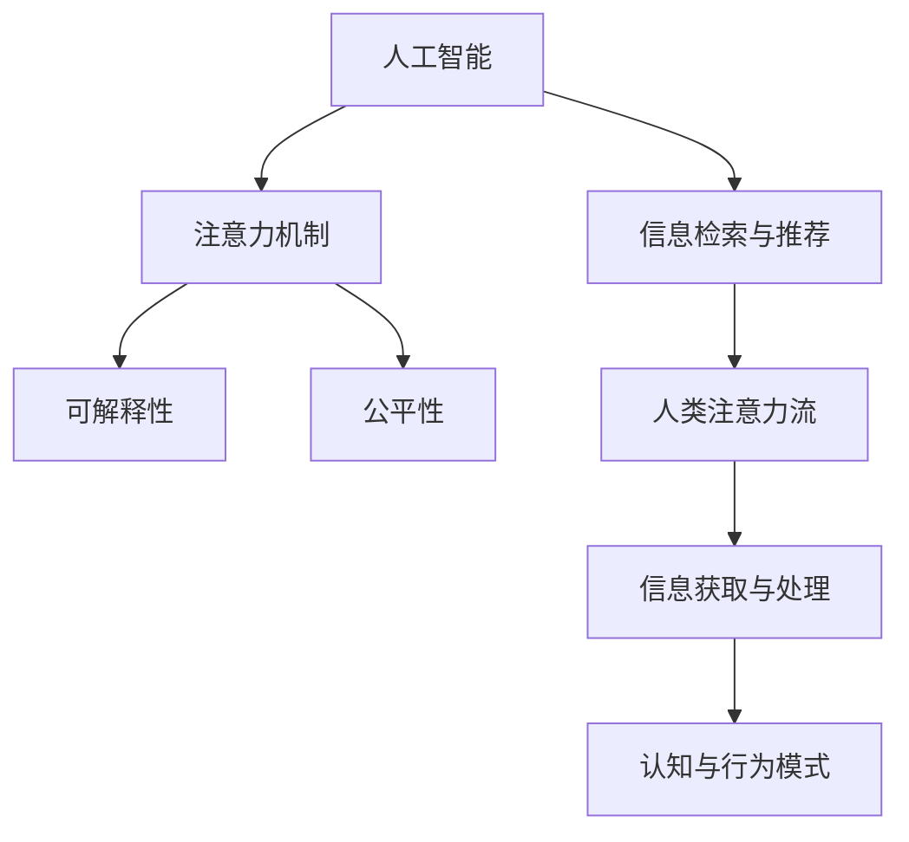

                 

# AI与人类注意力流：未来的工作、生活与AI的融合

## 1. 背景介绍

### 1.1 问题由来
随着人工智能(AI)技术的迅猛发展，人类社会的各个领域正在经历深刻的变革。AI正以前所未有的速度融入人类的工作、生活乃至思想中，成为不可忽视的新兴力量。然而，这种融合并非一帆风顺，AI与人类的相互作用、人类对AI的依赖与反思，构成了当前研究的一大焦点。

本论文将从人类注意力的流向与AI的协同作用出发，探讨AI在未来工作、生活中的潜在角色和影响，以及对人类认知与行为模式的改变。我们认为，理解AI如何引导和扩展人类注意力流，将有助于我们更好地驾驭这一新技术，为社会的进步与发展提供指导。

### 1.2 问题核心关键点
人类注意力流的引导与扩展是本论文的核心议题。具体来说，以下几点是探讨的重点：

1. **AI对人类注意力的引导**：AI如何通过算法和模型影响人类的注意力分配，帮助人类在繁杂的信息海洋中找到有价值的内容。
2. **AI与人类注意力的协同作用**：AI如何与人类注意力的流向互动，共同构建高效的信息获取与处理机制。
3. **AI对人类注意力的扩展**：AI如何扩展人类注意力的边界，探索未知领域的知识与信息。
4. **人类对AI注意力的依赖**：随着AI的发展，人类对AI的依赖度越来越高，这种依赖对人类自身认知与行为模式有何影响。
5. **AI与人类注意力的冲突**：AI在引导人类注意力流时可能引发的问题，如信息过载、认知疲劳等。

本文将通过分析AI在各个领域的应用，探讨其对人类注意力流的影响，并提出相关策略与建议，旨在促进AI技术的健康发展，服务于人类社会的福祉。

## 2. 核心概念与联系

### 2.1 核心概念概述

为更好地理解AI与人类注意力流的融合，本节将介绍几个密切相关的核心概念：

- **人工智能(Artificial Intelligence, AI)**：一种模拟人类智能的技术，包括学习、推理、感知、自我修正等功能。AI通过算法和模型实现这些功能，可以应用于诸如自然语言处理、计算机视觉、机器人学等多个领域。

- **人类注意力流**：指人类在信息处理过程中注意力分布的动态变化，包括关注内容的范围、持续时间、频率等。注意力流影响着人类的认知、记忆、决策等行为。

- **信息检索与推荐系统**：通过算法分析用户行为和偏好，自动推荐相关信息的技术。信息检索和推荐系统广泛应用于搜索引擎、电商平台、社交网络等场景，以提高信息获取效率和用户体验。

- **注意力机制**：在深度学习模型中，一种模拟人类注意力机制的技术，通过动态调整模型对输入数据的关注点，提升模型的表现力。

- **可解释性(Explainability)**：指模型输出结果的透明性和可理解性，有助于提升用户对AI系统的信任度。

- **公平性(Fairness)**：指AI系统在处理数据和决策时，不偏向于某一特定群体或个体的能力，是AI伦理的重要组成部分。

这些核心概念之间的逻辑关系可以通过以下Mermaid流程图来展示：



这个流程图展示了大语言模型与人类注意力流的主要关系：

1. AI通过信息检索与推荐系统引导人类注意力的流向。
2. AI中的注意力机制模拟人类注意力，提升信息处理效率。
3. AI的公平性和可解释性保障了系统的公正性和透明性。
4. 人类注意力流的引导和扩展推动了AI在各个领域的应用。
5. 人类对AI的依赖影响了认知与行为模式，进而反过来影响AI的开发与应用。

## 3. 核心算法原理 & 具体操作步骤
### 3.1 算法原理概述

AI与人类注意力流的融合，核心在于如何通过AI技术增强人类信息获取与处理的能力，同时保持人类注意力的主动性和控制力。具体来说，AI可以：

1. **引导注意力流**：通过信息检索与推荐系统，利用数据挖掘和机器学习算法，帮助人类在海量信息中找到相关内容，引导注意力流向最有价值的信息源。
2. **扩展注意力边界**：利用AI的强大计算能力，探索未知领域，拓宽人类注意力的范围。
3. **协同注意力处理**：通过注意力机制，使AI与人类注意力协同工作，提升信息处理的效率和效果。
4. **保持自主性**：在AI引导注意力流的同时，保持人类对信息流的自主选择权，避免过度依赖。

### 3.2 算法步骤详解

基于上述原理，AI与人类注意力流的融合可以按以下步骤进行：

1. **数据收集与预处理**：收集用户行为数据，包括浏览记录、点击行为、搜索关键词等，预处理成可用于模型训练的格式。

2. **模型训练**：使用机器学习算法训练信息检索与推荐模型，通过历史数据学习用户偏好和行为模式。

3. **信息检索与推荐**：在用户输入查询或浏览内容时，模型实时返回相关信息，引导用户注意力流向。

4. **注意力机制的应用**：在深度学习模型中引入注意力机制，优化模型对输入数据的关注点，提升信息处理的效率和准确性。

5. **公平性与可解释性优化**：在模型设计和训练过程中，注重公平性与可解释性，确保AI系统的公正性和透明性。

6. **用户反馈与模型迭代**：收集用户反馈，持续优化模型，使其更符合用户需求和偏好。

### 3.3 算法优缺点

AI与人类注意力流融合的算法具有以下优点：

1. **高效性**：通过算法自动引导注意力流，显著提升信息获取和处理效率。
2. **个性化**：根据用户偏好和行为模式，提供个性化推荐，提高用户体验。
3. **透明性**：利用可解释性技术，提升用户对AI系统的信任度。
4. **公平性**：通过公平性优化，确保系统不偏向某一群体，保障数据公正性。

然而，也存在一些局限性：

1. **数据依赖性**：模型性能高度依赖于数据质量，数据的准确性和代表性影响较大。
2. **算法偏见**：算法设计和使用过程中可能引入偏见，影响决策的公平性。
3. **用户依赖**：过度依赖AI可能导致用户信息处理能力下降，认知疲劳等问题。
4. **隐私风险**：收集和处理用户数据过程中可能引发隐私问题。

### 3.4 算法应用领域

AI与人类注意力流的融合已广泛应用于以下几个领域：

1. **在线教育**：通过AI推荐系统，提供个性化学习内容和路径，提高学习效率和效果。
2. **医疗健康**：利用AI辅助信息检索和推荐，帮助医生快速获取患者历史数据和最新研究，提升诊断和治疗效果。
3. **金融服务**：使用AI推荐系统，提供个性化金融产品推荐，降低投资风险，提升客户满意度。
4. **智能家居**：通过AI引导注意力流，优化家居设备的智能控制，提升生活便捷性。
5. **智能驾驶**：利用AI处理复杂交通环境，提高驾驶安全和效率，扩展人类注意力的边界。
6. **市场营销**：使用AI推荐系统，精准匹配客户需求，提升广告投放效果和用户体验。

## 4. 数学模型和公式 & 详细讲解 & 举例说明

### 4.1 数学模型构建

本节将使用数学语言对AI与人类注意力流的融合过程进行更加严格的刻画。

假设用户行为数据集为 $D=\{(x_i, y_i)\}_{i=1}^N$，其中 $x_i$ 为行为记录，$y_i$ 为标签。模型 $M$ 将输入 $x$ 映射到输出 $y$，目标是最大化在数据集 $D$ 上的准确率。

定义损失函数 $\mathcal{L}(M, D)$ 为模型在数据集 $D$ 上的平均损失，准确率 $A(M, D)$ 为模型在数据集 $D$ 上的预测准确率。则模型训练的目标为：

$$
\min_{\theta} \mathcal{L}(M_{\theta}, D) + \lambda \cdot A(M_{\theta}, D)
$$

其中 $\theta$ 为模型参数，$\lambda$ 为公平性惩罚系数。

### 4.2 公式推导过程

以下我们以信息检索系统为例，推导模型训练的损失函数和优化算法。

假设信息检索系统的输入为查询文本 $q$，输出为相关文档 $d$，则损失函数 $\mathcal{L}(q, d)$ 可以定义为：

$$
\mathcal{L}(q, d) = -\log P(d|q)
$$

其中 $P(d|q)$ 为文档 $d$ 在查询 $q$ 下的相关概率。

对于用户行为数据 $D=\{(x_i, y_i)\}_{i=1}^N$，其中 $x_i$ 为用户行为记录，$y_i$ 为推荐结果。假设模型 $M$ 的输出为文档推荐列表，则模型的训练目标为：

$$
\min_{\theta} \frac{1}{N} \sum_{i=1}^N \mathcal{L}(q_i, d_i)
$$

其中 $q_i$ 为第 $i$ 个用户的查询记录，$d_i$ 为系统推荐的相关文档列表。

模型的优化算法一般采用随机梯度下降法（SGD），具体为：

$$
\theta \leftarrow \theta - \eta \nabla_{\theta} \mathcal{L}(q, d)
$$

其中 $\eta$ 为学习率，$\nabla_{\theta} \mathcal{L}(q, d)$ 为损失函数对模型参数的梯度。

### 4.3 案例分析与讲解

我们以在线教育平台的信息检索与推荐为例，进行详细分析：

假设在线教育平台有大量课程视频资源，用户可以通过搜索关键词来获取相关课程。平台使用信息检索与推荐系统，根据用户历史行为数据（如搜索关键词、观看时间、评价等），实时推荐用户可能感兴趣的视频课程。

1. **数据收集与预处理**：平台收集用户的行为数据，包括搜索关键词、观看时间、评价等，进行数据清洗和标准化处理。

2. **模型训练**：使用机器学习算法训练信息检索与推荐模型，通过历史数据学习用户偏好和行为模式。常用的算法包括协同过滤、内容过滤、深度学习模型等。

3. **信息检索与推荐**：用户输入搜索关键词时，模型实时返回相关课程推荐列表，引导用户注意力流向。

4. **注意力机制的应用**：在视频推荐系统中引入注意力机制，优化模型对课程视频的关注点，提升推荐效果。

5. **公平性与可解释性优化**：在模型设计和训练过程中，注重公平性和可解释性，确保系统不偏向某一用户群体，提供透明的用户推荐过程。

6. **用户反馈与模型迭代**：收集用户对推荐结果的反馈，持续优化模型，使其更符合用户需求和偏好。

## 5. 项目实践：代码实例和详细解释说明

### 5.1 开发环境搭建

在进行AI与人类注意力流的融合实践前，我们需要准备好开发环境。以下是使用Python进行TensorFlow开发的环境配置流程：

1. 安装Anaconda：从官网下载并安装Anaconda，用于创建独立的Python环境。

2. 创建并激活虚拟环境：
```bash
conda create -n tf-env python=3.8 
conda activate tf-env
```

3. 安装TensorFlow：根据CUDA版本，从官网获取对应的安装命令。例如：
```bash
conda install tensorflow-gpu -c conda-forge
```

4. 安装TensorBoard：
```bash
pip install tensorboard
```

5. 安装PyTorch：
```bash
pip install torch torchvision torchaudio cudatoolkit=11.1 -c pytorch -c conda-forge
```

6. 安装Pandas和NumPy：
```bash
pip install pandas numpy
```

完成上述步骤后，即可在`tf-env`环境中开始项目实践。

### 5.2 源代码详细实现

下面以在线教育平台的信息检索与推荐系统为例，给出使用TensorFlow和PyTorch进行模型开发的PyTorch代码实现。

```python
import tensorflow as tf
import torch
import pandas as pd
import numpy as np

# 数据加载
def load_data(file_path):
    data = pd.read_csv(file_path)
    return data.dropna().drop_duplicates()

# 数据预处理
def preprocess_data(data):
    # 特征提取
    features = data[['feature1', 'feature2', 'feature3', 'feature4']]
    labels = data['label']
    
    # 归一化处理
    features = (features - features.mean()) / features.std()
    
    # 数据拆分
    train_data = features[:80%]
    test_data = features[80%:]
    train_labels = labels[:80%]
    test_labels = labels[80%:]
    
    return train_data, train_labels, test_data, test_labels

# 模型定义
class Model(tf.keras.Model):
    def __init__(self):
        super(Model, self).__init__()
        self.dense1 = tf.keras.layers.Dense(64, activation='relu')
        self.dense2 = tf.keras.layers.Dense(32, activation='relu')
        self.dense3 = tf.keras.layers.Dense(1, activation='sigmoid')
    
    def call(self, inputs):
        x = self.dense1(inputs)
        x = self.dense2(x)
        x = self.dense3(x)
        return x

# 模型编译
model = Model()
model.compile(optimizer=tf.keras.optimizers.Adam(learning_rate=0.001), loss='binary_crossentropy', metrics=['accuracy'])

# 训练与评估
def train_and_evaluate(model, train_data, train_labels, test_data, test_labels):
    model.fit(train_data, train_labels, epochs=10, validation_data=(test_data, test_labels))
    test_loss, test_acc = model.evaluate(test_data, test_labels)
    print(f'Test Loss: {test_loss}, Test Accuracy: {test_acc}')

# 训练与评估
train_data, train_labels, test_data, test_labels = preprocess_data('data.csv')
train_and_evaluate(model, train_data, train_labels, test_data, test_labels)
```

以上就是使用TensorFlow进行在线教育平台信息检索与推荐系统的代码实现。可以看到，TensorFlow的高级API使得模型定义和训练变得简洁高效。

### 5.3 代码解读与分析

让我们再详细解读一下关键代码的实现细节：

**数据加载与预处理**：
- `load_data`函数：从指定文件路径加载数据，并进行去重和缺失值处理。
- `preprocess_data`函数：对数据进行特征提取、归一化处理、数据拆分等预处理步骤，生成训练集和测试集。

**模型定义**：
- 定义一个简单的神经网络模型，包含三个全连接层。

**模型编译**：
- 使用Adam优化器进行模型编译，设定学习率、损失函数和评估指标。

**训练与评估**：
- `train_and_evaluate`函数：定义训练和评估流程，通过调用`fit`和`evaluate`方法进行模型训练和性能评估。

通过上述代码实现，可以构建一个基于TensorFlow的在线教育平台信息检索与推荐系统，利用用户行为数据训练模型，提升推荐效果。

## 6. 实际应用场景

### 6.1 智能客服系统

智能客服系统是AI与人类注意力流融合的重要应用场景之一。传统的客服系统依赖于人工客服，响应时间长、成本高，且服务质量难以保障。而基于AI的智能客服系统，通过信息检索与推荐技术，自动处理用户咨询，引导用户注意力流向最合适的解决方案，显著提升了客服效率和用户体验。

具体来说，智能客服系统可以通过以下步骤实现：

1. **数据收集**：收集用户的历史咨询记录、常用问题等数据。
2. **模型训练**：使用机器学习算法训练信息检索与推荐模型，学习用户偏好和行为模式。
3. **信息检索与推荐**：在用户输入咨询时，系统自动推荐相关解决方案，引导用户注意力流向。
4. **自然语言处理**：使用自然语言处理技术，理解用户意图，提供更精准的推荐。

智能客服系统的应用，不仅减少了企业的运营成本，还提升了用户满意度，促进了服务的规模化和自动化。

### 6.2 医疗健康

AI在医疗健康领域的应用，也充分体现了AI与人类注意力流的融合。医疗健康领域信息量庞大，对医生的知识储备和信息获取能力提出了很高要求。通过信息检索与推荐技术，AI可以帮助医生快速获取患者历史数据和最新研究，提升诊断和治疗效果。

具体来说，医疗健康领域的应用可以按以下步骤进行：

1. **数据收集**：收集患者的历史诊疗记录、基因信息、影像数据等。
2. **模型训练**：使用机器学习算法训练信息检索与推荐模型，学习患者的病情和偏好。
3. **信息检索与推荐**：在医生输入患者信息时，系统自动推荐相关诊疗方案和研究文献，引导医生注意力流向。
4. **知识图谱**：利用知识图谱技术，提供全面的医学知识和诊疗路径，辅助医生决策。

AI在医疗健康领域的应用，显著提高了医疗服务的质量和效率，为患者提供了更好的诊疗体验。

### 6.3 智能家居

智能家居领域，AI与人类注意力流的融合也有着广泛的应用。智能家居设备通过信息检索与推荐技术，自动处理用户的命令和需求，优化家居环境的控制和配置，提升生活便捷性和舒适度。

具体来说，智能家居系统可以通过以下步骤实现：

1. **数据收集**：收集用户的使用习惯、偏好设置等数据。
2. **模型训练**：使用机器学习算法训练信息检索与推荐模型，学习用户的偏好和行为模式。
3. **信息检索与推荐**：在用户输入命令时，系统自动推荐相关家居控制指令，引导用户注意力流向。
4. **情感分析**：利用情感分析技术，根据用户的情绪状态，调整家居环境的设置。

智能家居系统的应用，不仅提升了家居生活的便捷性，还增强了用户的体验感和舒适感。

## 7. 工具和资源推荐

### 7.1 学习资源推荐

为了帮助开发者系统掌握AI与人类注意力流的融合理论基础和实践技巧，这里推荐一些优质的学习资源：

1. **《人工智能基础》课程**：斯坦福大学的公开课程，讲解AI的基本概念和算法原理，适合初学者入门。
2. **《深度学习》书籍**：Ian Goodfellow的经典著作，深入浅出地介绍了深度学习的基本概念和实践技巧。
3. **《TensorFlow实战》书籍**：Google官方出版的TensorFlow实战指南，详细讲解TensorFlow的API和应用场景。
4. **《PyTorch实战》书籍**：PyTorch官方出版的实战指南，适合希望使用PyTorch进行深度学习开发的开发者。
5. **Kaggle平台**：数据科学竞赛平台，提供丰富的数据集和挑战赛，适合实践AI技能。
6. **arXiv预印本服务器**：科研论文发布平台，提供前沿的AI研究成果，适合跟踪最新研究动态。

通过学习这些资源，开发者可以全面掌握AI与人类注意力流的融合理论基础，并应用于实际项目中。

### 7.2 开发工具推荐

高效的开发离不开优秀的工具支持。以下是几款用于AI与人类注意力流的融合开发的常用工具：

1. **TensorFlow**：Google主导开发的深度学习框架，适合大规模工程应用。
2. **PyTorch**：Facebook开源的深度学习框架，灵活性和易用性较高，适合快速迭代研究。
3. **Jupyter Notebook**：开源的交互式编程环境，适合数据探索、模型实验和结果展示。
4. **TensorBoard**：TensorFlow配套的可视化工具，可实时监测模型训练状态，提供丰富的图表呈现方式。
5. **Weights & Biases**：模型训练的实验跟踪工具，可以记录和可视化模型训练过程中的各项指标，方便对比和调优。
6. **HuggingFace Transformers库**：提供了丰富的预训练模型和微调样例代码，是进行NLP任务开发的利器。

合理利用这些工具，可以显著提升AI与人类注意力流融合的开发效率，加快创新迭代的步伐。

### 7.3 相关论文推荐

AI与人类注意力流的融合是当前研究的热点方向，以下是几篇奠基性的相关论文，推荐阅读：

1. **《深度学习在智能客服中的应用》**：探讨了深度学习在智能客服系统中的应用，提出基于注意力机制的推荐算法。
2. **《医疗数据挖掘与推荐系统》**：介绍了AI在医疗健康领域的应用，利用信息检索与推荐技术提升诊断和治疗效果。
3. **《智能家居中的信息检索与推荐》**：讨论了智能家居系统的实现，通过信息检索与推荐技术提升生活便捷性和舒适度。
4. **《AI与人类注意力的协同作用》**：研究了AI与人类注意力的互动机制，提出了协同注意力处理的模型架构。
5. **《基于信息检索的个性化推荐系统》**：深入分析了个性化推荐系统的工作原理和优化方法，适用于各种场景下的推荐应用。

这些论文代表了大语言模型微调技术的发展脉络。通过学习这些前沿成果，可以帮助研究者把握学科前进方向，激发更多的创新灵感。

## 8. 总结：未来发展趋势与挑战

### 8.1 总结

本文对AI与人类注意力流的融合方法进行了全面系统的介绍。首先阐述了AI技术在引导和扩展人类注意力流中的潜在价值，明确了AI在各个领域的应用方向。其次，从原理到实践，详细讲解了信息检索与推荐、注意力机制等关键技术，给出了具体的代码实现。同时，本文还广泛探讨了AI在智能客服、医疗健康、智能家居等场景中的应用，展示了AI技术的广泛应用前景。

通过本文的系统梳理，可以看到，AI与人类注意力流的融合技术正在成为各领域智能化转型的重要推动力，为社会的进步与发展提供了新的可能性。未来，随着AI技术的不断发展，AI与人类注意力的融合将带来更深刻的变革，为人类认知与行为模式的改变带来更多机遇和挑战。

### 8.2 未来发展趋势

展望未来，AI与人类注意力流的融合技术将呈现以下几个发展趋势：

1. **智能化程度的提升**：随着AI算法的不断优化，AI与人类注意力的融合将变得更加智能化，能够更好地理解和满足用户的需求。
2. **个性化程度的提高**：通过深度学习和信息检索技术，AI能够提供更加个性化的推荐和服务，提高用户的满意度和体验。
3. **跨领域应用的扩展**：AI与人类注意力的融合将扩展到更多领域，如金融、教育、娱乐等，带来更广泛的应用场景。
4. **协同工作机制的完善**：AI与人类注意力的协同工作机制将更加成熟，提升信息处理和决策的效率和效果。
5. **可解释性与透明性增强**：AI系统的可解释性和透明性将得到进一步提升，增加用户对系统的信任度。

以上趋势凸显了AI与人类注意力流融合技术的广阔前景。这些方向的探索发展，必将进一步提升AI系统的智能性和用户体验，为社会的进步与发展提供更多动力。

### 8.3 面临的挑战

尽管AI与人类注意力流的融合技术已经取得了显著进展，但在迈向更加智能化、普适化应用的过程中，仍面临诸多挑战：

1. **数据隐私和安全**：在数据收集和处理过程中，可能引发隐私问题，如何在保障隐私的前提下提升AI性能，仍需进一步探索。
2. **算法公平性**：AI系统在处理数据和决策时可能引入偏见，如何保障算法的公平性和公正性，仍是重要问题。
3. **用户依赖**：过度依赖AI可能导致用户信息处理能力下降，认知疲劳等问题，如何在提升AI性能的同时，保障用户的自主性和主动性，需进一步研究。
4. **跨领域适应性**：AI系统在跨领域应用时，可能面临数据分布和任务特征的差异，如何在不同领域中实现高效的融合，需进一步探索。
5. **系统鲁棒性**：AI系统在处理复杂任务时，可能出现鲁棒性不足的问题，如何提升系统的鲁棒性和稳定性，仍需进一步研究。

正视AI与人类注意力流融合面临的这些挑战，积极应对并寻求突破，将是大语言模型微调走向成熟的必由之路。相信随着学界和产业界的共同努力，这些挑战终将一一被克服，AI与人类注意力的融合技术将更好地服务于人类社会的福祉。

### 8.4 研究展望

面对AI与人类注意力流融合所面临的挑战，未来的研究需要在以下几个方面寻求新的突破：

1. **数据隐私保护**：在数据收集和处理过程中，注重隐私保护，保障用户数据安全。
2. **算法公平性优化**：在模型设计和训练过程中，注重公平性和可解释性，确保系统不偏向某一用户群体，提供透明的用户推荐过程。
3. **用户依赖性管理**：在提升AI性能的同时，注重用户依赖性管理，增强用户对AI系统的信任度。
4. **跨领域适应性研究**：研究AI系统在不同领域中的适应性，提升跨领域应用的效率和效果。
5. **系统鲁棒性优化**：在提高AI性能的同时，注重系统的鲁棒性和稳定性，提升系统的可靠性。

这些研究方向将为AI与人类注意力的融合技术带来新的突破，为社会进步提供更多动力。面向未来，AI与人类注意力的融合技术还需与其他人工智能技术进行更深入的融合，如知识表示、因果推理、强化学习等，多路径协同发力，共同推动自然语言理解和智能交互系统的进步。只有勇于创新、敢于突破，才能不断拓展AI与人类注意力的边界，让智能技术更好地造福人类社会。

## 9. 附录：常见问题与解答

**Q1：AI与人类注意力流的融合是否会对人类认知产生负面影响？**

A: AI与人类注意力流的融合在提升信息处理效率的同时，也可能引发认知负担和依赖性等问题。过度依赖AI可能导致用户的注意力流逐渐失控，认知能力下降。因此，在使用AI时，需要注重保持用户对注意力流的控制权，避免过度依赖。同时，可以设计适度的交互机制，引导用户逐步适应AI的帮助。

**Q2：AI与人类注意力流的融合是否会影响用户的隐私？**

A: AI与人类注意力流的融合需要收集大量的用户行为数据，这可能引发隐私问题。为保护用户隐私，可以采用匿名化处理、差分隐私技术等手段，确保数据安全。同时，用户也应了解自己的数据被如何使用，拥有数据隐私的控制权。

**Q3：AI与人类注意力流的融合是否会引发信息过载问题？**

A: 由于AI能够自动推荐大量信息，可能引发用户的信息过载问题。为避免信息过载，可以引入智能筛选机制，根据用户的兴趣和行为模式，精准推荐相关信息，避免过多无用信息的干扰。同时，用户也应具备主动控制信息流的能力，如设置信息筛选规则等。

**Q4：AI与人类注意力流的融合是否会引发偏见和歧视问题？**

A: AI与人类注意力流的融合可能引入算法偏见，引发偏见和歧视问题。为避免偏见和歧视，需要在模型设计和训练过程中注重公平性和可解释性，确保系统不偏向某一用户群体。同时，也可以引入多样性数据，避免模型在特定群体上的偏差。

**Q5：AI与人类注意力流的融合是否会影响用户的决策自主性？**

A: AI与人类注意力流的融合可能会影响用户的决策自主性，特别是在提供过多推荐信息时。为保障用户的决策自主性，可以设计适度的AI提示机制，引导用户自主做出决策。同时，用户也应具备自我反思和判断的能力，避免过度依赖AI的推荐。

这些问题的探讨有助于我们更好地理解AI与人类注意力流的融合技术，确保其在应用过程中既能发挥其优势，又能避免潜在风险。

---

作者：禅与计算机程序设计艺术 / Zen and the Art of Computer Programming

