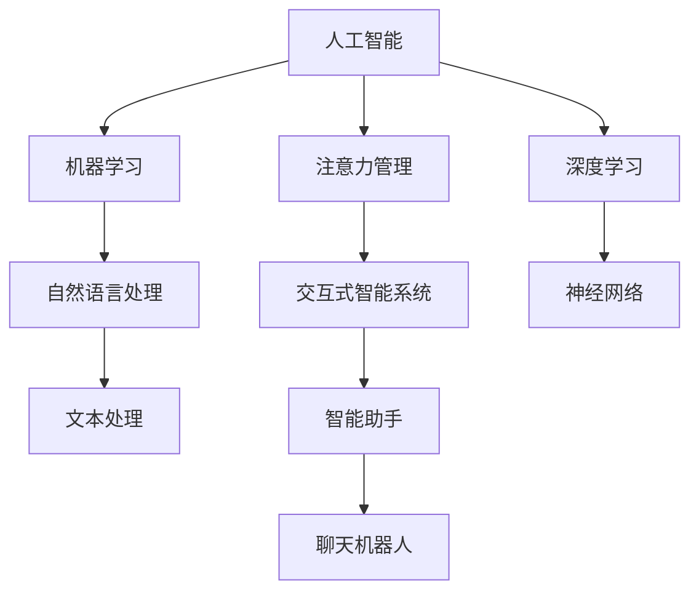

                 

# AI与人类注意力流：未来的工作、生活与注意力管理技术

> 关键词：人工智能,注意力管理,未来工作,生活智能化,人机交互

## 1. 背景介绍

### 1.1 问题由来
随着科技的飞速发展，人工智能(AI)正逐渐渗透到人类生活的方方面面。然而，与AI技术迅速发展的步伐相比，人类自身的信息处理能力显得捉襟见肘。特别是随着互联网和数字设备的普及，人类每天接触的信息量和需要处理的信息量急剧增加，注意力被过度分散，难以专注于重要任务，效率和健康状况受到严重影响。

如何有效管理注意力，使其既能充分利用AI带来的便利，又能避免信息过载和认知负担，成为当前科技与人类生活结合的关键课题。通过AI技术辅助注意力管理，不仅能够提升个人和组织的生产力，还能改善生活质量，增强人机互动的愉悦度，为未来的工作、生活模式带来深刻变革。

### 1.2 问题核心关键点
注意力管理的核心在于识别和优化注意力流，使个体能够高效地利用时间和资源，避免过度注意力分散。现代AI技术，尤其是深度学习和自然语言处理（NLP），为解决这一问题提供了新的视角和方法。

AI在注意力管理中的核心作用包括：
1. **自动化任务识别与分配**：通过AI模型识别任务性质和优先级，自动安排处理顺序。
2. **智能信息过滤**：运用机器学习算法过滤无用信息，提高信息获取效率。
3. **个性化学习与记忆辅助**：利用AI个性化推荐系统，优化学习内容和方法，增强记忆能力。
4. **交互式决策支持**：通过智能助手进行决策支持，提升决策质量。
5. **情感分析与心理健康**：使用情感分析技术监测情绪状态，提供心理支持。

这些AI功能共同构成了一个全方位的注意力管理系统，能够在实际应用中实现注意力的高效管理和优化。

## 2. 核心概念与联系

### 2.1 核心概念概述

为深入理解AI在注意力管理中的应用，本节将介绍几个核心概念：

- **人工智能(AI)**：广义上指通过计算机模拟人类智能行为的技术，包括但不限于机器学习、深度学习、自然语言处理等。
- **注意力管理**：指对个体的注意力流进行识别、分析和优化，提高注意力使用的效率和质量。
- **自然语言处理(NLP)**：涉及计算机理解和生成自然语言的技术，包括文本处理、语音识别、机器翻译等，是AI在注意力管理中常用的工具。
- **深度学习(Deep Learning)**：一类模拟人脑神经网络工作机制的机器学习技术，通过多层次的非线性变换实现复杂模式识别。
- **机器学习(ML)**：涉及算法和统计学方法，通过数据训练模型进行预测或决策，是AI的核心技术之一。
- **交互式智能系统(Interactive AI Systems)**：指能够与用户进行自然交互的AI系统，如智能助手、聊天机器人等。

这些概念之间的联系可以通过以下Mermaid流程图来展示：



这个流程图展示了AI与注意力管理的核心概念及其相互关系：

1. **人工智能**通过深度学习和机器学习技术，建立模式识别和决策模型。
2. **深度学习**使用神经网络实现复杂模式提取和特征表示。
3. **机器学习**从数据中训练模型，并进行预测或决策。
4. **自然语言处理**处理和理解人类语言，提取文本特征。
5. **注意力管理**识别和优化个体注意力流。
6. **交互式智能系统**实现与用户的自然交互。

这些技术协同工作，共同构建了一个高效、智能的注意力管理系统，帮助个体在信息过载的时代中，更好地管理自己的注意力，提升生活质量和工作效率。

## 3. 核心算法原理 & 具体操作步骤
### 3.1 算法原理概述

基于AI的注意力管理技术，通过自动化任务识别、智能信息过滤、个性化学习、交互式决策支持等功能，辅助个体高效利用注意力资源。其核心算法原理包括以下几个方面：

1. **任务识别与优先级排序**：
   使用NLP和机器学习算法，对任务进行分类和优先级排序，自动安排处理顺序，优化个体的时间管理。

2. **信息过滤与筛选**：
   通过深度学习模型，如文本分类和情感分析模型，过滤无用信息和噪音，提升信息获取和处理的效率。

3. **个性化学习与记忆辅助**：
   利用推荐系统算法，根据个体学习历史和偏好，个性化推荐学习内容和记忆方法，提升学习效果。

4. **交互式决策支持**：
   通过交互式智能系统，提供决策建议和分析结果，帮助个体在复杂决策环境中做出最优选择。

5. **情感分析与心理健康支持**：
   使用情感分析技术，监测个体情绪状态，提供心理支持和建议，促进心理健康。

### 3.2 算法步骤详解

以下是对基于AI的注意力管理核心算法步骤的详细介绍：

**Step 1: 数据收集与预处理**
- 收集用户的日常任务列表、信息浏览记录、学习内容、情绪状态等数据。
- 对数据进行清洗和预处理，去除噪音和异常值，确保数据质量。

**Step 2: 任务识别与优先级排序**
- 使用NLP技术，如文本分类和实体识别，对任务进行分类，如紧急、重要、紧急且重要、可延迟等。
- 利用机器学习算法，如决策树或深度学习模型，对任务进行优先级排序。

**Step 3: 智能信息过滤**
- 使用深度学习模型，如文本分类器，识别无用信息和噪音。
- 对过滤后的信息进行摘要和精简，提取关键点，提升信息获取效率。

**Step 4: 个性化学习与记忆辅助**
- 通过机器学习算法，对用户的学习历史和偏好进行分析，个性化推荐学习内容。
- 利用深度学习模型，如记忆增强算法，帮助用户提高记忆效果。

**Step 5: 交互式决策支持**
- 使用交互式智能系统，如智能助手或聊天机器人，提供决策建议和分析结果。
- 根据用户反馈，不断优化决策模型，提升决策支持质量。

**Step 6: 情感分析与心理健康支持**
- 使用情感分析技术，监测用户情绪状态。
- 根据情绪状态，提供心理支持和建议，如放松技巧、冥想指导等。

### 3.3 算法优缺点

基于AI的注意力管理算法具有以下优点：
1. **自动化与效率提升**：通过自动化任务识别和信息过滤，显著提升个体注意力使用效率。
2. **个性化与定制化**：根据用户偏好和学习历史，提供个性化推荐和学习辅助，提升学习效果。
3. **实时性与动态调整**：实时监测用户情绪状态和任务完成情况，动态调整注意力分配。
4. **多功能性与综合性**：集成了任务识别、信息过滤、学习辅助、决策支持等功能，满足多种需求。

但同时也存在以下缺点：
1. **数据隐私问题**：收集和处理大量个人数据，涉及隐私保护和数据安全问题。
2. **算法复杂性**：需要复杂的算法模型和大量数据训练，对技术要求较高。
3. **误判风险**：机器学习模型可能存在误判，影响决策和任务分配。
4. **依赖技术环境**：对硬件设备和网络环境有一定依赖，需持续维护和更新。

### 3.4 算法应用领域

基于AI的注意力管理技术已经在多个领域得到应用，例如：

- **办公室工作**：辅助员工安排任务、筛选信息、决策支持，提升工作效率。
- **学校教育**：个性化推荐学习内容，辅助学生记忆，提高学习效果。
- **远程医疗**：监测患者情绪状态，提供心理支持，提升医疗服务质量。
- **企业管理**：优化员工注意力分配，提升团队协作效率。
- **个人生活**：管理家庭日程、健康监测、娱乐推荐，提升生活质量。

这些领域的应用展示了AI在注意力管理中的广泛潜力和巨大价值。随着AI技术的不断进步，基于AI的注意力管理将会在更多场景中发挥重要作用。

## 4. 数学模型和公式 & 详细讲解  
### 4.1 数学模型构建

基于AI的注意力管理技术涉及多个数学模型，以下以文本分类和情感分析为例，构建相关的数学模型。

**文本分类模型**：
假设输入文本为 $x$，输出为类别 $y$，则文本分类模型的目标是最小化分类误差。使用交叉熵损失函数，可以表示为：

$$
\mathcal{L} = -\frac{1}{N}\sum_{i=1}^N \log P(y_i|x_i)
$$

其中 $P(y_i|x_i)$ 为模型对输入文本 $x_i$ 分类为类别 $y_i$ 的概率。

**情感分析模型**：
假设输入文本为 $x$，输出为情感标签 $y$，则情感分析模型的目标是最小化情感误差。使用多分类交叉熵损失函数，可以表示为：

$$
\mathcal{L} = -\frac{1}{N}\sum_{i=1}^N \log P(y_i|x_i)
$$

其中 $P(y_i|x_i)$ 为模型对输入文本 $x_i$ 分类为情感标签 $y_i$ 的概率。

### 4.2 公式推导过程

**文本分类模型的公式推导**：
文本分类模型的基本框架为神经网络，假设输入为 $x$，输出为类别 $y$，模型由若干个隐层和输出层构成。模型的前向传播过程为：

$$
z = W_1x + b_1
$$
$$
h = \sigma(z)
$$
$$
z_2 = W_2h + b_2
$$
$$
y = \text{softmax}(z_2)
$$

其中 $W_i$ 为权重矩阵，$b_i$ 为偏置项，$\sigma$ 为激活函数，$\text{softmax}$ 为输出层的激活函数。通过反向传播算法，求解模型的损失函数最小值，更新权重和偏置项，使得模型输出接近真实标签。

**情感分析模型的公式推导**：
情感分析模型同样使用神经网络架构，假设输入为 $x$，输出为情感标签 $y$，模型由若干个隐层和输出层构成。模型的前向传播过程为：

$$
z = W_1x + b_1
$$
$$
h = \sigma(z)
$$
$$
z_2 = W_2h + b_2
$$
$$
y = \text{softmax}(z_2)
$$

其中 $W_i$ 为权重矩阵，$b_i$ 为偏置项，$\sigma$ 为激活函数，$\text{softmax}$ 为输出层的激活函数。通过反向传播算法，求解模型的损失函数最小值，更新权重和偏置项，使得模型输出接近真实标签。

### 4.3 案例分析与讲解

以情绪识别模型为例，分析其在注意力管理中的应用：

**情绪识别模型**：
假设输入为一段文本，模型需要判断文本中表达的情绪是正面、中性还是负面。模型使用情感分析模型进行分类，其前向传播过程为：

$$
z = W_1x + b_1
$$
$$
h = \sigma(z)
$$
$$
z_2 = W_2h + b_2
$$
$$
y = \text{softmax}(z_2)
$$

其中 $W_i$ 为权重矩阵，$b_i$ 为偏置项，$\sigma$ 为激活函数，$\text{softmax}$ 为输出层的激活函数。

假设模型训练集为 $D = \{(x_i, y_i)\}_{i=1}^N$，则模型损失函数为：

$$
\mathcal{L} = -\frac{1}{N}\sum_{i=1}^N \log P(y_i|x_i)
$$

模型使用交叉熵损失函数进行训练，通过反向传播算法不断更新模型参数，最小化损失函数，使模型输出逼近真实标签。

在实际应用中，情感识别模型可以用于监测用户情绪状态，提供心理支持和建议。例如，在办公室工作中，如果系统检测到员工情绪低落，可以及时提供放松技巧或心理支持，帮助员工缓解压力。在教育领域，可以根据学生的情绪状态调整教学策略，提升学习效果。

## 5. 项目实践：代码实例和详细解释说明
### 5.1 开发环境搭建

在进行AI注意力管理的项目实践前，我们需要准备好开发环境。以下是使用Python进行TensorFlow开发的环境配置流程：

1. 安装Anaconda：从官网下载并安装Anaconda，用于创建独立的Python环境。

2. 创建并激活虚拟环境：
```bash
conda create -n attention-env python=3.8 
conda activate attention-env
```

3. 安装TensorFlow：根据CUDA版本，从官网获取对应的安装命令。例如：
```bash
conda install tensorflow -c pytorch -c conda-forge
```

4. 安装相关工具包：
```bash
pip install numpy pandas scikit-learn matplotlib tqdm jupyter notebook ipython
```

完成上述步骤后，即可在`attention-env`环境中开始AI注意力管理的实践。

### 5.2 源代码详细实现

下面我以情感分析模型为例，给出使用TensorFlow进行情感分类的PyTorch代码实现。

首先，定义情感分析模型的数据处理函数：

```python
import tensorflow as tf
from tensorflow.keras.preprocessing.text import Tokenizer
from tensorflow.keras.preprocessing.sequence import pad_sequences
import numpy as np

# 定义情感分类模型
def build_model(vocab_size, embedding_dim, hidden_units):
    model = tf.keras.Sequential([
        tf.keras.layers.Embedding(vocab_size, embedding_dim, input_length=max_len),
        tf.keras.layers.LSTM(hidden_units, return_sequences=True),
        tf.keras.layers.Dropout(0.2),
        tf.keras.layers.LSTM(hidden_units),
        tf.keras.layers.Dropout(0.2),
        tf.keras.layers.Dense(3, activation='softmax')
    ])
    return model

# 加载预训练词向量
embedding_index = {}
with open('glove.6B.100d.txt', encoding='utf-8') as f:
    for line in f:
        values = line.split()
        word = values[0]
        coefs = np.array(values[1:], dtype='float32')
        embedding_index[word] = coefs

# 定义数据集
texts = ['I am happy today', 'This is a sad story', 'I am not sure how to feel']
labels = [1, 0, 2]
tokenizer = Tokenizer(num_words=vocab_size)
tokenizer.fit_on_texts(texts)
sequences = tokenizer.texts_to_sequences(texts)
padded_sequences = pad_sequences(sequences, maxlen=max_len, padding='post')
```

然后，定义模型和训练过程：

```python
# 加载模型
model = build_model(vocab_size, embedding_dim, hidden_units)

# 定义优化器
optimizer = tf.keras.optimizers.Adam(lr=learning_rate)

# 定义损失函数
loss_fn = tf.keras.losses.SparseCategoricalCrossentropy(from_logits=True)

# 定义准确率评估指标
accuracy = tf.keras.metrics.SparseCategoricalAccuracy()

# 训练模型
model.compile(optimizer=optimizer, loss=loss_fn, metrics=[accuracy])
history = model.fit(padded_sequences, labels, epochs=num_epochs, validation_split=0.2)
```

接着，评估模型性能：

```python
# 加载测试集数据
test_texts = ['This is a happy movie', 'This is a bad movie']
test_labels = [1, 0]
test_sequences = tokenizer.texts_to_sequences(test_texts)
test_padded_sequences = pad_sequences(test_sequences, maxlen=max_len, padding='post')

# 评估模型
test_loss, test_acc = model.evaluate(test_padded_sequences, test_labels, verbose=2)
print('Test accuracy:', test_acc)
```

以上就是使用TensorFlow进行情感分析的完整代码实现。可以看到，通过TensorFlow的高级API，我们可以非常方便地构建和训练情感分析模型，同时TensorFlow还提供了丰富的可视化工具，帮助开发者更好地理解模型行为。

### 5.3 代码解读与分析

让我们再详细解读一下关键代码的实现细节：

**数据处理函数**：
- `build_model`函数：定义情感分析模型的基本结构，包括嵌入层、LSTM层和输出层。
- `vocab_size`、`embedding_dim`和`hidden_units`为模型参数，需根据具体任务进行调整。
- `embedding_index`：使用Glove词向量库，加载预训练的词向量。
- `Tokenizer`：将文本转换为数字序列，并进行定长填充。

**训练过程**：
- `optimizer`：定义优化器，如Adam。
- `loss_fn`：定义损失函数，如交叉熵损失。
- `accuracy`：定义评估指标，如准确率。
- `model.compile`：编译模型，指定优化器、损失函数和评估指标。
- `model.fit`：训练模型，传入训练集数据和标签。
- `validation_split`：设置验证集的比例，默认20%。

**评估过程**：
- `test_sequences`：将测试文本转换为数字序列。
- `test_padded_sequences`：对测试序列进行定长填充。
- `model.evaluate`：评估模型性能，输出损失和准确率。

**输出结果**：
- 输出测试集的准确率，反映模型的预测能力。

可以看到，TensorFlow提供了简单易用的API，使得情感分析模型的构建和训练变得非常直观和高效。

## 6. 实际应用场景
### 6.1 智能办公系统

AI注意力管理技术在智能办公系统中具有广泛应用，可以帮助员工高效管理任务和信息，提升工作效率。

具体应用场景包括：
- **任务管理**：根据员工的任务列表，自动识别紧急和重要任务，自动安排处理顺序，提升任务执行效率。
- **信息过滤**：通过深度学习模型过滤无用信息和噪音，提升信息获取效率。
- **决策支持**：提供决策建议和分析结果，帮助员工在复杂决策环境中做出最优选择。
- **情绪监测**：监测员工情绪状态，提供心理支持和建议，提升员工满意度。

通过AI注意力管理技术，智能办公系统可以显著提升员工的工作效率和生活质量，为现代企业提供更智能化、高效化的人机交互体验。

### 6.2 智能学习系统

AI注意力管理技术在智能学习系统中也有重要应用，能够帮助学生个性化学习，提升学习效果。

具体应用场景包括：
- **学习内容推荐**：根据学生的学习历史和偏好，个性化推荐学习内容，提升学习效果。
- **记忆辅助**：利用深度学习模型，如记忆增强算法，帮助学生提高记忆效果。
- **情绪监测**：监测学生的情绪状态，提供心理支持和建议，提升学习体验。

通过AI注意力管理技术，智能学习系统能够根据学生的个体差异，提供定制化的学习方案，提升学习效果，为现代教育带来新的突破。

### 6.3 智能医疗系统

AI注意力管理技术在智能医疗系统中也有广泛应用，能够帮助医生高效管理患者信息，提升诊疗效率。

具体应用场景包括：
- **患者信息管理**：自动识别患者信息，自动安排诊疗顺序，提升诊疗效率。
- **信息过滤**：通过深度学习模型过滤无用信息和噪音，提升信息获取效率。
- **决策支持**：提供决策建议和分析结果，帮助医生在复杂决策环境中做出最优选择。
- **情绪监测**：监测患者情绪状态，提供心理支持和建议，提升患者满意度。

通过AI注意力管理技术，智能医疗系统能够显著提升医疗服务质量，为现代医疗带来新的变革。

### 6.4 未来应用展望

随着AI技术的不断发展，基于AI的注意力管理技术将在更多领域得到应用，为人类工作和生活带来深刻变革。

未来，AI注意力管理技术可能会在以下领域实现更广泛的应用：

- **智慧城市**：辅助城市管理，提升城市运行效率和居民生活质量。
- **智能家居**：管理家庭事务，提升家庭生活智能化水平。
- **智能交通**：优化交通流量，提升交通安全和效率。
- **智能农业**：管理农事作业，提升农业生产效率。
- **智能制造**：优化生产流程，提升制造业生产效率。

这些领域的应用展示了AI在注意力管理中的广阔潜力和巨大价值。随着AI技术的不断进步，基于AI的注意力管理将会在更多场景中发挥重要作用。

## 7. 工具和资源推荐
### 7.1 学习资源推荐

为了帮助开发者系统掌握AI注意力管理技术的理论基础和实践技巧，这里推荐一些优质的学习资源：

1. **《深度学习》**：Ian Goodfellow等著，系统介绍了深度学习的基本概念和算法。
2. **《TensorFlow实战》**：Manning出版社，详细介绍了TensorFlow的使用方法和最佳实践。
3. **《Python自然语言处理》**：NLP领域的经典教材，介绍了自然语言处理的基本概念和算法。
4. **Coursera《深度学习专项课程》**：由斯坦福大学教授Andrew Ng讲授，涵盖了深度学习的多个方面。
5. **Kaggle平台**：数据科学竞赛平台，提供大量数据集和竞赛任务，有助于实践和提升。

通过对这些资源的学习实践，相信你一定能够快速掌握AI注意力管理技术的精髓，并用于解决实际的NLP问题。

### 7.2 开发工具推荐

高效的开发离不开优秀的工具支持。以下是几款用于AI注意力管理开发的常用工具：

1. **TensorFlow**：由Google主导开发的深度学习框架，生产部署方便，适合大规模工程应用。
2. **PyTorch**：由Facebook主导开发的深度学习框架，灵活度高，适合研究型应用。
3. **TensorBoard**：TensorFlow配套的可视化工具，可实时监测模型训练状态，提供丰富的图表呈现方式。
4. **HuggingFace Transformers库**：提供多种预训练语言模型，支持自然语言处理任务。
5. **Jupyter Notebook**：交互式开发环境，支持多种编程语言和库，适合快速原型开发。

合理利用这些工具，可以显著提升AI注意力管理的开发效率，加快创新迭代的步伐。

### 7.3 相关论文推荐

AI注意力管理技术的发展源于学界的持续研究。以下是几篇奠基性的相关论文，推荐阅读：

1. **《注意力机制在深度学习中的应用》**：Jozefowicz等，详细介绍了注意力机制在深度学习中的应用。
2. **《深度学习在自然语言处理中的应用》**：Goodfellow等，系统介绍了深度学习在NLP中的应用。
3. **《基于情感分析的社交媒体情绪监测》**：Hwang等，介绍了基于情感分析的情绪监测技术。
4. **《个性化学习推荐系统》**：Bengio等，介绍了个性化学习推荐系统的构建方法。
5. **《交互式智能系统的设计与实现》**：Parker等，介绍了交互式智能系统的设计与实现方法。

这些论文代表了大规模AI注意力管理技术的发展脉络。通过学习这些前沿成果，可以帮助研究者把握学科前进方向，激发更多的创新灵感。

## 8. 总结：未来发展趋势与挑战
### 8.1 总结

本文对基于AI的注意力管理技术进行了全面系统的介绍。首先阐述了AI技术在人类注意力流管理中的应用背景和意义，明确了注意力管理在提升工作效率和生活质量方面的重要价值。其次，从原理到实践，详细讲解了AI注意力管理的数学模型和核心算法，给出了完整的代码实例。同时，本文还探讨了AI注意力管理技术在多个领域的应用场景，展示了其在实际应用中的广泛潜力和巨大价值。

通过本文的系统梳理，可以看到，基于AI的注意力管理技术正在成为现代工作和生活的重要助力，显著提升了信息处理效率和生活质量。未来，伴随AI技术的不断进步，基于AI的注意力管理将会在更多领域得到应用，为人类带来更加智能化、高效化的人机交互体验。

### 8.2 未来发展趋势

展望未来，基于AI的注意力管理技术将呈现以下几个发展趋势：

1. **多模态融合**：未来AI注意力管理技术将更多地结合图像、声音、视频等多种模态数据，实现更加全面、智能的注意力管理。
2. **自适应学习**：通过机器学习算法，实现实时调整和优化注意力分配，提升个体适应性和学习效率。
3. **情感智能**：结合情感分析技术，实时监测和管理个体情绪状态，提升心理健康和生活质量。
4. **个性化定制**：根据个体差异和情境变化，提供定制化的注意力管理方案，提升个体工作和生活体验。
5. **跨领域应用**：在多个领域，如医疗、教育、交通等，实现跨领域应用，提升整体社会生产力和生活质量。

这些趋势展示了基于AI的注意力管理技术的广阔前景，预示着未来人机交互将更加智能化、高效化和个性化。

### 8.3 面临的挑战

尽管基于AI的注意力管理技术已经取得了不少成就，但在迈向更加智能化、普适化应用的过程中，仍面临诸多挑战：

1. **数据隐私与安全**：AI注意力管理技术需要收集和处理大量个人数据，涉及隐私保护和数据安全问题。如何保障数据隐私，避免数据泄露和滥用，将是重要的研究课题。
2. **算法复杂性与鲁棒性**：AI注意力管理算法需要复杂的机器学习模型和大量数据训练，可能存在误判和鲁棒性问题。如何优化算法模型，提升其稳定性和准确性，将是未来的研究方向。
3. **资源消耗与效率**：大规模AI注意力管理技术对计算资源和存储空间有较高要求，如何优化模型结构，提升资源利用效率，将是重要的优化方向。
4. **用户体验与交互**：如何设计易于使用、友好交互的AI注意力管理界面，提升用户体验，将是关键的挑战。
5. **跨平台兼容性**：如何实现跨平台兼容，使AI注意力管理技术在多种设备上无缝运行，将是重要的技术挑战。

### 8.4 研究展望

面对基于AI的注意力管理技术所面临的诸多挑战，未来的研究需要在以下几个方面寻求新的突破：

1. **隐私保护与数据安全**：研究如何设计隐私保护算法，保障数据隐私和安全，避免数据泄露和滥用。
2. **高效算法的开发**：研究高效、鲁棒的机器学习算法，优化模型结构，提升算法效率和稳定性。
3. **跨领域应用**：探索跨领域应用方法，实现AI注意力管理技术在多个领域的应用。
4. **用户体验优化**：设计易用、友好的AI注意力管理界面，提升用户体验。
5. **跨平台兼容性**：研究跨平台兼容技术，实现AI注意力管理技术在多种设备上的无缝运行。

这些研究方向将进一步推动基于AI的注意力管理技术的发展，提升其智能化、普适化水平，为人类工作和生活带来新的变革。

## 9. 附录：常见问题与解答

**Q1：什么是AI注意力管理技术？**

A: AI注意力管理技术是指通过人工智能技术，识别和优化个体注意力流，提升注意力使用的效率和质量，从而提升个体的工作效率和生活质量。主要包括任务识别与优先级排序、智能信息过滤、个性化学习与记忆辅助、交互式决策支持等功能。

**Q2：AI注意力管理技术有哪些优点？**

A: AI注意力管理技术具有以下优点：
1. 自动化与效率提升：通过自动化任务识别和信息过滤，显著提升个体注意力使用效率。
2. 个性化与定制化：根据用户偏好和学习历史，提供个性化推荐和学习辅助，提升学习效果。
3. 实时性与动态调整：实时监测用户情绪状态和任务完成情况，动态调整注意力分配。
4. 多功能性与综合性：集成了任务识别、信息过滤、学习辅助、决策支持等功能，满足多种需求。

**Q3：AI注意力管理技术有哪些应用场景？**

A: AI注意力管理技术已经在多个领域得到应用，例如：
1. 办公室工作：辅助员工安排任务、筛选信息、决策支持，提升工作效率。
2. 学校教育：个性化推荐学习内容，辅助学生记忆，提高学习效果。
3. 远程医疗：监测患者情绪状态，提供心理支持，提升医疗服务质量。
4. 企业管理：优化员工注意力分配，提升团队协作效率。
5. 个人生活：管理家庭日程、健康监测、娱乐推荐，提升生活质量。

这些领域的应用展示了AI注意力管理技术的广泛潜力和巨大价值。

**Q4：AI注意力管理技术有哪些挑战？**

A: AI注意力管理技术面临以下挑战：
1. 数据隐私与安全：收集和处理大量个人数据，涉及隐私保护和数据安全问题。
2. 算法复杂性：需要复杂的算法模型和大量数据训练，对技术要求较高。
3. 误判风险：机器学习模型可能存在误判，影响决策和任务分配。
4. 资源消耗：对计算资源和存储空间有较高要求，需持续维护和更新。
5. 用户体验：设计易于使用、友好交互的AI注意力管理界面，提升用户体验。

这些挑战需要通过技术创新和不断优化，才能有效应对。

**Q5：未来AI注意力管理技术的发展方向是什么？**

A: 未来AI注意力管理技术的发展方向包括：
1. 多模态融合：结合图像、声音、视频等多种模态数据，实现更加全面、智能的注意力管理。
2. 自适应学习：实时调整和优化注意力分配，提升个体适应性和学习效率。
3. 情感智能：实时监测和管理个体情绪状态，提升心理健康和生活质量。
4. 个性化定制：根据个体差异和情境变化，提供定制化的注意力管理方案，提升个体工作和生活体验。
5. 跨领域应用：实现跨领域应用，提升整体社会生产力和生活质量。

这些方向展示了AI注意力管理技术的广阔前景，预示着未来人机交互将更加智能化、高效化和个性化。

---

作者：禅与计算机程序设计艺术 / Zen and the Art of Computer Programming

