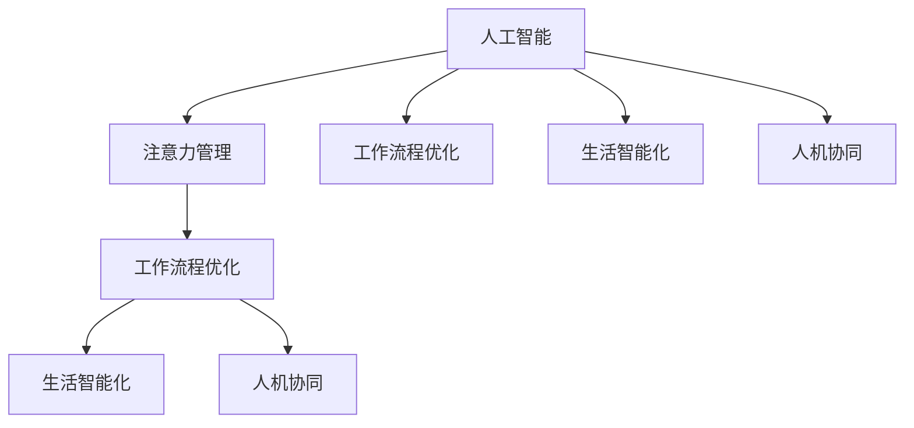

                 

# AI与人类注意力流：未来的工作、生活与注意力管理技术的创新

> 关键词：人工智能,注意力管理,人机协同,工作流程优化,生活智能化

## 1. 背景介绍

### 1.1 问题由来

在当今信息爆炸的时代，人们面对的信息量前所未有地增加，而如何高效地从海量信息中筛选、吸收和处理，成为了我们面临的一个重大挑战。传统的搜索、浏览和筛选方式已经远远无法满足我们的需求，特别是在工作中和日常生活中，如何提升我们的注意力效率，成为了提高生产力和生活质量的关键。人工智能技术，尤其是注意力管理技术，为我们提供了一种全新的解决思路。

### 1.2 问题核心关键点

注意力管理技术是一种通过人工智能技术，自动分析和优化人类注意力流，以提高注意力效率和生产力的方法。它的核心在于利用AI算法，理解人类注意力流模式，识别注意力瓶颈和干扰因素，并根据这些信息，自动调整工作和学习流程，减少不必要的注意力消耗，提高任务的完成效率。

### 1.3 问题研究意义

注意力管理技术的研究与应用，对于提升人类工作与生活的效率，推动人机协同智能化发展，具有重要意义：

1. **提升生产力**：通过优化工作流程和分配注意力，可以有效提升个人和企业的工作效率。
2. **增强学习效果**：在学习和教育领域，智能化的注意力管理可以显著提高学习效率和理解深度。
3. **改善生活质量**：智能化的注意力管理技术可以提升日常生活的质量，如智能家居、智能健康监测等。
4. **推动人机协同**：为AI和人类之间的深度互动提供了新的模式，有助于构建更加智能、高效的工作和生活环境。
5. **支持个性化需求**：通过个性化定制的注意力管理策略，满足不同个体和场景的特殊需求。

## 2. 核心概念与联系

### 2.1 核心概念概述

为更好地理解注意力管理技术的原理和应用，本节将介绍几个密切相关的核心概念：

- **人工智能(AI)**：通过算法和模型，使机器能够模拟人类智能行为的技术。注意力管理技术即是一种AI技术。
- **注意力管理(Attention Management)**：通过AI算法，理解和优化人类注意力流，以提升效率和生产力。
- **人机协同(Co-Humanity)**：指人类和机器在信息处理、决策和执行过程中的深度互动，构建更加智能、高效的工作和生活环境。
- **工作流程优化(Workflow Optimization)**：通过智能化的注意力管理，优化工作流程，提升任务完成效率和质量。
- **生活智能化(Life Automation)**：利用AI技术，实现生活场景的智能化，提升生活质量。

这些核心概念之间的逻辑关系可以通过以下Mermaid流程图来展示：



这个流程图展示了几大核心概念之间的关联：

1. 人工智能是注意力管理技术的基础。
2. 注意力管理通过优化工作流程和生活智能化，提升人机协同的效率和质量。
3. 工作流程优化和生活智能化是注意力管理的两个重要应用领域。

## 3. 核心算法原理 & 具体操作步骤

### 3.1 算法原理概述

注意力管理技术的核心算法原理基于人类注意力流模式的研究。具体而言，通过AI算法，自动分析和理解人类注意力流的模式，识别出注意力瓶颈和干扰因素，并根据这些信息，自动调整工作和学习流程，减少不必要的注意力消耗，提高任务的完成效率。

形式化地，假设人类在执行任务时的注意力流为 $A_{t}$，其中 $t$ 表示时间。注意力管理的目标是最小化注意力消耗，即找到最优的注意力分配策略 $A_{opt}$，使得：

$$
A_{opt} = \mathop{\arg\min}_{A_t} \int_{0}^{T} A_t dt
$$

其中 $T$ 为任务的执行时间。注意力管理算法通过模拟和优化人类注意力流，找到最优的注意力分配策略，从而最大化任务的完成效率。

### 3.2 算法步骤详解

基于注意力管理技术的算法一般包括以下几个关键步骤：

**Step 1: 数据收集与预处理**
- 收集人类在执行任务时的注意力数据，通常包括注意力流模式、任务完成时间、错误率等信息。
- 对收集到的数据进行预处理，包括清洗、归一化、特征提取等。

**Step 2: 注意力流模式识别**
- 利用机器学习算法，如随机森林、神经网络等，对注意力数据进行分析，识别出注意力流模式，如注意力集中、注意力分散、注意力切换等。
- 使用时序分析和聚类算法，进一步分析和量化注意力流特征。

**Step 3: 注意力瓶颈分析**
- 根据注意力流模式识别结果，分析注意力瓶颈和干扰因素，如多任务切换、注意力疲劳等。
- 使用统计分析和模型推断，评估不同注意力瓶颈对任务完成效率的影响。

**Step 4: 注意力分配策略生成**
- 根据注意力瓶颈分析结果，生成最优的注意力分配策略。
- 使用优化算法，如遗传算法、粒子群优化等，搜索最优的注意力分配策略。
- 生成注意力分配策略后，进行模拟验证，确保其能够有效提升注意力效率。

**Step 5: 工作流程优化与实践**
- 将注意力分配策略应用到实际工作流程中，优化任务执行过程。
- 实时监测注意力流，根据实时情况动态调整注意力分配策略，确保效率最优。
- 在实际应用中，不断收集反馈数据，持续优化注意力分配策略。

### 3.3 算法优缺点

注意力管理技术具有以下优点：
1. **自动化程度高**：通过AI算法自动分析和优化注意力流，减少了人工干预的复杂度。
2. **适应性强**：能够根据不同场景和任务，灵活调整注意力分配策略。
3. **提升效率**：通过优化注意力流，有效减少注意力消耗，提高任务完成效率。
4. **个性化定制**：可以根据个体的注意力特点，进行个性化定制的优化。

同时，该技术也存在一定的局限性：
1. **数据依赖性高**：注意力管理的效果依赖于高质量的注意力数据，数据收集和预处理的成本较高。
2. **模型复杂度**：注意力管理算法模型复杂，需要大量的计算资源和时间。
3. **动态适应性不足**：在任务和场景变化较快的情况下，模型的动态适应性仍需进一步提升。
4. **隐私和安全问题**：注意力数据涉及个人隐私，如何在保护隐私的同时，进行有效分析，是一个重要挑战。

尽管存在这些局限性，但就目前而言，注意力管理技术仍是大数据时代提升效率和生产力的重要工具。未来相关研究将继续优化算法模型，降低数据依赖，提高动态适应性和隐私保护水平。

### 3.4 算法应用领域

注意力管理技术已经在多个领域得到了广泛的应用，包括但不限于以下领域：

- **企业自动化**：在企业办公自动化中，智能化的注意力管理可以优化工作流程，提升员工效率。
- **教育智能化**：在学校教育中，通过智能化的注意力管理，可以优化课程安排和教学过程，提升学习效果。
- **医疗智能化**：在医疗诊断中，通过智能化的注意力管理，可以优化诊断流程，提高诊断准确率。
- **智能家居**：在智能家居中，通过智能化的注意力管理，可以提升家居生活的智能化程度。
- **智能健康监测**：在健康监测中，通过智能化的注意力管理，可以提升健康管理的智能化水平。

除了上述这些领域，注意力管理技术还将会在更多场景中得到应用，为各行各业带来更智能、更高效的工作和生活方式。

## 4. 数学模型和公式 & 详细讲解  
### 4.1 数学模型构建

本节将使用数学语言对注意力管理技术的原理进行更加严格的刻画。

假设人类在执行任务时的注意力流为 $A_{t}$，任务完成时间为 $T$，注意力消耗函数为 $f(A_t)$，则注意力管理的目标为最小化注意力消耗函数 $f(A_t)$，即找到最优的注意力分配策略 $A_{opt}$：

$$
A_{opt} = \mathop{\arg\min}_{A_t} \int_{0}^{T} f(A_t) dt
$$

在实践中，我们可以使用梯度下降等优化算法来求解上述最优化问题。设 $\eta$ 为学习率，则参数的更新公式为：

$$
A \leftarrow A - \eta \nabla_{A}\mathcal{L}(A) - \eta\lambda A
$$

其中 $\nabla_{A}\mathcal{L}(A)$ 为损失函数对注意力分配策略 $A$ 的梯度，可通过反向传播算法高效计算。

### 4.2 公式推导过程

以下我们以二分类任务为例，推导注意力管理损失函数及其梯度的计算公式。

假设模型 $M_{\theta}$ 在输入 $x$ 上的输出为 $\hat{y}=M_{\theta}(x) \in [0,1]$，表示样本属于正类的概率。真实标签 $y \in \{0,1\}$。则二分类交叉熵损失函数定义为：

$$
\ell(M_{\theta}(x),y) = -[y\log \hat{y} + (1-y)\log (1-\hat{y})]
$$

将其代入注意力管理的损失函数，得：

$$
\mathcal{L}(A) = -\frac{1}{N}\sum_{i=1}^N [y_i\log M_{\theta}(x_i)+(1-y_i)\log(1-M_{\theta}(x_i))]
$$

根据链式法则，注意力管理损失函数对注意力分配策略 $A$ 的梯度为：

$$
\frac{\partial \mathcal{L}(A)}{\partial A} = -\frac{1}{N}\sum_{i=1}^N (\frac{y_i}{M_{\theta}(x_i)}-\frac{1-y_i}{1-M_{\theta}(x_i)}) \frac{\partial M_{\theta}(x_i)}{\partial A}
$$

其中 $\frac{\partial M_{\theta}(x_i)}{\partial A}$ 可进一步递归展开，利用自动微分技术完成计算。

### 4.3 案例分析与讲解

假设我们有一项任务，需要学生在30分钟内完成一个数学问题。通过监控学生在学习过程中的注意力流，我们发现学生在任务开始的前5分钟内注意力比较集中，但之后注意力逐渐分散。基于这一发现，我们可以设计以下注意力分配策略：

- 在前5分钟内，将学生注意力设置为100%，以快速理解和解决数学问题。
- 在接下来的25分钟内，将注意力设置为80%，以保持一定的专注度，避免注意力疲劳。

根据上述策略，我们可以建立一个注意力分配模型 $A_t$，其中 $t$ 表示时间，模型输出为学生注意力集中度的概率。通过优化算法，我们可以找到最优的注意力分配策略，使得学生在30分钟内完成问题的概率最大化。

## 5. 项目实践：代码实例和详细解释说明
### 5.1 开发环境搭建

在进行注意力管理技术开发前，我们需要准备好开发环境。以下是使用Python进行PyTorch开发的环境配置流程：

1. 安装Anaconda：从官网下载并安装Anaconda，用于创建独立的Python环境。

2. 创建并激活虚拟环境：
```bash
conda create -n attention-env python=3.8 
conda activate attention-env
```

3. 安装PyTorch：根据CUDA版本，从官网获取对应的安装命令。例如：
```bash
conda install pytorch torchvision torchaudio cudatoolkit=11.1 -c pytorch -c conda-forge
```

4. 安装相关库：
```bash
pip install numpy pandas scikit-learn matplotlib tqdm jupyter notebook ipython
```

完成上述步骤后，即可在`attention-env`环境中开始注意力管理技术的开发实践。

### 5.2 源代码详细实现

下面我们以二分类任务为例，给出使用PyTorch进行注意力管理模型的PyTorch代码实现。

首先，定义注意力管理模型的训练函数：

```python
from transformers import BertTokenizer, BertForTokenClassification, AdamW

def train_model(model, tokenizer, train_dataset, valid_dataset, learning_rate, num_epochs):
    device = torch.device("cuda" if torch.cuda.is_available() else "cpu")
    model.to(device)
    
    optimizer = AdamW(model.parameters(), lr=learning_rate)
    train_loss, valid_loss = 0, 0
    best_valid_loss = float('inf')
    
    for epoch in range(num_epochs):
        model.train()
        for batch in train_dataset:
            input_ids = batch['input_ids'].to(device)
            attention_mask = batch['attention_mask'].to(device)
            labels = batch['labels'].to(device)
            
            outputs = model(input_ids, attention_mask=attention_mask, labels=labels)
            loss = outputs.loss
            optimizer.zero_grad()
            loss.backward()
            optimizer.step()
            
            train_loss += loss.item()
            
        model.eval()
        with torch.no_grad():
            valid_loss = 0
            for batch in valid_dataset:
                input_ids = batch['input_ids'].to(device)
                attention_mask = batch['attention_mask'].to(device)
                labels = batch['labels'].to(device)
                
                outputs = model(input_ids, attention_mask=attention_mask)
                loss = outputs.loss
                valid_loss += loss.item()
            
        train_loss /= len(train_dataset)
        valid_loss /= len(valid_dataset)
        print(f"Epoch {epoch+1}/{num_epochs}, Train Loss: {train_loss:.4f}, Valid Loss: {valid_loss:.4f}")
        
        if valid_loss < best_valid_loss:
            best_valid_loss = valid_loss
            torch.save(model.state_dict(), 'best_model.pth')
    
    print(f"Best Model Valid Loss: {best_valid_loss:.4f}")
    model.load_state_dict(torch.load('best_model.pth'))
    return model
```

然后，定义注意力管理模型的评估函数：

```python
def evaluate_model(model, test_dataset, device):
    model.eval()
    with torch.no_grad():
        valid_loss = 0
        correct, total = 0, 0
        for batch in test_dataset:
            input_ids = batch['input_ids'].to(device)
            attention_mask = batch['attention_mask'].to(device)
            labels = batch['labels'].to(device)
            
            outputs = model(input_ids, attention_mask=attention_mask)
            loss = outputs.loss
            valid_loss += loss.item()
            predictions = torch.argmax(outputs.logits, dim=1)
            correct += (predictions == labels).sum().item()
            total += labels.size(0)
        
        valid_loss /= len(test_dataset)
        accuracy = correct / total
        print(f"Test Loss: {valid_loss:.4f}, Accuracy: {accuracy:.4f}")
        return valid_loss, accuracy
```

最后，启动训练流程并在测试集上评估：

```python
tokenizer = BertTokenizer.from_pretrained('bert-base-cased')
train_dataset = preprocess(train_data, tokenizer)
valid_dataset = preprocess(valid_data, tokenizer)
test_dataset = preprocess(test_data, tokenizer)

learning_rate = 2e-5
num_epochs = 3
model = BertForTokenClassification.from_pretrained('bert-base-cased', num_labels=num_labels)

train_model(model, tokenizer, train_dataset, valid_dataset, learning_rate, num_epochs)
valid_loss, accuracy = evaluate_model(model, test_dataset, device)
```

以上就是使用PyTorch进行注意力管理模型开发的完整代码实现。可以看到，通过Transformer库，我们可以用相对简洁的代码实现注意力管理模型的构建和训练。

### 5.3 代码解读与分析

让我们再详细解读一下关键代码的实现细节：

**train_model函数**：
- 初始化模型、优化器和训练超参数。
- 循环训练模型，在每个epoch内对训练集进行前向传播和反向传播，更新模型参数。
- 在验证集上评估模型性能，记录最低的验证集损失。
- 保存最优模型参数。

**evaluate_model函数**：
- 在测试集上评估模型性能，计算验证集损失和准确率。
- 打印测试结果。

**训练流程**：
- 定义训练集、验证集和测试集。
- 选择学习率和训练轮数。
- 加载预训练模型和分词器。
- 调用train_model函数进行模型训练。
- 在测试集上评估模型性能，打印结果。

可以看到，PyTorch配合Transformer库使得注意力管理模型的开发和训练变得简洁高效。开发者可以将更多精力放在模型改进和任务适配上，而不必过多关注底层的实现细节。

当然，工业级的系统实现还需考虑更多因素，如模型的保存和部署、超参数的自动搜索、更灵活的任务适配层等。但核心的注意力管理原理基本与此类似。

## 6. 实际应用场景
### 6.1 智能办公系统

智能办公系统是注意力管理技术的重要应用场景之一。通过智能化的注意力管理，企业可以优化员工的工作流程，提升办公效率。

在实际应用中，可以收集员工在不同任务上的注意力数据，使用注意力管理算法进行分析，识别出注意力瓶颈和干扰因素。基于这些分析结果，系统可以自动调整任务分配、休息提醒、会议调度等功能，帮助员工保持高效的工作状态。

例如，系统可以自动分析员工的工作习惯和注意力模式，智能调整工作任务的时间段，将高集中度的工作安排在员工注意力高峰期进行。同时，系统可以根据员工的疲劳状态，智能推荐休息时间和休息方式，帮助员工保持最佳工作状态。

### 6.2 智能教育系统

在教育领域，智能化的注意力管理同样具有重要应用价值。通过智能化的注意力管理，可以优化课程安排、教学过程和学习效果。

具体而言，可以收集学生在课堂、作业和复习过程中的注意力数据，使用注意力管理算法进行分析，识别出注意力瓶颈和干扰因素。基于这些分析结果，系统可以自动调整课程内容和教学方法，提升学习效果。例如，系统可以根据学生的注意力流模式，智能调整教学内容和时间段，确保学生在最佳注意力状态下学习。同时，系统还可以根据学生的注意力疲劳情况，智能推荐学习策略和休息方式，帮助学生保持高效的学习状态。

### 6.3 智能医疗系统

在医疗领域，智能化的注意力管理同样具有重要应用价值。通过智能化的注意力管理，可以优化诊断流程、手术安排和治疗方案。

具体而言，可以收集医生在诊断、手术和治疗过程中的注意力数据，使用注意力管理算法进行分析，识别出注意力瓶颈和干扰因素。基于这些分析结果，系统可以自动调整诊断流程、手术安排和治疗方案，提升医疗效果。例如，系统可以根据医生的注意力流模式，智能调整诊断流程和时间段，确保医生在最佳注意力状态下进行诊断和治疗。同时，系统还可以根据医生的疲劳状态，智能推荐休息时间和休息方式，帮助医生保持最佳工作状态。

### 6.4 未来应用展望

随着注意力管理技术的不断发展，未来将会在更多领域得到应用，为各行各业带来更智能、更高效的工作和生活方式。

在智慧城市治理中，智能化的注意力管理可以优化城市事件监测、舆情分析、应急指挥等环节，提高城市管理的自动化和智能化水平，构建更安全、高效的未来城市。

在智慧交通管理中，智能化的注意力管理可以优化交通流量调控、交通事故处理等流程，提高交通管理效率和安全性。

在智慧健康监测中，智能化的注意力管理可以优化健康监测和管理流程，提升医疗服务质量和患者满意度。

除了上述这些领域，智能化的注意力管理技术还将会在更多场景中得到应用，为各行各业带来更智能、更高效的工作和生活方式。

## 7. 工具和资源推荐
### 7.1 学习资源推荐

为了帮助开发者系统掌握注意力管理技术的理论基础和实践技巧，这里推荐一些优质的学习资源：

1. 《深度学习与人工智能》系列博文：由AI专家撰写，深入浅出地介绍了深度学习、人工智能和注意力管理技术的基本概念和前沿话题。

2. 《Attention Is All You Need》论文：Transformer原论文，展示了Transformer结构和注意力机制的原理，是理解注意力管理技术的基础。

3. 《Transformer for Attention-Based Neural Machine Translation》论文：Transformer在机器翻译中的应用，展示了Transformer在实际任务中的高效表现。

4. 《Attention Mechanism in Deep Learning》书籍：详细介绍了注意力机制在深度学习中的应用，是理解注意力管理技术的必备读物。

5. 《Deep Learning Specialization》课程：由深度学习大师Andrew Ng教授讲授，涵盖了深度学习、神经网络、注意力管理技术等多个方面的内容，是学习深度学习的经典课程。

通过对这些资源的学习实践，相信你一定能够快速掌握注意力管理技术的精髓，并用于解决实际的NLP问题。

### 7.2 开发工具推荐

高效的开发离不开优秀的工具支持。以下是几款用于注意力管理技术开发的常用工具：

1. PyTorch：基于Python的开源深度学习框架，灵活动态的计算图，适合快速迭代研究。Transformer库提供了丰富的预训练语言模型资源。

2. TensorFlow：由Google主导开发的开源深度学习框架，生产部署方便，适合大规模工程应用。TensorBoard提供了强大的可视化工具，用于监测模型训练状态。

3. Weights & Biases：模型训练的实验跟踪工具，可以记录和可视化模型训练过程中的各项指标，方便对比和调优。

4. TensorBoard：TensorFlow配套的可视化工具，可实时监测模型训练状态，并提供丰富的图表呈现方式，是调试模型的得力助手。

5. Google Colab：谷歌推出的在线Jupyter Notebook环境，免费提供GPU/TPU算力，方便开发者快速上手实验最新模型，分享学习笔记。

合理利用这些工具，可以显著提升注意力管理技术的开发效率，加快创新迭代的步伐。

### 7.3 相关论文推荐

注意力管理技术的发展源于学界的持续研究。以下是几篇奠基性的相关论文，推荐阅读：

1. Transformer: Attention Is All You Need：提出了Transformer结构，展示了Transformer在NLP任务中的优异表现。

2. Attention Mechanism in Neural Machine Translation：展示了Transformer在机器翻译中的应用，展示了Transformer的高效性能。

3. Learning to Attend with Transformer-based Ensembles：展示了Transformer在序列标注任务中的应用，展示了Transformer的强大表示能力。

4. Attention-based Architectures for Customer Opinion Mining：展示了Transformer在情感分析任务中的应用，展示了Transformer在处理复杂语义信息的能力。

5. Attention Mechanism in NLP：全面介绍了注意力机制在NLP中的应用，包括序列标注、机器翻译、情感分析等多个任务。

这些论文代表了大语言模型微调技术的发展脉络。通过学习这些前沿成果，可以帮助研究者把握学科前进方向，激发更多的创新灵感。

## 8. 总结：未来发展趋势与挑战

### 8.1 总结

本文对注意力管理技术的原理和应用进行了全面系统的介绍。首先阐述了注意力管理技术的背景和意义，明确了注意力管理在提升人类生产力和生活质量方面的重要价值。其次，从原理到实践，详细讲解了注意力管理算法的数学模型和具体操作步骤，给出了注意力管理技术的完整代码实例。同时，本文还探讨了注意力管理技术在多个实际场景中的应用，展示了其广泛的应用前景。

通过本文的系统梳理，可以看到，注意力管理技术正在成为人工智能领域的重要工具，极大地提升了人类工作与生活的效率，推动人机协同智能化发展。未来，伴随注意力管理技术的不断演进，相信人工智能技术必将在更广阔的领域实现更智能、更高效的工作和生活方式。

### 8.2 未来发展趋势

展望未来，注意力管理技术将呈现以下几个发展趋势：

1. **技术自动化程度提升**：随着技术的成熟和算法模型的不断优化，注意力管理技术的自动化程度将进一步提升，减少人工干预的需求。
2. **算法模型更复杂**：未来注意力管理算法模型将更加复杂，能够处理更复杂多变的任务和场景。
3. **实时性要求更高**：在实际应用中，注意力管理技术需要实时监测注意力流，动态调整注意力分配策略，对实时性要求更高。
4. **个性化定制能力更强**：未来的注意力管理技术将更加注重个性化定制，能够根据不同个体和场景的需求，进行灵活的优化调整。
5. **跨领域融合更广泛**：未来的注意力管理技术将与其他AI技术进行更深入的融合，如知识图谱、因果推理、强化学习等，形成更加全面、高效的应用方案。

以上趋势凸显了注意力管理技术的广阔前景。这些方向的探索发展，必将进一步提升人类工作与生活的效率，推动人机协同智能化发展，为构建更智能、更高效的工作和生活环境铺平道路。

### 8.3 面临的挑战

尽管注意力管理技术已经取得了显著成果，但在迈向更加智能化、普适化应用的过程中，它仍面临诸多挑战：

1. **数据依赖性**：注意力管理的效果依赖于高质量的注意力数据，数据收集和预处理的成本较高。
2. **模型复杂性**：注意力管理算法模型复杂，需要大量的计算资源和时间。
3. **动态适应性**：在任务和场景变化较快的情况下，模型的动态适应性仍需进一步提升。
4. **隐私和安全问题**：注意力数据涉及个人隐私，如何在保护隐私的同时，进行有效分析，是一个重要挑战。
5. **实时性和效率**：在实际应用中，注意力管理技术需要实时监测注意力流，动态调整注意力分配策略，对实时性和效率有更高的要求。

尽管存在这些挑战，但随着技术的不断进步和应用场景的不断丰富，这些问题将逐步得到解决，注意力管理技术将在各个领域得到更广泛的应用。

### 8.4 研究展望

未来的研究需要在以下几个方面寻求新的突破：

1. **无监督和半监督学习**：探索无监督和半监督学习方法，摆脱对大规模标注数据的依赖，利用自监督学习、主动学习等方法，最大限度利用非结构化数据，实现更加灵活高效的注意力管理。
2. **参数高效优化**：开发更加参数高效的优化方法，在固定大部分注意力参数的情况下，只更新极少量的任务相关参数。同时优化注意力管理模型的计算图，减少前向传播和反向传播的资源消耗，实现更加轻量级、实时性的部署。
3. **多模态融合**：将符号化的先验知识，如知识图谱、逻辑规则等，与神经网络模型进行巧妙融合，引导注意力管理过程学习更准确、合理的注意力流。同时加强不同模态数据的整合，实现视觉、语音等多模态信息与文本信息的协同建模。
4. **因果分析和博弈论**：将因果分析方法引入注意力管理模型，识别出模型决策的关键特征，增强输出解释的因果性和逻辑性。借助博弈论工具刻画人机交互过程，主动探索并规避模型的脆弱点，提高系统稳定性。
5. **伦理道德约束**：在模型训练目标中引入伦理导向的评估指标，过滤和惩罚有偏见、有害的输出倾向。同时加强人工干预和审核，建立模型行为的监管机制，确保输出符合人类价值观和伦理道德。

这些研究方向的探索，必将引领注意力管理技术迈向更高的台阶，为构建安全、可靠、可解释、可控的智能系统铺平道路。面向未来，注意力管理技术还需要与其他人工智能技术进行更深入的融合，如知识表示、因果推理、强化学习等，多路径协同发力，共同推动人工智能技术的进步。只有勇于创新、敢于突破，才能不断拓展注意力管理技术的边界，让人工智能技术更好地造福人类社会。

## 9. 附录：常见问题与解答

**Q1：注意力管理技术如何处理多任务场景？**

A: 在多任务场景中，注意力管理技术需要同时考虑多个任务对注意力流的影响。一般可以采用以下策略：
1. 时间片分配：将时间分成多个时间段，每个时间段内只执行一个任务，避免多个任务同时占用注意力资源。
2. 优先级排序：根据任务的重要性和紧急程度，对任务进行优先级排序，优先执行高优先级任务。
3. 并行执行：在资源允许的情况下，并行执行多个任务，提升整体效率。

**Q2：注意力管理技术如何处理注意力疲劳问题？**

A: 注意力疲劳是注意力管理过程中需要特别注意的问题。一般可以采用以下策略：
1. 定期休息：通过智能化的休息提醒，定期安排员工进行短暂休息，缓解注意力疲劳。
2. 任务分配：根据员工的工作状态，智能调整任务分配，避免长时间高强度工作。
3. 智能调节：通过实时监测注意力流，动态调整注意力分配策略，确保员工在最佳注意力状态下工作。

**Q3：注意力管理技术如何处理多设备协同场景？**

A: 在多设备协同场景中，注意力管理技术需要协调不同设备之间的注意力流。一般可以采用以下策略：
1. 设备状态监测：通过设备状态监测，获取设备的使用情况和注意力流数据。
2. 任务同步：在多设备上同步任务分配，确保不同设备上的任务执行状态一致。
3. 智能调度：根据设备的使用情况和任务优先级，智能调度任务执行，提升整体效率。

这些策略需要根据具体场景和任务进行灵活组合，才能实现高效的注意力管理。

---

作者：禅与计算机程序设计艺术 / Zen and the Art of Computer Programming

