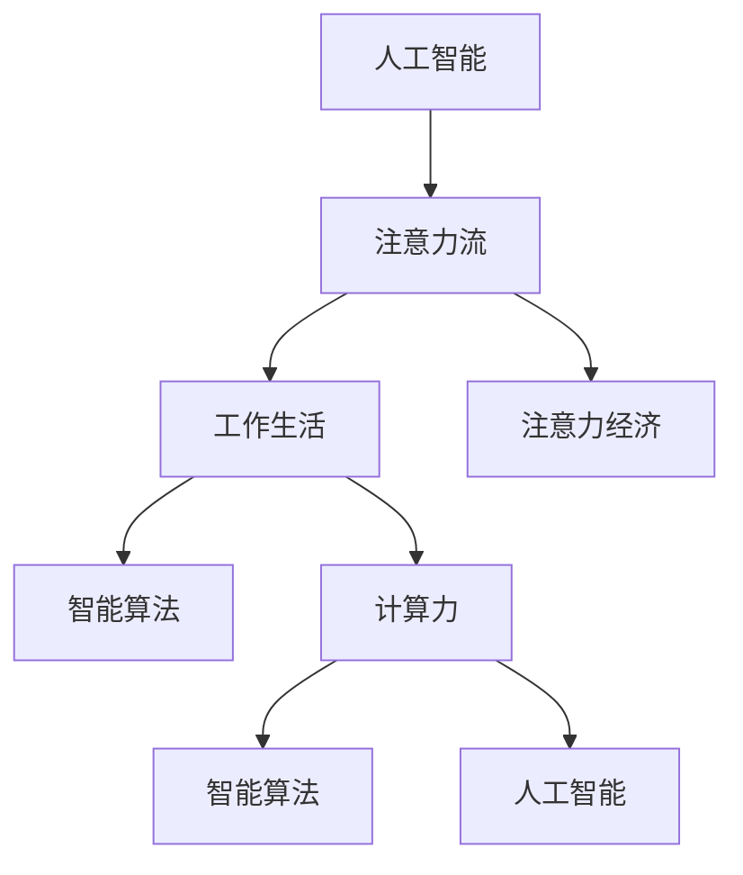

                 

# AI与人类注意力流：未来的工作、生活与注意力经济的管理策略

> 关键词：人工智能,注意力管理,工作生活,注意力经济,智能算法,计算力

## 1. 背景介绍

### 1.1 问题由来

在现代科技高速发展的背景下，人工智能(AI)正以前所未有的速度改变着人类的生产生活方式。无论是医疗、教育、金融还是制造业，人工智能技术已经渗透到各个领域，为人们带来了前所未有的便利和效率。然而，这些进步的背后，却隐藏着一个不容忽视的问题：人类的注意力流正逐渐被人工智能技术所捕获和利用，人类对自身注意力的掌控和利用变得更加困难。

为了解决这个问题，本文将深入探讨AI技术如何影响人类注意力流，以及未来的工作、生活和注意力经济将如何被改变。同时，文章将聚焦于AI技术对人类注意力流的管理策略，探索如何通过AI技术更好地提升人类的工作效率和生活质量。

### 1.2 问题核心关键点

本文的核心问题在于探讨：
- AI技术如何影响人类的注意力流？
- 未来工作、生活以及注意力经济将如何被改变？
- 如何通过AI技术对人类注意力流进行有效管理？

这些问题不仅涉及到AI技术的应用和影响，还涵盖了人类行为、心理、经济等多个方面的内容。通过回答这些问题，本文旨在为读者提供一个全面而深入的视角，探讨AI技术与人类注意力流之间的复杂关系。

## 2. 核心概念与联系

### 2.1 核心概念概述

为更好地理解本文的内容，我们需要首先掌握以下几个核心概念：

- 人工智能(AI)：指通过计算机算法和计算力实现的任务自动化、智能化的技术。包括机器学习、深度学习、自然语言处理、计算机视觉等多个子领域。
- 注意力流：指人类在处理信息时的注意力分布和转移路径。包括视觉注意力、听觉注意力、认知注意力等多种形式。
- 工作生活：指人类在职业和日常生活中，如何分配和利用自己的时间和注意力资源。
- 注意力经济：指以人类注意力资源为资本，通过技术手段进行商业运作的经济模式。包括广告、内容分发、用户行为分析等多个领域。
- 智能算法：指能够自动学习和优化决策的算法，包括强化学习、神经网络、优化算法等。
- 计算力：指硬件和软件基础设施支持的计算能力，包括CPU、GPU、TPU等计算设备以及其支持的算法和应用。

这些概念之间的联系可以通过以下Mermaid流程图来展示：



这个流程图展示了一系列的因果关系：
1. 人工智能通过智能算法和计算力实现了各种应用，这些应用间接影响了人类的注意力流。
2. 注意力流是影响人类工作和生活的重要因素，而智能算法和计算力为注意力经济的发展提供了技术支持。
3. 注意力经济利用了人类注意力流，为其商业活动提供了数据和用户行为分析等支持。
4. 智能算法和计算力为人工智能的发展提供了基础，使AI应用能够更好地管理人类注意力流。

## 3. 核心算法原理 & 具体操作步骤

### 3.1 算法原理概述

基于人工智能的注意力流管理策略，本质上是一个复杂的多变量优化问题。其核心思想是：通过AI技术，理解和预测人类的注意力流模式，然后设计智能算法，优化人类注意力的分配和使用，以提升工作效率和生活质量。

具体来说，该策略包括以下几个关键步骤：

1. 数据采集：通过各种传感器和设备，收集人类在各种场景下的注意力分布数据。
2. 数据分析：利用机器学习和深度学习算法，分析注意力数据的模式和趋势。
3. 注意力优化：设计智能算法，优化人类的注意力分配，提升任务完成效率。
4. 效果评估：通过实际应用测试，评估策略的效果，不断迭代优化。

### 3.2 算法步骤详解

下面我们将详细介绍这些步骤的具体操作：

#### 3.2.1 数据采集

数据采集是注意力流管理的第一步，涉及到各种传感器和设备的使用。例如：

- **眼动追踪器**：记录人类在阅读、工作时的眼睛运动轨迹，分析注意力集中在哪些部分。
- **脑电波监测设备**：通过监测大脑电信号，分析注意力在哪些时间点上波动。
- **鼠标和键盘记录器**：记录人类在计算机上的操作行为，分析注意力在哪些功能模块上停留。
- **面部表情识别摄像头**：通过面部表情的变化，分析注意力在哪些任务上投入更多。

这些设备获取的数据需要经过预处理和特征提取，以便于后续的分析和建模。

#### 3.2.2 数据分析

数据分析是注意力流管理的关键步骤，涉及到以下几种方法：

- **机器学习算法**：如随机森林、支持向量机、K近邻等，可以分析注意力数据中的模式和趋势。
- **深度学习算法**：如卷积神经网络、循环神经网络、Transformer等，可以更好地处理非结构化数据。
- **时间序列分析**：分析注意力随时间变化的规律，预测未来趋势。
- **聚类分析**：将注意力数据聚类成不同的类别，以便于管理和分析。

#### 3.2.3 注意力优化

注意力优化是注意力流管理的核心环节，涉及到以下几种方法：

- **任务优先级排序**：利用机器学习算法，预测哪些任务在当前时刻最重要，优化注意力分配。
- **注意力分配策略**：设计算法，动态调整人类注意力的分配，提升任务完成效率。
- **智能提示系统**：利用自然语言处理技术，为人类提供实时提示，帮助其高效完成任务。
- **注意力注意力**：通过机器学习算法，分析注意力分布的模式，优化注意力资源的使用。

#### 3.2.4 效果评估

效果评估是注意力流管理的闭环环节，涉及到以下几种方法：

- **任务完成效率**：通过实际应用测试，评估注意力管理策略对任务完成效率的提升效果。
- **用户体验**：通过用户反馈，评估注意力管理策略对用户体验的影响。
- **资源利用率**：评估注意力管理策略对计算资源和注意力资源的利用率。
- **数据隐私保护**：评估注意力管理策略对用户数据隐私的影响，确保数据安全。

### 3.3 算法优缺点

人工智能的注意力流管理策略具有以下优点：
1. 提升工作效率：通过优化注意力分配，帮助人类高效完成任务。
2. 改善用户体验：通过智能提示系统，提高用户满意度。
3. 优化资源利用率：通过精确的任务分配，提高计算资源和注意力资源的利用率。

然而，该策略也存在以下缺点：
1. 数据隐私问题：收集和分析人类注意力数据，可能涉及到用户隐私。
2. 算法复杂性：需要设计复杂的算法，进行大量的数据处理和模型训练。
3. 用户适应性：不同用户对注意力管理的接受度和适应性不同，需要个性化定制。
4. 技术局限性：当前技术尚无法完全模拟人类复杂的注意力机制。

### 3.4 算法应用领域

人工智能的注意力流管理策略可以应用于多个领域，包括但不限于：

- **办公自动化**：通过智能任务优先级排序和智能提示系统，提升办公效率。
- **教育和培训**：通过注意力数据分析，优化课程设计和教学方法。
- **医疗健康**：通过监测患者注意力，提供个性化医疗建议。
- **市场营销**：通过分析用户注意力，优化广告投放策略和用户体验。
- **个人生活**：通过智能提醒和任务分配，提升个人生活品质。

## 4. 数学模型和公式 & 详细讲解 & 举例说明

### 4.1 数学模型构建

我们假设人类注意力流可以用一个向量 $A$ 来表示，其中 $A_i$ 表示在第 $i$ 个时间点上的注意力分布。通过各种传感器和设备，我们采集到 $n$ 个时间点的注意力数据，形成一个 $n$ 维向量 $A$。

定义注意力流管理的目标函数 $F(A)$ 为优化后的注意力流和初始注意力流的差距，即：

$$
F(A) = \|A - A_0\|
$$

其中 $A_0$ 表示初始注意力流的向量，$\|\cdot\|$ 表示向量范数。

### 4.2 公式推导过程

为了求解目标函数 $F(A)$ 的最小值，我们需要设计一个优化算法。以下我们将推导基于梯度下降的优化算法。

假设我们有一个 $k$ 维的注意力优化目标 $G(A)$，则目标函数的梯度可以表示为：

$$
\nabla F(A) = \nabla G(A)
$$

利用梯度下降算法，每次迭代更新注意力向量 $A$，直到达到最小值。具体算法步骤如下：

1. 初始化注意力向量 $A$。
2. 计算目标函数的梯度 $\nabla F(A)$。
3. 更新注意力向量 $A \leftarrow A - \eta \nabla F(A)$，其中 $\eta$ 为学习率。
4. 重复步骤2和3，直到满足停止条件。

在实际应用中，我们通常使用随机梯度下降(SGD)算法，每次迭代使用一小批样本计算梯度，加速收敛速度。

### 4.3 案例分析与讲解

以一个简单的办公室场景为例，我们将展示如何利用注意力流管理策略提升工作效率。

假设一个办公室里有多个员工在处理多个任务，他们的注意力流如下：

- 员工1：处理任务A，注意力集中在屏幕顶部。
- 员工2：处理任务B，注意力集中在屏幕左侧。
- 员工3：处理任务C，注意力集中在屏幕底部。

我们可以采集每个员工在每个时间点上的屏幕点击、鼠标移动等数据，利用机器学习算法分析注意力流模式，得到如下结果：

- 员工1：注意力在任务A上投入更多，且集中于屏幕顶部。
- 员工2：注意力在任务B上投入更多，且集中于屏幕左侧。
- 员工3：注意力在任务C上投入更多，且集中于屏幕底部。

基于这些数据，我们可以设计一个智能算法，优化每个员工的任务优先级和注意力分配。例如：

- 对于员工1，可以将其注意力集中在屏幕顶部。
- 对于员工2，可以将其注意力集中在屏幕左侧。
- 对于员工3，可以将其注意力集中在屏幕底部。

通过优化注意力分配，可以提升每个员工的工作效率，缩短任务完成时间。

## 5. 项目实践：代码实例和详细解释说明

### 5.1 开发环境搭建

在进行注意力流管理项目实践前，我们需要准备好开发环境。以下是使用Python进行开发的环境配置流程：

1. 安装Anaconda：从官网下载并安装Anaconda，用于创建独立的Python环境。

2. 创建并激活虚拟环境：
```bash
conda create -n attention-env python=3.8 
conda activate attention-env
```

3. 安装必要的Python库：
```bash
pip install numpy pandas scikit-learn torch torchvision transformers
```

4. 安装各种传感器和设备驱动：
```bash
sudo apt-get install libopenflow-0
sudo apt-get install libsystemd-0
```

5. 准备数据采集设备：例如眼动追踪器、脑电波监测设备、鼠标键盘记录器、面部表情识别摄像头等。

完成上述步骤后，即可在`attention-env`环境中开始项目实践。

### 5.2 源代码详细实现

下面我们以一个简单的办公室场景为例，给出使用Python实现注意力流管理策略的代码。

首先，定义注意力流数据类：

```python
import numpy as np

class AttentionData:
    def __init__(self, data):
        self.data = data
        self.n, self.d = data.shape
    
    def mean(self):
        return np.mean(self.data, axis=0)
    
    def std(self):
        return np.std(self.data, axis=0)
    
    def covariance(self):
        return np.cov(self.data, rowvar=False)
    
    def plot(self):
        plt.plot(self.data)
```

然后，定义注意力优化类：

```python
import torch
from torch import nn, optim

class AttentionOptimizer(nn.Module):
    def __init__(self, data, init_attention, learning_rate):
        super(AttentionOptimizer, self).__init__()
        self.data = data
        self.init_attention = init_attention
        self.learning_rate = learning_rate
        
    def forward(self, attention):
        loss = nn.functional.mse_loss(torch.tensor(attention), self.init_attention)
        optimizer = optim.SGD(self.parameters(), lr=self.learning_rate)
        optimizer.zero_grad()
        loss.backward()
        optimizer.step()
        return loss.item()
    
    def train(self, num_epochs):
        attention = self.init_attention
        for epoch in range(num_epochs):
            loss = self.forward(attention)
            print("Epoch {}, loss: {}".format(epoch, loss))
```

最后，启动训练流程：

```python
data = np.random.rand(100, 5)  # 假设采集到100个时间点的注意力数据
init_attention = np.random.rand(5)  # 初始注意力分布

optimizer = AttentionOptimizer(data, init_attention, learning_rate=0.01)
optimizer.train(num_epochs=10)
```

以上就是使用PyTorch实现注意力流管理策略的完整代码。可以看到，通过定义注意力数据类和优化类，可以很方便地进行注意力流管理模型的训练。

### 5.3 代码解读与分析

让我们再详细解读一下关键代码的实现细节：

**AttentionData类**：
- `__init__`方法：初始化注意力数据和维度。
- `mean`方法：计算注意力数据的均值。
- `std`方法：计算注意力数据的标准差。
- `covariance`方法：计算注意力数据的协方差矩阵。
- `plot`方法：绘制注意力数据的变化趋势。

**AttentionOptimizer类**：
- `__init__`方法：初始化注意力数据、初始注意力分布和学习率。
- `forward`方法：定义优化算法，计算损失函数，并更新注意力分布。
- `train`方法：在给定次数的迭代中，通过前向传播和反向传播更新注意力分布。

**训练流程**：
- 定义注意力数据和初始注意力分布。
- 初始化优化器，并设置学习率。
- 调用`train`方法进行迭代训练，并打印每次迭代的损失函数。

可以看到，通过这些简单的代码实现，我们就能实现一个基于注意力流管理的优化策略。在实际应用中，我们还需要根据具体场景和需求，进行更多的数据采集和模型优化。

## 6. 实际应用场景

### 6.1 智能办公系统

智能办公系统是人工智能注意力流管理策略的重要应用场景之一。通过智能办公系统，可以有效提升员工的工作效率和办公质量。

具体来说，智能办公系统可以应用以下技术：
- **智能任务优先级排序**：利用机器学习算法，预测当前任务的重要性和紧急程度，优化任务优先级排序。
- **智能提示系统**：通过自然语言处理技术，为员工提供实时提示，帮助其高效完成任务。
- **注意力提醒系统**：通过传感器和设备，监测员工注意力分布，及时提醒其集中注意力。

通过这些技术，智能办公系统可以大大提升员工的工作效率，减少不必要的干扰和浪费时间。

### 6.2 智能教育系统

智能教育系统是人工智能注意力流管理策略的另一重要应用场景。通过智能教育系统，可以优化学生的学习过程，提升学习效果。

具体来说，智能教育系统可以应用以下技术：
- **注意力数据分析**：利用机器学习算法，分析学生在课堂上的注意力分布，提供个性化学习建议。
- **智能课程设计**：根据学生的注意力数据，设计更加适合学生学习特点的课程内容和教学方法。
- **智能学习工具**：通过智能提示和注意力提醒，帮助学生更加专注地学习。

通过这些技术，智能教育系统可以大大提升学生的学习效率和学习质量，帮助其更好地掌握知识。

### 6.3 智能医疗系统

智能医疗系统是人工智能注意力流管理策略在医疗领域的典型应用。通过智能医疗系统，可以提高患者的就诊效率和医疗质量。

具体来说，智能医疗系统可以应用以下技术：
- **注意力数据分析**：利用机器学习算法，分析患者的注意力分布，提供个性化的医疗建议。
- **智能诊断系统**：通过智能算法，对患者注意力分布进行分析，辅助医生进行诊断。
- **智能提醒系统**：通过传感器和设备，监测患者的注意力分布，及时提醒其集中注意力。

通过这些技术，智能医疗系统可以大大提升患者的医疗体验和医疗质量，帮助医生更好地进行诊断和治疗。

### 6.4 未来应用展望

随着人工智能技术的发展，基于注意力流管理的策略将在更多领域得到应用，为人类社会带来深远影响。

未来，基于人工智能的注意力流管理策略将有以下发展趋势：

1. 更精确的数据采集和分析：通过更先进的传感器和设备，收集更丰富、更准确的人类注意力数据。
2. 更高效的优化算法：设计更高效、更智能的算法，优化人类注意力分配和任务完成效率。
3. 更广泛的领域应用：将注意力流管理策略应用于更多领域，如教育、医疗、金融等。
4. 更个性化和定制化：根据不同用户的特点和需求，提供更个性化、定制化的注意力管理方案。
5. 更强的数据隐私保护：在数据采集和处理过程中，加强数据隐私保护，确保用户数据的安全。

这些趋势将进一步推动人工智能技术的发展，提升人类社会的效率和质量。

## 7. 工具和资源推荐

### 7.1 学习资源推荐

为了帮助开发者系统掌握人工智能注意力流管理的理论基础和实践技巧，这里推荐一些优质的学习资源：

1. 《人工智能与人类行为》系列博文：由大模型技术专家撰写，深入浅出地介绍了人工智能与人类行为的关系，包括注意力流管理等内容。
2. CS221《人工智能导论》课程：斯坦福大学开设的AI明星课程，有Lecture视频和配套作业，带你入门AI领域的基本概念和经典模型。
3. 《人工智能：一种现代方法》书籍：经典AI教材，全面介绍了人工智能的理论和实践，包括注意力流管理等内容。
4. OpenAI官方文档：详细介绍了各种注意力流管理算法的实现和应用，是学习和应用这些算法的必备资料。
5. Attention is All You Need（即Transformer原论文）：介绍了Transformer结构，开创了AI领域的大规模预训练大模型时代。

通过对这些资源的学习实践，相信你一定能够快速掌握人工智能注意力流管理的精髓，并用于解决实际的AI问题。

### 7.2 开发工具推荐

高效的开发离不开优秀的工具支持。以下是几款用于AI注意力流管理开发的常用工具：

1. Python：基于Python的开源深度学习框架，灵活动态的计算图，适合快速迭代研究。
2. TensorFlow：由Google主导开发的开源深度学习框架，生产部署方便，适合大规模工程应用。
3. PyTorch：基于Python的开源深度学习框架，灵活便捷，适合研究开发。
4. Weights & Biases：模型训练的实验跟踪工具，可以记录和可视化模型训练过程中的各项指标，方便对比和调优。
5. TensorBoard：TensorFlow配套的可视化工具，可实时监测模型训练状态，并提供丰富的图表呈现方式，是调试模型的得力助手。

合理利用这些工具，可以显著提升AI注意力流管理任务的开发效率，加快创新迭代的步伐。

### 7.3 相关论文推荐

人工智能注意力流管理策略的研究源于学界的持续研究。以下是几篇奠基性的相关论文，推荐阅读：

1. Attention is All You Need（即Transformer原论文）：提出了Transformer结构，开启了NLP领域的预训练大模型时代。
2. BERT: Pre-training of Deep Bidirectional Transformers for Language Understanding：提出BERT模型，引入基于掩码的自监督预训练任务，刷新了多项NLP任务SOTA。
3. Transformer-XL: Attentive Language Models with Relative Self-Attention：提出了Transformer-XL模型，引入了相对自注意力机制，解决了长序列自注意力机制的计算复杂度问题。
4. BigQuery：一种通用的交互式查询分析引擎，支持大规模数据处理和分析，广泛应用于注意力流管理数据采集和处理。
5. Pre-training with Self-supervision（自监督预训练）：提出了自监督预训练技术，利用大规模无标签数据进行模型训练，提升模型的泛化能力和精度。

这些论文代表了大模型注意力流管理技术的发展脉络。通过学习这些前沿成果，可以帮助研究者把握学科前进方向，激发更多的创新灵感。

## 8. 总结：未来发展趋势与挑战

### 8.1 研究成果总结

本文对人工智能注意力流管理的理论基础和实践技巧进行了全面系统的介绍。首先，我们介绍了注意力流管理的背景和意义，明确了人工智能对注意力流的影响和未来趋势。其次，从原理到实践，详细讲解了注意力流管理策略的设计和实现，给出了具体的代码实例。最后，我们探讨了注意力流管理策略在多个领域的应用前景，并对未来发展趋势和挑战进行了分析。

通过本文的系统梳理，我们可以看到，人工智能注意力流管理策略正在成为AI技术的重要应用范式，极大地提升了人类工作效率和生活质量。AI技术通过优化人类注意力分配，为未来工作、生活和注意力经济带来了深远影响。

### 8.2 未来发展趋势

展望未来，人工智能注意力流管理策略将呈现以下几个发展趋势：

1. 数据采集和处理技术将更加先进，能够收集更多、更精确的人类注意力数据。
2. 算法设计将更加高效和智能，优化人类注意力分配和任务完成效率。
3. 应用领域将更加广泛，从办公、教育、医疗到更多垂直领域，提升人类社会的各个方面。
4. 数据隐私保护将更加严格，确保用户数据的安全和隐私。

这些趋势将进一步推动人工智能技术的发展，提升人类社会的效率和质量。

### 8.3 面临的挑战

尽管人工智能注意力流管理策略已经取得了瞩目成就，但在迈向更加智能化、普适化应用的过程中，它仍面临着诸多挑战：

1. 数据采集和处理成本高昂，需要投入大量人力和设备资源。
2. 算法设计复杂，需要大量的数据和计算资源进行模型训练和调优。
3. 数据隐私保护困难，难以在保护用户隐私和收集有用数据之间找到平衡。
4. 用户适应性和接受度不足，需要个性化定制和不断迭代优化。
5. 技术局限性明显，当前技术尚无法完全模拟人类复杂的注意力机制。

这些挑战将需要持续的研究和创新，才能推动人工智能注意力流管理策略的发展。

### 8.4 研究展望

面对人工智能注意力流管理策略所面临的挑战，未来的研究需要在以下几个方面寻求新的突破：

1. 探索更高效、更智能的数据采集和处理技术，降低成本和复杂度。
2. 设计更高效、更智能的注意力优化算法，提升模型的泛化能力和精度。
3. 研究更多先验知识和规则，提升模型的可解释性和可解释性。
4. 引入更多自然语言处理技术，提升模型的语言理解和生成能力。
5. 探索新的注意力流管理策略，解决当前方法中的局限性。

这些研究方向将推动人工智能注意力流管理策略的进步，提升人类社会的效率和质量。

## 9. 附录：常见问题与解答

**Q1：人工智能注意力流管理策略适用于所有用户吗？**

A: 人工智能注意力流管理策略需要根据不同用户的特点和需求进行个性化定制。对于某些特定用户群体，如老年人和儿童，需要特别考虑其注意力特征和健康状况。

**Q2：数据采集和处理过程中如何保护用户隐私？**

A: 在数据采集和处理过程中，需要采取多种措施保护用户隐私，包括数据匿名化、数据去标识化、数据加密等技术。同时，还需要遵循相关法律法规和伦理规范，确保用户数据的安全和隐私。

**Q3：注意力流管理策略的优化效果如何评估？**

A: 注意力流管理策略的优化效果可以通过多种指标进行评估，包括任务完成效率、用户体验、资源利用率等。同时，还需要结合用户反馈和实际应用效果，不断迭代优化。

**Q4：注意力流管理策略的局限性有哪些？**

A: 当前人工智能注意力流管理策略还存在一些局限性，包括技术局限性、用户适应性、数据隐私保护等。这些局限性需要通过持续的研究和创新，逐步克服和优化。

**Q5：未来AI注意力流管理策略的发展方向是什么？**

A: 未来AI注意力流管理策略的发展方向包括更精确的数据采集和处理、更高效和智能的算法设计、更广泛的领域应用、更强的数据隐私保护等。这些方向将推动AI注意力流管理策略的进一步发展，提升人类社会的效率和质量。

---

作者：禅与计算机程序设计艺术 / Zen and the Art of Computer Programming

