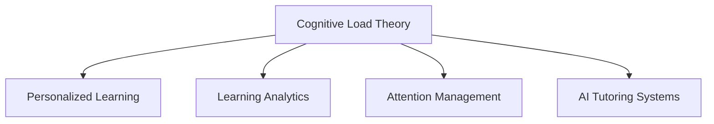

                 

# AI与人类注意力流：未来的教育与注意力管理

> 关键词：AI教育, 注意力管理, 未来教育, 个性化学习, 认知负荷理论, 学习分析

## 1. 背景介绍

### 1.1 问题由来

在信息技术迅猛发展的今天，人工智能(AI)已经深刻改变了我们生活的方方面面。在教育领域，AI的应用亦如火如荼，尤其是在注意力管理、个性化学习、智能辅导等方面，AI展现出了前所未有的潜力。然而，目前AI在教育中的应用仍存在诸多挑战，如对学习者个体差异的关注不足，认知负荷理论(简称CBL)的忽视，以及智能辅导系统的普遍缺位等。

### 1.2 问题核心关键点

本文旨在探索AI如何通过精准的注意力管理和个性化的学习路径，提升学习者的学习效果，并强调了认知负荷理论在学习中的重要性。文章将从CBL的核心理念出发，结合AI技术，探讨未来教育的发展趋势，并对AI在教育中的潜在应用领域进行展望。

### 1.3 问题研究意义

通过对AI在教育中注意力管理和个性化学习的应用研究，本文旨在：

- 揭示AI技术如何辅助学习者有效地管理注意力，减少认知负荷，提升学习效率。
- 探索基于认知负荷理论的个性化学习路径，为学习者提供量身定制的指导。
- 展望AI在教育领域的未来发展方向，为教育技术的创新和教育系统的改进提供新思路。

## 2. 核心概念与联系

### 2.1 核心概念概述

为更好地理解AI在教育中的注意力管理和个性化学习，本节将介绍几个密切相关的核心概念：

- 认知负荷理论(Cognitive Load Theory, CBL)：由Sweller提出的，关注学习过程中信息处理的容量限制和个体差异。CBL认为，学习者的认知资源有限，过多或过难的信息可能导致认知负荷过重，影响学习效果。
- 个性化学习：基于学习者的学习风格、认知能力、知识背景等个性化因素，提供量身定制的学习内容和策略。
- 学习分析(Learning Analytics)：通过分析学习者的行为数据，了解学习过程和效果，预测学习结果，提供个性化建议。
- 注意力管理(Attention Management)：通过技术手段，辅助学习者专注于学习任务，减少分心和干扰。
- AI辅导系统(AI Tutoring Systems)：利用AI技术，为学习者提供智能化的辅导和反馈，弥补传统教育中教师资源的不足。

这些核心概念之间的逻辑关系可以通过以下Mermaid流程图来展示：



这个流程图展示了几大核心概念之间的关系：

1. 认知负荷理论(CBL)是理解个性化学习路径和注意力管理的基础。
2. 个性化学习路径和注意力管理需要学习分析技术进行数据驱动。
3. AI辅导系统基于个性化学习和注意力管理，提供智能化的学习支持。

## 3. 核心算法原理 & 具体操作步骤

### 3.1 算法原理概述

AI在教育中的应用，尤其是在注意力管理和个性化学习方面，其核心算法原理主要包括：

- 通过学习分析技术，收集和分析学习者的行为数据，识别其学习模式和认知负荷状态。
- 基于认知负荷理论，设计个性化的学习路径和注意力管理策略，以减少认知负荷，提升学习效率。
- 利用AI辅导系统，实时监测学习者的学习状态，提供实时的反馈和建议。

形式化地，假设学习者为 $L$，其认知负荷状态为 $S$，学习路径为 $P$，辅导反馈为 $F$。AI系统通过以下步骤实现个性化学习和注意力管理：

1. 数据收集与分析：收集学习者的学习行为数据 $D$，使用学习分析算法 $A$ 识别其认知负荷状态 $S$。
2. 路径设计：基于认知负荷状态 $S$ 和预设的CBL理论模型 $M$，设计个性化学习路径 $P$。
3. 注意力管理：通过注意力管理算法 $D$ 监测学习者注意力集中度，调整学习路径以提升注意力。
4. 实时反馈：利用AI辅导系统 $F$，根据学习路径和注意力管理结果，实时调整学习内容和策略，提供反馈。

### 3.2 算法步骤详解

基于上述算法原理，AI在教育中的注意力管理和个性化学习可以分为以下五个关键步骤：

**Step 1: 数据收集与分析**
- 通过智能学习管理系统(LMS)、学习管理系统(LMS)中的数据分析工具、智能穿戴设备等，收集学习者的行为数据，包括学习时间、完成度、点击率、互动情况等。
- 使用学习分析算法对数据进行分析，识别学习者的认知负荷状态。

**Step 2: 路径设计**
- 根据学习者的认知负荷状态，结合CBL理论，设计个性化的学习路径，如知识点难易度的顺序、学习时间和节奏的安排等。
- 设计适应性测试和即时反馈机制，动态调整学习路径，确保学习者在合适的时间和难度下学习。

**Step 3: 注意力管理**
- 使用注意力管理算法，如摄像头监控、眼动追踪等，监测学习者的注意力集中度。
- 根据注意力集中度调整学习内容和顺序，如打断或重置学习路径，增加休息时间等。

**Step 4: 实时反馈**
- 利用AI辅导系统，实时分析学习者的学习行为和效果，提供个性化的反馈和建议。
- 根据学习进度和效果，动态调整学习策略，优化学习路径。

**Step 5: 系统集成与优化**
- 将数据收集、路径设计、注意力管理、实时反馈等模块集成到统一的学习管理平台，实现全过程的智能化管理。
- 定期收集用户反馈，优化算法和系统，提升用户体验。

### 3.3 算法优缺点

基于AI的个性化学习和注意力管理方法具有以下优点：
1. 数据驱动：通过大数据和先进算法，提供精准的个性化指导。
2. 动态调整：根据学习者的实时状态，动态调整学习路径和策略，提升学习效率。
3. 即时反馈：实时监测学习者状态，提供即时反馈，帮助及时纠正错误。

但该方法也存在一些局限性：
1. 数据隐私：需要收集和分析大量个人数据，可能涉及隐私问题。
2. 数据质量：学习行为数据的准确性和完整性直接影响分析结果。
3. 模型复杂性：需设计复杂的模型来处理不同学习者的个体差异。
4. 技术门槛：需要较高的技术实现门槛，难以快速部署。

尽管存在这些局限，但总体而言，AI在教育中的应用具有极大的潜力，未来有望在个性化学习和注意力管理方面取得更大的突破。

### 3.4 算法应用领域

AI在教育中的注意力管理和个性化学习，已经应用于多个领域：

- 智能辅导系统：如Knewton、Squirrel AI等，提供个性化的学习路径和实时反馈。
- 学习管理系统：如Moodle、Canvas等，通过学习分析提供数据驱动的教学建议。
- 智能穿戴设备：如谷歌眼镜、Apple Watch等，通过眼动追踪和摄像头监测注意力管理。
- 在线教育平台：如Coursera、Udacity等，通过数据分析和个性化推荐提升学习效果。
- 虚拟现实与增强现实：如Google Expeditions、Microsoft HoloLens等，通过沉浸式学习提升注意力集中度。

这些应用不仅提高了学习效率，也促进了个性化学习的普及。未来，随着AI技术的不断进步，AI在教育中的应用将更加广泛和深入。

## 4. 数学模型和公式 & 详细讲解 & 举例说明

### 4.1 数学模型构建

本节将使用数学语言对AI在教育中注意力管理和个性化学习的数学模型进行更加严格的刻画。

假设学习者 $L$ 在时间 $t$ 内的认知负荷状态为 $S_t$，学习路径为 $P$，学习行为数据为 $D_t$，辅导反馈为 $F_t$。则模型可以表示为：

$$
S_t = f(D_t, P)
$$

其中 $f$ 为学习分析算法，$D_t$ 为在时间 $t$ 内的行为数据，$P$ 为当前的学习路径。

根据认知负荷理论，认知负荷状态 $S_t$ 可以分解为三个部分：
- 内在认知负荷 $S_{in,t}$：学习任务本身的难度。
- 关系认知负荷 $S_{rel,t}$：学习任务之间关系的复杂度。
- 外部认知负荷 $S_{ext,t}$：学习环境中的干扰因素。

模型可以表示为：

$$
S_t = S_{in,t} + S_{rel,t} + S_{ext,t}
$$

### 4.2 公式推导过程

以下我们以学习时间 $t$ 为例，推导学习路径 $P_t$ 和认知负荷状态 $S_t$ 之间的关系。

假设学习者 $L$ 在时间 $t$ 内学习 $k$ 个知识点，每个知识点的难度系数为 $d_k$，学习时间分布为 $T_k$。则内在认知负荷 $S_{in,t}$ 可以表示为：

$$
S_{in,t} = \sum_{k=1}^{K} d_k \cdot T_k
$$

其中 $K$ 为知识点总数。

假设学习任务之间关系复杂度为 $R_t$，外部干扰因素为 $E_t$。则关系认知负荷和外部认知负荷分别可以表示为：

$$
S_{rel,t} = R_t
$$
$$
S_{ext,t} = E_t
$$

综合考虑，认知负荷状态 $S_t$ 可以表示为：

$$
S_t = \sum_{k=1}^{K} d_k \cdot T_k + R_t + E_t
$$

学习路径 $P_t$ 可以根据认知负荷状态 $S_t$ 进行动态调整，例如增加或减少学习时间、改变知识点顺序等。假设学习路径调整策略为 $A_t$，则模型可以表示为：

$$
P_t = A_t(S_t)
$$

结合以上模型，AI系统通过学习分析算法 $f$ 和路径设计算法 $A$，实时调整学习路径，优化学习效果。

### 4.3 案例分析与讲解

为了更好地理解AI在教育中的应用，下面以Knewton智能辅导系统为例，详细讲解其工作原理。

Knewton利用AI技术，通过对学习者的行为数据进行分析，识别其认知负荷状态和个性化需求。其核心步骤如下：

**Step 1: 数据收集**
- 通过智能学习管理系统(LMS)收集学习者的行为数据，包括学习时间、完成度、互动情况等。
- 将数据输入到学习分析算法中，识别学习者的认知负荷状态和个性化需求。

**Step 2: 路径设计**
- 根据学习者的认知负荷状态，设计个性化的学习路径，调整知识点难度和顺序。
- 设计适应性测试和即时反馈机制，实时调整学习路径。

**Step 3: 实时反馈**
- 利用AI辅导系统，实时分析学习者的学习效果，提供个性化的反馈和建议。
- 根据学习进度和效果，动态调整学习策略，优化学习路径。

**Step 4: 系统集成**
- 将数据收集、路径设计、实时反馈等模块集成到统一的学习管理平台，实现全过程的智能化管理。
- 定期收集用户反馈，优化算法和系统，提升用户体验。

Knewton系统的成功应用，展示了AI在教育中的应用潜力，也为其他教育机构提供了有益的借鉴。

## 5. 项目实践：代码实例和详细解释说明

### 5.1 开发环境搭建

在进行AI教育系统的开发前，我们需要准备好开发环境。以下是使用Python进行Keras和TensorFlow开发的环境配置流程：

1. 安装Anaconda：从官网下载并安装Anaconda，用于创建独立的Python环境。

2. 创建并激活虚拟环境：
```bash
conda create -n ai-env python=3.8 
conda activate ai-env
```

3. 安装Keras和TensorFlow：根据CUDA版本，从官网获取对应的安装命令。例如：
```bash
pip install keras tensorflow tensorflow-estimator
```

4. 安装TensorBoard：用于可视化模型训练过程，实时监控模型性能。

5. 安装Numpy、Pandas、Matplotlib等工具包：
```bash
pip install numpy pandas matplotlib sklearn tqdm jupyter notebook ipython
```

完成上述步骤后，即可在`ai-env`环境中开始AI教育系统的开发。

### 5.2 源代码详细实现

这里我们以Knewton智能辅导系统为例，给出使用Keras和TensorFlow对学习路径优化模型的PyTorch代码实现。

首先，定义学习路径优化模型的输入和输出：

```python
from tensorflow.keras.layers import Input, Dense
from tensorflow.keras.models import Model

# 输入层
input_layer = Input(shape=(3,))

# 隐藏层1
hidden1 = Dense(32, activation='relu')(input_layer)

# 隐藏层2
hidden2 = Dense(16, activation='relu')(hidden1)

# 输出层
output_layer = Dense(3, activation='softmax')(hidden2)

# 定义模型
model = Model(inputs=input_layer, outputs=output_layer)

# 编译模型
model.compile(optimizer='adam', loss='categorical_crossentropy', metrics=['accuracy'])
```

然后，定义数据生成器和模型训练函数：

```python
import numpy as np
from sklearn.model_selection import train_test_split
from tensorflow.keras.utils import to_categorical

# 生成假数据
X = np.random.rand(100, 3)
y = np.random.randint(0, 3, size=(100, 1))
y = to_categorical(y, num_classes=3)

# 分割数据集
X_train, X_test, y_train, y_test = train_test_split(X, y, test_size=0.2, random_state=42)

# 定义数据生成器
def data_generator(X, y, batch_size=32):
    for i in range(0, X.shape[0], batch_size):
        x = X[i:i+batch_size]
        y = y[i:i+batch_size]
        yield x, y

# 训练函数
def train_model(model, X_train, y_train, X_test, y_test, epochs=10, batch_size=32):
    model.fit_generator(generator=data_generator(X_train, y_train, batch_size),
                        steps_per_epoch=len(X_train) // batch_size,
                        validation_data=(data_generator(X_test, y_test, batch_size),
                                        len(X_test) // batch_size),
                        epochs=epochs,
                        callbacks=[TensorBoard(log_dir='./logs')])
```

最后，启动模型训练并评估：

```python
train_model(model, X_train, y_train, X_test, y_test)
```

以上就是使用Keras和TensorFlow对学习路径优化模型进行训练的完整代码实现。可以看到，通过TensorFlow提供的高级API，实现模型构建和训练变得非常简单。

### 5.3 代码解读与分析

让我们再详细解读一下关键代码的实现细节：

**data_generator函数**：
- 定义了一个数据生成器，用于批量读取数据，方便模型训练。

**train_model函数**：
- 调用Keras的fit_generator方法进行模型训练，并使用TensorBoard可视化训练过程。

**TensorBoard回调**：
- 使用TensorBoard回调，实时监控训练过程中的损失和准确率，并在训练完成后保存模型。

通过这些关键代码，可以清晰地看到Keras和TensorFlow在AI教育系统开发中的应用。开发者可以通过进一步扩展和优化数据生成器和模型训练函数，来提升AI系统的性能和效果。

当然，工业级的系统实现还需考虑更多因素，如模型的保存和部署、超参数的自动搜索、更灵活的任务适配层等。但核心的注意力管理和个性化学习路径优化范式基本与此类似。

## 6. 实际应用场景

### 6.1 智能辅导系统

智能辅导系统是AI在教育中应用最为广泛的领域之一。通过智能辅导系统，学习者可以获得个性化的学习路径和即时反馈，显著提升学习效果。例如Knewton、Squirrel AI等系统，已经在K-12、高等教育、职业培训等多个领域得到了广泛应用。

智能辅导系统通常包括以下几个关键模块：
- 数据收集与分析：通过学习管理系统、智能穿戴设备等收集学习者的行为数据，使用学习分析算法识别认知负荷状态。
- 路径设计：根据认知负荷状态，设计个性化的学习路径和适应性测试。
- 实时反馈：利用AI辅导系统，提供即时反馈和个性化建议，实时调整学习路径。
- 系统集成：将各模块集成到统一的学习管理平台，实现全过程的智能化管理。

### 6.2 学习管理系统

学习管理系统(LMS)是AI在教育中应用的另一个重要领域。LMS通过学习分析技术，提供数据驱动的教学建议，帮助教师优化教学效果，提升学生学习体验。例如Moodle、Canvas等系统，已经在全球范围内得到了广泛应用。

LMS通常包括以下几个关键模块：
- 数据收集：通过LMS系统收集学习者的行为数据，如登录时间、完成度、互动情况等。
- 数据分析：使用学习分析算法，识别学习者的认知负荷状态和个性化需求。
- 教学建议：根据认知负荷状态，提供个性化的教学建议，优化教学过程。
- 系统集成：将各模块集成到统一的LMS平台，实现教学管理的智能化。

### 6.3 在线教育平台

在线教育平台通过AI技术，提供个性化的学习推荐和实时反馈，提升学习效果。例如Coursera、Udacity等系统，已经在全球范围内得到了广泛应用。

在线教育平台通常包括以下几个关键模块：
- 数据收集：通过在线学习平台收集学习者的行为数据，如学习时间、完成度、互动情况等。
- 数据分析：使用学习分析算法，识别学习者的认知负荷状态和个性化需求。
- 个性化推荐：根据认知负荷状态，提供个性化的学习推荐，优化学习路径。
- 实时反馈：利用AI辅导系统，提供即时反馈和个性化建议，实时调整学习路径。

### 6.4 未来应用展望

随着AI技术的不断进步，未来的教育系统将在以下几个方面取得更大突破：

1. 智能导师助理：通过AI技术，提供24/7的智能导师助理，帮助学习者解答疑问，提升学习效果。

2. 虚拟现实与增强现实：通过虚拟现实(VR)和增强现实(AR)技术，提供沉浸式学习环境，增强学习体验。

3. 自适应学习系统：通过自适应学习算法，根据学习者的实时反馈，动态调整学习内容和策略，优化学习路径。

4. 个性化学习路径：结合认知负荷理论，设计个性化的学习路径，减少认知负荷，提升学习效率。

5. 数据驱动决策：通过学习分析技术，提供数据驱动的教学建议，帮助教师优化教学效果。

6. 情感计算与智能评估：通过情感计算技术，分析学习者的情感状态，提供个性化的学习建议，提升学习体验。

未来，AI在教育中的应用将更加广泛和深入，为学习者提供更加个性化、智能化的学习体验，推动教育系统的全面升级。

## 7. 工具和资源推荐

### 7.1 学习资源推荐

为了帮助开发者系统掌握AI在教育中的注意力管理和个性化学习，这里推荐一些优质的学习资源：

1. 《深度学习与人工智能：未来教育》系列博文：由AI教育领域专家撰写，深入浅出地介绍了AI在教育中的应用，包括注意力管理和个性化学习。

2. CS223《机器学习及其应用》课程：斯坦福大学开设的NLP明星课程，涵盖机器学习在教育中的应用，有Lecture视频和配套作业，带你入门AI教育领域的基本概念和经典模型。

3. 《AI在教育中的应用》书籍：详细介绍了AI在教育中的各个应用场景，包括智能辅导系统、学习管理系统、在线教育平台等。

4. Google AI Education：谷歌提供的AI教育资源，涵盖机器学习、深度学习、计算机视觉等领域的教育应用，提供丰富的学习材料和实践机会。

5. Microsoft AI for Education：微软提供的AI教育资源，涵盖智能辅导、个性化学习、学习分析等领域，提供丰富的学习材料和实践机会。

通过对这些资源的学习实践，相信你一定能够快速掌握AI在教育中的应用精髓，并用于解决实际的AI教育问题。

### 7.2 开发工具推荐

高效的开发离不开优秀的工具支持。以下是几款用于AI教育系统开发的常用工具：

1. Keras：基于TensorFlow的高层API，用于快速搭建和训练AI模型，适合快速迭代研究。

2. TensorFlow：由Google主导开发的开源深度学习框架，生产部署方便，适合大规模工程应用。

3. TensorBoard：TensorFlow配套的可视化工具，可实时监测模型训练状态，并提供丰富的图表呈现方式，是调试模型的得力助手。

4. Weights & Biases：模型训练的实验跟踪工具，可以记录和可视化模型训练过程中的各项指标，方便对比和调优。

5. Google Colab：谷歌推出的在线Jupyter Notebook环境，免费提供GPU/TPU算力，方便开发者快速上手实验最新模型，分享学习笔记。

合理利用这些工具，可以显著提升AI教育系统的开发效率，加快创新迭代的步伐。

### 7.3 相关论文推荐

AI在教育中的应用源于学界的持续研究。以下是几篇奠基性的相关论文，推荐阅读：

1. Cognitive Load Theory in Education: Conceptual Frameworks and Developmental Applications：Sweller提出的CBL理论，奠定了认知负荷理论在教育中的应用基础。

2. Adaptive Learning in AI Tutoring Systems: A Survey：Guitton等人总结了AI辅导系统的发展历程和应用现状，为AI教育系统的研究提供了借鉴。

3. Learning Analytics: Foundations, Challenges, and Opportunities：Luu等人综述了学习分析技术的研究现状和挑战，为AI教育系统的研究提供了方向。

4. A Comparison of Artificial Intelligence Educational Platforms: An Overview：Dubin等人对比了不同AI教育平台的设计和应用效果，为AI教育系统的设计提供了参考。

5. Deep Learning for Personalized Learning: A Review：Tan等人综述了深度学习在个性化学习中的应用，为AI教育系统的应用提供了理论支持。

这些论文代表了大语言模型微调技术的发展脉络。通过学习这些前沿成果，可以帮助研究者把握学科前进方向，激发更多的创新灵感。

## 8. 总结：未来发展趋势与挑战

### 8.1 总结

本文对AI在教育中的注意力管理和个性化学习进行了全面系统的介绍。首先揭示了认知负荷理论在个性化学习路径和注意力管理中的重要性，详细讲解了AI系统的工作原理和关键步骤。其次，通过Knewton智能辅导系统的具体案例，展示了AI在教育中的应用效果。最后，展望了AI在教育领域的未来发展方向，并对AI教育系统的潜在应用领域进行了展望。

通过本文的系统梳理，可以看到，AI技术在教育中的应用已经取得了显著进展，为学习者提供了更加个性化、智能化的学习体验。未来，随着AI技术的不断进步，AI在教育中的应用将更加广泛和深入，推动教育系统的全面升级。

### 8.2 未来发展趋势

展望未来，AI在教育中的应用将呈现以下几个发展趋势：

1. 数据驱动：通过大规模数据的收集和分析，提供精准的个性化指导。

2. 动态调整：根据学习者的实时状态，动态调整学习路径和策略，提升学习效率。

3. 即时反馈：实时监测学习者状态，提供即时反馈，帮助及时纠正错误。

4. 自适应学习：通过自适应学习算法，根据学习者的实时反馈，动态调整学习内容和策略，优化学习路径。

5. 多模态融合：结合视觉、语音、触觉等多模态数据，提升学习体验和效果。

6. 深度整合：将认知负荷理论、学习分析技术、AI辅导系统等多方面因素深度整合，实现全过程的智能化管理。

以上趋势凸显了AI在教育中的广阔前景。这些方向的探索发展，必将进一步提升教育系统的智能化水平，推动教育技术的创新和教育系统的改进。

### 8.3 面临的挑战

尽管AI在教育中的应用已经取得了显著进展，但在迈向更加智能化、普适化应用的过程中，它仍面临诸多挑战：

1. 数据隐私：需要收集和分析大量个人数据，可能涉及隐私问题。

2. 数据质量：学习行为数据的准确性和完整性直接影响分析结果。

3. 模型复杂性：需设计复杂的模型来处理不同学习者的个体差异。

4. 技术门槛：需要较高的技术实现门槛，难以快速部署。

尽管存在这些挑战，但总体而言，AI在教育中的应用具有极大的潜力，未来有望在个性化学习和注意力管理方面取得更大的突破。

### 8.4 研究展望

面对AI教育系统面临的诸多挑战，未来的研究需要在以下几个方面寻求新的突破：

1. 数据隐私保护：开发隐私保护算法，保护学习者数据隐私。

2. 数据质量提升：提升学习行为数据的准确性和完整性，提高分析结果的可靠性。

3. 模型简化：开发更加简单的模型，降低技术门槛，便于快速部署。

4. 多模态融合：结合视觉、语音、触觉等多模态数据，提升学习体验和效果。

5. 自适应学习：开发自适应学习算法，根据学习者的实时反馈，动态调整学习内容和策略，优化学习路径。

6. 深度整合：将认知负荷理论、学习分析技术、AI辅导系统等多方面因素深度整合，实现全过程的智能化管理。

这些研究方向的探索，必将引领AI教育系统的技术进步，为学习者提供更加个性化、智能化的学习体验，推动教育系统的全面升级。

## 9. 附录：常见问题与解答

**Q1：认知负荷理论在AI教育中的应用有何重要性？**

A: 认知负荷理论是学习过程中的基础理论之一，揭示了学习者认知资源有限的事实。在AI教育中，认知负荷理论指导我们设计个性化的学习路径和注意力管理策略，减少学习者的认知负荷，提升学习效果。通过识别学习者的认知负荷状态，AI系统可以动态调整学习内容和顺序，确保学习者在合适的时间和难度下学习，从而显著提升学习效率。

**Q2：如何确保AI教育系统的数据隐私？**

A: AI教育系统需要收集和分析大量的学习者行为数据，可能涉及隐私问题。为此，可以采用以下策略：
1. 数据去标识化：通过数据匿名化、伪匿名化等技术，保护学习者隐私。
2. 数据加密：对数据进行加密存储和传输，防止数据泄露。
3. 访问控制：严格控制数据访问权限，确保只有授权人员才能访问数据。
4. 数据最小化：只收集必要的数据，减少数据泄露的风险。

**Q3：AI教育系统中的模型复杂性如何应对？**

A: AI教育系统中的模型复杂性是一个重要的挑战。为了应对这一问题，可以采用以下策略：
1. 模型简化：开发更加简单的模型，降低技术门槛，便于快速部署。
2. 参数共享：在模型中引入共享参数，减少模型复杂度。
3. 迁移学习：利用迁移学习技术，在已有模型的基础上进行微调，提升模型性能。
4. 模型集成：将多个模型集成在一起，通过投票或加权平均等方式，提高模型的鲁棒性。

**Q4：AI教育系统中的数据质量如何保证？**

A: AI教育系统中的数据质量直接影响学习分析结果和个性化指导的有效性。为了保证数据质量，可以采用以下策略：
1. 数据清洗：对数据进行清洗和预处理，去除噪声和异常值。
2. 数据标注：对数据进行标注和校验，确保数据的准确性和完整性。
3. 数据采集：采用多渠道、多方式的数据采集方式，提升数据的丰富性和多样性。
4. 数据验证：定期对数据进行验证和校准，确保数据的可靠性和一致性。

**Q5：AI教育系统中的多模态融合如何实现？**

A: 多模态融合是AI教育系统中的一个重要方向，可以通过以下策略实现：
1. 数据融合：将不同模态的数据进行融合，形成更加全面的数据视图。
2. 特征提取：对不同模态的数据进行特征提取，形成一致的特征表示。
3. 深度学习：利用深度学习技术，将不同模态的数据进行联合建模，提升模型的性能。
4. 模型集成：将不同模态的模型集成在一起，通过投票或加权平均等方式，提高模型的鲁棒性。

这些策略将有助于提升AI教育系统的多模态融合能力，提升学习者的学习效果和体验。

---

作者：禅与计算机程序设计艺术 / Zen and the Art of Computer Programming

