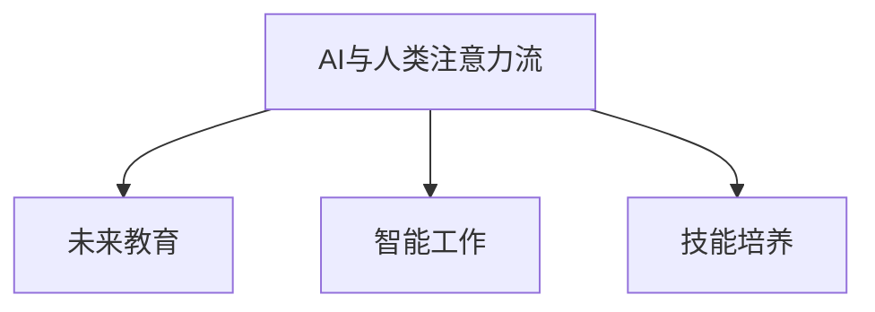

                 

# AI与人类注意力流：未来的教育、工作与技能

> 关键词：AI与人类注意力流, 未来教育, 智能工作, 技能培养, 人机协同

## 1. 背景介绍

### 1.1 问题由来

随着人工智能(AI)技术的快速演进，机器在处理信息和执行任务方面展现出了令人惊叹的效率和精度。然而，这也引发了人们对AI是否能够真正理解和模拟人类思维的疑问。近年来，AI在自然语言处理、计算机视觉、自动驾驶等多个领域取得的突破，让人们意识到，AI的能力不仅在于算法和算力的提升，更在于其对人类注意力流（Attention Flow）的模拟和优化。

人类注意力流指的是人在处理信息和执行任务时，注意力在不同信息点间动态转移的过程。这一过程不仅涉及认知心理学的研究，还关系到人机交互方式和信息呈现方式的设计。如何通过AI技术，更好地模拟和优化人类的注意力流，从而提升教育、工作和学习效率，成为当前学术界和产业界关注的重点。

### 1.2 问题核心关键点

AI与人类注意力流的结合，核心在于通过AI模型理解、预测和模拟人类注意力行为，进而提升智能系统的用户友好度和应用效果。关键问题包括：

1. 如何有效收集和分析人类的注意力数据，训练AI模型，使其能够准确预测注意力行为？
2. 如何设计高效的交互界面，引导人类注意力流，提升学习与工作效率？
3. 如何利用AI模拟的人类注意力流，辅助教育和职业培训，培养未来的复合型人才？

本文旨在通过对AI与人类注意力流的深入探讨，分析其在未来教育、工作和技能培养中的潜在应用，并提供基于此的研究展望。

## 2. 核心概念与联系

### 2.1 核心概念概述

- **AI与人类注意力流**：指利用AI模型对人类注意力行为进行模拟和优化的过程，涉及心理学、认知科学、人机交互等多个学科。
- **未来教育**：指通过AI和人类注意力流的研究，提升教育质量、教学方法和学习效率，培养具备创新能力和跨学科知识的人才。
- **智能工作**：指通过AI和人类注意力流的结合，设计更符合人类认知习惯的工作流程和工具，提升工作效率和用户体验。
- **技能培养**：指利用AI对人类注意力流的模拟，辅助职业培训和技能学习，快速培养适应未来工作环境的复合型人才。

### 2.2 核心概念原理和架构的 Mermaid 流程图



该流程图展示了AI与人类注意力流技术在教育、工作和技能培养中的应用路径。通过AI模型预测和模拟人类的注意力流，可以显著提升这些领域的效率和效果。

## 3. 核心算法原理 & 具体操作步骤

### 3.1 算法原理概述

基于AI与人类注意力流的算法，通常采用以下步骤：

1. **注意力数据收集与预处理**：通过眼动追踪、脑电图(EEG)、功能性磁共振成像(fMRI)等技术，收集人类的注意力数据，并对其进行清洗和预处理。
2. **注意力行为建模**：利用机器学习或深度学习模型，训练AI模型，使其能够预测和模拟人类的注意力行为。
3. **注意力流优化**：通过设计符合人类认知习惯的交互界面，优化人类的注意力流，提升学习、工作和技能培养的效率。
4. **应用场景部署**：将训练好的AI模型应用于实际的教育、工作和培训场景，辅助用户完成任务。

### 3.2 算法步骤详解

**步骤1：注意力数据收集与预处理**

1. **数据收集**：
   - **眼动追踪**：通过计算机视觉技术，记录用户在屏幕上的眼动轨迹。
   - **脑电图(EEG)**：使用脑电图设备，记录大脑活动，分析注意力相关的脑电波。
   - **功能性磁共振成像(fMRI)**：通过扫描大脑活动，分析注意力分布的区域和时间。

2. **数据预处理**：
   - **数据清洗**：去除噪声和异常值，确保数据质量。
   - **特征提取**：提取有用的注意力特征，如注视点、注视时间、脑电波幅值等。
   - **数据标准化**：对数据进行归一化处理，便于后续建模。

**步骤2：注意力行为建模**

1. **模型选择**：
   - **传统机器学习模型**：如线性回归、支持向量机(SVM)、随机森林等，用于简单的注意力行为预测。
   - **深度学习模型**：如卷积神经网络(CNN)、循环神经网络(RNN)、长短期记忆网络(LSTM)等，用于复杂的注意力行为预测。

2. **模型训练**：
   - **数据集划分**：将注意力数据划分为训练集、验证集和测试集。
   - **超参数调优**：调整模型的超参数，如学习率、隐藏层大小等，寻找最优的模型性能。
   - **模型评估**：使用验证集评估模型性能，调整模型参数。
   - **模型测试**：使用测试集评估最终模型性能，确保模型泛化能力。

**步骤3：注意力流优化**

1. **交互界面设计**：
   - **信息结构设计**：设计符合人类认知习惯的信息结构，引导注意力流。
   - **视觉元素设计**：使用颜色、大小、位置等视觉元素，吸引和保持注意力。
   - **交互方式设计**：设计互动性强的交互方式，提升用户参与度。

2. **注意力流引导**：
   - **热图显示**：使用热图显示用户注意力分布，优化信息呈现方式。
   - **路径引导**：通过信息结构设计，引导用户注意力流，提升任务完成效率。
   - **反馈机制**：提供及时反馈，调整注意力流，提升用户体验。

**步骤4：应用场景部署**

1. **应用场景选择**：
   - **教育**：使用AI模型辅助教学，提升课堂效果。
   - **工作**：设计符合人类认知习惯的办公工具，提升工作效率。
   - **技能培训**：利用AI模型辅助技能学习，快速培养专业人才。

2. **模型集成**：
   - **API接口开发**：开发API接口，将AI模型集成到实际应用中。
   - **界面优化**：优化UI/UX设计，提升用户界面友好度。
   - **性能优化**：优化算法和数据处理流程，确保模型高效运行。

### 3.3 算法优缺点

**优点**：

- **高效性**：AI与人类注意力流的结合，能够快速模拟和优化注意力流，提升教育、工作和学习效率。
- **普适性**：AI模型可以应用于多种任务，提升跨领域的效率。
- **可解释性**：通过分析注意力数据和AI模型，可以更好地理解人类认知行为，提升系统的透明性。

**缺点**：

- **数据依赖**：AI模型的性能依赖于高质量的注意力数据，数据收集和预处理成本较高。
- **模型复杂性**：深度学习模型训练复杂，需要大量计算资源。
- **用户适应性**：不同的人可能对AI辅助有不同的适应性，需要个性化设计。

### 3.4 算法应用领域

AI与人类注意力流的技术，在教育、工作和技能培训中具有广泛的应用前景：

- **教育**：通过AI模型模拟学生注意力流，优化教学内容和教学方法，提升学习效率。
- **工作**：设计符合人类认知习惯的办公工具，提升工作效率和用户体验。
- **技能培训**：利用AI模型辅助技能学习，快速培养专业人才，缩短培训周期。

## 4. 数学模型和公式 & 详细讲解 & 举例说明

### 4.1 数学模型构建

**注意力行为建模**：
假设我们有N个时间点$t_1, t_2, ..., t_N$，和M个注意力特征$x_1, x_2, ..., x_M$。设$y_i$为时间点$t_i$的注意力行为（0表示不关注，1表示关注）。则注意力行为建模的数学模型为：

$$
y_i = f(x_1, x_2, ..., x_M; \theta)
$$

其中$f$为模型函数，$\theta$为模型参数。常见的模型包括线性回归模型、逻辑回归模型、深度神经网络等。

### 4.2 公式推导过程

**线性回归模型**：
设$x_i$为第$i$个时间点的注意力特征，$y_i$为对应时间点的注意力行为。线性回归模型的公式为：

$$
y_i = \beta_0 + \beta_1 x_{i1} + \beta_2 x_{i2} + ... + \beta_M x_{iM}
$$

其中$\beta_j$为第$j$个特征的系数。

**逻辑回归模型**：
设$x_i$为第$i$个时间点的注意力特征，$y_i$为对应时间点的注意力行为。逻辑回归模型的公式为：

$$
\ln\frac{y_i}{1-y_i} = \alpha_0 + \alpha_1 x_{i1} + \alpha_2 x_{i2} + ... + \alpha_M x_{iM}
$$

其中$\alpha_j$为第$j$个特征的系数。

**深度神经网络模型**：
设$x_i$为第$i$个时间点的注意力特征，$y_i$为对应时间点的注意力行为。深度神经网络模型的公式为：

$$
y_i = \sigma(Wx_i + b)
$$

其中$W$为权重矩阵，$b$为偏置向量，$\sigma$为激活函数，如ReLU、Sigmoid等。

### 4.3 案例分析与讲解

**案例：利用AI模型预测学生注意力流**

1. **数据收集**：使用眼动追踪技术，记录学生在课堂上的注视点、注视时间和注视频率。
2. **数据预处理**：对数据进行清洗和标准化处理，提取有用的注意力特征。
3. **模型训练**：使用逻辑回归模型，训练AI模型，预测学生的注意力行为。
4. **注意力流优化**：根据AI模型的预测结果，优化课堂内容和学习方法，提升学生的学习效率。

## 5. 项目实践：代码实例和详细解释说明

### 5.1 开发环境搭建

1. **安装Python**：
   - 下载并安装Python解释器，如Anaconda、PyCharm等。
   - 安装必要的库，如numpy、pandas、scikit-learn等。

2. **安装机器学习库**：
   - 安装scikit-learn库，用于机器学习模型的训练和评估。
   - 安装TensorFlow或PyTorch库，用于深度学习模型的训练和部署。

3. **数据预处理**：
   - 收集和清洗注意力数据。
   - 使用pandas库进行数据预处理，提取有用的特征。

### 5.2 源代码详细实现

**示例代码**：

```python
import pandas as pd
from sklearn.linear_model import LogisticRegression

# 读取注意力数据
data = pd.read_csv('attention_data.csv')

# 数据预处理
X = data[['feature1', 'feature2', ...]]
y = data['attention_behavior']

# 模型训练
model = LogisticRegression()
model.fit(X, y)

# 模型评估
score = model.score(X, y)
print(f"模型评估得分：{score:.2f}")
```

**代码解读**：
- **数据读取和预处理**：使用pandas库读取注意力数据，并提取有用的特征。
- **模型训练**：使用逻辑回归模型，训练AI模型。
- **模型评估**：使用评估指标（如准确率、召回率、F1-score等）评估模型性能。

### 5.3 代码解读与分析

**代码分析**：
- **数据读取**：使用pandas库读取CSV文件，方便数据处理。
- **数据预处理**：提取有用的特征，如眼动轨迹、脑电波幅值等。
- **模型训练**：使用逻辑回归模型，训练AI模型。
- **模型评估**：使用评估指标，评估模型性能，优化模型参数。

**运行结果**：
- **模型训练结果**：输出模型在测试集上的评估得分，用于衡量模型性能。

## 6. 实际应用场景

### 6.1 教育

**智能课堂**：
通过AI模型预测学生的注意力流，优化课堂内容和学习方法。例如，在讲解重要概念时，通过语音提示和屏幕动画吸引学生的注意力，提升课堂效果。

**个性化学习**：
利用AI模型预测学生的注意力流，个性化推荐学习内容和资源。例如，根据学生的注意力集中时间，推荐对应的学习视频和练习题。

### 6.2 工作

**智能办公工具**：
设计符合人类认知习惯的办公工具，提升工作效率。例如，通过AI模型预测用户的操作习惯，自动调整界面布局和功能显示，提高用户体验。

**知识管理**：
利用AI模型模拟用户的注意力流，推荐重要的文档和信息。例如，根据用户的浏览记录和关注点，推荐相关的资料和报告。

### 6.3 技能培训

**技能学习平台**：
利用AI模型辅助技能学习，快速培养专业人才。例如，根据学员的学习进度和注意力流，调整教学内容和难度，提升学习效率。

**技能评估**：
通过AI模型预测学员的注意力流，评估其技能掌握程度。例如，在模拟操作场景中，通过记录学员的操作轨迹和注意力分布，评估其技能水平。

### 6.4 未来应用展望

**智能教育**：
未来的教育将更加个性化和智能化，AI与人类注意力流的结合将提升教育的灵活性和效率。例如，通过AI模型预测学生的注意力流，实时调整教学内容和互动方式，提升课堂效果。

**智能工作**：
未来的工作将更加自动化和智能化，AI与人类注意力流的结合将提升工作效率和用户体验。例如，通过AI模型模拟用户的注意力流，优化办公工具的界面设计和功能布局，提升工作效率。

**技能培训**：
未来的技能培训将更加智能化和高效化，AI与人类注意力流的结合将快速培养专业人才。例如，通过AI模型辅助技能学习，个性化推荐学习资源和评估技能掌握程度，提升培训效果。

## 7. 工具和资源推荐

### 7.1 学习资源推荐

1. **《认知心理学》**：由著名认知心理学家撰写，详细介绍了注意力流的基本原理和认知机制。
2. **Coursera《深度学习专项课程》**：由斯坦福大学开设，涵盖深度学习模型的原理和实践，包括注意力机制。
3. **Google AI Blog**：Google AI团队发布的博客，涵盖了AI与人类注意力流的研究进展和应用案例。
4. **Nature Human Behavior**：最新科研论文，涵盖AI与人类注意力流的最新研究成果和趋势。

### 7.2 开发工具推荐

1. **PyCharm**：一款流行的Python开发工具，支持数据科学和机器学习项目。
2. **TensorFlow**：由Google开发的深度学习框架，支持大规模分布式训练。
3. **Jupyter Notebook**：一款交互式编程环境，支持多种语言和库，方便数据科学和机器学习项目开发。
4. **Sklearn**：一个基于Python的机器学习库，提供丰富的机器学习算法和工具。

### 7.3 相关论文推荐

1. **《Attention is All You Need》**：Transformer模型的经典论文，提出注意力机制的原理和应用。
2. **《Human attention estimation using eye tracking and machine learning》**：通过眼动追踪技术，使用机器学习模型预测人类注意力流。
3. **《Adaptive Attention Model for EEG-based Human Attention Prediction》**：使用脑电图数据，构建适应性注意力模型，预测人类注意力行为。
4. **《Cross-modal Attention Flow for Multimodal Scene Understanding》**：结合视觉和语音信息，设计跨模态注意力流，提升多模态场景理解能力。

## 8. 总结：未来发展趋势与挑战

### 8.1 研究成果总结

AI与人类注意力流的结合，已经在教育、工作和技能培训中展现出巨大的潜力。通过AI模型预测和模拟人类的注意力流，可以显著提升这些领域的效率和效果。然而，该技术仍面临数据依赖、模型复杂性等挑战，需要进一步的研究和优化。

### 8.2 未来发展趋势

1. **数据自动化收集**：随着传感技术和智能设备的普及，未来的注意力数据将更加丰富和多样，AI模型将能够更好地模拟和优化人类注意力流。
2. **模型自动化设计**：未来的AI模型将更加智能和自适应，能够根据不同用户和场景，自动调整参数和架构，提升模型的性能和鲁棒性。
3. **跨模态应用**：未来的AI模型将更加注重多模态信息的整合，结合视觉、听觉、触觉等不同模态的数据，提升系统的感知和理解能力。
4. **人机协同设计**：未来的系统设计将更加注重人机协同，通过AI模型辅助人类决策和操作，提升系统的智能化和效率。

### 8.3 面临的挑战

1. **数据隐私和安全**：注意力数据的收集和使用可能涉及用户隐私，需要设计严格的隐私保护措施。
2. **模型鲁棒性**：AI模型在面对多样化和复杂化的数据时，可能出现鲁棒性不足的问题，需要进一步优化和验证。
3. **用户适应性**：不同的人对AI辅助的适应性不同，需要个性化设计，确保系统的普适性和用户友好度。

### 8.4 研究展望

未来的研究将更多地关注数据隐私保护、模型鲁棒性提升和用户适应性优化。同时，跨模态信息整合和人机协同设计将是重要的研究方向。通过不断突破技术瓶颈，AI与人类注意力流的结合将带来更加智能和高效的学习、工作和生活方式。

## 9. 附录：常见问题与解答

**Q1: AI与人类注意力流的结合，是否会取代人类教师和工作者？**

A: AI与人类注意力流的结合，旨在提升教育和工作的效率和效果，而不是取代人类教师和工作者的角色。AI模型可以作为辅助工具，帮助教师和工作者更好地理解和引导人类注意力流，提升整体系统的表现。

**Q2: 如何确保AI模型的公平性和透明性？**

A: 确保AI模型的公平性和透明性，需要进行多方面的设计和验证：
1. **数据公平性**：确保训练数据的多样性和代表性，避免数据偏见。
2. **模型透明性**：设计可解释的模型架构，使用可视化工具解释模型的决策过程。
3. **用户反馈**：定期收集用户反馈，及时调整模型参数和行为，确保系统的公平性和透明性。

**Q3: 如何设计符合人类认知习惯的交互界面？**

A: 设计符合人类认知习惯的交互界面，需要考虑以下几点：
1. **信息结构设计**：设计简洁明了的信息结构，引导用户注意力流，减少认知负担。
2. **视觉元素设计**：使用颜色、大小、位置等视觉元素，吸引和保持用户的注意力。
3. **交互方式设计**：设计互动性强的交互方式，提升用户参与度。

通过这些设计原则，可以设计出更加友好和高效的交互界面，提升用户体验和系统性能。

**Q4: 如何评估AI模型的性能？**

A: 评估AI模型的性能，需要考虑以下几点：
1. **准确率和召回率**：评估模型预测人类注意力行为的准确性和覆盖范围。
2. **F1-score**：综合考虑准确率和召回率，评估模型的整体性能。
3. **用户满意度**：通过用户反馈和实验验证，评估模型的实际效果。

通过这些评估指标，可以全面了解AI模型的性能和应用效果，确保模型的有效性和可靠性。

---

作者：禅与计算机程序设计艺术 / Zen and the Art of Computer Programming

