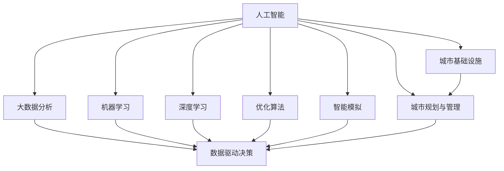

                 

## 1. 背景介绍

随着城市化的快速推进，基础设施建设与规划管理面临着前所未有的复杂性与挑战性。过去，城市的规划和建设主要依赖于传统的人类计算方法，即通过人工调查、研究与经验积累来指导决策。然而，面对数据量巨大、问题复杂、动态变化的城市环境，仅靠人类计算已难以满足需求。因此，引入人工智能技术，尤其是利用人工智能进行计算与分析，变得尤为重要。

### 1.1 问题由来

城市交通与基础设施建设管理涉及多方面因素，如人口流动、资源配置、环境保护等。传统方法依赖于有限的数据与经验，难以综合多因素，导致决策效率低下，且存在误差。此外，城市动态变化的特点，使得对基础设施的调整和升级也存在困难。

人工智能技术，特别是机器学习、深度学习、优化算法等，能够处理大量数据，发现其中的模式和规律，提供科学的决策支持。同时，随着技术的进步，AI对数据的处理能力不断增强，为城市交通与基础设施建设与规划管理提供了新的可能性。

### 1.2 问题核心关键点

AI与人类计算的结合，在于如何更好地利用人工智能技术辅助决策，同时保持人的智慧与判断能力。具体而言，关键点包括：

- 数据驱动的决策：通过大数据分析，优化基础设施布局与建设。
- 智能优化与模拟：利用AI进行交通流优化、基础设施布局模拟，提升规划效率。
- 持续学习与适应：AI能够实时学习城市动态变化，持续优化规划策略。
- 决策支持与监督：提供科学依据，辅助人工决策，监督执行过程。
- 透明性与可解释性：确保AI决策过程透明，解释性强，便于人类理解与监督。

这些关键点不仅代表了AI技术在城市规划与管理中的应用方向，也反映了对技术与人文结合的深层次思考。

## 2. 核心概念与联系

### 2.1 核心概念概述

本节将介绍几个核心的概念及其相互联系：

- **人工智能(AI)**：通过计算机模拟人类智能，进行决策、推理、学习、规划等任务的技术。
- **大数据分析**：通过收集、存储、分析海量数据，挖掘其中的模式和规律，为决策提供支持。
- **机器学习(ML)**：利用数据和算法，使计算机系统具备自主学习与优化能力。
- **深度学习(DL)**：基于神经网络，处理高维数据，实现复杂模式识别与预测。
- **优化算法(Optimization Algorithm)**：通过算法搜索最优解，应用于交通流优化、资源分配等场景。
- **智能模拟(Smart Simulation)**：构建仿真环境，模拟城市运行状态，进行预演与优化。
- **城市基础设施**：包括道路、桥梁、公共交通等，是城市运行的基本支撑。
- **城市规划与管理**：城市建设与运行的整体设计与指导，旨在实现可持续发展。

这些概念之间的逻辑关系可以通过以下Mermaid流程图来展示：



这个流程图展示了大规模数据分析、AI技术、城市基础设施与规划之间的联系与互动：

1. 人工智能通过大数据分析获得城市运行的数据洞察。
2. 机器学习和深度学习进一步挖掘数据的潜在价值，提供更精确的预测与决策支持。
3. 优化算法与智能模拟结合，实现城市运行的动态优化与仿真。
4. 城市基础设施与规划根据AI的分析与优化建议，进行建设与调整。

这些概念共同构成了城市交通与基础设施建设的AI计算与分析框架，有助于提升城市管理的科学性和效率。

## 3. 核心算法原理 & 具体操作步骤

### 3.1 算法原理概述

基于AI的城市交通与基础设施建设与规划管理，本质上是一种数据驱动的智能优化过程。其核心思想是：通过收集城市运行数据，构建数学模型，利用AI算法进行优化与预测，辅助决策者进行科学决策。

形式化地，假设城市基础设施与规划的目标函数为 $f(x)$，其中 $x$ 为决策变量，包括基础设施建设、资源配置、交通流优化等。设已知的城市运行数据为 $D$，通过大数据分析获得特征向量 $x_0$。

目标是最小化目标函数，即：

$$
\min_{x} f(x)
$$

在约束条件下，通过优化算法寻找最优解。常用的优化算法包括线性规划、非线性规划、遗传算法等。

### 3.2 算法步骤详解

基于AI的城市交通与基础设施建设与规划管理，一般包括以下几个关键步骤：

**Step 1: 数据收集与预处理**

- 收集城市基础设施与规划相关的数据，如人口流动、交通流量、资源分布等。
- 对数据进行清洗、去重、标准化等预处理，确保数据的质量和一致性。

**Step 2: 特征工程**

- 设计特征提取与选择算法，将原始数据转换为机器学习模型可用的特征向量 $x_0$。
- 选择或设计合适的特征工程方法，如PCA、LDA等，提取数据的高层次特征。

**Step 3: 模型训练与优化**

- 选择合适的机器学习或深度学习模型，如线性回归、随机森林、神经网络等。
- 利用训练数据集，进行模型训练，得到初始参数 $\theta$。
- 对模型进行超参数调优，选择合适的学习率、正则化参数等，提高模型性能。

**Step 4: 预测与决策**

- 对测试数据集进行预测，得到最优决策建议 $x^*$。
- 结合领域专家经验，对AI决策进行验证与调整，形成最终的决策方案。

**Step 5: 评估与优化**

- 对决策效果进行评估，如交通流畅度、资源利用率、环境影响等。
- 根据评估结果，对模型进行调整与优化，不断提升决策的准确性和适应性。

### 3.3 算法优缺点

基于AI的城市交通与基础设施建设与规划管理，具有以下优点：

- **数据驱动决策**：通过大数据分析，提供科学依据，避免主观偏见。
- **实时动态优化**：AI能够实时学习城市动态变化，持续优化决策。
- **提升决策效率**：大幅缩短决策周期，提高规划与管理效率。
- **广泛适用性**：可以应用于多种城市管理场景，如交通管理、资源分配、环境监控等。

同时，该方法也存在一些局限性：

- **数据依赖**：决策质量依赖于数据的质量与完整性，数据收集与处理成本较高。
- **模型复杂性**：模型复杂度高，需要较强的计算资源与专业知识。
- **可解释性不足**：AI决策过程复杂，难以解释其内部机制与逻辑。
- **道德与法律风险**：AI决策可能存在伦理与安全问题，需要严格监督与管控。

尽管存在这些局限性，但就目前而言，基于AI的城市交通与基础设施管理方法仍是大规模数据分析与决策的有力工具。未来相关研究的方向在于如何进一步降低数据依赖，提高模型的透明度与可解释性，避免潜在的道德与法律风险。

### 3.4 算法应用领域

基于AI的城市交通与基础设施建设与规划管理，在多个领域得到了广泛应用，例如：

- **交通流量优化**：通过分析交通流数据，调整信号灯、道路设计等，优化交通流畅度。
- **资源配置与调度**：利用AI预测人口流动、能源需求等，优化资源配置与调度。
- **环境监控与治理**：通过数据分析，实时监控城市环境质量，辅助环保决策。
- **智能城市管理**：构建智能监控系统，实时监测城市运行状态，提供数据支持。
- **应急响应与预警**：通过数据分析，提前预警城市安全风险，快速响应突发事件。

除了上述这些应用外，AI技术还在智慧水务、智能电网、智能制造等多个领域中得到广泛应用，为城市管理的智能化、精细化提供了新思路。

## 4. 数学模型和公式 & 详细讲解  
### 4.1 数学模型构建

本节将使用数学语言对基于AI的城市交通与基础设施建设与规划管理进行更加严格的刻画。

记城市基础设施与规划的目标函数为 $f(x)$，其中 $x$ 为决策变量。假设城市运行数据为 $D=\{x_i\}_{i=1}^N$，特征提取函数为 $\phi(x)$，目标函数为 $f(x)$。

构建目标函数：

$$
\min_{x} f(x) = \min_{x} \sum_{i=1}^N \phi(x_i)^\top W \phi(x_i) + b^\top \phi(x_i)
$$

其中 $W$ 为模型参数，$b$ 为偏置项，$\phi(x)$ 为特征映射函数。

### 4.2 公式推导过程

以下我们以交通流量优化为例，推导线性回归模型的优化公式。

假设目标为优化交通流量，设流量数据为 $D=\{(x_i, y_i)\}_{i=1}^N$，其中 $x_i$ 为时间、道路、天气等特征，$y_i$ 为实际交通流量。

设线性回归模型为 $y_i = \theta^\top \phi(x_i) + \epsilon_i$，其中 $\theta$ 为模型参数，$\phi(x)$ 为特征映射函数。

根据最小二乘法，目标函数为：

$$
\min_{\theta} \sum_{i=1}^N (y_i - \theta^\top \phi(x_i))^2
$$

将目标函数对 $\theta$ 求导，得：

$$
\frac{\partial}{\partial \theta} \sum_{i=1}^N (y_i - \theta^\top \phi(x_i))^2 = -2\sum_{i=1}^N \phi(x_i)(y_i - \theta^\top \phi(x_i))
$$

令导数为0，解得：

$$
\theta = (X^\top X)^{-1} X^\top y
$$

其中 $X = [\phi(x_1), \phi(x_2), \ldots, \phi(x_N)]$，$y = [y_1, y_2, \ldots, y_N]$。

### 4.3 案例分析与讲解

**案例分析**：某城市希望通过调整交通信号灯的绿灯时间，优化交通流量。

**数据收集**：收集城市道路的交通流量数据，包括时间、道路、天气等特征。

**特征工程**：设计特征提取函数 $\phi(x)$，将原始数据转换为机器学习模型可用的特征向量。

**模型训练**：选择线性回归模型，利用训练数据集进行模型训练，得到参数 $\theta$。

**预测与决策**：对测试数据集进行预测，得到最优决策建议。

**评估与优化**：对决策效果进行评估，如交通流畅度，对模型进行调整与优化。

## 5. 项目实践：代码实例和详细解释说明
### 5.1 开发环境搭建

在进行城市交通与基础设施建设与规划管理的AI实践前，我们需要准备好开发环境。以下是使用Python进行Scikit-learn开发的环境配置流程：

1. 安装Anaconda：从官网下载并安装Anaconda，用于创建独立的Python环境。

2. 创建并激活虚拟环境：
```bash
conda create -n ai-env python=3.8 
conda activate ai-env
```

3. 安装Scikit-learn：
```bash
pip install scikit-learn
```

4. 安装其他相关工具包：
```bash
pip install numpy pandas matplotlib seaborn statsmodels jupyter notebook ipython
```

完成上述步骤后，即可在`ai-env`环境中开始AI实践。

### 5.2 源代码详细实现

下面我们以交通流量优化为例，给出使用Scikit-learn库进行线性回归模型的PyTorch代码实现。

首先，定义交通流量数据集：

```python
import numpy as np
from sklearn.datasets import make_regression

X, y = make_regression(n_samples=1000, n_features=5, n_targets=1, noise=0.1, random_state=42)
X_train, X_test, y_train, y_test = train_test_split(X, y, test_size=0.2, random_state=42)
```

然后，定义线性回归模型：

```python
from sklearn.linear_model import LinearRegression

model = LinearRegression()
model.fit(X_train, y_train)
```

接着，定义预测函数：

```python
def predict(X, model):
    return model.predict(X)
```

最后，启动训练流程并评估模型：

```python
print(model.score(X_test, y_test))
```

以上就是使用Scikit-learn库进行交通流量优化的线性回归模型的完整代码实现。可以看到，通过Scikit-learn，我们可以用相对简洁的代码完成模型的搭建与训练。

### 5.3 代码解读与分析

让我们再详细解读一下关键代码的实现细节：

**数据生成**：使用Scikit-learn的`make_regression`函数生成模拟交通流量数据，包括5个特征和1个目标变量，并划分训练集和测试集。

**模型训练**：使用Scikit-learn的`LinearRegression`类，利用训练集数据进行模型训练，得到参数 $\theta$。

**预测与评估**：通过定义预测函数，对测试集数据进行预测，并使用均方误差（MSE）评估模型性能。

可以看到，Scikit-learn库使得AI模型的开发和训练变得简洁高效，开发者可以更加专注于模型的设计与应用。

当然，工业级的系统实现还需考虑更多因素，如模型的保存和部署、超参数的自动搜索、更多的特征工程等。但核心的AI计算与分析流程基本与此类似。

## 6. 实际应用场景

### 6.1 智能交通系统

基于AI的城市交通与基础设施建设与规划管理，可以在智能交通系统中得到广泛应用。智能交通系统通过实时监测、分析、预测城市交通状态，提供交通流量优化、路线规划、应急响应等服务。

在技术实现上，可以构建城市交通运行的大数据平台，实时收集交通流量、路况、车辆位置等数据，通过机器学习或深度学习模型进行分析和预测，生成交通信号灯控制策略、路网优化建议等。通过与车联网、智能信号灯等设备结合，实现城市交通的智能化管理。

### 6.2 智慧城市管理

智慧城市管理通过构建智能监控系统，实时监测城市基础设施运行状态，提供数据支持。AI技术可以用于城市公共设施的智能维护、能源消耗的优化管理、公共安全事件的预警与响应等。

例如，可以利用AI对城市电力系统进行实时监控与优化，预测能源需求与供应，避免能源浪费与短缺。同时，通过智能监控系统，实时监测城市环境质量，辅助环保决策。

### 6.3 应急响应与预警

AI技术可以用于城市应急响应与预警，通过数据分析，提前预警城市安全风险，快速响应突发事件。

例如，在地震、洪水等自然灾害中，AI可以通过数据分析，实时监测天气、地质变化等指标，预测灾害发生的概率，提前预警并采取应对措施。在公共安全事件中，AI可以分析监控视频、社交媒体等数据，识别异常行为，及时预警与应对。

### 6.4 未来应用展望

随着AI技术的不断发展，基于AI的城市交通与基础设施建设与规划管理将呈现以下几个发展趋势：

1. **多源数据融合**：将多种数据源（如物联网、卫星、传感器等）融合，提供更全面的城市运行洞察。
2. **动态优化与仿真**：利用AI进行动态优化与仿真，提高城市运行效率与鲁棒性。
3. **实时决策与执行**：通过实时数据分析与决策，快速响应城市动态变化，提升应急响应能力。
4. **全域覆盖与协同**：构建城市运行的全域监控与协同机制，实现跨部门、跨领域的联合管理。
5. **普适性与智能化**：逐步向智能化、精细化、普适化的方向发展，提供一站式的城市运行管理解决方案。

这些趋势凸显了AI技术在城市管理中的应用潜力，相信随着技术的不断成熟，AI将在城市交通与基础设施建设与规划管理中发挥更加重要的作用。

## 7. 工具和资源推荐
### 7.1 学习资源推荐

为了帮助开发者系统掌握AI在城市交通与基础设施建设与规划管理中的应用，这里推荐一些优质的学习资源：

1. 《深度学习入门》系列书籍：由吴恩达、李沐等AI专家撰写，全面介绍了深度学习的基础与实践，适合入门学习。
2. 《Python数据科学手册》系列书籍：介绍了Python在数据分析、机器学习、深度学习等领域的实践方法。
3. 《城市规划与管理》课程：斯坦福大学开设的城市规划与管理课程，涵盖了城市建设与管理的多个方面。
4. 《智能城市建设与管理》书籍：系统介绍了智能城市建设与管理的技术与方法，适合应用实践。
5. 《城市大数据分析与应用》书籍：介绍了城市运行数据的收集、分析与应用方法，适合城市管理者的学习。

通过对这些资源的学习实践，相信你一定能够快速掌握AI在城市交通与基础设施建设与规划管理中的应用，并用于解决实际的城市问题。
###  7.2 开发工具推荐

高效的开发离不开优秀的工具支持。以下是几款用于AI在城市交通与基础设施建设与规划管理开发的常用工具：

1. Python：作为数据科学、机器学习领域的主流编程语言，具有丰富的第三方库与工具支持。
2. Scikit-learn：用于数据预处理、模型训练与评估的Python库，提供便捷的API和丰富的算法实现。
3. TensorFlow：由Google主导开发的深度学习框架，支持分布式训练与部署，适合大规模应用。
4. PyTorch：由Facebook开发的深度学习框架，灵活动态的计算图，适合快速迭代研究。
5. Weights & Biases：模型训练的实验跟踪工具，可以记录和可视化模型训练过程中的各项指标，方便对比和调优。
6. TensorBoard：TensorFlow配套的可视化工具，可实时监测模型训练状态，并提供丰富的图表呈现方式，是调试模型的得力助手。

合理利用这些工具，可以显著提升AI在城市交通与基础设施建设与规划管理的开发效率，加快创新迭代的步伐。

### 7.3 相关论文推荐

AI与城市交通与基础设施建设与规划管理的研究源于学界的持续研究。以下是几篇奠基性的相关论文，推荐阅读：

1. "Smart Cities: Research Directions, Surveys, and Future Challenges"（智能城市：研究方向、综述与未来挑战）：由智能城市研究领域的多位专家合著，系统介绍了智能城市建设与管理的技术与方法。
2. "AI for Smart Cities: A Survey"（AI在智能城市中的应用综述）：由智能城市AI应用的多位专家合著，详细介绍了AI在智能城市管理中的多个应用场景。
3. "City 2.0: The Future of Urban Development"（城市2.0：未来城市发展）：介绍了智能城市建设与管理的前景与挑战，展望了未来城市管理的发展方向。
4. "Data-Driven Smart Cities"（数据驱动的智能城市）：探讨了数据在智能城市建设与管理中的应用，介绍了数据驱动决策的思路与方法。

这些论文代表了大规模数据分析与决策方向的发展脉络，通过学习这些前沿成果，可以帮助研究者把握学科前进方向，激发更多的创新灵感。

## 8. 总结：未来发展趋势与挑战

### 8.1 总结

本文对基于AI的城市交通与基础设施建设与规划管理进行了全面系统的介绍。首先阐述了AI技术在城市管理中的重要性和应用背景，明确了AI技术在数据驱动决策、实时优化与仿真、智能监控与预警等方面的应用价值。其次，从原理到实践，详细讲解了AI城市交通与基础设施建设与规划管理的数学模型和算法步骤，给出了AI实践的完整代码实例。同时，本文还广泛探讨了AI技术在智能交通系统、智慧城市管理、应急响应与预警等多个行业领域的应用前景，展示了AI技术的广阔前景。

通过本文的系统梳理，可以看到，基于AI的城市交通与基础设施建设与规划管理正在成为城市管理智能化、精细化、普适化的重要手段。借助AI技术，城市管理将变得更加科学、高效、智能化，为城市可持续发展提供坚实的基础。

### 8.2 未来发展趋势

展望未来，基于AI的城市交通与基础设施建设与规划管理将呈现以下几个发展趋势：

1. **数据融合与分析**：数据融合技术的发展，使得城市管理的各个领域能够共享数据，提供更加全面、精细的管理视角。
2. **智能协同与优化**：通过AI技术，实现城市运行的全域协同与优化，提升整体运行效率与鲁棒性。
3. **实时动态优化**：AI技术能够实时学习城市动态变化，持续优化决策方案，适应城市运行的多变性。
4. **多模态融合**：结合城市运行的多模态数据（如交通流量、环境质量、资源分配等），提供更加全面、准确的管理建议。
5. **智能化决策与执行**：通过AI技术，实现决策与执行的一体化，提升管理效率与效果。
6. **普适性与普惠性**：逐步向普适化、普惠化的方向发展，提供一站式的城市运行管理解决方案，惠及更多城市居民。

这些趋势凸显了AI技术在城市管理中的巨大潜力，相信随着技术的不断进步，AI将在城市交通与基础设施建设与规划管理中发挥越来越重要的作用。

### 8.3 面临的挑战

尽管基于AI的城市交通与基础设施建设与规划管理技术已经取得了瞩目成就，但在迈向更加智能化、普适化应用的过程中，仍面临诸多挑战：

1. **数据质量与完整性**：城市运行数据的复杂性，使得数据收集与处理成本较高，且存在数据缺失、噪声等问题。如何保证数据的完整性与质量，是数据驱动决策的瓶颈。
2. **模型复杂性与可解释性**：AI模型的复杂性，使得决策过程难以解释，难以进行人为监督与调整。如何提高模型的透明度与可解释性，是AI技术推广的重要挑战。
3. **计算资源与成本**：大规模数据的处理与分析，需要强大的计算资源与成本支持。如何降低计算成本，提高计算效率，是AI应用推广的重要方向。
4. **伦理与安全问题**：AI技术可能存在伦理与安全问题，如数据隐私、决策透明度等。如何确保AI技术的安全性与可靠性，是推广AI应用的重要保障。

尽管存在这些挑战，但AI技术在城市管理中的应用前景广阔，相信随着技术的不断进步，这些挑战终将逐一克服，AI将在城市交通与基础设施建设与规划管理中发挥更大的作用。

### 8.4 研究展望

面对AI技术在城市管理中的应用挑战，未来的研究需要在以下几个方面寻求新的突破：

1. **多源数据融合技术**：发展更加高效、鲁棒的数据融合技术，提升城市运行数据的完整性与准确性。
2. **智能优化与仿真**：开发更加高效、精确的优化与仿真算法，提升城市运行的动态优化与仿真能力。
3. **实时动态决策**：研究实时动态决策算法，提供实时、动态的城市运行决策支持。
4. **智能协同机制**：构建智能协同机制，实现城市运行的全域协同与优化。
5. **普适性与普惠性**：开发更加普适化、普惠化的AI技术，提供一站式的城市运行管理解决方案，惠及更多城市居民。
6. **伦理与安全约束**：引入伦理导向的评估指标，过滤和惩罚有偏见、有害的输出倾向，确保AI技术的安全性与可靠性。

这些研究方向将进一步推动AI技术在城市交通与基础设施建设与规划管理中的应用，为城市管理智能化、精细化、普适化提供有力支持。面向未来，AI技术将在构建智慧城市中扮演越来越重要的角色，助力城市可持续发展。

## 9. 附录：常见问题与解答

**Q1：AI在城市交通与基础设施建设与规划管理中的应用方向有哪些？**

A: AI在城市交通与基础设施建设与规划管理中的应用方向包括：

1. **交通流量优化**：通过分析交通流量数据，调整交通信号灯、道路设计等，优化交通流畅度。
2. **资源配置与调度**：利用AI预测人口流动、能源需求等，优化资源配置与调度。
3. **环境监控与治理**：通过数据分析，实时监测城市环境质量，辅助环保决策。
4. **智能城市管理**：构建智能监控系统，实时监测城市运行状态，提供数据支持。
5. **应急响应与预警**：通过数据分析，提前预警城市安全风险，快速响应突发事件。

这些应用方向体现了AI在城市管理中的多方面价值，能够有效提升城市运行效率与管理水平。

**Q2：如何降低AI在城市管理中的计算成本？**

A: 降低AI在城市管理中的计算成本，可以从以下几个方面入手：

1. **数据压缩与降维**：对原始数据进行压缩与降维，减少存储与处理成本。
2. **模型压缩与优化**：通过剪枝、量化、低秩逼近等技术，优化模型结构，减少计算资源消耗。
3. **分布式计算**：利用分布式计算框架，如Hadoop、Spark等，提升计算效率与并行处理能力。
4. **模型并行与联邦学习**：通过模型并行与联邦学习技术，实现分布式训练与优化。
5. **混合精度训练**：采用混合精度训练，提升计算效率，降低计算成本。

这些技术手段能够在保证AI应用效果的前提下，显著降低计算成本，提升AI技术的普及与推广。

**Q3：AI在城市管理中的应用存在哪些伦理与安全问题？**

A: AI在城市管理中的应用可能存在以下伦理与安全问题：

1. **数据隐私**：城市运行数据涉及大量个人隐私信息，如何保护数据隐私，防止数据泄露，是AI应用的重要挑战。
2. **决策透明度**：AI模型的决策过程复杂，难以解释，如何确保决策透明，便于人工监督，是AI应用的重要保障。
3. **偏见与歧视**：AI模型可能存在数据偏见，产生有偏见的决策，如何消除偏见，确保公平，是AI应用的重要目标。
4. **安全与可靠性**：AI模型的鲁棒性与安全性，如何确保模型的稳定与可靠，防止恶意攻击，是AI应用的重要方向。
5. **法律与政策**：AI应用需要遵守相关法律法规，如何确保AI应用的合法合规性，是AI应用的重要保障。

这些伦理与安全问题需要全面考虑，通过技术手段与政策法规相结合，确保AI应用的透明性、公平性与安全可靠性。

---

作者：禅与计算机程序设计艺术 / Zen and the Art of Computer Programming

