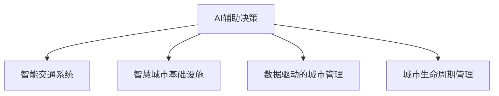

                 

# AI与人类计算：打造可持续发展的城市交通与基础设施建设规划

> 关键词：
1. AI辅助决策
2. 可持续交通规划
3. 智能城市基础设施
4. 数据驱动城市管理
5. 城市生命周期管理
6. 智慧交通系统
7. 大数据分析

## 1. 背景介绍

### 1.1 问题由来
随着全球城镇化的加速，城市规模的不断扩大和人口密度的急剧上升，交通拥堵、环境污染、资源短缺等城市病问题日益突出。如何构建高效、绿色、可持续的城市交通与基础设施体系，成为了现代社会亟待解决的关键课题。

在此背景下，AI技术尤其是AI与人类计算的结合，为城市交通与基础设施建设规划提供了新的可能性。AI技术不仅可以大幅提升城市管理的智能化水平，还能有效预测和缓解城市病的发生，实现城市的高质量发展。

### 1.2 问题核心关键点
构建智能可持续的城市交通与基础设施建设，其核心关键点在于：

1. **数据驱动**：利用城市交通、环境、资源等各类数据，借助AI算法进行综合分析和智能决策。
2. **多学科融合**：将AI与城市规划、交通工程、环境科学等学科知识进行深度融合，形成跨学科的知识体系。
3. **协同设计**：在城市规划、建设、运营等全生命周期中，通过AI辅助设计实现各阶段协同优化。
4. **实时监控**：通过实时监控系统，利用AI技术实现对城市交通与基础设施状态的全天候、全方位监控。
5. **用户需求导向**：以用户需求为导向，通过AI技术优化城市交通与基础设施服务，提升居民生活质量。

这些关键点构成了AI与人类计算在城市交通与基础设施建设规划中的重要应用基础。

## 2. 核心概念与联系

### 2.1 核心概念概述

为更好地理解AI与人类计算在城市交通与基础设施建设规划中的应用，本节将介绍几个密切相关的核心概念：

- **AI辅助决策**：利用AI技术对城市交通与基础设施规划数据进行分析和建模，辅助城市决策者进行科学决策。
- **智能交通系统(ITS)**：通过AI技术优化交通信号控制、交通流预测、智能导航等功能，提升交通系统的运行效率和安全性。
- **智慧城市基础设施**：利用AI技术对城市道路、桥梁、水利、能源等基础设施进行智能化管理，提升基础设施的使用效率和维护水平。
- **数据驱动的城市管理**：通过收集、处理和分析城市各类数据，利用AI技术进行科学决策，提升城市管理的精细化水平。
- **城市生命周期管理**：利用AI技术对城市生命周期各阶段进行全过程监控和管理，确保城市建设与运行的整体协调性。

这些核心概念之间的逻辑关系可以通过以下Mermaid流程图来展示：



这个流程图展示了一体化城市交通与基础设施建设中各关键概念之间的关联关系：

1. **AI辅助决策**：作为核心，贯穿于智能交通系统、智慧城市基础设施、数据驱动的城市管理及城市生命周期管理各个环节，是实现智能、可持续城市建设的引擎。
2. **智能交通系统**：利用AI技术对交通信号、流量、导航等进行优化，提升交通运行效率和安全性。
3. **智慧城市基础设施**：通过AI技术对城市道路、桥梁、水利、能源等设施进行智能化管理，提高设施的使用效率和维护水平。
4. **数据驱动的城市管理**：以城市各类数据为基础，利用AI技术进行综合分析，辅助科学决策，提升城市管理的精细化水平。
5. **城市生命周期管理**：通过AI技术对城市建设与运营全过程进行管理，确保城市生命周期各阶段的高效协调。

## 3. 核心算法原理 & 具体操作步骤
### 3.1 算法原理概述

AI与人类计算在城市交通与基础设施建设规划中的应用，本质上是一个数据驱动的优化和决策过程。其核心算法原理主要包括以下几个方面：

1. **数据集成与预处理**：将来自不同来源的城市交通、环境、资源等数据进行集成，并进行清洗、处理和归一化，为后续分析提供高质量的数据基础。
2. **数据建模与分析**：利用AI技术对城市数据进行建模和分析，识别出城市交通与基础设施运行中的关键特征和潜在问题。
3. **预测与模拟**：通过AI算法对城市交通流量、环境污染、资源消耗等进行预测和模拟，为决策提供科学依据。
4. **优化与决策**：基于预测结果和城市需求，利用AI技术进行多目标优化和决策，形成合理的城市交通与基础设施规划方案。
5. **实时监控与反馈**：建立实时监控系统，利用AI技术对城市交通与基础设施状态进行全天候监控，并根据反馈调整规划方案。

### 3.2 算法步骤详解

AI与人类计算在城市交通与基础设施建设规划中的具体操作步骤，主要包括以下几个步骤：

1. **数据集成与预处理**
   - 收集来自交通部门、环境监测部门、城市建设部门等不同来源的城市数据。
   - 对数据进行清洗、去重、处理缺失值等预处理操作。
   - 对数据进行归一化、标准化等操作，以确保数据的可比性和一致性。

2. **数据建模与分析**
   - 利用机器学习、深度学习等AI算法对城市数据进行建模。
   - 对城市交通流量、环境污染、资源消耗等关键指标进行分析和预测。
   - 识别出城市交通与基础设施运行中的瓶颈问题和改进空间。

3. **预测与模拟**
   - 利用时间序列分析、预测模型等对城市交通流量、环境污染等进行预测。
   - 通过仿真软件对城市交通与基础设施运行进行模拟，评估不同规划方案的效果。

4. **优化与决策**
   - 基于预测和模拟结果，利用多目标优化算法（如遗传算法、粒子群优化算法等）进行方案优化。
   - 综合考虑城市交通、环境、资源等多方面的需求，制定合理的规划方案。
   - 辅助决策者进行科学决策，形成可行的城市交通与基础设施建设规划。

5. **实时监控与反馈**
   - 建立实时监控系统，利用传感器、摄像头等设备对城市交通与基础设施状态进行全天候监控。
   - 利用AI技术对监控数据进行分析和处理，识别出异常情况和潜在问题。
   - 根据监控结果和反馈，动态调整规划方案，确保城市交通与基础设施运行的高效协调。

### 3.3 算法优缺点

AI与人类计算在城市交通与基础设施建设规划中的应用，具有以下优点：

1. **高效准确**：利用AI技术对大量数据进行高效处理和分析，能够快速识别出城市交通与基础设施运行中的关键问题和改进空间。
2. **综合优化**：通过多目标优化算法，综合考虑城市交通、环境、资源等多方面需求，制定出合理的规划方案。
3. **实时监控**：利用实时监控系统，对城市交通与基础设施运行状态进行全天候监控，确保城市运行的高效和稳定。
4. **数据驱动**：以城市各类数据为基础，利用AI技术进行科学决策，提升城市管理的精细化水平。

然而，AI与人类计算在城市交通与基础设施建设规划中，也存在以下局限性：

1. **数据质量依赖**：算法的性能和结果依赖于数据的质量，数据不完整、不准确等问题会影响分析结果。
2. **模型复杂度**：构建和训练复杂的AI模型需要较高的计算资源和技术门槛，成本较高。
3. **模型解释性不足**：部分AI算法如深度学习模型的内部机制难以解释，决策过程缺乏透明性。
4. **技术依赖性强**：AI技术的运用需要依赖专业人才和专业工具，技术依赖性强。
5. **社会影响复杂**：城市交通与基础设施的规划和建设对社会影响深远，AI算法的决策结果需要综合考虑社会因素。

尽管存在这些局限性，AI与人类计算在城市交通与基础设施建设规划中的应用，仍展现出巨大的潜力和前景。

### 3.4 算法应用领域

AI与人类计算在城市交通与基础设施建设规划中的应用，主要包括以下几个领域：

1. **智能交通系统**：利用AI技术对交通信号控制、交通流预测、智能导航等进行优化，提升交通系统的运行效率和安全性。
2. **智慧城市基础设施**：通过AI技术对城市道路、桥梁、水利、能源等设施进行智能化管理，提高设施的使用效率和维护水平。
3. **数据驱动的城市管理**：以城市各类数据为基础，利用AI技术进行综合分析，辅助科学决策，提升城市管理的精细化水平。
4. **城市生命周期管理**：通过AI技术对城市建设与运营全过程进行管理，确保城市生命周期各阶段的高效协调。
5. **城市公共服务优化**：利用AI技术对城市公共交通、医疗、教育等公共服务进行优化，提升居民生活质量。

这些应用领域覆盖了城市交通与基础设施建设的各个方面，为构建智能、可持续的城市交通体系提供了有力支持。

## 4. 数学模型和公式 & 详细讲解  
### 4.1 数学模型构建

为更好地理解AI与人类计算在城市交通与基础设施建设规划中的应用，本节将使用数学语言对相关模型进行系统构建。

假设城市交通数据为 $D_t=\{x_1, x_2, ..., x_n\}$，其中 $x_i$ 为城市某道路在第 $t$ 天的交通流量数据。模型目标是对交通流量进行预测，预测模型为 $y=f(x;\theta)$，其中 $y$ 为预测的交通流量，$x$ 为输入的交通数据，$\theta$ 为模型参数。

定义模型 $y=f(x;\theta)$ 在训练集 $D$ 上的经验风险为：

$$
\mathcal{L}(\theta) = \frac{1}{N}\sum_{i=1}^N (y_i - f(x_i;\theta))^2
$$

其中 $y_i$ 为第 $i$ 天的真实交通流量数据，$f(x_i;\theta)$ 为模型在输入 $x_i$ 下的预测流量。

模型的优化目标是 minimize $L(\theta)$，即最小化经验风险。在实践中，一般使用基于梯度的优化算法（如SGD、Adam等）来近似求解上述最优化问题。

设学习率为 $\eta$，则参数的更新公式为：

$$
\theta \leftarrow \theta - \eta \nabla_{\theta}\mathcal{L}(\theta)
$$

其中 $\nabla_{\theta}\mathcal{L}(\theta)$ 为损失函数对参数 $\theta$ 的梯度，可通过反向传播算法高效计算。

### 4.2 公式推导过程

以下我们以线性回归模型为例，推导交通流量预测的数学模型和梯度公式。

假设模型 $f(x;\theta)=\theta_0 + \theta_1 x_1 + \theta_2 x_2 + ... + \theta_k x_k$，其中 $k$ 为特征维度，$\theta_0, \theta_1, ..., \theta_k$ 为模型参数。

定义预测误差为 $e_i=y_i - f(x_i;\theta)$，则平均平方误差损失函数为：

$$
\mathcal{L}(\theta) = \frac{1}{N}\sum_{i=1}^N e_i^2
$$

对 $L(\theta)$ 求导，得：

$$
\frac{\partial \mathcal{L}(\theta)}{\partial \theta} = \frac{2}{N} \sum_{i=1}^N e_i \nabla_{\theta}f(x_i;\theta)
$$

其中 $\nabla_{\theta}f(x_i;\theta)$ 为模型在输入 $x_i$ 下的梯度，可以通过链式法则递归展开计算。

在得到损失函数的梯度后，即可带入参数更新公式，完成模型的迭代优化。重复上述过程直至收敛，最终得到适应城市交通流量预测的最优模型参数 $\theta^*$。

## 5. 项目实践：代码实例和详细解释说明
### 5.1 开发环境搭建

在进行城市交通与基础设施建设规划的AI与人类计算实践前，我们需要准备好开发环境。以下是使用Python进行Scikit-learn和TensorFlow开发的环境配置流程：

1. 安装Anaconda：从官网下载并安装Anaconda，用于创建独立的Python环境。

2. 创建并激活虚拟环境：
```bash
conda create -n urban-planning python=3.8 
conda activate urban-planning
```

3. 安装Scikit-learn：
```bash
conda install scikit-learn
```

4. 安装TensorFlow：根据CUDA版本，从官网获取对应的安装命令。例如：
```bash
conda install tensorflow -c tf -c conda-forge
```

5. 安装各类工具包：
```bash
pip install numpy pandas scikit-learn matplotlib tqdm jupyter notebook ipython
```

完成上述步骤后，即可在`urban-planning`环境中开始实践。

### 5.2 源代码详细实现

这里我们以城市交通流量预测为例，给出使用Scikit-learn和TensorFlow进行交通流量预测的Python代码实现。

首先，定义数据处理函数：

```python
import pandas as pd
import numpy as np
from sklearn.model_selection import train_test_split

def load_data(file_path):
    data = pd.read_csv(file_path)
    features = data[['weather', 'temperature', 'humidity', 'wind']]
    target = data['traffic']
    return features, target

features, target = load_data('traffic_data.csv')
```

然后，定义模型训练函数：

```python
from sklearn.linear_model import LinearRegression
from sklearn.metrics import mean_squared_error

X_train, X_test, y_train, y_test = train_test_split(features, target, test_size=0.2, random_state=42)

model = LinearRegression()
model.fit(X_train, y_train)

y_pred = model.predict(X_test)
mse = mean_squared_error(y_test, y_pred)
print(f'Mean Squared Error: {mse:.3f}')
```

接着，定义模型评估函数：

```python
def evaluate_model(model, X_test, y_test):
    y_pred = model.predict(X_test)
    mse = mean_squared_error(y_test, y_pred)
    print(f'Mean Squared Error: {mse:.3f}')
    mae = mean_absolute_error(y_test, y_pred)
    print(f'Mean Absolute Error: {mae:.3f}')

evaluate_model(model, X_test, y_test)
```

最后，进行模型训练和评估：

```python
X_train, X_test, y_train, y_test = train_test_split(features, target, test_size=0.2, random_state=42)

model = LinearRegression()
model.fit(X_train, y_train)

y_pred = model.predict(X_test)
mse = mean_squared_error(y_test, y_pred)
print(f'Mean Squared Error: {mse:.3f}')

evaluate_model(model, X_test, y_test)
```

以上就是使用Scikit-learn和TensorFlow进行城市交通流量预测的完整代码实现。可以看到，得益于Scikit-learn和TensorFlow的强大封装，我们可以用相对简洁的代码完成模型训练和评估。

### 5.3 代码解读与分析

让我们再详细解读一下关键代码的实现细节：

**load_data函数**：
- 从CSV文件中加载交通流量数据，将特征数据和目标数据分别存入`features`和`target`变量。

**train_test_split函数**：
- 使用Scikit-learn的`train_test_split`函数将数据集划分为训练集和测试集，其中训练集占80%，测试集占20%。

**LinearRegression模型**：
- 利用Scikit-learn的`LinearRegression`模型进行线性回归训练。

**mean_squared_error和mean_absolute_error函数**：
- 使用Scikit-learn的`mean_squared_error`和`mean_absolute_error`函数计算模型的均方误差和平均绝对误差，用于评估模型性能。

**evaluate_model函数**：
- 定义评估函数，计算模型在测试集上的均方误差和平均绝对误差，输出评估结果。

**训练和评估流程**：
- 定义训练集和测试集，使用`LinearRegression`模型对训练集进行训练。
- 使用`predict`函数对测试集进行预测，并计算模型的均方误差和平均绝对误差。
- 调用`evaluate_model`函数对模型性能进行评估。

可以看到，Scikit-learn和TensorFlow为城市交通与基础设施建设规划的AI实践提供了便捷的实现方式，开发者可以快速迭代模型，进行高效的训练和评估。

当然，实际系统实现还需考虑更多因素，如模型的保存和部署、超参数的自动搜索、多模型集成等，但核心的AI计算过程基本与此类似。

## 6. 实际应用场景
### 6.1 智能交通系统

智能交通系统（ITS）是AI与人类计算在城市交通与基础设施建设规划中的重要应用之一。通过AI技术对交通信号控制、交通流预测、智能导航等进行优化，提升交通系统的运行效率和安全性。

在技术实现上，可以利用AI技术对交通数据进行实时分析和处理，优化交通信号灯的控制策略。例如，利用深度学习模型对交通流量进行预测，动态调整信号灯的绿灯时长，实现交通流量的平衡和优化。同时，利用AI技术对路况进行实时监控，预测交通拥堵点，提前进行交通管制，避免拥堵的发生。

### 6.2 智慧城市基础设施

智慧城市基础设施的管理也是AI与人类计算的重要应用领域。通过AI技术对城市道路、桥梁、水利、能源等设施进行智能化管理，提升设施的使用效率和维护水平。

在实践中，可以利用AI技术对城市基础设施的状态进行实时监控，识别出潜在的安全隐患和维护需求。例如，利用计算机视觉技术对城市道路的损坏情况进行识别，及时进行修复。利用深度学习模型对水利设施的运行状态进行监控，预测可能的故障点，提前进行维护。同时，利用AI技术优化能源管理，实现智能电网的运行优化和节能减排。

### 6.3 数据驱动的城市管理

数据驱动的城市管理是AI与人类计算在城市交通与基础设施建设规划中的核心应用之一。通过收集和处理城市各类数据，利用AI技术进行综合分析，辅助科学决策，提升城市管理的精细化水平。

在实践中，可以利用AI技术对城市交通、环境、资源等数据进行综合分析，识别出城市运行中的关键问题和改进空间。例如，利用机器学习模型对城市交通流量进行预测，识别出交通拥堵的潜在因素，制定相应的交通管理策略。利用深度学习模型对城市环境污染进行监测，识别出污染源和治理方案，提升环境治理效果。同时，利用AI技术对城市资源进行优化配置，实现能源、水资源的高效利用。

### 6.4 未来应用展望

展望未来，AI与人类计算在城市交通与基础设施建设规划中的应用将呈现以下几个发展趋势：

1. **多模态数据融合**：未来的智能城市将充分利用多模态数据，如交通流量数据、环境监测数据、传感器数据等，实现更全面、更精细的城市管理。
2. **深度学习与强化学习结合**：利用深度学习和强化学习技术，提升交通流预测和交通信号控制的精确度，优化城市交通系统。
3. **实时感知与智能决策**：通过实时感知技术，对城市交通与基础设施状态进行全天候监控，利用智能决策算法，实现城市管理的高效化和智能化。
4. **跨部门协同治理**：利用AI技术实现不同部门之间的协同治理，提升城市管理的整体协调性。
5. **用户需求导向**：利用AI技术分析用户需求，实现城市交通与基础设施服务的个性化和定制化。

这些趋势凸显了AI与人类计算在城市交通与基础设施建设规划中的巨大潜力。未来的城市交通与基础设施建设规划，将更加智能、高效、绿色，为人类社会的可持续发展提供有力支持。

## 7. 工具和资源推荐
### 7.1 学习资源推荐

为了帮助开发者系统掌握AI与人类计算在城市交通与基础设施建设规划中的应用，这里推荐一些优质的学习资源：

1. **《城市交通与基础设施建设规划》系列博文**：由城市规划专家撰写，深入浅出地介绍了城市交通与基础设施建设规划的各类知识和前沿技术。

2. **《智慧城市基础设施管理》课程**：由城市建设部门开设的线上课程，涵盖智慧城市基础设施管理的各个方面，包括AI技术的应用。

3. **《智能交通系统》书籍**：介绍智能交通系统的基本原理和实际应用案例，适合初学者和从业人员学习。

4. **《数据驱动的城市管理》课程**：介绍城市数据收集、处理和分析的基本方法和技术，涵盖城市交通、环境、资源等多个方面。

5. **《城市生命周期管理》书籍**：全面介绍城市建设与运营全过程的管理方法，包括AI技术的应用。

通过对这些资源的学习实践，相信你一定能够快速掌握AI与人类计算在城市交通与基础设施建设规划中的应用，并用于解决实际的NLP问题。

### 7.2 开发工具推荐

高效的开发离不开优秀的工具支持。以下是几款用于城市交通与基础设施建设规划AI实践的常用工具：

1. Scikit-learn：基于Python的机器学习库，提供了丰富的算法和工具，适合快速原型开发和模型训练。
2. TensorFlow：由Google主导开发的深度学习框架，支持多模态数据融合和复杂模型构建，适合大规模工程应用。
3. Jupyter Notebook：交互式开发环境，支持Python、R等多种语言，适合快速迭代和协作开发。
4. Kaggle：数据科学竞赛平台，提供了大量城市交通与基础设施数据集和AI模型，适合数据科学学习和竞赛。
5. Visual Studio Code：轻量级开发工具，支持代码高亮、智能提示、调试等功能，适合Python和TensorFlow开发。

合理利用这些工具，可以显著提升城市交通与基础设施建设规划的AI实践效率，加快创新迭代的步伐。

### 7.3 相关论文推荐

AI与人类计算在城市交通与基础设施建设规划中的研究源于学界的持续研究。以下是几篇奠基性的相关论文，推荐阅读：

1. **《基于机器学习的智能交通系统研究》**：介绍机器学习在交通信号控制、交通流预测、智能导航等中的应用。
2. **《智慧城市基础设施管理技术》**：综述智慧城市基础设施管理的技术进展，包括AI技术的应用。
3. **《数据驱动的城市管理：理论与实践》**：介绍城市数据收集、处理和分析的基本方法和技术，涵盖城市交通、环境、资源等多个方面。
4. **《城市生命周期管理：理论、方法与实践》**：全面介绍城市建设与运营全过程的管理方法，包括AI技术的应用。
5. **《智能交通系统的未来发展趋势》**：探讨智能交通系统的未来发展方向，包括AI技术的应用。

这些论文代表了大语言模型微调技术的发展脉络。通过学习这些前沿成果，可以帮助研究者把握学科前进方向，激发更多的创新灵感。

## 8. 总结：未来发展趋势与挑战
### 8.1 总结

本文对AI与人类计算在城市交通与基础设施建设规划中的应用进行了全面系统的介绍。首先阐述了AI与人类计算在城市交通与基础设施建设规划中的研究背景和意义，明确了AI辅助决策、智能交通系统、智慧城市基础设施、数据驱动的城市管理、城市生命周期管理等核心概念之间的内在联系。其次，从原理到实践，详细讲解了AI与人类计算的数学模型构建、算法步骤详解、算法优缺点及应用领域。最后，结合实际应用场景，展望了AI与人类计算在城市交通与基础设施建设规划中的未来发展趋势和面临的挑战。

通过本文的系统梳理，可以看到，AI与人类计算在城市交通与基础设施建设规划中的应用前景广阔，为构建智能、可持续的城市交通体系提供了有力支持。面对未来的技术挑战，AI与人类计算将不断创新和优化，为城市交通与基础设施建设规划带来新的可能性。

### 8.2 未来发展趋势

展望未来，AI与人类计算在城市交通与基础设施建设规划中呈现以下几个发展趋势：

1. **多模态数据融合**：未来的智能城市将充分利用多模态数据，如交通流量数据、环境监测数据、传感器数据等，实现更全面、更精细的城市管理。
2. **深度学习与强化学习结合**：利用深度学习和强化学习技术，提升交通流预测和交通信号控制的精确度，优化城市交通系统。
3. **实时感知与智能决策**：通过实时感知技术，对城市交通与基础设施状态进行全天候监控，利用智能决策算法，实现城市管理的高效化和智能化。
4. **跨部门协同治理**：利用AI技术实现不同部门之间的协同治理，提升城市管理的整体协调性。
5. **用户需求导向**：利用AI技术分析用户需求，实现城市交通与基础设施服务的个性化和定制化。

这些趋势凸显了AI与人类计算在城市交通与基础设施建设规划中的巨大潜力。未来的城市交通与基础设施建设规划，将更加智能、高效、绿色，为人类社会的可持续发展提供有力支持。

### 8.3 面临的挑战

尽管AI与人类计算在城市交通与基础设施建设规划中已经取得了显著成效，但在迈向更加智能化、普适化应用的过程中，仍面临诸多挑战：

1. **数据质量问题**：数据的不完整、不准确等问题会影响算法的性能和结果，如何获取高质量的数据是一个重要的挑战。
2. **模型复杂度**：构建和训练复杂的AI模型需要较高的计算资源和技术门槛，成本较高。
3. **模型解释性不足**：部分AI算法如深度学习模型的内部机制难以解释，决策过程缺乏透明性。
4. **技术依赖性强**：AI技术的运用需要依赖专业人才和专业工具，技术依赖性强。
5. **社会影响复杂**：城市交通与基础设施的规划和建设对社会影响深远，AI算法的决策结果需要综合考虑社会因素。

尽管存在这些挑战，AI与人类计算在城市交通与基础设施建设规划中的应用，仍展现出巨大的潜力和前景。

### 8.4 研究展望

面对AI与人类计算在城市交通与基础设施建设规划中所面临的挑战，未来的研究需要在以下几个方面寻求新的突破：

1. **数据质量提升**：构建高质量的城市数据收集和处理机制，确保数据的完整性和准确性。
2. **模型优化与解释**：开发更高效、可解释的AI算法，提升模型的透明性和可信度。
3. **跨学科融合**：加强城市规划、交通工程、环境科学等学科的交叉融合，形成更加全面、系统的知识体系。
4. **社会影响评估**：在算法设计中引入社会伦理和安全评估机制，确保算法的公正性和安全性。
5. **用户需求导向**：利用AI技术分析用户需求，实现城市交通与基础设施服务的个性化和定制化。

这些研究方向的探索，必将引领AI与人类计算在城市交通与基础设施建设规划中迈向更高的台阶，为构建安全、可靠、可解释、可控的智能系统铺平道路。面向未来，AI与人类计算技术还需要与其他人工智能技术进行更深入的融合，如知识表示、因果推理、强化学习等，多路径协同发力，共同推动城市交通与基础设施建设规划的进步。只有勇于创新、敢于突破，才能不断拓展城市交通与基础设施的边界，让智能技术更好地造福人类社会。

## 9. 附录：常见问题与解答

**Q1：AI与人类计算在城市交通与基础设施建设规划中的核心关键点是什么？**

A: AI与人类计算在城市交通与基础设施建设规划中的核心关键点包括：

1. **数据驱动**：利用城市交通、环境、资源等各类数据，借助AI算法进行综合分析和智能决策。
2. **多学科融合**：将AI与城市规划、交通工程、环境科学等学科知识进行深度融合，形成跨学科的知识体系。
3. **协同设计**：在城市规划、建设、运营等全生命周期中，通过AI辅助设计实现各阶段协同优化。
4. **实时监控**：通过实时监控系统，利用AI技术实现对城市交通与基础设施状态的全天候、全方位监控。
5. **用户需求导向**：以用户需求为导向，通过AI技术优化城市交通与基础设施服务，提升居民生活质量。

这些关键点构成了AI与人类计算在城市交通与基础设施建设规划中的重要应用基础。

**Q2：AI与人类计算在城市交通与基础设施建设规划中如何实现多模态数据融合？**

A: 实现多模态数据融合，可以采用以下步骤：

1. **数据集成**：将来自不同来源的城市数据（如交通流量数据、环境监测数据、传感器数据等）进行集成，形成统一的数据集。
2. **数据清洗与预处理**：对数据进行清洗、去重、处理缺失值等预处理操作，确保数据的完整性和准确性。
3. **特征工程**：对多模态数据进行特征提取和融合，形成更具代表性和综合性的特征向量。
4. **模型训练与评估**：利用多模态数据训练AI模型，并进行评估和优化，确保模型的性能和泛化能力。
5. **实时感知与反馈**：建立实时感知系统，利用AI技术对多模态数据进行实时监控和反馈，确保数据的时效性和准确性。

通过以上步骤，可以实现多模态数据的全面融合和高效利用，提升城市交通与基础设施管理的智能化水平。

**Q3：AI与人类计算在城市交通与基础设施建设规划中如何优化模型性能？**

A: 优化AI与人类计算模型性能的方法包括：

1. **数据质量提升**：构建高质量的城市数据收集和处理机制，确保数据的完整性和准确性。
2. **模型优化与解释**：开发更高效、可解释的AI算法，提升模型的透明性和可信度。
3. **跨学科融合**：加强城市规划、交通工程、环境科学等学科的交叉融合，形成更加全面、系统的知识体系。
4. **社会影响评估**：在算法设计中引入社会伦理和安全评估机制，确保算法的公正性和安全性。
5. **用户需求导向**：利用AI技术分析用户需求，实现城市交通与基础设施服务的个性化和定制化。

通过以上方法，可以有效提升AI与人类计算在城市交通与基础设施建设规划中的应用效果，为构建智能、可持续的城市交通体系提供有力支持。

**Q4：AI与人类计算在城市交通与基础设施建设规划中如何应对数据质量问题？**

A: 应对数据质量问题的方法包括：

1. **数据清洗与预处理**：对数据进行清洗、去重、处理缺失值等预处理操作，确保数据的完整性和准确性。
2. **数据集成与融合**：将来自不同来源的城市数据进行集成和融合，形成统一的数据集，提升数据的多样性和代表性。
3. **异常值检测与处理**：利用异常值检测算法识别并处理数据中的异常值，确保数据的可信度。
4. **数据可视化与分析**：利用数据可视化工具对数据进行分析和可视化，识别出数据中的异常和问题，并进行相应的处理。
5. **模型评估与优化**：利用AI模型对数据进行评估和优化，确保模型的性能和泛化能力，提升数据质量。

通过以上方法，可以有效应对数据质量问题，确保AI与人类计算在城市交通与基础设施建设规划中的高效和可靠应用。

**Q5：AI与人类计算在城市交通与基础设施建设规划中如何提高模型解释性？**

A: 提高AI与人类计算模型解释性的方法包括：

1. **可解释性模型选择**：选择具有良好可解释性的AI模型，如决策树、线性回归等，避免使用复杂的深度学习模型。
2. **特征重要性分析**：利用特征重要性分析算法，识别出模型中对结果影响较大的特征，提高模型的透明度。
3. **模型可视化与解释**：利用模型可视化工具对模型进行可视化，理解模型的内部机制和决策过程，提高模型的可解释性。
4. **规则与约束引入**：在模型设计中引入规则和约束，确保模型的决策过程符合逻辑和常识，提高模型的透明性和可信度。
5. **用户反馈与改进**：利用用户反馈对模型进行改进和优化，确保模型的决策过程符合用户需求和期望，提高模型的可解释性。

通过以上方法，可以有效提高AI与人类计算在城市交通与基础设施建设规划中的模型解释性，提升模型的透明性和可信度。

**Q6：AI与人类计算在城市交通与基础设施建设规划中如何应对社会影响复杂性？**

A: 应对社会影响复杂性的方法包括：

1. **伦理与法律框架**：建立AI伦理与法律框架，确保AI算法的公正性和安全性。
2. **社会影响评估**：在算法设计中引入社会影响评估机制，评估算法的决策过程和结果，确保算法符合社会伦理和法律要求。
3. **跨学科合作**：加强跨学科合作，结合社会学、伦理学、法律学等学科知识，确保AI算法的决策过程符合社会伦理和法律要求。
4. **用户参与与反馈**：利用用户参与和反馈机制，评估算法的社会影响，及时调整和优化算法，确保算法符合用户需求和社会期望。
5. **透明性与可解释性**：提高算法的透明性和可解释性，确保用户和社会能够理解和监督算法的决策过程，提升算法的可信度和公信力。

通过以上方法，可以有效应对AI与人类计算在城市交通与基础设施建设规划中的社会影响复杂性，确保算法的公正性和安全性。

---

作者：禅与计算机程序设计艺术 / Zen and the Art of Computer Programming

