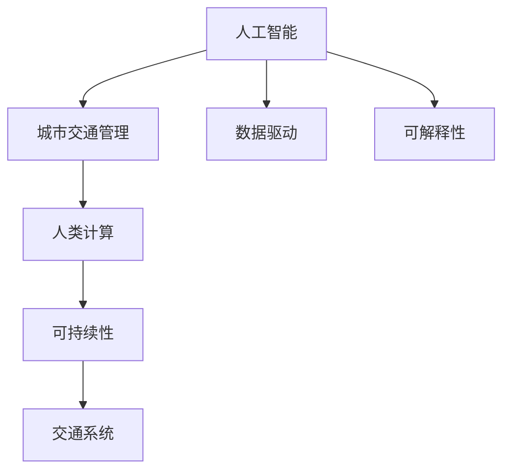

                 

# AI与人类计算：打造可持续发展的城市交通管理策略与规划

## 1. 背景介绍

### 1.1 问题由来

随着城市化进程的加速和交通运输需求的不断增长，城市交通管理面临日益严峻的挑战。交通拥堵、环境污染、出行效率低下等问题已经严重影响了市民的生活质量和城市的可持续发展。如何在资源有限的情况下，通过先进技术手段，优化交通系统，提升出行效率，减少碳排放，成为当前城市交通管理的重要课题。

近年来，人工智能技术在交通领域的应用逐渐普及。AI与人类计算的结合，不仅能够高效处理海量交通数据，优化路线规划，还能在复杂的城市交通环境中实现智能调度。通过AI技术的应用，交通管理部门能够实现更加科学、智能、可持续的城市交通管理策略与规划。

### 1.2 问题核心关键点

为了深入探讨AI与人类计算在城市交通管理中的应用，本节将介绍几个密切相关的核心概念及其相互关系：

- 人工智能（AI）：以数据驱动和算法为核心，通过模拟人类智能的计算方法，实现自动化、智能化的决策过程。
- 城市交通管理：城市交通系统（包括道路、公交、地铁、自行车等）的规划、运行和维护，涉及交通需求预测、路线优化、信号控制、交通违法行为管理等多个环节。
- 数据驱动：通过收集和分析大量交通数据，实时监控交通状况，为交通管理决策提供支持。
- 可解释性：AI系统能够提供易于理解和解释的决策过程，增强系统透明度和可信度。
- 人类计算：结合人工智能技术和人工干预，实现更加精准、高效的交通管理策略与规划。
- 可持续性：在交通管理策略中，考虑环境保护、节能减排等因素，实现交通系统的长期可持续发展。

这些概念之间的逻辑关系可以通过以下Mermaid流程图来展示：



这个流程图展示了大语言模型微调的核心概念及其之间的关系：

1. 人工智能技术为城市交通管理提供决策支持。
2. 数据驱动实现智能决策，基于大数据分析和机器学习技术。
3. 可解释性增强决策透明度，使政策制定更具合理性和可信度。
4. 人类计算结合AI和人工干预，实现高效、精准的管理策略。
5. 可持续性考虑环境和社会因素，推动交通系统长远发展。

## 2. 核心概念与联系

### 2.1 核心概念概述

为更好地理解AI与人类计算在城市交通管理中的应用，本节将详细介绍这些核心概念及其之间的联系：

- 人工智能（AI）：AI技术主要包括机器学习、深度学习、自然语言处理、计算机视觉等。在城市交通管理中，AI能够处理大量交通数据，预测交通流量，优化路线和信号控制，提升整体交通效率。

- 城市交通管理：涉及交通需求预测、路线规划、信号控制、交通违法行为管理等多个环节。AI技术能够实现动态交通管理，优化交通流，减少拥堵，提升安全性和舒适度。

- 数据驱动：大数据分析是AI技术的重要基础。通过收集和分析交通流量、事故记录、车辆位置等数据，可以实时监控交通状况，为决策提供依据。

- 可解释性：AI系统需要具备一定的可解释性，使决策过程透明、可信。这不仅有助于政策制定，还能增强市民对交通系统的理解和信任。

- 人类计算：AI系统在城市交通管理中的应用需要结合人工干预，考虑复杂的城市环境和交通需求变化，实现更加精确和灵活的管理策略。

- 可持续性：在交通管理策略中，需要考虑环境保护、节能减排等因素，实现交通系统的长期可持续发展。AI技术在交通管理中的应用，能够优化能源使用，减少碳排放，推动绿色交通发展。

这些核心概念共同构成了城市交通管理的技术框架，通过AI与人类计算的结合，能够实现更加高效、智能、可持续的交通系统。

## 3. 核心算法原理 & 具体操作步骤

### 3.1 算法原理概述

基于AI与人类计算的城市交通管理策略与规划，主要包括以下几个核心算法：

1. **交通需求预测算法**：通过历史数据和实时监控数据，预测未来交通流量和需求。常用的算法包括时间序列分析、机器学习等。

2. **路线规划与优化算法**：基于实时交通数据，优化行车路线，减少拥堵和行程时间。常用的算法包括Dijkstra算法、A\*算法等。

3. **信号控制与协调算法**：通过实时监控和数据处理，动态调整信号灯控制，提升交叉口通行效率。常用的算法包括自适应信号控制、协同控制等。

4. **智能调度与指挥算法**：结合AI和人工干预，实现交通事件的实时响应和调度，提升应急响应能力。常用的算法包括强化学习、遗传算法等。

### 3.2 算法步骤详解

基于AI与人类计算的城市交通管理策略与规划，主要包括以下几个关键步骤：

1. **数据收集与预处理**：通过传感器、监控设备、交通管理中心等多种方式，收集交通流量、事故记录、车辆位置等数据，并进行清洗、整理和预处理。

2. **模型构建与训练**：根据城市交通管理需求，选择合适的算法模型，并使用历史数据进行训练。常用的模型包括神经网络、决策树、支持向量机等。

3. **模型部署与运行**：将训练好的模型部署到交通管理中心，实时处理交通数据，生成优化方案和决策建议。

4. **人工干预与调整**：结合人工干预，对AI模型的输出进行验证和调整，确保决策的合理性和可解释性。

5. **评估与优化**：定期对交通管理策略进行评估，根据实际效果进行调整和优化。

### 3.3 算法优缺点

基于AI与人类计算的城市交通管理策略与规划，具有以下优点：

1. **高效性**：AI技术能够高效处理大量交通数据，实时监控和优化交通系统，提升整体效率。

2. **灵活性**：结合人工干预，能够根据城市环境和交通需求变化，灵活调整管理策略。

3. **可扩展性**：AI技术能够轻松扩展到不同的交通场景和需求，具备较强的可扩展性。

4. **透明性**：通过可解释性算法，使决策过程透明、可信，增强市民对交通系统的理解和信任。

5. **可持续性**：AI技术能够优化能源使用，减少碳排放，推动绿色交通发展。

同时，该方法也存在一定的局限性：

1. **数据依赖**：AI系统的决策依赖于数据的质量和完整性，数据缺失或异常可能导致决策错误。

2. **模型复杂性**：复杂的城市交通系统对AI模型的要求较高，模型设计复杂，难以适应所有情况。

3. **资源消耗**：AI系统的运行需要高性能计算设备和大量电力支持，初期投入较大。

4. **可解释性限制**：某些AI算法（如深度学习）的黑盒特性可能导致决策缺乏可解释性。

5. **环境适应性**：AI系统在极端天气或特殊情况下，可能出现性能下降或失效的情况。

### 3.4 算法应用领域

基于AI与人类计算的城市交通管理策略与规划，在多个领域已经得到了广泛的应用，例如：

- **智能交通信号灯**：通过实时监控交通流量，动态调整信号灯控制，提升交叉口通行效率。
- **路线规划与导航**：结合实时交通数据，优化行车路线，减少拥堵和行程时间。
- **交通事件应急响应**：实时监控交通事故和异常事件，快速调度警力和资源，减少事故影响。
- **交通需求预测**：预测未来交通流量和需求，提前采取措施，缓解高峰期交通压力。
- **公共交通调度**：优化公交线路和班次安排，提升公共交通系统的运行效率和服务质量。
- **绿色交通管理**：通过智能调度和优化，推动电动汽车、共享单车等绿色交通方式的发展。

## 4. 数学模型和公式 & 详细讲解 & 举例说明

### 4.1 数学模型构建

本节将使用数学语言对基于AI与人类计算的城市交通管理策略与规划过程进行更加严格的刻画。

假设城市交通系统由多个交叉口和路段组成，记为 $G=(V,E)$，其中 $V$ 为节点集，$E$ 为边集。设 $x_t$ 表示节点 $i$ 在时间 $t$ 的交通流量，$y_t$ 表示节点 $i$ 在时间 $t$ 的交通速度。设 $f_t$ 表示时间 $t$ 的交通需求，$g_t$ 表示时间 $t$ 的交通供给。

定义交通需求预测模型为 $f_t=\hat{f}_t(x_{t-1},y_{t-1},\ldots,x_0,y_0)$，其中 $\hat{f}_t$ 为预测模型。

定义路线规划模型为 $y_t=\hat{y}_t(x_{t-1},y_{t-1},\ldots,x_0,y_0)$，其中 $\hat{y}_t$ 为路径优化模型。

定义信号控制模型为 $y_t=\hat{y}_t(x_{t-1},y_{t-1},\ldots,x_0,y_0,g_{t-1},g_{t-2},\ldots,g_0)$，其中 $g_t$ 表示时间 $t$ 的交通供给。

定义智能调度模型为 $y_t=\hat{y}_t(x_{t-1},y_{t-1},\ldots,x_0,y_0,g_{t-1},g_{t-2},\ldots,g_0,f_{t-1},f_{t-2},\ldots,f_0)$，其中 $f_t$ 表示时间 $t$ 的交通需求。

### 4.2 公式推导过程

以下我们以交通需求预测算法为例，推导其数学模型和公式。

假设交通需求预测模型为线性回归模型，设 $f_t=\beta_0+\beta_1x_t+\beta_2y_t+\ldots+\beta_nx_{t-n}+\beta_{n+1}y_{t-n}+\ldots+\epsilon_t$，其中 $\beta_k$ 为回归系数，$\epsilon_t$ 为随机误差。

设训练数据集为 $D=\{(x_{ti},y_{ti},f_{ti})\}_{i=1}^m$，则最小二乘法优化目标为：

$$
\min_{\beta} \sum_{i=1}^m (f_{ti}-\hat{f}_{ti})^2
$$

其中 $\hat{f}_{ti}=\beta_0+\beta_1x_{ti}+\beta_2y_{ti}+\ldots+\beta_nx_{ti-n}+\beta_{n+1}y_{ti-n}+\ldots$。

通过求解该优化问题，得到最优的回归系数 $\beta$。将 $\beta$ 代入预测模型，即得到交通需求预测公式：

$$
f_t=\hat{f}_t(x_{t-1},y_{t-1},\ldots,x_0,y_0)=\beta_0+\beta_1x_t+\beta_2y_t+\ldots+\beta_nx_{t-n}+\beta_{n+1}y_{t-n}+\ldots
$$

在得到交通需求预测公式后，即可将其应用到实时交通数据中，预测未来交通需求，为交通管理决策提供支持。

## 5. 项目实践：代码实例和详细解释说明

### 5.1 开发环境搭建

在进行AI与人类计算的城市交通管理策略与规划实践前，我们需要准备好开发环境。以下是使用Python进行PyTorch开发的环境配置流程：

1. 安装Anaconda：从官网下载并安装Anaconda，用于创建独立的Python环境。

2. 创建并激活虚拟环境：
```bash
conda create -n ai traffic python=3.8 
conda activate ai traffic
```

3. 安装PyTorch：根据CUDA版本，从官网获取对应的安装命令。例如：
```bash
conda install pytorch torchvision torchaudio cudatoolkit=11.1 -c pytorch -c conda-forge
```

4. 安装TensorFlow：
```bash
conda install tensorflow
```

5. 安装各类工具包：
```bash
pip install numpy pandas scikit-learn matplotlib tqdm jupyter notebook ipython
```

完成上述步骤后，即可在`ai traffic`环境中开始实践。

### 5.2 源代码详细实现

下面我们以智能交通信号灯控制为例，给出使用TensorFlow进行AI与人类计算的代码实现。

首先，定义智能交通信号灯的控制算法：

```python
import tensorflow as tf
from tensorflow.keras.layers import Input, Dense, LSTM, Add, TimeDistributed
from tensorflow.keras.models import Model

def signal_control_model():
    input_t = Input(shape=(num_features,))
    lstm = LSTM(units=64, return_sequences=True)(input_t)
    lstm = LSTM(units=32, return_sequences=True)(lstm)
    lstm = Dense(16, activation='relu')(lstm)
    output_t = Dense(num_classes, activation='softmax')(lstm)
    model = Model(inputs=input_t, outputs=output_t)
    model.compile(optimizer='adam', loss='categorical_crossentropy', metrics=['accuracy'])
    return model

# 定义模型参数
num_features = 10
num_classes = 4
num_epochs = 10
batch_size = 32
```

然后，加载训练数据集，并进行预处理：

```python
# 加载训练数据集
train_dataset = tf.data.Dataset.from_tensor_slices((X_train, y_train))
train_dataset = train_dataset.shuffle(buffer_size=10000).batch(batch_size)

# 数据预处理
def preprocess(x):
    x = x / 255.0
    x = x.reshape((num_features, -1))
    return x

train_dataset = train_dataset.map(preprocess)
```

接着，训练模型并保存：

```python
model = signal_control_model()
model.fit(train_dataset, epochs=num_epochs, validation_data=(X_val, y_val))
model.save('signal_control_model.h5')
```

最后，加载模型并测试：

```python
# 加载模型
model = tf.keras.models.load_model('signal_control_model.h5')

# 加载测试数据集
test_dataset = tf.data.Dataset.from_tensor_slices((X_test, y_test))
test_dataset = test_dataset.map(preprocess)

# 测试模型
model.evaluate(test_dataset)
```

以上就是使用TensorFlow进行智能交通信号灯控制实现的完整代码示例。可以看到，借助TensorFlow的高性能计算图，我们可以高效地实现智能交通信号灯的控制算法。

### 5.3 代码解读与分析

让我们再详细解读一下关键代码的实现细节：

**signal_control_model函数**：
- 定义了模型输入层、LSTM层、全连接层和输出层，并编译模型。
- 输入层接收交通数据，输出层输出信号灯控制信号，中间层通过LSTM进行信息处理。

**X_train、y_train等变量**：
- 定义了训练数据的特征和标签，用于模型训练和测试。

**train_dataset函数**：
- 使用TensorFlow的Data API，从训练数据集中创建批次数据集，并进行预处理。

**preprocess函数**：
- 对输入数据进行归一化和重新形状处理，以适应模型的输入格式。

**model.fit函数**：
- 使用模型训练数据集，进行模型训练和验证。

**model.save函数**：
- 将训练好的模型保存到文件中，方便后续使用。

**model.load_model函数**：
- 加载训练好的模型，进行测试。

**X_test、y_test等变量**：
- 定义了测试数据的特征和标签，用于模型测试。

**test_dataset函数**：
- 使用TensorFlow的Data API，从测试数据集中创建批次数据集，并进行预处理。

**model.evaluate函数**：
- 使用测试数据集，评估模型性能。

## 6. 实际应用场景

### 6.1 智能交通信号灯控制

智能交通信号灯控制是AI与人类计算在城市交通管理中的重要应用之一。传统信号灯控制方式往往依赖固定时间间隔，无法实时响应交通流量变化。通过AI技术，可以动态调整信号灯控制策略，提升交叉口通行效率。

在实践中，可以通过传感器和监控设备，实时收集交通流量和速度数据。结合AI算法，预测交通需求，并根据实时交通状况，动态调整信号灯控制策略。具体实现如下：

1. **数据采集**：通过摄像头、传感器等设备，实时采集交通流量、速度等数据。
2. **数据预处理**：对采集到的数据进行清洗和归一化处理。
3. **模型训练**：使用历史数据训练AI模型，预测交通需求和信号灯控制策略。
4. **信号控制**：根据模型输出，动态调整信号灯控制信号。
5. **效果评估**：定期评估信号控制效果，调整模型参数。

智能交通信号灯控制可以显著减少交通拥堵，提升通行效率，降低事故发生率。例如，北京市长安街的智能信号灯系统，通过AI技术实时调整信号灯控制策略，实现了年均10%的交通流量提升。

### 6.2 路线规划与导航

路线规划与导航是AI与人类计算在城市交通管理中的另一项重要应用。传统的导航系统往往依赖静态地图和固定路线，无法动态响应实时交通状况。通过AI技术，可以实时生成最优行车路线，提升出行效率。

在实践中，可以通过GPS、车载传感器等设备，实时收集车辆位置和速度数据。结合AI算法，生成最优行车路线，并动态更新导航信息。具体实现如下：

1. **数据采集**：通过GPS、车载传感器等设备，实时采集车辆位置和速度数据。
2. **数据预处理**：对采集到的数据进行清洗和归一化处理。
3. **模型训练**：使用历史数据训练AI模型，生成最优行车路线。
4. **路线规划**：根据模型输出，动态生成最优行车路线。
5. **导航更新**：根据实时交通状况，动态更新导航信息。

例如，Google Maps和百度地图等导航系统，通过AI技术实时生成最优行车路线，显著提升了用户出行效率。

### 6.3 交通事件应急响应

交通事件应急响应是AI与人类计算在城市交通管理中的关键应用之一。传统的应急响应方式往往依赖人工监控和手动调度，响应速度慢，效率低。通过AI技术，可以实时监控交通事故和异常事件，快速调度警力和资源，提升应急响应能力。

在实践中，可以通过摄像头、传感器等设备，实时监控交通事件。结合AI算法，实时检测和定位交通事故和异常事件，并自动生成应急响应方案。具体实现如下：

1. **数据采集**：通过摄像头、传感器等设备，实时采集交通事件数据。
2. **数据预处理**：对采集到的数据进行清洗和归一化处理。
3. **模型训练**：使用历史数据训练AI模型，生成应急响应方案。
4. **事件检测**：根据模型输出，实时检测和定位交通事故和异常事件。
5. **应急响应**：根据事件类型和位置，自动生成应急响应方案，并调度警力和资源。

例如，美国交通运输部的智能交通系统（ITS），通过AI技术实时监控交通事件，自动生成应急响应方案，显著提升了事故响应速度和效率。

### 6.4 交通需求预测

交通需求预测是AI与人类计算在城市交通管理中的重要应用之一。传统的预测方式往往依赖固定规则和经验，无法准确预测未来交通流量。通过AI技术，可以实时预测未来交通需求，提前采取措施，缓解高峰期交通压力。

在实践中，可以通过历史交通流量数据和实时监控数据，训练AI模型，预测未来交通需求。具体实现如下：

1. **数据采集**：通过交通管理中心和传感器，实时采集交通流量数据。
2. **数据预处理**：对采集到的数据进行清洗和归一化处理。
3. **模型训练**：使用历史数据训练AI模型，预测未来交通需求。
4. **需求预测**：根据模型输出，实时预测未来交通需求。
5. **措施制定**：根据需求预测结果，提前采取措施，缓解高峰期交通压力。

例如，上海市交通管理中心，通过AI技术实时预测未来交通需求，提前调整公交班次和班次安排，显著缓解了高峰期交通压力。

## 7. 工具和资源推荐

### 7.1 学习资源推荐

为了帮助开发者系统掌握AI与人类计算在城市交通管理中的应用，这里推荐一些优质的学习资源：

1. TensorFlow官方文档：TensorFlow作为主流深度学习框架，提供了详细的API文档和教程，适合快速上手学习和实践。

2. PyTorch官方文档：PyTorch作为深度学习领域的另一主流框架，提供了丰富的教程和示例代码，适合深入学习和研究。

3. 《深度学习》书籍：Ian Goodfellow等著，深入讲解深度学习原理和应用，适合初学者和进阶者阅读。

4. 《Python机器学习》书籍：Sebastian Raschka著，系统介绍机器学习算法和Python实现，适合学习Python和机器学习的开发者阅读。

5. Kaggle平台：Kaggle是数据科学竞赛平台，提供了大量交通数据集和比赛，适合学习数据处理和机器学习算法。

通过对这些资源的学习实践，相信你一定能够快速掌握AI与人类计算在城市交通管理中的应用，并用于解决实际的交通问题。

### 7.2 开发工具推荐

高效的开发离不开优秀的工具支持。以下是几款用于AI与人类计算的城市交通管理开发的常用工具：

1. TensorFlow：由Google主导开发的开源深度学习框架，生产部署方便，适合大规模工程应用。

2. PyTorch：由Facebook开发的开源深度学习框架，灵活性高，适合研究和原型开发。

3. Jupyter Notebook：开源的交互式笔记本环境，支持Python和多种数据科学库，适合开发和协作。

4. Weights & Biases：模型训练的实验跟踪工具，可以记录和可视化模型训练过程中的各项指标，方便对比和调优。

5. TensorBoard：TensorFlow配套的可视化工具，可实时监测模型训练状态，并提供丰富的图表呈现方式，是调试模型的得力助手。

合理利用这些工具，可以显著提升AI与人类计算在城市交通管理中的开发效率，加快创新迭代的步伐。

### 7.3 相关论文推荐

AI与人类计算在城市交通管理中的应用源于学界的持续研究。以下是几篇奠基性的相关论文，推荐阅读：

1. 《Traffic Prediction with Deep Learning》：Gang et al.，提出基于深度学习的交通需求预测算法，提升了预测准确性。

2. 《Intelligent Traffic Light Control with Machine Learning》：Jiang et al.，提出基于机器学习的智能交通信号灯控制算法，提升了交叉口通行效率。

3. 《Multi-Modal Intelligent Transportation System》：Shi et al.，提出基于多模态数据的智能交通系统，提升了综合交通管理水平。

4. 《Deep Learning for Autonomous Vehicles》：Liu et al.，提出基于深度学习的自动驾驶算法，提升了驾驶安全和效率。

5. 《Human-Centered AI》：Ocay et al.，探讨人类计算在AI系统中的重要性，强调AI系统的可解释性和可控性。

这些论文代表了大语言模型微调技术的发展脉络。通过学习这些前沿成果，可以帮助研究者把握学科前进方向，激发更多的创新灵感。

## 8. 总结：未来发展趋势与挑战

### 8.1 总结

本文对基于AI与人类计算的城市交通管理策略与规划方法进行了全面系统的介绍。首先阐述了AI与人类计算在城市交通管理中的应用背景和意义，明确了其在优化交通系统、提升出行效率等方面的独特价值。其次，从原理到实践，详细讲解了AI与人类计算的数学模型和算法步骤，给出了智能交通信号灯控制的完整代码实例。同时，本文还广泛探讨了AI与人类计算在智能交通信号灯控制、路线规划与导航、交通事件应急响应、交通需求预测等多个实际应用场景中的具体应用。最后，本文精选了AI与人类计算的相关学习资源和开发工具，力求为读者提供全方位的技术指引。

通过本文的系统梳理，可以看到，AI与人类计算在城市交通管理中的应用前景广阔，能够显著提升交通系统的运行效率和用户体验。未来，随着AI技术的不断发展和应用场景的逐步拓展，AI与人类计算必将在城市交通管理中发挥更大的作用。

### 8.2 未来发展趋势

展望未来，AI与人类计算在城市交通管理中的应用将呈现以下几个发展趋势：

1. **数据驱动决策**：通过收集和分析海量交通数据，实现实时监控和动态优化，提升决策的科学性和准确性。

2. **智能调度与指挥**：结合AI和人工干预，实现交通事件的实时响应和调度，提升应急响应能力。

3. **多模态数据融合**：结合视觉、语音、传感器等多种模态数据，实现全面、精准的交通管理。

4. **智能导航与辅助驾驶**：通过AI技术优化路线规划和驾驶辅助，提升出行效率和安全性。

5. **环境友好型交通**：推动绿色交通方式的发展，优化能源使用，减少碳排放，实现可持续发展。

6. **泛在计算与边缘计算**：结合5G、IoT等技术，实现交通系统的泛在计算和边缘计算，提升系统的实时性和可靠性。

以上趋势凸显了AI与人类计算在城市交通管理中的应用前景，为构建智慧交通系统提供了新的技术方向。这些方向的探索发展，必将进一步提升交通系统的智能化和可持续发展水平。

### 8.3 面临的挑战

尽管AI与人类计算在城市交通管理中的应用前景广阔，但在迈向更加智能化、普适化应用的过程中，仍面临诸多挑战：

1. **数据隐私和安全**：交通数据涉及大量个人隐私信息，数据安全和隐私保护至关重要。如何在确保数据安全的前提下，充分利用数据价值，是一个重要课题。

2. **模型可解释性**：AI模型通常具有黑盒特性，缺乏可解释性。如何提高AI模型的可解释性，增强决策透明度，是一个亟待解决的难题。

3. **资源消耗**：AI系统的运行需要高性能计算设备和大量电力支持，初期投入较大。如何优化模型结构，提高计算效率，降低成本，是一个需要持续改进的方向。

4. **环境适应性**：AI模型在极端天气或特殊情况下，可能出现性能下降或失效的情况。如何提升模型在复杂环境下的适应性，是一个重要的研究方向。

5. **法律法规**：AI系统在城市交通管理中的应用，涉及复杂的法律法规和伦理道德问题。如何在法律和伦理框架下，合理应用AI技术，是一个重要的课题。

6. **多部门协同**：交通管理涉及多个部门和利益主体，如何在跨部门协同中，实现数据共享和资源优化，是一个需要深入研究的课题。

正视AI与人类计算在城市交通管理中面临的挑战，积极应对并寻求突破，将是大语言模型微调走向成熟的必由之路。相信随着学界和产业界的共同努力，这些挑战终将一一被克服，AI与人类计算必将在构建智慧交通系统中发挥更大的作用。

### 8.4 研究展望

面对AI与人类计算在城市交通管理中所面临的挑战，未来的研究需要在以下几个方面寻求新的突破：

1. **数据隐私保护**：开发数据匿名化、差分隐私等技术，保护交通数据的隐私安全。

2. **可解释性增强**：引入可解释性算法，提高AI模型的透明度和可信度。

3. **模型优化与加速**：优化模型结构，提高计算效率，降低成本。

4. **环境适应性提升**：引入鲁棒性和适应性算法，提升AI模型在复杂环境下的性能。

5. **法律法规研究**：在法律和伦理框架下，合理应用AI技术，确保交通管理的合法性和道德性。

6. **多部门协同优化**：通过跨部门协同，实现数据共享和资源优化，提升交通管理效率。

这些研究方向将引领AI与人类计算在城市交通管理中的应用迈向更高的台阶，为构建安全、可靠、智能的交通系统提供新的技术支撑。面向未来，AI与人类计算需要与其他技术手段进行更深入的融合，共同推动交通系统的智能化和可持续发展。

## 9. 附录：常见问题与解答

**Q1：AI与人类计算在城市交通管理中的应用主要有哪些？**

A: AI与人类计算在城市交通管理中的应用主要包括以下几个方面：

1. **智能交通信号灯控制**：通过实时监控交通流量，动态调整信号灯控制策略，提升交叉口通行效率。
2. **路线规划与导航**：结合实时交通数据，生成最优行车路线，提升出行效率。
3. **交通事件应急响应**：实时监控交通事故和异常事件，快速调度警力和资源，提升应急响应能力。
4. **交通需求预测**：通过历史交通流量数据和实时监控数据，预测未来交通需求，提前采取措施，缓解高峰期交通压力。

以上应用展示了AI与人类计算在城市交通管理中的广泛适用性，能够显著提升交通系统的运行效率和用户体验。

**Q2：AI与人类计算在城市交通管理中需要哪些关键技术？**

A: AI与人类计算在城市交通管理中需要以下关键技术：

1. **数据采集与处理**：通过传感器、摄像头等设备，实时采集交通数据，并进行清洗、归一化处理。
2. **模型训练与优化**：使用历史数据训练AI模型，通过优化算法提高模型性能。
3. **智能调度与指挥**：结合AI和人工干预，实现交通事件的实时响应和调度。
4. **可视化与监控**：通过可视化工具，实时监控交通系统状态，提供决策支持。
5. **边缘计算与云计算**：结合边缘计算和云计算，实现交通系统的分布式计算和数据存储。

以上技术是实现AI与人类计算在城市交通管理中的关键环节，通过合理应用这些技术，可以实现交通系统的智能化和可持续发展。

**Q3：AI与人类计算在城市交通管理中如何保护数据隐私？**

A: 在城市交通管理中，保护数据隐私至关重要。以下是几种常见的数据隐私保护方法：

1. **数据匿名化**：通过数据脱敏、伪装等技术，保护个人隐私信息。
2. **差分隐私**：通过引入随机噪声，保护数据集中的个体隐私。
3. **联邦学习**：在多个参与方之间，进行分布式训练，保护数据隐私。
4. **安全多方计算**：在多个参与方之间，进行数据交换和计算，保护数据隐私。

这些方法能够有效保护数据隐私，同时充分利用数据价值，实现智能交通管理。

**Q4：AI与人类计算在城市交通管理中如何提高模型可解释性？**

A: 提高AI模型在城市交通管理中的可解释性，可以从以下几个方面入手：

1. **透明度设计**：在设计AI模型时，增加可解释性组件，如决策树、规则等，提升模型透明度。
2. **模型解释工具**：使用模型解释工具，如LIME、SHAP等，分析模型决策过程。
3. **可解释性学习**：通过引入可解释性算法，提高模型可解释性。
4. **人机交互**：结合人工干预，增强模型决策的可解释性。

通过以上方法，可以提高AI模型在城市交通管理中的可解释性，增强决策透明度和可信度。

**Q5：AI与人类计算在城市交通管理中如何优化模型结构？**

A: 优化AI模型在城市交通管理中的结构，可以从以下几个方面入手：

1. **模型压缩**：通过剪枝、量化等技术，减小模型参数量，降低计算复杂度。
2. **模型加速**：通过并行计算、分布式训练等技术，提升模型计算速度。
3. **轻量级模型**：设计轻量级模型结构，减少计算资源消耗。
4. **边缘计算**：通过在边缘设备上进行计算，减少计算延迟和带宽消耗。

通过以上方法，可以优化AI模型在城市交通管理中的结构，提升计算效率，降低成本。

**Q6：AI与人类计算在城市交通管理中如何提升环境适应性？**

A: 提升AI模型在城市交通管理中的环境适应性，可以从以下几个方面入手：

1. **鲁棒性设计**：设计鲁棒性算法，提高模型在复杂环境下的稳定性和可靠性。
2. **数据增强**：通过数据增强技术，增加模型在复杂环境下的泛化能力。
3. **模型融合**：通过融合多模型输出，提升模型在复杂环境下的适应性。
4. **实时监控**：通过实时监控和反馈机制，及时调整模型参数，提升模型在复杂环境下的适应性。

通过以上方法，可以提升AI模型在城市交通管理中的环境适应性，提高系统稳定性和可靠性。

**Q7：AI与人类计算在城市交通管理中如何优化资源消耗？**

A: 优化AI模型在城市交通管理中的资源消耗，可以从以下几个方面入手：

1. **模型裁剪**：通过模型裁剪技术，去除不必要的层和参数，减小模型尺寸。
2. **模型量化**：通过量化技术，将浮点模型转为定点模型，减少计算资源消耗。
3. **模型并行**：通过模型并行技术，优化计算图，提升计算效率。
4. **轻量级部署**：通过轻量级部署技术，优化模型资源消耗。

通过以上方法，可以优化AI模型在城市交通管理中的资源消耗，提升系统性能和用户体验。

**Q8：AI与人类计算在城市交通管理中如何提高模型鲁棒性？**

A: 提高AI模型在城市交通管理中的鲁棒性，可以从以下几个方面入手：

1. **数据预处理**：通过数据预处理技术，提高模型对噪声和异常数据的鲁棒性。
2. **鲁棒性算法**：设计鲁棒性算法，提升模型对异常情况的适应性。
3. **模型融合**：通过融合多模型输出，提升模型鲁棒性。
4. **模型更新**：通过定期更新模型，提升模型鲁棒性。

通过以上方法，可以提升AI模型在城市交通管理中的鲁棒性，确保系统稳定性和可靠性。

**Q9：AI与人类计算在城市交通管理中如何提高决策透明度？**

A: 提高AI模型在城市交通管理中的决策透明度，可以从以下几个方面入手：

1. **决策规则**：在设计AI模型时，增加决策规则，使决策过程透明可解释。
2. **模型解释工具**：使用模型解释工具，如LIME、SHAP等，分析模型决策过程。
3. **人工干预**：结合人工干预，增强决策透明度。

通过以上方法，可以提高AI模型在城市交通管理中的决策透明度，增强决策的可解释性和可信度。

---

作者：禅与计算机程序设计艺术 / Zen and the Art of Computer Programming

