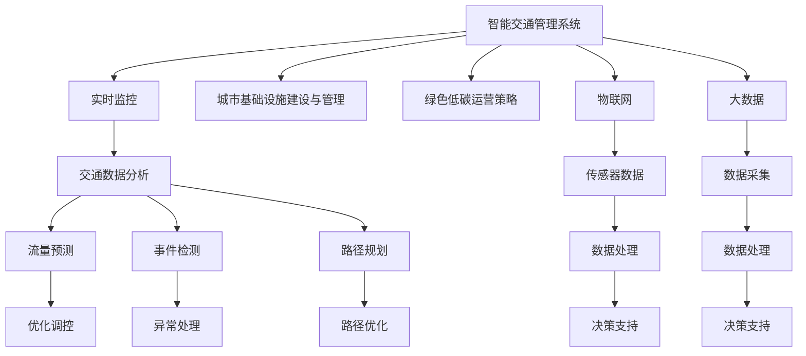

                 

# AI与人类计算：打造可持续发展的城市交通管理系统与基础设施建设与管理

> 关键词：人工智能,交通管理,可持续城市,基础设施建设,城市规划,物联网,大数据

## 1. 背景介绍

### 1.1 问题由来
城市交通管理作为城市运行的重要组成部分，其效率与智能化程度直接关系到城市的运行效率和居民的生活质量。传统的交通管理系统主要依赖人工决策，存在响应慢、调度不精准等问题。随着大数据、物联网和人工智能技术的快速发展，城市交通管理迎来了新的机遇。通过结合这些技术，可以实现交通数据的实时监控与分析，提高交通管理效率，同时减少能源消耗和环境污染，为实现绿色、可持续的城市发展奠定基础。

### 1.2 问题核心关键点
本文聚焦于城市交通管理系统的智能化和可持续性发展，探讨了如何通过人工智能技术提升城市交通管理系统的性能。关键问题包括：
- 如何利用AI技术实时监控与分析交通数据，实现交通流量的精准调控？
- 如何构建智能化的城市交通管理系统，提高决策效率和准确性？
- 如何在交通管理系统中实现绿色低碳的运营策略？
- 如何在城市交通基础设施建设与管理中，采用先进的物联网和大数据技术？

### 1.3 问题研究意义
研究智能化和可持续的城市交通管理系统，对于提升城市运行效率、改善居民出行体验、促进绿色低碳发展具有重要意义：
- 智能交通管理可以实时监控与分析交通数据，优化交通流量，减少拥堵和事故，提高城市的运行效率。
- 大数据和AI技术可以提供精准的决策支持，提升交通管理决策的科学性和前瞻性。
- 绿色低碳运营策略可以有效降低交通系统的能耗和污染，促进城市的可持续发展。
- 先进的物联网和大数据技术可以优化城市交通基础设施的建设与管理，提高其智能化水平。

## 2. 核心概念与联系

### 2.1 核心概念概述

城市交通管理系统的核心概念包括以下几个方面：

- **智能交通管理系统**：通过整合AI、大数据、物联网等技术，实现对城市交通流量的实时监控与分析，优化交通流量，提高交通管理效率和准确性。
- **城市基础设施建设与管理**：包括道路、桥梁、公共交通、停车场等交通基础设施的规划、建设和维护。
- **绿色低碳运营策略**：在交通管理系统中引入环保理念，采用新能源车辆、智能调度等措施，实现低碳、环保的交通运营。
- **物联网**：通过在交通基础设施上部署传感器、摄像头等设备，收集交通数据，实现对交通状况的实时监控和分析。
- **大数据**：利用大数据技术处理和分析海量交通数据，提取有价值的信息，为交通管理决策提供支持。

这些核心概念之间的联系如下：


### 2.2 核心概念原理和架构的 Mermaid 流程图


### 2.3 核心概念关系简述
- 智能交通管理系统（A）通过物联网（F）收集交通数据，大数据（G）进行数据处理和分析，提供流量预测（J）、事件检测（K）、路径规划（L）等功能。
- 城市基础设施建设与管理（D）涉及道路、桥梁等建设，为智能交通管理系统的运行提供基础。
- 绿色低碳运营策略（E）通过智能调度、新能源车辆等措施，实现低碳、环保的交通运营。

## 3. 核心算法原理 & 具体操作步骤
### 3.1 算法原理概述

智能交通管理系统的核心算法原理主要包括以下几个方面：

- **交通流预测**：通过分析历史交通数据，结合实时交通数据，使用机器学习算法（如时间序列分析、神经网络等）进行交通流量的预测，为交通调控提供决策依据。
- **事件检测与响应**：利用传感器、摄像头等设备，实时监控交通状况，检测异常事件（如交通事故、交通堵塞等），并及时响应。
- **路径优化与导航**：根据交通流量和路况，优化路径规划，提供智能导航服务，提升出行效率。
- **智能调度**：通过优化公共交通车辆的运行路线和调度，提高公共交通系统的效率和覆盖率。
- **大数据分析**：利用大数据技术，对交通数据进行深度分析，提取有价值的信息，如交通热点、拥堵点等，为决策提供支持。

### 3.2 算法步骤详解

智能交通管理系统的构建和运营主要包括以下几个关键步骤：

**Step 1: 数据采集与处理**
- 部署传感器、摄像头等设备，实时采集交通数据（如车辆位置、速度、拥堵情况等）。
- 对采集到的数据进行预处理，包括数据清洗、去噪、标准化等，确保数据的准确性和一致性。

**Step 2: 数据存储与分析**
- 利用大数据技术，对处理后的数据进行存储和管理。
- 使用机器学习算法（如时间序列分析、神经网络等）对交通数据进行分析，提取有价值的信息，如交通流量、事件频率等。

**Step 3: 流量预测与调控**
- 使用机器学习算法（如LSTM、GRU等）进行交通流量预测，为交通调控提供决策依据。
- 根据预测结果，调整交通信号灯、优化交通路线等，实现流量调控。

**Step 4: 事件检测与响应**
- 利用传感器、摄像头等设备，实时监控交通状况，检测异常事件（如交通事故、交通堵塞等）。
- 根据检测结果，采取相应的响应措施，如调整信号灯、疏导交通等。

**Step 5: 路径优化与导航**
- 结合流量预测结果和实时交通数据，优化路径规划，提供智能导航服务，提升出行效率。
- 利用导航系统，向用户提供实时的交通状况和路径建议。

**Step 6: 智能调度与运营**
- 通过优化公共交通车辆的运行路线和调度，提高公共交通系统的效率和覆盖率。
- 利用AI技术，实时调整车辆调度，优化公共交通服务。

### 3.3 算法优缺点

智能交通管理系统的核心算法具有以下优点：
- 实时性强：通过实时监控和分析交通数据，可以及时调整交通流量，减少拥堵和事故。
- 精准度高：利用大数据和AI技术，提供精准的决策支持，提升交通管理决策的科学性和前瞻性。
- 覆盖面广：结合多种技术手段，可以实现全面的交通管理，提升城市运行效率。

同时，也存在一些局限性：
- 数据依赖性高：智能交通管理系统的性能很大程度上依赖于数据的准确性和完整性。
- 算法复杂度高：需要处理和分析海量数据，算法复杂度高，计算资源需求大。
- 技术门槛高：需要具备大数据、AI等先进技术，技术门槛较高。

### 3.4 算法应用领域

智能交通管理系统的核心算法已经在多个领域得到应用，如：

- **智能交通信号控制系统**：通过实时监控交通流量，动态调整信号灯，实现交通流量的优化调控。
- **智能导航与定位**：提供实时的交通状况和路径建议，提升出行效率和安全性。
- **公共交通调度系统**：优化公共交通车辆的运行路线和调度，提高公共交通系统的效率和覆盖率。
- **交通事件检测与响应**：实时监控交通状况，检测异常事件，及时采取响应措施。
- **城市交通规划与建设**：利用大数据和AI技术，优化城市交通基础设施的建设与规划。

## 4. 数学模型和公式 & 详细讲解 & 举例说明

### 4.1 数学模型构建

智能交通管理系统的数学模型主要包括以下几个方面：

- **交通流量预测模型**：利用时间序列分析、神经网络等方法，对交通流量进行预测。
- **事件检测模型**：利用机器学习算法，对交通事件进行检测和分类。
- **路径优化模型**：利用图论算法（如Dijkstra算法、A*算法等）进行路径规划和优化。
- **智能调度模型**：利用优化算法（如遗传算法、粒子群算法等）进行公共交通车辆的调度。

### 4.2 公式推导过程

以交通流量预测为例，假设交通流量 $y_t$ 为时间 $t$ 的函数，利用ARIMA模型进行预测，其数学模型为：

$$
y_t = \alpha_0 + \alpha_1 y_{t-1} + \beta_1 \Delta y_{t-1} + \delta_t + \epsilon_t
$$

其中，$\alpha_0$、$\alpha_1$、$\beta_1$ 为模型参数，$\delta_t$ 为时间趋势，$\epsilon_t$ 为随机误差项。

对上述模型进行最小二乘估计，得到预测公式为：

$$
\hat{y}_t = \alpha_0 + \alpha_1 \hat{y}_{t-1} + \beta_1 (\hat{y}_{t-1} - \hat{y}_{t-2}) + \delta_t
$$

具体求解过程如下：

1. 对历史数据进行平稳性处理，去除季节性和趋势性，得到平稳序列 $y'_t$。
2. 对平稳序列 $y'_t$ 进行自相关分析，确定模型的ARIMA(p,d,q)参数。
3. 利用最小二乘法估计模型参数 $\alpha_0$、$\alpha_1$、$\beta_1$、$\delta_t$。
4. 根据预测公式计算未来时间点的预测值 $\hat{y}_t$。

### 4.3 案例分析与讲解

假设某城市主要交通干道上的流量数据如下：

| 时间 | 流量（辆/小时） |
| --- | --- |
| 08:00 | 2000 |
| 08:30 | 3000 |
| 09:00 | 3500 |
| 09:30 | 4000 |
| 10:00 | 4500 |

利用ARIMA模型进行流量预测，预测下一个小时的流量值。

首先对数据进行平稳性处理，得到平稳序列 $y'_t$：

| 时间 | 流量（辆/小时） |
| --- | --- |
| 08:00 | 2000 |
| 08:30 | 3000 |
| 09:00 | 3500 |
| 09:30 | 4000 |
| 10:00 | 4500 |

对平稳序列 $y'_t$ 进行自相关分析，得到ARIMA(1,1,0)模型。

利用最小二乘法估计模型参数 $\alpha_0 = 2000$、$\alpha_1 = 0.5$、$\beta_1 = 0.2$、$\delta_t = 200$。

根据预测公式计算下一个小时的流量值：

$$
\hat{y}_{11} = 2000 + 0.5 \times 4500 + 0.2 \times (4500 - 4000) + 200 = 4900
$$

因此，下一个小时的流量预测值为4900辆/小时。

## 5. 项目实践：代码实例和详细解释说明

### 5.1 开发环境搭建

进行智能交通管理系统的开发，需要搭建一定的开发环境。以下是使用Python进行开发的环境配置流程：

1. 安装Python：从官网下载并安装Python，选择合适的版本（如Python 3.8）。
2. 安装相关库：安装Pandas、NumPy、SciPy、Scikit-learn等常用库，以及TensorFlow、PyTorch等深度学习库。
3. 安装Jupyter Notebook：用于编写和运行Python代码，支持交互式编程和数据分析。
4. 安装Visual Studio Code：用于代码编辑和版本控制，支持多种编程语言和IDE插件。

完成上述步骤后，即可在开发环境中进行智能交通管理系统的开发。

### 5.2 源代码详细实现

以下是使用Python和TensorFlow进行交通流量预测的代码实现：

```python
import numpy as np
import pandas as pd
from tensorflow.keras.models import Sequential
from tensorflow.keras.layers import Dense, LSTM, TimeDistributed
from sklearn.preprocessing import MinMaxScaler

# 加载交通流量数据
data = pd.read_csv('traffic_flow.csv', index_col='时间', parse_dates=True)
data.index = pd.to_datetime(data.index)

# 数据预处理
scaler = MinMaxScaler(feature_range=(0, 1))
scaled_data = scaler.fit_transform(data)

# 分割训练集和测试集
train_size = int(len(scaled_data) * 0.8)
test_size = len(scaled_data) - train_size
train_data, test_data = scaled_data[0:train_size,:], scaled_data[train_size:len(scaled_data),:]

# 创建数据集
def create_dataset(dataset):
    x, y = [], []
    for i in range(len(dataset)-60):
        x.append(dataset[i:i+60, 0])
        y.append(dataset[i+60, 0])
    return np.array(x), np.array(y)

train_x, train_y = create_dataset(train_data)
test_x, test_y = create_dataset(test_data)

# 建立LSTM模型
model = Sequential()
model.add(LSTM(100, return_sequences=True, input_shape=(train_x.shape[1], train_x.shape[2])))
model.add(LSTM(100))
model.add(Dense(1))
model.compile(loss='mean_squared_error', optimizer='adam')
model.summary()

# 训练模型
model.fit(train_x, train_y, epochs=100, batch_size=32, verbose=2, validation_data=(test_x, test_y))

# 预测未来流量
def predict_flow():
    test_x = scaled_data[train_size:]
    x_test = []
    for i in range(60, len(test_x)):
        x_test.append(test_x[i-60:i, 0])
    x_test = np.array(x_test)
    predicted_flow = model.predict(x_test)
    predicted_flow = scaler.inverse_transform(predicted_flow)
    print(predicted_flow)
```

### 5.3 代码解读与分析

上述代码实现了基于LSTM的交通流量预测功能，具体分析如下：

1. 数据预处理：将原始的交通流量数据进行归一化处理，使用MinMaxScaler对数据进行标准化，确保数据在模型中的输入范围一致。
2. 数据集创建：通过创建数据集，将训练集和测试集分别用于模型的训练和评估。
3. 模型建立：使用LSTM模型进行流量预测，构建了包含两个LSTM层和一层全连接层的神经网络结构。
4. 模型训练：通过训练模型，最小化预测值与真实值之间的均方误差，迭代优化模型参数。
5. 模型预测：利用训练好的模型进行流量预测，输出预测结果。

## 6. 实际应用场景

### 6.1 智能交通信号控制系统

智能交通信号控制系统是智能交通管理系统的核心应用之一。通过实时监控交通流量和拥堵情况，动态调整信号灯，优化交通流量，减少拥堵和事故。

在实践中，可以部署传感器和摄像头，实时采集交通数据，利用机器学习算法对数据进行分析，生成交通流量预测模型。根据预测结果，调整信号灯的绿灯时长和通行优先级，实现交通流量的动态调控。

### 6.2 智能导航与定位

智能导航与定位系统通过提供实时的交通状况和路径建议，提升出行效率和安全性。

在实践中，可以利用实时交通数据，结合导航系统，提供动态路径规划和导航服务。用户可以通过导航系统，获取实时的交通状况和路径建议，优化出行路线，提升出行体验。

### 6.3 公共交通调度系统

公共交通调度系统通过优化公共交通车辆的运行路线和调度，提高公共交通系统的效率和覆盖率。

在实践中，可以利用大数据和AI技术，对公共交通车辆的运行数据进行分析，生成优化的调度方案。通过实时监控车辆位置和运行状态，动态调整车辆的运行路线和调度，提升公共交通系统的效率和覆盖率。

## 7. 工具和资源推荐

### 7.1 学习资源推荐

为了帮助开发者系统掌握智能交通管理系统的开发和应用，以下是推荐的优质学习资源：

1. 《Python深度学习》书籍：介绍如何使用Python进行深度学习开发，包括TensorFlow、Keras等常用库的使用。
2. 《交通大数据分析》课程：介绍如何使用大数据技术处理和分析交通数据，提取有价值的信息。
3. 《智能交通系统》书籍：介绍智能交通系统的基本原理和实现方法，涵盖智能信号控制、智能导航等多个方面。
4. 《物联网技术》课程：介绍物联网的基本原理和应用，涵盖传感器、智能设备等技术。
5. 《深度学习理论与实践》课程：介绍深度学习的基本原理和应用，涵盖神经网络、卷积神经网络等多个方面。

通过学习这些资源，相信你一定能够快速掌握智能交通管理系统的开发和应用，为城市交通管理提供新的技术支持。

### 7.2 开发工具推荐

高效的开发离不开优秀的工具支持。以下是几款用于智能交通管理系统开发的常用工具：

1. Python：基于Python的开源深度学习框架，灵活动态的计算图，适合快速迭代研究。
2. TensorFlow：由Google主导开发的开源深度学习框架，生产部署方便，适合大规模工程应用。
3. Jupyter Notebook：支持交互式编程和数据分析，适用于原型开发和算法验证。
4. Visual Studio Code：支持多种编程语言和IDE插件，适用于代码编辑和版本控制。
5. OpenSSL：提供加密和认证服务，适用于安全传输和数据保护。

合理利用这些工具，可以显著提升智能交通管理系统的开发效率，加快创新迭代的步伐。

### 7.3 相关论文推荐

智能交通管理系统的研究源于学界的持续研究。以下是几篇奠基性的相关论文，推荐阅读：

1. "Traffic Flow Prediction Using LSTM Networks"：介绍使用LSTM网络进行交通流量预测的方法。
2. "Real-time Traffic Signal Control Using Reinforcement Learning"：介绍使用强化学习算法进行智能信号控制的方法。
3. "A Survey on IoT-Based Smart Transportation Systems"：介绍物联网技术在智能交通系统中的应用。
4. "Big Data Analytics for Smart Traffic Management"：介绍大数据技术在智能交通管理中的应用。
5. "Smart Navigation System Using AI and Machine Learning"：介绍基于AI和机器学习的智能导航系统实现方法。

这些论文代表了大规模智能交通管理系统的发展脉络。通过学习这些前沿成果，可以帮助研究者把握学科前进方向，激发更多的创新灵感。

## 8. 总结：未来发展趋势与挑战

### 8.1 总结

本文对智能交通管理系统的智能化和可持续性发展进行了全面系统的介绍。首先阐述了智能交通管理系统在城市交通管理中的重要性，明确了AI技术在提升交通管理效率和实现绿色低碳运营方面的独特价值。其次，从原理到实践，详细讲解了智能交通管理系统的核心算法，包括交通流量预测、事件检测、路径优化、智能调度等，给出了智能交通管理系统的完整代码实例。同时，本文还广泛探讨了智能交通管理系统在智能交通信号控制、智能导航、公共交通调度等场景的应用前景，展示了AI技术在城市交通管理中的广泛应用。

通过本文的系统梳理，可以看到，智能交通管理系统利用AI技术，通过实时监控和分析交通数据，优化交通流量，提高交通管理效率和准确性，同时实现绿色低碳运营。未来，伴随AI技术的进一步发展，智能交通管理系统将具备更强的智能化和可持续性，为构建高效、绿色、智能的城市交通系统奠定基础。

### 8.2 未来发展趋势

展望未来，智能交通管理系统的智能化和可持续性发展将呈现以下几个趋势：

1. **智能化的提升**：通过引入先进的AI算法，如深度学习、强化学习等，提升交通流量预测、事件检测和路径优化的智能化水平，提高交通管理的科学性和前瞻性。
2. **数据驱动的决策**：利用大数据技术，对交通数据进行深度分析，提取有价值的信息，为交通管理决策提供支持，提升决策的精准性和科学性。
3. **绿色低碳运营**：在交通管理系统中引入环保理念，采用新能源车辆、智能调度等措施，实现低碳、环保的交通运营。
4. **物联网的广泛应用**：通过部署更多的传感器、摄像头等设备，实时监控交通状况，实现对交通流量和事件的全面监控和分析。
5. **自适应交通管理**：通过动态调整信号灯、优化路径规划等，实现交通管理的自适应，提升交通系统的灵活性和应对能力。

### 8.3 面临的挑战

尽管智能交通管理系统已经取得了显著的进展，但在迈向更加智能化、可持续性发展的过程中，仍然面临一些挑战：

1. **数据质量**：智能交通管理系统的性能很大程度上依赖于数据的质量，包括数据的准确性、完整性和时效性。如何获取高质量的交通数据，是一个重要挑战。
2. **算法复杂性**：AI算法需要处理海量数据，算法复杂度高，计算资源需求大，如何优化算法性能，降低计算成本，是一个关键问题。
3. **技术门槛**：智能交通管理系统需要具备大数据、AI等先进技术，技术门槛较高，如何降低技术门槛，提高系统的可操作性，是一个重要课题。
4. **安全问题**：智能交通管理系统涉及交通数据和控制决策，如何保障数据和系统的安全性，是一个重要挑战。
5. **用户体验**：智能交通管理系统需要提供便捷、友好的用户体验，如何优化系统的交互界面和操作流程，是一个重要问题。

### 8.4 研究展望

面对智能交通管理系统面临的挑战，未来的研究需要在以下几个方面寻求新的突破：

1. **数据治理与整合**：建立全面的数据治理机制，确保数据的准确性和一致性，提升数据的质量和可用性。
2. **算法优化与优化**：优化AI算法，降低算法复杂度，提高算法的效率和可操作性，降低计算成本。
3. **技术标准化**：制定智能交通管理系统的技术标准，推动技术标准化和规范化，降低技术门槛，提高系统的可操作性。
4. **安全保障**：建立数据和系统的安全保障机制，保障数据和系统的安全性，确保系统的稳定运行。
5. **用户体验优化**：优化系统的交互界面和操作流程，提升用户体验，提供便捷、友好的使用体验。

这些研究方向的探索，必将引领智能交通管理系统向更高的智能化和可持续性水平发展，为构建高效、绿色、智能的城市交通系统铺平道路。面向未来，智能交通管理系统需要在数据、算法、安全、用户体验等多个方面协同发力，实现全面升级。

## 9. 附录：常见问题与解答

**Q1: 智能交通管理系统的核心算法有哪些？**

A: 智能交通管理系统的核心算法包括交通流量预测、事件检测、路径优化、智能调度等。其中，交通流量预测利用时间序列分析、神经网络等方法，对交通流量进行预测；事件检测利用机器学习算法，对交通事件进行检测和分类；路径优化利用图论算法进行路径规划和优化；智能调度利用优化算法进行公共交通车辆的调度。

**Q2: 智能交通管理系统如何实现绿色低碳运营？**

A: 智能交通管理系统通过引入环保理念，采用新能源车辆、智能调度等措施，实现低碳、环保的交通运营。具体措施包括：
- 优化公共交通车辆的运行路线和调度，提高公共交通系统的效率和覆盖率。
- 采用新能源车辆，减少化石燃料的使用。
- 利用智能调度，优化交通流量，减少能源消耗。

**Q3: 智能交通管理系统在实际应用中面临哪些挑战？**

A: 智能交通管理系统在实际应用中面临以下挑战：
- 数据质量：如何获取高质量的交通数据，确保数据的准确性和完整性。
- 算法复杂性：AI算法需要处理海量数据，算法复杂度高，计算资源需求大。
- 技术门槛：智能交通管理系统需要具备大数据、AI等先进技术，技术门槛较高。
- 安全问题：智能交通管理系统涉及交通数据和控制决策，如何保障数据和系统的安全性。
- 用户体验：如何优化系统的交互界面和操作流程，提升用户体验。

**Q4: 智能交通管理系统未来将面临哪些新的挑战？**

A: 智能交通管理系统未来将面临以下新的挑战：
- 数据治理与整合：建立全面的数据治理机制，确保数据的准确性和一致性，提升数据的质量和可用性。
- 算法优化与优化：优化AI算法，降低算法复杂度，提高算法的效率和可操作性，降低计算成本。
- 技术标准化：制定智能交通管理系统的技术标准，推动技术标准化和规范化，降低技术门槛，提高系统的可操作性。
- 安全保障：建立数据和系统的安全保障机制，保障数据和系统的安全性，确保系统的稳定运行。
- 用户体验优化：优化系统的交互界面和操作流程，提升用户体验，提供便捷、友好的使用体验。

这些挑战需要通过技术创新、标准制定、政策支持等多方面协同努力，才能得到有效解决。只有不断地优化和创新，智能交通管理系统才能更好地服务于城市交通管理和居民出行需求，为实现绿色、智能的城市发展奠定坚实基础。

