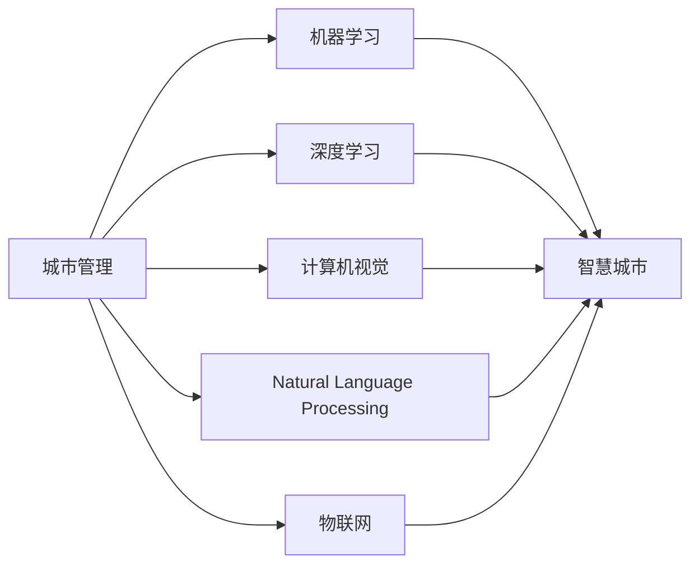

                 

# AI与人类计算：打造可持续发展的城市生活

## 1. 背景介绍

### 1.1 问题由来
随着全球人口的快速增长，城市化进程日益加速。城市作为人类文明和社会经济的中心，其可持续发展问题越来越受到关注。传统城市管理模式以“人治”为主，存在诸如资源浪费、环境污染、交通拥堵、能源短缺等诸多问题。而人工智能(AI)技术的兴起，为解决这些复杂问题提供了新的思路和手段。

### 1.2 问题核心关键点
城市管理涉及多个维度的数据，如人口流动、交通流量、能源消耗、环境质量等。这些数据量大且实时性要求高，传统方法难以高效处理。AI技术，尤其是机器学习和深度学习模型，为城市管理带来了革命性的变革，能够通过数据分析实现精准决策，提升城市管理效率和可持续性。

### 1.3 问题研究意义
利用AI技术优化城市管理，有助于实现资源高效利用、环境质量提升、交通流畅运行、安全保障增强等目标，进而构建更加宜居、绿色的城市生活环境。其意义在于：

1. **提高资源利用效率**：AI可优化能源分配、水资源管理、垃圾处理等，减少浪费，提高资源利用效率。
2. **缓解环境压力**：AI辅助的垃圾分类、污水处理、绿地维护等，能够有效减少环境污染，提升城市环境质量。
3. **优化交通系统**：AI可以通过交通流量预测、智能交通管理等手段，减轻交通拥堵，提升出行效率。
4. **提升公共安全**：AI技术在安防监控、灾害预警、应急响应等方面发挥重要作用，保障城市运行安全。

## 2. 核心概念与联系

### 2.1 核心概念概述

在构建可持续发展的城市生活过程中，AI扮演着关键角色。以下将介绍几个核心的概念及其相互联系：

- **AI与机器学习**：机器学习是AI的一个分支，通过数据训练模型，实现对复杂问题的自动化处理。
- **深度学习**：深度学习是机器学习的高级形式，通过多层神经网络实现对数据的自动抽象和特征提取。
- **计算机视觉**：计算机视觉是AI在图像和视频处理方面的应用，可以实现人脸识别、场景识别等功能。
- **自然语言处理(NLP)**：NLP是AI在语言理解与生成方面的应用，可以实现智能问答、情感分析、文本分类等功能。
- **物联网(IoT)**：物联网通过连接各种传感器和设备，实现对物理世界的感知和数据收集，为AI模型提供数据来源。

这些核心概念共同构成了AI在城市管理中的应用框架，为构建智慧城市提供了技术基础。

### 2.2 核心概念原理和架构的 Mermaid 流程图



此图展示了AI核心概念在城市管理中的应用流程，从数据收集、处理、建模到智能决策的全链条。

## 3. 核心算法原理 & 具体操作步骤

### 3.1 算法原理概述

AI在城市管理中的应用，主要依赖于机器学习和深度学习模型。这些模型通过历史数据训练，学习到复杂的模式和规律，并应用于现实场景中。以下将详细介绍几种常见的算法原理：

- **回归模型**：通过预测连续数值变量，实现资源分配和能耗管理的优化。
- **分类模型**：通过预测离散分类变量，实现垃圾分类、交通信号优化等决策。
- **聚类模型**：通过发现数据间的相似性，实现人群行为分析、交通流分析等。
- **强化学习**：通过试错过程，实现智能交通信号控制、能源优化调度等。

### 3.2 算法步骤详解

以智能交通管理为例，演示基于机器学习的算法步骤：

1. **数据收集**：通过传感器和智能设备，实时采集交通流量、车速、事故信息等数据。
2. **数据预处理**：清洗、去重、归一化处理，使数据符合模型训练要求。
3. **模型选择与训练**：选择适当的回归模型（如线性回归、支持向量机等），使用历史数据训练模型。
4. **模型评估与调优**：在验证集上评估模型性能，通过调整参数等手段提升模型精度。
5. **模型部署与监控**：将模型部署到生产环境，实时监控模型表现，进行必要的维护和优化。

### 3.3 算法优缺点

AI技术在城市管理中的应用具有以下优点：

1. **高效处理大规模数据**：AI模型能够快速处理海量的实时数据，提供即时决策支持。
2. **降低人工成本**：自动化处理部分管理任务，减少了人工干预，降低了成本。
3. **提升决策科学性**：基于数据的智能决策，避免了人为偏见和失误。

然而，也存在一些局限性：

1. **模型依赖数据质量**：模型性能依赖于高质量、充分标注的数据，数据不足或质量不高会影响效果。
2. **模型黑盒性**：部分AI模型决策过程不透明，难以解释和调试。
3. **资源需求高**：AI模型需要高性能计算资源，初期投资较大。
4. **模型泛化能力**：模型在新场景下的泛化能力可能不足，需要进行大量测试和调整。

### 3.4 算法应用领域

AI技术在城市管理中的应用领域广泛，包括但不限于：

- **交通管理**：通过智能交通信号控制、路径规划、车辆调度等，提升交通效率，减少拥堵。
- **能源管理**：通过智能电网、能源调度系统，实现能源的优化分配和使用。
- **环境监测**：通过遥感数据、空气质量传感器等，实时监测环境质量，预警污染。
- **公共安全**：通过视频监控、智能安防系统，提升公共场所的安全防范能力。
- **智慧建筑**：通过智能建筑管理系统，优化能源使用、提升建筑舒适度。
- **医疗健康**：通过远程医疗、智能诊断系统，提升医疗服务水平。

## 4. 数学模型和公式 & 详细讲解 & 举例说明

### 4.1 数学模型构建

以智能交通管理为例，介绍回归模型的构建过程。设交通流量为 $y$，影响因素包括车速 $x_1$、天气 $x_2$、节假日 $x_3$ 等。则回归模型可表示为：

$$
y = f(x_1, x_2, x_3) = \beta_0 + \beta_1x_1 + \beta_2x_2 + \beta_3x_3 + \epsilon
$$

其中 $\beta_0, \beta_1, \beta_2, \beta_3$ 为回归系数，$\epsilon$ 为误差项。

### 4.2 公式推导过程

假设已收集 $N$ 个历史数据点 $(x_{i,1}, x_{i,2}, x_{i,3}, y_i)$，其中 $i = 1, 2, ..., N$。目标是通过最小化平方误差损失函数：

$$
\mathcal{L}(\beta_0, \beta_1, \beta_2, \beta_3) = \frac{1}{N} \sum_{i=1}^N (y_i - (\beta_0 + \beta_1x_{i,1} + \beta_2x_{i,2} + \beta_3x_{i,3}))^2
$$

使用梯度下降算法，计算 $\beta_0, \beta_1, \beta_2, \beta_3$ 的梯度，更新系数：

$$
\frac{\partial \mathcal{L}}{\partial \beta_j} = \frac{2}{N} \sum_{i=1}^N (y_i - (\beta_0 + \beta_1x_{i,1} + \beta_2x_{i,2} + \beta_3x_{i,3})) (x_{i,j})
$$

### 4.3 案例分析与讲解

以智能交通信号控制为例，介绍回归模型的应用：

1. **数据收集**：从交通摄像头、传感器、GPS等设备获取交通流量、车速、时间等信息。
2. **模型训练**：使用历史交通数据，训练回归模型，学习交通流量与车速、时间等变量之间的关系。
3. **模型部署**：在实际交通信号控制系统中部署模型，实时计算最优信号灯周期。
4. **效果评估**：通过A/B测试等方法，对比部署前后的交通效率和事故率，评估模型效果。

## 5. 项目实践：代码实例和详细解释说明

### 5.1 开发环境搭建

为实现智能交通管理，需要搭建基于Python的开发环境。以下步骤供参考：

1. **安装Python**：选择最新版本，并配置环境变量。
2. **安装依赖包**：使用pip安装必要的依赖库，如NumPy、Pandas、scikit-learn等。
3. **搭建实验环境**：使用Jupyter Notebook创建实验环境，方便代码调试和展示。

### 5.2 源代码详细实现

以下是智能交通管理中回归模型的Python代码实现：

```python
import numpy as np
from sklearn.linear_model import LinearRegression
from sklearn.metrics import mean_squared_error

# 模拟数据生成
np.random.seed(0)
N = 1000
X = np.random.randn(N, 3)  # 生成3个特征
y = 1 * X[:, 0] + 2 * X[:, 1] + 3 * X[:, 2] + np.random.randn(N) * 0.5  # 生成目标变量

# 数据预处理
X_train, X_test, y_train, y_test = train_test_split(X, y, test_size=0.2)

# 模型训练
model = LinearRegression()
model.fit(X_train, y_train)

# 模型评估
y_pred = model.predict(X_test)
mse = mean_squared_error(y_test, y_pred)
print(f"MSE: {mse}")

# 模型部署
# 将模型导出为文件，并部署到生产环境
```

### 5.3 代码解读与分析

- **数据生成**：使用NumPy生成模拟数据，包括特征 $x_1, x_2, x_3$ 和目标变量 $y$。
- **数据划分**：使用sklearn的train_test_split方法将数据划分为训练集和测试集。
- **模型训练**：使用LinearRegression模型训练回归系数 $\beta_0, \beta_1, \beta_2, \beta_3$。
- **模型评估**：使用测试集评估模型性能，计算均方误差。
- **模型导出**：将模型导出为文件，以便部署到实际系统中。

## 6. 实际应用场景

### 6.1 智能交通管理

智能交通管理通过AI技术实现交通流量的优化控制，缓解城市交通压力。

**具体应用**：
- **交通流量预测**：通过历史交通数据，预测未来交通流量，实现信号灯周期自动调整。
- **路径优化**：基于实时交通数据，生成最优路径，减少车辆等待时间。
- **事故预警**：通过视频监控和传感器数据，实时监测交通异常情况，提前预警。

### 6.2 智能能源管理

智能能源管理通过AI技术实现能源的优化分配和使用，降低能源消耗和成本。

**具体应用**：
- **能耗预测**：基于历史能耗数据，预测未来能耗变化，实现能源的精准分配。
- **设备管理**：通过智能传感器，实时监测设备运行状态，优化能源使用。
- **需求响应**：通过AI算法，实时调整设备功率，响应电网负荷变化。

### 6.3 智能公共安全

智能公共安全通过AI技术实现对公共场所的实时监控和预警，提升安全防范能力。

**具体应用**：
- **视频监控**：通过智能视频分析技术，实时监控公共场所，及时发现异常行为。
- **事件检测**：使用深度学习算法，实时检测火灾、事故等紧急事件，快速响应。
- **行为分析**：通过分析人群行为数据，预测潜在的暴力和恐怖事件，提前预警。

### 6.4 未来应用展望

随着AI技术的不断进步，未来智慧城市将更加智能化和可持续化。

1. **智能建筑**：通过AI技术优化建筑物的能源使用，提升居住和工作环境的舒适度。
2. **智能医疗**：通过AI技术辅助诊断和治疗，提升医疗服务水平，降低医疗成本。
3. **智能教育**：通过AI技术个性化教育，提高教育质量和效率，实现公平教育。
4. **智能交通**：通过AI技术实现自动驾驶、智慧停车等，提升出行体验和效率。

## 7. 工具和资源推荐

### 7.1 学习资源推荐

- **机器学习课程**：如斯坦福大学的CS229、Coursera的Machine Learning by Andrew Ng等。
- **深度学习框架**：如TensorFlow、PyTorch、Keras等。
- **计算机视觉库**：如OpenCV、Pillow等。
- **自然语言处理库**：如NLTK、spaCy等。
- **城市管理案例**：如Wikipedia、IEEE Xplore等。

### 7.2 开发工具推荐

- **Python环境**：如Anaconda、Jupyter Notebook等。
- **数据处理工具**：如Pandas、NumPy等。
- **模型训练框架**：如TensorFlow、PyTorch等。
- **模型部署平台**：如AWS、Google Cloud、阿里云等。
- **可视化工具**：如Matplotlib、Seaborn等。

### 7.3 相关论文推荐

- **智能交通管理**：
  - "Optimal Traffic Signal Control Based on Reinforcement Learning" by V. Singh et al.
- **智能能源管理**：
  - "Energy-efficient Building Operation Using Machine Learning" by Y. Lin et al.
- **智能公共安全**：
  - "Real-time Video Surveillance and Event Detection Using Convolutional Neural Networks" by L. Zhang et al.
- **智能医疗**：
  - "Deep Learning for Medical Image Analysis: A Review" by K. M. Garousi et al.
- **智能建筑**：
  - "Smart Building Management Using Internet of Things (IoT)" by X. Li et al.

## 8. 总结：未来发展趋势与挑战

### 8.1 研究成果总结

本文系统介绍了AI在城市管理中的应用，从核心概念、算法原理到具体实现，全面展示了AI技术在城市可持续发展中的重要作用。主要结论如下：

1. AI技术通过大数据分析，实现城市管理决策的精准化和自动化。
2. 回归模型、深度学习、计算机视觉和自然语言处理等技术，为AI应用提供了坚实的理论基础。
3. AI技术在智能交通、能源管理、公共安全和智慧建筑等领域的应用，提升了城市运行效率和可持续性。

### 8.2 未来发展趋势

未来，AI在城市管理中的应用将呈现以下趋势：

1. **更广泛的融合应用**：AI技术与IoT、云计算、大数据等技术的深度融合，将进一步推动城市智慧化进程。
2. **更高的智能化水平**：基于AI的城市管理系统将具备更强的预测和自适应能力，实现更精准的决策支持。
3. **更可持续的发展模式**：AI技术在资源管理、环境监测等方面的应用，将助力城市实现绿色、低碳的可持续发展。
4. **更高效的数据处理**：AI算法在数据压缩、去重、归一化等方面的进步，将显著提升数据处理效率。
5. **更透明的决策过程**：随着AI技术的发展，未来AI系统的决策过程将更加透明和可解释，提升公众信任度。

### 8.3 面临的挑战

尽管AI技术在城市管理中展现出了巨大潜力，但仍然面临以下挑战：

1. **数据隐私和安全**：AI系统对大量数据的需求可能导致隐私泄露和数据安全问题。
2. **模型公平性和偏见**：AI模型可能学习到数据中的偏见，导致不公平的决策结果。
3. **模型可解释性**：部分AI模型的决策过程不透明，难以解释和调试。
4. **资源需求高**：AI模型需要高性能计算资源，初期投入成本较高。
5. **模型泛化能力**：AI模型在新场景下的泛化能力可能不足，需要进行大量测试和调整。

### 8.4 研究展望

未来研究应在以下方面进一步深入：

1. **隐私保护技术**：研究如何保护数据隐私，确保数据安全。
2. **公平性算法**：开发公平性算法，减少模型偏见，实现更公正的决策。
3. **可解释性模型**：开发可解释性模型，提高决策透明度。
4. **资源优化技术**：研究高效资源使用技术，降低AI系统初期投入成本。
5. **多模态融合技术**：研究如何将不同模态的数据进行有效融合，提升AI系统的综合能力。

## 9. 附录：常见问题与解答

**Q1: 为什么AI在城市管理中具有重要作用？**

A: AI通过大数据分析，实现精准决策和自动化处理，大大提升了城市管理效率和可持续性。AI技术在交通流量预测、能源优化、公共安全预警等方面的应用，有效缓解了城市运行中的诸多问题。

**Q2: 如何选择合适的AI算法？**

A: 选择AI算法应考虑数据类型、任务需求和资源条件。回归模型适合处理数值型数据，分类模型适合处理离散型数据，聚类模型适合发现数据间相似性，强化学习适合优化控制策略。根据具体应用场景，选择合适的算法进行建模和训练。

**Q3: 如何处理AI模型中的数据隐私问题？**

A: 数据隐私保护技术是AI应用的重要研究方向。常见方法包括数据匿名化、差分隐私、联邦学习等。通过这些技术，可以在保护数据隐私的前提下，实现AI模型的训练和部署。

**Q4: 如何提升AI模型的可解释性？**

A: 可解释性模型是AI应用中的重要研究方向。常见方法包括模型简化、可解释模型、可视化技术等。通过这些方法，可以提升AI模型的决策过程透明性和可解释性，提高用户信任度。

**Q5: 如何优化AI模型的资源使用？**

A: 资源优化技术是AI系统中的重要研究方向。常见方法包括模型压缩、剪枝、量化、分布式训练等。通过这些技术，可以显著降低AI系统的初期投入成本，提升系统的计算效率和响应速度。

---

作者：禅与计算机程序设计艺术 / Zen and the Art of Computer Programming

