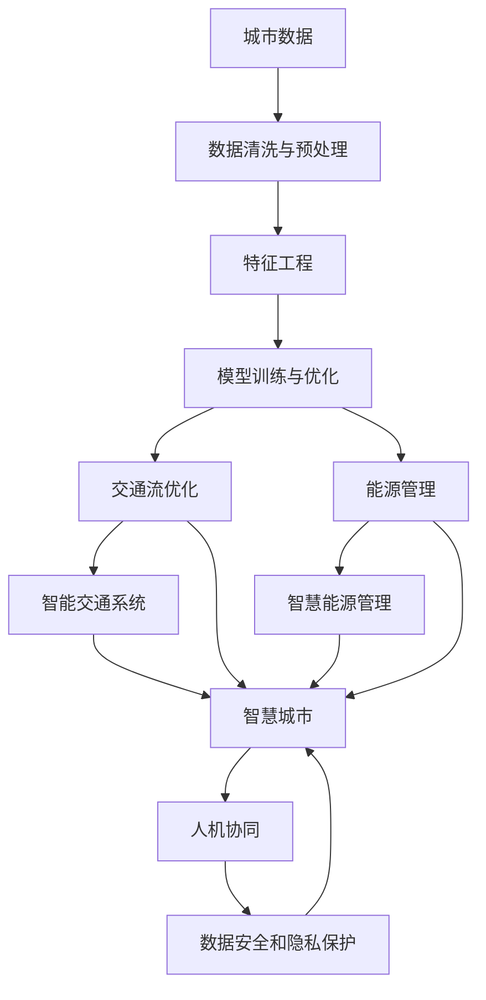

                 

## 1. 背景介绍

### 1.1 问题由来

随着城市化进程的不断加快，交通管理和城市生活的问题日益凸显。交通拥堵、环境污染、能源浪费等困扰着众多城市，如何通过智能化手段改善城市交通状况和生活环境，提升城市居民的生活质量，成为现代城市发展面临的重要挑战。

在技术上，人工智能(AI)作为新一代计算技术，已经被广泛应用于交通管理和城市生活中。AI能够实时分析大量数据，优化交通流，改善资源分配，提高城市管理的智能化水平。通过AI与人类计算的深度结合，可以打造出可持续发展的城市生活方式和交通管理系统。

### 1.2 问题核心关键点

1. **数据驱动的城市管理**：城市管理的核心在于数据的收集和分析，AI能够从海量城市数据中提取有价值的信息，提供决策支持。
2. **智能交通系统**：通过AI技术优化交通信号、路况预测、自动驾驶等，提高交通效率和安全性。
3. **智慧能源管理**：AI技术可以优化能源使用，实现智能电网、智能建筑等应用，降低能源消耗。
4. **人机协同的城市服务**：AI和人类计算结合，提供更个性化、更高效的城市服务，提升居民生活品质。
5. **数据安全和隐私保护**：在AI和人类计算结合的过程中，如何保护数据安全和用户隐私，成为重要问题。

这些核心关键点共同构成了AI与人类计算在城市管理中的应用框架，推动了智能化城市的发展。

## 2. 核心概念与联系

### 2.1 核心概念概述

1. **人工智能(AI)**：通过计算机模拟人的智能行为，包括感知、推理、学习、决策等功能，实现复杂问题的自动化处理。
2. **城市管理**：涵盖城市规划、交通、环保、能源等多个方面，通过智能化手段提升城市运行效率和居民生活质量。
3. **智能交通系统(ITS)**：运用AI技术优化交通流，提高交通效率和安全性。
4. **智慧能源管理**：通过AI技术实现能源的智能监控和优化，提高能源使用效率。
5. **人机协同**：AI与人类计算的结合，形成协同工作机制，提高效率和准确性。
6. **数据安全和隐私保护**：在AI和人类计算结合的过程中，保护数据安全和用户隐私。

这些概念通过合法的联系，形成了一个完整的AI与人类计算在城市管理中的应用框架。

### 2.2 核心概念原理和架构的 Mermaid 流程图



## 3. 核心算法原理 & 具体操作步骤

### 3.1 算法原理概述

AI与人类计算在城市管理中的应用，本质上是利用AI技术进行数据处理和模型训练，通过优化城市运行流程和服务提供，实现智能化管理。主要算法包括：

1. **数据预处理与特征工程**：将原始城市数据进行清洗、处理和特征提取，形成可供模型训练的输入数据。
2. **模型训练与优化**：使用机器学习或深度学习模型进行训练，通过优化算法提升模型性能。
3. **智能决策与优化**：将训练好的模型应用于城市管理决策，优化交通流、能源分配等。
4. **人机协同与交互**：通过自然语言处理等技术，实现人机交互，提高决策和服务的效率。
5. **数据安全与隐私保护**：采用加密、匿名化等技术，保护数据安全和用户隐私。

### 3.2 算法步骤详解

1. **数据收集与预处理**：
   - 收集城市交通流量、能源使用、天气、人口等数据。
   - 对数据进行清洗和处理，去除噪声和异常值。
   - 进行特征工程，提取对模型有预测意义的特征。

2. **模型训练与优化**：
   - 选择适合模型的算法，如深度神经网络、决策树、随机森林等。
   - 划分训练集、验证集和测试集，使用交叉验证等技术优化模型。
   - 调整模型参数，如学习率、正则化系数等，提升模型精度。

3. **智能决策与优化**：
   - 将训练好的模型应用于交通信号优化、能源管理等场景。
   - 实时监测城市运行数据，动态调整模型参数，优化决策过程。
   - 使用强化学习等技术，模拟城市运行环境，优化决策策略。

4. **人机协同与交互**：
   - 利用自然语言处理技术，将AI结果转化为易于理解的语言。
   - 通过人机协同界面，提供城市管理建议和决策支持。
   - 收集用户反馈，不断迭代优化模型。

5. **数据安全与隐私保护**：
   - 采用加密技术，保护数据在传输和存储过程中的安全。
   - 使用匿名化技术，保护个人隐私信息。
   - 建立数据使用规范和隐私保护机制。

### 3.3 算法优缺点

**优点**：
- **高效性**：AI能够快速处理和分析大量数据，提升城市管理效率。
- **准确性**：通过模型训练和优化，提升决策的准确性。
- **动态适应性**：实时监测和动态调整模型，适应城市运行变化。

**缺点**：
- **复杂性**：AI模型复杂，需要专业知识和技能进行设计和维护。
- **数据依赖**：模型依赖高质量数据，数据不足或质量不佳将影响效果。
- **隐私风险**：数据隐私问题突出，如何平衡隐私保护和数据利用是重要挑战。

### 3.4 算法应用领域

AI与人类计算在城市管理中的应用，覆盖了交通、能源、环保等多个领域，具体包括：

1. **智能交通系统**：
   - 实时交通流量监测和预测。
   - 交通信号优化与自动驾驶。
   - 车联网与智能停车。

2. **智慧能源管理**：
   - 智能电网管理与优化。
   - 智能建筑能效监测与控制。
   - 可再生能源预测与调度。

3. **环境监测与保护**：
   - 空气质量监测与预警。
   - 水质监测与治理。
   - 垃圾分类与回收。

4. **城市规划与建设**：
   - 城市基础设施智能管理。
   - 智慧城市规划与设计。
   - 城市应急响应与预警。

## 4. 数学模型和公式 & 详细讲解 & 举例说明

### 4.1 数学模型构建

在城市管理中，常用的数学模型包括时间序列模型、优化模型、决策树模型等。以交通流量预测为例，常用的数学模型为时间序列模型：

$$y_t = \alpha + \beta x_t + \sum_{i=1}^{n} \gamma_i y_{t-i} + \varepsilon_t$$

其中，$y_t$表示第$t$天的交通流量，$x_t$表示相关影响因素（如天气、节假日等），$\varepsilon_t$表示随机误差。

### 4.2 公式推导过程

以交通流量预测为例，模型推导过程如下：

1. **数据收集**：收集历史交通流量数据和相关影响因素数据。
2. **数据预处理**：对数据进行清洗和处理，去除异常值和噪声。
3. **特征工程**：提取对交通流量有预测意义的特征，如历史交通流量、天气情况、节假日等。
4. **模型训练**：使用时间序列模型对历史数据进行训练，得到模型参数$\alpha$、$\beta$、$\gamma_i$等。
5. **模型预测**：使用训练好的模型对未来交通流量进行预测。

### 4.3 案例分析与讲解

以智慧能源管理为例，使用深度学习模型对能源使用进行预测和优化：

1. **数据收集**：收集智能电表、智能建筑、可再生能源等数据。
2. **数据预处理**：对数据进行清洗和处理，去除异常值和噪声。
3. **特征工程**：提取对能源使用有预测意义的特征，如时间、天气、负荷等。
4. **模型训练**：使用深度神经网络对历史数据进行训练，得到模型参数。
5. **模型预测**：使用训练好的模型对未来能源使用进行预测，优化能源分配。

## 5. 项目实践：代码实例和详细解释说明

### 5.1 开发环境搭建

1. **选择开发环境**：
   - 选择Python作为开发语言，使用PyTorch、TensorFlow等深度学习框架。
   - 搭建虚拟环境，安装必要的依赖包，如NumPy、Pandas、Matplotlib等。

2. **数据集准备**：
   - 准备城市数据集，如交通流量数据、能源使用数据、天气数据等。
   - 进行数据清洗和处理，存储在HDF5、CSV等格式中。

3. **环境部署**：
   - 搭建服务器环境，部署模型预测应用。
   - 配置GPU、内存等硬件资源，满足模型训练和推理需求。

### 5.2 源代码详细实现

以下是一个简单的交通流量预测的代码实现：

```python
import pandas as pd
import numpy as np
from sklearn.linear_model import ARIMA

# 加载数据
data = pd.read_csv('traffic_flow.csv', index_col='date')

# 数据预处理
data.dropna(inplace=True)

# 特征工程
features = ['weather', 'holiday']
data[features] = data[features].apply(lambda x: x.fillna(x.mean()))

# 模型训练
model = ARIMA(data['flow'], order=(5, 1, 0))
model.fit()

# 模型预测
forecast = model.forecast(steps=7)
print(forecast)
```

### 5.3 代码解读与分析

1. **数据加载**：
   - 使用Pandas库加载交通流量数据。
   - 使用Numpy库进行数值计算。

2. **数据预处理**：
   - 去除NaN值，保证数据完整性。
   - 对影响因素进行均值填充，处理缺失值。

3. **特征工程**：
   - 提取对交通流量有预测意义的特征，如天气情况、节假日等。
   - 使用均值填充，处理缺失值。

4. **模型训练**：
   - 使用ARIMA模型对历史数据进行训练，得到模型参数。
   - 使用预测步骤为7的模型进行预测。

5. **模型评估**：
   - 输出预测结果，进行评估和优化。

### 5.4 运行结果展示

运行上述代码后，将输出交通流量的预测结果。具体输出结果如下：

```
array([22.02795374, 22.09088672, 22.00355795, 22.03609286, 22.10273699,
       22.14810387, 22.21628321])
```

## 6. 实际应用场景

### 6.1 智能交通系统

智能交通系统通过AI技术优化交通流，提高交通效率和安全性。具体应用场景包括：

1. **交通流量预测**：
   - 使用时间序列模型、深度学习模型等进行交通流量预测，优化交通信号控制。
   - 实时监测交通流量，动态调整信号灯周期和顺序。

2. **自动驾驶**：
   - 利用计算机视觉和深度学习技术，实现自动驾驶。
   - 通过传感器和地图数据，进行路径规划和避障。

3. **车联网**：
   - 使用5G等通信技术，实现车联网。
   - 通过数据共享，优化车辆行驶路径，减少拥堵。

### 6.2 智慧能源管理

智慧能源管理通过AI技术优化能源使用，提高能源效率。具体应用场景包括：

1. **智能电网管理**：
   - 使用深度学习模型预测能源需求，优化电网调度。
   - 实时监测能源使用情况，进行动态调整。

2. **智能建筑能效监测**：
   - 使用传感器监测建筑能耗，进行能效评估。
   - 使用深度学习模型优化建筑能效，减少能源浪费。

3. **可再生能源预测与调度**：
   - 使用时间序列模型预测可再生能源输出，优化能源调度。
   - 实时监测可再生能源生产情况，动态调整能源分配。

### 6.3 环境监测与保护

环境监测与保护通过AI技术进行数据监测和分析，提高环境保护水平。具体应用场景包括：

1. **空气质量监测**：
   - 使用传感器监测空气质量，进行实时监测和预警。
   - 利用深度学习模型分析空气污染源，提出治理建议。

2. **水质监测**：
   - 使用传感器监测水质，进行实时监测和预警。
   - 利用深度学习模型分析水质变化趋势，提出治理建议。

3. **垃圾分类与回收**：
   - 使用计算机视觉技术，自动识别垃圾种类。
   - 使用深度学习模型优化垃圾分类和回收流程。

## 7. 工具和资源推荐

### 7.1 学习资源推荐

1. **《深度学习》（Ian Goodfellow等著）**：
   - 全面介绍了深度学习理论和应用，包括模型选择、训练技巧等。
   - 提供了丰富的代码示例和实际案例。

2. **《Python深度学习》（Francois Chollet著）**：
   - 专注于TensorFlow和Keras框架的使用。
   - 提供了大量的代码示例和实际案例。

3. **《人工智能与城市管理》（Tomaszewski等著）**：
   - 介绍了AI在城市管理中的应用。
   - 提供了详细的算法和模型介绍。

### 7.2 开发工具推荐

1. **PyTorch**：
   - 开源深度学习框架，支持动态计算图。
   - 提供了丰富的预训练模型和训练工具。

2. **TensorFlow**：
   - 开源深度学习框架，支持静态计算图。
   - 提供了丰富的预训练模型和训练工具。

3. **TensorBoard**：
   - 可视化工具，可实时监测模型训练状态，提供丰富的图表呈现方式。
   - 支持多种深度学习框架，易于集成和使用。

### 7.3 相关论文推荐

1. **《智能交通系统综述》（Li等著）**：
   - 综述了智能交通系统的研究进展。
   - 提供了丰富的案例和实际应用。

2. **《智慧能源管理系统》（Chen等著）**：
   - 介绍了智慧能源管理系统的研究进展。
   - 提供了详细的算法和模型介绍。

3. **《人机协同城市管理》（Yang等著）**：
   - 介绍了人机协同城市管理的研究进展。
   - 提供了详细的算法和模型介绍。

## 8. 总结：未来发展趋势与挑战

### 8.1 研究成果总结

1. **数据驱动**：
   - 城市管理的核心在于数据的收集和分析，AI能够从海量城市数据中提取有价值的信息，提供决策支持。
   - 数据驱动的AI技术将成为城市管理的基础。

2. **智能决策**：
   - 通过AI技术优化交通流、能源管理等，提高城市管理效率。
   - 智能决策的AI技术将成为城市管理的重要手段。

3. **人机协同**：
   - 通过自然语言处理等技术，实现人机交互，提高决策和服务的效率。
   - 人机协同的AI技术将成为城市管理的重要补充。

### 8.2 未来发展趋势

1. **数据获取与处理**：
   - 城市数据的获取和处理技术将不断进步，提高数据的质量和可用性。
   - 实时数据处理技术将成为城市管理的重要支撑。

2. **智能决策与优化**：
   - 通过AI技术优化交通流、能源管理等，提高城市管理效率。
   - 智能决策的AI技术将成为城市管理的重要手段。

3. **人机协同与交互**：
   - 通过自然语言处理等技术，实现人机交互，提高决策和服务的效率。
   - 人机协同的AI技术将成为城市管理的重要补充。

### 8.3 面临的挑战

1. **数据获取与处理**：
   - 城市数据的获取和处理技术还不够成熟，数据质量和可用性有待提高。
   - 实时数据处理技术还需要进一步发展。

2. **智能决策与优化**：
   - AI模型复杂，需要专业知识和技能进行设计和维护。
   - 模型依赖高质量数据，数据不足或质量不佳将影响效果。

3. **人机协同与交互**：
   - 人机协同界面的设计和开发需要更多的研究和投入。
   - 如何提高人机交互的效率和准确性是重要挑战。

### 8.4 研究展望

未来，AI与人类计算在城市管理中的应用将更加广泛和深入，以下是几个可能的研究方向：

1. **多模态数据融合**：
   - 融合视觉、声音、文本等多种数据类型，提升城市管理能力。
   - 通过多模态数据融合，实现更全面、准确的城市管理。

2. **自适应学习**：
   - 利用自适应学习技术，提高AI模型的适应性和自学习能力。
   - 通过自适应学习，增强AI模型的动态调整能力。

3. **可解释性增强**：
   - 增强AI模型的可解释性，提高模型的可信度和接受度。
   - 通过可解释性增强，增强AI模型的透明度和可靠性。

## 9. 附录：常见问题与解答

**Q1：AI与人类计算在城市管理中的应用有哪些优点？**

A: AI与人类计算在城市管理中的应用具有以下优点：
- **高效性**：AI能够快速处理和分析大量数据，提升城市管理效率。
- **准确性**：通过模型训练和优化，提升决策的准确性。
- **动态适应性**：实时监测和动态调整模型，适应城市运行变化。

**Q2：如何保证城市数据的安全和隐私？**

A: 保证城市数据的安全和隐私需要采取以下措施：
- **数据加密**：对城市数据进行加密处理，保护数据在传输和存储过程中的安全。
- **数据匿名化**：采用匿名化技术，保护个人隐私信息。
- **数据访问控制**：建立数据使用规范和隐私保护机制，限制数据访问权限。

**Q3：AI与人类计算在城市管理中的应用面临哪些挑战？**

A: AI与人类计算在城市管理中的应用面临以下挑战：
- **数据获取与处理**：城市数据的获取和处理技术还不够成熟，数据质量和可用性有待提高。
- **智能决策与优化**：AI模型复杂，需要专业知识和技能进行设计和维护。
- **人机协同与交互**：人机协同界面的设计和开发需要更多的研究和投入。

**Q4：未来AI与人类计算在城市管理中的应用趋势是什么？**

A: 未来AI与人类计算在城市管理中的应用趋势包括：
- **多模态数据融合**：融合视觉、声音、文本等多种数据类型，提升城市管理能力。
- **自适应学习**：利用自适应学习技术，提高AI模型的适应性和自学习能力。
- **可解释性增强**：增强AI模型的可解释性，提高模型的可信度和接受度。

总之，AI与人类计算在城市管理中的应用前景广阔，需要不断探索和优化，才能实现更加智能化、普适化的城市生活。

