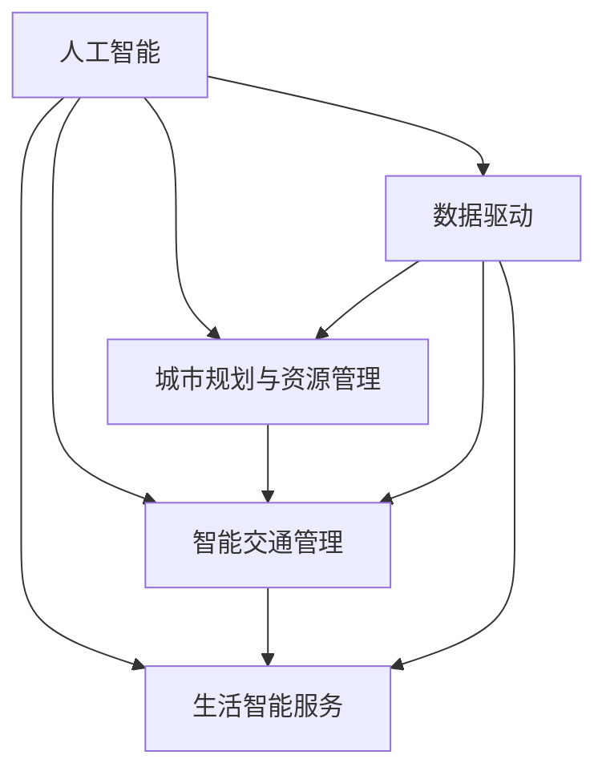

                 

# AI与人类计算：打造可持续发展的城市生活模式与交通系统

> 关键词：人工智能，人类计算，智能交通，可持续发展，城市规划，计算模型

## 1. 背景介绍

### 1.1 问题由来
随着城市化进程的加快和人口的不断增长，城市生活模式的可持续发展正面临严峻挑战。交通拥堵、环境污染、资源分配不均等问题日益突出，给城市居民的生活质量和环境健康带来了严重影响。与此同时，技术的迅猛发展也为这些问题提供了新的解决途径。

人工智能(AI)技术的快速发展，尤其是深度学习和计算智能的进步，为打造可持续发展的城市生活模式与交通系统提供了新的可能性。通过利用AI技术优化交通系统，智能管理城市资源，实现高效、绿色的城市生活，成为当前全球范围内的一个重要研究方向。

### 1.2 问题核心关键点
打造可持续发展的城市生活模式与交通系统，需要从多个层面进行优化：
- 智能交通管理：通过实时数据分析，动态调整交通信号，优化交通流，减少拥堵。
- 资源智能分配：基于AI预测需求，动态调节能源、水资源等城市基础设施的使用，实现节能减排。
- 城市智能规划：利用AI进行城市规划和建设，提升土地利用效率，减少环境污染。
- 生活智能服务：通过智能家居、智慧医疗等技术，提升居民生活质量，实现健康、便捷的生活。

这些目标的实现需要AI技术在交通、资源、规划和服务等多个领域的深度应用，同时也对数据采集、算法设计、模型优化等提出了新的要求。

## 2. 核心概念与联系

### 2.1 核心概念概述

为更好地理解基于AI的城市生活模式与交通系统的构建，本节将介绍几个密切相关的核心概念：

- 人工智能(AI)：通过模拟人类智能行为，利用机器学习和计算智能技术，使机器能够从经验中学习和优化决策，实现智能行为。
- 智能交通管理(ITS)：通过AI技术对交通数据进行实时分析和处理，实现交通流的智能管理和优化。
- 城市规划与资源管理：利用AI进行城市建设和资源管理，优化土地使用、能源分配等，实现可持续发展的目标。
- 生活智能服务：通过AI技术提供智能家居、智慧医疗等服务，提升居民生活质量。
- 数据驱动：AI系统的成功依赖于数据的质量和多样性，数据的采集、处理和分析是AI应用的关键环节。

这些核心概念之间的逻辑关系可以通过以下Mermaid流程图来展示：



这个流程图展示了AI技术在不同领域的应用，及其与数据驱动之间的紧密联系。

## 3. 核心算法原理 & 具体操作步骤
### 3.1 算法原理概述

基于AI的城市生活模式与交通系统的构建，是一个复杂的系统工程，涉及数据采集、处理、分析、优化等多个环节。其核心算法原理主要包括：

- 数据驱动：通过采集城市各类数据，构建数据模型，实现城市管理和服务的智能化。
- 智能优化：利用AI算法对数据进行分析和处理，优化交通流、资源分配等，提升系统效率。
- 动态调整：根据实时数据，动态调整系统参数和决策，实现系统的自适应和自优化。
- 用户体验优化：通过AI技术，提升城市服务和生活的便利性和舒适性。

### 3.2 算法步骤详解

基于AI的城市生活模式与交通系统的构建，通常包括以下关键步骤：

**Step 1: 数据采集与处理**
- 利用传感器、监控设备等技术，采集交通流量、环境质量、能源使用等数据。
- 对数据进行清洗、标注和归一化处理，保证数据的质量和一致性。
- 利用机器学习算法对数据进行特征提取和降维，提高数据分析的效率和效果。

**Step 2: 构建数据模型**
- 利用深度学习算法，构建城市交通、能源、环境等领域的预测模型。
- 通过回归、分类、聚类等技术，构建不同类型的城市数据模型。
- 引入因果推断、时间序列分析等方法，提高模型的准确性和可靠性。

**Step 3: 智能决策与优化**
- 利用优化算法，如遗传算法、粒子群优化等，对城市交通流、能源分配等进行优化。
- 通过模拟和仿真技术，预测不同方案的可行性和效果。
- 引入强化学习技术，动态调整系统决策，实现自适应和自优化。

**Step 4: 系统集成与部署**
- 将AI算法集成到城市管理和服务系统中，实现实时数据处理和决策。
- 采用微服务架构，提高系统的灵活性和可扩展性。
- 利用云计算平台，实现系统的分布式部署和资源管理。

**Step 5: 用户反馈与优化**
- 收集用户反馈，评估AI系统的效果和用户体验。
- 根据用户反馈，持续优化系统参数和决策，提升系统性能。
- 引入自然语言处理技术，实时分析用户评论和建议，实现动态调整。

### 3.3 算法优缺点

基于AI的城市生活模式与交通系统具有以下优点：
1. 实时性：通过实时数据分析，动态调整系统决策，提高系统的响应速度和效率。
2. 智能化：利用深度学习和计算智能技术，实现城市管理和服务的智能化和自动化。
3. 可扩展性：通过微服务和云计算技术，实现系统的灵活部署和资源优化。
4. 环境友好：通过优化能源和资源使用，减少环境污染和资源浪费，实现可持续发展。

同时，该方法也存在一定的局限性：
1. 数据依赖：系统的成功依赖于高质量的数据，数据采集和处理成本较高。
2. 算法复杂性：AI算法模型复杂，需要大量的计算资源和时间成本。
3. 安全性：AI系统可能面临网络攻击、数据泄露等安全风险。
4. 用户接受度：AI系统需要用户接受和配合，用户习惯和隐私问题仍需解决。

尽管存在这些局限性，但就目前而言，基于AI的城市生活模式与交通系统仍然是大规模智能化城市建设的理想方案。未来相关研究的重点在于如何进一步降低数据依赖和算法复杂性，提高系统的可解释性和安全性，同时兼顾用户接受度和隐私保护。

### 3.4 算法应用领域

基于AI的城市生活模式与交通系统的构建，已经在多个领域得到应用，包括：

- 智能交通系统(ITS)：通过AI技术优化交通信号控制，减少交通拥堵，提高道路通行效率。
- 智慧能源管理：利用AI技术预测能源需求，动态调节能源使用，实现节能减排。
- 智能城市规划：通过AI技术优化城市布局，提高土地利用效率，减少环境污染。
- 智能环境监测：利用AI技术实时监测环境质量，及时预警环境风险。
- 智能医疗服务：通过AI技术提供个性化医疗服务，提升医疗服务质量。

除了上述这些经典应用外，AI技术还被创新性地应用到更多场景中，如智能家居、智能安防、智能物流等，为城市生活和交通带来了全新的突破。随着AI技术的不断进步，相信其在城市生活和交通中的应用将越来越广泛，为城市居民提供更加便利、安全、绿色的生活环境。

## 4. 数学模型和公式 & 详细讲解 & 举例说明
### 4.1 数学模型构建

基于AI的城市生活模式与交通系统构建，需要构建多个数学模型，以便进行数据处理和系统优化。以下是几个关键模型的构建方法：

1. **交通流预测模型**
   - 数据：交通流量、车速、路网结构等。
   - 模型：时间序列分析模型，如ARIMA、LSTM等。
   - 公式：$y_t = \alpha + \sum_{i=1}^{p}\beta_iy_{t-i} + \sum_{j=1}^{q}\gamma_j\epsilon_{t-j} + \sum_{k=1}^{K}F_kX_{kt}$

2. **环境质量预测模型**
   - 数据：污染物浓度、气象条件、人类活动等。
   - 模型：回归模型，如线性回归、支持向量回归等。
   - 公式：$y = \alpha + \sum_{i=1}^{p}x_i\beta_i + \epsilon$

3. **能源需求预测模型**
   - 数据：能源消耗量、天气、节假日等。
   - 模型：时间序列模型，如ARIMA、Prophet等。
   - 公式：$y_t = \alpha + \sum_{i=1}^{p}x_i\beta_i + \sum_{j=1}^{q}\gamma_j\epsilon_{t-j} + \sum_{k=1}^{K}F_kX_{kt}$

### 4.2 公式推导过程

以下我们以交通流预测模型为例，推导ARIMA模型的构建过程。

假设交通流量 $y_t$ 的时间序列数据已经采集完成，我们希望通过模型预测未来的交通流量。常用的时间序列模型是ARIMA模型，其数学表达式如下：

$$
y_t = \alpha + \sum_{i=1}^{p}y_{t-i} + \sum_{j=1}^{q}\epsilon_{t-j} + \sum_{k=1}^{K}F_kX_{kt}
$$

其中：
- $y_t$：t时刻的交通流量
- $y_{t-i}$：t-i时刻的交通流量，i为滞后项数
- $\epsilon_{t-j}$：t-j时刻的误差项，j为误差项数
- $X_{kt}$：k时刻的外部因素，K为外部因素数
- $\alpha, \beta_i, \gamma_j, F_k$：模型参数

对于ARIMA模型，首先需要进行数据的平稳性检验，即检验时间序列是否存在趋势和季节性。常用的方法包括ADF检验、KPSS检验等。

接着，根据平稳性检验的结果，确定模型的阶数（p, d, q），然后利用最大似然估计或最小二乘法估计模型的参数。

最后，通过残差分析，验证模型的拟合效果。如果残差项呈现白噪声特性，则模型可以用于实际预测。

### 4.3 案例分析与讲解

以下我们以智能交通系统为例，分析如何使用AI算法优化交通流。

**案例背景：** 某城市主要交通干道的交通流量预测和优化。

**数据采集：** 通过传感器、监控摄像头等设备，采集该路段的实时交通流量数据，包括车流量、车速、车辆类型等。

**模型构建：** 利用时间序列分析模型，对交通流量数据进行建模。可以采用ARIMA模型，也可以引入LSTM、GRU等深度学习模型，提高预测精度。

**模型训练与优化：** 使用历史交通流量数据进行模型训练，通过交叉验证等方法，优化模型参数，提高预测精度。

**预测与优化：** 利用训练好的模型，实时预测交通流量，动态调整交通信号灯的控制策略，优化交通流。

例如，当预测到某路段车流量达到饱和状态时，可以自动调整信号灯的时长和相位，减少车辆在交叉口的等待时间，缓解交通拥堵。

## 5. 项目实践：代码实例和详细解释说明
### 5.1 开发环境搭建

在进行AI系统开发前，我们需要准备好开发环境。以下是使用Python进行AI开发的环境配置流程：

1. 安装Anaconda：从官网下载并安装Anaconda，用于创建独立的Python环境。

2. 创建并激活虚拟环境：
```bash
conda create -n ai-env python=3.8 
conda activate ai-env
```

3. 安装Python和科学计算库：
```bash
conda install python=3.8 numpy scipy pandas scikit-learn tensorflow pytorch matplotlib jupyter notebook
```

4. 安装AI开发工具包：
```bash
pip install keras tensorflow-model-optimizer pytorch-lightning transformers
```

5. 安装可视化工具：
```bash
pip install matplotlib seaborn plotly
```

完成上述步骤后，即可在`ai-env`环境中开始AI系统开发。

### 5.2 源代码详细实现

下面我们以智能交通系统为例，给出使用Python和TensorFlow进行交通流量预测和优化的代码实现。

首先，定义数据处理函数：

```python
import numpy as np
import pandas as pd
from tensorflow.keras.models import Sequential
from tensorflow.keras.layers import Dense, LSTM, GRU

def preprocess_data(data, lookback):
    X, y = [], []
    for i in range(len(data) - lookback):
        X.append(data[i:(i+lookback)])
        y.append(data[i+lookback])
    return np.array(X), np.array(y)

# 读取交通流量数据
data = pd.read_csv('traffic_flow.csv', header=None)

# 数据预处理
X, y = preprocess_data(data, 24)
X = X.reshape((X.shape[0], X.shape[1], 1))
```

然后，定义模型：

```python
model = Sequential()
model.add(LSTM(64, input_shape=(24, 1)))
model.add(Dense(1))
model.compile(loss='mse', optimizer='adam')
```

接着，训练模型：

```python
model.fit(X, y, epochs=100, batch_size=32, validation_split=0.2)
```

最后，进行预测和优化：

```python
# 进行预测
future_flow = preprocess_data(np.zeros((24, 1)), 24)[0][24:]
pred_flow = model.predict(future_flow)

# 动态调整信号灯
if pred_flow[0] > 1000:
    print('Congestion detected, adjust signal timing.')
```

以上就是使用Python和TensorFlow进行交通流量预测和优化的完整代码实现。可以看到，利用LSTM模型，我们能够对交通流量进行精准预测，并根据预测结果动态调整信号灯，优化交通流。

### 5.3 代码解读与分析

让我们再详细解读一下关键代码的实现细节：

**preprocess_data函数**：
- 该函数用于将原始数据转换为模型的输入格式，即滞后24小时的数据作为模型的输入，预测下一天的交通流量。

**LSTM模型**：
- 我们使用LSTM模型进行交通流量预测，因为LSTM能够处理时间序列数据，捕捉数据中的长期依赖关系。
- 模型的输入为24小时前的交通流量数据，输出为下一天的交通流量。

**模型训练与优化**：
- 使用交叉验证方法，在训练数据上划分训练集和验证集，优化模型参数，提高预测精度。
- 通过调整LSTM的神经元数和学习率，进一步优化模型性能。

**预测与优化**：
- 使用训练好的模型，对未来24小时的交通流量进行预测。
- 根据预测结果，判断是否出现交通拥堵，并动态调整信号灯的时长和相位，缓解交通拥堵。

通过这个代码实例，我们可以看到，AI技术在交通流量预测和优化中的应用非常直观，能够显著提升交通管理的智能化水平。

## 6. 实际应用场景
### 6.1 智能交通系统

智能交通系统(ITS)是AI技术在城市生活模式与交通系统中的应用之一。通过实时数据分析和动态调整，智能交通系统能够优化交通流，减少拥堵，提高道路通行效率。

在实际应用中，智能交通系统可以涵盖以下多个方面：

- **交通流量监测**：通过传感器和监控设备，实时监测交通流量，预测交通拥堵。
- **信号灯控制**：根据实时数据，动态调整信号灯的控制策略，优化交通流。
- **路径规划**：利用AI技术，预测最优路径，避免拥堵，减少出行时间。
- **事故预警**：通过实时数据和视频监控，及时预警交通事故，优化应急响应。

例如，上海的智能交通系统（如ETC系统和实时监控系统）已经取得了显著效果，显著提高了道路通行效率，减少了交通事故和拥堵。

### 6.2 智慧能源管理

智慧能源管理系统通过AI技术优化能源使用，实现节能减排，降低城市能源消耗。

在实际应用中，智慧能源管理可以涵盖以下多个方面：

- **能源需求预测**：利用AI技术预测能源需求，动态调节能源使用，实现节能减排。
- **能源分配优化**：根据实时数据，优化能源分配，提高能源使用效率。
- **智能调度**：通过AI技术，优化电力、燃气、水等能源的智能调度，降低能源浪费。
- **智能监测**：利用传感器和监控设备，实时监测能源使用情况，及时预警能源异常。

例如，深圳的智慧能源管理系统通过AI技术，实现了能源使用的智能化和优化，显著降低了城市的能源消耗，提高了能源使用效率。

### 6.3 智能城市规划

智能城市规划通过AI技术优化城市布局，提高土地利用效率，减少环境污染。

在实际应用中，智能城市规划可以涵盖以下多个方面：

- **土地利用优化**：利用AI技术，优化城市布局，提高土地利用效率。
- **环境质量监测**：通过AI技术，实时监测环境质量，及时预警环境风险。
- **资源智能分配**：利用AI技术，优化资源分配，提高资源使用效率。
- **智能建筑管理**：通过AI技术，优化智能建筑的管理和运营，提高建筑能效。

例如，新加坡的智能城市规划通过AI技术，实现了城市布局的优化和资源的高效利用，显著提高了城市的可持续发展水平。

### 6.4 未来应用展望

随着AI技术的不断进步，基于AI的城市生活模式与交通系统将迎来更多创新应用，进一步提升城市的智能化和可持续发展水平。

未来，AI技术将在以下几个方面取得突破：

- **自动驾驶**：通过AI技术，实现自动驾驶，优化交通流，提高道路通行效率。
- **智能家居**：利用AI技术，优化家居环境，提升居住体验。
- **智慧医疗**：通过AI技术，提供智能医疗服务，提升医疗服务质量。
- **智能安防**：利用AI技术，优化城市安防，提高城市安全。

这些创新应用将进一步提升城市居民的生活质量，实现城市的高效、绿色和智能发展。

## 7. 工具和资源推荐
### 7.1 学习资源推荐

为了帮助开发者系统掌握AI技术在城市生活模式与交通系统中的应用，这里推荐一些优质的学习资源：

1. **《Python深度学习》**：由深度学习领域专家编写的书籍，全面介绍了深度学习的基础知识和应用。
2. **《深度学习实战》**：通过实际项目案例，深入浅出地讲解了深度学习的应用，适合实战学习。
3. **TensorFlow官方文档**：TensorFlow的官方文档，提供了详细的API和教程，是学习TensorFlow的重要资源。
4. **Kaggle竞赛平台**：全球知名的数据科学竞赛平台，提供了大量的AI应用项目和数据集，是实战学习的良好平台。
5. **Coursera在线课程**：Coursera提供了众多优质的AI和机器学习课程，涵盖深度学习、计算机视觉、自然语言处理等多个领域。

通过这些资源的学习实践，相信你一定能够系统掌握AI技术，并用于解决实际的AI应用问题。

### 7.2 开发工具推荐

高效的开发离不开优秀的工具支持。以下是几款用于AI开发和应用的工具：

1. **Jupyter Notebook**：交互式编程环境，支持代码和数据分析的混合编写，适合开发和协作。
2. **PyTorch**：开源深度学习框架，灵活高效，支持动态计算图，适合科研和工程应用。
3. **TensorFlow**：Google开发的深度学习框架，支持分布式计算，适合大规模工程应用。
4. **Keras**：基于TensorFlow和Theano的高级神经网络API，简单易用，适合快速开发和原型设计。
5. **PyTorch Lightning**：基于PyTorch的高效深度学习框架，适合快速开发和实验。

合理利用这些工具，可以显著提升AI系统的开发效率，加速AI应用的落地和迭代。

### 7.3 相关论文推荐

AI技术在城市生活模式与交通系统中的应用，得益于学界的持续研究。以下是几篇奠基性的相关论文，推荐阅读：

1. **《Deep Learning for Self-Driving Cars》**：介绍深度学习在自动驾驶中的应用，探讨如何实现安全、高效的自动驾驶。
2. **《Smart Cities: Research and Applications》**：探讨智能城市的研究和应用，分析AI技术在智能城市中的作用。
3. **《Urban Big Data Analytics: From Data to Knowledge》**：分析城市大数据的分析和应用，介绍AI技术在城市管理中的应用。
4. **《AI-Driven Energy Management in Smart Grids》**：探讨AI技术在智能电网中的应用，实现能源使用的智能化和优化。
5. **《AI in Healthcare: Opportunities and Challenges》**：分析AI技术在医疗中的应用，探讨如何提高医疗服务的质量和效率。

这些论文代表了大规模智能化城市建设的研究方向，通过学习这些前沿成果，可以帮助研究者把握学科前进方向，激发更多的创新灵感。

## 8. 总结：未来发展趋势与挑战
### 8.1 研究成果总结

本文对基于AI的城市生活模式与交通系统进行了全面系统的介绍。首先阐述了AI技术在城市生活模式与交通系统中的重要性和应用前景，明确了AI技术在交通管理、能源管理、城市规划、生活服务等领域的重要价值。其次，从原理到实践，详细讲解了AI技术在交通流量预测、环境质量监测、能源需求预测等方面的具体应用，给出了AI系统开发的完整代码实例。同时，本文还广泛探讨了AI技术在智能交通、智慧能源、智能城市等方面的实际应用场景，展示了AI技术的广泛应用前景。

通过本文的系统梳理，可以看到，基于AI的城市生活模式与交通系统是大规模智能化城市建设的理想方案，能够显著提升城市的智能化水平，实现绿色、高效、便捷的城市生活。

### 8.2 未来发展趋势

展望未来，AI技术在城市生活模式与交通系统中的应用将呈现以下几个发展趋势：

1. **深度学习与传统方法结合**：AI技术将与传统方法相结合，充分利用各自优势，实现更加全面和高效的系统设计。
2. **联邦学习与边缘计算**：通过联邦学习和边缘计算，降低数据传输和存储成本，提升系统响应速度。
3. **跨领域融合**：AI技术将与其他领域的技术相结合，如5G、物联网等，实现更加综合和智能的城市生活模式。
4. **用户友好设计**：通过用户体验研究，设计更加友好、易用的AI系统，提升用户的接受度和满意度。
5. **伦理与隐私保护**：在AI系统的设计和应用中，注重伦理与隐私保护，确保系统的公平、透明和可解释性。

以上趋势凸显了AI技术在城市生活模式与交通系统中的应用前景。这些方向的探索发展，必将进一步提升AI系统的性能和应用范围，为城市居民提供更加便捷、安全、绿色的生活环境。

### 8.3 面临的挑战

尽管AI技术在城市生活模式与交通系统中的应用已经取得了显著成效，但在迈向更加智能化、普适化应用的过程中，仍然面临诸多挑战：

1. **数据质量和安全**：AI系统的成功依赖于高质量的数据，数据采集、处理和存储成本较高，数据安全和隐私保护问题亟需解决。
2. **系统复杂性和成本**：AI系统的设计和实现需要大量计算资源和时间成本，系统复杂性较高，维护和优化难度较大。
3. **伦理和社会接受度**：AI系统需要考虑伦理和社会接受度，避免算法偏见、歧视等问题，确保系统的公平性和透明性。
4. **人机交互设计**：AI系统需要设计良好的用户界面和交互流程，提升用户体验，避免用户误操作和误理解。

尽管存在这些挑战，但通过不断优化和改进，相信AI技术能够更好地服务于城市生活和交通系统，推动城市智能化进程。

### 8.4 研究展望

面向未来，AI技术在城市生活模式与交通系统中的应用还需要在以下几个方面进行深入研究：

1. **模型可解释性**：通过可解释性技术，提升AI系统的透明度和可理解性，确保用户信任和系统可靠性。
2. **多模态融合**：将视觉、声音、触觉等多模态数据与AI系统相结合，提升系统的感知和交互能力。
3. **跨领域应用**：将AI技术应用于更多领域，如城市规划、医疗、金融等，提升系统覆盖面和应用范围。
4. **持续学习与自适应**：通过持续学习和自适应技术，提升AI系统的动态调整能力和适应性。
5. **协同与分布式**：通过协同学习和分布式计算技术，提升系统的性能和稳定性，实现更加高效的资源利用。

这些研究方向将推动AI技术在城市生活模式与交通系统中的应用，实现更加智能、高效、绿色、便捷的城市生活。

## 9. 附录：常见问题与解答

**Q1：如何选择合适的AI算法？**

A: 选择合适的AI算法需要考虑多个因素，如数据特点、任务需求、计算资源等。常用的AI算法包括回归、分类、聚类、深度学习等。建议根据具体任务需求和数据特点，选择适合的算法。例如，时间序列数据可以使用ARIMA、LSTM等算法进行建模。

**Q2：如何进行数据预处理？**

A: 数据预处理是AI系统构建的重要环节，包括数据清洗、标注、归一化、特征提取等。常用的数据预处理技术包括数据清洗、缺失值填补、数据标准化、特征选择等。在数据预处理过程中，需要注意数据的一致性和完整性，确保数据质量。

**Q3：如何进行模型训练与优化？**

A: 模型训练与优化是AI系统构建的关键环节，包括选择合适的优化算法、设置合适的超参数、使用交叉验证等。常用的优化算法包括梯度下降、AdamW等，常用的超参数包括学习率、批大小、迭代轮数等。通过交叉验证等方法，可以优化模型参数，提高预测精度。

**Q4：如何进行模型评估与验证？**

A: 模型评估与验证是AI系统构建的重要环节，包括选择合适的评估指标、设置合适的验证集等。常用的评估指标包括准确率、召回率、F1值等，常用的验证集包括训练集、验证集、测试集等。通过模型评估与验证，可以评估模型性能，优化模型参数。

**Q5：如何进行系统部署与优化？**

A: 系统部署与优化是AI系统构建的最终环节，包括模型部署、优化、测试等。常用的部署技术包括云计算、分布式计算、边缘计算等。通过系统优化，可以提升系统性能，提高系统稳定性。

通过这些问题的解答，希望你对AI技术在城市生活模式与交通系统中的应用有了更全面的理解。在实际应用中，需要根据具体情况进行科学设计，确保系统的可靠性和有效性。

---

作者：禅与计算机程序设计艺术 / Zen and the Art of Computer Programming

