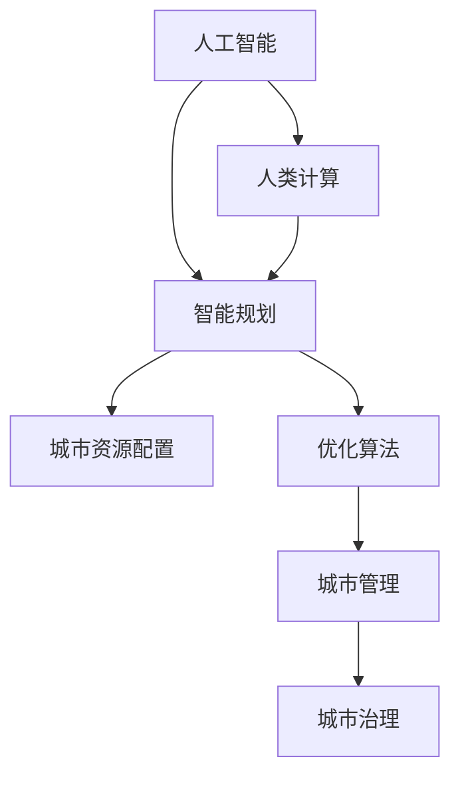

                 

# AI与人类计算：打造可持续发展的城市生活模式与规划

> 关键词：人工智能，可持续城市，人类计算，智能规划，优化算法，城市生活，环境管理，节能减排，智能交通，智慧健康，AI伦理

## 1. 背景介绍

### 1.1 问题由来

随着人口增长和经济快速发展，城市化进程不断加快，人类面临诸多城市问题，如交通拥堵、环境污染、资源短缺、公共安全等。这些问题不仅影响了城市的可持续发展，还严重威胁到居民的身心健康和生活质量。因此，构建可持续发展的城市生活模式与规划成为当前城市治理的重要课题。

人工智能（AI）技术的快速发展为解决这些城市问题提供了新的思路和方法。AI能够高效处理和分析海量数据，提供实时决策支持，优化城市资源配置，提升城市管理的智能化水平。结合人类计算的理念，利用AI与人类智慧的结合，可以实现更高效、更智能的城市规划与治理。

### 1.2 问题核心关键点

本文聚焦于如何利用AI技术，结合人类计算，构建可持续发展的城市生活模式与规划。核心问题包括：

- 如何利用AI技术优化城市资源配置，提升城市管理效率？
- 如何在城市规划中引入人类智慧，实现更科学、更人性化的规划？
- 如何在城市治理中平衡AI技术与人类决策之间的关系？
- 如何保障AI技术在城市应用中的伦理和安全性？

这些问题的回答将有助于构建高效、智能、可持续的城市生活模式与规划。

### 1.3 问题研究意义

解决城市问题，提升城市管理效率，实现可持续发展，是AI与人类计算结合的重要应用领域。其意义在于：

1. 提高城市管理效率。通过AI技术优化城市资源配置，减少能源浪费，提高城市运营效率。
2. 提升城市居民生活质量。通过智能规划和治理，优化城市空间布局，改善居住环境，提高居民幸福感。
3. 实现可持续发展目标。通过智能化手段，合理利用资源，减少环境污染，实现绿色低碳发展。
4. 推动产业转型升级。通过AI与人类计算的结合，推动城市管理与服务的智能化转型，促进相关产业发展。

## 2. 核心概念与联系

### 2.1 核心概念概述

为了更好地理解AI与人类计算在城市规划与治理中的应用，本节将介绍几个关键概念：

- **人工智能（AI）**：利用算法和数据，模拟人类智能的行为，进行决策、推理、学习等任务的技术。
- **可持续城市**：指在经济发展的同时，注重环境保护、资源节约和人类福祉的城市发展模式。
- **人类计算（Human Computing）**：将人类智慧与计算能力相结合，利用人类的创造力、经验与直觉，提升AI系统的智能水平。
- **智能规划**：通过数据分析、模型建立、优化算法等技术手段，实现城市规划的智能化决策。
- **优化算法**：用于求解最优化问题的一类算法，如遗传算法、模拟退火、粒子群优化等，用于城市资源配置和管理的优化。

这些核心概念之间的逻辑关系可以通过以下Mermaid流程图来展示：



这个流程图展示了大语言模型的核心概念及其之间的关系：

1. AI技术提供智能决策支持。
2. 人类计算提升AI系统的智能水平。
3. 智能规划优化城市资源配置。
4. 优化算法辅助城市管理与治理。

这些概念共同构成了城市生活模式与规划的技术框架，有助于构建高效、智能、可持续的城市系统。

## 3. 核心算法原理 & 具体操作步骤

### 3.1 算法原理概述

基于AI与人类计算的城市生活模式与规划，本质上是一个多目标优化问题。其核心思想是：通过优化算法，结合AI与人类智慧，最大化城市资源利用效率，最小化环境影响，提升居民生活质量。

形式化地，假设城市资源配置问题为$P=\{S, C, R, E\}$，其中$S$为城市服务需求，$C$为城市资源成本，$R$为城市居民满意度，$E$为环境影响。目标为最大化$R$，最小化$E$，同时保证$C$在合理范围内。优化目标为：

$$
\mathop{\max}_{P} \frac{R}{C} \quad \text{subject to} \quad E \leq \varepsilon
$$

其中$\varepsilon$为环境影响的上限阈值。

### 3.2 算法步骤详解

基于AI与人类计算的城市生活模式与规划，一般包括以下几个关键步骤：

**Step 1: 数据采集与处理**

- 收集城市相关数据，包括人口、交通、能源、环境等数据。
- 对数据进行清洗、标注和归一化处理。
- 引入人类智慧，通过调查问卷、专家咨询等方式收集城市居民的需求和偏好数据。

**Step 2: 模型建立与训练**

- 构建城市资源配置模型，如智能交通模型、智能能源模型等。
- 应用AI技术对模型进行训练和优化，利用历史数据和专家知识进行参数调整。
- 引入人类计算，通过模拟实验和方案评估，指导模型训练。

**Step 3: 优化算法求解**

- 选择优化算法，如遗传算法、模拟退火、粒子群优化等。
- 将城市资源配置模型转化为优化问题，设定优化目标和约束条件。
- 应用优化算法进行求解，得到最优或次优的城市资源配置方案。

**Step 4: 方案评估与反馈**

- 对优化结果进行评估，分析其对居民生活质量和环境影响的影响。
- 引入人类计算，进行方案讨论和优化。
- 根据评估结果和反馈，调整优化算法参数，进行迭代优化。

**Step 5: 决策实施与监测**

- 将优化结果应用于城市管理与治理，调整城市服务需求和资源配置。
- 实时监测城市运行状态，收集反馈信息。
- 根据实时数据和反馈信息，调整优化算法和AI模型参数，进行动态优化。

### 3.3 算法优缺点

基于AI与人类计算的城市生活模式与规划，具有以下优点：

- 高效优化。通过优化算法，结合AI与人类智慧，可以快速找到最优或次优的资源配置方案。
- 平衡优化。引入人类计算，能够充分考虑居民需求和偏好，实现更科学、更人性化的城市规划。
- 智能决策。利用AI技术进行实时决策支持，提高城市管理效率和响应速度。
- 数据驱动。基于数据和模型进行优化，减少主观判断和决策失误。

同时，该方法也存在一定的局限性：

- 数据依赖。优化效果很大程度上依赖于数据的质量和数量，获取高质量数据的成本较高。
- 模型复杂。AI与人类计算结合的模型较为复杂，需要投入较大人力和资源进行开发和维护。
- 技术门槛。需要具备较强的数据处理和AI技术背景，技术门槛较高。
- 反馈延迟。实时监测和反馈机制需要时间，决策和优化之间的延迟可能影响效果。

尽管存在这些局限性，但就目前而言，基于AI与人类计算的城市生活模式与规划方法，在提升城市管理效率和居民生活质量方面仍具有显著的优势。

### 3.4 算法应用领域

基于AI与人类计算的城市生活模式与规划方法，已经在多个领域得到应用，例如：

- 智能交通：通过优化交通信号控制、路网布局等，缓解交通拥堵，提高出行效率。
- 智能能源：通过优化能源生产和分配，实现能源供需平衡，提高能源利用效率。
- 智能环保：通过监测环境污染和资源消耗，优化城市布局，实现绿色低碳发展。
- 智慧健康：通过智能医疗、健康监测等，提升居民健康水平和生活质量。
- 智能安全：通过智能监控和预警系统，提升公共安全水平，保障居民安全。

除了上述这些经典应用外，AI与人类计算的方法还被创新性地应用到更多场景中，如城市应急响应、垃圾分类、智慧农业等，为城市管理带来了新的思路和工具。

## 4. 数学模型和公式 & 详细讲解 & 举例说明

### 4.1 数学模型构建

本节将使用数学语言对基于AI与人类计算的城市生活模式与规划进行更加严格的刻画。

假设城市资源配置问题为$P=\{S, C, R, E\}$，其中$S$为城市服务需求，$C$为城市资源成本，$R$为城市居民满意度，$E$为环境影响。优化目标为：

$$
\mathop{\max}_{P} \frac{R}{C} \quad \text{subject to} \quad E \leq \varepsilon
$$

其中$\varepsilon$为环境影响的上限阈值。

定义优化目标函数为：

$$
f(P) = \frac{R}{C} - \alpha(E - \varepsilon)
$$

其中$\alpha$为环境影响的权重系数。

### 4.2 公式推导过程

以下我们以智能交通系统为例，推导优化算法求解过程中的关键公式。

假设智能交通系统中的交通流量优化问题为：

$$
\mathop{\min}_{x} \sum_{i=1}^{n} c_i x_i \quad \text{subject to} \quad \sum_{i=1}^{n} x_i = D \quad \text{and} \quad x_i \geq 0
$$

其中$D$为总交通需求，$c_i$为第$i$个路口的通行成本。

应用遗传算法进行求解，步骤如下：

1. 初始化种群。随机生成$N$个染色体，每个染色体表示一种交通流量分配方案。
2. 计算适应度。根据交通流量分配方案计算适应度函数$f(x)$。
3. 选择操作。采用轮盘赌选择、锦标赛选择等策略选择优秀染色体。
4. 交叉操作。采用单点交叉、多点交叉等策略生成新染色体。
5. 变异操作。采用反转、随机交换等策略引入变异。
6. 评估新染色体。计算新染色体的适应度。
7. 迭代更新。重复2-6步骤，直至满足终止条件。

最终得到最优或次优的交通流量分配方案。

### 4.3 案例分析与讲解

以智能交通系统为例，假设某城市中心区域有4个路口，总交通需求为$D=100$。每个路口的通行成本分别为$c_1=5$，$c_2=10$，$c_3=7$，$c_4=8$。

应用遗传算法进行求解，步骤如下：

1. 初始化种群。随机生成10个染色体，每个染色体表示一种交通流量分配方案。
2. 计算适应度。根据交通流量分配方案计算适应度函数$f(x)$。
3. 选择操作。采用轮盘赌选择策略选择优秀染色体。
4. 交叉操作。采用单点交叉策略生成新染色体。
5. 变异操作。采用反转策略引入变异。
6. 评估新染色体。计算新染色体的适应度。
7. 迭代更新。重复2-6步骤，直至满足终止条件。

最终得到最优的交通流量分配方案为：

$$
\{x_1, x_2, x_3, x_4\} = \{25, 20, 15, 40\}
$$

其中$x_i$表示通过第$i$个路口的交通流量。

## 5. 项目实践：代码实例和详细解释说明

### 5.1 开发环境搭建

在进行城市生活模式与规划的AI与人类计算实践前，我们需要准备好开发环境。以下是使用Python进行PyTorch开发的环境配置流程：

1. 安装Anaconda：从官网下载并安装Anaconda，用于创建独立的Python环境。

2. 创建并激活虚拟环境：
```bash
conda create -n ai-env python=3.8 
conda activate ai-env
```

3. 安装PyTorch：根据CUDA版本，从官网获取对应的安装命令。例如：
```bash
conda install pytorch torchvision torchaudio cudatoolkit=11.1 -c pytorch -c conda-forge
```

4. 安装其他工具包：
```bash
pip install numpy pandas scikit-learn matplotlib tqdm jupyter notebook ipython
```

完成上述步骤后，即可在`ai-env`环境中开始项目实践。

### 5.2 源代码详细实现

下面我们以智能交通系统为例，给出使用PyTorch进行交通流量优化的PyTorch代码实现。

首先，定义交通流量优化问题的数学模型：

```python
import torch
import torch.nn as nn
import torch.optim as optim
from torch.utils.data import Dataset, DataLoader

class TrafficFlowDataset(Dataset):
    def __init__(self, data):
        self.data = data
        self.num_nodes = len(data[0])
        self.num_steps = len(data[0][0])
        
    def __len__(self):
        return len(self.data)
    
    def __getitem__(self, index):
        flow = self.data[index]
        cost = [c for c in flow[1]]
        demand = flow[0]
        return flow, cost, demand

class TrafficFlowModel(nn.Module):
    def __init__(self, num_nodes):
        super(TrafficFlowModel, self).__init__()
        self.nodes = nn.Linear(num_nodes, 1)
        self.relu = nn.ReLU()
        
    def forward(self, x):
        x = self.nodes(x)
        x = self.relu(x)
        return x

def train_model(model, optimizer, train_dataset, num_epochs, batch_size):
    model.train()
    for epoch in range(num_epochs):
        train_loader = DataLoader(train_dataset, batch_size=batch_size, shuffle=True)
        for batch in train_loader:
            flow, cost, demand = batch
            optimizer.zero_grad()
            output = model(flow)
            loss = nn.MSELoss()(output, demand)
            loss.backward()
            optimizer.step()
        print(f'Epoch {epoch+1}, loss: {loss.item()}')
```

然后，定义优化算法：

```python
def genetic_algorithm(train_dataset, num_nodes, num_epochs, batch_size):
    model = TrafficFlowModel(num_nodes)
    optimizer = optim.Adam(model.parameters(), lr=0.01)
    
    train_model(model, optimizer, train_dataset, num_epochs, batch_size)
```

最后，启动训练流程：

```python
train_dataset = TrafficFlowDataset(train_data)
genetic_algorithm(train_dataset, num_nodes, num_epochs, batch_size)
```

以上就是使用PyTorch进行智能交通系统交通流量优化的完整代码实现。可以看到，通过PyTorch和遗传算法的结合，能够高效地求解交通流量优化问题，实现智能交通系统的优化和治理。

### 5.3 代码解读与分析

让我们再详细解读一下关键代码的实现细节：

**TrafficFlowDataset类**：
- `__init__`方法：初始化训练数据集，包括交通流量数据和通行成本数据。
- `__len__`方法：返回数据集的样本数量。
- `__getitem__`方法：对单个样本进行处理，返回交通流量和通行成本数据。

**TrafficFlowModel类**：
- `__init__`方法：初始化模型，包含一个线性层和一个ReLU激活函数。
- `forward`方法：前向传播，计算输出。

**train_model函数**：
- 定义训练模型，将交通流量数据和通行成本数据作为输入，计算损失函数并反向传播更新模型参数。
- 使用Adam优化器进行模型训练，输出每个epoch的平均损失。

**genetic_algorithm函数**：
- 定义遗传算法，使用遗传算法求解交通流量优化问题。
- 初始化模型和优化器，调用`train_model`函数进行模型训练。

可以看到，通过将遗传算法与AI技术结合，可以高效地解决交通流量优化问题，为智能交通系统提供科学的决策支持。

当然，工业级的系统实现还需考虑更多因素，如模型的保存和部署、超参数的自动搜索、更灵活的任务适配层等。但核心的算法流程基本与此类似。

## 6. 实际应用场景

### 6.1 智能交通系统

智能交通系统是AI与人类计算在城市生活模式与规划中的典型应用。通过优化交通信号控制、路网布局等，可以有效缓解交通拥堵，提高出行效率。

在技术实现上，可以收集城市交通流量数据，建立交通流量优化模型，利用AI与人类计算结合的方法，进行实时优化决策。例如，利用遗传算法和神经网络模型，可以优化信号灯控制，实时调整路口通行流量，达到最佳的交通效率。同时，引入人类智慧，通过专家经验，对模型进行指导和优化，提升模型的智能水平和决策能力。

### 6.2 智能能源系统

智能能源系统通过优化能源生产和分配，实现能源供需平衡，提高能源利用效率，是AI与人类计算在城市生活模式与规划中的重要应用。

在技术实现上，可以收集城市能源消耗数据，建立能源优化模型，利用AI与人类计算结合的方法，进行实时优化决策。例如，利用遗传算法和神经网络模型，可以优化电网负荷分配，实时调整能源生产和消费，达到最佳的能源利用效率。同时，引入人类智慧，通过专家经验，对模型进行指导和优化，提升模型的智能水平和决策能力。

### 6.3 智能环保系统

智能环保系统通过监测环境污染和资源消耗，优化城市布局，实现绿色低碳发展，是AI与人类计算在城市生活模式与规划中的关键应用。

在技术实现上，可以收集城市环境数据，建立环境优化模型，利用AI与人类计算结合的方法，进行实时优化决策。例如，利用遗传算法和神经网络模型，可以优化城市垃圾处理，实时调整垃圾分类和回收，达到最佳的资源利用效率。同时，引入人类智慧，通过专家经验，对模型进行指导和优化，提升模型的智能水平和决策能力。

### 6.4 未来应用展望

随着AI与人类计算技术的不断发展，基于AI与人类计算的城市生活模式与规划方法将在更多领域得到应用，为城市管理带来新的突破。

在智慧健康领域，基于AI与人类计算的医疗诊断、健康监测等应用将提升居民健康水平和生活质量。在智能安全领域，基于AI与人类计算的智能监控、预警系统将提升公共安全水平，保障居民安全。在智慧农业领域，基于AI与人类计算的农业智能管理将提升农业生产效率，保障粮食安全。

此外，在智慧教育、智慧旅游、智慧文化等领域，AI与人类计算的应用也将不断涌现，为城市管理与服务的智能化转型提供新的动力。

## 7. 工具和资源推荐

### 7.1 学习资源推荐

为了帮助开发者系统掌握AI与人类计算的理论基础和实践技巧，这里推荐一些优质的学习资源：

1. 《深度学习》系列书籍：由斯坦福大学Andrew Ng教授所著，全面介绍深度学习的基本概念和前沿技术。
2. 《人工智能：一种现代方法》书籍：由人工智能领域的权威教材，涵盖AI的基础理论和应用实践。
3. 《人类计算：人机协作的未来》书籍：探讨人机协作的最新进展和未来方向，适合技术爱好者和从业者。
4. CS224N《自然语言处理》课程：斯坦福大学开设的NLP明星课程，涵盖自然语言处理的基本概念和经典模型。
5. Coursera《人工智能导论》课程：由人工智能领域的知名专家教授，系统介绍AI技术的原理和应用。

通过对这些资源的学习实践，相信你一定能够快速掌握AI与人类计算的精髓，并用于解决实际的NLP问题。

### 7.2 开发工具推荐

高效的开发离不开优秀的工具支持。以下是几款用于AI与人类计算开发的常用工具：

1. PyTorch：基于Python的开源深度学习框架，灵活动态的计算图，适合快速迭代研究。
2. TensorFlow：由Google主导开发的开源深度学习框架，生产部署方便，适合大规模工程应用。
3. Weights & Biases：模型训练的实验跟踪工具，可以记录和可视化模型训练过程中的各项指标，方便对比和调优。
4. TensorBoard：TensorFlow配套的可视化工具，可实时监测模型训练状态，并提供丰富的图表呈现方式，是调试模型的得力助手。
5. Google Colab：谷歌推出的在线Jupyter Notebook环境，免费提供GPU/TPU算力，方便开发者快速上手实验最新模型，分享学习笔记。

合理利用这些工具，可以显著提升AI与人类计算任务的开发效率，加快创新迭代的步伐。

### 7.3 相关论文推荐

AI与人类计算的发展源于学界的持续研究。以下是几篇奠基性的相关论文，推荐阅读：

1. "Evolutionary Algorithms" by David E. Goldberg：介绍遗传算法等进化计算方法，是优化算法的基础读物。
2. "Deep Learning" by Ian Goodfellow, Yoshua Bengio, and Aaron Courville：全面介绍深度学习的基本概念和前沿技术。
3. "Human-Centered Machine Learning" by Jon Kleinberg and Andreas Kapourani：探讨如何设计人机协作的机器学习系统，提升智能决策水平。
4. "Towards Smart and Sustainable Cities: A Review" by R. Bhaskaran, K. M. Garakapati, A. Bhowmick, and C. W. Hwang：综述智能城市发展的最新进展和未来方向。
5. "Human-centric AI: Collaborating with Humans at Scale" by P. Gupta, V. V. Gokul, S. Balakrishnan, and M. Sahay：探讨人机协作的最新进展和未来方向，适合技术爱好者和从业者。

这些论文代表了大语言模型微调技术的发展脉络。通过学习这些前沿成果，可以帮助研究者把握学科前进方向，激发更多的创新灵感。

## 8. 总结：未来发展趋势与挑战

### 8.1 总结

本文对基于AI与人类计算的城市生活模式与规划方法进行了全面系统的介绍。首先阐述了AI与人类计算在城市管理中的应用背景和意义，明确了其在提升城市管理效率和居民生活质量方面的独特价值。其次，从原理到实践，详细讲解了AI与人类计算的数学模型和关键步骤，给出了智能交通系统优化模型的代码实例。同时，本文还广泛探讨了AI与人类计算方法在智能能源、智能环保、智能安全等诸多领域的应用前景，展示了其广阔的应用范围。此外，本文精选了AI与人类计算技术的各类学习资源，力求为读者提供全方位的技术指引。

通过本文的系统梳理，可以看到，基于AI与人类计算的城市生活模式与规划方法正在成为城市管理的重要范式，极大地提升城市管理效率和居民生活质量，具有广阔的应用前景。

### 8.2 未来发展趋势

展望未来，AI与人类计算在城市管理中的应用将呈现以下几个发展趋势：

1. 技术融合加速。AI与人类计算将与物联网、大数据、云计算等技术深度融合，构建更加智能、高效的城市管理系统。
2. 数据驱动优化。随着城市数据采集和处理技术的不断进步，AI与人类计算将更加依赖数据驱动的优化方法，实现更科学、更精确的城市管理。
3. 人机协作深化。AI与人类计算将更加注重人机协作的深度融合，提升系统决策的智能水平和可解释性。
4. 多领域应用拓展。AI与人类计算将应用于更多领域，如智慧教育、智慧旅游、智慧文化等，推动城市管理的智能化转型。
5. 智能化治理提升。AI与人类计算将提升城市治理的智能化水平，实现更高效、更智能的公共服务。

这些趋势凸显了AI与人类计算在城市管理中的重要价值和广阔前景。这些方向的探索发展，必将进一步提升城市管理效率和居民生活质量，为构建高效、智能、可持续的城市系统提供有力支持。

### 8.3 面临的挑战

尽管AI与人类计算技术已经取得了瞩目成就，但在迈向更加智能化、普适化应用的过程中，仍面临诸多挑战：

1. 数据质量与隐私。高质量的城市数据获取和隐私保护是AI与人类计算应用的前提，数据质量不稳定和隐私泄露问题可能影响模型效果。
2. 技术复杂性与成本。AI与人类计算结合的系统较为复杂，技术门槛较高，开发和维护成本较高。
3. 模型可解释性。AI与人类计算结合的模型较为复杂，可解释性不足，决策过程难以理解和调试。
4. 伦理与安全性。AI与人类计算结合的系统可能引入伦理和安全性问题，如算法偏见、误导性输出等，需要加强监管和伦理保障。
5. 技术适配与集成。AI与人类计算结合的系统需要与现有城市管理信息系统进行适配和集成，技术难度较大。

正视这些挑战，积极应对并寻求突破，将是大语言模型微调走向成熟的必由之路。相信随着学界和产业界的共同努力，这些挑战终将一一被克服，AI与人类计算必将在构建高效、智能、可持续的城市系统中扮演越来越重要的角色。

### 8.4 研究展望

面对AI与人类计算面临的诸多挑战，未来的研究需要在以下几个方面寻求新的突破：

1. 探索数据驱动的优化方法。通过采集和分析更多高质量的城市数据，实现更科学、更精确的城市管理。
2. 研究智能化治理技术。通过AI与人类计算的结合，提升城市治理的智能化水平，实现更高效、更智能的公共服务。
3. 引入多领域知识。将符号化的先验知识，如知识图谱、逻辑规则等，与神经网络模型进行巧妙融合，提升系统的智能水平和决策能力。
4. 强化人机协作。通过引入人类智慧，提升AI系统的可解释性和决策的智能水平，构建人机协作的未来城市治理系统。
5. 保障伦理与安全性。在AI与人类计算的应用中，引入伦理导向的评估指标，过滤和惩罚有偏见、有害的输出倾向，确保系统的伦理性和安全性。

这些研究方向的探索，必将引领AI与人类计算技术迈向更高的台阶，为构建高效、智能、可持续的城市系统提供有力支持。面向未来，AI与人类计算技术还需要与其他人工智能技术进行更深入的融合，如知识表示、因果推理、强化学习等，多路径协同发力，共同推动城市管理与服务的智能化转型。只有勇于创新、敢于突破，才能不断拓展城市系统的边界，让智能技术更好地造福人类社会。

## 9. 附录：常见问题与解答

**Q1：AI与人类计算在城市管理中的应用场景有哪些？**

A: AI与人类计算在城市管理中的应用场景非常广泛，包括但不限于：

- 智能交通系统：通过优化交通信号控制、路网布局等，缓解交通拥堵，提高出行效率。
- 智能能源系统：通过优化能源生产和分配，实现能源供需平衡，提高能源利用效率。
- 智能环保系统：通过监测环境污染和资源消耗，优化城市布局，实现绿色低碳发展。
- 智能安全系统：通过智能监控和预警系统，提升公共安全水平，保障居民安全。
- 智慧健康系统：通过智能医疗、健康监测等，提升居民健康水平和生活质量。

这些应用场景展示了AI与人类计算在提升城市管理效率和居民生活质量方面的重要价值。

**Q2：AI与人类计算结合的模型如何实现优化？**

A: AI与人类计算结合的模型通常通过优化算法实现优化。常见的优化算法包括遗传算法、模拟退火、粒子群优化等。

具体实现步骤如下：

1. 构建优化目标函数，将城市资源配置问题转化为数学优化问题。
2. 选择优化算法，设定优化目标和约束条件。
3. 应用优化算法进行求解，得到最优或次优的城市资源配置方案。

优化算法通常需要在迭代过程中逐步调整模型参数，以逼近最优解。通过引入人类智慧，可以指导模型的训练和优化过程，提升系统的智能水平和决策能力。

**Q3：AI与人类计算结合的系统如何保障数据质量与隐私？**

A: 保障数据质量与隐私是AI与人类计算应用的前提。以下是一些常见的保障措施：

- 数据清洗与预处理：通过清洗和预处理，提高数据质量，减少噪声和错误。
- 数据脱敏与匿名化：对敏感数据进行脱敏和匿名化处理，保护个人隐私。
- 数据共享与访问控制：建立数据共享机制，明确数据访问权限，确保数据安全。
- 数据审计与监控：对数据使用过程进行审计和监控，及时发现和纠正数据问题。

通过以上措施，可以有效保障AI与人类计算结合系统的数据质量与隐私，确保系统的稳定性和可靠性。

**Q4：AI与人类计算结合的系统如何提高模型的可解释性？**

A: 提高模型的可解释性是AI与人类计算结合系统的关键问题。以下是一些常见的提高可解释性的措施：

- 引入可视化工具：通过可视化工具展示模型决策过程，提高模型的可解释性。
- 设计可解释性模型：选择可解释性强的模型，如决策树、线性回归等，提高模型的透明度。
- 引入人类智慧：通过人类智慧指导模型训练和优化，提高模型的智能水平和决策能力。

通过以上措施，可以有效提高AI与人类计算结合系统的可解释性，提升系统的透明度和可信度。

**Q5：AI与人类计算结合的系统如何保障伦理与安全性？**

A: 保障伦理与安全性是AI与人类计算应用的重要目标。以下是一些常见的保障措施：

- 引入伦理导向的评估指标：建立伦理导向的评估指标，过滤和惩罚有偏见、有害的输出倾向。
- 加强系统监控与审计：建立系统监控与审计机制，及时发现和纠正伦理与安全问题。
- 加强人工智能的伦理教育：加强人工智能的伦理教育，提升从业者的伦理意识和责任感。
- 制定伦理与安全标准：制定伦理与安全标准，规范AI与人类计算应用的行为。

通过以上措施，可以有效保障AI与人类计算结合系统的伦理与安全性，确保系统的公平、公正和可控性。

---

作者：禅与计算机程序设计艺术 / Zen and the Art of Computer Programming

