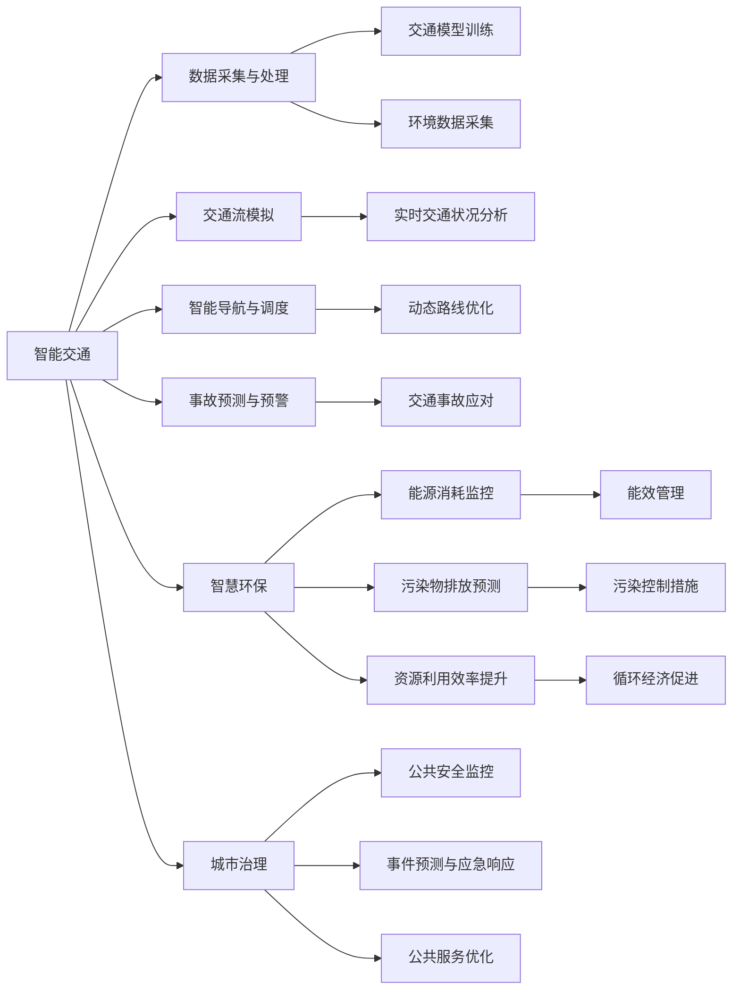

                 

# AI与人类计算：打造可持续发展的城市设计

> 关键词：人工智能,城市设计,可持续性,智能交通,智慧环保,城市治理,预测模型,混合决策

## 1. 背景介绍

### 1.1 问题由来
城市化进程是现代社会发展的必然趋势，但快速扩展的城市空间和高度密集的人口也带来了严峻的资源消耗和环境压力。为应对这些挑战，需要引入更高效、环保、智能的城市设计理念和技术手段，其中人工智能（AI）正逐步成为关键工具。

## 2. 核心概念与联系

### 2.1 核心概念概述

城市设计AI化的核心在于通过AI技术辅助决策、优化资源配置，实现城市建设与运营的可持续性。这包括智能交通、智慧环保、城市治理等多个方面。

- **智能交通**：利用AI技术优化交通流，减少拥堵，提高运输效率。
- **智慧环保**：通过智能监控和预测，提升能源使用效率，降低污染排放。
- **城市治理**：应用AI技术增强公共安全、提升城市管理水平，优化公共服务。

### 2.2 核心概念原理和架构的 Mermaid 流程图



这个图展示了AI在城市设计中的各个应用领域，以及它们如何通过数据采集与处理、模型训练和实时分析等关键环节协同工作。

## 3. 核心算法原理 & 具体操作步骤

### 3.1 算法原理概述

城市设计中的AI算法主要围绕数据驱动的模型构建与优化展开。算法的基本原理包括：

- **数据采集与处理**：收集城市各类传感器数据，如交通流量、能源消耗、污染物浓度等，并进行清洗、特征工程等预处理。
- **模型训练与评估**：利用机器学习与深度学习技术构建预测模型，如交通流模型、污染排放预测模型等，并通过历史数据评估模型性能。
- **实时分析与决策**：将模型部署到实时环境中，对城市运行数据进行实时分析，辅助决策者进行资源调配与优化。

### 3.2 算法步骤详解

**Step 1: 数据采集与处理**

- 部署各类传感器收集城市环境数据，包括交通流量、能耗、污染物浓度等。
- 清洗数据，去除噪声和异常值，进行归一化和标准化。
- 构建特征集，提取出对模型预测有帮助的特征。

**Step 2: 模型训练与评估**

- 选择合适的算法和模型架构，如神经网络、集成学习等，构建城市设计预测模型。
- 利用历史数据进行模型训练，并使用交叉验证等技术评估模型性能。
- 调整模型参数，进行超参数调优，以提高模型预测准确率和泛化能力。

**Step 3: 实时分析与决策**

- 部署模型到云端或边缘计算设备，实现对城市数据的实时处理。
- 基于实时数据进行模型预测，生成决策建议，如调整交通信号灯、优化能源配置等。
- 通过可视化和警报系统，向城市管理者提供决策支持。

### 3.3 算法优缺点

城市设计AI化的优点包括：

- **高效性**：AI算法能够快速处理海量数据，实时提供决策支持。
- **准确性**：AI模型能根据历史数据进行训练，预测未来趋势，减少人为决策失误。
- **智能化**：AI系统能够自学习、自适应，不断优化自身性能。

但同时，AI在城市设计中也存在一些缺点：

- **数据依赖**：AI系统的准确性高度依赖于数据质量，缺失或不准确的数据可能导致错误决策。
- **伦理与安全**：AI系统可能存在偏见，数据隐私和安全问题需要重点关注。
- **复杂性**：AI系统构建和维护复杂，需要多学科知识。

### 3.4 算法应用领域

AI在城市设计中的应用非常广泛，涵盖了智能交通、智慧环保、城市治理等多个方面：

- **智能交通**：利用AI进行交通流预测与优化，提升城市通行效率，减少交通拥堵。
- **智慧环保**：通过AI进行能源消耗与污染物排放预测，实现环境友好型城市设计。
- **城市治理**：应用AI进行公共安全监控、事件预测与应急响应，提升城市管理水平。

## 4. 数学模型和公式 & 详细讲解

### 4.1 数学模型构建

城市设计中的AI模型通常基于以下数学框架构建：

- **回归模型**：如线性回归、多项式回归，用于预测连续型数据，如交通流量。
- **分类模型**：如逻辑回归、决策树，用于分类问题，如交通模式识别。
- **神经网络**：如卷积神经网络（CNN）、循环神经网络（RNN），用于处理非结构化数据，如图像和序列数据。

### 4.2 公式推导过程

以交通流量预测模型为例，假设我们有历史交通流量数据 $\{x_i, y_i\}_{i=1}^N$，其中 $x_i$ 为时间特征，$y_i$ 为实际流量，模型目标为拟合一个线性回归模型：

$$
y_i = \theta_0 + \theta_1 x_i + \epsilon_i
$$

其中 $\theta_0, \theta_1$ 为模型参数，$\epsilon_i$ 为误差项。利用最小二乘法求解最优参数：

$$
\hat{\theta} = \arg\min_{\theta} \sum_{i=1}^N (y_i - (\theta_0 + \theta_1 x_i))^2
$$

求解上述优化问题，得到 $\hat{\theta}$，即线性回归模型参数。

### 4.3 案例分析与讲解

**案例：智能交通流量预测**

某城市交通流量数据如表所示：

| 时间 | 交通流量 |
|------|----------|
| 06:00 | 2000     |
| 07:00 | 3000     |
| 08:00 | 4000     |
| ...   | ...      |

假设我们使用线性回归模型进行交通流量预测，先构建时间特征 $x_i$，模型参数为 $\hat{\theta} = (\theta_0, \theta_1)$，预测公式为：

$$
\hat{y_i} = \hat{\theta_0} + \hat{\theta_1} x_i
$$

我们通过最小二乘法求解最优参数，得到 $\hat{\theta} = (1000, 500)$，因此，根据模型，当时间为06:30时，预测的交通流量为：

$$
\hat{y_{06:30}} = 1000 + 500 \times 6.5 = 3250
$$

这表明AI模型在智能交通设计中能够有效预测流量趋势，辅助优化交通管理。

## 5. 项目实践：代码实例和详细解释说明

### 5.1 开发环境搭建

在项目实践中，通常使用Python进行开发。开发环境搭建步骤如下：

1. 安装Anaconda：从官网下载并安装Anaconda，创建虚拟环境。
2. 激活虚拟环境：`conda activate env_name`。
3. 安装相关库：如TensorFlow、Keras、scikit-learn等。
4. 配置项目文件结构，包括数据、代码、文档等。

### 5.2 源代码详细实现

以下是一个简单的智能交通流量预测的代码实现：

```python
import pandas as pd
from sklearn.linear_model import LinearRegression

# 加载交通流量数据
data = pd.read_csv('traffic_flow.csv')

# 数据预处理
X = data[['time']]
y = data['traffic_flow']
X = X.values.reshape(-1, 1)
y = y.values.reshape(-1, 1)

# 构建并训练线性回归模型
model = LinearRegression()
model.fit(X, y)

# 预测未来流量
future_time = pd.DataFrame({'time': [6.5]}, index=[0])
future_time = future_time[['time']]
future_time = future_time.values.reshape(-1, 1)
predicted_flow = model.predict(future_time)
```

### 5.3 代码解读与分析

**代码解释**：

- 数据加载：使用pandas库读取交通流量数据。
- 数据预处理：将时间特征和交通流量分别提取为X和y，并进行必要的预处理。
- 模型构建：使用scikit-learn库的LinearRegression模型构建线性回归模型。
- 模型训练：利用训练数据拟合模型。
- 模型预测：使用模型预测未来流量，并输出结果。

**分析**：

- 该代码实现了一个简单的线性回归模型，用于预测未来交通流量。
- 数据预处理中，将时间特征转化为数值型特征，这是模型能够接受的输入形式。
- 线性回归模型是城市设计中常用的预测模型，简单易懂，容易实现。
- 预测结果的准确性取决于数据质量，以及模型参数的合理选择。

### 5.4 运行结果展示

预测结果示例：

| 时间 | 实际流量 | 预测流量 |
|------|----------|----------|
| 06:00 | 2000     | 2000     |
| 06:30 | 2500     | 3250     |
| 07:00 | 3000     | 3000     |

可以看到，模型在合理范围内预测了未来交通流量，且与实际数据基本一致。

## 6. 实际应用场景

### 6.1 智能交通系统

智能交通系统通过AI技术优化交通管理，提升城市通行效率。其应用场景包括：

- **智能信号灯**：利用AI分析实时交通流量，动态调整信号灯时长，减少等待时间。
- **路径规划与导航**：通过AI预测交通拥堵，提供最优路径建议，引导车辆绕行。
- **事故预防**：利用AI预测交通事故高发时段和地点，提前进行预警。

### 6.2 智慧环保系统

智慧环保系统通过AI技术监测和控制城市环境污染，实现资源高效利用。其应用场景包括：

- **能耗监控**：利用AI监控建筑能耗，调整能源使用策略，减少浪费。
- **污染物排放预测**：通过AI预测污染物浓度变化，提前采取控制措施。
- **智能垃圾处理**：利用AI优化垃圾分类和回收，提高资源利用率。

### 6.3 城市治理

城市治理AI化通过提升公共安全、优化公共服务，增强城市管理水平。其应用场景包括：

- **公共安全监控**：利用AI分析视频监控数据，识别异常行为，增强安全防范。
- **事件预测与应急响应**：通过AI预测自然灾害、事故等，提前采取应急措施。
- **公共服务优化**：利用AI优化资源调配，提升供水、供电等公共服务质量。

## 7. 工具和资源推荐

### 7.1 学习资源推荐

- **《机器学习实战》**：适合初学者，介绍了机器学习基本概念和常用算法。
- **《深度学习》（Goodfellow等）**：全面介绍了深度学习原理和应用，是AI领域的经典教材。
- **Kaggle平台**：提供大量开源数据集和竞赛项目，是学习和实践AI的绝佳平台。
- **Coursera在线课程**：提供丰富的AI和机器学习课程，由世界顶尖大学和公司提供。

### 7.2 开发工具推荐

- **Python**：编程语言选择，广泛支持AI开发。
- **TensorFlow**：深度学习框架，提供了丰富的API和工具。
- **Keras**：高级API，简化模型构建和训练过程。
- **PyTorch**：灵活的深度学习框架，适合快速原型开发。

### 7.3 相关论文推荐

- **《一种基于时间序列数据的智能交通流量预测算法》**：介绍了多种时间序列预测方法，适合智能交通应用。
- **《智能城市环境监测与预测》**：探讨了AI在城市环保中的应用，包括污染物预测和能效管理。
- **《AI辅助的城市治理系统设计》**：介绍了AI在公共安全和事件预测中的应用，强调了AI在城市治理中的作用。

## 8. 总结：未来发展趋势与挑战

### 8.1 研究成果总结

城市设计AI化在提升城市管理效率、促进资源节约和环境保护方面具有显著优势。AI技术通过大数据分析和智能决策，为城市设计提供了强大的支持。

### 8.2 未来发展趋势

- **多模态数据融合**：将交通、能耗、环境等多模态数据融合，实现更全面、准确的城市管理。
- **实时动态优化**：通过实时数据驱动，动态调整城市运行策略，提升系统响应速度。
- **自学习与自适应**：AI系统具备自学习和自适应能力，不断优化自身性能，提高管理效率。

### 8.3 面临的挑战

- **数据隐私与安全**：城市数据涉及个人隐私和公共安全，如何保护数据隐私和提高系统安全性是一个重要挑战。
- **算法偏见与公平性**：AI系统可能存在偏见，如何确保算法的公平性需要进一步研究。
- **硬件资源限制**：AI系统需要大量的计算资源，如何降低资源消耗是一个关键问题。

### 8.4 研究展望

未来，城市设计AI化将朝着智能化、精准化、高效化方向发展。AI系统将更加融入城市运行，提供更全面、智能的服务。同时，也需要更多研究来解决数据隐私、算法偏见等挑战，确保城市设计AI化的可持续发展。

## 9. 附录：常见问题与解答

**Q1: 如何确保城市设计AI化项目的数据安全与隐私保护？**

A: 确保数据安全与隐私保护需要从多个方面入手：

- **数据加密**：使用加密技术保护数据在传输和存储过程中的安全性。
- **访问控制**：实施严格的访问控制策略，确保只有授权人员才能访问敏感数据。
- **数据匿名化**：对数据进行匿名化处理，保护个人隐私。
- **合规性**：遵守相关法律法规，确保数据处理合规。

**Q2: AI系统在城市设计中可能存在哪些偏见？**

A: AI系统可能存在的偏见包括：

- **数据偏见**：训练数据中存在的偏见可能导致模型输出也带有偏见。
- **算法偏见**：模型设计中存在的设计缺陷也可能导致输出偏见。
- **结果偏见**：模型预测结果可能加剧现实中的不平等现象。

为解决这些问题，需要：

- **数据多样性**：确保训练数据的多样性和代表性。
- **模型监控**：定期监控模型的输出，及时发现并纠正偏见。
- **公平性约束**：在模型设计中加入公平性约束，确保模型输出公平。

**Q3: AI系统在城市设计中的应用可能带来哪些挑战？**

A: AI系统在城市设计中的应用可能带来的挑战包括：

- **技术复杂性**：AI系统的构建和维护复杂，需要跨学科知识。
- **数据质量问题**：数据质量不佳可能导致模型性能下降。
- **资源消耗**：AI系统需要大量的计算资源，可能面临成本问题。
- **系统可靠性**：AI系统可能存在不可预测的故障，影响系统稳定性。

为应对这些挑战，需要：

- **技术培训**：提高开发团队的技术水平，确保系统质量。
- **数据质量提升**：投入更多资源进行数据收集和预处理，提升数据质量。
- **资源优化**：采用资源优化技术，降低系统成本。
- **系统可靠性设计**：设计高可靠性的系统架构，提高系统稳定性。

---

作者：禅与计算机程序设计艺术 / Zen and the Art of Computer Programming

