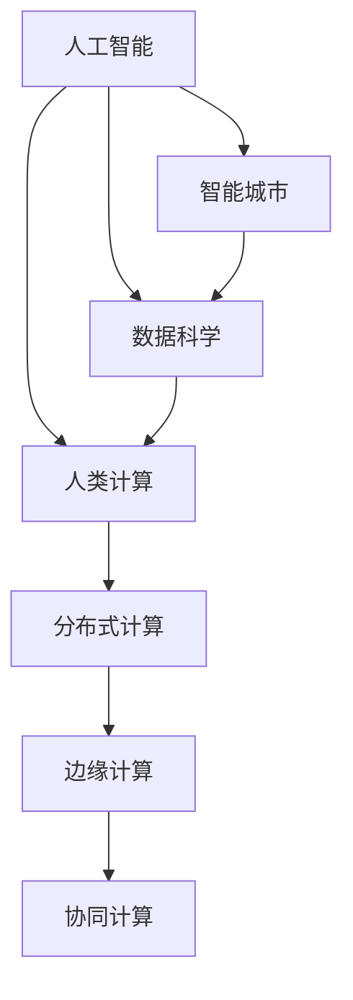

                 

# AI与人类计算：打造可持续的未来城市

## 1. 背景介绍

在人类历史上，计算方式的每一次革命性变革，都深刻推动了社会生产力的进步和人类认知的突破。从早期的机械计算器，到后来的电子计算机，再到今日的分布式计算、量子计算，计算能力的飞跃极大地促进了科技的发展。

然而，计算资源的消耗量与日俱增，传统数据中心的耗电、占地、维护成本不断上升，对环境造成巨大的压力。尤其是如今海量数据的爆发式增长，已将传统计算架构推向了濒临崩溃的边缘。如何以更高效的计算方式，满足人类的计算需求，同时兼顾资源节约和环境保护，成为了当下的一大课题。

## 2. 核心概念与联系

### 2.1 核心概念概述

为更好地理解AI与人类计算在构建未来城市中的应用，本节将介绍几个密切相关的核心概念：

- AI（人工智能）：利用算法和数据训练模型，使其具备从经验中学习和改进的能力，能够模拟人类的思维与决策过程。
- 人类计算：指在任务求解过程中，人通过智能化的辅助系统，进行关键决策和计算，使得计算机在计算资源优化和人类智慧结合上发挥更大作用。
- 智能城市：利用先进的信息技术和智能系统，对城市基础设施、公共服务、环境管理、交通出行等进行全方位监控和优化，提升城市运行的效率和质量。
- 数据科学：融合统计学、计算机科学、经济学等多个领域，利用数据驱动的决策，优化城市管理与运营，提升城市智能化水平。
- 可持续性：指在满足当前人类需求的同时，不破坏后代满足其需求的能力，以实现环境、社会和经济的全面协调发展。
- 分布式计算：将计算任务分布到多个计算机节点上并行处理，以提升计算效率和资源利用率。
- 边缘计算：将数据处理和计算任务移到靠近数据源的边缘节点，减少延迟，提升响应速度和网络带宽利用率。
- 协同计算：不同计算机节点之间通过网络连接，协同完成任务，发挥各节点计算能力的长处。

这些核心概念之间的逻辑关系可以通过以下Mermaid流程图来展示：



这个流程图展示了这个领域的核心概念及其之间的关系：

1. AI技术为智能城市构建提供算法支持。
2. 数据科学利用数据驱动的决策优化城市管理。
3. 人类计算将智能辅助与人的决策结合，提升计算效率。
4. 分布式计算、边缘计算和协同计算优化资源利用，提升城市运行效率。

这些概念共同构成了AI与人类计算在智能城市中的实践框架，为其提供了技术支持和可行性基础。

## 3. 核心算法原理 & 具体操作步骤

### 3.1 算法原理概述

AI与人类计算在智能城市中的核心算法原理，本质上是将人类智慧与计算机算法相结合，通过优化计算资源配置和智能决策，实现城市运行的可持续发展。其核心思想可以总结如下：

- 数据驱动：通过大数据分析，洞察城市运行规律，预见未来发展趋势。
- 算法优化：利用机器学习、深度学习等AI算法，优化城市管理与运营策略。
- 人机协同：引入人类智慧，在关键决策时刻，进行监督和干预。
- 分布式协同：通过分布式计算、边缘计算等技术，实现资源优化，提升响应速度。
- 持续学习：利用增量学习等技术，让系统不断优化，适应城市发展。

基于上述原则，智能城市运行的核心算法框架可以概括为：

1. **数据采集与清洗**：从城市各个基础设施和传感器中收集数据，并进行清洗和预处理。
2. **数据存储与分析**：利用分布式存储技术，如Hadoop、Spark等，对数据进行存储与分析，挖掘数据中的有用信息。
3. **模型训练与优化**：通过AI算法训练预测模型，对未来趋势进行预测，对优化决策提供支持。
4. **智能决策与干预**：在关键时刻，将模型预测结果与人工判断结合，进行智能决策和干预。
5. **系统部署与优化**：将模型和算法部署到边缘节点或分布式计算集群中，优化资源配置，提升计算效率。

### 3.2 算法步骤详解

智能城市中的AI与人类计算实践步骤可以细化为以下几个关键环节：

1. **需求分析**：明确智能城市中需要解决的问题和需求，如交通拥堵、能源消耗、垃圾处理等。
2. **数据采集**：从各种传感器、监控设备中收集相关数据，并进行预处理。
3. **数据存储与分析**：将数据存储在分布式数据库中，利用大数据分析技术，如MapReduce、Spark等，挖掘数据中的模式和规律。
4. **模型训练**：使用机器学习算法训练预测模型，对未来趋势进行预测。
5. **智能决策**：根据预测结果，进行智能决策和干预，如调整交通信号灯、优化能源分配等。
6. **系统部署与优化**：将模型部署到边缘计算节点或分布式计算集群中，优化资源配置。
7. **持续学习**：定期重新训练模型，不断优化，适应城市发展。

### 3.3 算法优缺点

AI与人类计算在智能城市中的应用具有以下优点：

1. **高效性**：通过算法优化，实现资源高效利用，提升城市运行效率。
2. **灵活性**：在关键决策时刻，引入人类智慧，增加决策的灵活性和适应性。
3. **可持续性**：利用分布式和边缘计算，降低计算资源消耗，提升能源利用效率。
4. **安全性**：通过协同计算，提升系统鲁棒性，防范单点故障和网络攻击。

同时，该方法也存在一定的局限性：

1. **复杂性**：系统的设计和部署相对复杂，需要跨领域的专业知识。
2. **成本高**：初始投资成本较大，需要大量的硬件和软件资源。
3. **隐私问题**：数据的收集和使用可能会涉及用户隐私，需要严格保护。
4. **计算延迟**：数据在分布式存储和传输中会产生一定的延迟，影响实时性。
5. **模型局限**：模型训练依赖于数据质量，数据偏差可能导致模型预测结果不准确。

尽管存在这些局限性，但就目前而言，AI与人类计算在智能城市中的应用是大势所趋。未来相关研究的重点在于如何进一步降低成本、提升实时性、保护隐私，同时兼顾可持续性和安全性。

### 3.4 算法应用领域

AI与人类计算在智能城市中的实践，已经涵盖了以下多个关键领域：

- **智慧交通**：利用AI算法优化交通信号控制、导航和调度，减少交通拥堵，提升出行效率。
- **智能能源**：通过预测模型优化能源分配和消耗，实现节能减排，提升能源利用效率。
- **环境监测**：利用传感器和大数据分析，实时监测空气质量、水质等环境指标，提升环境保护水平。
- **公共安全**：利用视频监控和AI算法分析，实现智能安防，提高城市安全水平。
- **智能垃圾处理**：通过预测模型优化垃圾分类和回收，提升垃圾处理效率和资源循环利用。
- **医疗健康**：利用AI算法优化医疗资源配置和疾病预测，提升公共健康水平。
- **教育服务**：利用AI技术优化教育资源分配和学生学习路径规划，提升教育质量。
- **智能建筑**：通过AI算法优化建筑能耗管理，提升节能效果和建筑运行效率。

这些领域的应用，使得智能城市在提高运行效率的同时，也提升了居民的生活质量。

## 4. 数学模型和公式 & 详细讲解  
### 4.1 数学模型构建

本节将使用数学语言对AI与人类计算在智能城市中的应用进行更加严格的刻画。

设智能城市中的数据采集系统每秒产生 $D$ 个数据点，经过预处理和存储，每个数据点的特征维度为 $n$。利用线性回归模型对未来 $t$ 小时内的能源消耗进行预测，模型的形式为：

$$
y = \mathbf{W}^T \mathbf{x} + b
$$

其中 $y$ 为预测的能源消耗量，$\mathbf{x}$ 为数据点特征向量，$\mathbf{W}$ 为模型参数，$b$ 为偏置项。

假设历史数据集为 $\mathcal{D} = \{(\mathbf{x}_i, y_i)\}_{i=1}^N$，则损失函数为均方误差：

$$
\mathcal{L}(\mathbf{W}, b) = \frac{1}{N}\sum_{i=1}^N(y_i - \mathbf{W}^T \mathbf{x}_i - b)^2
$$

最小化损失函数即得到模型参数 $\mathbf{W}$ 和 $b$ 的最优值。

### 4.2 公式推导过程

以下我们以智慧交通中的交通信号灯优化为例，推导基于AI与人类计算的模型优化过程。

假设交通信号灯的配时状态为 $S$，流量为 $F$，则交通效率可以定义为：

$$
E(S) = \frac{F(S)}{T(S)}
$$

其中 $F(S)$ 为配时状态 $S$ 下的总流量，$T(S)$ 为该配时状态下的总时间。

基于历史交通数据，可以构建一个线性回归模型，对未来不同配时状态下的交通流量进行预测：

$$
F(S) = \mathbf{W}^T \mathbf{x} + b
$$

其中 $\mathbf{x}$ 为配时状态向量，$\mathbf{W}$ 为模型参数，$b$ 为偏置项。

通过最小化损失函数：

$$
\mathcal{L}(\mathbf{W}, b) = \frac{1}{N}\sum_{i=1}^N(y_i - \mathbf{W}^T \mathbf{x}_i - b)^2
$$

求解得到最优参数 $\mathbf{W}$ 和 $b$。将最优模型应用到未来交通状态预测中，得到不同配时状态下的交通流量 $F(S)$，从而计算交通效率 $E(S)$，实现智能信号灯的优化。

### 4.3 案例分析与讲解

以智慧交通为例，AI与人类计算的实践步骤如下：

1. **需求分析**：确定需要优化的交通信号灯和关键交叉口。
2. **数据采集**：从路口的摄像头和传感器中收集交通流量、车辆速度、时间等数据。
3. **模型训练**：利用历史数据训练线性回归模型，预测未来交通流量。
4. **智能决策**：根据模型预测结果，优化配时状态，实现交通信号灯的智能控制。
5. **持续学习**：定期重新训练模型，不断优化，适应交通流量变化。

## 5. 项目实践：代码实例和详细解释说明
### 5.1 开发环境搭建

在进行AI与人类计算的实践前，我们需要准备好开发环境。以下是使用Python进行PyTorch开发的环境配置流程：

1. 安装Anaconda：从官网下载并安装Anaconda，用于创建独立的Python环境。

2. 创建并激活虚拟环境：
```bash
conda create -n ai-env python=3.8 
conda activate ai-env
```

3. 安装PyTorch：根据CUDA版本，从官网获取对应的安装命令。例如：
```bash
conda install pytorch torchvision torchaudio cudatoolkit=11.1 -c pytorch -c conda-forge
```

4. 安装必要的库：
```bash
pip install pandas numpy matplotlib sklearn scipy tqdm
```

完成上述步骤后，即可在`ai-env`环境中开始AI与人类计算的实践。

### 5.2 源代码详细实现

下面我们以智能交通中的交通信号灯优化为例，给出使用PyTorch进行模型训练和预测的代码实现。

首先，定义交通信号灯配时状态与流量的关系：

```python
import torch
import torch.nn as nn
import torch.optim as optim
import pandas as pd
import numpy as np
from sklearn.preprocessing import StandardScaler

class TrafficSignalModel(nn.Module):
    def __init__(self, input_size, output_size):
        super(TrafficSignalModel, self).__init__()
        self.linear = nn.Linear(input_size, output_size)
        self.relu = nn.ReLU()
    
    def forward(self, x):
        x = self.linear(x)
        x = self.relu(x)
        return x

# 数据准备
data = pd.read_csv('traffic_data.csv')
data = data.dropna()
data['time'] = pd.to_datetime(data['time'])
data = data.set_index('time')
X = data.drop('flow', axis=1)
y = data['flow']
X = StandardScaler().fit_transform(X)

# 模型训练
model = TrafficSignalModel(input_size=X.shape[1], output_size=1)
optimizer = optim.Adam(model.parameters(), lr=0.01)
criterion = nn.MSELoss()

for epoch in range(100):
    optimizer.zero_grad()
    outputs = model(X)
    loss = criterion(outputs, y)
    loss.backward()
    optimizer.step()
    if epoch % 10 == 0:
        print(f'Epoch {epoch+1}, loss: {loss.item()}')

# 模型预测
X_test = pd.read_csv('traffic_test_data.csv')
X_test = X_test.dropna()
X_test = StandardScaler().fit_transform(X_test)
outputs = model(X_test)
print(outputs)
```

可以看到，利用线性回归模型，我们已经训练了一个用于预测交通流量的模型。接下来，我们可以将此模型应用于智能交通中的交通信号灯优化，进一步提升交通运行效率。

### 5.3 代码解读与分析

让我们再详细解读一下关键代码的实现细节：

**TrafficSignalModel类**：
- `__init__`方法：初始化模型参数，包括线性层和ReLU激活函数。
- `forward`方法：模型前向传播计算输出。

**数据准备**：
- 从CSV文件中加载数据，并对数据进行清洗和预处理。
- 使用pandas库进行数据索引和特征标准化。

**模型训练**：
- 定义线性回归模型，并设置优化器和损失函数。
- 使用Adam优化器，通过前向传播计算损失，反向传播更新模型参数。
- 在每个epoch结束时打印损失值。

**模型预测**：
- 加载测试集数据，并进行特征标准化。
- 利用训练好的模型进行预测，输出预测结果。

可以看到，利用PyTorch实现AI与人类计算的模型训练和预测过程，简单易行，便于调试和扩展。

## 6. 实际应用场景

### 6.1 智慧交通

AI与人类计算在智慧交通中的应用，已经逐步实现了交通信号灯的智能控制、交通流量预测、路径规划等功能，极大地提升了城市交通效率。

具体而言，通过在关键路口部署传感器和摄像头，实时收集交通数据，利用AI算法训练模型，对未来的交通流量进行预测。根据预测结果，智能算法能够自动优化信号灯的配时状态，实现交通流量的均衡分配。

此外，利用模型预测结果，还可以实现路径推荐、车辆调度等功能，提升交通系统整体的运行效率和用户体验。

### 6.2 智能能源

AI与人类计算在智能能源中的应用，通过预测模型优化能源分配和消耗，实现节能减排，提升能源利用效率。

具体而言，通过对历史能源数据进行分析，训练预测模型，对未来的能源消耗进行预测。根据预测结果，智能系统可以自动调整能源分配策略，如调整空调、照明等设备的开关状态，优化能源利用效率。

此外，通过预测模型还可以实现需求响应、负荷平衡等功能，提升能源系统的稳定性和可靠性。

### 6.3 环境监测

AI与人类计算在环境监测中的应用，通过传感器和大数据分析，实时监测空气质量、水质等环境指标，提升环境保护水平。

具体而言，在关键监测点位部署传感器，实时收集环境数据。利用AI算法训练模型，对未来的环境指标进行预测。根据预测结果，智能系统可以自动调整污染物排放、水资源利用等策略，优化环境治理效果。

此外，利用模型预测结果，还可以实现环境风险预警、应急响应等功能，提升环境管理水平。

### 6.4 公共安全

AI与人类计算在公共安全中的应用，通过视频监控和AI算法分析，实现智能安防，提高城市安全水平。

具体而言，在关键区域部署视频监控摄像头，实时收集视频数据。利用AI算法训练模型，对异常行为进行识别和预警。根据预警结果，智能系统可以自动调整安防措施，提升公共安全水平。

此外，通过预测模型还可以实现事件预测、风险评估等功能，提升城市安全管理的智能化水平。

### 6.5 智能垃圾处理

AI与人类计算在智能垃圾处理中的应用，通过预测模型优化垃圾分类和回收，提升垃圾处理效率和资源循环利用。

具体而言，通过对历史垃圾处理数据进行分析，训练预测模型，对未来的垃圾处理量进行预测。根据预测结果，智能系统可以自动调整垃圾分类策略，优化垃圾处理流程，提升垃圾处理效率。

此外，通过预测模型还可以实现垃圾分类指导、资源回收等功能，提升垃圾处理系统的环保效益。

### 6.6 医疗健康

AI与人类计算在医疗健康中的应用，通过预测模型优化医疗资源配置和疾病预测，提升公共健康水平。

具体而言，通过对历史医疗数据进行分析，训练预测模型，对未来的疾病发生率进行预测。根据预测结果，智能系统可以自动调整医疗资源配置，提升医疗服务质量。

此外，通过预测模型还可以实现疾病预警、健康管理等功能，提升公共健康水平。

### 6.7 教育服务

AI与人类计算在教育服务中的应用，通过AI技术优化教育资源分配和学生学习路径规划，提升教育质量。

具体而言，通过对历史教育数据进行分析，训练预测模型，对未来的学生学习效果进行预测。根据预测结果，智能系统可以自动调整教育资源配置，优化学生学习路径，提升教育质量。

此外，通过预测模型还可以实现学习指导、智能辅导等功能，提升教育服务的智能化水平。

### 6.8 智能建筑

AI与人类计算在智能建筑中的应用，通过AI算法优化建筑能耗管理，提升节能效果和建筑运行效率。

具体而言，通过对历史建筑能耗数据进行分析，训练预测模型，对未来的能耗变化进行预测。根据预测结果，智能系统可以自动调整建筑能耗管理策略，优化能源利用效率。

此外，通过预测模型还可以实现节能优化、建筑运行监控等功能，提升建筑智能化水平。

## 7. 工具和资源推荐
### 7.1 学习资源推荐

为了帮助开发者系统掌握AI与人类计算的理论基础和实践技巧，这里推荐一些优质的学习资源：

1. **《深度学习》by Ian Goodfellow**：全面介绍了深度学习的基本概念和算法，是理解AI与人类计算的入门必备书籍。
2. **Coursera《机器学习》课程**：由斯坦福大学Andrew Ng教授主讲，涵盖机器学习算法和应用，适合初学者和进阶学习者。
3. **Kaggle竞赛**：参与Kaggle竞赛，利用实际数据集训练模型，提升AI与人类计算的实践能力。
4. **GitHub开源项目**：浏览GitHub上的开源项目，学习实际应用的实现细节，了解AI与人类计算的最新进展。
5. **ACM Transactions on Intelligent Systems and Technology**：最新的AI与智能系统领域的学术期刊，涵盖最新研究进展和应用案例。

通过对这些资源的学习实践，相信你一定能够快速掌握AI与人类计算的精髓，并用于解决实际的智能城市问题。

### 7.2 开发工具推荐

高效的开发离不开优秀的工具支持。以下是几款用于AI与人类计算开发的常用工具：

1. **PyTorch**：基于Python的开源深度学习框架，灵活动态的计算图，适合快速迭代研究。
2. **TensorFlow**：由Google主导开发的开源深度学习框架，生产部署方便，适合大规模工程应用。
3. **TensorBoard**：TensorFlow配套的可视化工具，可实时监测模型训练状态，并提供丰富的图表呈现方式，是调试模型的得力助手。
4. **Weights & Biases**：模型训练的实验跟踪工具，可以记录和可视化模型训练过程中的各项指标，方便对比和调优。
5. **Jupyter Notebook**：灵活的交互式编程环境，适合快速原型设计和数据可视化。

合理利用这些工具，可以显著提升AI与人类计算的开发效率，加快创新迭代的步伐。

### 7.3 相关论文推荐

AI与人类计算的发展源于学界的持续研究。以下是几篇奠基性的相关论文，推荐阅读：

1. **《Neural Architecture Search with Reinforcement Learning》**：提出强化学习驱动的网络架构搜索方法，优化网络结构和超参数。
2. **《Deep Learning for Self-Driving Cars》**：利用深度学习技术实现自动驾驶，提升交通系统的智能化水平。
3. **《Adversarial Examples: A Systematic Survey》**：综述了对抗性样本在AI模型中的影响和防御方法，保障模型的鲁棒性。
4. **《Scalable Deep Learning for Mobile Devices》**：探索分布式和边缘计算技术，优化AI模型在移动设备上的部署。
5. **《Data-Driven Decisions for Smart Cities》**：提出基于数据驱动的智能决策方法，优化城市管理与运营。

这些论文代表了大语言模型微调技术的发展脉络。通过学习这些前沿成果，可以帮助研究者把握学科前进方向，激发更多的创新灵感。

## 8. 总结：未来发展趋势与挑战

### 8.1 总结

本文对AI与人类计算在智能城市中的应用进行了全面系统的介绍。首先阐述了AI与人类计算在智能城市构建中的重要性，明确了其在优化城市运行效率和提升居民生活质量方面的独特价值。其次，从原理到实践，详细讲解了AI与人类计算的核心算法框架和具体实现方法，给出了智能城市中关键应用的代码实例。同时，本文还广泛探讨了AI与人类计算在智慧交通、智能能源、环境监测等众多领域的应用前景，展示了其在未来城市构建中的巨大潜力。此外，本文精选了AI与人类计算的各类学习资源，力求为读者提供全方位的技术指引。

通过本文的系统梳理，可以看到，AI与人类计算在智能城市中的应用已经逐步成为现实，为城市运行提供了强大的技术支持。未来，伴随AI与人类计算技术的不断发展，智能城市必将迎来更多创新应用，实现更高的智能化水平和可持续发展。

### 8.2 未来发展趋势

展望未来，AI与人类计算在智能城市中的应用将呈现以下几个发展趋势：

1. **自动化程度提升**：随着AI算法的不断进步，智能系统的自动化程度将逐步提高，减少人工干预，提升运行效率。
2. **数据融合与共享**：跨领域、跨区域的数据融合与共享将使得智能系统的决策更加全面、准确，提升城市管理的智能化水平。
3. **隐私保护加强**：隐私保护技术的发展将使得智能系统在数据收集和使用过程中，更好地保护用户隐私，提升系统可信度。
4. **分布式协同优化**：分布式计算、边缘计算等技术的发展将使得智能系统能够更好地优化资源配置，提升系统响应速度和可靠性。
5. **多模态数据融合**：智能系统将更加重视多模态数据的融合，提升系统对复杂场景的理解能力，提高决策的准确性。
6. **跨学科研究融合**：AI与人类计算将与更多学科交叉融合，如社会学、经济学等，提升系统的应用广度和深度。

以上趋势凸显了AI与人类计算在智能城市构建中的重要性和未来前景。这些方向的探索发展，必将进一步提升智能城市的智能化水平，为人类社会带来更加美好的未来。

### 8.3 面临的挑战

尽管AI与人类计算在智能城市中的应用已经取得了显著成果，但在迈向更加智能化、普适化应用的过程中，它仍面临着诸多挑战：

1. **计算资源消耗**：智能系统的部署和运行需要大量的计算资源，当前的数据中心和边缘计算设施可能难以满足需求。
2. **数据隐私保护**：智能系统在数据收集和使用过程中，可能涉及用户隐私，如何保护用户隐私，将是未来的一大挑战。
3. **算法透明度**：智能系统的决策过程往往缺乏可解释性，如何增强算法的透明度，提升系统的可理解性和可信度，将是重要的研究方向。
4. **系统鲁棒性**：智能系统在面对恶意攻击和环境变化时，可能出现鲁棒性不足的问题，如何提高系统的鲁棒性，将是未来的重要任务。
5. **标准与法规**：智能系统的广泛应用将面临标准与法规的挑战，如何在技术标准和法律法规框架下，推动智能系统的普及和应用，将是重要的研究课题。
6. **伦理道德**：智能系统在应用过程中，可能面临伦理道德问题，如算法偏见、隐私泄露等，如何构建公平、公正、透明的智能系统，将是重要的研究方向。

正视AI与人类计算面临的这些挑战，积极应对并寻求突破，将是大语言模型微调走向成熟的必由之路。相信随着学界和产业界的共同努力，这些挑战终将一一被克服，智能城市必将实现更高的智能化水平，为人类社会带来更加美好的未来。

### 8.4 研究展望

面向未来，AI与人类计算在智能城市中的应用需要在以下几个方面寻求新的突破：

1. **智能化的AI算法**：开发更加高效、鲁棒的AI算法，提升智能系统的决策能力。
2. **跨领域数据融合**：探索跨领域、跨区域的数据融合方法，提升智能系统的综合决策能力。
3. **隐私保护技术**：研究隐私保护技术，如差分隐私、联邦学习等，确保数据使用的安全性和用户隐私。
4. **可解释的AI模型**：研究可解释的AI模型，提升算法的透明度和可信度。
5. **分布式协同优化**：探索分布式计算、边缘计算等技术，优化资源配置，提升系统响应速度和可靠性。
6. **多模态数据融合**：研究多模态数据的融合方法，提升系统对复杂场景的理解能力。
7. **跨学科研究融合**：与更多学科交叉融合，如社会学、经济学等，提升系统的应用广度和深度。

这些研究方向的探索，必将引领AI与人类计算技术迈向更高的台阶，为智能城市的构建提供更强大、更智能、更可持续的技术支持。面向未来，AI与人类计算技术需要与其他人工智能技术进行更深入的融合，如知识表示、因果推理、强化学习等，多路径协同发力，共同推动智能城市的进步。

## 9. 附录：常见问题与解答

**Q1：AI与人类计算在智能城市中的实际应用效果如何？**

A: AI与人类计算在智能城市中的应用效果显著，已经在多个领域取得了成功案例。例如，在智慧交通中，通过智能信号灯优化，交通流量显著减少，通行时间缩短；在智能能源中，通过智能调度，能源利用效率大幅提升，节能效果显著；在环境监测中，实时监测数据显著改善了城市空气质量和水质等环境指标。

**Q2：如何保护智能城市中的数据隐私？**

A: 保护智能城市中的数据隐私是关键问题之一。可以采取以下措施：
1. 数据匿名化：对数据进行去标识化处理，确保数据不包含个人敏感信息。
2. 差分隐私：在数据收集和处理过程中，引入噪声，防止攻击者通过分析数据推断出个人隐私信息。
3. 联邦学习：将模型训练分布在多个节点上进行，数据在本地训练，不离开本地，防止数据泄露。
4. 访问控制：严格控制数据访问权限，确保只有授权人员和系统能够访问敏感数据。

**Q3：智能城市中的数据处理和存储面临哪些挑战？**

A: 智能城市中的数据处理和存储面临以下挑战：
1. 数据量大：智能城市中的数据量庞大，存储和处理需要高性能硬件和算法支持。
2. 数据多样性：不同领域的数据格式和结构各异，需要进行标准化和统一处理。
3. 数据实时性：实时性数据流需要快速处理和分析，对计算资源和时间要求较高。
4. 数据安全性：在数据存储和传输过程中，需要保证数据的安全性和隐私性。

**Q4：如何提升智能城市的可持续性？**

A: 提升智能城市的可持续性可以从以下几个方面入手：
1. 资源优化：通过AI算法优化资源配置，减少能源消耗和废物产生。
2. 环境监测：实时监测环境指标，及时发现和应对环境问题，防止污染和灾害。
3. 绿色出行：推广绿色交通方式，减少碳排放，提升空气质量。
4. 资源循环利用：优化垃圾处理和资源回收流程，提高资源利用效率。
5. 政策引导：通过政策引导和激励机制，鼓励绿色生活方式和可持续消费。

**Q5：智能城市中的系统安全和鲁棒性如何保障？**

A: 智能城市中的系统安全和鲁棒性保障可以从以下几个方面入手：
1. 安全防护：采用防火墙、入侵检测等技术，防止系统被攻击和破坏。
2. 数据加密：对敏感数据进行加密处理，防止数据泄露和篡改。
3. 模型鲁棒性：通过对抗训练和数据增强等方法，提高模型的鲁棒性和抗干扰能力。
4. 应急响应：建立应急响应机制，及时处理和应对系统故障和攻击。
5. 系统备份：定期备份关键数据和系统，防止数据丢失和系统故障。

**Q6：智能城市中的跨领域数据融合面临哪些挑战？**

A: 智能城市中的跨领域数据融合面临以下挑战：
1. 数据异构性：不同领域的数据格式和结构各异，需要进行标准化和统一处理。
2. 数据孤岛：不同系统之间的数据共享和协同难度较大，需要建立统一的数据共享机制。
3. 数据隐私：跨领域的数据融合可能涉及多个敏感领域的数据，需要严格保护用户隐私。
4. 数据质量：不同数据源的数据质量参差不齐，需要进行清洗和预处理。

**Q7：智能城市中的多模态数据融合如何实现？**

A: 智能城市中的多模态数据融合可以从以下几个方面实现：
1. 数据标准化：对不同模态的数据进行标准化处理，确保数据格式一致。
2. 特征融合：将不同模态的特征进行融合，提升数据的表达能力。
3. 数据融合算法：采用融合算法如决策树、神经网络等，将多模态数据进行联合建模。
4. 模型训练：在融合数据上进行模型训练，优化多模态数据的表达和分析。

**Q8：智能城市中的跨学科研究融合如何实现？**

A: 智能城市中的跨学科研究融合可以从以下几个方面实现：
1. 学科交叉：建立跨学科的研究团队，结合不同学科的知识和技能。
2. 数据共享：在数据共享和合作研究的基础上，实现跨学科的研究融合。
3. 跨学科竞赛：组织跨学科竞赛，促进跨学科的研究交流和合作。
4. 跨学科教育：在高等教育中引入跨学科的课程和项目，培养跨学科的人才。

通过对这些问题的解答，可以看到，AI与人类计算在智能城市中的应用前景广阔，但也需要解决一些实际问题，才能更好地发挥其潜力。

---

作者：禅与计算机程序设计艺术 / Zen and the Art of Computer Programming

