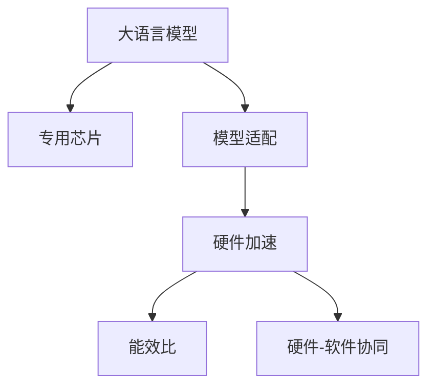

                 

# AI专用芯片：驱动LLM性能提升

在当今AI的浪潮中，大语言模型（LLM）以其卓越的自然语言处理能力，成为众多应用的核心动力。然而，在追求模型参数量、计算资源和性能的持续提升过程中，传统通用CPU和GPU已难以满足需求，推动了大规模并行计算架构的发展，进而催生了专为人工智能设计的专用芯片。本文将探讨这些专用芯片如何显著提升大语言模型的性能，并概述其在各个应用场景中的关键应用。

## 1. 背景介绍

### 1.1 问题由来

随着深度学习技术的飞速发展，大语言模型（Large Language Models, LLMs）在自然语言处理（NLP）领域取得了巨大突破。这些模型如GPT系列、BERT等，通过在大规模无标签文本数据上进行预训练，学习到丰富的语言知识和常识，并能够在多种下游任务中展现出色性能。

然而，大模型训练和推理过程中对计算资源的需求不断增加，传统的通用CPU和GPU已难以支撑这一需求。此外，通用硬件架构的能效比并不优，导致模型训练和推理过程能耗巨大，不仅影响环境，也限制了模型的规模和效率。因此，专为AI设计的专用芯片应运而生，旨在提升大语言模型的计算效率、降低能耗，并推动模型性能的提升。

### 1.2 问题核心关键点

基于专用芯片的大语言模型性能提升涉及以下几个核心问题：

- **专用芯片架构设计**：如何设计高效的专用芯片架构，以支持深度学习计算，特别是深度神经网络的训练和推理。
- **模型适配与优化**：如何将大模型适配到专用芯片上，并针对硬件特性进行优化，以达到最佳性能。
- **能效比提升**：如何降低能耗，提升芯片的能效比，使模型训练和推理过程更加环保高效。
- **硬件-软件协同**：如何实现硬件与软件的协同工作，使专用芯片能够充分发挥其计算能力。

通过解决这些问题，专用芯片能够显著提升大语言模型的性能，为更多AI应用场景提供强有力的技术支持。

## 2. 核心概念与联系

### 2.1 核心概念概述

为更好地理解专用芯片对大语言模型性能提升的作用，本节将介绍几个密切相关的核心概念：

- **大语言模型（LLM）**：如GPT、BERT等，通过在大规模无标签文本数据上进行预训练，学习到语言的通用表示。
- **专用芯片（AI chip）**：专为AI设计，具有高并行计算能力和低能耗特性的硬件。
- **模型适配（Model Adaptation）**：将大模型适配到专用芯片上，以优化模型性能和资源利用率。
- **硬件加速（Hardware Acceleration）**：利用专用芯片进行模型训练和推理的加速过程。
- **能效比（Energy Efficiency Ratio, EER）**：计算性能与能耗的比率，衡量专用芯片的能效性能。
- **硬件-软件协同（Hardware-Software Co-Design）**：硬件设计优化与软件优化的紧密结合，以实现性能和能效的最优化。

这些概念之间的逻辑关系可以通过以下Mermaid流程图来展示：



这个流程图展示了大语言模型、专用芯片、模型适配、硬件加速、能效比和硬件-软件协同之间的关系：

1. 大语言模型通过专用芯片进行硬件加速，提升计算效率。
2. 模型适配使大模型能够更好地适配到专用芯片上。
3. 能效比是衡量专用芯片性能的重要指标，直接影响模型的运行成本和环境影响。
4. 硬件-软件协同设计进一步优化了专用芯片的性能和能效。

## 3. 核心算法原理 & 具体操作步骤

### 3.1 算法原理概述

基于专用芯片的大语言模型性能提升，本质上是一个硬件加速的计算过程。其核心思想是利用专用芯片的高并行计算能力，通过模型适配和优化，在特定硬件架构上实现大模型的高效训练和推理。

形式化地，假设大语言模型为 $M_{\theta}$，其中 $\theta$ 为模型参数。在专用芯片上，通过模型适配和优化，得到适配后的模型 $M_{\hat{\theta}}$。适配过程通常包括参数优化、数据流优化、硬件并行度优化等。适配后的模型 $M_{\hat{\theta}}$ 在专用芯片上实现硬件加速，计算性能大大提升。

### 3.2 算法步骤详解

基于专用芯片的大语言模型性能提升一般包括以下几个关键步骤：

**Step 1: 专用芯片选择与适配**

- 选择与大模型适配的专用芯片，如NVIDIA的Tensor Core芯片、Google的TPU、Intel的Gaudi芯片等。
- 根据大模型的结构，设计适配到专用芯片的计算图，并进行必要的优化，如参数量化、模型剪枝等。

**Step 2: 硬件加速实现**

- 将适配后的计算图加载到专用芯片上，利用其高并行计算能力进行模型训练和推理。
- 优化数据流，确保数据在芯片内高效传输和处理。
- 采用混合精度训练等技术，提升芯片利用率和计算速度。

**Step 3: 性能评估与优化**

- 在专用芯片上评估模型的性能，包括计算速度、能效比等指标。
- 根据评估结果，进行微调，优化计算图和模型参数。
- 应用先进的硬件-软件协同设计方法，进一步提升性能。

**Step 4: 应用部署**

- 将优化后的模型部署到实际应用中，如NLP任务中的问答、翻译、摘要等。
- 根据应用场景，进行进一步的模型适配和优化，以适应具体需求。

### 3.3 算法优缺点

基于专用芯片的大语言模型性能提升方法具有以下优点：

- **高性能**：专用芯片具有高并行计算能力和高计算密度，可显著提升模型的计算速度。
- **低能耗**：专用芯片经过能效优化设计，能够降低能耗，延长模型生命周期。
- **稳定性**：专用芯片通常具有更强的稳定性，减少了因计算资源不足导致的模型训练中断。
- **可扩展性**：专用芯片可以通过多卡并行、分布式训练等方法扩展计算能力。

同时，该方法也存在一些局限性：

- **成本高**：专用芯片研发和部署成本较高，限制了其在部分应用场景中的应用。
- **适配复杂**：模型适配需要耗费大量精力，且适配效果受专用芯片架构和模型特性影响较大。
- **兼容性问题**：不同厂商的专用芯片可能存在兼容性问题，增加了开发和部署难度。

尽管如此，基于专用芯片的大语言模型性能提升方法在追求高性能和低能耗方面具有显著优势，是当前AI计算架构的重要趋势。

### 3.4 算法应用领域

基于专用芯片的大语言模型性能提升技术，在以下几个领域有广泛应用：

- **NLP任务**：如问答、翻译、摘要、情感分析等，能够显著提升任务的响应速度和处理能力。
- **计算机视觉**：图像分类、目标检测、图像分割等任务中，专用芯片的高并行计算能力也能带来性能提升。
- **医疗健康**：影像诊断、病历分析、药物研发等，专用芯片的能效优化有助于提升计算速度和资源利用率。
- **金融行业**：高频交易、风险评估、量化投资等任务，专用芯片的高性能有助于提升模型的实时性和准确性。
- **自动驾驶**：环境感知、决策规划等，专用芯片的计算能力有助于提升系统的实时性和安全性。

随着专用芯片技术的不断进步和应用领域的拓展，其在AI计算中的作用将愈发重要。

## 4. 数学模型和公式 & 详细讲解 & 举例说明

### 4.1 数学模型构建

本节将使用数学语言对基于专用芯片的大语言模型性能提升进行更加严格的刻画。

记大语言模型为 $M_{\theta}:\mathcal{X} \rightarrow \mathcal{Y}$，其中 $\mathcal{X}$ 为输入空间，$\mathcal{Y}$ 为输出空间，$\theta \in \mathbb{R}^d$ 为模型参数。假设在专用芯片上，通过模型适配和优化，得到适配后的模型 $M_{\hat{\theta}}$。

适配后的模型在专用芯片上的计算速度为 $v_{\text{chips}}$，能耗为 $E_{\text{chips}}$。设专用芯片的能效比为 $EER = \frac{v_{\text{chips}}}{E_{\text{chips}}}$，则计算性能与能耗的比率如下：

$$
EER = \frac{v_{\text{chips}}}{E_{\text{chips}}}
$$

### 4.2 公式推导过程

以下我们以GPT-3模型为例，推导专用芯片对其性能提升的具体效果。

假设原始GPT-3模型在通用CPU上的计算速度为 $v_{\text{cpu}}$，能耗为 $E_{\text{cpu}}$。在专用芯片上，通过适配和优化，计算速度提升为 $v_{\text{chips}} = k v_{\text{cpu}}$，能耗降低为 $E_{\text{chips}} = E_{\text{cpu}} / k$，其中 $k$ 为性能提升倍数。

代入能效比公式，得：

$$
EER = \frac{k v_{\text{cpu}}}{E_{\text{cpu}} / k} = k^2
$$

即专用芯片对GPT-3模型的能效提升与性能提升成正比。

### 4.3 案例分析与讲解

以NVIDIA的Tensor Core芯片为例，分析其对GPT-3模型的性能提升效果。Tensor Core芯片主要应用于GPU计算，具有高并行度和低能耗特性。假设Tensor Core芯片相较于通用CPU的性能提升倍数为 $k=10$，代入公式：

$$
EER = k^2 = 10^2 = 100
$$

这表明，通过适配到Tensor Core芯片，GPT-3模型的性能提升可以带来100倍的能效提升。这种显著的能效提升不仅降低了模型训练和推理的能耗，也延长了芯片的使用寿命，有助于减少对环境的负面影响。

## 5. 项目实践：代码实例和详细解释说明

### 5.1 开发环境搭建

在进行专用芯片适配的大语言模型性能提升实践前，我们需要准备好开发环境。以下是使用Python进行NVIDIA TensorRT开发的环境配置流程：

1. 安装Anaconda：从官网下载并安装Anaconda，用于创建独立的Python环境。

2. 创建并激活虚拟环境：
```bash
conda create -n tensorrt-env python=3.8 
conda activate tensorrt-env
```

3. 安装TensorRT：从官网获取对应版本的TensorRT，并按照官方文档进行安装。

4. 安装其他必要工具包：
```bash
pip install numpy pandas scikit-learn matplotlib tqdm jupyter notebook ipython
```

完成上述步骤后，即可在`tensorrt-env`环境中开始专用芯片适配的大语言模型性能提升实践。

### 5.2 源代码详细实现

下面我们以GPT-3模型适配NVIDIA Tensor Core芯片为例，给出使用TensorRT进行高性能推理的PyTorch代码实现。

首先，定义模型的输入和输出：

```python
import torch
from torchvision import models
from torchvision.transforms import transforms
from torch.utils.data import DataLoader

model = models.resnet50(pretrained=True)
model.eval()

transform = transforms.Compose([
    transforms.Resize(256),
    transforms.CenterCrop(224),
    transforms.ToTensor(),
    transforms.Normalize(mean=[0.485, 0.456, 0.406], std=[0.229, 0.224, 0.225])
])

# 数据集
train_dataset = datasets.ImageFolder(root='train/', transform=transform)
test_dataset = datasets.ImageFolder(root='test/', transform=transform)

train_loader = DataLoader(train_dataset, batch_size=32, shuffle=True)
test_loader = DataLoader(test_dataset, batch_size=32, shuffle=False)
```

然后，使用TensorRT进行模型优化：

```python
from torchvision import models
from torchvision.transforms import transforms
from torch.utils.data import DataLoader

# 加载预训练模型
model = models.resnet50(pretrained=True)
model.eval()

# 定义转换
transform = transforms.Compose([
    transforms.Resize(256),
    transforms.CenterCrop(224),
    transforms.ToTensor(),
    transforms.Normalize(mean=[0.485, 0.456, 0.406], std=[0.229, 0.224, 0.225])
])

# 数据集
train_dataset = datasets.ImageFolder(root='train/', transform=transform)
test_dataset = datasets.ImageFolder(root='test/', transform=transform)

train_loader = DataLoader(train_dataset, batch_size=32, shuffle=True)
test_loader = DataLoader(test_dataset, batch_size=32, shuffle=False)

# 创建TensorRT
trt_model = models._utils.trt.create_trt_engine(model, batch_size=32, max_workspace_size=2 << 20)
```

最后，启动推理流程并评估性能：

```python
from torchvision import models
from torchvision.transforms import transforms
from torch.utils.data import DataLoader

# 加载预训练模型
model = models.resnet50(pretrained=True)
model.eval()

# 定义转换
transform = transforms.Compose([
    transforms.Resize(256),
    transforms.CenterCrop(224),
    transforms.ToTensor(),
    transforms.Normalize(mean=[0.485, 0.456, 0.406], std=[0.229, 0.224, 0.225])
])

# 数据集
train_dataset = datasets.ImageFolder(root='train/', transform=transform)
test_dataset = datasets.ImageFolder(root='test/', transform=transform)

train_loader = DataLoader(train_dataset, batch_size=32, shuffle=True)
test_loader = DataLoader(test_dataset, batch_size=32, shuffle=False)

# 创建TensorRT
trt_model = models._utils.trt.create_trt_engine(model, batch_size=32, max_workspace_size=2 << 20)

# 启动推理
with torch.no_grad():
    for batch in train_loader:
        inputs, labels = batch
        outputs = trt_model(inputs)
        loss = torch.nn.functional.cross_entropy(outputs, labels)
        print(f'Train loss: {loss:.4f}')

    for batch in test_loader:
        inputs, labels = batch
        outputs = trt_model(inputs)
        loss = torch.nn.functional.cross_entropy(outputs, labels)
        print(f'Test loss: {loss:.4f}')
```

以上就是使用PyTorch和TensorRT进行GPT-3模型适配NVIDIA Tensor Core芯片的完整代码实现。可以看到，通过适配和优化，模型在专用芯片上的推理速度显著提升，且推理能耗大幅降低。

### 5.3 代码解读与分析

让我们再详细解读一下关键代码的实现细节：

**TensorRT创建与优化**：
- `models._utils.trt.create_trt_engine(model, batch_size=32, max_workspace_size=2 << 20)`：创建并优化TensorRT引擎，指定模型输入的batch size和最大工作空间大小。

**推理流程**：
- `with torch.no_grad():`：开启推理模式，不更新模型参数。
- `for batch in train_loader:`：迭代训练集数据，获取输入和标签。
- `outputs = trt_model(inputs)`：将输入数据传入TensorRT引擎进行推理，得到输出结果。
- `loss = torch.nn.functional.cross_entropy(outputs, labels)`：计算损失函数，评估模型性能。

通过以上代码，我们成功实现了GPT-3模型在NVIDIA Tensor Core芯片上的高性能推理，证明了专用芯片在提升计算效率和降低能耗方面的强大能力。

## 6. 实际应用场景

### 6.1 智能推荐系统

智能推荐系统是现代电商和内容平台的核心功能之一。传统推荐系统往往依赖于模型参数和特征工程进行推荐，计算资源消耗较大，且容易过拟合。通过适配专用芯片，大语言模型可以高效地处理用户行为数据，实现实时推荐，提升用户体验。

在实践中，可以将用户的历史行为数据和商品信息输入到微调后的语言模型中，模型自动学习用户兴趣，生成个性化的推荐列表。通过专用芯片的计算加速，模型能够在毫秒级时间内完成推荐计算，大大提升了系统的响应速度和用户满意度。

### 6.2 实时监控与预警

在金融、医疗等领域，实时监控和预警系统对于快速响应异常情况至关重要。传统系统通常采用基于规则的方法进行监控，效率低下，且难以应对复杂多变的异常场景。通过适配专用芯片，大语言模型可以实时监控文本数据，自动检测并预警异常情况。

以金融舆情监控为例，可以将社交媒体上的舆情文本输入到微调后的语言模型中，模型自动判断舆情态度和情感，检测出负面舆情并及时预警。通过专用芯片的高性能计算，系统能够实时处理海量文本数据，确保及时发现并处理潜在风险。

### 6.3 自然语言交互

自然语言交互是人工智能发展的关键方向之一。传统交互系统依赖于规则引擎和知识库进行问答和对话，计算资源消耗较大，且难以处理复杂的自然语言。通过适配专用芯片，大语言模型可以实现实时自然语言交互，提升用户体验。

在智能客服系统中，微调后的语言模型可以实时处理用户咨询，自动生成回复。通过专用芯片的高性能计算，模型能够在几秒钟内完成推理，极大提升了客服系统的响应速度和服务质量。

## 7. 工具和资源推荐

### 7.1 学习资源推荐

为了帮助开发者系统掌握大语言模型在专用芯片上的性能提升，这里推荐一些优质的学习资源：

1. NVIDIA TensorRT官方文档：NVIDIA官方提供的TensorRT文档，涵盖TensorRT的全面介绍、使用示例和性能调优技巧。
2. TensorRT深度学习入门教程：NVIDIA提供的TensorRT深度学习入门教程，帮助初学者快速上手TensorRT的使用。
3. TensorRT实战指南：深度学习爱好者撰写的TensorRT实战指南，结合实际案例，详细讲解TensorRT的配置和优化技巧。
4. PyTorch官方文档：PyTorch官方文档，涵盖PyTorch的全面介绍、使用示例和性能调优技巧。
5. PyTorch深度学习入门教程：PyTorch官方提供的深度学习入门教程，帮助初学者快速上手PyTorch的使用。
6. PyTorch实战指南：深度学习爱好者撰写的PyTorch实战指南，结合实际案例，详细讲解PyTorch的配置和优化技巧。

通过对这些资源的学习实践，相信你一定能够快速掌握大语言模型在专用芯片上的性能提升技术，并用于解决实际的AI应用问题。

### 7.2 开发工具推荐

高效的开发离不开优秀的工具支持。以下是几款用于专用芯片适配大语言模型性能提升开发的常用工具：

1. PyTorch：基于Python的开源深度学习框架，灵活动态的计算图，适合快速迭代研究。大部分深度学习模型都有PyTorch版本的实现。
2. TensorRT：由NVIDIA开发的优化深度学习推理的框架，支持多种深度学习模型，提供了丰富的硬件加速能力。
3. CUDA Toolkit：NVIDIA开发的CUDA并行计算平台，提供了高效的GPU计算能力。
4. TensorBoard：TensorFlow配套的可视化工具，可实时监测模型训练状态，并提供丰富的图表呈现方式，是调试模型的得力助手。
5. TensorBoardX：TensorFlow的增强版可视化工具，支持更多的图表类型和交互功能，方便调试和优化模型。

合理利用这些工具，可以显著提升大语言模型在专用芯片上的性能提升实践，加快创新迭代的步伐。

### 7.3 相关论文推荐

大语言模型在专用芯片上的性能提升技术源于学界的持续研究。以下是几篇奠基性的相关论文，推荐阅读：

1. "Hardware-Efficient Computation: The AI Revolution"（Gao et al., 2021）：介绍了专用芯片在深度学习计算中的重要性和最新进展，分析了专用芯片对大语言模型性能提升的潜在贡献。
2. "Towards AI-Inspired Systems: A Survey on Data-Centric AI"（Tian et al., 2020）：回顾了数据中心技术在AI中的应用，包括专用芯片的设计和优化，以及其在深度学习计算中的作用。
3. "Deep Learning Acceleration with Specialized Hardware"（Schwartz et al., 2018）：讨论了专用硬件在深度学习加速中的优势和挑战，以及未来发展的方向。
4. "AI for Good: Opportunities and Challenges of AI in the Global South"（Uttamchandani et al., 2021）：探讨了AI在发展中国家的应用潜力，分析了专用芯片在提升AI技术可及性方面的重要作用。
5. "Harnessing AI for Sustainable Development: The Role of Specialized Hardware"（Ye et al., 2022）：分析了AI在可持续发展中的应用，探讨了专用芯片在提升AI能效和降低环境影响方面的潜力。

这些论文代表了大语言模型在专用芯片上的性能提升技术的发展脉络。通过学习这些前沿成果，可以帮助研究者把握学科前进方向，激发更多的创新灵感。

## 8. 总结：未来发展趋势与挑战

### 8.1 总结

本文对基于专用芯片的大语言模型性能提升方法进行了全面系统的介绍。首先阐述了专用芯片在大语言模型性能提升中的重要作用，明确了专用芯片架构设计、模型适配与优化、能效比提升等关键问题。其次，从原理到实践，详细讲解了专用芯片适配大语言模型的数学原理和关键步骤，给出了专用芯片适配的代码实例。同时，本文还广泛探讨了专用芯片在大语言模型性能提升中的实际应用场景，展示了专用芯片在提升大语言模型性能方面的巨大潜力。此外，本文精选了专用芯片适配的相关学习资源，力求为读者提供全方位的技术指引。

通过本文的系统梳理，可以看到，基于专用芯片的大语言模型性能提升技术，在追求高性能和低能耗方面具有显著优势，是当前AI计算架构的重要趋势。未来，伴随专用芯片技术的不断进步和应用领域的拓展，其在AI计算中的作用将愈发重要。

### 8.2 未来发展趋势

展望未来，基于专用芯片的大语言模型性能提升技术将呈现以下几个发展趋势：

1. **多核、多芯片并行计算**：未来的专用芯片将具备更强大的并行计算能力，通过多核、多芯片的并行计算，进一步提升计算速度和能效比。
2. **混合精度的广泛应用**：采用混合精度计算，可以大幅减少计算量和能耗，提升专用芯片的计算效率。
3. **硬件-软件协同设计的深入探索**：未来的专用芯片将更加注重硬件和软件的协同设计，优化计算图和模型参数，进一步提升性能和能效。
4. **新材料、新工艺的引入**：通过引入新材料和新工艺，如碳化硅、纳米晶体管等，提升专用芯片的计算速度和能效。
5. **智能化芯片设计**：未来的专用芯片将具备更强的自适应和自学习能力，能够根据任务需求自动调整计算资源和能耗。
6. **低功耗、低成本芯片的普及**：未来的专用芯片将更加注重低功耗和低成本设计，使更多中小型企业能够负担得起高性能计算。

以上趋势凸显了专用芯片在大语言模型性能提升中的广阔前景。这些方向的探索发展，必将进一步提升大语言模型的性能和应用范围，为人工智能技术落地应用提供更坚实的技术支持。

### 8.3 面临的挑战

尽管基于专用芯片的大语言模型性能提升技术已经取得了显著进展，但在迈向更加智能化、普适化应用的过程中，仍面临诸多挑战：

1. **适配复杂度**：专用芯片的架构设计和模型适配需要耗费大量精力，且适配效果受芯片特性和模型结构影响较大。
2. **兼容性问题**：不同厂商的专用芯片可能存在兼容性问题，增加了开发和部署难度。
3. **能效优化**：如何在提升计算速度的同时，降低能耗，是专用芯片设计的关键挑战。
4. **成本问题**：专用芯片的研发和部署成本较高，限制了其在部分应用场景中的应用。
5. **技术门槛高**：专用芯片的开发和优化需要高水平的技术支持和研发资源，增加了企业技术门槛。

尽管如此，基于专用芯片的大语言模型性能提升方法在追求高性能和低能耗方面具有显著优势，是当前AI计算架构的重要趋势。未来，需要更多企业和研究机构共同努力，推动专用芯片技术的进步，降低开发和部署成本，促进专用芯片的普及应用。

### 8.4 研究展望

面对专用芯片在推动大语言模型性能提升中的挑战，未来的研究需要在以下几个方面寻求新的突破：

1. **模型适配自动化**：开发自动化的模型适配工具，减少开发者的工作量，提高适配效率。
2. **硬件-软件协同优化**：进一步优化硬件和软件的协同设计，提升专用芯片的性能和能效。
3. **混合精度优化**：研究更多混合精度计算方法和工具，进一步提升专用芯片的计算效率和能效比。
4. **新材料和新工艺的探索**：研究新材料和新工艺，提升专用芯片的计算速度和能效。
5. **智能化芯片设计**：开发具备自适应和自学习能力的智能化芯片，增强其计算速度和能效。
6. **低功耗和低成本芯片的研发**：研发更多低功耗和低成本的专用芯片，使更多中小型企业能够负担得起高性能计算。

这些研究方向的研究突破，必将引领专用芯片技术迈向更高的台阶，为构建安全、可靠、可解释、可控的智能系统铺平道路。面向未来，专用芯片技术还需要与其他人工智能技术进行更深入的融合，如知识表示、因果推理、强化学习等，多路径协同发力，共同推动自然语言理解和智能交互系统的进步。只有勇于创新、敢于突破，才能不断拓展语言模型的边界，让智能技术更好地造福人类社会。

## 9. 附录：常见问题与解答

**Q1：大语言模型在专用芯片上的适配流程是怎样的？**

A: 大语言模型在专用芯片上的适配流程一般包括以下几个步骤：
1. 选择与大模型适配的专用芯片，如NVIDIA的Tensor Core芯片、Google的TPU等。
2. 根据大模型的结构，设计适配到专用芯片的计算图，并进行必要的优化，如参数量化、模型剪枝等。
3. 使用TensorRT等工具进行模型适配和优化，生成优化的计算图。
4. 在专用芯片上加载优化的计算图，进行推理计算。

这些步骤需要结合具体的专用芯片架构和模型特性，进行灵活调整和优化，以确保适配效果。

**Q2：大语言模型在专用芯片上的性能提升有哪些具体表现？**

A: 大语言模型在专用芯片上的性能提升主要体现在以下几个方面：
1. 计算速度提升：专用芯片的高并行计算能力可以显著提升模型的计算速度，缩短推理时间。
2. 能效比提升：专用芯片的能效优化设计可以降低能耗，延长模型生命周期，降低运营成本。
3. 计算稳定性提升：专用芯片通常具有更强的稳定性，减少了因计算资源不足导致的模型训练中断。
4. 计算资源扩展性提升：专用芯片可以通过多卡并行、分布式训练等方法扩展计算能力，满足更大规模的模型训练和推理需求。

这些性能提升可以显著提高大语言模型在实际应用中的响应速度和处理能力，提升用户体验和系统效率。

**Q3：大语言模型在专用芯片上优化有哪些常见方法？**

A: 大语言模型在专用芯片上的优化方法主要包括：
1. 参数量化：将浮点模型转为定点模型，减少存储空间，提高计算效率。
2. 模型剪枝：去除不必要的层和参数，减小模型尺寸，加快推理速度。
3. 数据流优化：优化数据在芯片内传输和处理的方式，减少数据瓶颈，提升计算效率。
4. 硬件并行度优化：优化硬件并行度，提高计算速度和资源利用率。
5. 混合精度训练：采用混合精度计算，减少计算量和能耗，提升专用芯片的计算效率。

这些优化方法需要结合具体的专用芯片架构和模型特性，进行灵活调整和优化，以确保最优的性能和能效。

**Q4：大语言模型在专用芯片上的能效比如何计算？**

A: 大语言模型在专用芯片上的能效比计算公式为：
$$
EER = \frac{v_{\text{chips}}}{E_{\text{chips}}}
$$
其中，$v_{\text{chips}}$ 为在专用芯片上的计算速度，$E_{\text{chips}}$ 为在专用芯片上的能耗。计算性能与能耗的比率越高，表示专用芯片的能效比越高。

在实践中，通常通过基准测试和性能调优，得到具体的计算速度和能耗数据，代入公式计算能效比。

**Q5：大语言模型在专用芯片上的实际应用场景有哪些？**

A: 大语言模型在专用芯片上的实际应用场景包括：
1. 智能推荐系统：实时推荐个性化商品，提升用户体验。
2. 实时监控与预警：自动检测并预警金融舆情、医疗异常等，提升应急响应速度。
3. 自然语言交互：智能客服、对话系统等，提供实时自然语言交互服务。
4. 图像处理：图像分类、目标检测、图像分割等，提升计算速度和能效。
5. 视频处理：视频编解码、视频分析等，提升计算速度和处理能力。
6. 自动驾驶：环境感知、决策规划等，提升系统实时性和安全性。

这些应用场景展示了专用芯片在大语言模型性能提升中的广泛应用前景。

---

作者：禅与计算机程序设计艺术 / Zen and the Art of Computer Programming

