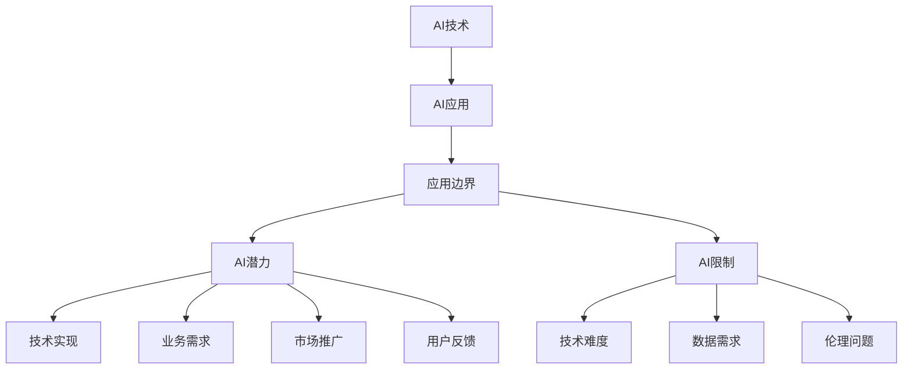

                 

# AI业务场景：工程师产品经理对话，理解AI应用边界

## 1. 背景介绍

### 1.1 问题由来
随着人工智能技术的快速发展，AI技术在各行各业的应用已经变得越来越广泛。无论是金融、医疗、零售，还是教育、娱乐、制造等领域，AI都成为了提升效率、优化流程、增强体验的重要手段。然而，在AI应用的实践中，我们常常遇到一些困惑和挑战，如如何界定AI的边界、如何理解AI的潜力与限制、如何在具体的业务场景中高效应用AI技术等。

为了解决这些困惑和挑战，我们特别策划了这篇文章，邀请了一位工程师和一位产品经理进行对话，从不同角度探讨AI应用的边界和实践，希望能为广大读者提供有价值的经验和见解。

### 1.2 问题核心关键点
本文的核心问题在于如何理解AI技术在实际业务场景中的应用边界，探讨AI的潜力与限制，以及如何在工程实践中高效地应用AI技术。通过工程师与产品经理的对话，我们试图从技术实现、业务需求、市场推广、用户反馈等多个角度，全面了解AI技术的实际应用场景和潜在挑战。

### 1.3 问题研究意义
研究AI技术的应用边界，对于明确AI技术的潜力与限制、提升AI技术的实际应用效果、推动AI技术在各行各业的普及和落地，具有重要意义：

1. **明确AI的潜力与限制**：通过理解AI技术的实际应用边界，我们可以更加清楚地认识到AI的潜力和限制，避免过度依赖或低估AI的作用。
2. **提升AI的实际应用效果**：基于对AI技术边界的深入理解，我们可以在实际应用中更好地选择和使用AI技术，避免资源浪费和技术误用。
3. **推动AI技术的普及和落地**：通过探索AI技术在具体业务场景中的应用边界，可以更好地展示AI技术的优势和价值，推动AI技术在更多领域的应用和普及。
4. **增强用户的信任和接受度**：清晰地界定AI技术的边界，可以让用户更加理解和信任AI技术，从而提升AI技术的市场接受度和用户满意度。

## 2. 核心概念与联系

### 2.1 核心概念概述

为更好地理解AI技术在具体业务场景中的应用边界，本节将介绍几个关键概念：

- **AI技术**：人工智能技术的统称，包括机器学习、深度学习、自然语言处理、计算机视觉、机器人技术等多种子领域。
- **AI应用**：将AI技术应用于具体业务场景中，解决实际问题的过程。
- **应用边界**：AI技术在特定业务场景中的实际应用范围，包括技术实现、业务需求、市场推广、用户反馈等方面。
- **AI潜力**：AI技术在解决特定问题时可能带来的性能提升、效率提高等优势。
- **AI限制**：AI技术在实际应用中可能遇到的性能瓶颈、数据需求、技术难度、伦理问题等限制。
- **工程师**：负责AI技术的具体实现和优化，关注技术细节和工程效率。
- **产品经理**：负责AI技术的市场推广和用户反馈，关注业务需求和技术商业化。

这些核心概念之间的逻辑关系可以通过以下Mermaid流程图来展示：



这个流程图展示了AI技术、AI应用、应用边界以及AI潜力与限制之间的关系：

1. AI技术是AI应用的基础，决定了应用的可能性和实现方式。
2. AI应用是AI技术在具体业务场景中的实际应用，涉及技术实现、业务需求、市场推广、用户反馈等方面。
3. 应用边界界定了AI技术在特定业务场景中的实际应用范围，既包括技术的可行性，也包括业务和市场的实际需求。
4. AI潜力与限制反映了AI技术在应用中的优势和局限，影响着应用边界的选择和调整。

## 3. 核心算法原理 & 具体操作步骤
### 3.1 算法原理概述

AI技术在具体业务场景中的应用边界，可以从以下几个方面进行理解和界定：

1. **技术实现**：AI技术在特定业务场景中的技术难度、数据需求、计算资源等。
2. **业务需求**：AI技术在特定业务场景中的实际业务需求，包括目标、效果、性能等。
3. **市场推广**：AI技术在特定业务场景中的市场接受度、用户反馈、商业化路径等。
4. **用户反馈**：AI技术在特定业务场景中的用户体验、满意度、实际效果等。

### 3.2 算法步骤详解

为了更好地理解AI应用边界，我们可以从以下几个步骤进行详细探讨：

**Step 1: 技术评估与选择**
- 评估AI技术的可行性：包括数据需求、计算资源、技术难度等。
- 选择适合的AI技术：根据业务需求和技术评估结果，选择合适的AI技术。

**Step 2: 业务需求分析**
- 明确业务目标：理解业务目标，包括提升效率、优化流程、增强体验等。
- 分析业务需求：分析业务场景中的关键问题，确定AI技术的应用范围和预期效果。

**Step 3: 市场推广与用户反馈**
- 制定市场推广策略：根据业务需求和技术评估结果，制定AI技术的市场推广策略。
- 收集用户反馈：通过用户调查、试用反馈等方式，收集AI技术的实际效果和用户满意度。

**Step 4: 优化与调整**
- 优化AI技术应用：根据用户反馈和技术评估结果，对AI技术应用进行优化和调整。
- 调整应用边界：根据优化结果和市场反馈，调整AI技术在特定业务场景中的应用边界。

### 3.3 算法优缺点

AI技术在具体业务场景中的应用，具有以下优点：

1. **提升效率与优化流程**：AI技术可以自动化处理大量重复性、高复杂度的任务，提升效率，优化流程。
2. **增强用户体验**：AI技术可以提供更智能、个性化的服务，提升用户体验。
3. **数据驱动决策**：AI技术可以帮助企业更好地理解市场趋势和用户需求，驱动决策。

同时，AI技术在应用中也存在一些限制：

1. **数据需求高**：许多AI技术需要大量的数据进行训练，数据质量差或数据不足会导致效果不佳。
2. **技术难度大**：AI技术实现复杂，需要专业的技术团队和计算资源。
3. **效果不稳定**：AI技术在特定业务场景中的效果可能不稳定，需要持续优化和调整。
4. **伦理问题**：AI技术在应用中可能涉及隐私、安全、公平等伦理问题，需要谨慎处理。

### 3.4 算法应用领域

AI技术在多个领域都有广泛的应用，以下是几个典型的应用场景：

- **金融领域**：AI技术用于风险评估、欺诈检测、客户服务、投资分析等。
- **医疗领域**：AI技术用于疾病诊断、医学影像分析、患者管理、药物研发等。
- **零售领域**：AI技术用于客户分析、库存管理、推荐系统、供应链优化等。
- **教育领域**：AI技术用于个性化学习、教学评估、智能辅导、内容推荐等。
- **制造业**：AI技术用于设备维护、生产优化、质量控制、供应链管理等。

以上应用场景展示了AI技术的广泛潜力，同时也突出了其应用边界的多样性和复杂性。

## 4. 数学模型和公式 & 详细讲解 & 举例说明

### 4.1 数学模型构建

在本节中，我们将通过一个简单的例子，展示如何构建一个基本的AI应用数学模型。

假设我们要构建一个用于客户分群的AI模型，模型输入为客户的购买历史、行为数据等，输出为客户的群体标签。我们可以使用分类算法，如K近邻算法（KNN）或决策树算法来构建模型。

### 4.2 公式推导过程

设客户数据集为 $D=\{(x_i, y_i)\}_{i=1}^N$，其中 $x_i$ 为输入特征，$y_i$ 为输出标签。

假设我们选择了KNN算法进行模型构建，则模型输出为：

$$
\hat{y}_k = \arg\min_{k=1,\dots,K} \sum_{i=1}^K \|x_i - x_k\|
$$

其中，$\| \cdot \|$ 表示欧几里得距离。

### 4.3 案例分析与讲解

以客户分群为例，我们将对模型的构建和优化过程进行详细分析：

- **数据准备**：收集客户的购买历史、行为数据等特征，构建特征向量 $x$。
- **模型训练**：选择KNN算法，对数据集 $D$ 进行训练，计算每个客户的最近邻标签。
- **模型评估**：在测试集上评估模型的准确率和召回率，进行模型调优。
- **优化与调整**：根据模型评估结果，调整输入特征、算法参数等，进一步优化模型性能。

## 5. 项目实践：代码实例和详细解释说明
### 5.1 开发环境搭建

在开始项目实践前，我们需要准备好开发环境。以下是使用Python进行KNN模型开发的环境配置流程：

1. 安装Anaconda：从官网下载并安装Anaconda，用于创建独立的Python环境。

2. 创建并激活虚拟环境：
```bash
conda create -n knn-env python=3.8 
conda activate knn-env
```

3. 安装必要的库：
```bash
conda install pandas numpy scikit-learn
```

4. 安装TensorFlow（可选）：
```bash
pip install tensorflow
```

5. 安装其他工具包：
```bash
pip install jupyter notebook ipython
```

完成上述步骤后，即可在`knn-env`环境中开始项目实践。

### 5.2 源代码详细实现

以下是一个简单的KNN客户分群模型的Python代码实现：

```python
from sklearn.neighbors import KNeighborsClassifier
from sklearn.model_selection import train_test_split
from sklearn.metrics import accuracy_score, recall_score, precision_score
import pandas as pd

# 加载数据
df = pd.read_csv('customer_data.csv')

# 准备特征和标签
X = df[['purchase_history', 'user_behavior']]
y = df['group_label']

# 分割数据集
X_train, X_test, y_train, y_test = train_test_split(X, y, test_size=0.2, random_state=42)

# 构建KNN模型
knn = KNeighborsClassifier(n_neighbors=5)

# 训练模型
knn.fit(X_train, y_train)

# 预测并评估
y_pred = knn.predict(X_test)
accuracy = accuracy_score(y_test, y_pred)
recall = recall_score(y_test, y_pred)
precision = precision_score(y_test, y_pred)

print('Accuracy:', accuracy)
print('Recall:', recall)
print('Precision:', precision)
```

在这个例子中，我们使用了scikit-learn库中的KNeighborsClassifier类构建了KNN模型，并在数据集上进行了训练和评估。代码实现了数据准备、模型构建、训练、预测和评估等基本步骤。

### 5.3 代码解读与分析

让我们再详细解读一下关键代码的实现细节：

- **数据准备**：通过pandas库加载CSV格式的数据，提取特征和标签。
- **模型构建**：选择KNN算法，设置邻域数为5。
- **模型训练**：使用训练集数据拟合模型。
- **预测与评估**：使用测试集数据进行预测，并计算模型的准确率、召回率和精确度。

通过这个例子，我们可以看到，AI技术的实现通常需要数据预处理、模型选择、训练和评估等多个步骤。每个步骤都需要细致的操作和优化，才能得到理想的模型性能。

## 6. 实际应用场景
### 6.1 智能客服系统

智能客服系统是AI技术在客服领域的重要应用场景之一。传统客服方式效率低、成本高，难以满足用户的实时需求。智能客服系统通过AI技术，可以提供7x24小时不间断服务，自动处理常见问题，提升用户体验。

在实践中，智能客服系统通常包括以下几个关键组件：

- **自然语言理解(NLU)**：将用户输入的文本转化为结构化的语义信息。
- **对话管理**：根据语义信息，选择最合适的回答模板。
- **语音识别与合成**：将文本转化为语音，或将语音转化为文本。
- **知识库管理**：维护和更新知识库，存储常见问题和答案。

### 6.2 金融风险控制

金融行业面临的高风险和高波动性，使其成为AI技术的重要应用领域。AI技术可以帮助金融机构进行风险评估、欺诈检测、市场分析等，提升风险控制能力。

在风险控制方面，AI技术通常采用以下几种方法：

- **信用评分**：通过分析用户的历史信用数据，预测其未来信用风险。
- **欺诈检测**：使用机器学习算法，检测交易中的异常行为，识别潜在欺诈。
- **市场预测**：基于历史数据，预测市场的趋势和波动，辅助决策。

### 6.3 医疗影像诊断

医疗影像诊断是AI技术在医疗领域的重要应用场景之一。传统的医疗影像诊断依赖于医生的经验和直觉，效率低、误诊率高。AI技术可以通过图像识别和深度学习，辅助医生进行诊断，提升诊断的准确率和效率。

在实践中，AI技术通常采用以下几种方法：

- **图像分割**：将医学影像分割成不同的组织和器官，便于分析。
- **病变检测**：通过图像识别算法，检测影像中的病变区域。
- **诊断辅助**：基于影像数据，提供诊断建议和风险评估。

## 7. 工具和资源推荐
### 7.1 学习资源推荐

为了帮助开发者系统掌握AI技术的应用边界，这里推荐一些优质的学习资源：

1. **机器学习课程**：如斯坦福大学的机器学习课程，涵盖了机器学习的基本概念和算法。
2. **深度学习课程**：如Coursera上的深度学习专项课程，介绍了深度学习的基本原理和实践。
3. **自然语言处理课程**：如斯坦福大学的自然语言处理课程，介绍了NLP技术的核心算法和应用。
4. **AI技术博客和论文**：如Google AI博客、DeepMind博客、arXiv等平台，提供最新的AI研究成果和实践案例。
5. **在线学习平台**：如Udacity、Coursera、edX等，提供丰富的AI课程和项目实践机会。

通过对这些资源的学习实践，相信你一定能够快速掌握AI技术的实际应用边界，并用于解决实际的业务问题。

### 7.2 开发工具推荐

高效的开发离不开优秀的工具支持。以下是几款用于AI技术开发和应用的工具：

1. **Python**：Python是AI技术开发的主流语言，拥有丰富的科学计算库和机器学习库。
2. **TensorFlow**：由Google开发的深度学习框架，支持分布式计算和GPU加速。
3. **PyTorch**：由Facebook开发的深度学习框架，灵活性和可扩展性强。
4. **Keras**：基于TensorFlow和PyTorch的高层API，易于上手和调试。
5. **Jupyter Notebook**：交互式的开发环境，支持代码执行、结果展示和数据可视化。
6. **GitHub**：代码托管和版本控制平台，便于团队协作和版本管理。

合理利用这些工具，可以显著提升AI技术的开发效率，加快创新迭代的步伐。

### 7.3 相关论文推荐

AI技术的发展得益于学界的持续研究。以下是几篇奠基性的相关论文，推荐阅读：

1. **ImageNet分类挑战赛**：AlexNet等模型的成功应用，标志着深度学习在图像识别领域的突破。
2. **AlphaGo**：DeepMind开发的围棋AI，展示了AI在复杂博弈问题中的强大能力。
3. **BERT**：Google提出的预训练语言模型，改进了传统NLP任务的性能。
4. **GPT-3**：OpenAI开发的生成式预训练模型，展示了AI在自然语言生成领域的巨大潜力。
5. **GAN**：生成对抗网络，实现了高质量的图像生成和风格迁移。

这些论文代表了大数据、深度学习、自然语言处理等领域的研究前沿，深入学习这些论文，可以帮助研究者把握学科前进方向，激发更多的创新灵感。

## 8. 总结：未来发展趋势与挑战
### 8.1 研究成果总结

本文对AI技术在具体业务场景中的应用边界进行了全面系统的探讨，主要总结了以下几个方面：

1. **技术实现**：AI技术在特定业务场景中的可行性评估，包括数据需求、计算资源、技术难度等。
2. **业务需求**：AI技术在特定业务场景中的实际业务需求，包括目标、效果、性能等。
3. **市场推广**：AI技术在特定业务场景中的市场接受度、用户反馈、商业化路径等。
4. **用户反馈**：AI技术在特定业务场景中的用户体验、满意度、实际效果等。

通过工程师与产品经理的对话，我们试图从技术实现、业务需求、市场推广、用户反馈等多个角度，全面了解AI技术的实际应用边界和潜力。

### 8.2 未来发展趋势

展望未来，AI技术在各个领域的应用将呈现以下几个趋势：

1. **技术持续进步**：深度学习、计算机视觉、自然语言处理等技术将不断进步，推动AI技术的普及和落地。
2. **跨领域融合**：AI技术将与其他技术进行更深入的融合，如知识图谱、因果推理、强化学习等，形成更加全面、高效的技术解决方案。
3. **市场接受度提升**：随着AI技术的不断优化和实际效果的提升，市场对AI技术的接受度将逐步提高。
4. **伦理与安全重视**：AI技术的伦理和安全问题将受到越来越多的关注，相关研究和规范也将不断完善。

### 8.3 面临的挑战

尽管AI技术在多个领域取得了显著成果，但在其广泛应用的过程中，仍面临诸多挑战：

1. **数据需求高**：许多AI技术需要大量的高质量数据进行训练，数据获取和处理成本高。
2. **技术复杂**：AI技术的实现复杂，需要专业的技术团队和计算资源，技术门槛较高。
3. **效果不稳定**：AI技术在特定业务场景中的效果可能不稳定，需要持续优化和调整。
4. **伦理与安全**：AI技术可能涉及隐私、安全、公平等伦理问题，需要谨慎处理。

### 8.4 研究展望

未来，AI技术的应用研究需要在以下几个方面进行深入探索：

1. **多模态融合**：将AI技术与图像、语音、传感器等多种数据进行融合，提升AI系统的感知和理解能力。
2. **跨领域迁移**：研究跨领域迁移学习方法，使AI技术能够在不同的业务场景中进行高效迁移。
3. **可解释性与透明度**：开发可解释性强的AI模型，提升用户对AI技术的理解和信任。
4. **大规模部署**：研究高效的AI技术部署方法，提升系统的可扩展性和可维护性。

这些研究方向将有助于推动AI技术在更多领域的实际应用，提升AI系统的性能和可靠性，更好地服务于人类社会。

## 9. 附录：常见问题与解答

**Q1：AI技术在具体业务场景中的应用边界如何界定？**

A: AI技术在具体业务场景中的应用边界，可以从以下几个方面进行界定：

1. **技术评估与选择**：评估AI技术的可行性，包括数据需求、计算资源、技术难度等，选择合适的AI技术。
2. **业务需求分析**：明确业务目标，理解业务场景中的关键问题，确定AI技术的应用范围和预期效果。
3. **市场推广与用户反馈**：制定市场推广策略，收集用户反馈，优化和调整AI技术应用。

**Q2：AI技术在业务场景中的主要优势和限制有哪些？**

A: AI技术在业务场景中的主要优势包括：

1. **提升效率与优化流程**：自动化处理大量重复性、高复杂度的任务，提升效率，优化流程。
2. **增强用户体验**：提供更智能、个性化的服务，提升用户体验。
3. **数据驱动决策**：帮助企业更好地理解市场趋势和用户需求，驱动决策。

同时，AI技术在应用中也存在一些限制：

1. **数据需求高**：许多AI技术需要大量的数据进行训练，数据质量差或数据不足会导致效果不佳。
2. **技术难度大**：AI技术实现复杂，需要专业的技术团队和计算资源。
3. **效果不稳定**：AI技术在特定业务场景中的效果可能不稳定，需要持续优化和调整。
4. **伦理问题**：AI技术可能涉及隐私、安全、公平等伦理问题，需要谨慎处理。

**Q3：如何在具体的业务场景中高效应用AI技术？**

A: 在具体的业务场景中高效应用AI技术，需要考虑以下几个关键点：

1. **明确业务目标**：理解业务目标，包括提升效率、优化流程、增强体验等，确定AI技术的应用范围和预期效果。
2. **选择合适的AI技术**：根据业务需求和技术评估结果，选择合适的AI技术。
3. **数据准备与处理**：收集和预处理数据，确保数据质量和可用性。
4. **模型训练与优化**：训练和优化AI模型，提高模型性能。
5. **市场推广与用户反馈**：制定市场推广策略，收集用户反馈，优化和调整AI技术应用。

**Q4：AI技术在应用中可能面临哪些风险和挑战？**

A: AI技术在应用中可能面临以下风险和挑战：

1. **数据隐私和安全**：AI技术可能涉及用户隐私和数据安全问题，需要采取措施保护用户数据。
2. **技术公平性和偏见**：AI技术可能存在数据偏见和算法歧视，需要优化模型，确保公平性。
3. **模型复杂度**：AI技术模型复杂，可能导致过度拟合或泛化能力差。
4. **计算资源需求高**：AI技术需要大量的计算资源，可能面临硬件瓶颈。
5. **伦理和社会影响**：AI技术可能带来伦理和社会影响，需要考虑社会责任和伦理规范。

通过理解和应对这些风险和挑战，可以更好地推动AI技术在实际业务场景中的应用。

---

作者：禅与计算机程序设计艺术 / Zen and the Art of Computer Programming

