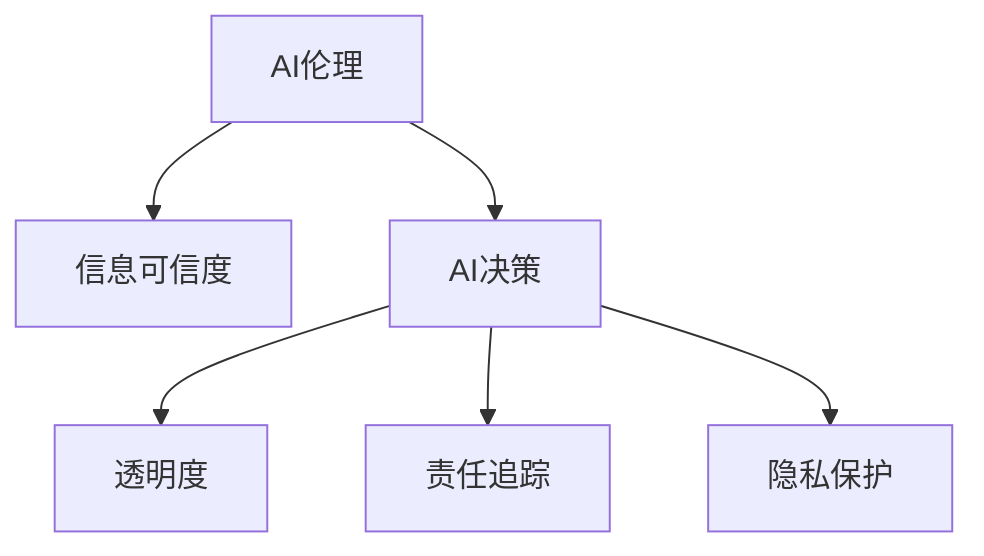

                 

## 1. 背景介绍

### 1.1 问题由来
随着人工智能(AI)技术的迅猛发展，AI伦理问题日益受到各界关注。AI系统的应用领域从传统的工业控制、金融分析拓展到医疗、教育、司法等多个社会关键领域，其行为对个人隐私、社会安全、公共利益产生了深远影响。尤其是近年来，深度学习模型在各类任务上取得了前所未有的性能突破，被广泛应用于数据驱动的决策和推荐系统，其带来的决策影响力和潜在的伦理风险也随之增大。

### 1.2 问题核心关键点
AI伦理的核心问题之一是信息可信度。由于AI系统往往是基于数据进行训练和推理的，其决策依赖于数据的准确性和全面性。然而，现实中的数据往往带有噪声、偏差和缺失，这会导致AI模型在特定情境下产生不公正、偏见或错误判断。因此，如何保障AI系统的信息可信度，使其在面对复杂多变的现实世界时能够作出负责任、可解释和可信赖的决策，是当前AI伦理研究的热点问题。

## 2. 核心概念与联系

### 2.1 核心概念概述

为更好地理解AI伦理与信息可信度的关系，本节将介绍几个关键概念：

- **AI伦理(AI Ethics)**：关注人工智能在开发、使用和治理过程中对社会、环境和个人的影响，包括隐私保护、算法偏见、决策透明度等议题。
- **信息可信度(Information Credibility)**：指信息来源的可靠性和数据的质量水平，包括数据准确性、全面性和真实性。
- **AI决策(AI Decision Making)**：指AI系统在特定情境下，基于输入的数据和模型，自动作出决策或推荐的过程。
- **透明度(Transparency)**：指AI决策过程的清晰度和可解释性，能够被用户理解、验证和监督。
- **责任追踪(Accountability)**：指对于AI决策的后果，相关责任主体需要进行责任认定和问题处理的过程，保障决策的公正性和可追溯性。
- **隐私保护(Privacy Protection)**：指在AI系统的设计和使用过程中，保障用户数据安全和隐私权益的原则和实践。

这些概念之间有着紧密的逻辑关系，可通过以下Mermaid流程图展示：



这个流程图展示了AI伦理对信息可信度的影响，以及信息可信度对AI决策、透明度、责任追踪和隐私保护的具体影响。这些概念共同构成了AI伦理的核心体系，指导着AI系统的开发、使用和治理。

## 3. 核心算法原理 & 具体操作步骤
### 3.1 算法原理概述

保障AI系统的信息可信度，本质上是提升数据的质量和模型的鲁棒性，使其在面对噪声、偏差和缺失数据时仍能作出准确、公正的决策。常用的策略包括数据预处理、模型鲁棒性增强和后验检查等。

### 3.2 算法步骤详解

**Step 1: 数据预处理**
- **数据清洗**：去除数据中的噪声、重复、异常值等不合法信息，保持数据整洁和一致。
- **数据增强**：通过对原始数据进行旋转、翻转、裁剪等变换，生成更多的训练样本，丰富数据分布。
- **数据平衡**：对于不平衡的数据集，采用欠采样、过采样、重采样等方法，平衡各类样本的数量。

**Step 2: 模型鲁棒性增强**
- **对抗训练**：在模型训练过程中，加入对抗样本进行鲁棒性训练，提高模型对扰动的抵抗能力。
- **对抗样本检测**：使用生成对抗网络（GANs）生成对抗样本，测试模型的鲁棒性。
- **正则化**：使用L1、L2正则化、Dropout等技术，防止模型过拟合，增强泛化能力。

**Step 3: 后验检查**
- **结果验证**：通过人工检查、用户反馈等手段，验证AI决策的正确性和公正性。
- **模型评估**：使用各种评价指标（如准确率、召回率、F1值等）评估模型的性能，确保其满足预期。
- **算法审计**：对模型的训练过程和决策逻辑进行审计，查找潜在问题和风险点。

### 3.3 算法优缺点

保障AI系统信息可信度的方法具有以下优点：
1. **提高决策质量**：通过数据预处理和模型鲁棒性增强，可以显著提升AI决策的准确性和公正性。
2. **增强用户信任**：透明的决策过程和责任追究机制，可以增强用户对AI系统的信任和接受度。
3. **降低伦理风险**：及时识别和处理偏见和错误，减少AI系统的伦理风险和负面影响。

同时，这些方法也存在一些局限性：
1. **资源消耗**：数据清洗和对抗训练需要大量计算资源和时间，可能影响系统部署效率。
2. **技术门槛**：数据处理和模型鲁棒性增强技术复杂，需要较高的技术水平和专业团队。
3. **结果不确定性**：尽管进行了各种后验检查，AI决策仍然可能出现误判和偏见，需要通过持续监控和迭代优化来提升。

### 3.4 算法应用领域

保障AI系统信息可信度的方法在多个领域都有重要应用：

- **医疗诊断**：保障病人数据的隐私和准确性，防止诊断偏差，提升诊断精度。
- **金融风控**：确保信用评估和欺诈检测的公正性，降低系统性风险。
- **司法判决**：防止算法偏见，确保判决过程的公正性和透明性。
- **智能推荐**：保障用户数据的隐私和推荐内容的多样性，减少个性化推荐系统的偏见。
- **智能客服**：确保对话内容的真实性和安全性，提升用户体验。

## 4. 数学模型和公式 & 详细讲解 & 举例说明
### 4.1 数学模型构建

我们以对抗训练为例，介绍如何构建数学模型来增强模型的鲁棒性。

假设模型$f(x)$用于分类，输入$x$为经过归一化的图像数据，输出为类别概率分布。对抗样本生成器$g(x)$可以生成相对于输入$x$的微小扰动$\delta$，使得$f(x+\delta)$分类错误。

对抗训练的目标是最小化对抗样本的分类误差，即：

$$
\min_{\theta} \sum_{(x,y)} \max_{\delta} L(f(x+\delta),y)
$$

其中$L$为交叉熵损失函数。对抗训练过程可以描述为：

1. 初始化模型参数$\theta$。
2. 对每个训练样本$(x,y)$，生成对抗样本$x+\delta$。
3. 计算损失$L(f(x+\delta),y)$。
4. 反向传播更新模型参数$\theta$。
5. 重复步骤2-4直至收敛。

### 4.2 公式推导过程

对抗训练的数学推导相对简单，可以概括为以下几个步骤：

1. **对训练样本$(x,y)$，生成对抗样本$x+\delta$**：
   - 对抗样本生成器$g(x)$以$x$为输入，输出$\delta$。
   - $x+\delta$是对$x$的微小扰动，通常通过梯度下降求解，使得$f(x+\delta)$分类错误。

2. **计算损失$L(f(x+\delta),y)$**：
   - 交叉熵损失函数$L(f(x+\delta),y)$表示模型预测值与真实标签之间的差异。
   - 对于每个训练样本，计算其对抗样本的损失，累加所有样本的损失，得到总损失$L$。

3. **反向传播更新模型参数$\theta$**：
   - 通过反向传播计算梯度$\nabla_\theta L$。
   - 使用优化算法（如AdamW、SGD等）更新模型参数。

### 4.3 案例分析与讲解

在实践中，对抗训练已被广泛应用于提升深度学习模型的鲁棒性。例如，在图像分类任务中，使用对抗样本对模型进行训练，可以显著提升其对噪声和攻击的抵抗能力。

```python
import torch
import torch.nn as nn
import torch.optim as optim

class LeNet(nn.Module):
    def __init__(self):
        super(LeNet, self).__init__()
        self.conv1 = nn.Conv2d(1, 6, 5)
        self.conv2 = nn.Conv2d(6, 16, 5)
        self.fc1 = nn.Linear(16 * 5 * 5, 120)
        self.fc2 = nn.Linear(120, 84)
        self.fc3 = nn.Linear(84, 10)

    def forward(self, x):
        x = nn.functional.relu(self.conv1(x))
        x = nn.functional.max_pool2d(x, 2)
        x = nn.functional.relu(self.conv2(x))
        x = nn.functional.max_pool2d(x, 2)
        x = x.view(-1, 16 * 5 * 5)
        x = nn.functional.relu(self.fc1(x))
        x = nn.functional.relu(self.fc2(x))
        x = self.fc3(x)
        return x

# 加载LeNet模型
model = LeNet()
optimizer = optim.Adam(model.parameters(), lr=0.001)

# 加载MNIST数据集
train_data = torchvision.datasets.MNIST(root='./data', train=True, transform=transforms.ToTensor(), download=True)
train_loader = torch.utils.data.DataLoader(train_data, batch_size=64, shuffle=True)

# 对抗训练
for epoch in range(10):
    for batch_idx, (inputs, targets) in enumerate(train_loader):
        inputs, targets = inputs.to(device), targets.to(device)
        
        # 生成对抗样本
        delta = torch.randn_like(inputs) * 0.01
        x_adv = inputs + delta
        
        # 前向传播
        outputs = model(x_adv)
        loss = nn.functional.cross_entropy(outputs, targets)
        
        # 反向传播和更新
        optimizer.zero_grad()
        loss.backward()
        optimizer.step()
```

在代码中，首先定义了一个简单的LeNet模型，用于手写数字分类。然后使用MNIST数据集进行对抗训练。在每个训练批次中，生成对抗样本，前向传播计算损失，反向传播更新模型参数。通过多次迭代，模型能够逐渐抵抗对抗样本的扰动，提高鲁棒性。

## 5. 项目实践：代码实例和详细解释说明
### 5.1 开发环境搭建

在进行AI伦理与信息可信度研究的实践中，我们需要准备好Python开发环境。以下是环境配置的具体步骤：

1. 安装Anaconda：从官网下载并安装Anaconda，用于创建独立的Python环境。
```bash
conda create -n pytorch-env python=3.8 
conda activate pytorch-env
```

2. 安装PyTorch：根据CUDA版本，从官网获取对应的安装命令。例如：
```bash
conda install pytorch torchvision torchaudio cudatoolkit=11.1 -c pytorch -c conda-forge
```

3. 安装TensorFlow：
```bash
conda install tensorflow
```

4. 安装TensorBoard：
```bash
pip install tensorboard
```

5. 安装transformers库：
```bash
pip install transformers
```

6. 安装相关库：
```bash
pip install pandas numpy scikit-learn matplotlib tqdm
```

完成上述步骤后，即可在`pytorch-env`环境中开始开发。

### 5.2 源代码详细实现

下面以生成对抗样本为例，给出使用TensorFlow进行对抗训练的代码实现。

```python
import tensorflow as tf
from tensorflow.keras import layers, models

# 定义模型
model = models.Sequential([
    layers.Conv2D(32, (3, 3), activation='relu', input_shape=(28, 28, 1)),
    layers.MaxPooling2D((2, 2)),
    layers.Flatten(),
    layers.Dense(10, activation='softmax')
])

# 加载MNIST数据集
(train_images, train_labels), (test_images, test_labels) = tf.keras.datasets.mnist.load_data()

# 预处理数据
train_images = train_images.reshape(train_images.shape[0], 28, 28, 1).astype('float32') / 255.0
test_images = test_images.reshape(test_images.shape[0], 28, 28, 1).astype('float32') / 255.0

# 对抗训练
optimizer = tf.keras.optimizers.Adam(learning_rate=0.001)
for epoch in range(10):
    for i in range(len(train_images)):
        x = train_images[i:i+1]
        y = train_labels[i:i+1]
        
        with tf.GradientTape() as tape:
            x_adv = x + 0.1 * tf.random.normal(tf.shape(x))
            y_adv = model(x_adv, training=True)
            loss = tf.keras.losses.categorical_crossentropy(y, y_adv)
        
        grads = tape.gradient(loss, model.trainable_variables)
        optimizer.apply_gradients(zip(grads, model.trainable_variables))
```

在代码中，首先定义了一个简单的卷积神经网络，用于MNIST手写数字分类。然后使用MNIST数据集进行对抗训练。在每个训练批次中，生成对抗样本，前向传播计算损失，反向传播更新模型参数。通过多次迭代，模型能够逐渐抵抗对抗样本的扰动，提高鲁棒性。

### 5.3 代码解读与分析

在TensorFlow中，生成对抗样本的代码实现相对简单。关键步骤包括：

1. **定义模型**：使用Keras构建卷积神经网络，用于MNIST数字分类。
2. **加载数据集**：使用Keras加载MNIST数据集，并进行预处理。
3. **对抗训练**：在每个训练批次中，生成对抗样本，前向传播计算损失，反向传播更新模型参数。

在实践中，生成对抗样本不仅能够增强模型的鲁棒性，还可以用于发现模型的脆弱点。通过对抗样本测试，可以及时识别和修正模型的问题，保障系统的安全性和可靠性。

## 6. 实际应用场景
### 6.1 智能推荐系统

智能推荐系统在电商、新闻、视频等众多领域广泛应用，但其推荐的准确性和公正性常常受到用户数据的隐私和质量问题的影响。

通过数据预处理和对抗训练，可以显著提升推荐系统的信息可信度。例如，对用户行为数据进行去噪、平衡和清洗，生成对抗样本进行模型鲁棒性测试，可以有效防止推荐系统中的偏见和错误判断，提升推荐质量。

### 6.2 医疗诊断系统

医疗诊断系统需要处理大量的患者数据，其诊断结果直接关系到患者的生命健康。因此，保障数据可信度尤为重要。

通过对抗训练和数据增强，可以增强医疗诊断系统的鲁棒性。例如，对患者影像数据进行对抗样本训练，可以提升其对噪声和攻击的抵抗能力，保障诊断的准确性和可靠性。

### 6.3 智能客服系统

智能客服系统需要实时处理用户的各种问题，其回答的准确性和公正性直接影响用户体验。

通过数据预处理和对抗训练，可以提升智能客服系统的信息可信度。例如，对用户的输入进行清洗和归一化，生成对抗样本进行鲁棒性测试，可以防止客服系统中的偏见和错误回答，保障回答的质量和公正性。

### 6.4 未来应用展望

随着AI伦理研究的深入，AI系统在更多领域的应用将逐步展开。保障信息可信度的方法也将不断扩展和优化：

1. **跨领域应用**：未来将有更多AI系统应用于跨领域任务，如医疗与金融、教育与司法等，通过数据预处理和模型鲁棒性增强，提升系统的可靠性和公正性。
2. **实时监控与迭代优化**：未来的AI系统将需要实时监控和迭代优化，及时发现和修复问题，保障系统的稳定性和安全性。
3. **隐私保护技术**：数据隐私保护将成为AI系统的重要组成部分，未来的技术将更加注重用户数据的保护，防止数据泄露和滥用。
4. **伦理审查机制**：建立AI系统的伦理审查机制，保障其在各个应用场景中的合规性和透明度。

总之，未来的AI系统将在保障信息可信度的基础上，向更广泛、更复杂、更智能的方向发展，为社会的数字化和智能化提供强有力的支持。

## 7. 工具和资源推荐
### 7.1 学习资源推荐

为了帮助开发者系统掌握AI伦理与信息可信度的理论基础和实践技巧，这里推荐一些优质的学习资源：

1. **《人工智能伦理》书籍**：由知名学者和专家编写的关于AI伦理的权威书籍，系统介绍了AI伦理的基本原则和应用场景。
2. **Google AI Blog**：Google AI团队发布的博客，涵盖AI伦理、隐私保护、数据可信度等诸多前沿话题，提供丰富的实践案例和理论分析。
3. **AI Ethics Symposium**：AI伦理国际会议，汇聚全球顶尖学者，讨论AI伦理的热点问题，发布最新研究成果。
4. **IEEE Global Initiative on Ethics of Autonomous and Intelligent Systems**：IEEE发起的全球AI伦理倡议，推动AI技术的负责任使用。
5. **AI Ethics for Kids**：面向青少年的AI伦理教育项目，通过游戏和实验，培养儿童的AI素养和伦理意识。

通过对这些资源的学习实践，相信你一定能够快速掌握AI伦理与信息可信度的精髓，并用于解决实际的AI问题。

### 7.2 开发工具推荐

高效的开发离不开优秀的工具支持。以下是几款用于AI伦理与信息可信度开发的常用工具：

1. **PyTorch**：基于Python的开源深度学习框架，灵活的动态计算图，适合快速迭代研究。
2. **TensorFlow**：由Google主导开发的开源深度学习框架，生产部署方便，适合大规模工程应用。
3. **TensorBoard**：TensorFlow配套的可视化工具，可实时监测模型训练状态，提供丰富的图表呈现方式。
4. **transformers**：HuggingFace开发的NLP工具库，集成了众多预训练语言模型，支持自然语言理解和生成。
5. **Weights & Biases**：模型训练的实验跟踪工具，可以记录和可视化模型训练过程中的各项指标，方便对比和调优。

合理利用这些工具，可以显著提升AI伦理与信息可信度研究的开发效率，加快创新迭代的步伐。

### 7.3 相关论文推荐

AI伦理与信息可信度的研究源于学界的持续研究。以下是几篇奠基性的相关论文，推荐阅读：

1. **《公平性、透明性和可解释性：构建可信AI系统的关键》**：系统介绍了AI系统公平性、透明性和可解释性的基本原理和实现方法。
2. **《数据隐私保护技术综述》**：综述了数据隐私保护的各种技术，包括差分隐私、同态加密、匿名化等。
3. **《AI伦理的挑战与解决方案》**：探讨了AI伦理面临的多重挑战，提出了多方协同、数据治理等解决方案。
4. **《对抗训练：提高深度学习模型鲁棒性的新方法》**：介绍对抗训练的基本原理和应用场景，提供了详细的算法实现和案例分析。
5. **《数据增强：提高AI系统泛化能力的关键》**：综述了数据增强的各种技术，包括数据合成、数据扩充等，提供了丰富的实践案例。

这些论文代表了大语言模型微调技术的发展脉络。通过学习这些前沿成果，可以帮助研究者把握学科前进方向，激发更多的创新灵感。

## 8. 总结：未来发展趋势与挑战
### 8.1 总结

本文对AI伦理与信息可信度的关系进行了全面系统的介绍。首先阐述了AI伦理的核心问题，即保障信息可信度，提升AI系统的决策质量和安全可靠性。其次，从原理到实践，详细讲解了保障信息可信度的数学模型和具体步骤，提供了代码实例和详细解释。同时，本文还广泛探讨了保障信息可信度的方法在智能推荐、医疗诊断、智能客服等多个领域的应用前景，展示了其广阔的应用潜力。此外，本文精选了保障信息可信度的各类学习资源，力求为读者提供全方位的技术指引。

通过本文的系统梳理，可以看到，保障AI系统信息可信度是大语言模型微调技术的重要组成部分，对于构建负责任、透明、安全的AI系统具有重要意义。未来，随着AI技术的不断进步，保障信息可信度的方法也将不断优化和完善，推动AI系统向更加智能、可信、可持续的方向发展。

### 8.2 未来发展趋势

展望未来，AI系统在保障信息可信度方面将呈现以下几个发展趋势：

1. **数据质量提升**：随着数据治理技术的进步，数据的准确性、全面性和真实性将得到显著提升，数据预处理技术也将更加自动化、智能化。
2. **模型鲁棒性增强**：未来的AI系统将进一步提升模型的鲁棒性，防止对抗样本攻击和异常数据干扰，保障系统的稳定性和安全性。
3. **伦理审查机制**：建立完善的AI伦理审查机制，确保AI系统在各个应用场景中的合规性和透明性，提升公众对AI技术的信任和接受度。
4. **隐私保护技术**：数据隐私保护技术将不断进步，防止数据泄露和滥用，保障用户隐私权益。
5. **算法透明度**：未来的AI系统将更加注重算法的透明度和可解释性，使用户能够理解和验证AI决策的依据，增强系统的可信度。

### 8.3 面临的挑战

尽管AI系统在保障信息可信度方面取得了一定的进展，但在迈向更加智能化、普适化应用的过程中，它仍面临诸多挑战：

1. **数据分布不均**：现实中的数据往往存在不平衡和噪声，这可能导致AI系统在特定情境下产生偏差和错误判断。
2. **数据隐私保护**：在保障数据可信度的同时，还需要保护用户的隐私权益，防止数据滥用和泄露。
3. **模型鲁棒性不足**：尽管对抗训练和鲁棒性增强技术取得了一定进展，但在复杂多变的情境下，模型仍可能出现误判和偏见。
4. **算法透明度**：复杂的深度学习模型往往难以解释其内部工作机制，用户难以理解和验证AI决策的依据。
5. **技术门槛高**：保障信息可信度的方法需要较高的技术水平和专业团队，对于中小企业和初创公司，存在一定的技术壁垒。

### 8.4 研究展望

未来的研究需要在以下几个方面寻求新的突破：

1. **数据治理技术**：探索更加自动化、智能化的数据治理技术，提升数据的准确性、全面性和真实性。
2. **鲁棒性增强算法**：开发更加高效、可靠的鲁棒性增强算法，增强模型的泛化能力和抗干扰能力。
3. **隐私保护技术**：研究更加先进的数据隐私保护技术，防止数据泄露和滥用，保障用户隐私权益。
4. **可解释性提升**：开发更加透明、可解释的AI系统，使用户能够理解和验证AI决策的依据，增强系统的可信度。
5. **跨领域应用**：推动保障信息可信度的方法在更多领域的应用，提升AI系统的普适性和适应性。

这些研究方向将推动AI系统向更加智能、可信、可持续的方向发展，为构建负责任、透明、安全的AI系统提供坚实的基础。总之，保障信息可信度是大语言模型微调技术的重要组成部分，其研究与应用将引领AI系统的未来发展方向。只有持续创新和突破，才能在复杂多变的现实世界中构建更加可信、可靠、可控的AI系统。

## 9. 附录：常见问题与解答
### 附录

**Q1: 什么是AI伦理？**

A: AI伦理是指在人工智能的开发、使用和治理过程中，对社会、环境和个人的影响进行伦理审查和规范，包括隐私保护、算法偏见、决策透明度等议题。

**Q2: 如何保障AI系统的信息可信度？**

A: 保障AI系统的信息可信度需要从数据预处理、模型鲁棒性增强和后验检查等多个环节入手。具体包括：
1. 数据清洗：去除数据中的噪声、重复、异常值等不合法信息，保持数据整洁和一致。
2. 数据增强：通过对原始数据进行旋转、翻转、裁剪等变换，生成更多的训练样本，丰富数据分布。
3. 数据平衡：对于不平衡的数据集，采用欠采样、过采样、重采样等方法，平衡各类样本的数量。
4. 对抗训练：在模型训练过程中，加入对抗样本进行鲁棒性训练，提高模型对扰动的抵抗能力。
5. 正则化：使用L1、L2正则化、Dropout等技术，防止模型过拟合，增强泛化能力。
6. 结果验证：通过人工检查、用户反馈等手段，验证AI决策的正确性和公正性。
7. 模型评估：使用各种评价指标（如准确率、召回率、F1值等）评估模型的性能，确保其满足预期。
8. 算法审计：对模型的训练过程和决策逻辑进行审计，查找潜在问题和风险点。

**Q3: 数据增强在AI系统中有哪些应用？**

A: 数据增强在AI系统中主要应用于以下几个方面：
1. 图像分类：通过对原始图像进行旋转、翻转、裁剪等变换，生成更多的训练样本，丰富数据分布，提升模型的泛化能力。
2. 自然语言处理：使用同义词替换、近义生成等技术，生成更多的训练样本，增强模型的语言理解能力。
3. 语音识别：通过对语音信号进行变速、变调、加噪等变换，生成更多的训练样本，提升模型的鲁棒性和泛化能力。
4. 对抗训练：使用对抗样本进行模型鲁棒性测试，提升模型对噪声和攻击的抵抗能力。
5. 生成对抗网络（GANs）：通过生成对抗样本，检测模型的鲁棒性和泛化能力，发现模型的脆弱点。

**Q4: 数据隐私保护有哪些技术手段？**

A: 数据隐私保护主要有以下技术手段：
1. 差分隐私：通过对数据进行随机扰动，使得数据集无法被重识别，保护用户隐私。
2. 同态加密：使用加密算法对数据进行加密，使得数据在加密状态下也能进行计算，保护数据隐私。
3. 匿名化：通过对数据进行去标识化处理，使得数据无法被重识别，保护用户隐私。
4. 联邦学习：多个参与方在不共享数据的情况下，共同训练模型，保护数据隐私。
5. 数据最小化：仅收集和使用必要的数据，减少数据泄露的风险。

**Q5: 对抗训练对AI系统有哪些好处？**

A: 对抗训练对AI系统有以下好处：
1. 提高模型的鲁棒性：通过对模型进行对抗样本训练，提升模型对噪声和攻击的抵抗能力。
2. 防止模型过拟合：对抗训练可以减少模型的过拟合风险，提升模型的泛化能力。
3. 发现模型的脆弱点：通过对抗样本测试，可以及时识别和修复模型的问题，保障系统的安全性。
4. 增强模型的泛化能力：对抗训练可以使模型更好地适应各种复杂多变的情境，提升系统的稳定性和可靠性。

---

作者：禅与计算机程序设计艺术 / Zen and the Art of Computer Programming

