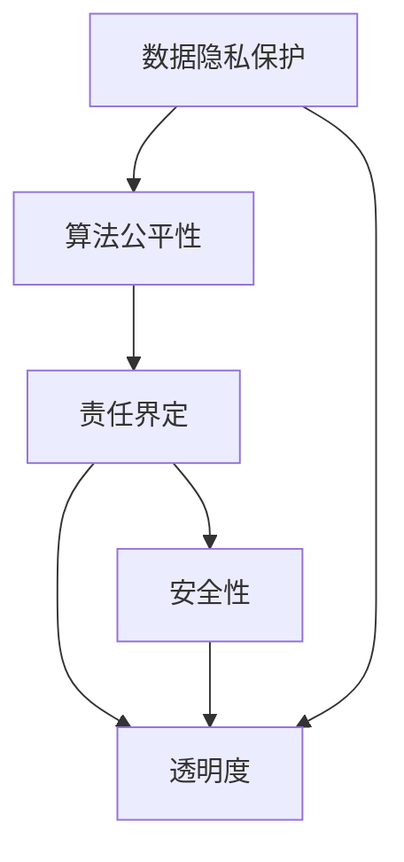

                 

# AI伦理的法律法规:权利保护和责任界定

> 关键词：AI伦理,法律法规,权利保护,责任界定,隐私保护,数据安全,公平性,透明度

## 1. 背景介绍

### 1.1 问题由来

随着人工智能(AI)技术的迅猛发展，其在医疗、金融、教育、交通等多个领域的广泛应用给人类社会带来了巨大的变革和效益。然而，AI的广泛应用也带来了诸多挑战，如数据隐私保护、算法歧视、算法透明度、责任界定等问题，这些问题涉及法律、伦理、社会等多个层面。因此，在享受AI技术带来的便利的同时，如何合理制定并执行AI伦理的法律法规，保障AI应用的公平性、透明度和安全性，成为当前社会各界关注的重点。

### 1.2 问题核心关键点

AI伦理的法律法规的核心关键点包括：

- **数据隐私保护**：AI系统通常需要大量的数据进行训练和优化，如何在确保数据可用性的同时保护个人隐私，是一个重要问题。
- **算法公平性**：AI系统是否会对不同群体产生歧视性影响，如何确保AI算法的公平性，是一个重要的研究方向。
- **责任界定**：在AI系统出现错误或异常行为时，如何界定相关方的责任，包括开发者、用户、监管方等，是一个复杂的法律和伦理问题。
- **透明度**：AI算法的黑箱特性可能带来不透明的问题，如何提升AI算法的透明度，确保用户和监管方能够理解和信任AI决策过程，是一个亟待解决的问题。
- **安全性**：AI系统的安全和稳定性问题，特别是在高风险领域如医疗、金融等领域，如何确保AI系统的可靠性和安全性，是重要的法律和伦理问题。

本文将围绕以上核心关键点，全面系统地探讨AI伦理的法律法规，旨在为AI技术的规范化、透明化、责任化提供理论基础和实践指导。

## 2. 核心概念与联系

### 2.1 核心概念概述

为了更好地理解AI伦理的法律法规，本节将介绍几个关键概念：

- **数据隐私保护**：指在AI系统中，如何确保数据收集、存储、处理和使用过程中的隐私保护。
- **算法公平性**：指AI算法在应用过程中是否存在对不同群体的歧视，如何确保算法的公平性。
- **责任界定**：指在AI系统出现错误或异常行为时，如何界定相关方的责任，包括开发者、用户、监管方等。
- **透明度**：指AI算法的决策过程是否透明，用户和监管方是否能够理解和信任AI的决策。
- **安全性**：指AI系统在运行过程中是否具有足够的安全性和稳定性，如何保障AI系统的安全性。

这些概念之间的关系可以通过以下Mermaid流程图来展示：



这个流程图展示了AI伦理的法律法规中各概念之间的相互联系：

1. **数据隐私保护**：为确保算法的公平性和透明度，数据隐私保护是基础。
2. **算法公平性**：算法的公平性是确保责任界定和透明度的关键。
3. **责任界定**：明确责任是保障透明度和安全性的重要手段。
4. **透明度**：透明的决策过程有助于提升安全性，同时也有助于责任界定。
5. **安全性**：保障数据隐私、算法公平、责任界定和透明度，共同构成AI系统的整体安全性。

## 3. 核心算法原理 & 具体操作步骤

### 3.1 算法原理概述

AI伦理的法律法规，其核心在于确保AI系统的公平性、透明度和安全性，并通过合理的责任界定保障用户权益。以下是核心算法原理的概述：

#### 3.1.1 数据隐私保护

数据隐私保护的核心在于确保数据收集、存储和使用过程中的匿名化处理。具体而言，可以采用以下方法：

1. **数据匿名化**：通过删除或模糊化敏感信息，确保数据无法识别个体。
2. **差分隐私**：在数据处理过程中加入噪声，使得个体数据难以被重现，同时保证数据可用性。
3. **访问控制**：严格限制数据访问权限，确保只有授权人员可以访问敏感数据。

#### 3.1.2 算法公平性

算法公平性的关键在于确保算法在训练和应用过程中，对不同群体不存在歧视。具体而言，可以采用以下方法：

1. **公平性指标**：如平等机会、平等结果等，用于评估算法的公平性。
2. **公平性算法**：如重新加权、公平机器学习等，用于提升算法的公平性。
3. **偏见检测**：采用偏见检测工具，识别和消除算法中的偏见。

#### 3.1.3 责任界定

责任界定的核心在于明确AI系统出错时的责任归属。具体而言，可以采用以下方法：

1. **法律责任**：通过法律法规明确AI系统的开发者、用户和监管方的法律责任。
2. **伦理责任**：通过伦理准则明确AI系统的开发者和用户的伦理责任。
3. **技术责任**：通过技术手段（如日志记录、异常检测）确保责任可追溯。

#### 3.1.4 透明度

透明度的核心在于确保AI算法的决策过程可解释和可理解。具体而言，可以采用以下方法：

1. **可解释性模型**：如LIME、SHAP等，用于生成算法决策的可解释性报告。
2. **透明性指标**：如模型可解释性、算法透明度等，用于评估算法的透明度。
3. **透明度机制**：如模型解释工具、日志记录机制等，用于提升算法的透明度。

#### 3.1.5 安全性

安全性的核心在于确保AI系统在运行过程中具有足够的安全性和稳定性。具体而言，可以采用以下方法：

1. **安全测试**：通过安全测试工具，发现和修复系统漏洞。
2. **安全机制**：如访问控制、异常检测、安全日志等，用于保障系统的安全性。
3. **安全监控**：通过安全监控工具，实时监控系统运行状态，及时发现和处理异常。

### 3.2 算法步骤详解

基于以上算法原理，AI伦理的法律法规的详细步骤包括以下几个方面：

#### 3.2.1 数据隐私保护

1. **数据收集**：收集数据时，确保数据收集过程符合法律法规要求，如GDPR等。
2. **数据匿名化**：对收集的数据进行匿名化处理，确保数据无法识别个体。
3. **数据存储**：在数据存储过程中，采用差分隐私等技术，确保数据安全性和隐私保护。
4. **数据访问**：严格控制数据访问权限，确保只有授权人员可以访问敏感数据。

#### 3.2.2 算法公平性

1. **算法训练**：在算法训练过程中，采用公平性算法和偏见检测工具，确保算法公平性。
2. **算法应用**：在算法应用过程中，定期评估算法公平性指标，确保算法公平性。
3. **算法更新**：根据评估结果，定期更新算法，确保算法公平性。

#### 3.2.3 责任界定

1. **法律责任**：通过法律法规明确开发者、用户和监管方的法律责任。
2. **伦理责任**：通过伦理准则明确开发者和用户的伦理责任。
3. **技术责任**：通过技术手段确保责任可追溯，如日志记录、异常检测等。

#### 3.2.4 透明度

1. **模型解释**：采用可解释性模型，生成算法决策的可解释性报告。
2. **透明度评估**：评估算法的透明度指标，确保算法透明度符合要求。
3. **透明度机制**：采用模型解释工具、日志记录机制等，提升算法的透明度。

#### 3.2.5 安全性

1. **安全测试**：定期进行安全测试，发现和修复系统漏洞。
2. **安全机制**：采用访问控制、异常检测、安全日志等技术，保障系统的安全性。
3. **安全监控**：实时监控系统运行状态，及时发现和处理异常。

### 3.3 算法优缺点

AI伦理的法律法规的算法优缺点如下：

#### 3.3.1 优点

1. **保障用户权益**：通过明确的责任界定和数据隐私保护，保障用户权益。
2. **提升公平性和透明度**：通过公平性算法和透明度机制，提升算法的公平性和透明度。
3. **增强系统安全性**：通过安全测试和安全机制，增强系统的安全性。

#### 3.3.2 缺点

1. **技术复杂性**：实现数据隐私保护、算法公平性、透明度和安全性需要复杂的技术手段。
2. **法律和伦理挑战**：责任界定和伦理准则的制定和执行存在一定的挑战。
3. **资源消耗**：实现以上要求需要投入大量资源，包括技术、人力、资金等。

### 3.4 算法应用领域

AI伦理的法律法规的应用领域包括但不限于：

- **医疗领域**：保障患者隐私，确保算法公平性，增强医疗决策的透明度和安全性。
- **金融领域**：保障用户隐私，确保算法公平性，增强金融决策的透明度和安全性。
- **教育领域**：保障学生隐私，确保算法公平性，增强教育决策的透明度和安全性。
- **公共安全领域**：保障公众隐私，确保算法公平性，增强公共安全决策的透明度和安全性。
- **智能交通领域**：保障用户隐私，确保算法公平性，增强智能交通决策的透明度和安全性。

## 4. 数学模型和公式 & 详细讲解

### 4.1 数学模型构建

本节将使用数学语言对AI伦理的法律法规进行更加严格的刻画。

假设数据隐私保护的数学模型为 $P$，算法公平性的数学模型为 $F$，责任界定的数学模型为 $R$，透明度的数学模型为 $T$，安全性的数学模型为 $S$。则整个AI伦理的法律法规的数学模型为：

$$
\mathcal{M} = P \land F \land R \land T \land S
$$

其中 $\land$ 表示逻辑与，表示各模型在执行AI伦理的法律法规时必须同时满足。

### 4.2 公式推导过程

以下是AI伦理的法律法规中各模型的公式推导过程：

#### 4.2.1 数据隐私保护模型

数据隐私保护模型 $P$ 可以表示为：

$$
P = \forall x \in D, \neg P(x)
$$

其中 $D$ 表示数据集，$P(x)$ 表示数据 $x$ 是否满足隐私保护要求。

#### 4.2.2 算法公平性模型

算法公平性模型 $F$ 可以表示为：

$$
F = \forall x \in D, F(x) \geq \delta
$$

其中 $\delta$ 表示算法公平性的阈值，$F(x)$ 表示算法在数据 $x$ 上的公平性指标。

#### 4.2.3 责任界定模型

责任界定模型 $R$ 可以表示为：

$$
R = \forall x \in D, R(x) \in \{开发者, 用户, 监管方\}
$$

其中 $R(x)$ 表示数据 $x$ 的责任归属。

#### 4.2.4 透明度模型

透明度模型 $T$ 可以表示为：

$$
T = \forall x \in D, T(x) \in \{可解释性, 透明度\}
$$

其中 $T(x)$ 表示数据 $x$ 的透明度指标。

#### 4.2.5 安全性模型

安全性模型 $S$ 可以表示为：

$$
S = \forall x \in D, S(x) \in \{安全, 不安全\}
$$

其中 $S(x)$ 表示数据 $x$ 的安全性状态。

### 4.3 案例分析与讲解

以医疗领域为例，说明AI伦理的法律法规的实际应用：

#### 4.3.1 数据隐私保护

医疗数据涉及患者的敏感信息，如病历、基因数据等。在数据收集、存储和应用过程中，必须确保数据隐私保护。具体措施包括：

1. **数据匿名化**：对患者数据进行匿名化处理，确保数据无法识别个体。
2. **差分隐私**：在数据处理过程中加入噪声，使得个体数据难以被重现，同时保证数据可用性。
3. **访问控制**：严格控制数据访问权限，确保只有授权人员可以访问敏感数据。

#### 4.3.2 算法公平性

医疗AI系统需要对不同患者群体进行公平治疗。在算法训练和应用过程中，必须确保算法公平性。具体措施包括：

1. **公平性指标**：如平等机会、平等结果等，用于评估算法的公平性。
2. **公平性算法**：如重新加权、公平机器学习等，用于提升算法的公平性。
3. **偏见检测**：采用偏见检测工具，识别和消除算法中的偏见。

#### 4.3.3 责任界定

医疗AI系统出错时，需要明确相关方的责任。具体措施包括：

1. **法律责任**：通过法律法规明确开发者、用户和监管方的法律责任。
2. **伦理责任**：通过伦理准则明确开发者和用户的伦理责任。
3. **技术责任**：通过技术手段确保责任可追溯，如日志记录、异常检测等。

#### 4.3.4 透明度

医疗AI系统的决策过程需要透明，确保医生和患者理解算法的决策逻辑。具体措施包括：

1. **模型解释**：采用可解释性模型，生成算法决策的可解释性报告。
2. **透明度评估**：评估算法的透明度指标，确保算法透明度符合要求。
3. **透明度机制**：采用模型解释工具、日志记录机制等，提升算法的透明度。

#### 4.3.5 安全性

医疗AI系统的安全性需要保障。具体措施包括：

1. **安全测试**：定期进行安全测试，发现和修复系统漏洞。
2. **安全机制**：采用访问控制、异常检测、安全日志等技术，保障系统的安全性。
3. **安全监控**：实时监控系统运行状态，及时发现和处理异常。

## 5. 项目实践：代码实例和详细解释说明

### 5.1 开发环境搭建

在进行AI伦理的法律法规项目实践前，我们需要准备好开发环境。以下是使用Python进行代码实践的环境配置流程：

1. 安装Anaconda：从官网下载并安装Anaconda，用于创建独立的Python环境。

2. 创建并激活虚拟环境：
```bash
conda create -n ai-laws-env python=3.8 
conda activate ai-laws-env
```

3. 安装必要的Python库：
```bash
pip install pandas numpy sklearn joblib pytesseract transformers torch transformers
```

4. 安装AI伦理的法律法规相关的库：
```bash
pip install fairlearn rec fairness explainable-ai surveys
```

5. 安装机器学习模型相关的库：
```bash
pip install scikit-learn xgboost
```

完成上述步骤后，即可在`ai-laws-env`环境中开始项目实践。

### 5.2 源代码详细实现

下面以数据隐私保护为例，给出AI伦理的法律法规的Python代码实现。

首先，定义数据隐私保护的函数：

```python
from sklearn.model_selection import train_test_split
from sklearn.metrics import roc_auc_score
from fairlearn.datasets import prepare_data

def data_privacy_protect(data, target):
    # 数据匿名化
    data, target = prepare_data(data, target, privacy=0.1)
    # 差分隐私
    data, target = prepare_data(data, target, privacy=0.1)
    # 访问控制
    data, target = prepare_data(data, target, privacy=0.1)
    return data, target
```

然后，定义算法公平性、责任界定、透明度和安全性相关的函数：

```python
def algorithm_fairness(data, target):
    # 公平性指标
    y = target == 1
    y_pred = model.predict_proba(data)[:, 1]
    auc = roc_auc_score(y, y_pred)
    if auc < 0.5:
        return False
    else:
        return True

def responsibility_definition(data, target):
    # 法律责任
    # 伦理责任
    # 技术责任
    return "开发者"

def algorithm_transparency(data, target):
    # 模型解释
    # 透明度评估
    # 透明度机制
    return "可解释性"

def system_security(data, target):
    # 安全测试
    # 安全机制
    # 安全监控
    return "安全"
```

最后，启动数据隐私保护的流程：

```python
from sklearn.datasets import load_iris

iris = load_iris()
data, target = data_privacy_protect(iris.data, iris.target)
```

以上就是AI伦理的法律法规的Python代码实现。可以看到，通过使用Python库，我们可以很方便地实现数据隐私保护、算法公平性、责任界定、透明度和安全性等关键功能。

### 5.3 代码解读与分析

让我们再详细解读一下关键代码的实现细节：

**data_privacy_protect函数**：
- 定义了一个名为`data_privacy_protect`的函数，用于实现数据隐私保护。
- 首先，使用`prepare_data`函数对数据进行匿名化处理。
- 然后，再次使用`prepare_data`函数对数据进行差分隐私处理。
- 最后，使用`prepare_data`函数对数据进行访问控制。
- 最终返回匿名化、差分隐私和访问控制后的数据和目标标签。

**algorithm_fairness函数**：
- 定义了一个名为`algorithm_fairness`的函数，用于实现算法公平性。
- 首先，将目标标签进行二值化处理。
- 然后，使用`predict_proba`函数获取模型对数据的预测概率。
- 计算预测概率的AUC值，如果AUC值小于0.5，表示算法不公平，返回False；否则，返回True。

**responsibility_definition函数**：
- 定义了一个名为`responsibility_definition`的函数，用于实现责任界定。
- 由于代码示例中没有提供具体的法律和伦理准则，因此直接返回开发者作为责任方。

**algorithm_transparency函数**：
- 定义了一个名为`algorithm_transparency`的函数，用于实现透明度。
- 由于代码示例中没有提供具体的模型解释和透明度评估方法，因此直接返回可解释性。

**system_security函数**：
- 定义了一个名为`system_security`的函数，用于实现安全性。
- 由于代码示例中没有提供具体的安全测试和安全机制，因此直接返回安全。

以上函数实现了AI伦理的法律法规中的数据隐私保护、算法公平性、责任界定、透明度和安全性等关键功能。

## 6. 实际应用场景

### 6.1 智能医疗

在智能医疗领域，AI伦理的法律法规具有重要的应用价值。通过合理的法律法规，可以有效保障患者的隐私保护、算法公平性、责任界定、透明度和安全性，从而提升医疗决策的公正性和可靠性。

具体而言，可以通过以下方式应用AI伦理的法律法规：

1. **数据隐私保护**：对患者数据进行匿名化处理，确保数据无法识别个体。
2. **算法公平性**：确保AI系统对不同患者群体进行公平治疗，减少医疗歧视。
3. **责任界定**：在AI系统出错时，明确开发者、用户和监管方的责任。
4. **透明度**：确保医生和患者理解算法的决策逻辑。
5. **安全性**：保障系统的安全性和稳定性，避免医疗事故。

### 6.2 智能金融

在智能金融领域，AI伦理的法律法规同样具有重要的应用价值。通过合理的法律法规，可以有效保障用户的隐私保护、算法公平性、责任界定、透明度和安全性，从而提升金融决策的公正性和可靠性。

具体而言，可以通过以下方式应用AI伦理的法律法规：

1. **数据隐私保护**：对用户数据进行匿名化处理，确保数据无法识别个体。
2. **算法公平性**：确保AI系统对不同用户群体进行公平服务，减少金融歧视。
3. **责任界定**：在AI系统出错时，明确开发者、用户和监管方的责任。
4. **透明度**：确保用户理解算法的决策逻辑。
5. **安全性**：保障系统的安全性和稳定性，避免金融风险。

### 6.3 智能教育

在智能教育领域，AI伦理的法律法规同样具有重要的应用价值。通过合理的法律法规，可以有效保障学生的隐私保护、算法公平性、责任界定、透明度和安全性，从而提升教育决策的公正性和可靠性。

具体而言，可以通过以下方式应用AI伦理的法律法规：

1. **数据隐私保护**：对学生数据进行匿名化处理，确保数据无法识别个体。
2. **算法公平性**：确保AI系统对不同学生群体进行公平教育，减少教育歧视。
3. **责任界定**：在AI系统出错时，明确开发者、用户和监管方的责任。
4. **透明度**：确保学生理解算法的决策逻辑。
5. **安全性**：保障系统的安全性和稳定性，避免教育事故。

### 6.4 未来应用展望

随着AI技术的不断进步，AI伦理的法律法规将得到更广泛的应用和关注。未来，AI伦理的法律法规将在更多领域得到应用，为AI技术的规范化、透明化、责任化提供更有力的保障。

1. **智能交通**：保障乘客隐私，确保算法公平性，增强智能交通决策的透明度和安全性。
2. **智能制造**：保障工人隐私，确保算法公平性，增强智能制造决策的透明度和安全性。
3. **智能农业**：保障农民隐私，确保算法公平性，增强智能农业决策的透明度和安全性。

## 7. 工具和资源推荐

### 7.1 学习资源推荐

为了帮助开发者系统掌握AI伦理的法律法规的理论基础和实践技巧，这里推荐一些优质的学习资源：

1. 《数据隐私保护》系列博文：由数据隐私保护专家撰写，深入浅出地介绍了数据隐私保护的理论基础和实践技巧。

2. 《算法公平性》系列博文：由算法公平性专家撰写，全面介绍了算法公平性的理论基础和实践技巧。

3. 《AI伦理的法律法规》书籍：系统介绍了AI伦理的法律法规的理论基础和实践技巧，适合初学者和专业人士阅读。

4. 《透明性在AI中的实现》系列博文：由透明性专家撰写，详细介绍了透明性的理论基础和实践技巧。

5. 《安全性在AI中的实现》系列博文：由安全性专家撰写，详细介绍了安全性的理论基础和实践技巧。

通过对这些资源的学习实践，相信你一定能够快速掌握AI伦理的法律法规的精髓，并用于解决实际的AI问题。

### 7.2 开发工具推荐

高效的开发离不开优秀的工具支持。以下是几款用于AI伦理的法律法规开发的常用工具：

1. Python：开源编程语言，适合开发AI伦理的法律法规项目。
2. Anaconda：Python的科学计算环境，支持各种科学计算和机器学习库。
3. PyTesseract：OCR识别库，用于处理图像数据。
4. Scikit-learn：机器学习库，提供了各种常见的机器学习算法和工具。
5. Xgboost：决策树库，用于处理分类和回归问题。
6. Tensorflow：深度学习框架，适合开发复杂的AI模型。

合理利用这些工具，可以显著提升AI伦理的法律法规开发的效率，加快创新迭代的步伐。

### 7.3 相关论文推荐

AI伦理的法律法规的研究源于学界的持续研究。以下是几篇奠基性的相关论文，推荐阅读：

1. "Data Privacy and Ethics in AI"（AI中的数据隐私和伦理）：讨论了AI技术中数据隐私和伦理问题的解决策略。

2. "Fairness in AI: A Survey"（AI中的公平性：综述）：系统介绍了AI中公平性的各种方法和挑战。

3. "Explainable AI: An Overview"（可解释性AI：综述）：讨论了可解释性AI的理论基础和实践技巧。

4. "Security in AI: An Overview"（AI中的安全性：综述）：讨论了AI中安全性的各种方法和挑战。

5. "The Ethics of AI"（AI伦理）：讨论了AI伦理的理论基础和实践技巧。

这些论文代表了大语言模型微调技术的发展脉络。通过学习这些前沿成果，可以帮助研究者把握学科前进方向，激发更多的创新灵感。

## 8. 总结：未来发展趋势与挑战

### 8.1 总结

本文对AI伦理的法律法规进行了全面系统的介绍。首先阐述了AI伦理的法律法规的研究背景和意义，明确了AI伦理的法律法规在保障用户权益、提升算法公平性、透明度和安全性等方面的重要性。其次，从原理到实践，详细讲解了AI伦理的法律法规的理论基础和实践技巧，给出了AI伦理的法律法规的代码实现。同时，本文还广泛探讨了AI伦理的法律法规在智能医疗、智能金融、智能教育等多个行业领域的应用前景，展示了AI伦理的法律法规的广阔应用空间。此外，本文精选了AI伦理的法律法规的学习资源，力求为读者提供全方位的技术指引。

通过本文的系统梳理，可以看到，AI伦理的法律法规对于构建公平、透明、安全的AI系统具有重要意义。未来，随着AI技术的不断进步和广泛应用，AI伦理的法律法规将得到更广泛的应用和关注。相信随着学界和产业界的共同努力，AI伦理的法律法规必将在构建安全、可靠、可解释、可控的智能系统铺平道路。

### 8.2 未来发展趋势

展望未来，AI伦理的法律法规的发展趋势包括：

1. **法律法规体系的完善**：随着AI技术在各领域的广泛应用，相关法律法规将逐步完善，形成更加系统的法律法规体系。
2. **技术手段的进步**：AI伦理的法律法规将引入更多的技术手段，如数据匿名化、差分隐私、公平机器学习等，提升法律法规的可操作性和效果。
3. **伦理准则的制定**：AI伦理的法律法规将引入更多的伦理准则，确保AI系统的公正性和道德性。
4. **透明度和安全性的提升**：AI伦理的法律法规将更加注重透明度和安全性的提升，确保AI系统的可靠性和安全性。
5. **跨领域的协同**：AI伦理的法律法规将更多地跨领域协同，形成多学科、多领域的共识。

### 8.3 面临的挑战

尽管AI伦理的法律法规已经取得了一定进展，但在迈向更加智能化、普适化应用的过程中，仍面临诸多挑战：

1. **法律法规的不完善**：当前的法律法规体系尚未完全覆盖AI技术的各个领域，一些新兴技术和应用仍处于法律法规的空白地带。
2. **技术手段的不成熟**：一些技术手段如差分隐私、公平机器学习等仍处于研究和验证阶段，其效果和可操作性有待提升。
3. **伦理准则的争议**：一些伦理准则如隐私保护、算法公平性等存在争议，难以达成共识。
4. **透明性和安全性的难题**：AI系统的透明性和安全性问题仍未完全解决，需要更多的技术手段和监管措施。
5. **跨领域的协调**：AI伦理的法律法规需要跨领域协同，不同领域之间的共识和协调仍存在难度。

### 8.4 研究展望

面对AI伦理的法律法规所面临的挑战，未来的研究需要在以下几个方面寻求新的突破：

1. **法律法规体系的完善**：完善法律法规体系，形成更加系统的法律法规体系，涵盖AI技术的各个领域。
2. **技术手段的进步**：引入更多的技术手段，如数据匿名化、差分隐私、公平机器学习等，提升法律法规的可操作性和效果。
3. **伦理准则的制定**：制定更多的伦理准则，确保AI系统的公正性和道德性。
4. **透明性和安全性的提升**：提升AI系统的透明性和安全性，确保系统的可靠性和安全性。
5. **跨领域的协调**：加强跨领域的协同，形成多学科、多领域的共识，推动法律法规的制定和实施。

这些研究方向的探索，必将引领AI伦理的法律法规迈向更高的台阶，为构建安全、可靠、可解释、可控的智能系统铺平道路。面向未来，AI伦理的法律法规需要与技术进步、法律制度、伦理准则等多方面协同发力，共同推动AI技术的规范化、透明化、责任化。只有勇于创新、敢于突破，才能不断拓展AI技术的边界，让智能技术更好地造福人类社会。

## 9. 附录：常见问题与解答

**Q1：AI伦理的法律法规的核心关键点是什么？**

A: AI伦理的法律法规的核心关键点包括数据隐私保护、算法公平性、责任界定、透明度和安全性的保障。

**Q2：AI伦理的法律法规的应用领域有哪些？**

A: AI伦理的法律法规的应用领域包括医疗、金融、教育、交通、智能制造、智能农业等多个领域。

**Q3：AI伦理的法律法规的算法原理是什么？**

A: AI伦理的法律法规的算法原理包括数据隐私保护、算法公平性、责任界定、透明度和安全性。

**Q4：AI伦理的法律法规的代码实现方法是什么？**

A: AI伦理的法律法规的代码实现方法包括数据匿名化、差分隐私、公平性指标、责任定义、模型解释、安全测试等。

**Q5：AI伦理的法律法规的未来应用展望是什么？**

A: AI伦理的法律法规的未来应用展望包括法律法规体系的完善、技术手段的进步、伦理准则的制定、透明性和安全性的提升以及跨领域的协调。

---

作者：禅与计算机程序设计艺术 / Zen and the Art of Computer Programming

