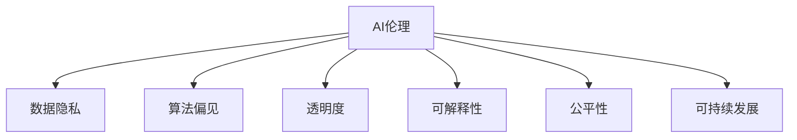

                 

# AI伦理：在技术进步与社会责任间寻找平衡

> 关键词：AI伦理, 技术进步, 社会责任, 数据隐私, 算法偏见, 透明度, 可解释性, 公平性, 可持续发展

## 1. 背景介绍

### 1.1 问题由来

随着人工智能技术的飞速发展，AI在各行各业的应用日益广泛，从自动驾驶、医疗诊断到金融风控，AI正在重塑人类的生产生活方式。然而，技术进步往往伴随着伦理和社会责任问题，这些问题如果处理不当，可能会引发一系列社会负面效应，甚至威胁人类的生存和发展。AI伦理，即如何在技术进步与人类福祉之间寻求平衡，成为了当前学术界和产业界广泛关注的话题。

### 1.2 问题核心关键点

AI伦理涉及的核心问题包括数据隐私保护、算法偏见、透明度与可解释性、公平性等。这些问题交织在一起，既反映了技术的不确定性和复杂性，也反映了社会对技术应用责任的期待。如何在技术进步的同时，确保社会责任的落实，是AI伦理研究的最终目标。

### 1.3 问题研究意义

研究AI伦理不仅有助于指导AI技术的健康发展，还能促进社会对AI技术的理解和接受，推动人工智能技术的社会化应用。具体而言，AI伦理研究有助于：

1. 构建公正、透明、可信的AI系统，提升公众对AI技术的信任。
2. 保障用户数据隐私，防止数据滥用和泄露。
3. 消除算法偏见，确保AI系统的公平性和公正性。
4. 增强AI系统的透明度和可解释性，便于监管和审查。
5. 实现AI技术的可持续发展，避免对环境的破坏。

## 2. 核心概念与联系

### 2.1 核心概念概述

为更好地理解AI伦理的各个方面，本节将介绍几个密切相关的核心概念：

- **AI伦理(AI Ethics)**：研究如何确保AI技术的应用符合伦理道德标准，保障人类的福祉和自由。
- **数据隐私(Data Privacy)**：保护个人信息不被滥用，保障用户隐私权。
- **算法偏见(Algorithm Bias)**：指AI系统因训练数据、算法设计等原因，导致对某些群体或事件的错误判断或歧视。
- **透明度(Transparency)**：指AI系统的决策过程应可解释、可理解，便于用户和监管者审查。
- **可解释性(Explainability)**：指AI系统的决策结果应可解释，便于用户理解其背后的逻辑和推理。
- **公平性(Fairness)**：指AI系统应公平对待所有用户，避免对某些群体的歧视或不公。
- **可持续发展(Sustainability)**：指AI技术的应用应考虑到环境、社会的长远利益，避免对生态系统的破坏。

这些核心概念之间的逻辑关系可以通过以下Mermaid流程图来展示：



这个流程图展示了我AI伦理的核心概念及其之间的关系：

1. AI伦理是统领其他概念的关键。
2. 数据隐私、算法偏见、透明度、可解释性、公平性、可持续发展都是AI伦理的重要组成部分。
3. 这些问题相互交织，共同影响AI系统的道德和伦理属性。

## 3. 核心算法原理 & 具体操作步骤

### 3.1 算法原理概述

AI伦理涉及的算法原理主要包括：

- **数据隐私保护算法**：如差分隐私(Differential Privacy)、同态加密(Homomorphic Encryption)等，用于保护用户数据隐私。
- **算法偏见消除算法**：如公平优化算法、偏见检测与修正技术等，用于消除AI系统的偏见。
- **透明度与可解释性算法**：如模型可视化技术、可解释模型(如决策树、LIME等)等，用于提升系统的透明度和可解释性。
- **公平性算法**：如公平性优化算法、数据平衡技术等，用于确保AI系统的公平性。
- **可持续发展算法**：如环境影响评估算法、绿色计算优化算法等，用于实现AI技术的可持续发展。

### 3.2 算法步骤详解

基于AI伦理的算法步骤通常包括以下几个关键步骤：

**Step 1: 数据预处理与隐私保护**

- 收集数据：从多个渠道收集数据，确保数据的多样性和代表性。
- 数据清洗与标注：对数据进行清洗、去重、标注等预处理，确保数据质量。
- 数据隐私保护：应用差分隐私、同态加密等技术，保护用户隐私。

**Step 2: 模型训练与偏见消除**

- 选择模型：根据任务特点选择适合的模型，如决策树、神经网络等。
- 训练模型：在清洗和标注后的数据集上，使用训练算法训练模型。
- 偏见检测与消除：使用偏见检测技术，如公平优化算法，检测和消除模型偏见。

**Step 3: 模型评估与透明度提升**

- 模型评估：使用评估指标（如准确率、召回率、公平性指标等）评估模型性能。
- 模型透明化：使用可视化技术，如LIME、SHAP等，解释模型决策过程。
- 透明度提升：通过公开模型架构、训练数据、评估指标等，提升模型的透明度。

**Step 4: 公平性保证**

- 公平性检测：使用公平性检测算法，如Equational Group公平性检测等，检测模型是否存在偏见。
- 公平性优化：使用公平性优化算法，如公平性正则化、重加权等，提升模型公平性。
- 多样性保证：确保模型在处理不同群体数据时，表现一致。

**Step 5: 可持续发展分析**

- 环境影响评估：评估AI系统的能耗、碳排放等环境影响。
- 绿色计算优化：使用绿色计算技术，如能效优化算法、低碳算法等，降低计算资源消耗。

### 3.3 算法优缺点

AI伦理相关的算法具有以下优点：

1. **数据隐私保护**：有效保障用户数据隐私，防止数据滥用和泄露。
2. **偏见消除**：减少算法偏见，提升AI系统的公平性和公正性。
3. **透明度与可解释性**：增强AI系统的透明度和可解释性，便于监管和审查。
4. **公平性保证**：确保AI系统对所有用户公平对待，避免对某些群体的歧视。
5. **可持续发展**：实现AI技术的可持续发展，避免对生态系统的破坏。

同时，这些算法也存在一些局限性：

1. **数据隐私保护**：部分隐私保护技术可能会引入噪音，影响数据质量。
2. **偏见消除**：偏见检测与消除技术可能无法完全消除所有偏见。
3. **透明度与可解释性**：复杂模型（如深度神经网络）可能难以解释，导致透明度不足。
4. **公平性保证**：公平性优化算法可能无法兼顾所有公平性指标。
5. **可持续发展**：绿色计算技术可能增加计算复杂度，影响模型性能。

尽管存在这些局限性，但AI伦理相关的算法仍是AI技术应用不可或缺的重要组成部分，需要不断改进和完善。

### 3.4 算法应用领域

AI伦理相关的算法在多个领域得到了广泛应用，包括但不限于：

1. **医疗健康**：保护患者隐私，确保医疗决策的公正性和透明性。
2. **金融服务**：保护客户隐私，确保金融算法的公平性和透明度。
3. **教育培训**：保护学生隐私，确保教育资源的公平分配。
4. **环境保护**：评估AI系统的环境影响，推动绿色计算。
5. **智能制造**：确保工厂自动化系统的透明性和公平性。

## 4. 数学模型和公式 & 详细讲解 & 举例说明

### 4.1 数学模型构建

为更加严谨地阐述AI伦理相关的算法，本节将使用数学语言对核心算法进行描述。

- **差分隐私**：
  定义：对于任意两个数据集 $D_1$ 和 $D_2$，如果对于任意 $\epsilon$ 和 $\delta$，有：

  $$
  \mathbb{P}[|\hat{f}(D_1) - \hat{f}(D_2)| > \epsilon] < \delta
  $$

  则称算法 $\hat{f}$ 是 $(\epsilon, \delta)$ 差分隐私算法。

- **公平优化算法**：
  定义：使用 $\hat{w}$ 表示模型的权重向量，则公平优化算法的目标是：

  $$
  \min_{\hat{w}} C(\hat{w}) \quad \text{s.t.} \quad \ell(\hat{w}, x, y) + \lambda \ell^*(\hat{w}) \leq \text{const}
  $$

  其中 $\ell(\hat{w}, x, y)$ 为模型损失函数，$\ell^*(\hat{w})$ 为公平性损失函数。

- **模型可视化技术**：
  定义：使用 $g_{\theta}$ 表示模型的参数向量，则模型可视化技术的目标是：

  $$
  \min_{\theta} \mathcal{L}(g_{\theta})
  $$

  其中 $\mathcal{L}(g_{\theta})$ 为模型可视化损失函数，通过最小化该损失函数，得到可视化结果 $g_{\theta}$。

- **绿色计算优化算法**：
  定义：使用 $\mathcal{E}$ 表示模型在训练和推理过程中的能耗，则绿色计算优化算法的目标是：

  $$
  \min_{\theta} \mathcal{E}(\theta)
  $$

  其中 $\mathcal{E}(\theta)$ 为能耗损失函数。

### 4.2 公式推导过程

以下我们以差分隐私为例，推导其核心公式及其含义：

- **差分隐私推导**：

  根据差分隐私的定义，有：

  $$
  \mathbb{P}[|\hat{f}(D_1) - \hat{f}(D_2)| > \epsilon] < \delta
  $$

  可以理解为：在任意两个相邻数据集 $D_1$ 和 $D_2$ 上，模型输出的差异小于 $\epsilon$ 的概率大于 $1-\delta$。这表明差分隐私算法能够有效保护单个数据点的隐私，即使攻击者获得了部分数据，也无法逆推出单个数据点的具体信息。

- **公平优化算法推导**：

  公平优化算法使用 $\hat{w}$ 表示模型的权重向量，公平性优化算法的目标是最小化模型损失函数 $C(\hat{w})$，同时确保模型公平性损失函数 $\ell^*(\hat{w})$ 不超过预设阈值 $\text{const}$。

  通过Lagrange乘子法，可以得到公平优化算法的新目标函数：

  $$
  \min_{\hat{w}} C(\hat{w}) + \lambda \ell^*(\hat{w})
  $$

  其中 $\lambda$ 为Lagrange乘子，通过调节 $\lambda$，可以控制模型公平性。

- **模型可视化技术推导**：

  模型可视化技术的目标是通过最小化可视化损失函数 $\mathcal{L}(g_{\theta})$，得到可视化结果 $g_{\theta}$。常见的可视化方法包括LIME、SHAP等。

  以LIME为例，其核心思想是通过生成局部线性模型，解释模型在特定输入上的决策过程。设 $x$ 为输入，$y$ 为输出，则LIME的目标是：

  $$
  \min_{g_{\theta}} \sum_{i=1}^N \|g_{\theta}(x_i) - f(x_i, \hat{w})\|^2
  $$

  其中 $f(x_i, \hat{w})$ 表示模型在输入 $x_i$ 上的输出，$g_{\theta}$ 表示局部线性模型。

- **绿色计算优化算法推导**：

  绿色计算优化算法的目标是降低模型在训练和推理过程中的能耗 $\mathcal{E}(\theta)$。常见的绿色计算方法包括能效优化算法、低碳算法等。

  以能效优化算法为例，其目标是通过最小化能耗损失函数 $\mathcal{E}(\theta)$，降低模型的计算资源消耗。具体算法可以基于不同硬件平台进行优化。

### 4.3 案例分析与讲解

**案例一：医疗健康中的数据隐私保护**

- **问题描述**：在医疗诊断系统中，如何保护患者隐私，同时提供高质量的医疗服务。

- **解决方案**：使用差分隐私技术，对患者数据进行匿名化处理，同时确保模型在隐私保护的同时，仍能提供准确的诊断结果。

  **步骤**：
  1. 收集患者数据：从医院系统中收集患者医疗记录。
  2. 差分隐私处理：使用差分隐私算法，对患者数据进行匿名化处理。
  3. 模型训练：在处理后的数据集上，使用机器学习算法训练医疗诊断模型。
  4. 模型评估：在测试集上评估模型性能，确保隐私保护的同时，仍能提供准确的诊断结果。

**案例二：金融服务中的偏见消除**

- **问题描述**：在金融信贷系统中，如何确保不同性别、种族等群体在贷款申请中的公平性。

- **解决方案**：使用公平优化算法，检测并消除模型中的偏见，确保信贷审批的公正性。

  **步骤**：
  1. 收集贷款数据：从银行系统中收集贷款申请数据。
  2. 数据清洗与标注：对数据进行清洗、去重、标注等预处理。
  3. 偏见检测：使用公平优化算法，检测模型中的偏见。
  4. 偏见消除：根据偏见检测结果，调整模型参数，消除偏见。
  5. 模型评估：在测试集上评估模型性能，确保贷款审批的公正性。

## 5. 项目实践：代码实例和详细解释说明

### 5.1 开发环境搭建

在进行AI伦理相关的项目实践前，我们需要准备好开发环境。以下是使用Python进行PyTorch开发的环境配置流程：

1. 安装Anaconda：从官网下载并安装Anaconda，用于创建独立的Python环境。

2. 创建并激活虚拟环境：
```bash
conda create -n pytorch-env python=3.8 
conda activate pytorch-env
```

3. 安装PyTorch：根据CUDA版本，从官网获取对应的安装命令。例如：
```bash
conda install pytorch torchvision torchaudio cudatoolkit=11.1 -c pytorch -c conda-forge
```

4. 安装TensorFlow：
```bash
pip install tensorflow
```

5. 安装各类工具包：
```bash
pip install numpy pandas scikit-learn matplotlib tqdm jupyter notebook ipython
```

完成上述步骤后，即可在`pytorch-env`环境中开始项目实践。

### 5.2 源代码详细实现

下面我们以差分隐私为例，给出使用PyTorch实现差分隐私保护的代码实现。

```python
import torch
from torch.nn import functional as F

# 定义差分隐私函数
def laplacian_noise(m, epsilon):
    scale = 1.0 / epsilon
    noise = torch.randn_like(m) * scale
    return m + noise

# 定义差分隐私模型
class DPModel(torch.nn.Module):
    def __init__(self, model):
        super(DPModel, self).__init__()
        self.model = model
    
    def forward(self, x, epsilon):
        x = laplacian_noise(x, epsilon)
        return self.model(x)

# 加载预训练模型
model = torch.load('pretrained_model.pt')

# 定义差分隐私参数
epsilon = 1.0

# 应用差分隐私
dp_model = DPModel(model)
dp_model.eval()

# 在测试集上评估差分隐私保护效果
test_loader = ...
for batch in test_loader:
    x, y = batch
    dp_x = dp_model(x, epsilon)
    logits = dp_model(dp_x)
    ...
```

以上就是使用PyTorch实现差分隐私保护的代码实现。可以看到，通过简单的函数定义和模型包装，我们就能够轻松地实现差分隐私保护。

### 5.3 代码解读与分析

让我们再详细解读一下关键代码的实现细节：

**LaplacianNoise函数**：
- 该函数通过Laplacian噪声对输入数据进行噪声化处理，确保数据隐私。
- 根据差分隐私的定义，对于任意两个相邻数据集，噪声化的差异小于 $\epsilon$ 的概率大于 $1-\delta$。

**DPModel类**：
- 该类继承自PyTorch的nn.Module，用于包装预训练模型，实现差分隐私保护。
- 在forward方法中，对输入数据进行噪声化处理，确保隐私保护。

**加载预训练模型**：
- 从本地加载预训练模型，作为差分隐私保护的基础。

**差分隐私参数**：
- 定义差分隐私的参数 $\epsilon$，用于控制噪声化强度。

**应用差分隐私**：
- 在测试集上评估差分隐私保护效果，确保隐私保护的同时，仍能提供准确的输出结果。

## 6. 实际应用场景

### 6.1 医疗健康

**实际应用场景一：医疗诊断**

- **问题描述**：医院需要对患者进行诊断，但需要保护患者的隐私。

- **解决方案**：使用差分隐私技术，对患者数据进行匿名化处理，确保模型在隐私保护的同时，仍能提供准确的诊断结果。

  **效果**：通过差分隐私保护技术，保护患者隐私的同时，仍能提供高质量的医疗服务。

### 6.2 金融服务

**实际应用场景二：贷款审批**

- **问题描述**：银行需要对贷款申请进行审批，但需要确保审批的公正性。

- **解决方案**：使用公平优化算法，检测并消除模型中的偏见，确保信贷审批的公正性。

  **效果**：通过公平优化算法，确保不同性别、种族等群体在贷款审批中的公平性。

### 6.3 教育培训

**实际应用场景三：在线教育**

- **问题描述**：在线教育平台需要对学生进行个性化推荐，但需要保护学生的隐私。

- **解决方案**：使用差分隐私技术，对学生数据进行匿名化处理，同时确保推荐算法的公平性和透明度。

  **效果**：通过差分隐私保护技术，保护学生隐私的同时，提供高质量的个性化推荐服务。

## 7. 工具和资源推荐

### 7.1 学习资源推荐

为了帮助开发者系统掌握AI伦理的核心概念和实践技巧，这里推荐一些优质的学习资源：

1. 《AI伦理：技术与社会的桥梁》书籍：系统介绍了AI伦理的核心概念、理论基础和实践方法。

2. 《差分隐私》课程：斯坦福大学开设的差分隐私课程，深入浅出地讲解了差分隐私的核心原理和应用案例。

3. 《公平优化算法》书籍：详细介绍了公平优化算法的理论基础和实现方法，适合深入研究。

4. 《模型可视化技术》课程：Coursera上的课程，讲解了模型可视化的原理和实现技巧。

5. 《绿色计算优化算法》书籍：介绍绿色计算的核心概念和优化方法，适合AI伦理研究的实际应用。

通过对这些资源的学习实践，相信你一定能够快速掌握AI伦理的精髓，并用于解决实际的AI问题。

### 7.2 开发工具推荐

高效的开发离不开优秀的工具支持。以下是几款用于AI伦理项目开发的常用工具：

1. PyTorch：基于Python的开源深度学习框架，灵活的计算图，适合快速迭代研究。

2. TensorFlow：由Google主导开发的开源深度学习框架，生产部署方便，适合大规模工程应用。

3. TensorBoard：TensorFlow配套的可视化工具，可实时监测模型训练状态，提供丰富的图表呈现方式。

4. Weights & Biases：模型训练的实验跟踪工具，可以记录和可视化模型训练过程中的各项指标。

5. Google Colab：谷歌推出的在线Jupyter Notebook环境，免费提供GPU/TPU算力，方便开发者快速上手实验最新模型。

合理利用这些工具，可以显著提升AI伦理项目开发的效率，加快创新迭代的步伐。

### 7.3 相关论文推荐

AI伦理研究源于学界的持续研究。以下是几篇奠基性的相关论文，推荐阅读：

1. 《公平性与透明性在AI系统中的重要性》：文章探讨了AI系统中的公平性和透明性的重要性，提出了相关的伦理指南。

2. 《差分隐私：保护隐私的科学》：论文系统介绍了差分隐私的原理和应用方法，是差分隐私研究的重要参考文献。

3. 《公平优化算法》：介绍公平优化算法的理论基础和实现方法，适合深入研究。

4. 《模型可视化技术》：论文介绍了模型可视化的原理和实现方法，适合实际应用。

5. 《绿色计算优化算法》：介绍绿色计算的核心概念和优化方法，适合AI伦理研究的实际应用。

这些论文代表了大语言模型微调技术的发展脉络。通过学习这些前沿成果，可以帮助研究者把握学科前进方向，激发更多的创新灵感。

## 8. 总结：未来发展趋势与挑战

### 8.1 总结

本文对AI伦理涉及的核心概念和算法进行了全面系统的介绍。首先阐述了AI伦理的研究背景和意义，明确了数据隐私保护、算法偏见、透明度与可解释性、公平性等核心问题，提出了相应的算法解决思路。其次，从原理到实践，详细讲解了差分隐私、公平优化算法等核心算法的数学模型和实现细节。最后，给出了差分隐私保护的代码实例，并分析了其实际应用效果。

通过本文的系统梳理，可以看到，AI伦理是确保AI技术健康发展、保障人类福祉的重要课题。AI伦理相关的算法和实践，为AI技术的落地应用提供了坚实的保障。未来，伴随AI技术的持续发展，AI伦理的研究也将不断深入，推动AI技术的普适化和可持续发展。

### 8.2 未来发展趋势

展望未来，AI伦理研究将呈现以下几个发展趋势：

1. 数据隐私保护技术将不断完善，通过差分隐私、同态加密等技术，进一步提升数据隐私保护的力度。
2. 算法偏见消除技术将更加多样化，通过公平优化算法、偏见检测与修正技术等，确保AI系统的公正性。
3. 透明度与可解释性算法将不断进步，通过模型可视化技术、可解释模型等，提升AI系统的透明度和可解释性。
4. 公平性算法将更加完善，通过公平性检测与优化技术，确保AI系统对所有用户公平对待。
5. 绿色计算技术将进一步发展，通过能效优化算法、低碳算法等，实现AI技术的可持续发展。

以上趋势凸显了AI伦理研究的广阔前景。这些方向的探索发展，必将进一步提升AI系统的伦理属性，推动AI技术的普适化和可持续发展。

### 8.3 面临的挑战

尽管AI伦理相关的算法和实践取得了一定的进展，但在迈向更加智能化、普适化应用的过程中，它仍面临着诸多挑战：

1. 数据隐私保护：部分隐私保护技术可能会引入噪音，影响数据质量。
2. 算法偏见：偏见检测与消除技术可能无法完全消除所有偏见。
3. 透明度与可解释性：复杂模型（如深度神经网络）可能难以解释，导致透明度不足。
4. 公平性：公平性优化算法可能无法兼顾所有公平性指标。
5. 绿色计算：绿色计算技术可能增加计算复杂度，影响模型性能。

尽管存在这些挑战，但AI伦理相关的算法和实践仍是AI技术应用不可或缺的重要组成部分，需要不断改进和完善。

### 8.4 研究展望

面对AI伦理面临的种种挑战，未来的研究需要在以下几个方面寻求新的突破：

1. 探索无监督和半监督差分隐私技术：摆脱对大规模标注数据的依赖，利用自监督学习、主动学习等无监督和半监督范式，最大限度利用非结构化数据，实现更加灵活高效的差分隐私保护。

2. 研究更加多样化的算法偏见消除方法：开发更多公平优化算法，消除AI系统中的偏见，确保算法的公正性。

3. 引入更多先验知识：将符号化的先验知识，如知识图谱、逻辑规则等，与神经网络模型进行巧妙融合，引导差分隐私保护过程学习更准确、合理的语言模型。

4. 结合因果分析和博弈论工具：将因果分析方法引入差分隐私保护模型，识别出模型决策的关键特征，增强差分隐私保护的稳定性。

5. 纳入伦理道德约束：在差分隐私保护目标中引入伦理导向的评估指标，过滤和惩罚有偏见、有害的输出倾向。

6. 增强数据多样性和代表性：确保训练数据的来源多样，减少数据偏差，提升差分隐私保护的效果。

这些研究方向将引领AI伦理研究不断深入，为构建安全、可靠、可解释、可控的智能系统铺平道路。面向未来，AI伦理研究还需要与其他人工智能技术进行更深入的融合，如知识表示、因果推理、强化学习等，多路径协同发力，共同推动自然语言理解和智能交互系统的进步。只有勇于创新、敢于突破，才能不断拓展语言模型的边界，让智能技术更好地造福人类社会。

## 9. 附录：常见问题与解答

**Q1：什么是差分隐私？**

A: 差分隐私是一种保护用户隐私的算法技术，通过在数据处理过程中加入噪声，使得攻击者无法逆推出单个数据点的具体信息。

**Q2：如何确保AI系统的公平性？**

A: 通过公平优化算法，检测并消除模型中的偏见，确保AI系统对所有用户公平对待。

**Q3：差分隐私对数据质量有影响吗？**

A: 部分隐私保护技术可能会引入噪音，影响数据质量。但通过合理设置隐私参数，可以最大限度地减少影响。

**Q4：绿色计算技术是否会增加计算复杂度？**

A: 绿色计算技术可能增加计算复杂度，影响模型性能。但通过优化算法和硬件设备，可以平衡计算效率和环境影响。

**Q5：AI伦理研究是否有助于AI技术的落地应用？**

A: 是的。AI伦理研究确保AI技术在落地应用时，能够保障用户隐私、消除偏见、增强透明度和公平性，推动AI技术的普适化和社会化。

---

作者：禅与计算机程序设计艺术 / Zen and the Art of Computer Programming

