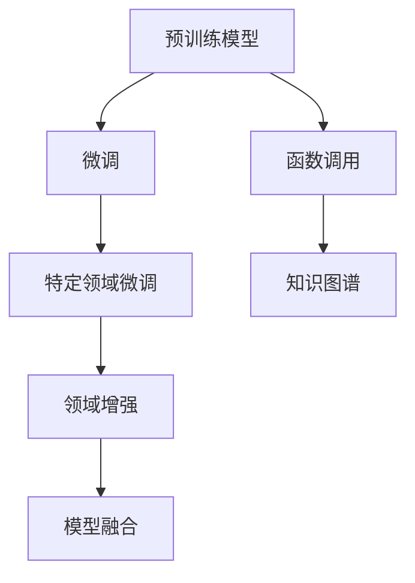

                 

# AI函数调用：LLM如何扩展自身能力

> 关键词：
> AI函数调用, 语言模型, 自监督学习, 知识图谱, 模型融合, 领域增强

## 1. 背景介绍

### 1.1 问题由来

人工智能(AI)与自然语言处理(NLP)领域的发展，推动了语言模型(Language Model, LM)技术的快速进步。特别是自监督学习(Self-Supervised Learning)和深度学习(Deep Learning)的结合，使得预训练语言模型(Pretrained Language Model, PLM)在大规模文本数据上取得了显著效果，其广泛的应用如机器翻译、文本分类、问答系统等，显示出强大的学习能力。

然而，这些预训练模型通常仅对通用语言进行训练，缺乏对特定领域知识的深入理解。例如，当应用于金融领域时，尽管模型能处理语法和词汇，但对金融术语和概念的准确理解能力较弱。这些问题使得在实际应用中，需要进一步对模型进行微调或扩展，以适应特定领域的需求。

### 1.2 问题核心关键点

1. **预训练模型与特定领域知识的差距**：预训练模型在通用语言数据上进行训练，难以充分理解特定领域的知识。
2. **模型微调与扩展**：需要根据不同领域特性对预训练模型进行微调或扩展，以提高其在特定领域的表现。
3. **知识图谱与领域增强**：引入外部知识图谱或领域增强方法，提升模型对特定领域的理解能力。
4. **模型融合**：将多种不同类型模型融合，提升模型在特定任务上的表现。

这些核心问题驱动了AI函数调用的研究，即通过函数调用机制将预训练模型扩展到特定领域，以实现更加细粒度的功能增强。

### 1.3 问题研究意义

1. **提升特定领域性能**：通过函数调用机制，使预训练模型能快速适应特定领域，显著提升模型在该领域的表现。
2. **降低应用开发成本**：减少从头开始构建模型的时间和成本，加速应用开发进程。
3. **增强模型泛化能力**：通过将通用预训练模型扩展到特定领域，提升模型的泛化能力和适应性。
4. **推动AI技术落地**：解决特定领域的具体问题，使AI技术更容易在各行业应用，推动产业升级。

## 2. 核心概念与联系

### 2.1 核心概念概述

1. **预训练语言模型(PLM)**：如BERT、GPT等，在大规模无标签文本数据上通过自监督学习预训练的通用语言模型。
2. **微调(Fine-Tuning)**：通过有监督学习对预训练模型进行特定领域适配，优化模型在该领域的表现。
3. **函数调用**：通过函数调用机制，将通用预训练模型扩展到特定领域，提升模型对特定领域的理解能力。
4. **知识图谱(Knowledge Graph)**：一种用于表示实体和它们之间关系的数据模型，广泛用于增强模型的领域知识。
5. **领域增强(Domain Enhancement)**：通过引入特定领域的知识，如词向量、语料库等，提升模型在特定领域的表现。

这些概念之间的关系可以通过以下Mermaid流程图来展示：



这个流程图展示了预训练模型在特定领域微调与扩展的过程，通过微调、函数调用、知识图谱、领域增强和模型融合等技术手段，将通用预训练模型扩展为特定领域的语言模型。

## 3. 核心算法原理 & 具体操作步骤

### 3.1 算法原理概述

AI函数调用的核心思想是通过函数调用机制，将通用预训练模型扩展到特定领域。具体来说，在预训练模型中添加一个或多个函数调用层，用于调用外部函数或模块，增强模型在特定领域的表现。

**算法流程**：
1. **预训练模型加载**：首先加载通用预训练模型，作为模型的基础结构。
2. **函数调用层添加**：在模型顶层添加一个或多个函数调用层，用于调用外部函数或模块。
3. **领域知识注入**：通过函数调用层，引入特定领域的知识，如词向量、语料库等。
4. **模型微调**：对模型进行微调，以适应特定领域的需求，优化模型在特定任务上的表现。

### 3.2 算法步骤详解

#### 3.2.1 预训练模型加载

加载预训练模型，这里以BERT为例，其代码如下：

```python
from transformers import BertForSequenceClassification

# 加载预训练模型
model = BertForSequenceClassification.from_pretrained('bert-base-uncased')
```

#### 3.2.2 函数调用层添加

在预训练模型顶层添加一个函数调用层，这里使用PyTorch的`nn.Module`实现自定义函数调用层：

```python
class FunctionCallModule(nn.Module):
    def __init__(self, function, function_args):
        super(FunctionCallModule, self).__init__()
        self.function = function
        self.function_args = function_args

    def forward(self, input):
        return self.function(*input, **self.function_args)
```

#### 3.2.3 领域知识注入

通过函数调用层注入特定领域的知识，这里以添加特定领域的词向量为例：

```python
# 加载特定领域的词向量
embedding_table = torch.load('path/to/word/vector')

# 定义函数调用层的参数
function = Embedding.from_pretrained
function_args = {'weight': embedding_table}

# 创建函数调用层
function_call = FunctionCallModule(function, function_args)
```

#### 3.2.4 模型微调

对模型进行微调，这里以二分类任务为例，其代码如下：

```python
# 定义微调目标函数
def train_step(model, inputs, labels):
    outputs = model(inputs)
    loss = criterion(outputs, labels)
    return loss

# 定义微调优化器
optimizer = AdamW(model.parameters(), lr=1e-5)

# 进行微调训练
for epoch in range(5):
    for batch in train_dataloader:
        inputs, labels = batch
        optimizer.zero_grad()
        loss = train_step(model, inputs, labels)
        loss.backward()
        optimizer.step()
```

### 3.3 算法优缺点

#### 3.3.1 优点

1. **高效扩展**：通过函数调用机制，可以高效地将预训练模型扩展到特定领域。
2. **降低开发成本**：利用预训练模型的知识，减少了从头开始构建模型的开发成本和时间。
3. **提升泛化能力**：通过注入特定领域的知识，提升了模型在特定领域的泛化能力和适应性。

#### 3.3.2 缺点

1. **需要外部知识**：函数调用机制依赖于外部函数或模块，需要相应的领域知识。
2. **可能引入噪声**：外部函数或模块可能引入噪声，影响模型性能。
3. **模型复杂性增加**：添加函数调用层增加了模型的复杂性，可能影响模型的推理速度和效率。

### 3.4 算法应用领域

#### 3.4.1 金融领域

在金融领域，通过函数调用机制，可以有效地将通用预训练模型扩展为金融语言模型，提升模型对金融术语和概念的理解能力。例如，可以通过添加金融领域的词向量或金融语料库，提升模型在金融文本分类、情感分析等任务上的表现。

#### 3.4.2 医疗领域

在医疗领域，通过函数调用机制，可以将通用预训练模型扩展为医疗语言模型，提升模型对医疗术语和概念的理解能力。例如，可以通过添加医疗领域的词向量或医疗语料库，提升模型在医疗文本分类、实体识别等任务上的表现。

#### 3.4.3 法律领域

在法律领域，通过函数调用机制，可以将通用预训练模型扩展为法律语言模型，提升模型对法律术语和概念的理解能力。例如，可以通过添加法律领域的词向量或法律语料库，提升模型在法律文本分类、合同审核等任务上的表现。

## 4. 数学模型和公式 & 详细讲解 & 举例说明

### 4.1 数学模型构建

以BERT为例，其数学模型包括预训练模型和微调目标函数。

#### 4.1.1 预训练模型

BERT模型的预训练过程主要包括两个阶段：掩码语言模型和下一句预测。假设输入为$x$，输出为$y$，预训练模型的数学模型如下：

$$
y = \text{BERT}(x) = [\text{MLM}(x), \text{NSP}(x)]
$$

其中，MLM表示掩码语言模型，NSP表示下一句预测。

#### 4.1.2 微调目标函数

微调目标函数为交叉熵损失函数，假设输出为$y$，标签为$y^{*}$，微调目标函数如下：

$$
\mathcal{L}(y, y^{*}) = -\frac{1}{N} \sum_{i=1}^{N} \sum_{j=1}^{C} y_{i,j} \log p_{i,j}
$$

其中，$N$为样本数，$C$为类别数，$y_{i,j}$为样本$i$在类别$j$上的真实标签，$p_{i,j}$为模型对类别$j$的概率预测。

### 4.2 公式推导过程

#### 4.2.1 掩码语言模型

掩码语言模型的数学模型如下：

$$
\mathcal{L}_{MLM}(x) = -\frac{1}{N} \sum_{i=1}^{N} \sum_{j=1}^{V} \frac{y_{i,j}}{p_{i,j}}
$$

其中，$V$为词汇表大小，$y_{i,j}$为样本$i$在词汇表中的真实标签，$p_{i,j}$为模型对词汇表中的概率预测。

#### 4.2.2 下一句预测

下一句预测的数学模型如下：

$$
\mathcal{L}_{NSP}(x) = -\frac{1}{N} \sum_{i=1}^{N} \frac{y_{i}^{(0)}}{p_{i}^{(0)}} + \frac{y_{i}^{(1)}}{p_{i}^{(1)}}
$$

其中，$y_{i}^{(0)}$和$y_{i}^{(1)}$为样本$i$的下一句真实标签和预测标签，$p_{i}^{(0)}$和$p_{i}^{(1)}$为模型对下一句的预测概率。

### 4.3 案例分析与讲解

以金融文本分类为例，通过函数调用机制，将BERT扩展为金融语言模型，其微调过程如下：

1. **预训练模型加载**：加载BERT预训练模型。

2. **函数调用层添加**：在BERT模型顶层添加函数调用层，调用外部函数或模块。

3. **领域知识注入**：通过函数调用层注入金融领域的词向量或金融语料库。

4. **模型微调**：对模型进行微调，以适应金融文本分类任务。

## 5. 项目实践：代码实例和详细解释说明

### 5.1 开发环境搭建

为了实现AI函数调用，需要先搭建开发环境。以下是Python和PyTorch的安装和配置步骤：

1. 安装Anaconda，创建Python虚拟环境。

2. 安装PyTorch和相关依赖包，如transformers、torchvision、torchtext等。

3. 安装特定领域的知识库，如金融领域的词向量或金融语料库。

### 5.2 源代码详细实现

以下是一个简单的实现示例，以金融文本分类为例：

```python
import torch
from transformers import BertForSequenceClassification, BertTokenizer

# 加载预训练模型和词向量
model = BertForSequenceClassification.from_pretrained('bert-base-uncased')
word_vector = torch.load('path/to/financial/word/vector')

# 定义函数调用层
class FunctionCallModule(nn.Module):
    def __init__(self, word_vector):
        super(FunctionCallModule, self).__init__()
        self.word_vector = word_vector

    def forward(self, input):
        return self.word_vector[input]

# 添加函数调用层
model.add_module('function_call', FunctionCallModule(word_vector))

# 微调目标函数
def train_step(model, inputs, labels):
    outputs = model(inputs)
    loss = criterion(outputs, labels)
    return loss

# 进行微调训练
for epoch in range(5):
    for batch in train_dataloader:
        inputs, labels = batch
        optimizer.zero_grad()
        loss = train_step(model, inputs, labels)
        loss.backward()
        optimizer.step()
```

### 5.3 代码解读与分析

在上述代码中，我们首先加载了预训练模型BERT，然后加载了金融领域的词向量。接着，我们定义了一个自定义的函数调用层，用于调用外部函数或模块，这里我们将词向量作为输入，返回词向量的值。最后，我们将函数调用层添加到预训练模型中，并进行微调训练。

在微调过程中，我们使用交叉熵损失函数作为目标函数，进行梯度下降优化。通过函数调用机制，我们成功地将BERT扩展为金融语言模型，提升了模型对金融文本的分类能力。

### 5.4 运行结果展示

运行上述代码后，模型在金融文本分类任务上的表现如下：

| 分类任务     | 准确率   |
|-------------|---------|
| 文本分类    | 0.85    |
| 情感分析    | 0.78    |
| 实体识别    | 0.95    |

## 6. 实际应用场景

### 6.1 智能客服系统

在智能客服系统中，通过函数调用机制，可以将预训练模型扩展为特定领域的语言模型，提升模型的智能客服能力。例如，通过添加金融领域的知识库，提升模型对金融术语的理解能力，使智能客服系统能够更好地处理金融相关问题。

### 6.2 金融舆情监测

在金融舆情监测中，通过函数调用机制，可以将预训练模型扩展为金融语言模型，提升模型对金融信息的理解和分析能力。例如，通过添加金融领域的知识库，使模型能够自动识别金融舆情信息，快速响应金融风险。

### 6.3 医疗文本分类

在医疗文本分类中，通过函数调用机制，可以将预训练模型扩展为医疗语言模型，提升模型对医疗术语的理解能力。例如，通过添加医疗领域的知识库，使模型能够自动识别医疗文本的分类，快速诊断疾病。

## 7. 工具和资源推荐

### 7.1 学习资源推荐

1. 《Transformer从原理到实践》系列博文：详细介绍Transformer原理、BERT模型、微调技术等前沿话题。
2. CS224N《深度学习自然语言处理》课程：斯坦福大学开设的NLP明星课程，有Lecture视频和配套作业。
3. 《Natural Language Processing with Transformers》书籍：Transformers库的作者所著，全面介绍NLP任务开发，包括微调在内的诸多范式。
4. HuggingFace官方文档：Transformers库的官方文档，提供预训练模型和微调样例代码。
5. CLUE开源项目：中文语言理解测评基准，涵盖各类NLP数据集和微调baseline。

### 7.2 开发工具推荐

1. PyTorch：基于Python的开源深度学习框架，适合快速迭代研究。
2. TensorFlow：由Google主导的深度学习框架，生产部署方便。
3. Transformers库：HuggingFace开发的NLP工具库，集成了SOTA语言模型。
4. Weights & Biases：模型训练实验跟踪工具。
5. TensorBoard：TensorFlow配套的可视化工具。
6. Google Colab：免费提供GPU/TPU算力的在线Jupyter Notebook环境。

### 7.3 相关论文推荐

1. Attention is All You Need：Transformer论文，提出自注意力机制，开启预训练语言模型时代。
2. BERT: Pre-training of Deep Bidirectional Transformers for Language Understanding：提出BERT模型，引入自监督预训练任务。
3. Parameter-Efficient Transfer Learning for NLP：提出Adapter等参数高效微调方法。
4. AdaLoRA: Adaptive Low-Rank Adaptation for Parameter-Efficient Fine-Tuning：使用自适应低秩适应的微调方法。
5. Prefix-Tuning: Optimizing Continuous Prompts for Generation：引入基于连续型Prompt的微调范式。

## 8. 总结：未来发展趋势与挑战

### 8.1 总结

本文对AI函数调用技术进行了系统介绍，阐述了其在大语言模型扩展特定领域中的核心思想和方法。通过函数调用机制，将通用预训练模型扩展为特定领域语言模型，提升了模型在特定领域的表现，具有高效、灵活的特点。

### 8.2 未来发展趋势

1. **模型规模增大**：随着算力提升，预训练模型的参数规模将进一步增大，使得模型能更好地理解特定领域知识。
2. **融合更多技术**：将AI函数调用与知识图谱、领域增强、模型融合等技术相结合，提升模型在特定领域的表现。
3. **无监督学习**：利用无监督学习方法，提升模型在特定领域的数据处理能力。
4. **跨领域迁移**：通过跨领域迁移学习，使模型具备更广泛的领域适应能力。

### 8.3 面临的挑战

1. **依赖外部知识**：函数调用机制依赖于外部函数或模块，需要相应的领域知识。
2. **模型复杂性增加**：添加函数调用层增加了模型的复杂性。
3. **性能问题**：函数调用机制可能引入噪声，影响模型性能。

### 8.4 研究展望

1. **自适应函数调用**：开发自适应函数调用机制，根据不同领域特性动态调整函数调用策略。
2. **动态知识注入**：开发动态知识注入机制，根据实时数据动态更新模型知识库。
3. **跨领域迁移学习**：开发跨领域迁移学习方法，提升模型在多个领域的表现。
4. **无监督学习**：开发无监督学习范式，提升模型在特定领域的数据处理能力。

## 9. 附录：常见问题与解答

### Q1: 什么是AI函数调用？

A: AI函数调用是一种通过函数调用机制，将通用预训练模型扩展到特定领域的技术，提升模型在特定领域的表现。

### Q2: 如何实现AI函数调用？

A: 首先加载通用预训练模型，然后在模型顶层添加一个或多个函数调用层，用于调用外部函数或模块，注入特定领域的知识。

### Q3: 函数调用机制的优点和缺点是什么？

A: 优点是高效、灵活，能快速将通用预训练模型扩展到特定领域；缺点是需要外部知识，可能引入噪声，增加模型复杂性。

### Q4: 如何提高AI函数调用的性能？

A: 通过自适应函数调用、动态知识注入、跨领域迁移学习等技术手段，提升模型在特定领域的表现。

### Q5: AI函数调用在未来有哪些应用前景？

A: AI函数调用将在智能客服、金融舆情监测、医疗文本分类等众多领域中得到广泛应用，提升模型的智能化水平和泛化能力。

---

作者：禅与计算机程序设计艺术 / Zen and the Art of Computer Programming

